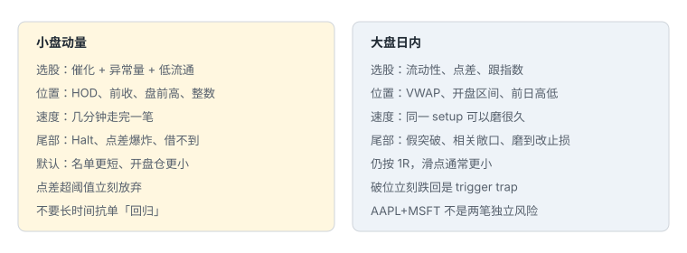
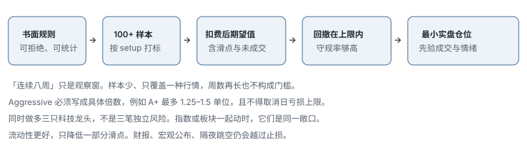

# 9.1 流程与风险

> 一句话：大盘仍然从规则、模拟、复盘到小规模实盘。「更有流动性」不等于仓位可以脱离失效点无限放大。

卷八写小盘：尾部是停牌、点差和供给突变。本卷写大盘日内：尾部更多是假突破、指数相关性，以及被同一条均价磨到自己改规则。原则共用，参数不共用。同一天不要把两套神经叠在同一组热键上。



大盘价格更「贵」，同样 1R 对应的股数更少，进出通常更容易。优势更依赖开盘区间、VWAP 反应、与指数是否同向、是否在关键日线位置。确认常常要等：量是否跟上、回踩是否守住、大盘自己有没有先坏。

## 9.1.1 学习是一条证据链



课程给出从基础、个性化策略、工具、计划、模拟、复盘、一致性到实盘的顺序。有用的部分是：后一阶段需要前一阶段的数据，不只是等待时间。「连续八周」可作为最低观察窗，但仍需足够交易样本和不同市场阶段。进入实盘应缓慢放大，先验证真实成交与心理变化。

可验证的门：

```text
书面规则
  → 按 setup 打标的足够样本
  → 扣费和滑点后期望值为正
  → 最大回撤在上限内
  → 守规率够高
  → 最小实盘仓位
```

卷八第 05 章的模拟真实性、热键防错、退回条件在这里同样适用。不要因为「大盘滑点小」就跳过最小真钱这一步。滑点小，假突破多；被磨的是时间规则和止损纪律，不是点差本身。

## 9.1.2 何时允许更积极

只允许在已经验证过的少数高质量场景增加风险。Aggressive 必须定义为具体仓位倍数，不是情绪上「更有把握」。高频普通 setup 与低频 A+ setup 分开统计，才知道放大是否合理。即使是历史最好的 setup，单笔仍可能失败，日亏损不可取消。

启发式：

```text
基础风险 = 1 单位
A 级     = 1 单位
A+ 级    = 有证据后最多 1.25–1.5 单位
违约 / 冷市 = 0–0.5 单位
```

具体倍数由个人回撤承受力决定。A+ 的定义要事先写死，例如：日线口袋够宽、指数同向、盘前量真实、VWAP 关系符合计划、点差正常。盘中临时把普通突破升级成 A+，等于取消风险系统。

## 9.1.3 四类风险，外加组合层

课程列出的四类仍然有用：

- **敞口**：名义金额、beta、隔夜、相关性；
- **波动**：振幅、新闻、财报、宏观公布与跳空；
- **恐惧 / 犹豫**：错过计划触发、迟停损；
- **冲动**：无计划追价、报复交易、过度交易。

后两项是行为风险，最终也必须用仓位、锁仓和规则控制。还应补上：流动性 / 滑点、操作 / 平台、模型 / 阶段失效、借股 / 做空、账户与合规、**相关组合风险**。

大盘特有的错觉是：因为单票进出容易，就同时开三只同向股票，以为已经分散。下一节把这件事写成数字。

## 9.1.4 相关敞口：名义上三笔，风险上可能是一笔


单票公式不变：

```text
股数 = 单笔风险 / |入场 − 止损|
名义 = 股数 × 入场
```

组合还要看：

```text
净敞口
毛敞口
板块集中
按 beta 调整的敞口
事件集中（同一天三只都等财报或同一宏观数据）
```

同时做多几只大型科技股，不是几笔完全独立的风险。指数或板块下跌可能一起触发。三笔各亏 1R，账户上可能是同一新闻的 3R。日亏损上限按相关后的合计算，而不是按「我只开了三笔常规仓」。

对冲错觉同样危险：做多一只龙头、做空一只落后股，若两者对指数的弹性不同，指数一动，两边可能一起亏。卷六的 leader–laggard 有自己的规则；没有那套规则，就不要用「对冲」给相关敞口改名。

每周复盘专门看：亏损日是否集中在同一指数方向；看似分散的多票是否同一时段离场。伪分散是大盘账户曲线变陡的常见原因。

## 9.1.5 目标设定：过程可控，金额不可控

每日固定盈利金额会诱发过度交易。先设最大损失、规则遵守率、setup 样本数，再设仓位增长门。盈亏结果应评估，但不能成为当天必须达到的任务。

可控目标：

- 每笔下单前有止损与仓位；
- 规则外交易为 0；
- 达日亏损后不再下单；
- 每日完成截图和成交核对；
- 每周只改一个规则；
- 一个复盘窗口后再决定是否加仓。

「今天还差 200 美元才达标」不是 setup。大盘午后仍然有流动性，这个借口比小盘更常见，也更伤。

## 9.1.6 止损只是预期，不是成交保证

常规时段里，流动好的大盘通常比小盘更容易按计划成交。财报、宏观发布、停牌和隔夜跳空仍可能跳过止损。停损市价控制触发、不控制价格；停损限价控制价格、不保证成交。预设亏损要留滑点缓冲。重大事件前降低仓位或退出。

大盘的「假成交保证」还有一种形式：开盘竞价和收盘竞价的量被误当成盘中可以重复的深度。竞价里能出掉的仓位，盘中五分钟未必还能以同样点差出掉。按盘中深度定仓，不要按竞价量定仓。

## 9.1.7 每周风险复盘

| 指标 | 目的 |
|---|---|
| 计划风险 vs 实际风险 | 发现滑点 / 违规 |
| 毛 / 净敞口 | 识别方向集中 |
| 相关亏损日 | 识别伪分散 |
| 按 setup 的 MAE | 校准止损 |
| 规则违约 | 管理行为风险 |
| 按事件日的盈亏 | 隔离宏观 / 财报 |
| 按仓位档的期望值 | 验证「更积极」是否有效 |

流程的终点不是「敢下大单」，而是风险增加仍能被同一套证据和规则解释。

## 9.1.8 一组数字：相关敞口怎么把日亏损提前打穿

账户单笔上限 80 美元，日亏损硬停止 240 美元（3R）。你开了三只同板块龙头，各按「独立 1R」配股：

```text
A：入场 190.00，失效 189.20，每股风险 0.80 → 100 股，计划 80
B：入场 420.00，失效 418.40，每股风险 1.60 → 50 股，计划 80
C：入场 135.00，失效 134.20，每股风险 0.80 → 100 股，计划 80
名义合计约 74,500
计划风险合计 240，刚好等于日停止
```

指数突然下跌 1%，三只一起打到失效。即使每笔都「按计划」止损，当天已经用完全部预算，而且还没算滑点和同时排队时的更差成交。你以为自己做了三笔分散的 A 级交易，账户体验是一笔 3R。

正确处理不是禁止同时看三只，而是：

- 同向、同板块的第二只，仓位自动降到 0.5 单位，第三只只能替换不能叠加；
- 或者三只共用一个组合 1R，按 beta 或名义拆开；
- 指数本身先坏时，个股新开仓降为 0。

这些数字是启发式。你要用自己的相关亏损日去校准「第几只开始算同一敞口」。

隔夜是另一层相关性。三只都拿到财报后，或者都拿到同一宏观数据，跳空往往同向。大盘隔夜比小盘「安全」只是幻觉：跳空幅度百分比可能较小，但名义金额大，绝对美元一点都不小。没有事前的隔夜计划，收盘前按日内失效处理。

## 9.1.9 「更积极」的验收，而不是自我感觉

把 A+ 写成倍数之后，还要验收它有没有真的更好。连续 30 笔 A+ 与连续 30 笔 A，分别看：

- 扣费后期望值是否更高，还是只是单笔更大；
- actual R 是否仍接近 planned R；
- 最大回撤是否按倍数同比例变差，还是更差（说明大仓改变了成交）；
- 守规率是否下降。

如果 A+ 的期望值没有更好、只是波动更大，倍数应退回 1。课程允许在少数高质量场景增加风险，不是允许你在「今天手感好」时增加风险。

恐惧和冲动在大盘上的样子和小盘不同。小盘是来不及点。大盘是磨得太久：该进不进，该出又因为「还能回到 VWAP」而拖。两者最后都要落到仓位和锁定，不落到性格批评。

## 先记住这些

- 流动性降低的是一部分滑点，不是相关性，也不是跳空。
- A+ 仓位是写死的倍数，不是盘中升级。
- 同向三只龙头按一笔风险看。

## 不要做的事

- 用小盘挑战赛的盈亏当大盘期望。
- 用每日金额目标逼自己在没有结构时交易。
- 因为「大盘出得去」就忽略组合 beta。
