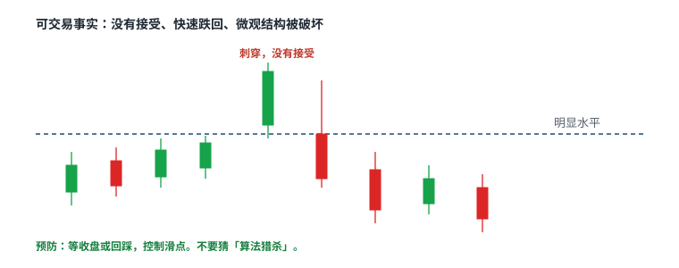

# 9.2 选股与优势

> 一句话：大盘候选来自有效催化、异常成交和清楚的日线位置。优势是自己在明确方向、形态和执行方式上的统计结果，不是「我会看盘」。

小盘选股的第一层是流通、停牌和融资。大盘选股的第一层是：这只股票今天为什么会脱离它平时的机构化节奏、你的优势窄到能不能打标、以及突破之后有没有接受——因为大盘最常见的尾部之一就叫 trigger trap。

## 9.2.1 Trigger trap：先当事实，不当阴谋



价格突破明显水平后瞬间反转，课程称为 trigger trap。「算法造成」是可能机制，但单张图无法识别具体参与者或意图。可交易事实是：

- 突破没有接受；
- 价格快速跌回原区间；
- 微观结构被破坏（更高低点没保住，或长上影后立刻走弱）。

预防方式是等待收盘或回踩、控制滑点，而不是猜某个大户在猎杀。大盘上这个现象比小盘更值得单独成章，因为明显水平周围堆着大量止损、止盈和条件单。水平越有名，穿越时越容易猛一下，也越容易立刻被打回。

处理 trap 不要自动反手。多头失败先按自己的止损走。空头是新的入场：跌回后的拒绝、跌破微观低点或回踩失败，加上借股和指数方向。把 trap 写成「被收割所以反手」，样本里会混进大量情绪单。

日志只写观察：

```text
在阻力上方成交了多少
多少秒 / 多少根 K 内回到线下
点差有没有突然变宽
回踩是否失败
指数当时在做什么
```

故事不可回测。事实可以。

## 9.2.2 盘前分析

先标缺口、盘前高 / 低、前一日与日线水平，再判断强弱。盘前量和点差决定这些水平是否可靠。一笔孤立成交不应定义关键位——大盘盘前也可能被一笔大宗或海外影子成交画出假高点。

大盘要区分：财报缺口、分析师行动、宏观同情、指数再平衡、无消息波动。开盘前写看多与看空两套条件，避免单向锚定。

候选排序不是公式，但每项都必须被考虑：

```text
新鲜催化
× 相对量
× 日线位置
× 可交易波动区间
× 流动性
÷ 事件不确定性
```

事件不确定性包括：即将公布的宏观数据、本公司或同业财报、央行讲话。不确定性高时，不是不能做，而是仓位和持有时间要单独降级，或把开盘后前若干分钟写成不做。

「没有新闻就不交易」可作为个人过滤器。大盘在指数再平衡、板块联动或宏观数据下也可能有有效语境。必须写清策略边界：你到底做新闻动量，还是做指数相关的技术结构。两种可以共存，不能混成一个胜率。

## 9.2.3 优势要窄到能打标

依次问三个问题：偏多还是偏空；偏延续还是偏反转；用何种具体入场。优势必须窄到能标注样本，例如「财报低开 + VWAP 拒绝后做空」。

「我擅长看盘」无法统计，也无法区分市场本身的方向（beta）。方向偏好可以保留，但应确认不是因为不愿在某一侧止损。很多人「只做多」其实是空头止损执行不了，不是多头期望值为正。

一份假说模板：

```text
股票池：
催化：
市场 / 板块条件：
日线位置：
盘中 setup：
入场：
失效：
退出：
持有时间：
排除条件：
估计成本：
```

然后做：样本内定义规则；样本外验证；小规模实盘验证执行；按市场阶段分层；保留所有失败和未成交。未成交很重要。大盘里「看着很好但点差瞬间变宽所以没进」如果全部消失，你会高估可执行性。

## 9.2.4 市场结构是预先定义的反应，不是事后故事

历史价格运动形成的支撑 / 阻力，课程称为市场结构。「多数价格行为随机」是教学概括，不是严格概率定理。对交易真正有用的是：预先定义的失衡、参考位和反应。

只有在相同规则的大样本中表现稳定，结构才构成优势。一张完美回踩图什么也证明不了。大盘尤其容易事后画线：流动好、形态「标准」、谁都能在收盘后画出那条斜线。练习时保存当时锚点。第 03 章会把线的层级和区域写法展开。

## 9.2.5 催化层级

优先核验：

1. 公司原始公告 / 监管文件；
2. 财报与电话会；
3. 监管或宏观官方来源；
4. 主流新闻；
5. 分析师评论；
6. 社交媒体仅作线索。

大盘新闻的速度不等于准确。标题后仍要核对原始稿。宏观日历必须与公司新闻同时监控：指数先动、个股后动时，你的「个股突破」可能只是 beta。

相对量和绝对流动性要分开。相对量高说明相对自身平时更活跃。绝对成交量和深度决定仓位是否可执行。高相对量但点差变宽的标的仍可能差。低相对量的超大市值股，绝对成交量仍可很大。用相同时段比较，避免开盘量与全天均值误比。

## 9.2.6 不把解释当证据

常见事后解释：算法扫掉止损；做市商压盘；大家都在看这个水平；大资金吸筹。除非有可核实数据，否则日志只写观察事实。

选股章的输出不是一份「今天会涨的名单」，而是：

- 3–5 只当天有理由脱离日常节奏的股票；
- 每只的多 / 空 / 不做条件；
- 明确排除：事件不确定性过高、点差异常、日线空间不足、自己没有对应 setup。

名单宜短。大盘的诱惑是「都能做」，因为都能成交。能成交不是应该成交。

## 9.2.7 盘前把一只股票写成两套条件

以一只财报后高开的大盘为例，开盘前只允许出现这种卡片，不允许出现「看多」两个字当标题：

```text
代码：大盘普通股，点差平时 0.01–0.03
催化：财报已公布，指引上修，原始稿已读
盘前：高开 4%，量相对平时同时段约 3 倍（启发式核对）
日线：前高 102.40，上方口袋到 108 附近
盘前高 103.10 / 盘前低 100.80 / 前收 98.50

看多：开盘后回踩 VWAP 或盘前低附近形成更高低，
      再破微观高，止损在该低下，目标先测盘前高
看空：开盘区间下破且 VWAP 上方拒绝，
      指数同步转弱，止损在区间高或 VWAP 上
不做：点差 > 0.08；开盘直接离开盘前区间超过 1R；
      指数与个股冲突；距下一次宏观公布不足 15 分钟
最大股数：按所选结构的止损反推，组合相关后再砍
```

这张卡的作用是消灭开盘后的单向锚定。价格往上走，你执行看多栏或放弃，而不是把看空栏改成「突破了所以更该买」。价格往下走，同理。

相对量要用同一时段比。这只股票平时开盘 15 分钟成交 80 万股，今天盘前已经 200 万，才叫异常。把它和午间均量比，人人都异常。绝对深度决定你的股数：卖一到卖三一共 4000 股，你计划买 3000，预期均价就不是卖一。

## 9.2.8 优势假说怎样才算「窄」

够窄：

```text
股票池：平时日成交额高于某阈值、点差稳定的普通股
催化：本公司财报后的第一日
市场：指数未跌破前一日低
日线：在前高或缺口下方有至少 2R 口袋
盘中：VWAP 拒绝后的空，或 VWAP 回踩后的多
入场：结构确认，不预判第一次触线
排除：开盘后 5 分钟；SSR 未确认可执行；相关敞口已满
```

不够窄：「大盘都可以」「看趋势」「跟随资金」。这些句子无法打标，也无法在阶段变化时停做。

样本外验证不是再看一遍同一年的同一批明星股。换一个波动更低的月份，换一组你不熟悉的板块，看规则是否还成立。不成立就缩小股票池，不要加例外。

## 先记住这些

- Trigger trap 是接受失败，不是猎杀故事。
- 优势必须窄到能打标、能分阶段验证。
- 相对量说明异常，绝对深度说明你能不能做。

## 不要做的事

- 把突破瞬间的刺穿当成确认。
- 用「没有新闻」一刀切掉所有指数相关结构，同时却在宏观日重仓个股。
- 把看盘手感写成无法检验的优势。
