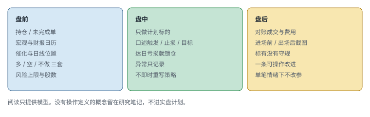

# 9.6 日常与阅读

> 一句话：日常流程的作用是减少临场决定。记录用来验证优势。推荐阅读只提供模型，不能替代自己的交易数据。

大盘可以全天成交，所以比小盘更容易「一直找」。流程必须先写避免清单，再写盘前盘中盘后。交易当事业，指的是预算、记录、版本和灾难恢复，不是每日发工资。

## 9.6.1 先写避免清单

课程建议避开无效催化、低成交量、价格极高或午间才出现的缺口。这些是作者的过滤条件，应根据自己的策略验证。不做清单通常比继续增加 setup 更能减少随机亏损。

「价格数百美元」本身不是风险。关键是波动、点差与每股止损，可通过更少股数处理。真正要避开的往往是：没有催化也没有结构的午后波动、指数已经破坏却还在个股上找旗形、自己已经达限还在看盘。

避免清单要写成可执行条件，例如：

```text
常规时段相对量低于某阈值（启发式）不做新开
宏观公布前后 N 分钟不做（启发式）
指数与个股方向冲突时，个股只减不做加
午后才出现、没有盘前结构的缺口只观察
已达日亏损后关闭图
```

## 9.6.2 记录

券商盈亏只告诉结果，不告诉 setup、规则、语境与过程。每次修改策略要保存版本和生效日，避免把不同规则混合统计。复盘需要包括跳过的交易和不做的决定，不只成交。

大盘记录多记两列：当时指数 / 板块方向；当时净敞口。没有这两列，相关亏损会被解释成「今天手感不好」。



## 9.6.3 每日流程

### 盘前

- 检查持仓和未完成订单；
- 宏观与财报日历；
- 市场 / 板块隔夜；
- 候选催化；
- 日线 / 盘前位置；
- 看多 / 看空 / 不做三套情景；
- 风险上限与股数。

### 盘中

- 只交易计划标的或符合扫描规则的新候选；
- 下单前口述触发 / 止损 / 目标；
- 达日亏损后锁定；
- 记录异常，不即时重写策略。

### 盘后

- 对账成交和费用；
- 保存入场前与出场后截图；
- 标有没有守规；
- 写一条可操作改进；
- 不在单笔情绪下改参数。

口述听起来原始，但对大盘有效：大盘给你思考时间，也给你编故事时间。能说出来的六栏，才是计划。说不出来，就还在看图。

## 9.6.4 把交易当事业

应理解为：有资本预算；有明确风险上限；有记录和版本；分离研究与执行；评估成本与机会成本；做税务 / 合规确认；有灾难恢复。

它不意味着利润稳定、可以靠每日目标发工资，或所有费用都能税前扣除。卷八第 05 章对税务身份和实体结构的降级，在大盘同样适用。大盘账户往往更大，费用结构（数据、借券、利息）更值得按月算净结果，但不因此变成「已经是一门生意所以必须每天赚钱」。

## 9.6.5 阅读的边界

K 线教科书帮助理解 OHLC 被压缩成的标签，不应作为孤立买卖信号。不同市场、周期和趋势语境下，同一根 K 结果不同。阅读后把定义转换成可回测条件，不背图鉴。

把「反脆弱」理解成从压力、错误和冲击中受益，只有在先避免破产、再谈利用波动时才有操作意义。小而可控的实验、有限下行、可恢复错误，接近实用含义。不能用这个词合理化无限摊平或承受一次巨大尾部亏损。

每读一个概念，写：

```text
主张：
操作定义：
市场 / 股票池：
入场：
失效：
需要的样本：
失败情形：
结果：
```

没有操作定义的概念只留在研究笔记，不进入实盘计划。

## 9.6.6 每周复盘

固定回答：

- 哪个 setup 扣费后贡献最大；
- 哪个时间段亏损；
- 亏损来自正常方差还是违规；
- 实际止损 / 滑点是否超预算；
- 市场阶段是否改变；
- 不做过滤拦住了什么；
- 下周只改哪一个变量；
- 哪些内容需要更多样本而不是立即结论；
- 相关亏损日有没有被当成分散。

## 9.6.7 每月经营复盘

```text
毛盈亏
− 佣金 / 费用
− 数据 / 软件
− 借券 / 利息
= 交易净结果
```

再比较：回撤、风险资本、投入时间、税务预留、对照基准、策略容量。这比「这个月绿色」更接近真实经营结果。容量尤其关键：大盘流动性好，仍存在「你的股数开始影响自己回踩」的规模。净结果变差时，先问是市场阶段、是费用，还是仓位已经超过策略容量。

## 9.6.8 一份可以贴在屏幕外的一日时间表

时间是启发式，按你的时区和可交易时段改，不要按课程作者的生活改。

```text
开盘前 60–90 分钟
  对账隔夜、读日历、标宏观位置、写 3–5 只卡片
开盘前 15 分钟
  核对行情、购买力、未完成单、组合相关限额
开盘后 0–5 分钟
  默认观察。只执行事先写明的开盘 setup
开盘后 5–90 分钟
  主交易窗。只做卡片上的触发
午间
  默认降仓或停做，除非计划明确允许
收盘前 30 分钟
  不再开需要时间展开的新结构；处理隔夜决策
收盘后 30–45 分钟
  对账、截图、守规标记、一条改进
```

时间表的作用是减少「还能做」的临场辩论。大盘全天有成交，辩论可以持续七小时。流程把辩论提前到盘前，盘中只执行。

研究时间与执行时间分开。回看旧图、改参数、读一本新书，不放在主交易窗。混在一起的结果通常是：刚读到一个新形态，下一根 K 就被命名成那个形态。

## 9.6.9 把一本书读成一条可拒绝的规则

读完某种 K 线组合，不要在计划里加「出现锤子线更佳」。写成：

```text
主张：长下影 + 小实体在 VWAP 附近增加回踩成功概率
操作定义：1 分钟实体 ≤ 全长 1/3，下影 ≥ 实体 2 倍，
          且发生在事先标好的 VWAP ± 某缓冲内
股票池：与现有大盘池相同
入场：仍要破该 K 高点，不是影线本身
失效：未改
需要的样本：至少覆盖两个市场阶段
失败：影线发生在新闻秒杀之后；指数反向
```

测完之前，锤子线只存在于研究笔记。测完之后，要么进手册，要么丢掉。不进「看盘感觉」栏目。

## 先记住这些

- 不做清单先于新 setup。
- 盘中不改规则，盘后只改一个变量。
- 阅读没有操作定义，就不进计划。

## 不要做的事

- 用励志概念覆盖尾部风险。
- 只复盘成交，不复盘跳过和不做。
- 把「当事业」理解成必须完成每日利润定额。
