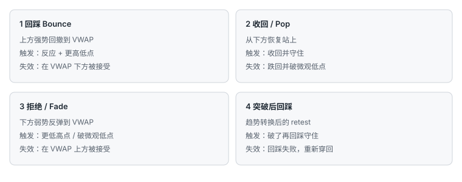

# 9.8 VWAP 框架

> 一句话：VWAP 是时段内的成交量加权均价。它可作为均衡参考，但不是单独策略。入场仍需结合趋势、位置、成交量和价格反应。

大盘交易者容易把整天的注意力钉在这一条线上。线有用，因为它是很多人都看见的当日成本参考。正因如此，它也制造拥挤、反复穿越和 trap。本章只把定义、平台差异和「四种走法怎么分工」写清。四种走法各自成章：9.9 Bounce、9.10 Reclaim、9.11 Rejection、9.12 Break-and-Retest。VWAP 作为位置、不是形状，见 5.10。

## 9.8.1 先把问答变成规则，而不是例外堆

多人反复问同一问题，通常说明策略定义还不够操作化。问答答案是补充说明，不应覆盖预先写好的风险上限。把问题分成选股、入场、止损、目标、平台、心理六类更易维护。同一规则遇到大量例外时，应缩小适用市场，而不是不断打补丁。

答案必须落到可测试条件，例如「收回 VWAP 后保持两根 1 分钟 K」，而不是「看起来站稳了」。

## 9.8.2 定义必须和平台一致

典型时段 VWAP：

```text
VWAP = Σ(价格_i × 成交量_i) / Σ(成交量_i)
```

平台可能用逐笔、成交或 K 线近似，也可能选择典型价。必须确认：

- 时段从何时开始；
- 是否包含盘前；
- 公司行动如何调整；
- 数据源；
- 锚定 VWAP 是否另算；
- 多日图是否每天重置。

这些不一致会让两个人「都在做 VWAP」却不在同一条线上。开盘前把配置写成执行规范的一部分。锚定 VWAP 与时段 VWAP 混淆，是常见失败，单独记一笔操作错误。


VWAP 与普通均线的差别是成交量加权。加权只是计算差异，不保证比任何均线更能预测价格。它反映已发生交易的平均成本参考，不能看见隐藏意图。风险是否更小，取决于止损距离、结构和执行，不取决于「用了 VWAP」。

## 9.8.3 四种 setup



| Setup | 语境 | 触发 | 失效 |
|---|---|---|---|
| 回踩 Bounce | 上方强势回撤 | VWAP 反应 + 更高低点 | 在 VWAP 下方被接受 |
| 收回 / Pop | 从下向上恢复 | 收回并守住 | 跌回并破微观低点 |
| 拒绝 / Fade | 下方弱势反弹 | 更低高点或破微观低点 | 在 VWAP 上方被接受 |
| 突破后回踩 | 趋势转换 | 破了再回踩 | 回踩失败 |

每种单独统计。不能把「碰到 VWAP」混成一个胜率。

### 回踩

强势股回撤到当日量权成本附近，量往往收缩，随后出现拒绝并形成更高低点。第一次触碰失败很常见。价格若在线下开始横盘并被接受，假说结束。上方口袋不够时，即使回踩成功也可能不够 1R。

### 收回 / Pop

价格从下方回到线上后加速，是课程里常演示的 pop。触发应定义为收回、第一次回撤或突破微观高点，而不是第一根刺穿。若入场已离 VWAP 很远，止损收到线上的风险可能过大——那是追，只是追的是均价而不是前高。开盘附近样本少、变化快，早期第一次穿越噪声最高。

成功图旁边必须放重新跌回去的路径。Pop 不是单边承诺。

### 拒绝 / Fade

弱势股反弹到 VWAP 受阻，形成更低高点再破微观低点。止损放在线上时要留出正常波动，否则来回穿越会频繁止损。若 VWAP 走平且价格反复跨越，方向优势很弱，这一类直接降为不做。做空还要满足第 07 章的借股、SSR 和指数条件。

### 突破后回踩

这是趋势转换：先有离开，再有回到线上或线附近的测试，测试守住才进。它和「第一次穿越」不是同一笔。回踩失败——价格重新穿回并在另一侧接受——立即失效，不要改口说「还在转换」。

## 9.8.4 开盘与之后的时段

开盘：样本少；点差和波动大；催化重新定价；第一次穿越噪声高。  
午后：线更稳定；量低；多次穿越可能表示区间；收盘资金流会改变。

同一规则不能默认跨时段有效。至少按开盘后前一段时间、午前、午后、收盘前分开统计。小盘卷把午后低量回撤单独标语境；大盘同样，只是大盘午后仍能成交，诱惑更大。

多次来回穿越 VWAP，说明缺少方向性。把它当成区间信息，而不是「下一次一定是真的」。

## 9.8.5 比碰线更强的反应证据

- 回撤到 VWAP 时量收缩；
- 出现拒绝影线后破高 / 低；
- 成交发生但价格不再往不利方向走；
- 回踩守住；
- 市场 / 板块同向；
- 上方或下方有足够口袋。

这些信号相关，仍需长期样本。不要把六条加成「六重确认」。

## 9.8.6 三种止损，用 MAE 比较

1. VWAP 另一侧固定缓冲；
2. 最近摆动高 / 低；
3. 接受止损：在另一侧保持 N 根。

固定缓冲简单，但不适应波动。摆动止损结构合理，但可能较远，仓位必须更小。接受止损减少影线扫损，却增加平均亏损。用最大不利波动的分布比较，不要用单笔「差点没扫到」。

无论哪一种，重大新闻直接重估时，止损都可能被跳过。事件前降仓，是规则，不是胆怯。

## 9.8.7 常见失败

- VWAP 横向，价格反复穿越；
- 开盘第一次穿越；
- 重大新闻直接重估；
- 大盘与板块强烈反向；
- 假收回后立即回抽；
- 入场离 VWAP 太远；
- 把多头亏损单改成「等到 VWAP」的波段；
- 锚定 VWAP 与时段 VWAP 混淆；
- 用小盘那套「破线就市价」去打大盘拥挤的均价。

最后一条值得单独说。小盘破当日高点，后面可能是停牌和真空。大盘破 VWAP，后面经常是算法来回扫。执行默认更耐心：等接受，用可成交限价控制最坏价，而不是把热键当策略。

## 9.8.8 日志字段

```text
VWAP setup 类型
时段起点 / 配置
一天中的时间
入场时离 VWAP 的距离
VWAP 斜率
此前穿越次数
相对量
市场 / 板块
触发 / 止损
接受持续时间
MFE / MAE
费用 / 滑点
是否与日线位置重叠
```

问答的最终答案不应是更多口头规则，而是一套能从日志中验证的明确边界。四种走法、两个时段、三种止损，已经足够把自由度爆炸。先固定一套，跑满样本，再改其中一个变量。

## 9.8.9 把常见问题写成可测试句

「假突破怎么办？」→ 接受定义为两根 1 分钟收在新侧；不满足就按未触发，已成交则按失效退出，不反手。  
「止损放哪？」→ 先选三种之一并固定两周；用 MAE 分位数比较，不单笔改。  
「开盘能不能做 VWAP？」→ 开盘后前 N 分钟（启发式）只允许回踩 / 拒绝里带额外结构的，不允许第一次穿越的 pop。  
「要不要看盘前 VWAP？」→ 若平台把盘前计入，开盘后这条线会跳；要么用仅常规时段，要么把盘前单独画一条，禁止混用。  
「目标多少？」→ 下一口袋或前日高 / 低，先够 1R；不把「回到高点」当默认。  
「亏了能不能拿到 VWAP 再走？」→ 不能。那是把失效单改成另一套策略。

每一个问答若不能变成上面这种句子，就还不能进手册。

## 9.8.10 一条回踩从进到出

```text
语境：财报后高开，价格在 VWAP 上方运行，指数同步转强
回撤：量缩，回到 VWAP 上方 0.05–0.15 的区域（启发式缓冲）
触发：区内更高低后破微观高
失效：1 分钟收在 VWAP 下，或破该更高低
目标：盘前高；若盘前高离入场不足 1R，放弃或等更近失效
仓位：按失效距离反推，再按相关敞口砍
时间：30 分钟内没有向目标推进，减半或退出（启发式）
```

把数字换成你自己的股票池后再跑样本。缓冲太窄会被正常波动扫出；太宽会让失效失去意义。MAE 分布会告诉你缓冲该有多宽，直觉不会。

Pop 的对应版本：线下横盘压缩，收回后在线上保持两根，止损在压缩低点或重新跌破 VWAP。入场已离开 VWAP 一个完整 1R 的，不做 pop，等待回踩，或放弃。Fade 的对应版本：线下弱势，反弹量缩到线，更低高后破微观低；指数必须不是强势新高。突破后回踩的对应版本：先有离开并接受，再有回到线附近的测试；没有先离开，就不是这一种。

## 9.8.11 与小盘 VWAP 的差别

小盘也可以收回 VWAP，但小盘的主要位置仍是盘前高、前收、当日高和整数。大盘把 VWAP 抬到主参考，是因为机构化交易和算法更常围着当日均价转。不要因此把小盘那套破高点市价热键搬过来，也不要把大盘「等回踩均价」搬去一张就要停牌的低价股。

一天只主做一类。VWAP 框架是大盘日的操作系统，不是两套市场的共用圣杯。

## 先记住这些

- VWAP 是参考，不是策略。
- 四种走法分桶，碰线不是入场。
- 开盘和午后不要共用未经检验的同一规则。

## 不要做的事

- 用早期不稳定的 VWAP 当铁支撑。
- 用「等到均价」给已经失效的多单延期。
- 把问答里的例外无限堆进计划。
