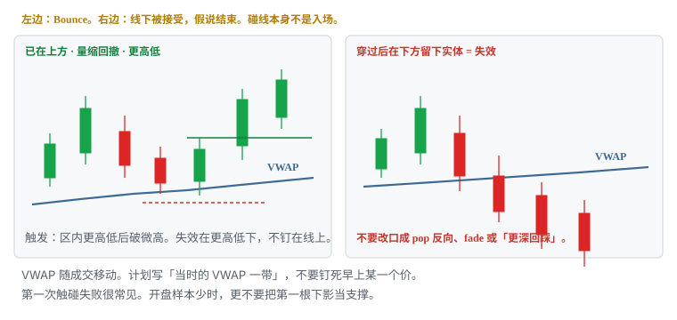
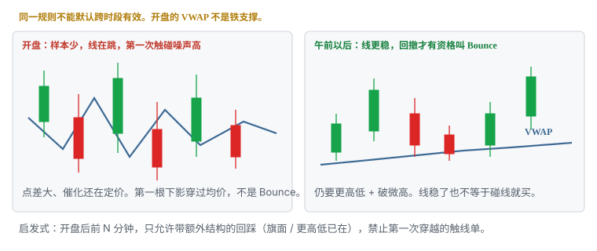

# 9.9 VWAP Bounce

> 一句话：价格已经在 VWAP 上方运行，回撤到当日量权成本附近出现反应，形成更高低点后再走。碰线不是买入。线下被接受，假说结束。

第 08 章把四种 VWAP 走法分桶：回踩 Bounce、收回 / Pop、拒绝 / Fade、突破后回踩。本章只写第一种。另外三种各有自己的门票、触发和失效，不要在同一根红 K 上改口。

VWAP 是位置，不是形状。位置怎么定义、角色怎么随接近方向变，写在卷五第 10 章，这里不重写。本章只把「已经在上方」这一条接近路径写成可下单的句子：语境、回撤、触发、失效、失败、开盘噪声。数字全部是启发式，换成你的股票池以后用 MAE 校准。



## 9.9.1 它赌什么，不赌什么

它赌一件可证伪的事：

```text
价格已经在当日量权成本上方被接受。
回撤到这条线附近时，买盘愿意在均价一带承接。
更高低点还在 → 上方延续假设还在。
在 VWAP 下方被接受 → 延续结束，这一笔结束。
```

不赌的事：

- 不赌 VWAP 是自然支撑，或机构工具本身能减小风险；
- 不赌第一次触碰一定弹；
- 不赌必须回到盘前高或当日高；
- 不赌「已经从高点跌到均价，所以该买」；
- 不赌指数反向时个股仍能独立弹；
- 不赌线下接受之后，把同一笔改成 Pop 或 Fade 就能翻本。

| | 本章：VWAP Bounce | 不是本章 |
|---|---|---|
| 位置关系 | 先在上方，再回撤到线 | 从下方第一次穿过；或一直在下方反抽 |
| 假设 | 均价一带仍有承接，更高低还在 | 收回、拒绝、趋势转换 |
| 触发 | 区内反应 + 更高低后破微高（写死一种） | 碰线；第一根下影；未收盘最低 |
| 失效 | 在 VWAP 下方被接受，或破该更高低 | 「再等一等它回来」 |
| 主风险 | 第一次触碰失败；开盘噪声；线下接受后改口 | 把四种走法混成一个胜率 |

风险是否更小，取决于止损距离、结构和执行，不取决于线叫 VWAP。入场已经离开均价一个完整 1R，还把止损钉回线上，只是追，不是 Bounce。

## 9.9.2 语境：必须已经在 VWAP 上方

门票在触发之前。缺门票，后面无论弹得多漂亮，样本都是脏的。

门票（任一否，仓位是 0）：

1. 常规时段里，价格已经在当时的 VWAP **上方**留下实体，而不是只有影线刺穿；
2. 上方停留过一段时间——不是开盘第一根同时创造高点和均价；
3. 回撤是从上方走下来的，不是从下方涨上来的；
4. 你用的 VWAP 配置与平台一致（是否含盘前、何时重置），锚定 VWAP 另算。

「在 VWAP 上方」只是描述，不是做多许可。高开缺口、开盘冲高后回落、趋势股午前第一段整理，都可能满足「已经在上方」。从下方顶上来的第一下，哪怕也碰到线，那是 Pop 或第一次穿越，记到别的桶。

斜率是第二条描述，同样不是指令：

| 观察 | 只说明 | 不说明 |
|---|---|---|
| VWAP 上倾，价格在上方回撤 | 当天成交均价在抬高，回撤仍可能是延续 | 下一根必须弹 |
| VWAP 走平，价格贴着线来回 | 缺少方向性 | 「下一次触碰是真 Bounce」 |
| VWAP 下倾，价格从上方跌回来 | 均价已经在下移 | 还能当强势回踩 |
| 价格远离 VWAP 很多再砸回来 | 相对均价延伸大 | 这是浅回撤延续 |

延伸过大时，回到 VWAP 更像整段行情的均值回归，不像「强势回撤」。启发式：回撤前高点离当时 VWAP 已经超过你计划的 2R，这一笔默认降级或放弃，除非回撤本身又长出新的、更近的微结构，并且你按新失效重新算股数。

指数和板块要同向。个股在均价上画拒绝下影，指数已经失守自己的开盘区间，大盘股这一笔的 beta 会先打你。写成一个假说：「指数仍在均价上 + 个股回踩当日 VWAP」，不要写成两个独立确认。

## 9.9.3 强势回撤长什么样

课程画面里常见：跳空或冲高之后，价格回落到 VWAP 附近出现买盘反应，随后恢复。把画面拆成可检查的零件，不要只记得「碰到线然后绿了」。

回撤段偏好：

- 速度减慢，而不是加速穿过均价；
- 回撤量相对冲动段收缩；
- 低点抬高或至少在均价一带停住，而不是一根阴线实体站到线下；
- 形状可以是斜旗、小横盘、一两根微回撤——形状另记一栏，位置记 VWAP。

量缩是配料，不是充分条件。抛压轻可能缩量，买方消失也会缩量。回撤段放量且价格仍在推进向下，承接假设变弱。绿柱不等于买完，红柱不等于卖完。

VWAP 是移动的。你 10:05 看见的线和 10:20 入场时的线可以差几分钱。计划写「回踩当时的 VWAP 一带」，不要写死 9:42 的一个价还假装在做同一笔。一带要覆盖正常影线，不要为了贴合某一根最低影去改线。


上方的「已经接受」也适用同一标准：未收盘最高价不能证明已经在上方。用还在走的 1 分钟下影宣布「回踩开始」，再在同一根里买入，两步都不成立。

## 9.9.4 触线不是触发

价格碰到 VWAP，只说明它来到了一个很多人看着的价。确认、触发、失效必须分开写。把确认当成触发，会在第一根碰到线上的 K 里买进去——那一根还可能继续向下。第一次触碰失败很常见。

| | 含义 | 你做什么 |
|---|---|---|
| 确认 | 回撤到 VWAP 一带，速度减慢，量缩，出现拒绝影或盘口吸收 | 开始盯，不下单 |
| 触发 | 事先写死的那一种价格事件已经发生 | 才允许下单 |
| 失效 | 判断错了，价格会先走到哪里 | 按计划减仓 / 平仓 |
| 时间失效 | 触发后 N 根或 N 分钟没有向目标推进 | 减半或退出，不改口延期 |

比碰线更强、仍须长期样本的观察：

- 回撤到 VWAP 时量收缩；
- 出现拒绝影线后破微高；
- 成交发生但价格不再往下走；
- 回踩守住，形成更高低；
- 指数 / 板块同向；
- 上方口袋够约 1R。

这些信号相关。不要加成「六重确认」。缺一项就把放弃的权重提高，而不是补一个故事把缺的那项解释掉。

Level 2 上刚好停在 VWAP 的大买单，是可见需求，可以撤、可以改、可以被冰山替代。它增加执行信息，不是第七个确认。盘口完整读法在卷三。本章的触发仍然是价格事件，不是某档挂单。

## 9.9.5 触发：写死一种，不要盘中挑

Bounce 的合法触发只有事先写进计划的那一种。三种常见写法，选一个跑样本，改了就是另一套策略。

| 触发写法 | 你等到什么 | 优点 | 代价 |
|---|---|---|---|
| 拒绝后破微高 | 区内出现更高低，回撤过程中的小高点被穿过并接受 | 多一次方向确认 | 入场更高，止损可能被拉宽 |
| 收回均价带 | 影线刺入后实体重新收在 VWAP 上 | 离线近 | 可能买在第一根收回里，随后再扫低 |
| 预判承接 | 线还没守住，买在带内 | 价格好、止损可以近 | 方向未确认，大盘 trap 多 |

默认推荐第一种：区内更高低后破微观高。课程表里的「VWAP 反应 + 更高低点」就是这一句。第二种当作备选，必须单独统计。第三种在大盘上尤其容易变成：均价被刺穿，你提前接了，然后线下接受——那不是便宜的 Bounce，是失效单。

「反应」要落到 K 线，不要停在「看起来有买盘」：

```text
反应 = 下影拒绝，或回撤 K 的实体停在 VWAP 一带之内
更高低 = 该回撤低点高于前一个已确认的盘中更高低，或至少未在线下留下接受
触发  = 回撤段微高被 1 分钟实体穿过（写死：收盘站上，不是影线）
```

Bid hold、收盘确认、trade-through 也要事先定死。不能四者轮流用，直到某一种看起来赚了。

大盘给你等待回踩的时间通常比小盘多，也更常面对「不给回踩」：价格在均价上方不回，或回了直接穿。不给这一笔，记 skipped，不记亏损，也不因此在下一笔改成追离均价已经 1R 的高点。

## 9.9.6 失效：在 VWAP 下方被接受

课程表写得很硬：接受在 VWAP 下，bounce thesis 失效。接受不是「影线扫过一分钱」。

事先写死一种接受定义（启发式，选一个）：

```text
A. 1 分钟收盘在当时 VWAP 下方
B. 连续两根 1 分钟收在下方
C. 价格在下方停留满 N 秒 / N 根，即使中间有影线扫回
```

大盘常用 B，减少影线扫损；用 A 会更灵敏，假失效更多；用 C 平均亏损更大，扫损更少。用 MAE 分布比较，不要用单笔「差点没扫到」。选完至少跑满一个观察窗，不要每天换。

结构失效可以和均价失效并列，但必须事先说谁先算数：

| 失效 | 价在哪 | 何时用 |
|---|---|---|
| 逻辑失效 | 当时 VWAP 下方被接受 | Bounce 假说本身死了，即使微低还没扫到 |
| 结构失效 | 该回撤更高低下方（含滑点） | 用来算股数的那一条 |
| 时间失效 | 触发后 30 分钟内没有向目标推进（启发式） | 结构还没坏，条件过期 |

实际止损加滑点。钉在「VWAP 下方 1 美分」等于把正常波动当失效。缓冲太窄会被扫出；太宽会让失效失去意义。9.8 给过 0.05–0.15 的启发式带，那是带的宽度，不是许可证。MAE 会告诉你你的池子该有多宽。

止损不要设在「VWAP 本身」。线会被刺穿。钉在线上，算法来回扫时你会先被打出去，再看它走你原来想要的方向。那不是「VWAP 策略不行」，是失效写在噪声里。

重大新闻直接重估时，三种止损都可能被跳过。事件前降仓是规则。Bounce 尤其容易在数据公布前几分钟看起来「完美回踩」。那不是 A+，那是事件单。

## 9.9.7 失败之后发生什么

主失败模式：回撤没有停在线上，实体在下方被接受，你还把它叫 Bounce。

失败常见样子：

- 只有下影刺到 VWAP，随即加速穿过，收盘在线下；
- 有一根拒绝，下一根把线还回去，并在下方留下实体；
- 回撤红量大于冲动段，价格穿过后还在推进；
- bid 在均价一带一层层撤，而不是重新排队；
- 点差在回落中拉宽；
- 指数先失守，个股的「均价反应」只是同一笔 beta。

失败后做什么（与卷五假突破同一套，位置不例外）：

1. 不等待「再给一次机会」；
2. 按失效减仓 / 平仓；
3. 检查是否成为多头陷阱；
4. **不自动反手做空**——Fade 是另一章的 setup，要有新计划、可借和 SSR 核对；
5. 记录滑点和「在上方停留了多久」。

不要做的改口：

- 「还没跌到我的线」——线已经在上方，你买的是均价带，带已经被向下接受；
- 「更深才更安全」——失效已触发，深度只增加亏损；
- 「改成 Pop，等它收回」——你的仓位已经是失效多单，收回是新的一笔；
- 「拿到 VWAP 再走」——已经在均价失效的多单，没有「再拿到 VWAP」这回事；那是把亏损单改成另一套策略；
- 「这其实是突破后回踩」——5.4 要求前面真的破过一条事先存在的线并被接受。本章门票是「已经在 VWAP 上」，不是「刚刚破了某条阻力」。

停留时间也是样本。开盘三分钟在上方一闪，和午前在上方走了四十分钟再回撤，不应丢进同一个胜率。

## 9.9.8 开盘 VWAP 噪声高



开盘附近 VWAP 样本少、变化快，不能把早期数值当稳定均衡。这不是风格问题，是计算问题：成交笔数不够，一笔大单就能把线拽走。点差和波动同时最大，催化还在重新定价。第一次穿越噪声最高。

开盘：

- 数据少，线会乱跳；
- 点差和波动大；
- 催化重新定价；
- 第一次触碰 / 第一次穿越噪声高；
- HOD 也在快速更新，扫描器连续响，诱惑你把每一声都当成独立 setup。

午前：

- 样本开始够用，均价作为成本参考才站得住；
- 第一次真正「已经在上方、再回撤」更常出现在这里，而不是 09:31。

午后：

- 线更稳定；
- 量往往更低；
- 多次穿越可能只是区间；
- 收盘资金流会再改一次。

同一条 Bounce 规则不能默认跨时段有效。至少按开盘后前一段时间、午前、午后、收盘前分开统计。大盘午后仍能成交，诱惑更大，更需要这条分桶。

启发式门（写死 N，用样本改）：

```text
开盘后前 N 分钟：
  允许：已有旗面 / 更高低，回撤到 VWAP 一带，额外结构完整
  禁止：第一次触碰、第一根下影、开盘第一段同时创造均价和高点
  仓位：默认 0–0.5 单位，除非你有单独的开盘 Bounce 样本

N 分钟之后到午前：
  主做时段。仍要门票 + 触发 + 口袋

午后：
  VWAP 走平且多次穿越 → 不做
  量相对午前显著萎缩、口袋被收盘位置切开 → 减仓或放弃
```

开盘三分钟的 VWAP 不是铁支撑。开盘三分钟的第一次下影也不是 Bounce。把早期数值当墙，是 9.8 已经点名的失败，本章把它升级成硬门：过不了门，仓位是 0。

若平台把盘前计入 VWAP，开盘那一下线会跳。要么用仅常规时段，要么把盘前单独画一条，禁止混用。混用的人「都在做 VWAP Bounce」，却不在同一条线上。

## 9.9.9 三种止损，只用于这一笔 Bounce

9.8 给过三种止损。本章不许再发明第四种，也不许盘中三者轮换。

1. VWAP 另一侧固定缓冲；
2. 最近摆动低（该回撤更高低）；
3. 接受止损：在下方保持 N 根。

固定缓冲简单，但不适应波动。摆动止损结构合理，但可能较远，仓位必须更小。接受止损减少影线扫损，却增加平均亏损。用最大不利波动的分布比较。

Bounce 的推荐起点是 2：股数按更高低来，逻辑死亡按「下方接受」来。两者冲突时——例如更高低还在，但已经有两根 1 分钟收在线下——逻辑失效优先。否则你是在用结构低给一个已经死掉的假说延期。

无论哪一种，顺序永远是：

```text
找到失效价
  → 估算能成交的入场
    → 加入滑点
      → 每股风险
        → 单笔可亏美元反推股数
          → 再按相关敞口、点差、可见深度往下砍
```

```text
每股风险 = |预计入场 − 失效价| + 预留滑点
股数     = floor(单笔可承受亏损 ÷ 每股风险)
最终股数 = min(风险允许, 购买力允许, 流动性允许, 相关后的组合上限)
```

回踩看起来止损近，并不自动等于风险小。失败时往往很快。近端失效只有在它仍然是结构低的时候才近。若回撤已经走成一条深斜线，最近还能画的低点远在均价下方 0.40 之外，这一笔的 1R 变大了。美元风险保持不变，股数必须变小。第一目标若还停在 0.20 的前高，盈亏比不够，正确动作是放弃，不是把止损上移来伪造 2R。

点差已经拉宽，先放弃。需要立即成交时，用可成交限价控制最坏买价，不成交就放弃。不要沿着均价无限改价追。大盘破 VWAP 后面经常是算法来回扫，不是小盘那种停牌真空。执行默认更耐心：等接受，用限价管最坏价，而不是把热键当策略。

## 9.9.10 口袋先够 1R


Bounce 的第一目标常常只是回撤前刚形成的高点，或下一个事先画好的阻力：盘前高、开盘区间高、整美元、日线位。不是自动回到全天高点。把目标画到当前 HOD，再倒推「值得在 VWAP 接」，是用还没发生的利润为交易辩护。

入场前量三截：

1. 入场到失效：该更高低或下方接受位，含滑点。这是每股风险。
2. 入场到第一阻力：盘前高、整美元、日线平台。这是口袋。
3. 点差与可见深度：现在能否按计划进出。

(2) ÷ (1) 先够约 1R，再谈第二目标。不够就放弃，或等更近的失效，而不是指望「均价反弹一定很远，因为这是 VWAP」。

位置有名会让回踩看起来更值得接，也常让第一阻力更近——VWAP、整美元、盘前高喜欢长在一起。重合提高关注度，不是独立概率相乘。日志主位置只标 VWAP Bounce，其余记 confluence 备注。四个名字一个价带，仍是一次事件。

空间不够是位置问题，不是胆量问题。正确动作常常是不交易。

## 9.9.11 指数、板块与相关敞口

大盘 Bounce 不是孤立的个股形态。指数先坏，个股均价上的下影经常只是同一笔下跌的局部。

硬门：

- 指数本身若已在自己的 VWAP 下方被接受，个股 Bounce 默认降为不做，除非你有单独样本证明它能逆指数；
- 同板块已有一只大票失守均价，第二只不要当成「还没跌的机会」去满仓接；
- 同时三只同向大盘股的 Bounce，名义上三笔，风险上可能是一笔。日亏损上限按相关后的合计算。

个股在日线阻力下方、盘中回踩 VWAP，应写成一个假说：「日线靠近供给 + 盘中回撤到均价」。两个参考都来自价格路径，相关性高，不能当两倍胜率。上方口袋被日线阻力切开、不够 1R，放弃。不要因为「VWAP 反应很标准」就忽略日线已经没有空间。

做多 Bounce 不需要借股。但失败后若你想反手，那已经离开本章：locate、SSR、指数条件全部要新过一遍。不要从失效多单直接热键空。

## 9.9.12 第几次触碰必须分开记账

开盘后第一次把价格送到 VWAP，和午前已经在上方运行四十分钟后的第一次回撤，和午后第五次来回穿越后的又一次「反应」，不是同一分布。

记序号时声明周期。1 分钟可能已经是第四次小触碰，5 分钟仍只是同一段回撤。不要跨周期混着数。一笔交易只能有一个主风险周期。

启发式分桶（边界用样本改）：

| 桶 | 典型语境 | 主要风险 |
|---|---|---|
| 开盘第一次触碰 | 样本少，线在跳 | 噪声、假支撑、催化未定价完 |
| 午前第一回撤，已在上方接受过 | 本章主样本 | 第一次触碰仍可能失败，要等更高低 |
| 同一段趋势里的再回撤 | 更延伸，失效可能更远 | 当第二笔，重算股数，不当加仓借口 |
| 已经多次穿越后再「弹」 | 缺少方向 | 把耗尽的反应当成「测得越多越稳」 |

测试次数没有机械规律。测得越多越容易弹、测得越多越坚固，都不是定律。VWAP 被反复刺穿又收回，更像均价附近没有方向，而不是「下一次一定是真 Bounce」。来回穿越时连续加仓，是 9.8 的失败项，本章直接禁止。

第一笔赚了，不能当第二笔的加仓理由。加仓是新的一笔，全仓风险重算后仍在预算内才谈。均价附近把仓位摊平，不叫 Bounce。

## 9.9.13 预判、确认、回踩不要事后挑


同一条 VWAP，三种进法必须分开记账。Bounce 语境里它们长这样：

| 入场 | 在 Bounce 上长什么样 | 优点 | 主要风险 |
|---|---|---|---|
| 预判 | 回撤还没守住，买在带内或带上方一点点 | 均价较低，失效可以较近 | 均价从未守住，直接穿 |
| 确认 / 穿越 | 微高被穿过的那一下 | 条件已触发 | 滑点、追在柱顶 |
| 回踩 | 微高破了再回到 VWAP 或微高附近 | 失效更清晰 | 可能不给第二次回踩 |

大盘预判的代价是 trap：刺穿你的触发，再回到原区间。预判仓位必须能扛一次刺穿后的计划失效，不能指望「大盘滑点小所以可以满仓预判」。确认单若已经走出 1R 才进，通常应放弃或等下一次更近的结构。回踩不来，记 skipped。

三种的胜率和盈亏比不会一样。把它们拼成一个策略，是在用预判的入场价和回踩的胜率欺骗自己。计划里只保留一种作为默认。另外两种若要做，各自一套日志。

## 9.9.14 一条从进到出的启发式计划

下面不是圣杯。它示范怎样把 Bounce 写成能下单的句子。数字换成你的股票池后再跑样本。

```text
语境：已 in-play 的大盘股；财报后或催化后高开；价格在 VWAP 上方运行；
      VWAP 上倾或至少不下降；指数同步在自己的均价上方
时段：过了开盘后前 N 分钟（启发式）；午前优先
回撤：量缩，速度减慢，回到当时 VWAP 上方 0.05–0.15 的一带（启发式缓冲）
门票：回撤前已有实体在 VWAP 上；不是从下方第一次穿过
触发：区内更高低后，1 分钟实体破回撤微高
失效：两根 1 分钟收在当时 VWAP 下，或破该更高低（含滑点）——逻辑失效优先
目标：回撤前高或盘前高；先够约 1R；不够则放弃或等更近失效
仓位：按失效距离反推，再按相关敞口砍；A+ 才允许到 1.25–1.5 单位
时间：触发后 30 分钟内没有向目标推进，减半或退出（启发式）
不做：开盘第一次触碰；VWAP 走平且反复穿越；入场已离线一个完整 1R；
      指数已在均价下接受；上方口袋被日线阻力切开；点差失控；事件临门
单：可成交限价，限制最坏买价；不成交放弃，不改价追
```

缓冲太窄会被正常波动扫出；太宽会让失效失去意义。把「0.05–0.15」「两根 1 分钟」「30 分钟」当成待估参数，不是物理常数。改其中一个变量，旧样本不重新贴标签去美化曲线。

教学数（不是某只股票的行情）。单笔可亏 50 美元，预留滑点 0.03：

```text
当时 VWAP ≈ 142.20，回撤低 142.28，微高 142.55
入场：破微高后 142.58
结构失效：142.28 − 0.03 = 142.25
逻辑失效：两根 1 分钟收在 142.20 下
每股风险按结构：0.33
最多 151 股，再按盘口和指数相关往下砍
第一目标回撤前高 143.10，约 1.6R；若盘前高在 142.80，先量 142.80 够不够 1R
够，才谈这一笔。不够，仓位是 0。
```

同一段若开盘 09:33 第一根下影扫到一条还在跳的 VWAP，教学结论是：门票没有发，仓位是 0。后来午前真的给出更高低，那是另一笔，用当时的线和当时的失效重算。

## 9.9.15 和另外三种 VWAP 走法的边界

本章不写另外三种。只把边界钉死，避免 Bounce 样本被污染。

| 你看见的 | 应记成 | 不应记成 |
|---|---|---|
| 已在上方，回撤到线，更高低后破微高 | VWAP Bounce | 「碰了 VWAP」 |
| 从下方收回，在线上守住 | Pop / 收回（以后的章） | Bounce |
| 一直在下方，反抽到线后更低高 | Fade / 拒绝（以后的章） | 失败的 Bounce |
| 先离开均价并接受，再回来测试 | 突破后回踩（VWAP 四种之四） | 第一次触碰的 Bounce |
| 开盘第一次来回穿 | 噪声 / first cross | 四种里的任何一种 |

事前写死做哪一种。否则每一段都能在事后找到一个赢的叫法：穿下去叫 Fade，收回来叫 Pop，再上去叫 Bounce。日志主标签只能有一个。优先级可以写成：「已经在上方的回撤优先归 Bounce；从下收回归 Pop；不要同一分钟改。」优先级改了要进变更日志。

Bounce 失败后出现的收回，是新的 Pop 候选，不是把旧仓接回来。Pop 失败后的反抽拒绝，是新的 Fade 候选。不要用一笔仓位把四种走法串成一条折线。

## 9.9.16 和旗形、突破后回踩不是同一个名字

卷五的形状仍然可用。Bounce 是位置走法，不是第三种旗面。

| 你看见的 | 应记成 | 不应记成 |
|---|---|---|
| 旗面下沿靠近 VWAP，上沿被接受 | 旗形 @ VWAP | 「旗形 + Bounce 双确认」 |
| 先破某条盘前高，回踩那条高，碰巧靠近 VWAP | 突破后回踩（5.4），VWAP 是备注 | VWAP Bounce |
| 没有旗面，只有回到均价后的更高低 | VWAP Bounce | 事后画一个旗面 |
| 一根加速 K 远离均价，你把止损钉回 VWAP | 追 | Bounce |

Setup = 形状 + 位置。形状栏可以是旗、微回撤或无形状。位置栏是 VWAP。缺一栏，样本是脏的。两个标签不要乘成两个胜率。

5.4 的门票是：前面那条阻力真的被接受过。本章的门票是：价格已经在 VWAP 上方。两条门票可以碰巧同时满足——例如刚接受的就是 VWAP 自己——那仍是一次事件。事先规定主标签，不要两章各记一次赢家。

小盘也可以回到 VWAP，但小盘主位置仍是盘前高、前收、当日高和整数。不要把大盘「等回踩均价」搬去一张就要停牌的低价股，也不要把小盘破高点市价热键搬到大盘拥挤的均价上。一天只主做一类市场。

## 9.9.17 日志字段

每笔至少记下：

```text
日期 / 时段（开盘后前一段 / 午前 / 午后 / 收盘前）
symbol
setup 主标签：VWAP Bounce
形状（旗 / 微回撤 / 横盘 / 无形状）
VWAP 配置（是否含盘前、平台、与锚定是否分开）
入场时 VWAP 价、入场价、距 VWAP 的距离
VWAP 斜率（上 / 平 / 下）
此前穿越 / 触碰次数（声明周期）
入场类型（预判 / 破微高 / 收回带）
回撤量相对冲动段（缩 / 平 / 扩）
更高低价、微高价
相对量、催化、指数 / 板块当时在自己均价的哪一侧
触发 / 失效定义（与计划一字不差）
计划 R、实际滑点、MAE / MFE
接受持续了几根、哪一周期
上方第一阻力、口袋宽度
点差、可见深度、是否事件临门
退出是否符合原计划（含时间退出）
1 / 5 / 15 分钟后的结果
若没买到：限价、当时盘口、是否下调过价格
失败改口：有没有事后改成 Pop / Fade / 5.4
```

把「限价没成交」也记进样本。把「以为是 Bounce、其实是开盘 first cross」单独打标签。过几个月要能回答：自己是在真回踩上亏，还是在噪声触线上亏。两种亏法的改正不同。前者可能是触发太早或止损太紧；后者是门票没查就进场。

复盘保存入场前后各一张，标当时已经可见的 VWAP、当时的更高低、实际成交、第一次再回踩、是否到达 1R。地图以当时为准。用后来已经挪走的 VWAP 回放「当时显而易见」，是作弊。

## 9.9.18 入场检查表

门票：

- 价格是否已经在当时 VWAP 上方被接受，而不只是影线？
- 回撤是从上方下来的，还是从下方顶上来的？
- 开盘后前 N 分钟过了没有？第一次触碰有没有被你当成主样本？
- 用的是会话 VWAP 还是锚定？有没有和盘前混用？

结构和触发：

- 回撤量有没有收缩？速度有没有减慢？
- 更高低在哪？微高在哪？写死的触发发生了没有？
- 这是该周期第几次触碰？
- 预判 / 破微高 / 收回，你记的是哪一种？

风险和执行：

- 失效价在哪？逻辑失效和结构失效谁先算数？含滑点后每股风险多少？
- 对应多少股？相关敞口砍过没有？
- 第一目标到哪，有没有约 1R？不够是不是该放弃？
- 指数 / 板块还在自己的均价上吗？
- 点差还在预算里吗？计划股数是否已经像盘口最大的一档？
- 事件、数据、停牌风险是否会让止损被跳过？
- 这笔是「看到触发」，还是只因为均价很有名、害怕错过？

任一关键项是「不确定」，仓位是 0。不确定不是「先买一点再说」。

## 9.9.19 最容易误用的地方

- 把碰线当成买入。第一次触碰失败很常见。
- 开盘三分钟用还在跳的 VWAP 当铁支撑。
- 从下方第一次穿过，事后叫 Bounce。
- 价格在下方被接受后，改口成 Pop、Fade、更深回踩或波段。
- 入场已离 VWAP 一个完整 1R，止损还钉回线上。
- VWAP 走平、反复穿越时连续加仓。
- 把会话 VWAP 和锚定 VWAP 当成同一条线。
- 旗形、HOD、整美元、VWAP 四个标签乘成四重确认。
- 指数已经失守，仍当个股均价有独立优势。
- 用未收盘最低价宣布回踩开始，再在同一根里买。
- 小盘热键打大盘均价，或大盘等回踩去打要停牌的低价股。
- 用后来更新过的 VWAP 证明当时「本来就该买」。
- 三种入场、第几次触碰、两个时段混成一个胜率。
- 失败后自动反手，却没有 Fade 的计划和借股。

## 先记住这些

- Bounce 只做已经在 VWAP 上方的回撤。从下而来的不是本章。
- VWAP 是当日量权成本参考，不是自然支撑。角色见 5.10，本章不重写位置。
- 触线不是触发。触发写死：区内更高低后破微高，或你事先选的另一种。
- 失效：在 VWAP 下方被接受。逻辑死了就走，不要用结构低给假说延期。
- 开盘 VWAP 噪声高。前 N 分钟禁止第一次触碰当主样本。
- 口袋先够约 1R。止损宽就减股。四种走法分桶，一天一个主标签。
- 0.05–0.15、两根 1 分钟、30 分钟，全部是启发式。

## 不要做的事

- 把开盘第一根下影、第一次穿越、未收盘刺穿当成 Bounce。
- 线下接受后改口成 Pop、Fade、5.4 或「等到均价」。
- 均价横向来回穿越时加仓，或把止损钉在 VWAP 这条线上。
- 指数反向、口袋不够、点差失控时仍按「标准回踩」满仓。
- 用小盘破高点市价去打大盘拥挤的均价。
- 把预判的入场价和回踩的胜率拼成一个不存在的策略。
