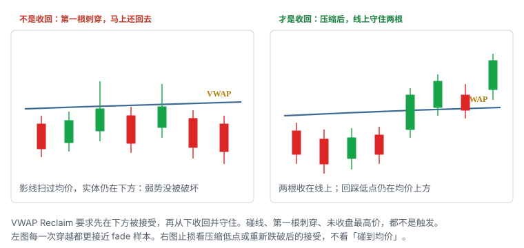
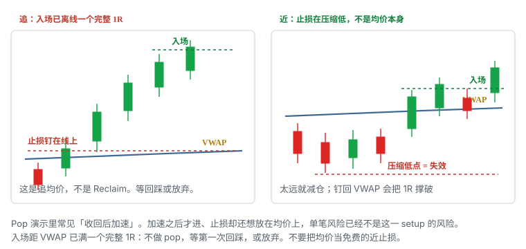

# 9.10 VWAP Reclaim

> 一句话：价格先在 VWAP 下方被接受，再收回并守住。第一根刺穿不是入场。入场已经离开均价太远，止损不要钉回线上。

第 08 章把 VWAP 拆成四种走法。本章只写其中一种：**收回 / pop**。从下方回来、收回、守住。另外三种——上方回踩、下方拒绝、突破后再回踩——各是另一篇，不要把「碰到 VWAP」混进这一个胜率。

课程画面里常演示价格从线下拉回后加速，也叫 pop。加速是结果，不是定义。定义必须在加速之前就能写出来：曾经在下方被接受，后来从下向上收回，并且在线上保持。第一根刺穿、未收盘最高价、扫描器从「下方」跳成「上方」，都不是触发。

VWAP 本身的计算、平台配置、开盘样本少、三种止损怎么用 MAE 比较，已经写在第 08 章和 5.10。这里不重写公式。读完本章，日志里应能单独标出 `VWAP_RECLAIM`，并且能回答三句：在下方待过没有、守住了没有、入场离当时的 VWAP 有多远。

数字——两根 1 分钟收在线上、开盘后前 N 分钟不做第一次穿越、入场离 VWAP 已满一个完整 1R 则放弃 pop、缓冲 0.05–0.15——全部是启发式。换成你的股票池以后，用自己的 MAE 分布校准。

## 9.10.1 从下方收回，不是上方回踩

两种走法都经过 VWAP，接近方向相反。

| | 回踩 Bounce | 本章：收回 / Pop |
|---|---|---|
| 此前位置 | 已经在 VWAP **上方**运行 | 已经在 VWAP **下方**被接受 |
| 接近方向 | 从上往下回落到均价附近 | 从下往上穿过均价 |
| 赌什么 | 强势回撤后均价附近有承接 | 均价从阻力候选变成支撑候选 |
| 触发 | 区内反应 + 更高低点 | 收回并守住，或守住后的第一回撤 / 破微观高 |
| 失效 | 在 VWAP 下方被接受 | 跌回并破微观低点 |
| 典型错误 | 第一次触碰就当支撑 | 第一根刺穿就当已经收回 |

Bounce 的价格路径从来没有把「当日均价以下」当成被接受的状态。Reclaim 必须有这一段。缺了下方，后面无论涨多猛，都不该用这个名字。那可能是本来就在线上的延续，或是 5.10 说的「在 VWAP 上方」这种描述，不是本章的 setup。

同一日可以先 fade、再 reclaim。那是两笔，日志打两个 attempt。上午在线下被拒绝，不能自动升级成「所以下午的穿越一定是真的」。

## 9.10.2 先被下方接受，再谈收回

严格定义用三步：

1. 价格先在当日会话 VWAP **下方**被接受——不是一根下影扫过；
2. 从下向上穿过当时的 VWAP；
3. 在上方**守住**：实体留在线上，随后的回落不把线还回去。

「接受在下方」看起来更像：连续若干根收在线下，或横盘压缩的主体在线下。一根长上影先插到线上又回到线下，是试探，不是已经收回。一根长下影先插到线下又回到线上，是上方股票的回踩噪声，也不是本章——它从未在下方待过。

用哪一根 K 的周期，必须事前写死。1 分钟先站上、5 分钟还在下方，不是「已经 reclaim」。选择周期后，入场、失效和样本用同一周期。大盘默认用 1 分钟定义接受，是因为均价附近的来回发生得很快；改成 5 分钟必须单独成桶，不要和 1 分钟样本合并。

会话 VWAP 会动。计划写规则（「收回当时的 VWAP 并守住」），不写死一个上午就不会再改的价。9:45 的 100.20 和 10:20 的 100.35 不是同一条线。入场时刻记下当时的 VWAP 数值，复盘才对得上。

盘前是否计入，跟第 08 章同一条：开盘前写进执行规范。盘前已经完成一次「收回盘前 VWAP」，不是常规时段的 reclaim。开盘后再跌破再收回，才是开盘后这一笔。

## 9.10.3 第一根刺穿不是触发



左图每一次穿越都可以被事后叫成 pop。没有守住，线下的供给叙事没有被破坏。右图才是结构：线下压缩，两根收在线上，回踩低点仍在均价上方。

第 08 章把可测试条件写成「收回 VWAP 后保持两根 1 分钟 K」。本章沿用这个启发式，并把它钉死成二选一，不允许盘中改口：

- **收盘确认**：连续 N 根（默认两根 1 分钟）实体完全在当时 VWAP 上方；或
- **回踩确认**：穿过后回踩，回踩低点仍在线上方（或只刺穿影线），随后再抬高。

两种都比「最高价碰过 VWAP」严。未收盘 K 的最高价更不能当已经收回。用未收盘最高价统计，会把大量假信号算进样本——大盘均价附近尤其如此，算法会来回扫这一带。

「第一根刺穿」失败很常见，不是需要补丁的例外。它就是 fade 的原料。你若把第一根刺穿当成 reclaim 入场，等于在做一笔没有写进计划的反手：空头叙事还在，你站到了多头这一边。

开盘附近样本少、VWAP 乱跳，早期第一次穿越噪声最高。第 08 章已经把启发式写明：开盘后前 N 分钟不允许第一次穿越的 pop。本章不另开例外。想做开盘，去做带额外结构的回踩或拒绝，并且记在那一章的桶里。

## 9.10.4 什么不是 VWAP Reclaim

下面这些经常被误叫成收回 / pop。它们可以是别的 setup，但不是本章。

| 看见什么 | 它实际是什么 | 为什么不是 reclaim |
|---|---|---|
| 任意一根穿过 VWAP 的影线 | 试探 | 没有守住 |
| 本来就在上方，回落到线再弹 | Bounce | 没有先在下方被接受 |
| 线下反弹到线，形成更低高后向下 | Fade | 方向相反 |
| 已经离开均价，后来回到线附近再测 | 突破后回踩 | 触发是回踩守住，不是第一次收回 |
| 扫描器显示「现价在 VWAP 上」 | 状态描述 | 没有路径，没有接受 |
| 高开后从未到过线下 | Gap and Go / 线上延续 | 缺下方这一段 |
| 昨收收回，VWAP 还在另一处 | 红翻绿 | 位置是昨收，不是会话 VWAP |
| 锚定 VWAP 收回 | 另一条线 | 第 08 章：混淆单独记操作错误 |
| 开盘第一分钟颜色闪过均价 | 未收盘噪声 | 样本不够，线还在跳 |
| 已经离开均价一个完整 1R 才买 | 追 | 止损若钉回线上，风险已不是 pop 的风险 |

一只股票可以同时满足红翻绿和 VWAP reclaim。昨收和 VWAP 是两根线。日志写你到底做的是哪一根。主标签只留一个，其余当语境字段，否则同一笔会被数两次。

也不要把「价格现在比 VWAP 高」当成已经完成的收回。那只说明状态。状态没有触发，没有失效，没有仓位。

## 9.10.5 三种合法触发，盘前写死一种

第 08 章说：pop 的触发应定义为收回、第一次回撤或突破微观高点，而不是第一根刺穿。三者不要事后任选。

| 触发 | 何时发生 | 入场带 | 止损候选 | 主要代价 |
|---|---|---|---|---|
| 收回并守住 N 根 | 线上连续接受 | 第 N 根收盘附近 | 压缩低，或重新跌破被接受 | 守住期间已经离开，止损变远 |
| 收回后第一次回踩 | 回踩仍在线上或只刺影线 | 回踩低点附近再抬高 | 该回踩低点 | 可能不给回踩；回踩变 trap |
| 收回后破微观高 | 守住后突破整理高 | 微观高被接受一带 | 微观低 / 整理低 | 破高即是确认，口袋要够 1R |

三种的滑点、胜率、盈亏比不会一样。不能拿守住版的「已经确认」和回踩版的「价格更好」拼成一个不存在的策略。预判——均价还没被收回就提前买——默认不算本章。预判是在做 fade 的反面，失效近、方向未确认，记到另一桶。

选一种写进当天卡片。改触发等于换策略，要写进变更日志，旧样本不重新贴标签。

「在上方成交」四个字要落到订单上。守住版的入场，是第 N 根确认的那一带，不是远远高于 VWAP 的追价。回踩版的入场，是回到均价附近再抬高的那一带，不是第一次穿越的最高价。破微观高版的入场，是整理高被接受，不是整理高上方 0.80 美元才追。

## 9.10.6 压缩、斜率、穿越次数

比碰线更强、而且和 reclaim 特别相关的观察：

- 线下横盘压缩，振幅收窄，量相对收缩；
- VWAP 本身不是直线下跌——均价走平或开始抬，说明下方成交不再把成本打低；
- 此前穿越次数少。已经来回扫了五次的均价，下一次「收回」更像区间，不是方向；
- 收回时量回来，但价格能停在线上，而不是一根长上影把量打完；
- 指数 / 板块没有在同一分钟里失守自己的均价或开盘区间。

这些信号相关，不要加成「六重确认」。压缩是语境，不是触发。没有压缩、直接从深水区一根大绿 K 穿过 VWAP，图形也叫收回，质量通常更差：止损只能放到那根大 K 的低点，往往已经远过 1R，而线上还没有接受。

斜率只是描述：

| 观察 | 只说明 | 不说明 |
|---|---|---|
| VWAP 下倾，价格在下方压缩 | 当天均价仍在下移 | 下一次穿越会弹起来 |
| VWAP 走平，价格贴着线 | 缺少方向性 | 「再来一次就是真的」 |
| VWAP 开始上倾，价格收回 | 收回过程中有成交把均价抬高 | 必须走到前高 |
| 价格远离 VWAP 很多 | 相对均价延伸 | 必须立刻回归，或必须继续 pop |

多次来回穿越 VWAP，说明缺少方向性。把它当成区间信息。区间里的每一次穿越都不是新的 reclaim 样本——同一段 chop 只记一次「未触发 / 放弃」，不要把每一根刺穿都标成 attempt 去稀释失败率。

## 9.10.7 失效：跌回并破微观低点

第 08 章给 reclaim 的失效是：跌回并破微观低点。微观低点必须事先指得出来，不能是「感觉结构坏了」。

三个常用候选，选一个写死：

1. **压缩低点**：线下整理的最低收盘或最低价（选一种，全程只用这一种）；
2. **收回后的第一个更高低点**：守住之后那次回踩的低点；
3. **接受止损**：重新收在 VWAP 下方并保持 N 根。

固定把止损放在「VWAP 另一侧某一个 tick」，大盘均价附近会被正常波动扫出。影线刺穿均价，不等于跌回被接受。钉在线上等于把噪声当成失效。

若选压缩低点，而压缩已经有 0.80 美元宽，入场又在 100.40，单笔风险可能超过你的 1R。用仓位解决，或改用更近的微观低，或改等回踩，或放弃。不要把止损往上塞进 K 线实体中间，来「制造」一个好看的盈亏比。假说还没失效，你却先走了，样本会说止损太近；假说已经失效，你还等均价，样本会说你在扛。

重大新闻直接重估时，任何一种止损都可能被跳过。事件前降仓，是规则。reclaim 图形再干净，也挡不住一条宏观数据。

## 9.10.8 止损不要钉在 VWAP 上，尤其已经很远



这是课程反复强调、也是 pop 最容易被用错的一条。若入场已离 VWAP 很远，把止损收到线上，单笔风险可能过大。那是追，只是追的是均价，不是前高。

「远」必须量化。本章用这条启发式：

```text
入场距当时 VWAP 的距离 ≥ 你这笔计划的 1R
  → 不做 pop
  → 等第一次回踩（那一笔改记为回踩确认，仍用 reclaim 主标签也可以，但触发栏必须写 pullback）
  → 或不做
```

左图的错误不是「不该看 VWAP」，是入场位置已经把均价从近端失效变成远端愿望。右图的止损在压缩低点。若压缩低点也太远，减仓，直到股数 × |入场 − 失效| 回到 1R；减完小于最小可交易单位，就放弃。

三种止损——VWAP 另一侧固定缓冲、最近摆动、接受止损——第 08 章已经比较过。Reclaim 上的用法：

- 固定缓冲只适合入场就在线附近、而且你已经用 MAE 校准过缓冲宽度；
- 摆动 / 压缩低结构清楚，但常较远，仓位必须更小；
- 接受止损减少影线扫损，平均亏损更大，需要时间规则配着，否则假收回会把你多关一会儿。

无论哪一种，都不要在已经离开均价之后，临时改口「止损还是 VWAP，因为课程说 VWAP 重要」。线重要，不等于线是你的止损。

## 9.10.9 入场离 VWAP 一个完整 1R：不做 pop

把 9.10.8 落成下单前的算术，而不是盘中感觉。

```text
当时 VWAP     = V
计划入场       = E
计划失效       = S
计划 1R 美元   = R_dollar
每股风险       = |E − S|
距均价         = |E − V|

若 |E − V| ≥ R_dollar / 股数的那个每股 1R
或更简单：若 |E − V| ≥ 你今天这只股票预设的每股 1R
  → 禁止把 S 设成 V 附近
  → 禁止以 pop 的名字市价追 E
```

例：预设每股 1R = 0.35 美元。VWAP 100.20，价格已经 100.60。距均价 0.40，已经超过 1R。这时还把止损放在 100.15，每股风险 0.45，名字却叫 reclaim，是在用 setup 名称掩盖追价。正确动作：等回踩到 100.25–100.35 一带再看守住与否；不来就 skipped。

「pop 就是要追加速」是口诀，不是规则。加速发生在触发之后，是持仓中的 MFE，不是入场许可。你没有赶上第一段，就没有这一笔。踏空记 skipped，不记亏损，也不因此把下一笔改成市价。

加仓同样受这条约束。第一批在 100.32 进，价格到 100.70 再加，第二批的失效如果还是 100.10 的压缩低，全仓风险会超过预算。第 05 章：每次加仓重算总仓到止损的美元风险。Reclaim 的加仓默认只允许在第一次回踩守住时发生，并且总风险仍 ≤ 1 单位。

## 9.10.10 开盘第一次穿越默认不做

开盘：

- VWAP 数据少，线会乱跳；
- 点差和波动大；
- 催化还在重新定价；
- 第一次穿越噪声最高。

第 08 章的启发式：开盘后前 N 分钟只允许回踩 / 拒绝里带额外结构的，不允许第一次穿越的 pop。N 先写 15 或 30，选一个，用两周样本看，不要每天改。

开盘三分钟里，价格从线下扫到线上再扫回去，看起来每 20 秒都有一次「收回」。那是开盘区间，不是 reclaim。开盘区间的离开，记在第 07 章的速度线 / 开盘结构里，不要事后贴上 VWAP pop 来美化。

合法的「开盘附近 reclaim」至少还要同时有：下方已经出现过一段可识别的横盘或更高低，而不是开盘第一根的随机穿越；指数没有在同一分钟里反向跳。即使如此，仍进「开盘桶」，不和午前样本合并。

09:31 的 VWAP 不是铁阻力，也不是铁支撑。它几乎还不是一条线。

## 9.10.11 午前、午后、收盘前分桶

同一条 reclaim 规则不能默认跨时段有效。至少四个桶：

| 时段 | 线的稳定度 | 主要风险 | 本章默认 |
|---|---|---|---|
| 开盘后前 N 分钟 | 差 | 第一次穿越、点差 | 不做 pop |
| 午前 | 开始够用 | 假收回后 flush | 主做时段 |
| 午后 | 更稳 | 量低、来回穿越表示区间 | 降权；多次穿越直接不做 |
| 收盘前 | 稳，但 flow 会改 | 竞价、隔夜 | 不把 reclaim 拖成隔夜 |

午后大盘仍能成交，诱惑比小盘更大。量低时的收回，经常走不出 1R 口袋，却足够把你的止损扫到压缩低。午后若 VWAP 走平且已经穿越 ≥ 3 次（启发式），方向优势很弱，这一类直接降为不做——和第 08 章对 fade 的处理相同，只是方向反过来。

收盘竞价可以把「已经守住的收回」一次性还回去。计划若写日内平仓，不要在 15:50 还用 pop 的名字开新仓。已有仓位按时间退出，不按「均价还在下方所以还能再抱一会儿」。

## 9.10.12 指数、板块、口袋

大盘 reclaim 很少是孤立事件。个股收回自己的 VWAP、指数同时失守，常常是同一风险因子的两种显示。写成一个假说，用组合敞口去管，不要当成「个股已经转强」去加仓。

入场前问口袋，不问「pop 能走多远」：

- 线上到下一供给（盘前高、开盘区间高、日线阻力、整美元、HOD）有没有 ≥ 1R；
- 若下一供给就贴在均价上方 0.12 美元，守住版入场可能永远不够 1R——放弃，或等那个供给被接受后再换 setup；
- 口袋宽度是选股输入，不是目标承诺。走到口袋边缘按计划减，不要改成「均价都收回了一定到前高」。

指数条件写死一种：

```text
指数当时不在自己的 VWAP 下方加速下跌
板块领先股没有刚跌破当日结构
```

不满足就停。个股图再干净，也不把指数当滤镜关掉。第 04 章：四个确认维度相关，不能乘成超高胜率。

相对量：收回那一段相对同时段是否回来。低量穿越均价，更像暂时真空，不是需求接管。高量但价格不在线上停留，更像解套盘和算法在均价换手。量没有方向。看反应。

## 9.10.13 和大盘另外三种 VWAP 切开

主标签怎么选，第 07 章已经给过优先级启发式：有明确 VWAP 四种之一就归 VWAP。四种之间还要再切一刀，否则 bounce 和 reclaim 会抢同一段 K 线。

| 你看见的路径 | 主标签 | 不是 |
|---|---|---|
| 上方强势，回落到线，更高低 | Bounce | Reclaim |
| 下方接受，收回，守住 | Reclaim | Bounce、Break-and-retest |
| 下方弱势，反弹到线，更低高后向下 | Fade | 失败的 reclaim |
| 先离开并接受，再回到线附近测试 | Break-and-retest | 第一次收回 |

Reclaim 和 break-and-retest 最容易混。差别是有没有「先离开」。第一次从下穿过并守住，是 reclaim。已经在上方运行一段时间，中间回落到线再守住，是 bounce 或 break-and-retest，取决于此前是否有过一次被接受的离开。不要把第一次收回之后的第一次回踩，既记成 reclaim 的 pullback 触发，又记成另一种 setup。同一笔一个名字。

Fade 失败后价格被线上接受，可以变成 reclaim。必须等 fade 仓清掉（如果有），再按 reclaim 的接受规则重新评估。同一根 K 上空完又多，是第 07 章说的「在同一根上临时切换」。禁止。

## 9.10.14 和红翻绿、HOD、昨收切开

位置不同，setup 不同。

| 位置 | 章 | 先到哪一侧 | 收回的是什么 |
|---|---|---|---|
| 昨收 | 5.6 红翻绿 | 昨收下方 | 昨天的收盘价（静态） |
| 会话 VWAP | 本章 | VWAP 下方 | 当天到目前为止的量权均价（动态） |
| HOD | 5.10 | 当日高下方 | 不是收回，是突破新高 |
| 开盘区间上沿 | 9.7 | 区间内或下方 | 离开区间，不是均价 |

昨收昨天就知道，盘前画好。VWAP 开盘后才开始长，每笔成交都在挪。用昨收的规则去做 VWAP，或反过来，样本从第一秒就是脏的。

两者叠在一起时——低开，昨收 100.00，VWAP 99.70，价格从 99.40 收回——先问你的失效钉在哪。钉在昨收，就是红翻绿，VWAP 只是途中的线。钉在 VWAP 的守住与否，就是 reclaim，昨收是上方口袋或目标。不要说「两个确认所以仓位 ×2」。

HOD 更不是 reclaim。均价收回之后继续走到新高，那是持仓中的目标管理，或另一笔 HOD 突破。第一笔在均价处已经完整：触发、失效、目标可以是盘前高而不是 HOD。到了盘前高还想持有去打 HOD，必须事先写在计划里，并且口袋和风险单独算过。

## 9.10.15 成功路径必须对照跌回去

第 08 章写过：成功图旁边必须放重新跌回去的路径。Pop 不是单边承诺。课程幻灯也是两条路并排：收回后加速，以及冲高后重新回落。

跌回去的典型顺序：

1. 第一根刺穿或勉强两根收在线上；
2. 量在穿越时放大，随后立刻缩，价格走不动；
3. 回踩把 VWAP 还回去，实体回到下方；
4. 破微观低 / 压缩低，假说结束；
5. 有时直接 flush，连压缩低一起打穿。

「假收回后立即 flush」是第 08 章列出的常见失败，必须进统计，不能只当轶事。大盘里它长得很快：均价附近流动性厚，假方向的反向订单也厚。你的退出必须在微观低被接受时发生，而不是等 flush 走完才承认。

对照规则：

- 没有跌回去的样本，不许给 pop 写胜率；
- 复盘时成功和失败各留一张入场前的图，后面的加速 K 挡住；
- 失败若是因为止损钉在 VWAP 上被影线扫出、结构其实还在，记执行问题，不要偷偷改失效定义去拯救该笔。

二次收回是新的一笔。第一次已经破微观低，旧仓应已走。第二次要重新满足：下方再次接受或再次压缩、再次守住、口袋还够、穿越次数还没把线磨成区间。不要因为「刚才那笔方向是对的，只是止损太近」把股数加回去。

## 9.10.16 数字例：压缩后收回

教学数，不是这一只股票的承诺。把数字换成你的池子再跑样本。

```text
时段：10:05–10:25（午前桶）
当时 VWAP：约 100.18 → 100.22（缓升）
下方：10:05–10:14 在 99.78–100.10 压缩，主体收在线下
压缩低：99.78（最低价口径）
指数：同期在自身 VWAP 上方走平，没有加速下跌
上方口袋：盘前高 100.85，中间没有更近的日线供给
```

**守住版。** 10:15 收 100.26，10:16 收 100.31，两根实体在当时 VWAP 上方。触发写死为两根 1 分钟。入场限价 100.33。若止损用压缩低 99.78，每股 0.55，口袋到 100.85 只有 0.52，不够 1R——要么放弃守住版，要么改触发。

**改成回踩版。** 10:17–10:18 回踩低 100.20，当时 VWAP 100.21，低点只刺影线。更高低成立后破 100.31。入场 100.34。失效 100.20 − 0.06 缓冲 = 100.14。每股 0.20。目标 100.85，约 2.5R。这才是可做的 reclaim，名字没变，触发栏必须写 `pullback`。

**接受止损版。** 同一入场 100.34，失效改为「重新收在 VWAP 下并保持两根」。平均亏损可能大于 0.20，因为你允许它先回到线下。用 MAE 分位数决定你能不能活在这种止损里，不要单笔觉得「没那么容易跌回去」。

点差若在穿越时从 0.01 拉到 0.04，限价要限制最坏买价。未成交就放弃，不能顺着向上改价去追那一次穿越。追到 100.50 还叫 100.34 的计划，是另一笔。

## 9.10.17 数字例：已经离开均价还追

同一段后面。

```text
10:16 已经守住
10:19 价格 100.72，VWAP 100.24，距均价 0.48
你的预设每股 1R：0.30
盘前高 100.85，剩余口袋 0.13
```

此时买入：

- 止损若钉 VWAP 100.24，每股风险 0.48，已经 > 1R，且口袋只剩 0.13，盈亏比崩溃；
- 止损若放 10:18 回踩低 100.20，同样远；
- 止损若放 100.55 的某个随机 K 线低点，假说还没坏你就会被扫，这不是 reclaim 的失效。

结论：不做 pop。等下一次回到均价附近的回踩，或放弃。若你已经在 100.34 持有，这是持仓管理：到 100.85 按计划减，不要在 100.72 再加一批却把全仓止损留在 100.20。

开盘版对照：09:32 第一根 1 分钟上影扫过仍在跳动的 VWAP，收盘回到线下。入场若发生在影线最高价，止损无论放哪都像赌博。这一笔连「下方压缩」都没有，直接记未触发。不要在复盘时因为午后真的涨了，把 09:32 的刺穿改成「早期 pop」。

## 9.10.18 执行：限价，不要小盘热键

大盘破 VWAP，后面经常是算法来回扫，不是小盘那种停牌连锁。第 08 章：不要用小盘那套「破线就市价」去打拥挤的均价。执行默认更耐心：等接受，用可成交限价控制最坏价。

```text
触发价可见
  → 限价 = 触发 + 预先写死的最坏偏离（启发式，例如 0.02–0.05，按股票波动校准）
    → 未成交：放弃这一次穿越，等回踩或下一次接受
      → 禁止把限价一路上移去「还是要进」
```

热键可以存在，但热键绑定的是「接受已经发生之后的限价」，不是「VWAP 被打印就市价」。市价在均价附近的代价，往往不是滑点几个 tick，而是买在假收回的柱顶。

Level 2 / 成交明细：比碰线更强的观察，是实际成交发生但价格不再往线下走。大盘上这仍然只是辅助。你看不到隐藏意图。盘口墙可以撤。计划仍以 K 线接受和结构失效为准。

借股、SSR 与本章默认方向无关——reclaim 是多头。若你在同一分钟想反手做 fade，先满足第 07 章的空头条件，并且那是另一张卡片。

公司行动日、分红除权、平台是否把盘前计入 VWAP，开盘前核完。数据错一项，今天的 reclaim 样本作废，不是「差不多算了」。

## 9.10.19 计划模板

下单前按这个顺序填。填不完就不点。

1. 确认平台 VWAP：会话起点、是否含盘前、与券商报价一致。锚定 VWAP 若画着，分开，禁止混用。
2. 标出当时 VWAP、压缩区间、微观高 / 低、盘前高、开盘区间、昨收、日线供给、整美元、HOD。
3. 确认价格已经在 VWAP 下方被接受，不是一根影线。
4. 时段：开盘后前 N 分钟直接停；午后看穿越次数和量。
5. 指数 / 板块条件满足与否。
6. 写死一种触发：守住 N 根 / 第一次回踩 / 破微观高。
7. 写死失效：压缩低、回踩低、或接受止损。加上滑点。
8. 量入场到当时 VWAP 的距离。≥ 1R 则禁止 pop，改回踩或放弃。
9. 量到第一目标的 R。不够 1R 就改等待或放弃。
10. 股数 = 可亏 ÷（入场到失效 + 滑点），再取流动性、相关敞口、开盘更小上限中的最小值。
11. 最坏限价、未成交怎么办、时间退出（例如 20–30 分钟没有向目标推进则减半或退出，启发式）。
12. 假收回立刻 flush 的预案：微观低被接受就走，不加仓，不改成波段。

六栏压成一张卡：

| | |
|---|---|
| 位置 | 会话 VWAP（动态；记下入场时刻的值） |
| 前置 | 已经在下方被接受；最好有压缩 |
| 触发 | 收回并守住 N 根，或守住后的第一回踩 / 破微观高（择一） |
| 失效 | 压缩低或微观低被向下接受；不要默认钉在 VWAP 上 |
| 放弃 | 第一根刺穿；开盘第一次穿越；入场离 VWAP ≥ 1R；口袋 < 1R；来回穿越 |
| 目标 | 下一口袋，先够 1R；不默认「回到前高」 |

和第 08 章那条 pop 对应版本保持一致：线下横盘压缩，收回后在线上保持两根，止损在压缩低点或重新跌破 VWAP。入场已离开 VWAP 一个完整 1R 的，不做 pop，等待回踩，或放弃。

## 9.10.20 日志与复盘

第 08 章的 VWAP 字段全部保留，reclaim 再加几列，否则四种走法仍会混。

```text
setup = VWAP_RECLAIM
会话起点 / 是否含盘前 / 数据源
一天中的时间（开盘 N 分钟 / 午前 / 午后 / 收盘前）
入场时刻的 VWAP 数值
入场距 VWAP 的距离（美元，以及占 1R 的比例）
VWAP 斜率（下倾 / 走平 / 上倾）
此前穿越次数
下方是否被接受（是 / 否 / 仅影线）
是否有压缩（区间高低）
触发种类（hold_N / pullback / break_micro_high）
接受定义（N 根 / 周期）
止损种类（压缩低 / 微观低 / 接受止损 / 误钉 VWAP）
相对量
市场 / 板块
第一目标 / 口袋宽度
MFE / MAE
费用 / 滑点
是否与昨收 / HOD / 开盘区间重叠
规则结果（R）
当时有没有改规则
```

复盘把画面停在入场前。后面的加速 K 用纸挡住。问：

- 当时已经在下方被接受了吗，还是只有一根刺穿？
- 接受定义满足了吗？用的是未收盘最高价吗？
- 入场离当时 VWAP 多远？若把止损放在线上，每股风险是多少？
- 你写的是 hold、pullback 还是破微观高？有没有事后换一种来让该笔「算对」？
- 第一目标当时已经在图上，还是看见后来的高点才补的？
- 指数当时在哪？有没有把个股收回当成可以忽略指数的许可证？
- 失败是假收回 flush，还是止损钉太近被影线扫、假说其实还在？

严格按规则退出时的结果，不是事后最佳退出点。用最佳点给 pop 打分，所有失败都会变成「其实该拿到加速那一段」。

「至少各 20 个成功和失败」是训练量启发式。按时段和触发种类分组。开盘第一次穿越不要掺进午前 hold 样本。迟到追价单独凑桶。

## 9.10.21 检查表

盘前 / 开盘前：

- VWAP 配置写死了吗？含不含盘前？
- 锚定 VWAP 有没有画在同一张图上？有则标明「不用它做本章」。
- 指数、板块领先股、日线供给、盘前高、昨收标了吗？
- 开盘后前 N 分钟的规则是硬禁止 pop，还是研究桶？
- 预设每股 1R 是多少？距均价的放弃阈值写了吗？

下方期间：

- 价格是在线下被接受，还是只有影线？
- 有压缩吗？压缩低点的数字写下来了吗？
- 穿越次数是不是已经把线磨成区间？
- 你现在想买的话，是不是第一根刺穿？

触发前：

- 守住 N 根满足了吗？还是未收盘最高价？
- 三种触发你记的是哪一种？
- 入场距当时 VWAP ≥ 1R 吗？是则停。
- 到第一目标 ≥ 1R 吗？
- 失效是压缩低、微观低，还是你又想钉回 VWAP？
- 股数按失效距离算过吗？还要按深度和相关敞口砍吗？
- 指数条件还在吗？
- 一句话触发和失效说得出来吗？

持仓中：

- 微观低被向下接受了没有？接受就走。
- 目标到了没有？到了按计划减。
- 要加仓的话，是第一次回踩守住吗？全仓风险重算了吗？
- 时间退出到了没有？
- 假收回变 flush 了吗？按预案，不改成「等到均价」。

复盘：

- 画面停在入场前了吗？
- 有没有用后续加速给第一根刺穿加分？
- 开盘样本有没有混进午前桶？
- 止损钉 VWAP 的追价单，有没有仍标成合格 reclaim？

任何一项答「不确定」，仓位是 0。VWAP Reclaim 是路径和接受，不是均价被打印的那一跳。真正可重复的是：下方待过、线上守住、失效近得起、口袋够 1R。

## 先记住这些

- 从下方回来，收回并守住。上方回踩是另一章。
- 第一根刺穿、未收盘最高价、扫描器变绿，都不是触发。
- 接受写成 N 根收在线上，或回踩仍守住。盘前写死一种。
- 止损放压缩低或微观低。不要默认钉在 VWAP 上。
- 入场已离 VWAP 一个完整 1R：不做 pop，等回踩或放弃。那是追均价。
- 开盘第一次穿越默认不做。午前才是主桶。
- 成功样本旁边必须有跌回去的路径。假收回后 flush 要进统计。
- 大盘均价拥挤，用限价等接受，不用小盘破线市价。

## 不要做的事

- 把「碰到 VWAP」或第一根刺穿叫做 reclaim。
- 把 bounce、fade、突破后回踩、红翻绿，都贴上 pop 的标签。
- 开盘后前几分钟用乱跳的 VWAP 做第一次穿越。
- 入场已经离开均价很远，仍把止损收到线上，却自称风险很小。
- 用未收盘最高价当已经守住。
- 来回穿越时把每一次刺穿都当成新的高胜率机会。
- 假收回后立刻 flush，还改口说「拿到均价再走」。
- 用小盘热键市价打大盘拥挤的均价。
- 用后续加速倒推第一次穿越就是高质量入场。
- 指数已经在均价下加速，还把个股收回当成独立优势。
