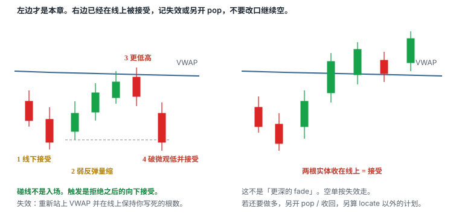
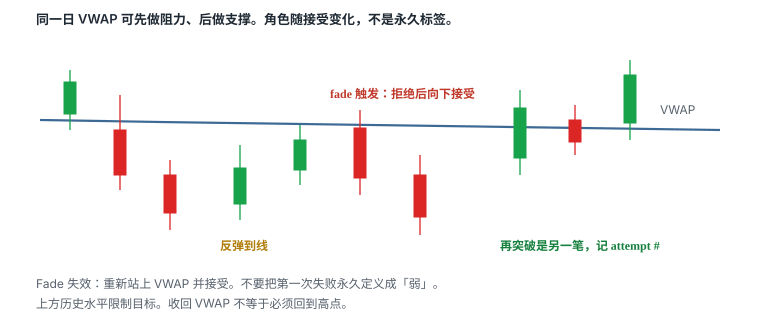
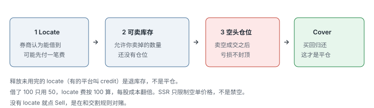
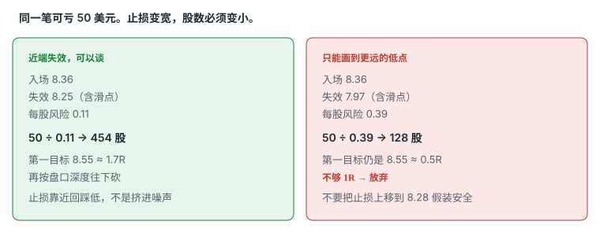

# 9.11 VWAP Rejection

> 一句话：价格先在 VWAP 下方被接受，再给出量缩的弱反弹；更低高点出现后，微观低点被向下接受，才允许做空。碰线不是入场。做空先 locate。

第 08 章把 VWAP 拆成四种走法。本章只写第三种：拒绝 / fade。它不是「VWAP 永远是阻力」，也不是把多头回踩上下翻转。它赌的是更窄的一件事：均价附近的供给还在，弱反弹没有在线上被接受，失败已经被价格走出来。

大盘把 VWAP 抬成主参考，是因为机构和算法围着当日均价转。正因如此，线附近会反复刺穿、扫损、假收回。小盘那套「破了就市价」在这里会把自己交出去。默认更耐心：等接受，用可成交限价控制最坏价。

数字——开盘后前 N 分钟不做第一次穿越、两根 1 分钟收在新侧、缓冲 0.05–0.15、30 分钟无推进减半——全部是启发式。换成你的大盘股票池以后，用自己的 MAE 分布校准。改一个数字就是另一套策略，旧样本不继承胜率。

## 9.11.1 它赌什么，不赌什么



这笔交易赌的是四件可证伪的事同时成立：

```text
1. 价格已经在时段 VWAP 下方被接受，弱势不是口头感觉。
2. 反弹是弱的：量缩、推不动、到线附近减速。
3. 反弹高点低于前一个可画的摆动高，或至少不在线上留下接受。
4. 微观低点被向下接受之后，下方口袋仍够 1R，且你能按计划价卖掉借入的股票。
```

任何一句被证伪，仓位是 0。证伪之后看到的继续下跌，是另一笔，不是把旧计划延期。

不赌的事：

- 不赌「已经在线下很久，所以下一次碰线必空」；
- 不赌 VWAP、下降均线、更低高点是三个独立概率，可以相乘；
- 不赌指数新高时个股仍会独自走完 fade；
- 不赌第一次刺穿、第一根红 K、第一根上影就是触发；
- 不赌止损单能在新闻重估或竞价里按原价成交；
- 不赌 ETB 标签本身看空，也不赌 HTB 标签本身看多。

| | 本章：VWAP Rejection | 不是本章 |
|---|---|---|
| 前提 | 线下已被接受 | 只在线下待了一根影线 |
| 反弹 | 弱、量缩、到线减速 | V 型直穿、放量抬高 |
| 结构 | 更低高点可画 | 更高高点已经出现 |
| 触发 | 拒绝后向下接受 | 碰线、第一根红、未收盘最低 |
| 失效 | 线上被接受 | 「再等一等它会掉下来」 |
| 方向 | 空 | 把亏损多单改成「等到均价再走」 |

「我做 VWAP」填不进计划的任何一栏。位置是 VWAP。形状是弱反弹加更低高。触发是向下接受。缺一栏，样本是脏的。

## 9.11.2 和另外三种走法的边界

第 08 章的四种 setup 必须分桶。同一根线、同一分钟，只能认领一个主名字。

| 走法 | 价格先在哪一侧 | 你等到什么 | 本章做不做 |
|---|---|---|---|
| 回踩 Bounce | 上方强势 | 回撤到线后更高低并收回 | 不做。见回踩专章 |
| 收回 / Pop | 下方，但恢复 | 站上并守住 | 不做。那是 fade 的失效路径 |
| 拒绝 / Fade | 下方弱势 | 更低高后破微观低 | 做 |
| 突破后回踩 | 先有离开并接受 | 回到线附近再测 | 不做。没有「先离开」，就不是那一种 |

认领规则事先写死，例如：决策区就是当时的时段 VWAP、其它结构都弱，才打 `VWAP Rejection`。日线阻力 + 开盘区间下破 + VWAP 拒绝，是一个空头假说，不是三个胜率。优先级可以改，旧样本不重新贴标签去美化曲线。

5.12 的 VWAP fade 放在反转家族里，失效常常钉在极端点。6.5.10 的 VWAP 回抽失败，对象是当天已经大幅冲高、再走弱的动量股。本章收的是大盘日的操作系统：股票已经在均价下方运行，弱反弹失败后再空。三章可以看同一条线，日志名字不要混。

同一日 VWAP 可先做阻力、后做支撑。中间这一次 fade 失败，不能永久定义这只股票「弱」。右侧若收回并接受，那是另一笔 pop 或突破后回踩，另写计划。

## 9.11.3 门票：先在线下被接受

没有这一步，后面无论反弹多弱，都不是本章。把一根长下影插到线下又收回去的试探，当成「已经走弱、现在 fade」，样本从第一秒就是脏的。


上图是多头写法。空头对称读：一根长下影穿过 VWAP 又回到线上，是试探，不是「已经在下方」。接受看起来更像：已收盘实体在线下，随后的反弹没有立刻把线还回去。

最小零件（任一否，仓位是 0）：

1. 用的是时段 VWAP，不是盘中临时改出来的锚定 VWAP；
2. 价格在线下留下已收盘实体，而不是只有影线；
3. 反弹没有立刻把线还回去并在线上留下实体；
4. 主风险周期已经写死——用 1 分钟影线宣布 5 分钟已经走弱，是周期混用。

开盘前确认配置，和第 08 章同一张清单：时段从何时开始、是否计入盘前、公司行动、数据源、多日图是否每天重置。你下单用哪套数据，就用哪套算触发和失效。两套混用，单独记一笔操作错误。

「弱势」不是感觉。可观察的证据包括：更低高 / 更低低已经出现；VWAP 斜率向下或至少不再上抬；反弹高点一次比一次靠近线却穿不过；指数或板块没有在创新高。这些相关，仍需长期样本。不要加成「四重确认」。

开盘附近样本少、VWAP 跳得快。开盘后前 N 分钟（启发式）只允许带额外结构的拒绝——例如已经有开盘区间下破、日线阻力仍有效——不允许把早期第一次穿越当铁墙。第一次穿越噪声最高。

## 9.11.4 弱反弹长什么样

门票过了，才谈反弹。反弹必须是弱的。强反弹是 pop 的候选，不是 fade 的入场。

弱的证据，按「它是什么」而不是按名字的神圣程度：

| 观察 | 弱反弹 | 已经不像弱 |
|---|---|---|
| 量 | 小于此前下杀段，且接近线时继续缩 | 接近线时放量，价格仍在抬 |
| 速度 | 越靠近 VWAP 越慢，上影增多 | V 型直穿，几乎没有停顿 |
| 结构 | 反弹高点低于前一个摆动高 | 已经创出更高高，或在线上留下实体 |
| 盘口 | ask 压在线附近，bid 抬不穿 | bid 抬过 VWAP，主动买能推进 |
| 指数 | 同步走弱或至少没有强势新高 | 指数在创新高，个股只是落后一拍 |

量缩是配料，不是充分条件。抛压可能较轻，也可能只是卖方暂时消失。缺量缩，就把「放弃」的权重提高，而不是补一个故事把缺的那项解释掉。

反弹深度没有机械百分比。从盘中低点回升 30%、回升 5 根，都不是许可证。反弹在线下 3 美分停下，但从未形成更低高、从未跌破微观低，也还没有触发。反弹穿过 VWAP 并在上方被接受，深度再浅也不是本章——那是收回。

「迅速受阻」是相对这只股票自己的节奏，不是统一的 30 秒。计划可以写成启发式：例如「反弹触及 VWAP 区域后，N 根 1 分钟内必须出现拒绝影或更低高；超时当作这一次 attempt 作废」。时间退出和价格失效一样，都要事前写。价格没有立刻转弱时，横在线下既可能是继续供货，也可能是空头回补后的压缩。「还没涨上去」不是继续等的充分理由。

不要在反弹开始以后补画一条刚好压住当前高点的线，再宣布「拒绝成立」。合法的线，是反弹发生前就已经在图上的时段 VWAP，加上当时已经存在的前高。事后拟合的下降趋势线，不能当本章的第二张门票。

## 9.11.5 更低高点怎么画

更低高点是结构，不是感觉「这次没上次高」。

画法必须事前写死：

```text
前高：线下被接受之前，最近一个已经完成的摆动高
      或反弹启动前的那个高点（写死用哪一个）
现高：这一次弱反弹的最高已完成摆动
更低高：现高 < 前高，且现高停在 VWAP 区域下方或之内
允许：影线刺入 VWAP 区域
不允许：实体在 VWAP 上方被接受
```

VWAP、下降短均线、更低高点都源自同一条价格路径。不能当作三个独立信号加分。日志里记一次「均价附近的供给还在」，不要写成「三重阻力」。

现高如果已经高于前高，这一次 attempt 不再是 fade。它可能演变成收回，可能演变成区间上沿，可能什么都不是。正确动作是把这一次标成未触发或失效，而不是把前高改到更左边去让「更低高」成立。回测时禁止用事后才知道的第三个点去修正当时那条前高。

更低高可以很近。近不是问题。问题是：近到点差和正常影线已经大于你准备用的止损缓冲。那种更低高不能当结构，只能当噪声。换到你的主风险周期再看；周期里看不清两个高点，仓位是 0。

第一次触碰 VWAP 常常没有可画的更低高——只有一根上影。一根上影是观察，不是触发。等第二下：高点更低，或微观低被破。把第一根影线当空，是预判，必须单独分桶，默认不算本章。

## 9.11.6 触发：拒绝之后向下接受

确认、触发、失效必须分开写。确认是「这件事看起来还像 fade」。触发是「现在才允许下空单」。失效是「判断错了，价格会先走到哪里」。把确认当成触发，会在第一根碰到线上的 K 里卖掉——那一根还可能继续向上。



两种合法触发，选一个写进计划，不要盘中改：

| 触发写法 | 你等到什么 | 优点 | 代价 |
|---|---|---|---|
| 破反弹微观低 | 弱反弹过程中的小低点被穿过并接受 | 多一次方向确认 | 入场更低，止损可能被拉宽 |
| 拒绝后留在线下 | 触及 VWAP 区域后，N 根收在线下，且未在线上接受 | 离线近 | 可能卖在第一轮拒绝里，随后再扫一次高 |

「碰到 VWAP」不是触发。碰到只是确认阶段开始。Bid hold、收盘确认、trade-through 也要事先定死，不能四者轮流用，直到某一种看起来赚了。

接受的最小写法（启发式，用样本改）：

```text
周期：1 分钟（主风险周期必须和这笔一致）
向下接受：至少一根已收盘实体低于反弹微观低
         或两根已收盘实体仍在 VWAP 下方且高点下降
不是接受：未收盘最低价、单根影线刺穿、盘口上闪过的低印
```

用未收盘 1 分钟的最低价宣布「已经跌破」，再在同一根还没走完的绿 K 里「追空」，两步都不成立。大盘给你假方向的方式是 trap：刺穿微观低，再回到 VWAP 上。预判仓位必须能扛一次刺穿后的计划失效，而不能指望「大盘滑点小所以可以满仓预判」。本章默认不做预判。

触发那一刻还要同时成立：

- 指数不是强势新高；
- 点差仍在预算里；
- 下方口袋预先量过，仍 ≥ 1R；
- locate / 可卖库存仍覆盖计划股数；
- SSR 状态已经核过，限价写得进规则。

缺一项就停。不要因为「拒绝很漂亮」跳过借股，也不要因为「指数稍微红」就忽略个股已经在线上留下实体。

## 9.11.7 失效：线上被接受

失效同样写死，三种都要有，不能事后只认对自己有利的那一种。

- **结构失效**：拒绝高点被向上接受（收盘在其上，或价格在其上停留——用你计划里的那一种）。
- **逻辑失效**：价格在 VWAP 上方被接受——即使拒绝高还没扫到，fade 假设已经死了。
- **时间失效**：反弹触及 VWAP 区域后 N 根内没有更低高，也没有破微观低；或入场后 M 分钟内没有向第一目标推进。

实际止损还要加滑点。止损钉在「刚好 VWAP 上方 1 美分」时，算法会先扫你，再走你原来想要的方向。留多少缓冲看点差和这只股票的正常影线，不是固定 2 美分。点差已经 0.06，还用 0.02 缓冲，计划 1R 和真实亏损不是同一个数。

第 08 章给了三种止损骨架，本章只许事先选一种并固定足够样本：

1. VWAP 另一侧固定缓冲；
2. 最近摆动高（这一次弱反弹的高点）；
3. 接受止损：在线上保持 N 根再走。

固定缓冲简单，但不适应波动。摆动止损结构合理，但可能较远，仓位必须更小。接受止损减少影线扫损，却增加平均亏损。用 MAE 分位数比较，不要用单笔「差点没扫到」。

无论哪一种，重大新闻直接重估时，止损都可能被跳过。事件前降仓，是规则，不是胆怯。失效之后看到的继续下跌，是新样本，不是把旧仓接回去。

不要做的改口：

- 「还没站稳，再等一等」——你的线已经被向上接受；
- 「更深的 fade 更好」——失效已经触发，深度只增加亏损；
- 「这是 pop，按另一套反手」——反手是新的一笔，要有新计划和另算的仓位；
- 「别人也在空」——别人的成交不能当你的失效位。

## 9.11.8 Locate 在先，SSR 改执行

做空不是图上的箭头。没有 locate，股数是 0。大盘多数日子是 ETB，更容易让人跳过这一步。跳过的那天，往往是事件日、库存突然变紧、或账户类型根本不允许卖空。



四个词不要混：

```text
看到 fade ≠ 完成 locate ≠ 库存到账 ≠ 空头仓位
```

盘前或第一次弱反弹出现时，就该问完：

- 账户类型是否允许股票卖空（现金账户和多数 IRA 直接划掉本章）；
- 现在是 ETB 还是 HTB；
- 若要询价，报价的 Price 是每股借股费，不是股票市价；
- 总费用相对计划 1R 是否可接受——费用已经吃掉整个 1R，仓位是 0；
- 可卖库存是否覆盖计划股数；借了 100 只用 50，locate 费按 100 算，每股成本翻倍；
- 是否已经 SSR（可能是昨天触发、今天仍生效）；
- 分红、拆股、财报后的公司行动会不会让库存被召回。

ETB 不是看空信号。容易借可能吸引更多人去空，第一次弱反弹里的空头反而更容易被挤回线上。HTB 也不是看多信号。高价大盘也可能在事件日突然变难借。不要用「大盘所以一定能空」当过滤器。

SSR 不是禁空，只是普通空单必须高于当前 NBB 才能显示或执行。它改的是成交，不是方向。

对本章的具体含义：

- 从 VWAP 拒绝后的第一段下跌，普通空单常排队。回抽 VWAP 再失败，才是 SSR 日更现实的入口。
- 第一次没卖掉，不要在更低的位置改成市价去「补上」。那是把限价单改成了追单。
- 回测若假设「碰微观低就成交」，会高估 SSR 日的执行质量。样本必须单开一桶。
- 标签本身没有期望值。SSR 不保证上涨，也不制造 squeeze。

可成交限价要同时限制最坏卖价。需要立刻成交时，最坏价仍必须高于你愿意接受的均价，并且预留滑点已经进过仓位公式。裸市价打进第一段下杀，是用未知滑点换「看起来卖掉了」。

回补同样要事前写：第一目标减多少、时间退出减多少、收盘前是否必须平完。大盘收盘竞价可以剧烈。隔夜不是本章默认选项。Cover 才是平仓。释放未用完的 locate 是退库存，不是平仓。

## 9.11.9 口袋、第一目标、指数

下方没有空间，方向对也不值得承担回补风险。第一目标在下单前标清。候选通常是：

- 弱反弹启动前的盘中低点；
- 下一档整美元 / 半美元（必须和点差比较；一次跳动就跨 0.50，半整数没意义）；
- 开盘区间低、前日低、日线需求区的上沿；
- LULD 下沿之前——靠近它时下一事件可能是停牌，不是平滑 fade。

不是「回到开盘」，不是「跌一整天」，不是测量「从高点已经跌了多少所以还该跌多少」。把目标画到前低再倒推「值得空这一笔」，是用还没发生的利润为交易辩护。先量到第一目标有没有 ≥ 1R。不够就跳过，而不是把止损挤近、把目标画远。

口袋和指数必须一起看。个股在 VWAP 下拒绝，指数却在创新高，这不是两个「还可以再看看」。计划里预先写：指数先强，个股 fade 只减不加，或直接失效。不要用「这一只比指数弱」当临时故事——相对强度可以是 setup，但必须事前定义怎么量。事后看相对弱势，人人都弱。

相关敞口按第 01 章算。同时空三只同板块大盘、止损都在各自 VWAP 上方，指数一抬可能一起触发。三笔各亏 1R，账户上可能是同一新闻的 3R。日亏损上限按相关后的合计算。没有 6.6 的规则，不要用「对冲」给相关敞口改名。

目标到了按计划减。没有 follow-through 时用时间退出。横盘既可能继续供货，也可能被买盘吸收。「还没涨」不是继续拿满仓的充分理由。成功 fade 后的管理，仍然是卷四的规则：止损只能往有利方向移；加仓是新的一笔，要重算全仓风险。

## 9.11.10 止损宽就减股数

入场必须靠近明确失效位。若需要很宽的 stop，股数应相应下降，而不是把止损挤到噪声区。



正确顺序永远是：

1. 找到结构失效点（拒绝高，或 VWAP 上方被接受的那一侧）；
2. 估算现实能成交的空头入场价（含 SSR 时必须高于 NBB）；
3. 加入滑点预留和 locate 费的每股摊销；
4. 算出每股风险；
5. 用单笔可承受美元风险反推股数；
6. 再按购买力、可见深度、相关敞口和个人上限往下砍。

```text
每股风险 = |预计入场 − 失效价| + 预留滑点
全部成本 = 每股风险 + locate 摊销 + 预估往返费用
股数     = floor(单笔可承受亏损 ÷ 全部成本)
最终股数 = min(风险允许, 库存允许, 深度允许, 相关后上限)
```

fade 看起来止损近，并不自动等于风险小。失败时往往很快——价格收回均价后算法会继续抬。近端失效只有在它仍然是结构高的时候才近。若弱反弹已经走成一条深斜线，最近「还能画」的高点远在 0.40 之外，这一笔的 1R 变大了。美元风险要保持不变，股数必须变小。第一目标若还停在 0.18 的前低，盈亏比不够，正确动作是放弃，不是把止损下移 0.25 来伪造 2R。

错误顺序是：想赚 0.10，因此 stop 设 0.05，再寻找图形解释。fade 尤其容易犯：因为「失效应该在线上」，就先写一个 0.05 的止损，再把缓冲画到能让 0.05 看起来合理的地方。那是用仓位去迁就热键，不是用结构去决定仓位。

固定股数不叫固定风险。同一只股票，止损 0.12 和止损 0.45，400 股的美元风险差三倍以上。拒绝高突然变宽，你还用「贴着 VWAP」那一笔的股数，账户承担的是另一笔交易的风险。

点差已经拉宽，先放弃。滑点预留必须跟着点差走；加大预留之后股数必须变小。计划卖的股数已经大于当前可见深度的一小部分，你自己就是冲击。可见深度不是保证，大单可撤，但「我的 size 已经像盘口上最大的一档」仍然是减仓或放弃的理由。

## 9.11.11 开盘、午前、午后不要共用同一规则

同一条 fade 规则不能默认跨时段有效。至少按开盘后前一段时间、午前、午后、收盘前分开统计。

开盘：样本少；点差和波动大；催化重新定价；第一次穿越噪声最高。早期 VWAP 还在大幅移动，你画的「线」每分钟都不是同一个数。计划里写的是「当时的 VWAP 区域」，不是 9:32 的一个固定价。

午前：线开始稳定，趋势日的第二次、第三次弱反弹更常出现可画的更低高。也是 trap 密集区：人人都看见均价，止损都挤在另一侧。

午后：线更稳定；量低；多次穿越可能只是区间。大盘午后仍能成交，诱惑比小盘更大。「今天还差 200 美元才达标」不是 setup。收盘资金流会改变角色：同一条 VWAP，下午 3:40 的穿越和上午 10:20 的穿越不是同一个事件。

多次来回穿越 VWAP，说明缺少方向性。把它当成区间信息，而不是「下一次一定是真的」。穿越次数是过滤器：当天已经第 4、第 5 次穿过，本章默认降为不做，除非你事先为「高穿越次数」单开实验桶。

收盘竞价、隔夜、财报后的第一分钟，都不算本章的常规样本。重大新闻直接重估，先降仓或锁仓，不要用 fade 去猜新均衡。

## 9.11.12 量、盘口、第几次碰线

量能顺序偏好：

```text
下杀扩张 → 反弹收缩 → 拒绝后再扩张
```

本章对应的是：线下接受已经发生过 → 弱反弹收缩 → 破微观低后再扩张。缺最后一步，你可能只是卖在收缩的半途。反弹绿量大于此前下杀段，是收回警告，不是「更好的空」。

量回答三个问题：和前几根比是扩张还是萎缩；和这只股票平时同时段比是否异常；放量之后价格有没有推进。反弹段缩量且停在线下，是配料。反弹段放量且穿过线，是失效候选。绿柱不等于主动买完，红柱不等于主动卖完，颜色通常只是跟着 K 线走。

盘口回答的是现在的执行环境，不是未来一定往哪走。弱反弹过程中值得看：

- ask 是否在 VWAP 附近重新排队，还是一层层被抬走；
- 大成交是价格往上走（需求）还是停在线下（供给仍在）；
- bid 被打穿后价格有没有前进，还是打穿了却走不动；
- 自己的计划股数是否已经大于当前可见深度的一小部分。

这些信号在失败时更不可靠：可见大单会撤，报价会跳。所以点差先恢复、结构先清楚，盘口只做执行，不替你决定这是 fade 还是收回。四个窗口同时闪会制造模式错觉。一次只对计划中的标的和 VWAP 作判断。

Tape 上连续打在 ask，只说明刚才主动买更多，不单独构成失效。失效仍然是价格在线上被接受。连续打在 bid 也不单独构成触发。触发仍然是你写死的那一种：破微观低，或拒绝后留在线下。

日志必须记录这是当日第几次碰 VWAP。第一次、第二次、第五次的基础率不会一样。成功例说明 setup 长什么样，不说明基础胜率。必须保留重新站上 VWAP 后被挤的失败例。不记录 attempt number 的样本，复盘时无法回答「我是不是把每一次穿越都当成独立 fade」。

长时间在 VWAP 附近 base，可能提供风险点，也可能表示注意力已下降。base 之后的 fade 和 pop 都要重新问：现在还有没有人在看。没人看的线，止损挤、口袋假。

## 9.11.13 数字例：同一条 48.20

教学用整数，不是某只股票。单笔可亏 80 美元。点差正常时预留滑点 0.04。触发事先写死为「破反弹微观低并接受」。止损选「拒绝高 + 缓冲」。Locate 为 ETB，无单独借股费。所有价格都是常规时段。

### A. 线下接受后的弱反弹

开盘后 25 分钟，两根 1 分钟实体收在 48.08、47.96，VWAP 在 48.20。价格在线下横过，没有立刻还回去。随后反弹量缩，高点 48.16，低于此前摆动高 48.52。下一根刺到 48.18 留上影，收 48.06。微观低 47.96 被实体跌破，收 47.90。

- 入场：破微观低后 47.88（可成交限价，最坏 47.84）；
- 失效：拒绝高 48.16 + 0.06 缓冲 + 0.04 滑点 = 48.26；
- 每股风险 0.38；
- 最多 210 股，再按盘口和相关敞口往下砍；
- 第一目标是反弹启动前的盘中低 47.42（约 1.2R），或 47.00 整数。先量 47.42 有没有 ≥ 1R。有，才谈这一笔。

反弹量小于此前下杀。指数同步低走，没有新高。ask 在 48.14–48.20 压着。这是本章。

### B. 只有影线，门票没有发

同一条 48.20。一根 K 最低 48.06，收盘 48.28，长下影。没有已收盘实体留在线下。随后价格到 48.22，「看起来像碰到均价」。

这不是 fade。前面没有在下方接受。48.18 卖掉，赌的是失败刺穿之后还会再破，那是预判或另一套策略。本章仓位是 0。

### C. 有过接受，随即收回

48.20 下方被实体接受，最低 47.88。反弹到 48.14 后继续走，两根 1 分钟收在 48.26、48.31。价格在线上被接受。

这不是「更深的 fade」，是收回。按失效走。不要改口说「还没真正站稳」，也不要把止损从 48.26 改到 48.45 去「给空间」。若你在 47.90 已经进了，48.26 就该走；走晚了是执行错误，不是把 setup 改名。若还想做多，另开 pop，另写触发和仓位。

### D. VWAP 走平，当天第五次穿越

午前已经四次上下穿过 48.20，线几乎走平。第五次从下往上碰到 48.19，又留下影。

方向优势很弱。本章直接降为不做。不要把每一次穿越都当成独立 fade。若你坚持做「高穿越次数」实验，必须单开一桶，不得并进 A 的胜率。

### E. 口袋不够 1R

结构与 A 相同，但下方 4 美分就是前日低 47.84，再往下是厚需求。入场 47.88，目标 47.84，纸面不到 0.2R，止损仍要到 48.26。

方向即使对，也不值得承担回补风险。跳过。不要把止损收到 48.00 来伪造 2R——48.00 不是结构失效。

### F. SSR 日第一段没卖掉

上市市场已确认 SSR。A 的微观低被砸穿时，NBB 在 47.89，普通空单不能打到 bid。你的限价 47.90 排队，没有成交。价格到 47.60。

不要在 47.60 改市价去补。等回抽：若价格弱反弹回 48.05–48.16 仍在线下，再给一次破新微观低的机会。这一笔叫「SSR 下的回抽失败空」，attempt number 要另记。第一次没卖掉，记 skipped，不记亏损。

### G. 指数新高，个股落后

个股图形与 A 相同。指数当分钟创新高，板块龙头在各自 VWAP 上方接受。

计划若写过「指数新高则个股 fade 失效」，仓位是 0。不要临时改成「这一只相对更弱所以更该空」。相对弱势没有事前定义怎么量，就不是 setup。

## 9.11.14 常见失败

按出现频率，而不是按故事刺激程度：

- VWAP 横向，价格反复穿越，把每一次都当成独立 fade；
- 开盘第一次穿越，早期线还在跳；
- 只有影线，没有线下接受，就把第一根红 K 卖掉；
- 反弹已经放量穿过，仍扛着空单改口；
- 入场离 VWAP 太远——第一段已经走完，你在追；
- 第一目标太近，盈亏比事先就坏了还做；
- 重大新闻直接重估，止损被跳过；
- 大盘与板块强烈反向；
- 锚定 VWAP 与时段 VWAP 混淆；
- 把亏损多单改成「等到均价」的波段，再在均价处「顺便」空；
- 用小盘那套破线市价热键去打大盘拥挤的均价；
- 不记录 attempt number，复盘时把所有下跌都算进 fade。

最后两条值得单独说。小盘破当日高点，后面可能是停牌和真空。大盘破 VWAP，后面经常是算法来回扫。执行默认更耐心。多头亏损单改成 fade，是把已经失效的一笔策略，偷偷换成另一笔；两笔的触发、仓位、locate 都没重算。日志里应打成两笔错误，而不是一笔「灵活」。

失败后做什么，和第 07 章同一套，这里重复一遍，因为 fade 失败时最容易手软：

1. 不等待「再给一次机会」；
2. 按失效回补 / 平仓；
3. 检查是否变成收回或突破后回踩的多头候选；
4. **不自动反手做多**——反手是新的一笔；
5. 记录滑点、是否 SSR 未成交、以及「在线下停留了多久」。

停留时间也是样本。一闪而过的「弱势」后面去 fade，和线下走了四十分钟再弱反弹，不应丢进同一个胜率。

## 9.11.15 和 5.12、6.5、阻力空的边界

同一根下跌里，你可能同时看见 VWAP 失守、下降旗形、日线阻力拒绝、开盘区间下破。只选一个定义记账。认领规则事先写死，例如：

| 当时最清楚的决策区 | 主名字 |
|---|---|
| 决策区就是时段 VWAP，其它结构都弱 | 本章：VWAP Rejection |
| 当天动量股冲高走弱，再回均价失败 | 6.5.10 VWAP 回抽失败 |
| 反转家族，失效钉在极端点 | 5.12 VWAP fade |
| 供给区在盘前就画在图上，VWAP 只是路过 | 6.2 / 9.7 阻力拒绝 |
| 高开，触发是开盘结构失守 | 6.5 高开回落 / 6.3 Gap-Up Short |

形状、位置、触发仍是三个词。认出一次拒绝，只是形状。它贴在 VWAP 下方，才有位置。当前这根 K 跌破微观低并被接受，才是触发。用 5 分钟的拒绝高做止损、按 1 分钟很窄的微观低算仓，是把风险算小了。周期必须和这笔的主风险一致。

不要把 VWAP、下降均线、更低高点当成三个独立信号加分。成功例说明 setup 长什么样，不说明基础胜率。课程或聊天室里「今天 fade 很准」不是你的样本。

## 9.11.16 入场前清单

门票：

- 用的是时段 VWAP，配置和券商一致？有没有和锚定 VWAP 混用？
- 线下已经有已收盘实体，回弹没有立刻把线还回去？
- 主风险周期写死了吗？有没有用未收盘最低价？

结构：

- 反弹量缩了吗？接近线时是减速还是加速？
- 更低高点画在哪两个已经完成的摆动上？现高有没有在线上留下实体？
- 触发写死的是破微观低，还是拒绝后留在线下？它发生了没有？
- 这是当日第几次碰 VWAP？穿越次数是否已经把今天降为不做？

风险和执行：

- 账户允许卖空吗？ETB / HTB 核过吗？locate 费进得去 1R 吗？
- 库存覆盖计划股数吗？SSR 是否生效？限价写得进规则吗？
- 失效价在哪里，含滑点后每股风险多少？对应多少股？
- 第一目标到哪，有没有 ≥ 1R？不够是不是该放弃，而不是挤止损？
- 指数是不是强势新高？相关敞口加进去还在日限额里吗？
- 点差还在预算里吗？计划股数是否大于可见深度的一小部分？
- 是否靠近 LULD 下沿、宏观公布或收盘竞价？
- 这笔是「看到向下接受」，还是只因为害怕错过、或因为已经在线下很久？

任一关键项是「不确定」，仓位是 0。不确定不是「先空一点再说」。

持仓中只问三句：失效触发了没有？目标到了没有？时间退出到了没有？要加仓的话，全仓风险重算了吗？旧仓的 fade 假设还在吗？

## 9.11.17 日志字段

每笔至少记录：

```text
setup 名称：VWAP Rejection（不要只写 VWAP）
时段起点 / 是否含盘前 / 数据源
一天中的时间（开盘后 / 午前 / 午后 / 收盘前）
attempt number（当日第几次碰线）
VWAP 斜率（上 / 平 / 下）
入场时离 VWAP 的距离
此前穿越次数
线下接受用哪根已收盘 K 判定
反弹量相对此前下杀是缩还是扩
更低高的两个锚点（时间 + 价格）
触发：破微观低 或 拒绝后留在线下（必须与计划一致）
失效写法：缓冲 / 摆动高 / 接受止损
入场、失效、第一目标和计划 R
点差、滑点预留、期望价格、实际均价、部分成交、未成交
ETB / HTB、locate 费、SSR、是否排队未成交
指数 / 板块当时是否新高
MFE / MAE
退出是否符合原计划，还是改口、反手、换周期
1 / 5 / 15 分钟后的结果
若没卖掉：限价、当时 NBB、是否下调过价格
```

把「限价没成交」也记进样本。把「以为是 fade、其实是收回」单独打标签。过几个月你要能回答：自己是在真拒绝上亏，还是在假弱势上亏。两种亏法的改正动作不同。前者可能是触发太早、止损太紧或目标太远；后者是门票没查就进场。

复盘不能只圈最终又创新低的图。应记录首次入场时可见的 VWAP、当时是否已经在线下接受、stop 与下方空间。事后图看起来顺滑，不能证明当时那根未完成 K 线不该让你放弃。统一字段和第 08 章共用。多一个标签不增加优势；少一个名字会把四种走法搅脏。

可测试版本（边界全部启发式，用自己的样本校准）：

```text
前提：时段 VWAP 下方已被已收盘实体接受，反弹未把线还回去
反弹：量 < 此前下杀段（配料）；高点 < 前摆动高
允许：影线刺入 VWAP 区域
不允许：实体在上方接受
触发：破反弹微观低并接受  或  拒绝后 N 根留在线下（择一）
失效：拒绝高被接受  或  VWAP 上方被接受
时间：触及区域后 N 根无更低高则 attempt 作废
      入场后 M 分钟无推进则减半或退出
第一目标：盘中低或下一位置，至少约 1R
执行：locate 在先；SSR 日记未成交，禁止向下改价追空
指数：强势新高则仓位 0
```

每个 N、M、是否允许影线刺入、用哪一个周期，改完必须写进日志并分开统计。改了触发，就是另一套策略。

## 先记住这些

- 先确认价格已经在 VWAP 下方被接受。没有这一步，后面不是本章。
- 反弹必须弱：量缩、到线减速、更低高可画。V 型直穿是 pop 的候选。
- 触发写死一种：破微观低，或拒绝后留在线下。碰线不是入场。
- 线上被接受 = 失效。不要改口说更深更好，也不要自动反手。
- 做空先 locate。ETB 不是看空。SSR 改成交，不改方向；第一段没卖掉不要追。
- 第一目标不够 1R 就放弃。止损宽就减股数。
- 开盘、午前、午后、第几次碰线，分开记账。不要和 5.12、6.5 共用一个胜率。

## 不要做的事

- 把影线刺穿、开盘第一次穿越、走平后的第五次穿越，都叫 VWAP Rejection。
- 只因为已经在线下很久、或别人也在空，就进场。
- 价格在线上留下实体后仍扛着空单，或把止损往上挪去「给空间」。
- 没有 locate 就点 Sell；SSR 日第一段没卖掉就改市价去补。
- 止损必须很宽时仍用贴线那一笔的股数，或把止损挤进噪声伪造盈亏比。
- 把 VWAP、下降均线、更低高点当成三个独立信号加分。
- 把亏损多单改成「等到均价」，再在均价处顺便空，两笔都不重算。
- 用小盘破线市价热键去打大盘拥挤的均价。
- 指数新高、口袋不够、穿越次数已经很高时，仍按 A 级满仓。
- 用事后补画的趋势线、未收盘最低价、或事后才知道的第三个高点，让更低高「一直成立」。
