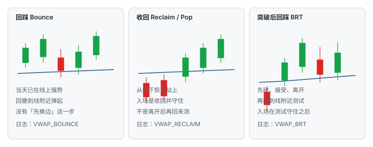
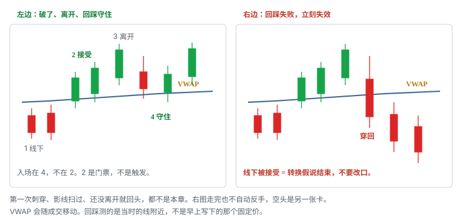

# 9.12 VWAP Break-and-Retest

> 一句话：先有离开并在新侧被接受，再有回到 VWAP 附近的测试；测试守住才进。第一次穿越不是这一笔。

第 08 章把四种 VWAP 走法拆开：回踩 Bounce、收回 / Pop、拒绝 / Fade、突破后回踩。本章只写第四种。它赌的是**趋势转换**：价格已经换边，并且离开过这条线，现在回来测这条线还能否当新边界。测住，转换假说还在。测不住，转换作废。

它不是「碰到 VWAP」。碰线只是观察开始。它也不是上方已经走强、从未换边的回撤（那是 Bounce），不是从下向上第一次站稳就追的 pop（那是 Reclaim）。三种外观都可能在同一根线上发生。混进一个胜率，样本从第一笔就是脏的。

大盘把 VWAP 抬到主参考，是因为机构和算法围着当日均价转。正因如此，破线之后经常有人来回扫。执行默认更耐心：等接受，等离开，等回踩反应，用可成交限价控制最坏价。不要把小盘那套「破线就市价」搬过来。

数字——两根 1 分钟收在新侧、缓冲 0.05–0.15、30 分钟无推进则减半——全部是启发式。换成你的股票池以后，用 MAE 分布校准。



## 9.12.1 它赌什么：先离开，再测试



可证伪的句子只有一句：

```text
刚才被接受的那一侧，现在有资格把 VWAP 当边界来测。
测住 → 转换还在。
测不住 → 前面的突破作废。
```

不赌的事：

- 不赌第一根刺穿 VWAP 就是趋势反转；
- 不赌「已经从高点 / 低点走了很远，所以该回均价」；
- 不赌 VWAP 自己有支撑或阻力的魔力；
- 不赌回踩失败之后「还在转换」，可以把止损再放宽一截；
- 不赌失败之后必须反手——反手是另一张卡。

四种零件必须按时间顺序出现。缺任何一件，仓位是 0：

1. **破**：价格穿越 VWAP，并且在新侧留下接受，不是只有影线；
2. **离开**：接受之后价格离开这条线，而不是贴着线立刻回头；
3. **回踩**：从新侧回到当时的 VWAP 区域；
4. **守住**：回踩没有在旧侧被接受，随后出现你写死的触发。

入场在第 4 步。第 2 步是门票。把第 2 步当成触发，你做的是 Reclaim 或追突破，日志不得写成 `VWAP_BRT`。

「离开」不是感觉上走远了。计划里要有可检查的边界，例如：新侧至少走出一个完整摆动，或离开 VWAP 达到你预先写的最小距离（启发式）。还没离开就回头，那是第一次穿越的噪声，或 Reclaim 自己的第一次回撤。两种都可以另开卡片，都不是本章。

VWAP 会随成交移动。回踩测的是**回踩当时**的线附近，不是开盘后你写在卡片上的那个固定价。计划写规则（「回到当时 VWAP 区域并守住」），不写死一个上午就不会再改的数。

## 9.12.2 和 Bounce、Reclaim 必须分桶

第 08 章已经警告：不能把「碰到 VWAP」混成一个胜率。本章把这句话写成可执行的分桶。三种多头都可能在同一只股票、同一条线上发生。差别是**今天有没有换边，以及入场落在转换的哪一截**。

| | 回踩 Bounce | 收回 Reclaim / Pop | 本章 BRT |
|---|---|---|---|
| 当天语境 | 已经在 VWAP 上方走强 | 从下方恢复 | 趋势转换 |
| 必须先离开？ | 否。从未需要今天换边 | 否。入场就是收回本身 | **是。先破、接受、离开，再回来测** |
| 第一次穿越 | 不是这一笔 | 经常是这一笔，或收回后立刻的第一下 | **从来不是这一笔** |
| 触发 | 线上反应 + 更高低点 | 收回并守住，或破微观高 | 回踩守住：收回区域或破回踩微高 |
| 失效 | 在 VWAP 下方被接受 | 跌回并破微观低点 | 回踩失败：重新穿回并在旧侧接受 |
| 日志名 | `VWAP_BOUNCE` | `VWAP_RECLAIM` | `VWAP_BRT` |

Bounce 的假设是：上方强势还在，回撤只是把价格送回当日成本。BRT 的假设是：强势**刚刚换边**，回踩是在测换边是否成立。两笔的失效都可能画在 VWAP 附近，故事完全相反。混称之后，你不知道自己是在延续里亏，还是在假转换里亏。

Reclaim 的假设是：从弱到强的第一下恢复值得做。入场靠近收回事件。BRT 要求收回事件**已经发生过**，并且价格离开过，现在才允许测。把第一根站上的 K 标成 BRT，是把门票写成成交。

常见脏样本：

- 开盘就在线上，回撤到 VWAP 弹起 → Bounce。写成 BRT，等于给「没有换边」的延续，贴了「趋势转换」的标签；
- 线下横盘后第一根实体站上就进 → Reclaim。写成 BRT，等于把第一次穿越的噪声算进转换胜率；
- 破了、跑远了、回来测、守住才进 → 这才是 BRT；
- 破了没离开、贴着线来回三回 → 不是三种里的任何一种，是区间。第 08 章：多次穿越说明缺少方向性。

Fade / 拒绝是第四个桶，空头延续，不是 BRT 失败后的自动反手。BRT 多头失败，你按失效走。若随后出现「线下弱势 + 反弹到线 + 更低高 + 破微观低」，那是 `VWAP_FADE`，新计划、新股数、新 locate。不要在同一张单上改名。

分桶检查（进场前写死一个名字；写不出就仓位 0）：

```text
今天价格有没有在另一侧被接受过？
接受之后有没有离开这条线？
我现在是在测离开之后的回归，还是在做第一次站上，还是在做从未换边的回撤？
```

三个「是 / 否」对不上本章，就换卡片，或跳过。不要用事后最漂亮的那个名字记账。

## 9.12.3 门票一：什么叫「破了」

没有接受，后面无论回到线上多少次，都不是本章。把影线插过去又回来当成「已经突破、现在回踩」，和卷五把影线当突破是同一个错误，大盘里更常见：流动好，影线可以很长，却完全没有停留。


第 09 卷第 03 章已经把四个词拆开：突破是第一次穿越；接受是在新区域持续成交或收盘；回踩是回到原水平；拒绝是快速回到原区间。BRT 用的是后三件的组合，不是第一件单独拿来下单。

最小零件：

1. 会话 VWAP 的配置事先写清——是否含盘前、数据源、是否与锚定 VWAP 混用。混用记一笔操作错误，样本作废；
2. 价格在新侧留下已收盘实体，而不是只有影线；
3. 接受定义固定，例如两根 1 分钟收在新侧（启发式）。不满足就按未触发；
4. 回落没有立刻把线还回去。立刻还回去，是失败突破或 trap，不是「提前回踩」。

「站上 / 站下」用的周期，必须和这笔的主风险周期一致。用 1 分钟影线宣布 5 分钟已经换边，是周期混用。用未收盘最高价宣布突破，再在同一根还没走完的 K 里「买回踩」，两步都不成立。

接受还可以补观察，它们是配料，不能拿掉门票：

- 在新侧停留了多久：一闪而过更像刺穿；
- 突破量有没有推进价格，而不是放量却走不动；
- 随后有没有出现一个新侧摆动的雏形；
- 指数 / 板块当时是否同向。个股放量破 VWAP、指数同步新高，常常是同一风险因子的两种显示，不要乘成两倍胜率。

停留时间没有统一秒数。计划写成启发式，然后用自己的样本改。不要口头觉得「看起来站稳了」。

开盘后前一段时间，VWAP 样本少、点差和波动大、催化还在重新定价。第 08 章把开盘第一次穿越标成高噪声。本章直接更硬：开盘后前 N 分钟（启发式）**不允许**把第一次穿越标成 BRT。那一段时间若只能做，也只允许 Bounce / Fade 里带额外结构的，并且单独统计，不要进 `VWAP_BRT` 桶。

门票检查（任一否，仓位是 0）：

- 这条 VWAP 的会话起点，和你下单用的是不是同一条？
- 新侧有没有已收盘实体，而不只是影线？
- 接受用的周期，是不是这笔的主风险周期？
- 接受之后有没有立刻把线还回去？

过了这四问，才进入「离开」和「回踩」。

## 9.12.4 门票二：什么叫「回踩」

破了之后，价格必须离开，再回来。贴着线的来回不是回踩，是还没走完的穿越。

回踩是区域，不是像素。点差、滑点、影线都会让价格在一条带状区域里转。线应盖住实际发生过反应的那一带。计划可以写成「当时 VWAP ± 启发式缓冲」，缓冲太窄会被正常波动扫出，太宽会让失效失去意义。MAE 分布会告诉你缓冲该有多宽，直觉不会。

有效回踩常需要同时看到：

- 从新侧回来，而不是从旧侧再刺一次；
- 回撤速度减慢，而不是加速穿过线；
- 回撤量相对离开段收缩（配料，不是充分条件）；
- 低点 / 高点没有在旧侧被接受；
- 随后出现你写死的触发：收回区域，或破回踩微结构。


缺其中一项，就把「放弃」的权重提高，而不是补一个故事把缺的那项解释掉。「已经回到均价了」不是触发。触发是反应，不是位置。

回踩深度没有机械百分比。穿过 VWAP 并在旧侧被接受，深度再浅也不是回踩。停在 VWAP 上方 3 美分，但从未收回、从未形成更高低点，也还没有触发。

动态线还要记住自己会动。你离开时 VWAP 在 148.20，回来时可能已经在 148.45。回踩低若停在 148.22，相对**现在**的线已经偏到另一侧。不要用离开时的旧值给现在的回踩开脱。日志记下入场时的 VWAP 值，以及回踩低 / 高相对该值在哪一侧。

不要在价格已经穿回之后，补画一条刚好托住当前低点的均价故事。合法的测试，是回到**事先就在图上、按规则更新**的那条会话 VWAP。锚定 VWAP（某次财报、某日低点）是另一条线。用锚定线的回踩，另开名字，不要进本章桶。

第几次必须声明周期。1 分钟可能已经是第三次小回撤，5 分钟仍只是离开后的第一次回踩。第一次通常更接近原始转换动量；后面每一次都要重新判断转换有没有衰减。序号入日志。第二次回到同一条线，不要和第一笔丢进同一个桶，更不要用第一笔的盈利去加大第二笔的股数。

## 9.12.5 多头：线上接受后再测支撑

多头 BRT 的时间顺序：

```text
线下（或反复穿越）
  → 上破并在上方接受
  → 向上离开 VWAP
  → 回落到当时 VWAP 区域
  → 区域内更高低，或收回区域 / 破回踩微高
  → 入场
失效：1 分钟（或你的主周期）收在 VWAP 下，或回踩低被向下接受
```

语境不是「看起来要从底下翻上去」。语境是：转换已经发生过，你在等更近的失效位。大绿 K 穿过 VWAP 之后立刻追，止损往往要收到线下，盈亏比变差——那是 Reclaim 或追价，看你怎么定义。BRT 存在的理由，正是把失效从「旗杆起点 / 线下某处」收到「刚才这个回踩低」。

收得近的前提仍然是：前面的上破是真的，这个低点没有把结构砸回线下。低点若已经在下方留下实体，近端失效不存在，这一笔结束。

上方口袋必须先量。VWAP 到前高、盘前高、整美元、日线供给，先够约 1R。不够就放弃，或等更近的微观失效，不要把目标画到「回到高点」来伪造盈亏比。第 08 章：不把「回到高点」当默认。第 04 章：口袋宽度是选股和仓位输入，不是目标承诺。

指数当时在做什么，写进假说，不要写进胜率乘数。个股刚从线下翻上、指数却在当日低点附近加速，BRT 多头降级。相关敞口按第 01 章算：同板块三只都在等 VWAP 回踩，指数一跌可能是同一笔 3R。

第一次触碰失败很常见。计划若写的是「回踩守住」，第一根碰到线上的 K 还可能继续向下。把确认当成触发，会买在测试尚未完成的那一下。确认是「这件事看起来还像回踩」。触发是「现在才允许下单」。

可测试版本（边界全部启发式）：

```text
前提：VWAP 上方至少两根 1 分钟实体，随后离开形成一个摆动高
回踩：价格回到当时 VWAP 区域，回撤量 < 离开段（配料）
低点：不允许实体在 VWAP 下方被接受（可允许影线刺入缓冲）
触发：收回 VWAP  或  破回踩微高（择一，盘中不改）
失效：回踩低下被接受  或  VWAP 下方被接受
时间：回踩低后 N 根内无收回则退出
第一目标：离开段高点 或 下一供给，至少约 1R
指数：不同向则仓位降为 0 或按规则砍到观察
```

每个 N、是否允许影线刺入、用哪一个周期，改完必须写进日志并分开统计。改了触发，就是另一套策略。

## 9.12.6 空头：线下接受后再测阻力

空头 BRT 是镜像，不是「多头反过来嘴上说说」。时间顺序：

```text
线上（或反复穿越）
  → 下破并在下方接受
  → 向下离开 VWAP
  → 反弹到当时 VWAP 区域
  → 区域内更低高，或重新跌破区域 / 破回踩微低
  → 入场
失效：主周期收在 VWAP 上，或回踩高被向上接受
```

它和 Fade 的差别，仍然是「先离开没有」。Fade 是弱势股反弹到 VWAP 受阻，未必先有一段干净的下破离开。BRT 空要求：下破已被接受，价格离开过，现在回来测供给。把第一根跌破 VWAP 的 K 拿来做空，那是第一次穿越，噪声最高，尤其开盘。

做空还要满足第 07 章已经写过的条件，缺一项就不要因为「VWAP 破了」而豁免：

- 可借 / 易借状态；
- SSR；
- 分红与公司事件；
- 板块 / 指数 beta；
- 可能引发回补的催化；
- 收盘竞价；
- 若不平仓，隔夜风险。

流动性高降低一部分执行风险，新闻回补仍可显著跳空。止损放在 VWAP 收回还是回踩高上方，取决于你写死的那一种，不要盘中挑没被扫到的那条。下方口袋同样先量：VWAP 到前低、整美元、日线需求，先够 1R。不够 1R 的空头 BRT，方向对也付不起滑点和借股。

SSR 下不能指望用激进的低于买一价去追空。触发若要求「破回踩微低」，而你的卖单无法按计划价格被接受，这一笔降为观察。不要改成市价砸，把未知滑点当成「执行细节」。

空头 BRT 失败 = 价格重新站上 VWAP 并接受。按失效 cover。不要改口说「还在空头转换，再给空间」。站上之后若出现多头 BRT 或 Bounce，那是新的一笔，不是把空单改成等均价。

## 9.12.7 时段：开盘第一次穿越不是本章

同一规则不能默认跨时段有效。至少按开盘后前一段时间、午前、午后、收盘前分开统计。

| 时段 | VWAP 本身 | 对 BRT 的含义 |
|---|---|---|
| 开盘后前 N 分钟 | 样本少，线乱跳 | 第一次穿越噪声最高。默认不做 BRT |
| 午前 | 线开始稳定，量仍够 | 主样本区。仍要先离开再回踩 |
| 午后 | 更稳定，量常更低 | 多次穿越更像区间。离开不够远就不要标 BRT |
| 收盘前 | 资金流会再改一次 | 竞价可以跳过你的回踩结构。事件日直接降仓 |

开盘：点差和波动大，催化重新定价。价格来回穿过一条还在剧烈移动的均价，看起来每天都有「突破后回踩」。其中大部分只是开盘区间在找边。把它们标进 BRT，胜率会被开盘噪声主导，你会误以为「VWAP 转换」本身很差或很好——两种结论都站不住。

午后：线好看了，诱惑更大。大盘午后仍能成交，不像小盘那样直接没量。缺方向时，VWAP 走平，价格反复跨越。第 08 章：这一类直接降为不做。BRT 需要方向性离开。走平的线上做「再一次回踩」，是把区间当转换。

收盘竞价的量不要直接当成盘中动量。回踩若拖到竞价附近才出现，你的限价、止损和口袋都可能被竞价打印改写。计划里可以写：距收盘不足 M 分钟，不再新开 BRT（启发式）。

多次来回穿越 VWAP，说明缺少方向性。把它当成区间信息，而不是「下一次一定是真的」。穿越次数要记进日志。此前已经穿越 6 次，第 7 次不会因为你改口叫 BRT 就变成趋势转换。

## 9.12.8 触发、三种止损、目标写死

同一形状三种进法不能事后任选最漂亮的那一种。本章只允许事先写好的那一种触发。碰到 VWAP 不是触发。

两种合法触发，选一个写进计划，不要盘中改：

| 触发写法 | 你等到什么 | 优点 | 代价 |
|---|---|---|---|
| 收回区域 | 回踩后重新站上 / 站下当时 VWAP，实体在新侧 | 简单，离线近 | 可能买在第一根收回里，随后再扫一次 |
| 破回踩微结构 | 回踩过程中的小高 / 小低被穿过并接受 | 多一次方向确认 | 入场更远，止损可能被拉宽 |

Bid hold、收盘确认、trade-through 也要事先定死，不能四者轮流用，直到某一种看起来赚了。大盘默认更耐心：等接受，用可成交限价控制最坏价。

第 08 章给了三种止损，用 MAE 比较，不要用单笔「差点没扫到」：

1. **VWAP 另一侧固定缓冲**。简单，但不适应波动。缓冲是启发式，开盘和午后不应未经检验就共用同一个数；
2. **最近摆动高 / 低**（回踩高或回踩低）。结构合理，但可能较远，仓位必须更小；
3. **接受止损**：在另一侧保持 N 根。减少影线扫损，却增加平均亏损。

无论哪一种，重大新闻直接重估时，止损都可能被跳过。事件前降仓，是规则，不是胆怯。

实际止损还要加滑点。钉在「刚好那根低点下方 1 美分」时，噪声会先打你，再走你原来想要的方向。点差已经 0.08，还用 0.02 滑点，计划 1R 和真实亏损不是同一个数。

止损宽就减股数。顺序永远是：先找到结构失效点，估算能成交的入场价，加入滑点，算出每股风险，用单笔可承受美元反推股数，再按购买力、流动性、相关敞口和个人上限往下砍。

```text
每股风险 = |预计入场 − 失效价| + 预留滑点
股数     = floor(单笔可承受亏损 ÷ 每股风险)
最终股数 = min(风险允许, 购买力允许, 流动性允许, 相关敞口允许, 个人上限)
```


错误顺序是：想赚 0.20，因此 stop 设 0.10，再寻找图形解释。BRT 尤其容易犯：因为「失效应该在均价另一侧」，就先写一个很近的止损，再把接受定义放松到能让这个止损看起来合理。那是用仓位去迁就热键。

第一目标常常只是：

- 离开段形成的摆动高 / 低；
- 或下一个事先画好的口袋边（整数、盘前高 / 低、日线位）。

不是自动回到 HOD / LOD。把目标画到全天极值，再倒推「值得做这一笔回踩」，是用还没发生的利润为交易辩护。先量到第一阻力 / 支撑有没有 ≥ 1R。不够就跳过。

时间退出和价格失效一样，都要事前写。第 08 章给过启发式：30 分钟内没有向目标推进，减半或退出。横盘既可能蓄势也可能衰竭。「还没跌破」不是继续等的充分理由。过期之后若再出现收回，那是新样本，不是把旧计划延期。

入场已离开 VWAP 一个完整 1R 的，不是 BRT——回踩还没发生。那是追。等待回踩，或放弃。不要把止损收到线上假装自己还在做回踩。

## 9.12.9 失败：回踩失败立刻失效

主风险和卷五「突破后回踩」是同一类：把失败突破误判为回踩。外观很像，都是破了之后往回走。差别在线的哪一侧被接受。

左边（本章）：回踩停在 VWAP 区域，随后收回，新侧结构还在。  
右边（失败）：回到线之后穿过，并且在旧侧留下实体或保持 N 根。转换假说结束。

不要做的改口：

- 「还在转换」——回踩已经失败，转换被证伪；
- 「更深才更安全」——失效已经触发，深度只增加亏损；
- 「这其实是 Bounce / Reclaim / Fade」——名字不能在亏损单上更换；
- 「再给一次」——假突破计划的第一条就是不等待再给一次；
- 「亏了拿到均价再走」——第 08 章已经禁过：那是把失效单改成另一套策略。

失败之后做什么，写死：

1. 不等待再给一次机会；
2. 按失效减仓 / 平仓；
3. 检查是否成为 trap（卷五反转章、第 07 章速度线 trap）；
4. **不自动反手**——反手是新的一笔，要有新计划；空头还要 locate；
5. 记录滑点、在新侧停留了多久、此前穿越次数。

停留时间也是样本。一闪而过的「突破」后面买回踩，和站上二十分钟再回踩，不应丢进同一个胜率。


价格在关键位旧侧被接受，原支撑 / 阻力假设已经失效。这句话要硬。失效之后看到的反弹或续跌，是另一笔交易的候选，不是把旧仓接回来。

其它常见失败，和第 08 章同一张清单，这里只保留 BRT 会单独踩中的：

- VWAP 横向，价格反复穿越——没有离开，就没有 BRT；
- 开盘第一次穿越被标成转换；
- 重大新闻直接重估，回踩结构被跳过；
- 大盘与板块强烈反向；
- 假收回后立即回抽——门票当时看起来像接受，随即还回去；
- 入场离 VWAP 太远，止损却钉回线上；
- 锚定 VWAP 与时段 VWAP 混淆；
- 用小盘那套破线市价，去打大盘拥挤的均价。

最后一条单独说。小盘破当日高点，后面可能是停牌和真空。大盘破 VWAP，后面经常是算法来回扫。等回踩，不是胆怯，是承认这条线两边都坐着订单。

## 9.12.10 教学数：同一条 148.40

教学用整数，不是某只股票。单笔可亏 50 美元。点差正常时预留滑点 0.04。所有触发都假设事先写死了「收回 VWAP 区域」。主周期 1 分钟。接受 = 两根已收盘实体在新侧。

### A. 有效多头 BRT

午前。价格先在 147.80–148.20 运行，VWAP 约 148.40。两根 1 分钟实体收在 148.52、148.66。随后上到 149.40 才回落。回落到 148.48，当时 VWAP 已移到 148.44。收回，收盘 148.58。回踩低 148.46，没有在 148.40 下方留下实体。

- 入场：收回后 148.56；
- 失效：回踩低再留滑点 = 148.42；
- 每股风险 0.14；
- 最多 357 股，再按盘口和相关敞口往下砍；
- 第一目标离开段高 149.40（约 6R 看起来很美，先只算到 149.40 是否仍在口袋里）。若 149.10 已有日线供给，先量 149.10：约 0.54 / 0.14 ≈ 3.8R。有 1R，才谈这一笔。

回撤量小于离开那几根。指数同期在午前高附近。日志：`VWAP_BRT`，attempt 1，入场时 VWAP 148.44。这是本章。

### B. 第一次站上，门票不够离开

同一条 148.40。线下横盘后一根实体收 148.55，下一根收 148.62。还没走出摆动，价格仍贴着线。此时买入，止损收到 148.30。

这是 Reclaim，或未完成的穿越。没有离开，就没有回踩。写成 BRT，样本脏。本章仓位是 0。若你的 Reclaim 卡允许「收回并守住两根」，去那张卡，股数按那张卡的失效算。

### C. 从未换边，是 Bounce

开盘即在 149.20，VWAP 从下方升起。价格全天在线上，午前回落到 148.50（当时 VWAP 148.45）弹起。

没有「先破再离开」。这是 Bounce。结构可以做，但日志必须是 `VWAP_BOUNCE`。不要因为「也是回踩 VWAP」就进本章桶。失效故事不同：Bounce 假设上方强势一直在；BRT 假设强势刚刚成立。

### D. 有过接受，回踩失败

上破接受，最高 149.20。回落一根实体收在 148.22，并且在 148.10–148.25 横了两根。当时 VWAP 148.48。价格在下方被接受。

这不是回踩，是失败突破。按失效走。不要改口说「更深的回踩更好」，也不要把止损从 148.42 改到 148.00 去「给转换空间」。若你在 148.56 已经进了，148.42 就该走；走晚了是执行错误，不是把 setup 改名。

走完之后，若线下出现更低高再破微观低，那是 Fade 的候选，新卡片。不是把原多单反手。

### E. 破了就追，入场离线一个 1R

上破接受后直冲 150.10，当时 VWAP 148.50。你在 150.00 买，止损想收到 148.46。每股风险 1.54，50 美元只能做 32 股；第一目标若还在 150.40，不够 1R。

这不是 BRT。回踩没有发生。这是追。等待回到 148.50 一带再评估，或放弃。不要把止损收到线上假装风险很小——价格现在离线已经一个完整 1R，线上止损是在用旗杆当回踩。

### F. 有效空头 BRT

股票先在 149.00 上方走，VWAP 148.70。两根 1 分钟实体收在 148.55、148.42。下到 147.60 后反弹。反弹到 148.62，当时 VWAP 148.58。更低高后跌破 148.40。

- 入场：148.38；
- 失效：回踩高 148.66 + 0.04 = 148.70；
- 每股风险 0.32；
- 最多 156 股；
- 第一目标离开段低 147.60，约 2.4R。若 147.90 有整美元需求，先量 147.90 够不够 1R。

Locate 已有，SSR 未触发，指数同期转弱。日志：`VWAP_BRT_SHORT`。若指数在新高，这一笔降为 0，不要用个股均价对抗指数。

### G. 走平、来回穿越

VWAP 从 148.30 挪到 148.45，价格在 148.10–148.70 来回穿 5 次。每一次都能事后画出「破了又回踩」。

方向优势很弱。本章不做。记穿越次数，标 `CHOP`，不要挑其中一次看起来最干净的算进 BRT 胜率。

### H. 第二回踩不是第一回踩

第一笔按 A 做成，到 149.40 减仓。价格再上到 149.90，又回到 148.55。第二次回到同一条线，序号必须入日志。第二次的质量通常更差：买盘可能已耗，上方口袋可能已被用掉。它可以做，但不要和第一笔丢进同一个桶。

## 9.12.11 口袋、指数、相关敞口


BRT 的第一目标经常看起来「很近」：离开段的高 / 低就在眼前。近不是问题，不够 1R 才是问题。VWAP 刚被破、离开段只有 0.12，而失效需要 0.18，方向对也不该做。等待更近的微观结构，或放弃。不要把止损挤进噪声来伪造 2R。

口袋另一侧若叠着整美元、盘前高、日线供给，那是同一条价格路径上的一次事件，不是「VWAP 转换 + 整数 + 日线」三次确认。日志写重合，胜率不乘。

指数和板块是条件，不是过滤器崇拜。预先写：

```text
指数当时不得正在反方向接受其自身 VWAP / 开盘区间
同板块第二只若已经同向开着，本笔股数先按相关敞口砍
```

第 01 章：三笔各亏 1R，账户上可能是同一新闻的 3R。三只大型科技股同时在等 VWAP 回踩，不是分散。日亏损上限按相关后的合计算。

事件日（CPI、FOMC、该股财报后第一小时）VWAP 可以被一次性重估。线还在，角色已经不是你开盘前假设的均衡。事件前降仓或禁止新开 BRT，写进日常，而不是盘中「看看再说」。

执行上，大盘给你等待回踩的时间通常比小盘多；这也意味着你更常面对「不给回踩」的踏空。踏空记 skipped，不记亏损，也不因此在下一笔改成追。第 07 章三种入场——预判、确认、回踩——分开统计。BRT 属于回踩这一栏。不能拿预判的低价与回踩的高胜率组成一个不存在的策略。

点差已经拉宽，先放弃。计划股数已经大于当前可见深度的一小部分，退出会变成你自己的冲击。可见深度不是保证，大单可撤，但「我的 size 已经像盘口上最大的一档」仍然是减仓或放弃的理由。

在流动性消失时，限价单也可能完全不成交。没买到不是错过了一笔必赚的。反复下调限价直到成交，等于把限价单改成了追单。

## 9.12.12 日志字段与分桶统计

问答的最终答案不应是更多口头规则，而是一套能从日志中验证的明确边界。BRT 至少记录：

```text
setup 名称：VWAP_BRT 或 VWAP_BRT_SHORT
会话起点 / 是否含盘前 / 数据源
一天中的时间（开盘后 / 午前 / 午后 / 收盘前）
入场时 VWAP 值
回踩低或回踩高
入场时离 VWAP 的距离
VWAP 斜率（升 / 平 / 降）
此前穿越次数
离开段的摆动高 / 低
相对量：离开段 vs 回踩段
市场 / 板块是否同向
触发：收回区域 或 破微结构（必须与计划一致）
止损类型：缓冲 / 摆动 / 接受
接受持续时间（新侧停留了多久才回踩）
attempt 序号（该周期第几次回踩）
MFE / MAE
费用 / 滑点
是否与日线位置、整数、盘前高重合（记一次事件）
退出是否符合原计划，还是改口、摊平、换周期、改名成 Bounce/Reclaim/Fade
若没买到：限价、当时盘口、是否下调过价格
skipped：破了离开了但不给回踩
```

把「限价没成交」和 skipped 也记进样本。把「以为是 BRT、其实是第一次穿越」单独打标签。过几个月你要能回答：自己是在真回踩上亏，还是在假转换上亏。两种亏法的改正动作不同。前者可能是触发太早、止损太紧或目标太远；后者是门票没查就进场。

复盘不能只圈最终又创新高 / 新低的图。应记录：当时已经可见的 VWAP、接受用的那两根 K、离开段是否已经出现、回踩低相对当时 VWAP 在哪一侧。事后图看起来顺滑，不能证明当时那根未完成 K 线不该让你放弃。

统一字段和第 08 章共用。多一个标签不增加优势；少一个名字会把 Bounce、Reclaim、BRT 搅成「VWAP 多头」——那个胜率没有策略含义。

课程录制于特定市场。练习按市场状态分组，避免把热市样本直接外推到冷市。BRT 在热市里可能离开很远才回来，冷市里可能根本不给离开。规则不变，样本要分开。

一天只主做一类。VWAP 框架是大盘日的操作系统。同一天不要既用小盘破高点热键，又用大盘等回踩均价，还把两套神经叠在同一组热键上。

## 9.12.13 检查表

门票（破与离开）：

- 会话 VWAP 配置是否与平台一致？有没有和锚定 VWAP 混用？
- 新侧是接受，还是影线 / 未收盘最高价？
- 「站上 / 站下」用的周期，是不是这笔的主风险周期？
- 接受之后有没有离开？还是贴着线立刻回头？
- 这是开盘后前 N 分钟的第一次穿越吗？是的话本章仓位是 0。

回踩与触发：

- 回来测的是当时的 VWAP 区域，还是早上写下的旧值？
- 回撤量有没有收缩？速度有没有减慢？
- 低点 / 高点有没有在旧侧被接受？
- 触发写死的是收回区域，还是破微结构？它发生了没有？
- 这是该周期第几次回踩？
- 名字有没有可能其实是 Bounce 或 Reclaim？写不出差别就不要用 `VWAP_BRT`。

风险和执行：

- 失效价在哪里，包含滑点后每股风险多少？三种止损里你固定的是哪一种？
- 对应多少股？点差还在预算里吗？相关敞口砍过没有？
- 第一目标到哪，有没有 ≥ 1R？不够是不是该放弃，而不是挤止损？
- 入场是否已经离 VWAP 一个完整 1R？（是则不是本章）
- 指数 / 板块是否同向？事件前是否该降仓？
- 空头：locate、SSR、借股费，第一目标够不够覆盖？
- 计划股数是否大于可见深度的一小部分？
- 这笔是「看到回踩守住」，还是只因为破线时没买到、现在想补上？

任一关键项是「不确定」，仓位是 0。不确定不是「先买一点再说」。

## 先记住这些

- BRT 是趋势转换：先破、接受、离开，再回踩守住。入场在第 4 步。
- 第一次穿越、从未换边的回撤、收回当时就进，分别是噪声、Bounce、Reclaim。分桶，否则胜率无意义。
- 影线不是接受。开盘第一次穿越默认不是本章。
- 回踩失败——重新穿回并在旧侧接受——立即失效。不要改口说还在转换。
- 止损宽就减股数。第一目标不够 1R 就放弃。入场离线一个 1R 是追，不是回踩。
- 不自动反手。Fade 是另一张卡。锚定 VWAP 是另一条线。

## 不要做的事

- 把第一根刺穿 VWAP 标成 Break-and-retest。
- 把全天都在线上的 Bounce，或第一次站上的 Reclaim，并进 `VWAP_BRT` 胜率。
- 回踩失败后改口更深更好，或把亏损单改成「等到均价」。
- 止损必须很宽时仍用近端那一笔的股数，或把止损挤进噪声伪造盈亏比。
- 开盘后前一段时间用尚未稳定的 VWAP 当铁边界。
- 用小盘破线市价去打大盘拥挤的均价；未成交就顺着趋势改价追单。
- 失败后自动反手，或把时段 VWAP 和锚定 VWAP 当成同一条线。
- 同一天把三只同向大盘股的 VWAP 回踩当成三笔独立风险。
