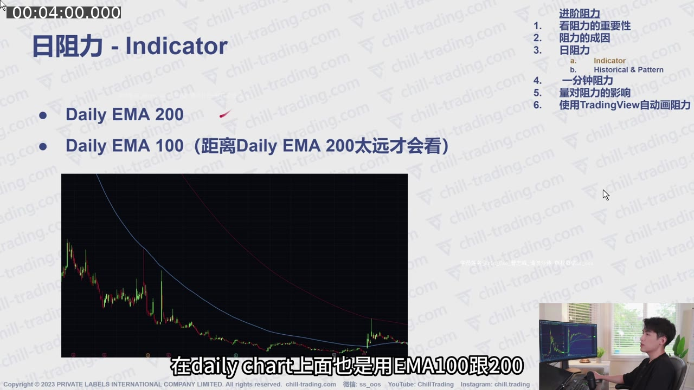
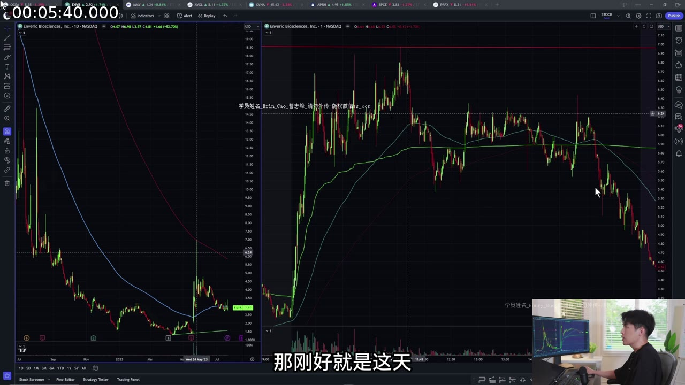
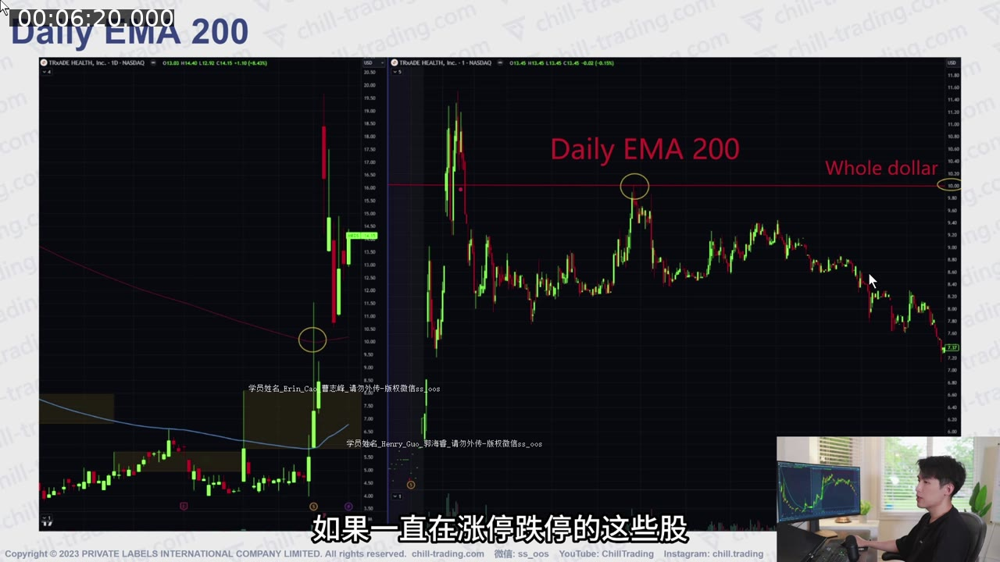
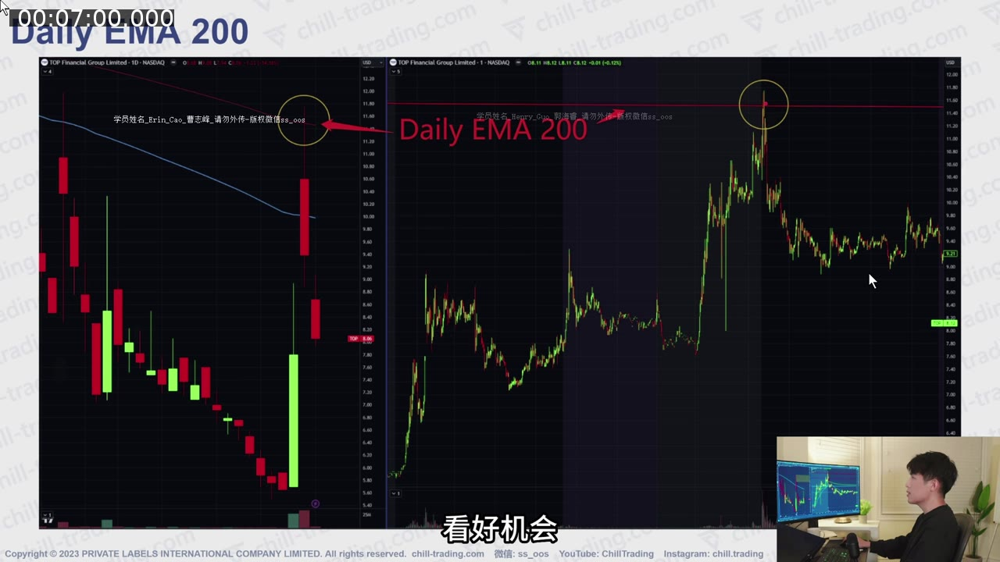
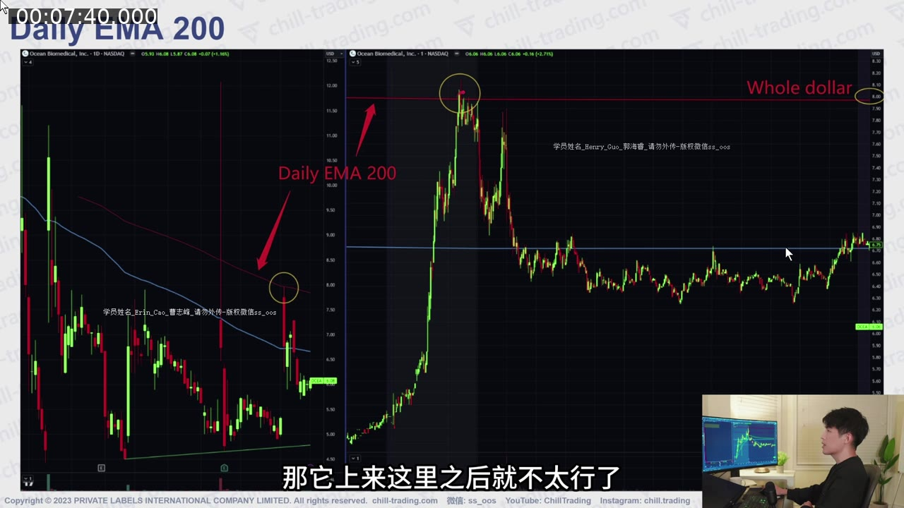
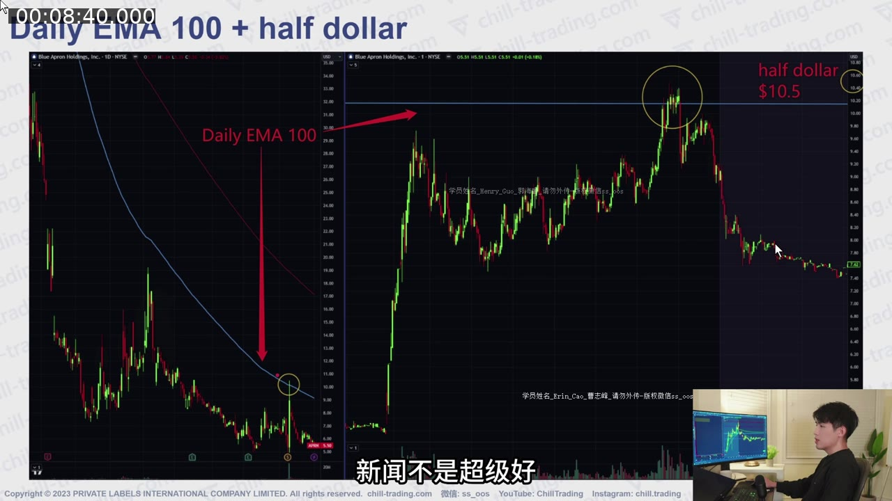
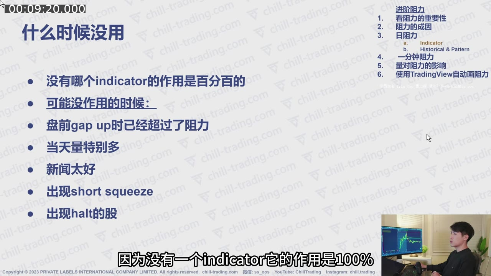
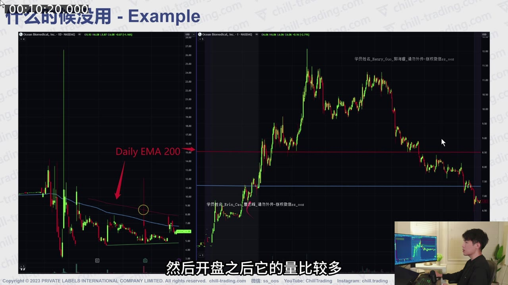

# 第 1 课：进阶阻力（一）——Daily EMA 阻力

> 对应视频：`01-daily-ema-resistance.mp4`  
> 视频时长：11:00  
> 核心问题：当 whole/half dollar、Level 2 大单、VWAP 和短周期 EMA 都被突破后，怎样从日线图找到可能造成“大反转”的下一层阻力？

## 配图阅读方法

本课截图应按三个层次看：

1. 左侧 Daily Chart 上，当前价格从哪一侧接近 EMA；
2. EMA 附近是否还有 whole/half dollar 或历史高点；
3. 右侧盘中走势触及该区域后，是立即回落、短暂穿越，还是突破后站稳。

每张图下面都标出“看哪里”和“能得出什么结论”。点击图片可查看原始 1080p 视频帧。

## 一、为什么这套交易系统特别重视阻力

讲师主要交易的是盘前已经大幅跳空上涨的 **gapper**。这类股票开盘时往往已经远离过去的支撑位，而且只要新闻、成交量和资金流仍然强，价格本身的上涨动量就可能充当短期支撑。

因此，这套方法把注意力更多放在上方：

- Long trader：接近强阻力时，准备止盈或至少降低预期；
- Short seller：接近强阻力时，开始准备 Locate、观察失败信号和寻找做空位置；
- 空仓观察者：提前知道哪些价格值得重点盯盘，而不是等反转发生后才解释。

这里的“阻力”不是一个必定反转的精确点，而是一个卖压更可能集中出现的 **价格区域（resistance area）**。

## 二、阻力为什么会形成

视频给出三类参与者。理解成因的目的，是避免把阻力线当成没有逻辑的“魔法线”。

### 1. 等待机会的 short sellers

不同交易者可能独立找到相似的日线阻力。当价格接近该区域时，做空卖单同时增加，形成向下压力。

### 2. 过去被套的持仓者（bagholders）

一只股票曾在高位有大量成交，之后大幅下跌。没有止损、继续持有的人会被套在高位。将来价格重新回到其成本区时，一部分人会想“终于解套”，于是卖出。

视频以 AMC 作直观解释：假设过去很多人在约 $40 交易，而价格后来跌到 $10 以下；以后若重新回到 $40，历史持仓者的解套卖盘可能形成阻力。

重点不是 AMC 的具体价格，而是：

`过去高成交区 → 下跌套牢 → 价格返回 → 解套卖盘`

### 3. 当天 long traders 的连锁离场

前两类卖压让价格从阻力处回落后：

1. 新买家看到冲高失败，参与意愿下降；
2. 成交量开始减少；
3. 已经入场的日内多头陆续离场；
4. 离场卖单进一步压低价格；
5. 更弱的价格行为又吓退更多买家。

这解释了为什么一个阻力失败有时不只产生一根红 K，而会发展成持续较久的下跌趋势。

## 三、什么是 Daily EMA 阻力

### 1. EMA 的基本含义

EMA 是指数移动平均线。它把过去多个交易日的价格压缩成一条平滑曲线，并对较新的价格赋予更高权重。

本课使用：

- **Daily EMA 100**：日线图上的 100 日指数移动平均；
- **Daily EMA 200**：日线图上的 200 日指数移动平均。

不要把“Daily EMA 200”误解成 200 分钟均线。它的时间框架是 daily chart，每根 K 线代表一天。

### 2. 讲师的使用优先级

讲师基于个人经验，认为：

- Daily EMA 200 通常是更值得优先观察的阻力；
- Daily EMA 100 的可靠度相对低一些；
- 当 EMA 200 离当前价格太远，EMA 100 才更有实际交易意义。

**图 1-1 怎么看：**

- 浅蓝线和红线分别代表视频设置中的 Daily EMA100 与 EMA200；
- 两条线不是固定价格，它们会随着每日价格变化而移动；
- 图中 EMA100 离当前低价区更近，EMA200 更远，所以价格上涨时会先测试 EMA100；
- “先遇到”不等于“更强”。本课的判断是：EMA100 可能先产生反应，但如果强动能突破它，EMA200 才是下一层更重要的候选阻力。

这不是“EMA 200 每次都有效”，而是把它当作事前候选位置，再用新闻、成交量、波动、Level 2 和价格反应确认。

## 四、阻力叠加（Confluence）

单一阻力的意义有限；多个独立依据落在同一价格附近时，讲师认为成功率更高。

常见叠加包括：

- Daily EMA 200 + whole dollar；
- Daily EMA 100 + half dollar；
- Daily EMA + 历史高成交/套牢区；
- Daily EMA + Level 2 明显卖单；
- Daily EMA + 冲高失败的 K 线结构。

例如 EMA 200 位于 $10.02，whole dollar 在 $10。虽然两个数字不完全相同，仍可把 $10 附近看成一个阻力区域，而不是争论到底应画在 $10.00 还是 $10.02。

## 五、视频案例拆解

### 案例 1：EMVB——EMA 200 与 whole dollar 重合（04:49–05:56）

视频中的第一只股票从约 $10 附近快速上涨，触及 Daily EMA 200 后无法继续，并在随后大幅回落。

观察重点：

1. 过去两次触及 EMA 100 后都出现回落；
2. 随着 EMA 100 下降到约 $2.50，它离当前强势行情太近，较容易被突破；
3. 突破 EMA 100 后，下一个重要候选位置是 EMA 200；
4. EMA 200 又与 whole dollar 接近，形成双重阻力。

学习重点不是记股票代码，而是建立从近到远的阻力地图：

`近端 EMA 100 → 若被突破则看 EMA 200 → 再检查是否与整数位重合`

**图 1-2 怎么看：**

- 先看左侧 Daily Chart：黄色圈标出价格与 EMA200 相遇的位置；
- 再看右侧盘中图：红色水平线同时标出 EMA200，旁边还有 whole-dollar 标注；
- 股价第一次到达该区域后没有继续扩张，而是形成顶部并向下；
- 这张图支持的是“多个阻力依据在同一区域时值得重点观察”，不是“碰到红线就一定做空”。

### 案例 2：MEDS——强波动/反复停牌时，阻力可直接失效（05:56–06:36）

MEDS 的 EMA 200 同样与 whole dollar 接近，但股票当时持续出现快速上涨和停牌，波动极强，第一次接近阻力时直接突破。

后来波动减弱，再次回到 EMA 200 + whole dollar 区域时，阻力反应才更明显。

结论：

- 阻力强度不能脱离当时的 momentum；
- 停牌频繁、量能急剧增加的股票可能越过通常有效的技术位置；
- “价格到了 EMA”不是立刻逆势做空的充分条件。

**图 1-3 怎么看：**

- 左侧日线上的黄色圈是 EMA200 附近；
- 右侧价格并没有在第一次接触后立刻形成稳定顶部，而是穿越阻力继续冲高；
- 这说明技术位置必须和当时的速度、成交量及暂停状态一起解释；
- 如果只截取“后来回落”的结果，会产生事后偏差；真正困难的是第一次触及时并不知道顶部已经形成。

### 案例 3：TOP——隔夜继续 Gap Up 到 EMA 200（06:36–07:39）

TOP 第一天因新闻上涨，盘后继续走高；第二天再次 gap up，开盘位置正好接近 Daily EMA 200，同时附近还有历史阻力。

可能发生的参与者行为：

- 预先研究日线的 short sellers 在同一区域等待；
- Long traders 看到多重阻力后降低追价意愿；
- 开盘快速下跌后，成交量迅速衰减；
- 量能下降使之后的反弹越来越弱。

**图 1-4 怎么看：**

- 左侧日线先用黄色圈定位 EMA200；
- 右侧盘中图显示价格隔夜抬高后，开盘区域正接近同一条红色水平线；
- 随后的回落不是由 EMA 单独“制造”的，而是技术阻力、隔夜获利盘和开盘卖压共同作用的结果；
- 复盘时应记录价格到达阻力前后的成交量，而不能只看最终 K 线形状。

### 案例 4：OCEA——EMA 既可作阻力，也可作支撑（07:39–08:37）

OCEA 在盘前 gap up 到 EMA 200 + whole dollar + 历史阻力附近，之后无法继续。

但同一张日线也显示：

- EMA 100 曾形成支撑并出现反弹；
- EMA 200 也曾形成支撑，配合新闻后价格继续上涨。

因此 EMA 的角色取决于价格从哪一侧接近：

- 从下方靠近：可能是阻力；
- 突破并站稳后回踩：可能由阻力转为支撑；
- 从上方下跌接近：可能直接表现为支撑。

**图 1-5 怎么看：**

- 左侧黄色圈标出价格由下向上接近 EMA 时的阻力反应；
- 右侧盘中走势展示价格越过某条均线后，均线也可能转为下方参考；
- 关键不是均线的名字，而是价格位于均线哪一侧、第一次测试还是重复测试，以及测试后有没有站稳；
- 因此不能在图表上看到 EMA 就预设固定方向。

### 案例 5：EMA 100 + Half Dollar（08:37–09:24）

当 EMA 200 仍在很远的上方，而新闻和量能又不足以支持持续大涨时，讲师会看更近的 EMA 100。视频案例中，股价从约 $5 上涨到 $10.50，Daily EMA 100 恰好在 half dollar 附近，随后价格转弱。

这一案例说明，EMA 100 不是固定使用，而是取决于它在当前价格路径中是否是“下一个有实际意义的障碍”。

**图 1-6 怎么看：**

- 左侧红色箭头指向 Daily EMA100；
- 右侧黄色圈标出价格到达约 10.50 美元的位置；
- 这里同时有 EMA100 和 half-dollar 两个事前可见的依据；
- 正确用法是接近该区时减少追涨、等待失败信号；错误用法是提前假定 10.50 一定是最高点。

## 六、什么时候 Daily EMA 容易失效

视频明确强调：没有任何 indicator 百分之百有效。以下因素同时出现得越多，突破阻力的可能性越高：

- 盘前已经 gap 到 EMA 上方；
- 新闻强度很高；
- 成交量显著增加；
- 波动率非常大；
- 频繁触发 volatility halt；
- 空头被迫回补，形成 short squeeze。

**图 1-7 怎么看：**

- 左侧列出的因素不是各自独立的开关，而是一个强动能环境的组合；
- 新闻、量能、暂停和 short squeeze 同时出现得越多，单一 EMA 越不应被当作硬顶；
- 这张图最重要的用途，是提醒你在画完阻力线后还要写一列“什么情况会让我放弃这个判断”。

### 盘前已经突破时怎么办

如果价格在盘前已经明确越过 EMA：

1. 不应继续把该 EMA 当成上方未测试阻力；
2. 观察价格能否保持在 EMA 上方；
3. 若之后回踩不破，它可能转成 support；
4. 向上重新寻找下一处阻力。

视频最后的示例展示了高量和强 momentum 突破 EMA 100、再突破 EMA 200，之后 EMA 200 成为支撑，并推动 short squeeze。

**图 1-8 怎么看：**

- 左侧日线先标出原本的 Daily EMA200；
- 右侧盘中价格越过该线后没有立即跌回，而是在其上方运行；
- 原阻力只有在“突破并站稳”后才可能转成支撑，不是蜡烛瞬间穿线就完成角色转换；
- 复盘时应同时保存触线、突破、回踩和后续四个阶段，避免只用最终截图证明自己的判断。

## 七、开盘前的实际工作流

### Step 1：确认股票是否属于强势 gapper

记录：

- Gap percentage；
- 盘前成交量；
- 新闻催化；
- Float 与流动性；
- 是否已出现多次停牌或异常波动。

### Step 2：打开 Daily Chart

先标：

- Daily EMA 100；
- Daily EMA 200；
- 明显的 whole / half dollar；
- 历史成交密集区或前高。

### Step 3：按价格从近到远排列

不要只记一根线。例如当前价 $8：

1. EMA 100：$8.50；
2. Whole dollar：$9；
3. 历史阻力：$9.80–$10；
4. EMA 200：$10.05。

这会形成一张“价格路标图”。

### Step 4：找叠加区域

若 EMA 200 为 $10.05，而历史阻力和 whole dollar 都在 $10 左右，可定义 `$9.90–$10.10` 为重点区域。

### Step 5：到达前准备，不提前猜顶

Long：

- 接近阻力时分批止盈；
- 收紧风险；
- 不在强阻力下方盲目追高。

Short：

- 提前检查是否可借；
- 等价格实际出现失败、卖压或动量下降；
- 避免只因“碰线”就逆势下注。

### Step 6：若突破，立刻更新地图

- 删除已经明确失效的阻力假设；
- 观察阻力是否变支撑；
- 转向下一个候选阻力；
- 不要因为原计划想做空就不断加仓对抗强 momentum。

## 八、最容易犯的错误

1. **把 EMA 当成精确到一分钱的墙**  
   应看区域和反应，不应只看价格是否刚好触线。

2. **只看 EMA，不看新闻与量**  
   强催化、高量和停牌行情可快速突破技术阻力。

3. **在价格到达前就提前做空**  
   你可能在真正阻力到来前已经被 squeeze。

4. **阻力突破后仍坚持原判断**  
   旧阻力可能失效，甚至转换成新支撑。

5. **把示例的相关性当成保证**  
   视频展示的是讲师选出的案例，不是统计回测；应自行记录足够样本。

6. **混淆时间框架**  
   Daily EMA 的含义来自日线；一分钟 EMA 100/200 是另一组信号。

## 九、复盘记录模板

每次遇到 Daily EMA，可以记录：

| 字段 | 内容 |
|---|---|
| 股票 / 日期 |  |
| 新闻催化 |  |
| 盘前量 / 开盘量 |  |
| 当前趋势 |  |
| EMA 100 / EMA 200 |  |
| 是否叠加 whole/half dollar |  |
| 是否叠加历史阻力 |  |
| 首次触碰反应 |  |
| 是否突破并转为支撑 |  |
| 是否出现 halt / squeeze |  |
| 实际交易与结果 |  |

## 十、复习题

1. 为什么讲师对 gapper 更重视 resistance 而不是旧 support？
2. 阻力形成的三类参与者分别是谁？
3. EMA 100 和 EMA 200 在讲师方法中的优先级是什么？
4. 为什么 EMA 200 与 whole dollar 重合时更值得关注？
5. 盘前已经在 EMA 200 上方时，开盘还能直接把它当上方阻力吗？
6. 哪些信号说明 Daily EMA 更可能被突破？

### 答案摘要

1. 强势 gapper 已远离过去支撑，近期更需要知道上方何处可能出现集中卖压。
2. 等待阻力做空的人、过去被套等待解套的人、冲高失败后陆续离场的日内多头。
3. 优先观察 EMA 200；它太远时再重点看 EMA 100。
4. 两个独立观察依据在同一区域形成 confluence。
5. 不能；应观察它是否已失效或转成支撑，并寻找下一阻力。
6. 强新闻、高量、大波动、频繁 halt、盘前已突破和 short squeeze。

## 十一、一句话总结

**Daily EMA 不是“到线就反转”的按钮，而是提前标出的决策区；真正的交易信号来自阻力叠加与价格、成交量和动量对该区域的实际反应。**
