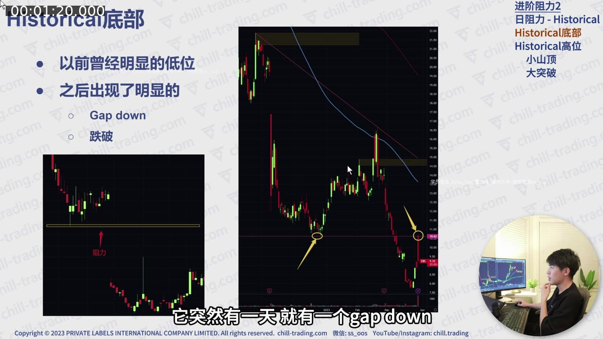
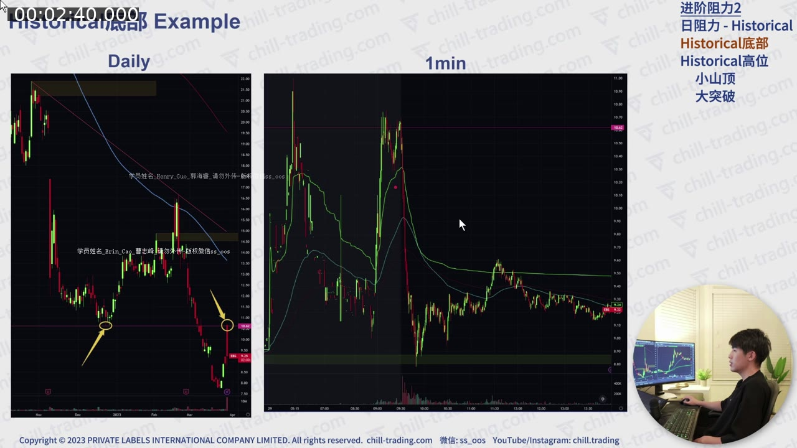
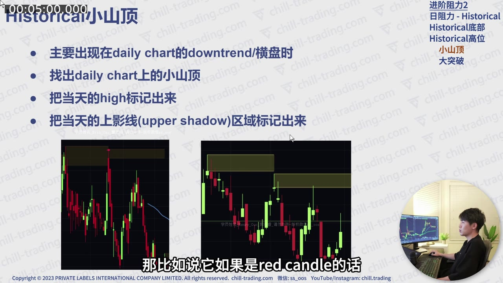
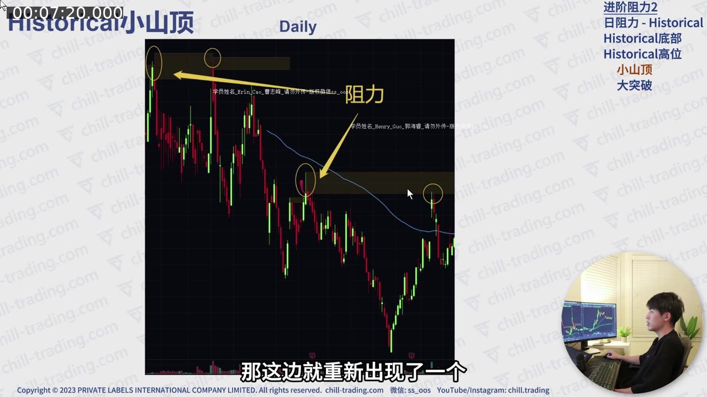
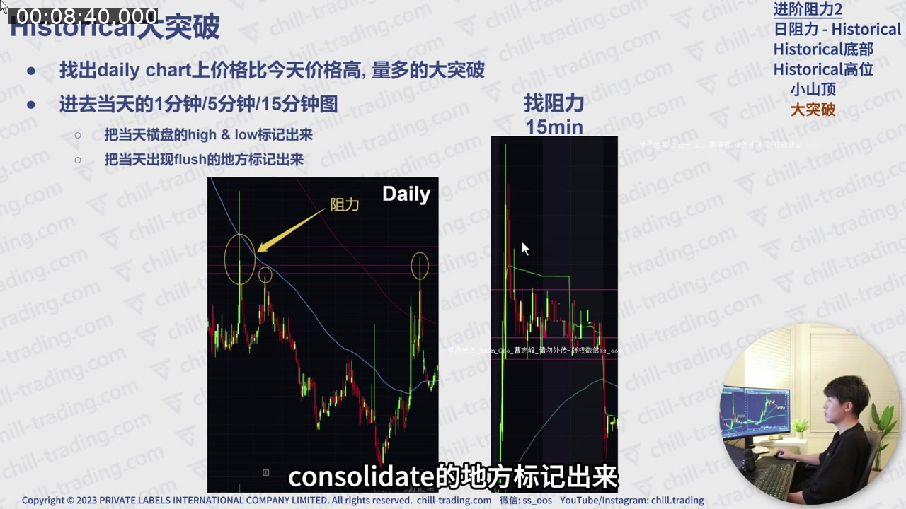
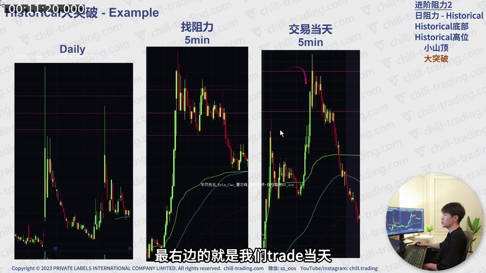
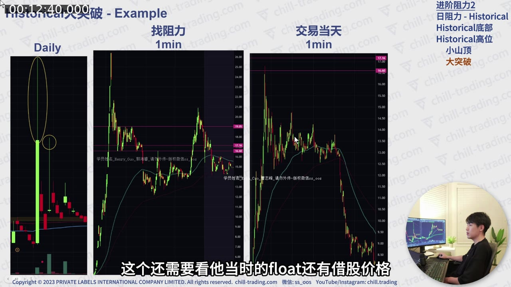
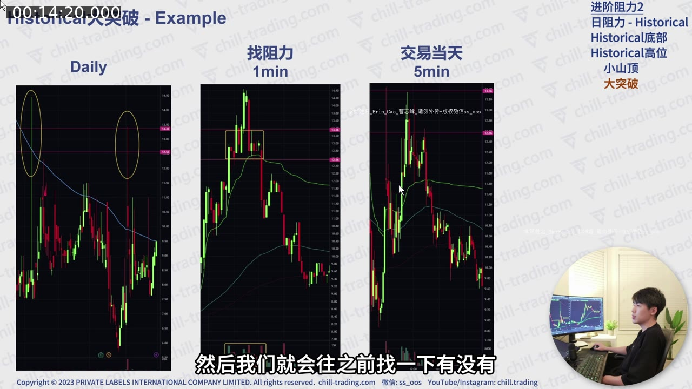

# 第 2 课：进阶阻力（二）——Historical Resistance

> 对应视频：`02-historical-resistance.mp4`  
> 视频时长：15:37  
> 核心问题：不依靠现成 indicator，怎样从历史日线和当日分时走势中找出套牢盘、前支撑和过去大成交区形成的阻力？

## 配图阅读方法

本课每个案例都要在两个时间层级之间来回切换：

1. **Daily Chart** 用来找到“哪一天、哪个区域值得研究”；
2. **1m / 5m / 15m Chart** 用来确认当时到底在哪里横盘、放量和突然下跌。

看截图时先确认图上写的是 Daily 还是 intraday，再看黄色圈、黄色线和阴影区域。不要把日线大 K 的整个高度都当成阻力。

## 一、Historical Resistance 与 EMA 阻力的区别

EMA 100/200 是平台直接计算出来的线；Historical Resistance 需要交易者主动阅读历史价格结构。

工作方式是：

1. 在盘前或股价开始上涨时打开 Daily Chart；
2. 向左查看过去的价格波动；
3. 找到符合特定 pattern 的历史日期或区域；
4. 必要时进入那一天的 1 分钟、5 分钟或 15 分钟图；
5. 把潜在卖压区域画在当前图表上。

视频把 Historical Resistance 分成两大类：

- **Historical 底部**：过去的明显低点/支撑被跌破后，未来成为阻力；
- **Historical 高位**：
  - 小山顶；
  - 大突破日留下的套牢区。

## 二、类型一：Historical 底部

### 1. 结构定义

先找过去曾经非常明显的低位。随后发生以下任一情况：

- 股价从这个区域直接 gap down；
- 股价在附近交易一段时间后，明确跌破这个 low。

原来的支撑被破坏后，价格长期位于其下方。以后股价从下方重新涨回这里，旧支撑便可能转换为新阻力。

可记成：

`过去支撑 → Gap down / breakdown → 长期在下方 → 反弹回测 → 潜在阻力`

**图 2-1 怎么看：**

- 左侧小图表示过去的水平支撑被向下跌破；
- 中间日线示例的黄色圈分别标出原支撑和以后回测的位置；
- Gap down 与普通 breakdown 的共同点，是价格在跌破后长期位于旧支撑下方；
- 只有以后从下方重新接近时，这个“旧底部”才具有阻力候选意义。

### 2. 为什么旧底部会变成阻力

这一类阻力不一定主要来自大量 bagholders，也可能来自：

- 交易者普遍能看到的明显技术位置；
- 等待旧支撑回测的 short sellers；
- 原本期待支撑有效、但跌破后被套的持仓者；
- 整数位附近额外出现的心理卖压。

历史位置越清楚、越多人能画出相似的线，越值得提前关注。

### 3. Whole Dollar 的叠加

视频案例中，一个旧底部正好在 $5 附近。之后价格两次尝试突破：

- 第一次未能突破；
- 第二次略微越过，但很快跌回。

这里不是“$5 永远不能过”，而是 Historical 底部与 whole dollar 叠加，让 $5 附近成为一个更显眼的决策区域。

**图 2-2 怎么看：**

- 左侧 Daily Chart 用黄色圈标出过去底部；
- 右侧 1 分钟图显示当天价格第一次靠近该线后回落，之后再次测试；
- 第二次测试可以短暂越线，因此阻力应理解为区域而非一个绝对 tick；
- 真正需要观察的是越线后能否继续成交并站稳，而不是只看最高价是否高出几分钱。

### 4. 当天如何使用

如果一只 gapper 盘前或开盘正好来到旧底部：

1. 先把旧底部画成区域；
2. 看开盘后是否迅速进入 downtrend；
3. 若第一波已跌很多，不宜在低位追空；
4. 等反弹重新接近阻力，观察是否出现低量反弹、上影线或冲高失败；
5. Long trader 在该区域下方避免追高。

视频指出：若开盘在阻力处快速下跌，后续成交量常变小；错过最早的 short 后，再追入的收益风险可能明显变差。

### 5. 多个 Historical 底部

一张日线可能有多个清楚的旧底部。视频建议都画出来，再按价格依次处理：

- 第一条线可能只造成短暂回落；
- 如果突破，观察下一条；
- 不要因为第一处阻力失效，就认定上方没有阻力。

其中一个案例在首个区域先下跌、随后反弹；股票 easy-to-borrow，先前做空者可能被 squeeze。价格来到下一个约 $35.83 的旧底部区域时，出现 shooting star 后才明显回落。

这说明：

- 阻力地图需要多层；
- 借股难易和空头拥挤会影响第一次反应；
- 应根据价格确认，而不是只依赖历史线。

## 三、类型二 A：Historical 小山顶

### 1. 什么是“小山顶”

它常见于 Daily Chart 的 downtrend 或横盘阶段。价格多次反弹，但每次在类似区域留下局部高点，看起来像一连串小山峰。

视频的标记方法：

1. 找出日线局部高点；
2. 标出当天的最高价；
3. 标出当天 K 线实体顶部；
4. 把二者之间的 **upper shadow（上影线）区域** 作为候选阻力。

K 线实体顶部的计算：

- Red candle：实体顶部是 open；
- Green candle：实体顶部是 close；
- 上影线区间：`当日 high → 实体顶部`。

**图 2-3 怎么看：**

- 视频不是只在最高点画一条细线，而是把 K 线实体顶部到最高价之间视作候选区间；
- 多个局部山顶的上影区域重叠时，比单独一根随机上影更有参考价值；
- 红 K 与绿 K 的实体顶部定义不同，所以必须先分辨当日开盘价和收盘价；
- 阴影区只代表历史卖压发生过，不能告诉你今天的买盘强度。

### 2. 为什么上影线区域值得关注

上影线代表价格曾到达更高位置，但未能保持，收盘前被压回。未来重回该区时，可能遇到：

- 过去在此建立或增加空头仓位的大资金；
- 希望维护长期 downtrend 的 trading firm；
- 看到“过去到这里就失败”的技术交易者；
- 过去追高、等待解套的持仓者。

### 3. 小山顶阻力的强度

讲师明确认为，这种阻力通常不如“大突破套牢区”强。它更适合做提醒：

- 到达该区域后降低追价；
- 检查是否出现 reversal；
- 若新闻强、量大，则接受它可能轻易被突破；
- 突破后转向下一个小山顶或其他阻力。

TradingView 可以显示/辅助画出部分历史水平，但自动线仍需人工判断，不应因为平台画出来就默认有效。

**图 2-4 怎么看：**

- 顶部黄色线连接较高的一组历史失败位置；
- 中间黄色圈标出更近、更低的小山顶；
- 当前价格反弹时会先遇到低层阻力，突破后才讨论上层；
- 这就是“阻力地图”的含义：提前排出层级，而不是只挑一个最符合事后走势的点。

## 四、类型二 B：Historical 大突破套牢区

这是讲师最常用、认为较强的一类 Historical Resistance。

### 1. 先在日线找“过去的大日子”

站在今天的交易日向左找：

- 当天最高价高于今天当前价格；
- 成交量显著放大；
- 当天出现大幅 breakout；
- 随后又出现明显 flush 或失败。

Daily Chart 只能告诉你“哪一天值得深入”，不能准确告诉你那一天的套牢成交集中在哪个价格。

### 2. 再进入那一天的 intraday chart

根据数据可用性选择：

- 较近日期：优先看 1-minute；
- 更久以前：可能只有 5-minute 或 15-minute；
- 目标不是固定使用最短周期，而是看清当日成交结构。

进入历史日期后，重点标两类位置：

1. **高成交 consolidation 区域**；
2. **大幅 flush 发生前最后维持住的价格区域**。

**图 2-5 怎么看：**

- 左侧 Daily 先用大 K 找到异常交易日；
- 右侧较短周期图负责展开那一天的内部结构；
- 应标出横盘平台的 high / low，以及 flush 前最后被守住的位置；
- 如果历史数据只有 15 分钟图，线会更粗糙，交易时应把它当宽区域而不是精确价格。

### 3. 为什么 consolidation 会留下强阻力

假设过去某天：

1. 新闻推动股价大涨；
2. 大量交易者在高位 consolidation 中买入；
3. 价格突然 flush；
4. 许多人来不及止损，成为 bagholders；
5. 以后价格重新回到他们的成本区；
6. 解套卖单集中出现。

与“小山顶”相比，大突破日通常有更高成交量，因此潜在套牢筹码更多。

### 4. 怎样画这个区域

不要把整个历史大 K 线都当阻力。应缩小到：

- Consolidation 的高低边界；
- 成交最集中的平台；
- Flush 前最后一个支撑/平台；
- Whole/half dollar 等容易重合的位置。

可以画成多条线，也可以画一个窄区间。交易时先看下沿反应；若突破，观察区间上沿或下一层。

## 五、视频中“大突破”案例的逻辑

### 案例 A：过去大涨、当天高位横盘后 Flush（约 10:40–12:40）

流程：

1. Daily Chart 找到过去一根高量大涨 K；
2. 打开该日 5 分钟图；
3. 找到高位 consolidation；
4. 标出 consolidation high/low；
5. 标出 flush 前的位置；
6. 回到今天的图，观察价格进入这些线后的反应。

视频显示，当前交易日价格接近过去平台后无法保持，形成回落。这里真正有意义的是过去高位“有大量人完成交易”，不是日线 K 线颜色本身。

**图 2-6 怎么看：**

- 最左是 Daily，用黄色圈定位过去大涨日；
- 中间是历史 5 分钟图，粉色水平线来自高位横盘和 flush 前平台；
- 最右是当前交易日，观察价格重新进入这些粉色线后的反应；
- 三张图缺一不可：只看 Daily 不知道筹码集中在哪，只看今天又不知道这几条线为何存在。

### 案例 B：新的失败会产生新的阻力（约 12:40–14:10）

股票后来再次因新闻上涨，在约 $13 附近出现 consolidation 与整日下跌。这个新失败区域又成为下一次上涨要面对的新阻力。

因此 Historical Resistance 不是静态不变：

`每一次高量上涨失败 → 都可能新增一层未来阻力`

复盘后应更新图表，而不是永远只保留几年前的线。

**图 2-7 怎么看：**

- 左侧日线显示新的大幅上涨日；
- 中间图把约 13 美元附近的当日横盘区展开；
- 右侧后续交易日再次回到相同价格带时，先前失败留下的参与者可能卖出；
- 这里应记录一个价格带，而不是把“13”本身当作具有魔力的数字。

### 案例 C：日线很 Choppy，仍需检查具体成交量（约 14:10–15:37）

最后一个案例的 Daily Chart 波动杂乱。讲师先找出过去比当前价格更高的大绿 K，再进入当天图表确认：

- 价格虽然突破明显；
- 但真正高位交易时间不算很长；
- 成交量也没有特别极端；
- 仍可能留下 bagholders，但阻力强度应打折。

这提醒我们：形状相似，不代表筹码规模相同。还要看成交量、持续时间、float 和当时价格。

**图 2-8 怎么看：**

- 左侧日线有多个视觉上相似的高点，单看形状很容易画太多线；
- 中间和右侧盘中图帮助判断高位停留时间与成交是否真的集中；
- 如果高位只是瞬间经过、成交量又不突出，潜在 bagholders 较少，阻力权重应降低；
- 复盘时可以给每条线标注“强 / 中 / 弱”和形成日期，避免图表被无差别水平线填满。

## 六、四类 Historical Resistance 对照

| 类型 | 日线特征 | 具体画法 | 讲师判断的相对强度 | 主要逻辑 |
|---|---|---|---|---|
| 旧底部 Gap Down | 明显低位后直接跳空下跌 | 标旧低位区域 | 中等 | 旧支撑转阻力 |
| 旧底部 Breakdown | 明显低位被正式跌破 | 标被跌破的 low | 中等 | 回测旧支撑 |
| 小山顶 | Downtrend/横盘中的局部高点 | 标上影线区域 | 较弱 | 过去冲高失败、空头防守 |
| 大突破套牢区 | 高量突破后失败 | 进入历史分时图标 consolidation/flush 前平台 | 较强 | 大量高位成交者等待解套 |

## 七、盘前画线的完整流程

### Step 1：从当前价格向上扫描 Daily Chart

只找当前价格以上、当天可能触及的位置。太远的线会增加噪声。

### Step 2：先标旧底部

检查：

- 是否有清晰 gap down；
- 是否有明确 breakdown；
- 是否与 whole/half dollar 重合。

### Step 3：标小山顶

对 downtrend / consolidation 中的局部高点，画 upper-shadow 区域。

### Step 4：找过去大突破日

筛选高量、大波动、后来失败的日期。

### Step 5：深入历史 intraday data

把高成交 consolidation 与 flush 前位置画出来。

### Step 6：给每个区域打等级

可以使用：

- A：大突破高量套牢区 + 整数位/其他阻力叠加；
- B：清楚旧底部或多个小山顶重合；
- C：单个小山顶、低量或很久以前的模糊结构。

### Step 7：交易中动态更新

- 阻力下方：Long 不盲目追高；
- 进入区域：观察量、Level 2、K 线失败；
- 明确突破：转向下一层；
- 突破后回踩守住：旧阻力可能成为支撑。

## 八、常见错误

1. **只看日线，不进入历史分时图**  
   日线大 K 无法告诉你真正的高成交平台在哪。

2. **把一根细线当作绝对价格**  
   Historical Resistance 通常是区域。

3. **画太多线**  
   每几分钱一条线会失去决策价值，应保留清楚且当天可能触及的位置。

4. **忽略新闻与成交量**  
   小山顶在强催化、高量环境中很容易被突破。

5. **阻力被突破后马上做空加仓**  
   突破可能触发 squeeze；应转看下一层或观察回踩。

6. **只看形状，不看历史成交规模**  
   同样的 consolidation，低量短暂停留与高量长时间交易的套牢盘完全不同。

7. **事后挑最好看的位置**  
   复盘时必须记录开盘前实际画出的线，避免用结果倒推。

## 九、练习

任选一只当天 gapper：

1. 只看开盘前数据，截一张 Daily Chart；
2. 分别找：
   - 一个旧底部；
   - 一个小山顶；
   - 一个过去大突破日；
3. 进入大突破日的 intraday chart；
4. 标 consolidation 与 flush 前平台；
5. 给每个区域打 A/B/C 等级；
6. 收盘后检查首次触碰、突破、回踩和成交量反应。

## 十、复习题

1. Historical 底部怎样从 support 转换为 resistance？
2. Red candle 和 green candle 的上影线区域分别从哪里开始？
3. 为什么大突破日不能只看 Daily Chart？
4. 小山顶阻力在什么环境下更容易失效？
5. 为什么一个新发生的高量冲高失败，会成为未来的新阻力？

### 答案摘要

1. 旧低位被 gap down 或 breakdown 后，未来从下方回测时成为潜在卖压区。
2. Red candle 从 open 到 high；green candle 从 close 到 high。
3. 需要进入分时图定位真正的 consolidation 和 flush 前高成交区。
4. 强新闻、高成交量和强 momentum 环境。
5. 新一批高位买入者被套，未来价格返回时可能集中卖出。

## 十一、一句话总结

**Historical Resistance 的本质不是“过去碰过这个价”，而是判断过去哪里发生了足够清楚、足够集中的交易失败，以至于未来价格返回时可能再次出现卖压。**
