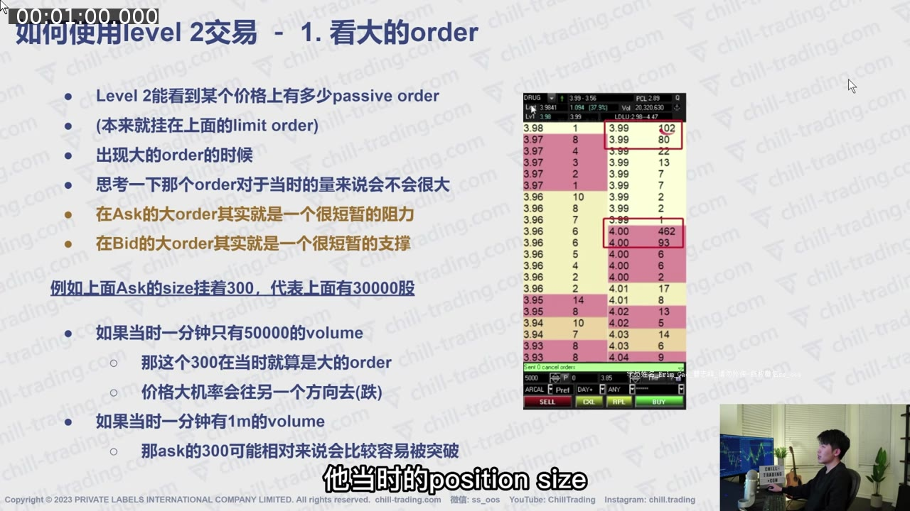
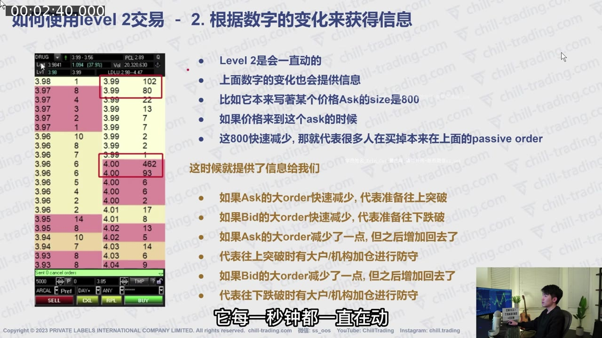
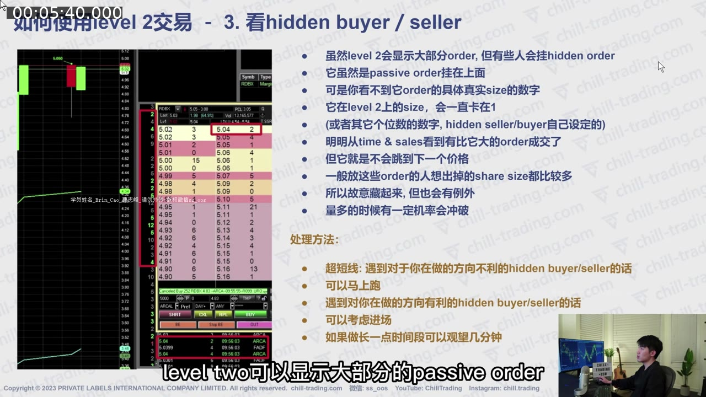
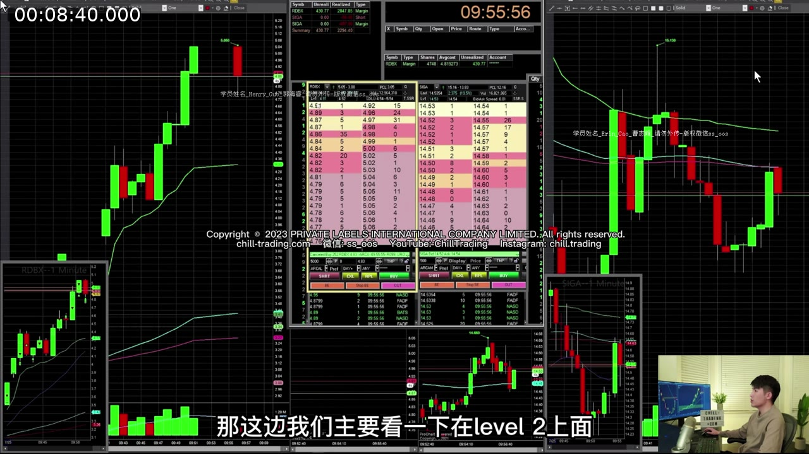
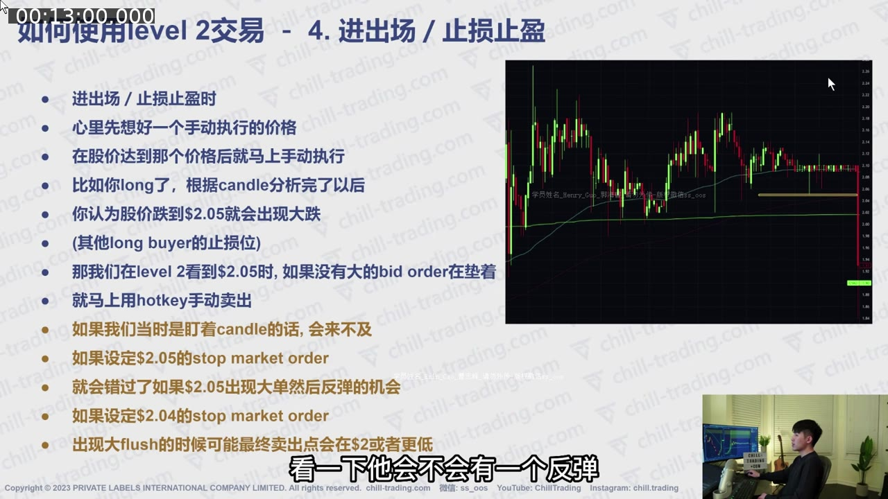
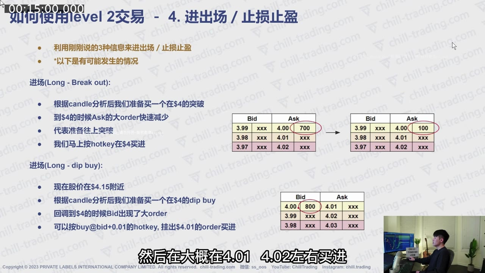
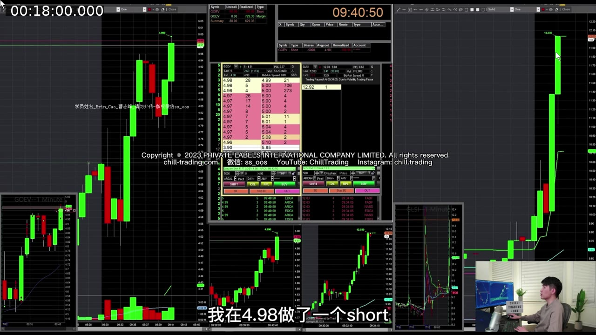
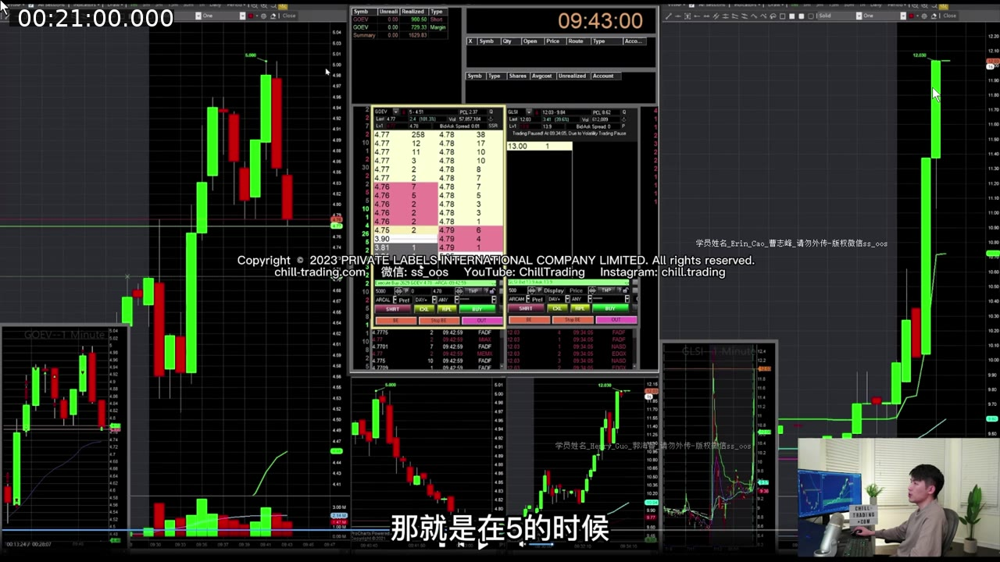

# 第 4 课：如何使用 Level 2 交易

> 对应视频：`04-trading-with-level-2.mp4`  
> 视频时长：21:37  
> 核心问题：怎样从订单簿的大单、订单变化和隐藏流动性中获取 K 线没有的信息，并把它用于入场、止盈和止损？

## 配图阅读方法

Level 2 不能用一张静态截图完整解释，因为真正的信息来自**变化过程**。本课截图按下面顺序阅读：

1. 先在 K 线图上确认价格位置；
2. 再找 Level 2 中当前 best bid / ask 和相对大单；
3. 最后用相邻时间的截图或正文描述判断订单是减少、撤掉还是反复补回。

截图只能证明某一瞬间屏幕显示了什么，不能证明挂单之后一定成交。图片中的数量单位也属于视频平台设置。

## 一、Level 2 提供什么

K 线告诉你一段时间内已经发生的 open/high/low/close；Level 2 显示当前不同价格上的部分等待成交订单，因此更接近实时供需。

讲师把使用方式分成四层：

1. 看较大的 order；
2. 看 order size 怎样变化；
3. 找 hidden buyer / hidden seller；
4. 把前三类信息用于 entry、exit 与 stop loss。

Level 2 更适合需要精确执行的超短/短线。若计划持仓一两个小时，它的重要性可能降低。缺点是变化很快，长时间盯盘消耗注意力。

## 二、必须先懂的基础

### 1. Bid、Ask 与 Spread

- **Bid**：等待买入的限价订单；
- **Ask**：等待卖出的限价订单；
- **Best bid**：当前最高买价；
- **Best ask**：当前最低卖价；
- **Spread**：best ask 与 best bid 之间的差。

### 2. Passive 与 Aggressive Order

- Passive order：挂在订单簿上等待别人来成交，例如 limit buy at bid；
- Aggressive order：主动跨过 spread 与对手方成交，例如 market buy 或可立即成交的 limit buy。

Level 2 主要让你看到部分 passive liquidity；Time & Sales 显示实际成交。

### 3. Size 的单位

视频中的 DAS 风格界面把 size 按“百股”显示，例如 `300` 表示约 30,000 股。不同平台设置可能不同，使用前必须确认自己的单位，不能照搬。

## 三、第一层：看大单，但必须相对判断

### 1. 大 Ask 可能形成短期阻力

若某价格的 ask 上有远大于附近档位的卖单，价格向上需要足够多的主动买单把它吃掉。

### 2. 大 Bid 可能形成短期支撑

若 bid 上有大量买单，主动卖单需要先消耗这批需求，价格才容易继续下跌。

### 3. “大”不是绝对数字

视频举例：ask size 为 300，即约 30,000 股。

- 若股票每分钟只有 50,000 股成交，30,000 股是很大的障碍；
- 若每分钟成交 1,000,000 股，30,000 股可能很快被吃掉。

判断式：

`订单相对强度 ≈ 显示订单股数 ÷ 当前每分钟成交量`

不需要精确计算百分比，但必须建立量级感。

**图 4-1 怎么看：**

- 红框标出 Ask 上相对较大的显示订单；
- 视频假设界面 size 以百股为单位，因此 `300` 约对应 30,000 股；
- 若该股一分钟只成交约 50,000 股，这笔单足以显著减慢上涨；若一分钟成交 1,000,000 股，它可能很快被消耗；
- 所以“大单”必须与流速比较，不能跨股票使用同一个固定阈值。

### 4. 大单不是保证

- 订单可以被取消；
- 同一参与者可拆单；
- 不同交易所/路由显示的深度不完整；
- 大单可能在价格接近时消失；
- 高量 momentum 可以直接消耗它。

因此，大单是“值得观察的潜在流动性”，不是必定守住的墙。

## 四、第二层：订单变化通常比静态快照更重要

Level 2 每秒都在变化。视频要求观察：

- 大单增加还是减少；
- 价格靠近时它仍在还是撤掉；
- 被成交后是否真的消耗；
- 消耗后是否重新补回；
- Bid 与 Ask 哪一边正在失去力量。

### 常见变化的解释

| 现象 | 可能含义 |
|---|---|
| 大 Ask 快速减少/消失 | 上方阻力减弱，可能准备向上突破 |
| 大 Bid 快速减少/消失 | 下方支撑减弱，可能准备向下跌破 |
| Ask 被持续买入但仍补回 | 可能有隐藏/补充卖家 |
| Bid 被持续卖出但仍补回 | 可能有隐藏/补充买家 |
| 大单在价格接近时突然撤掉 | 原先支撑/阻力不再可信，也可能是诱导性挂单 |
| 大单先减少后又恢复 | 参与者可能只撤了部分，也可能有新订单加入 |

这些都只是可能解释，必须结合 Time & Sales、成交量、图表位置和实际价格移动。

**图 4-2 怎么看：**

- 上方红框是 Ask，数量快速减少意味着上方可见卖压正在变薄；
- 下方红框是 Bid，数量快速减少意味着下方可见承接正在变弱；
- “减少”可能来自成交，也可能来自撤单，所以必须同时看 Time & Sales；
- 只有价格随后向相应方向移动，盘口变化才获得结果确认。

## 五、第三层：Hidden Buyer / Hidden Seller

### 1. Hidden order 是什么

有些 passive order 不显示真实总数量，只在 Level 2 上显示一个很小的固定数量。每次部分成交后，显示数量继续补回。

例如 ask at $5.04 显示 size `2`（约 200 股）：

1. Time & Sales 显示有人主动买了 5,000 股；
2. 正常情况下，200 股早应被吃完，价格应去下一个 ask；
3. 但 $5.04 仍显示 `2`，且价格无法突破；
4. 这说明可能有 hidden seller 在持续供给。

Hidden buyer 则相反：大量卖单打到某个 bid，但该价格仍不断吸收，无法跌破。

**图 4-3 怎么看：**

- 中间 Level 2 某档只显示很小的 size；
- 关键不在“小”，而在 Time & Sales 已成交远超显示数量后，该价位仍持续补回；
- 如果成交后价格顺利穿过，该订单只是普通小单；如果大量成交却卡住，才可能存在隐藏流动性；
- Hidden order 的真实剩余数量不可见，因此讲师把它当成短线离场理由，而不是尝试猜总量。

### 2. 为什么要同时看 Time & Sales

仅看 Level 2 的小 size 无法证明隐藏订单。必须看到：

- 实际成交量显著大于显示量；
- 成交发生在同一价格；
- 显示 size 反复补回或价格持续卡住。

### 3. Hidden 不一定无限大

隐藏只是“不显示真实总量”，不代表不可突破。高 volume、强催化或更多 aggressive orders 仍可能把它全部成交。

### 4. 超短线处理

- Long 遇到 ask 上的 hidden seller：讲师倾向先离场，因为不知道总量多大、多久才能突破；
- Short 遇到 bid 上的 hidden buyer：同理，应提高警惕或 cover；
- 若隐藏流动性与计划方向一致，可作为支持信息，但不能单独决定入场。

持仓周期越短，无法突破几秒就可能破坏交易逻辑；持仓周期较长，则可以给它更多时间。

**图 4-4 怎么看：**

- 左侧和右侧图表负责告诉你当前接近什么价位；
- 中间粉黄订单簿展示可见 Bid / Ask；
- 旁边逐笔成交窗口用于核对大单究竟被成交还是被撤掉；
- 单独盯中间窗口容易失去上下文，所以实际阅读顺序应始终是“图表位置 → 盘口 → 成交结果”。

## 六、第四层：把 Level 2 用于入场

讲师强调，先从图表确定大致交易位置，再用 Level 2 微调执行。不能反过来，因为盘口里永远能找到某个看似有意义的数字。

### 情景 A：Long Breakout

假设图表显示 $4 是 breakout level：

1. 先由 candle/pattern 判断突破逻辑；
2. 观察 $4 ask 上的大单；
3. 若 ask size 持续减少，主动买单正在消耗卖压；
4. 大单接近被吃完时，用预设 hotkey 执行；
5. 若大单突然补回、出现 hidden seller 或价格无法保持，及时退出。

### 情景 B：Long Dip Buy

假设图表支持在 $4 附近做 dip buy：

1. 看 $4 bid 是否有明显承接；
2. 看卖单打到 $4 时 bid 是否保持；
3. 可用接近 bid 的限价方式尝试成交；
4. 若大 bid 被撤掉或迅速消耗，原支撑逻辑失效。

### 情景 C：Short at Resistance

与 breakout long 相反：

1. 图表先确认阻力；
2. Ask 出现较大卖单；
3. 主动买单无法突破；
4. Bid 逐步下移或变薄；
5. 才考虑 short，并把阻力突破定义为风险。

**图 4-5 怎么看：**

- 上半部分的 breakout 示例关注 Ask 大单是否从约 700 持续缩小；
- 下半部分的 dip-buy 示例关注 Bid 大单是否仍在承接；
- 两者都先有图表上的 $4 计划价，Level 2 只负责微调触发；
- 如果没有预先定义的图表位置，相同的数字变化可以被任意解释为买入或卖出理由。

## 七、用 Level 2 止盈

### Long 止盈

若 long 后上涨到 $4.22：

- Ask 出现远大于附近档位的卖单；
- Time & Sales 显示买盘无法继续推进；
- 可以在大 ask 前用可成交的限价方式退出，例如接近 ask 一分钱；
- 若发现 hidden seller，则更快处理。

### Short 止盈

若 short 后下跌：

- Bid 出现明显大单；
- 卖单无法继续压低；
- 可能是潜在支撑；
- 可以 cover 全部或部分 position。

Level 2 的价值是帮助决定“当前继续持有还有没有即时优势”，不是寻找完美最高/最低点。

## 八、用 Level 2 止损或保本离场

### 1. 显示支撑撤掉

假设 long entry 在 $4.10，预期 $4 反弹：

1. 原本 $4 bid size 为 300 多；
2. 价格回到 $4 时，size 降到约 100；
3. 支撑明显变弱；
4. 讲师会用 sell at bid 尽量在 $4 附近离场，接近 break-even。

### 2. 遇到 Hidden Seller

更坏的情况是价格回到 $4：

- Ask/Bid 某档 size 卡在很小数字；
- Time & Sales 大量成交后仍无法向有利方向移动；
- 说明有隐藏流动性阻挡；
- 不知道真实 size 时，讲师倾向立即退出，而不是等待。

**图 4-6 怎么看：**

- 上半部分比较原有 Bid 支撑缩小后的处理；
- 下半部分比较显示小单却持续阻挡价格的 hidden seller；
- 两种情况的共同点是：支持原交易的即时流动性已经变弱；
- “保本”只表示接近入场价，并不保证扣除点差、手续费和滑点后净盈亏为零。

## 九、完整实盘案例：$5 Ask 阻力与 $4.77 Bid 支撑（18:02–21:36）

### Entry

- 讲师在约 $4.98 建立 short；
- $5 是 whole dollar；
- Level 2 的 $5 ask 有较大订单；
- 价格尝试突破 $5，但卖单持续存在；
- 这支持继续持有 short。

**图 4-7 怎么看：**

- 左侧 K 线已快速上涨到 $5 附近，整数量级先提供图表背景；
- 中间 Level 2 的 Ask 侧用于确认该区域是否持续有卖压；
- 讲师约在 $4.98 做空，并不是因为看到任意一笔大 Ask，而是整数阻力与盘口反应同时出现；
- 如果 $5 的卖单被快速吃掉且价格站稳，原 short 逻辑应重新评估。

### Holding

下跌过程中：

- Ask 一侧持续有相对较大的订单；
- Bid 没有同等强度的承接；
- 讲师没有因为小反弹立即 cover；
- 继续观察前 low 能否被跌破。

### Exit

- 价格下到约 $4.77；
- Bid 出现约 200 多的较大订单；
- Short 已持有约两分钟，从 $5 附近下跌到 $4.77；
- 下方继续突破的即时难度增加；
- 讲师 cover / take profit。

**图 4-8 怎么看：**

- 右侧走势已经从 $5 附近明显下跌，交易已有利润垫；
- Level 2 的 Bid 出现相对较大的承接，继续向下需要更多主动卖单；
- 这并不预测 $4.77 一定是最低点，只说明 short 当下的即时优势下降；
- Exit 的理由是风险收益改变，而不是尝试精准买在最低点。

这笔交易中 Level 2 提供了两条不同信息：

- $5 大 Ask：帮助确认 entry/继续持有；
- $4.77 大 Bid：帮助决定 exit。

## 十、Level 2 阅读顺序

每次只按固定顺序看，避免信息过载：

1. **图表位置**：当前接近哪一个预先计划的 level？
2. **Best bid/ask 与 spread**：执行成本是否合理？
3. **附近相对大单**：哪一侧有明显流动性？
4. **变化**：增加、减少、撤单还是补单？
5. **Time & Sales**：主动买卖是否真的成交？
6. **价格结果**：成交后价格有没有移动？
7. **与计划对齐**：支持、否定还是无关？

## 十一、常见错误

1. **脱离图表，只看 Level 2 下单**；
2. **把任何大单都当绝对支撑/阻力**；
3. **忽略大单相对于每分钟 volume 的比例**；
4. **只看显示 size，不看 Time & Sales**；
5. **把 hidden order 当作永远打不穿**；
6. **看到单子撤掉后仍按原计划等待**；
7. **Level 2 与交易逻辑冲突时扩大止损**；
8. **没有在 demo account 练熟 hotkey 就实盘快速下单**。

## 十二、练习方法

视频建议先用 demo account：

1. 选一只活跃股票，只录屏不交易；
2. 每次标记一个大 ask/bid；
3. 记录 5–10 秒内 size 如何变化；
4. 对照 Time & Sales；
5. 记录价格是突破、反弹还是无反应；
6. 每天复盘 10 个片段；
7. 熟悉后再练 hotkey，并把 size 降到最小。

## 十三、复习题

1. 为什么 30,000 股订单有时巨大，有时不重要？
2. 怎样从 Time & Sales 辅助识别 hidden seller？
3. 大 Bid 突然撤掉，对 long trade 意味着什么？
4. 为什么 Level 2 应用于执行，而不是代替图表交易计划？
5. $5 Ask 帮助了案例中的哪一步，$4.77 Bid 又帮助了哪一步？

### 答案摘要

1. 必须与股票当前每分钟成交量比较。
2. 实际主动买入量远大于显示 ask，但该价格仍补回、无法突破。
3. 原支撑变弱，需重新评估或执行止损。
4. 盘口变化太快且信息不完整；图表先定义位置、方向和失效条件。
5. $5 Ask 支持 short entry/holding；$4.77 Bid 提供 cover/take-profit 信号。

## 十四、一句话总结

**Level 2 的重点不是记住某个数字，而是观察一个关键价格上的流动性在真实成交到来时，是被消耗、撤走、补回，还是隐藏着更大的买卖方。**
