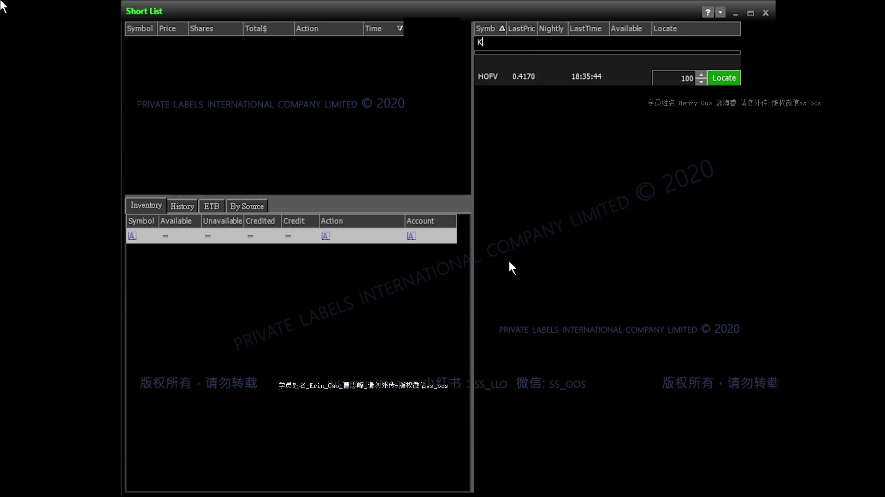
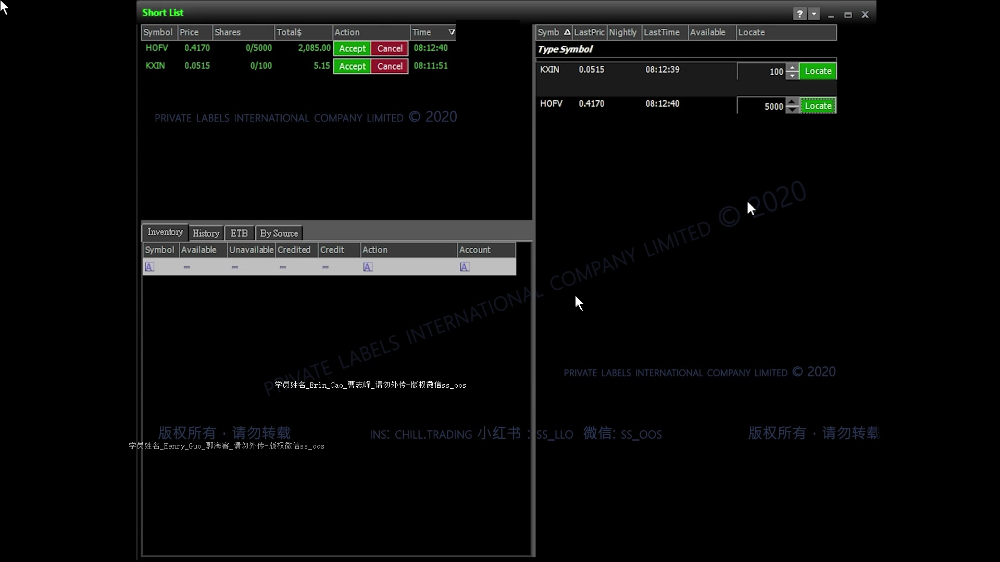
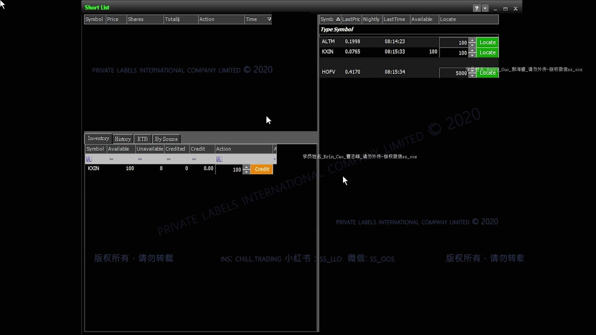

# 第 6 课：做空前如何借股（Locate / Borrow）

> 对应视频：`06-short-locates.mp4`  
> 视频时长：03:12  
> 本课性质：券商平台操作演示。画面中的平台是 **TradeZero**，视频画面标注为 2020 年；界面、价格、退费和隔夜规则都可能已经变化，实际操作前必须以自己券商的最新说明为准。

## 配图阅读方法

这节视频只有三分钟，截图重点是区分三个不同状态：

1. 右上输入股票和股数，只是在**询价**；
2. 左上出现 `Accept / Cancel`，表示券商返回了 **Locate 报价**；
3. 左下 `Inventory` 出现 `Available`，表示报价已接受并得到**可卖空库存**。

这三步都不等于已经建立 short position。截图中的按钮、字段和规则属于 2020 年版本，只用于解释视频。

## 一、这节课要解决什么问题

有些股票不能直接做空。提交卖空订单前，券商必须先确认有股票可以借给你。对难借股票（hard-to-borrow），交易者通常需要先在券商平台上做一次 **Locate**：

1. 输入股票代码；
2. 输入计划做空的股数；
3. 获取一份借股报价；
4. 判断费用是否值得；
5. 接受报价后，才获得当天可用于做空的股数。

这节课的重点不是“什么时候做空”，而是：已经看到潜在 short setup 后，怎样取得可卖空的库存，以及怎样评估借股成本。

## 二、先分清四个容易混淆的概念

### 1. Short setup

你在图表或盘口上发现的做空机会，例如股价接近阻力位、冲高失败或出现弱势结构。它只是交易判断，还不代表你已经能下空单。

### 2. Locate

向券商查询并锁定一批可借股票的过程。视频右侧窗口里的绿色 `Locate` 按钮就是发起查询。

### 3. Borrow / short inventory

接受 Locate 报价后，账户获得的可卖空股数。视频在下方 `Inventory` 页签中显示：

- `Symbol`：股票代码；
- `Available`：当前仍可拿来做空的股数；
- `Unavailable`：当前不能使用的股数；
- `Credited` / `Credit`：与归还库存、可返金额有关；
- `Action`：输入归还数量并执行 `Credit`。

### 4. Short position

真正成交的空头持仓。Locate 100 股只表示“你最多有 100 股可用于做空”，并不等于你已经做空 100 股。只有卖空订单成交后，才产生 short position。

可把整个流程记成：

`发现做空机会 → Locate 报价 → 接受并获得库存 → 下卖空单 → 买回 Cover → 归还剩余库存`

## 三、TradeZero 界面操作流程

### Step 1：打开借股窗口（00:03–00:18）

讲师从 TradeZero 主界面的菜单打开 `Short List` / Locate 窗口。窗口大致分为三块：

- 左上：本次 Locate 报价列表；
- 右上：输入股票代码和股数并点击 `Locate`；
- 左下：已经接受的借股库存，以及 `Credit` 操作。

### Step 2：输入股票代码与数量（00:18–00:39）

视频先以 `KXIN` 为例：

1. 在 `Type Symbol` 输入股票代码 `KXIN`；
2. 输入希望借入的数量，例如 100 股；
3. 点击绿色 `Locate`；
4. 等待左上区域出现报价。

这里输入的应该是“你计划可能做空的数量”，不是随意填得越大越好，因为费用通常会随股数线性增加。

**图 6-1 怎么看：**

- 右上 `Type Symbol` 是股票代码输入框；
- 右侧数量框是想询价的股数，绿色 `Locate` 用于提交请求；
- 左上报价列表此时还没有新的 KXIN 行，说明询价和接受报价是两个动作；
- 左下 Inventory 为空，进一步说明账户尚未取得这只股票的可借库存。

### Step 3：阅读 Locate 报价（00:39–01:25）

报价行包含：

- `Symbol`：股票代码；
- `Price`：每股 Locate 费用；
- `Shares`：申请的股数；
- `Total$`：本次借股总费用；
- `Accept`：接受报价并付费；
- `Cancel`：放弃报价。

基本计算式：

`总借股费 = 每股 Locate 费 × Locate 股数`

视频中出现了几个很直观的例子：

| 股票 | 每股 Locate 费 | 股数 | 总费用 |
|---|---:|---:|---:|
| KXIN（较早报价） | $0.0515 | 100 | $5.15 |
| KXIN（稍后实际示范） | $0.0765 | 100 | $7.65 |
| HOFV | $0.4170 | 5,000 | $2,085.00 |

**图 6-2 怎么看：**

- 左上 `Price` 是每股 Locate 费，不是股票市场价格；
- `Shares` 显示申请数量，`Total$` 是整笔预留成本；
- KXIN：$0.0515 × 100 = $5.15；
- HOFV：$0.4170 × 5,000 = $2,085；
- 绿色 `Accept` 才会购买 Locate，红色 `Cancel` 表示放弃该报价。

这个画面也说明一个重要事实：**Locate 报价会变化**。KXIN 在不同时间从每股 $0.0515 变成 $0.0765，所以看到一次便宜报价，不代表稍后仍然是同一价格。

### Step 4：判断是否接受（01:00–01:31）

讲师用 HOFV 说明：如果每股 Locate 费很高，放大到实际仓位后，费用会迅速变得不可接受。HOFV 借 5,000 股需要先付 $2,085；这笔成本在交易开始前就已经给策略增加了非常高的盈利门槛。

讲师的个人原则是：Locate 太贵时通常不借。这里真正应该比较的是：

`预期交易利润` 是否明显大于 `Locate 费 + 佣金/平台费 + 滑点 + 其他费用`

例如，假设借 100 股共付 $7.65：

- 仅 Locate 费已经等于每股 $0.0765；
- 如果做空后股价只下跌 $0.05，毛利润为 $5；
- 在还没算佣金和滑点前，毛利润就已经小于 Locate 费。

因此“方向看对”不一定等于“交易赚钱”。

### Step 5：接受报价并获得库存（01:24–01:54）

讲师接受 KXIN 的 100 股报价，支付约 $7.65。接受后：

- Locate 报价从等待区消失；
- `Inventory` 中出现 `KXIN`；
- `Available = 100`，表示当天有 100 股可用于做空。

此时只是获得库存，还没有建立空头持仓。

### Step 6：做空、Cover 与 Credit（01:54–02:34）

如果随后真的卖空 KXIN：

1. 卖空成交后，形成 short position；
2. 当你买回股票时，叫 `cover`；
3. 如果已经 cover，并确定当天不会再做空这只股票，可以在库存区域选择数量并按 `Credit`，尝试把库存归还。

**图 6-3 怎么看：**

- 右上 KXIN 行显示当时新的报价 $0.0765，并显示 100 股 available；
- 左下 Inventory 中 `KXIN / Available 100` 表示已经买到 100 股可卖空库存；
- 橙色 `Credit` 位于库存行上，它不是 cover 按钮；
- 画面没有显示已成交的 short position，因此不能从 `Available 100` 推断讲师此时已经做空 100 股。

这里要注意：

- Cover 是关闭空头持仓；
- Credit 是归还尚可使用的借股库存；
- 两者不是同一个动作；
- 仍有 open short position 时，不能把维持该持仓所需的股票随意归还。

### Step 7：理解 Credit 的取舍（02:12–02:42）

讲师说，归还库存后，如果其他交易者再借到这批股票，券商可能退回一部分费用。但返还金额未必高，所以不要为了很小的返还，过早失去当天再次做空的能力。

这形成一个权衡：

- **早点 Credit**：可能拿回部分费用，但失去再次使用该库存的机会；
- **继续保留库存**：保留重做空的灵活性，但资金成本已经发生，也未必能退回。

讲师的建议是：只有真正确定当天不再需要 short 这只股票时，才考虑 Credit。

## 四、日内库存与隔夜空头（02:42–03:11）

按照视频中的讲法：

- 没有 open position 时，未使用库存大约会在晚上自动归还；
- 如果卖空仓位还没有关闭，就会变成 overnight short；
- 隔夜持有可能产生更高的费用。

讲师明确说自己不做 overnight short，并且对具体隔夜费用不确定。讲义因此不把视频中“可能是五倍”之类的口头示例当成规则。实际费率、库存回收时间和隔夜要求必须查自己的券商账户协议。

## 五、把 Locate 费放进风险收益计算

### 1. 每股盈亏

做空的毛利润：

`毛利润 =（卖空价 − Cover 价）× 成交股数`

净利润应至少再减去：

`Locate 费 + 佣金/平台费 + 监管费 + 滑点 + 可能的借券利息`

### 2. 保本所需跌幅

忽略其他费用时：

`仅覆盖 Locate 费所需的每股跌幅 = 总 Locate 费 ÷ 实际成交股数`

以视频中的 KXIN 为例：

- Locate 100 股，支付 $7.65；
- 如果 100 股全部用于卖空，仅覆盖 Locate 费就需要股价朝有利方向下跌 $0.0765；
- 如果只卖空 50 股，Locate 成本仍是 $7.65，则每个实际成交股需要贡献 $0.153，才能只覆盖 Locate 费。

因此，借了很多、实际只用了很少，会显著抬高每个成交股承担的成本。

### 3. 不要把 Locate 股数等同于仓位许可

Locate 到 5,000 股，只说明券商允许你最多卖空这么多，并不说明风险管理允许你卖空这么多。真实 position size 仍应由：

- 单笔最大允许亏损；
- 入场价到止损价的距离；
- 流动性和滑点；
- 账户购买力；
- 交易计划

共同决定。

## 六、常见错误

1. **把 `Price` 当成股票价格**  
   视频的 `Short List` 中，`Price` 是每股 Locate 费用，不是股票市价。

2. **Locate 后误以为已经持仓**  
   Locate 只是取得可卖空库存；订单成交才产生空头持仓。

3. **只看方向，不算成本**  
   难借股票即使下跌，跌幅也可能不足以覆盖 Locate 费。

4. **为了“以后可能用到”而过量 Locate**  
   没用到的库存也可能已经付费，造成成本浪费。

5. **过早 Credit**  
   稍后再次出现 short setup 时，可能需要重新 Locate，价格也可能已经上涨或没有库存。

6. **没有 Cover 就以为可以归还**  
   Open short position 与未使用库存必须分开理解。

7. **照搬旧视频中的时间与费率**  
   本视频界面来自 2020 年；自动归还时间、退款机制、隔夜费率和按钮位置都可能改变。

## 七、实战前检查单

- [ ] 我看到的是明确的 short setup，而不是因为“能借到”就想做空。
- [ ] 股票代码和 Locate 股数输入正确。
- [ ] 我确认 `Price` 是每股借股费，`Total$` 是总费用。
- [ ] 预期利润有足够空间覆盖 Locate、滑点和其他费用。
- [ ] Locate 股数不超过交易计划真正可能使用的范围。
- [ ] 接受报价后，我确认 `Inventory / Available` 已正确显示。
- [ ] 下单前，我已经确定入场、止损、目标和 position size。
- [ ] Cover 后，只有在确定不再需要库存时才考虑 Credit。
- [ ] 我了解自己券商当前的日内归还、退费和隔夜规则。

## 八、复习题

1. Locate 100 股与做空 100 股有什么区别？
2. 每股 Locate 费为 $0.08，借 2,000 股，总费用是多少？
3. 借 1,000 股花费 $100，但实际只做空 400 股；仅覆盖 Locate 费，每个成交股需要贡献多少利润？
4. 为什么价格方向判断正确，交易仍可能亏损？
5. Cover 和 Credit 分别关闭或归还什么？
6. 为什么 Locate 报价越高，策略需要的预期优势越大？

### 答案

1. Locate 只是取得最多可卖空 100 股的库存；卖空订单成交后才形成持仓。
2. `$0.08 × 2,000 = $160`。
3. `$100 ÷ 400 = $0.25/股`，还没包含其他费用。
4. 下跌产生的毛利润可能小于 Locate、佣金、滑点等总成本。
5. Cover 关闭空头持仓；Credit 归还未再需要的借股库存。
6. 因为 Locate 是交易开始前已经存在的成本，只有足够大的有利价格移动才能覆盖它。

## 九、一句话总结

**借得到不代表值得做：先把 Locate 总成本换算成每个实际成交股必须赚回的金额，再决定是否接受报价。**
