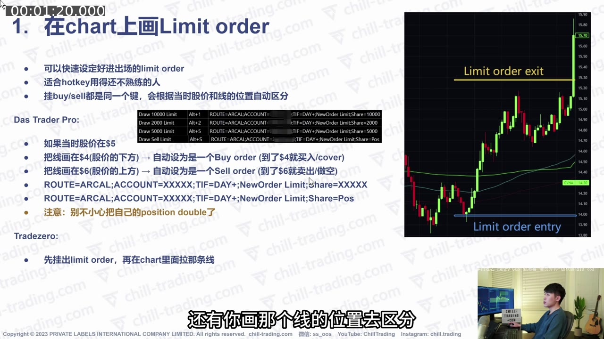
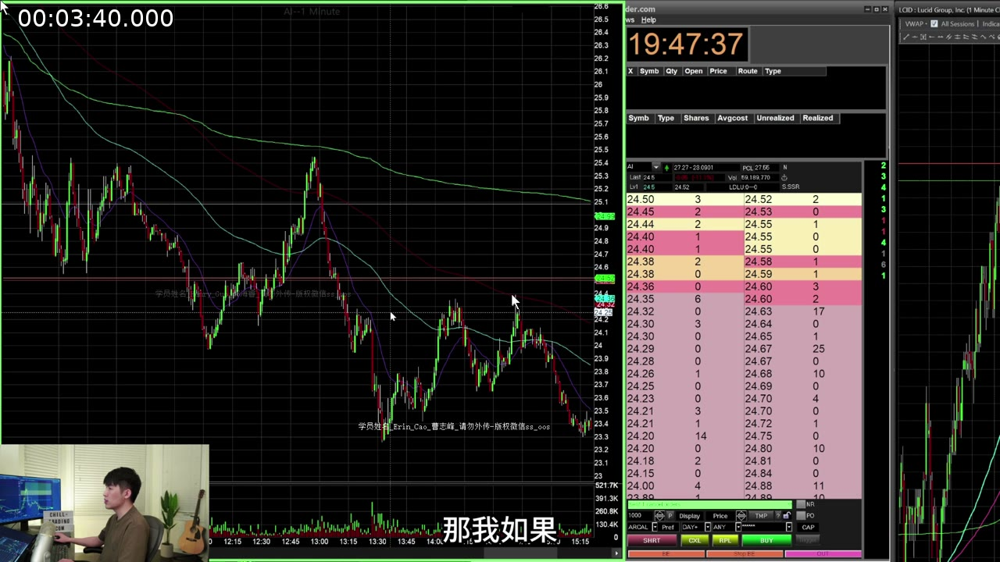
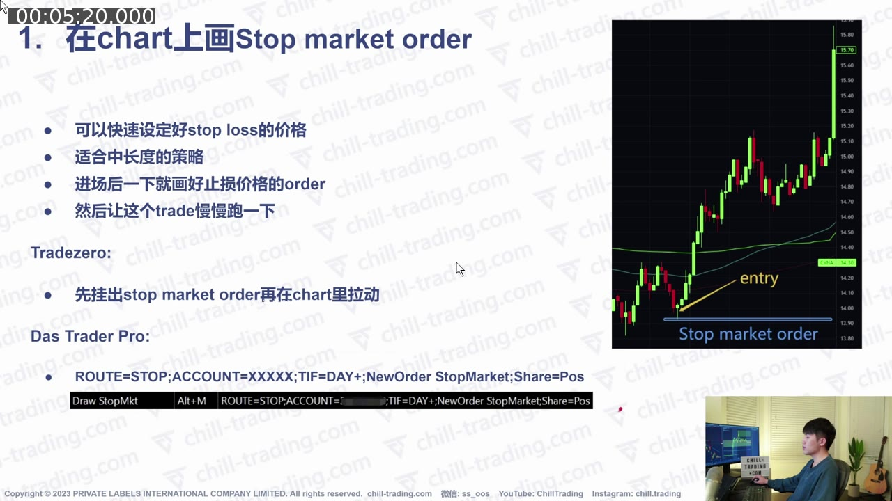
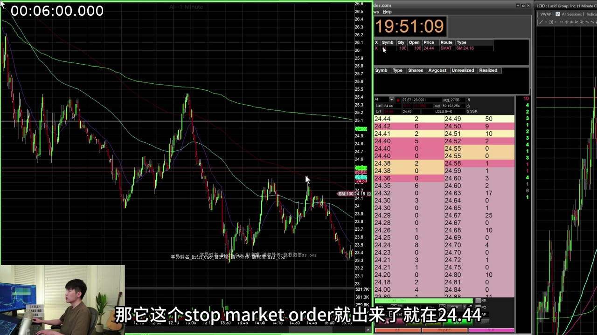
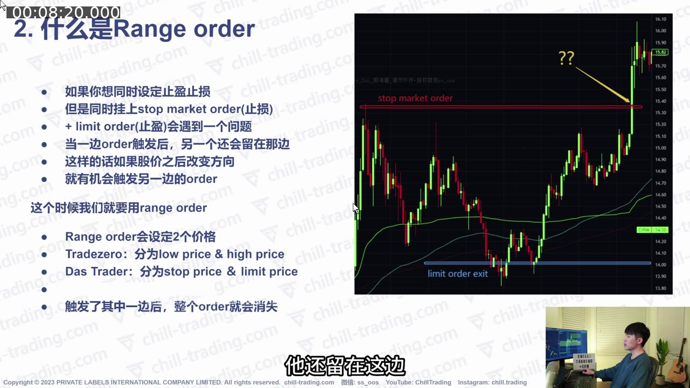
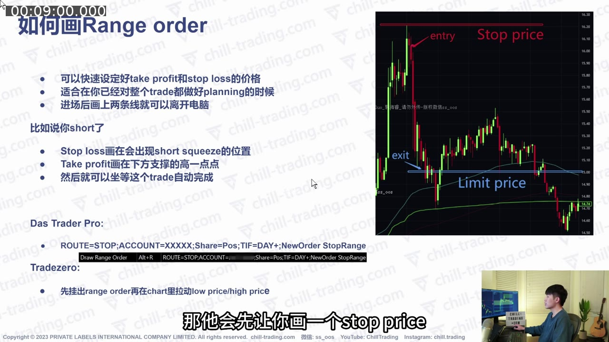
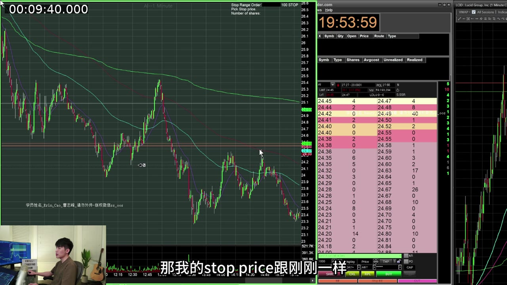
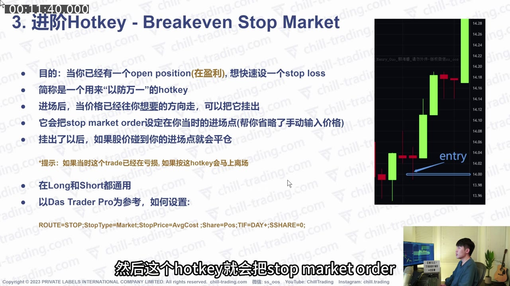
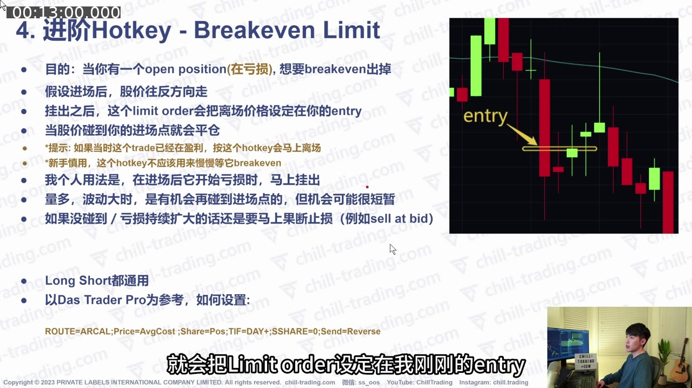
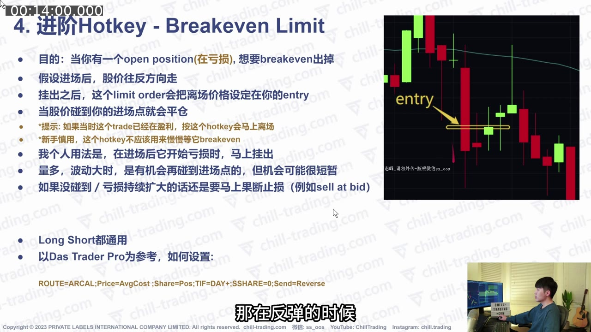

# 第 7 课：Hotkey、画线下单、Range Order 与 Breakeven

> 对应视频：`07-hotkeys-chart-orders-and-breakeven.mp4`  
> 视频时长：15:25  
> 核心问题：怎样直接在图表上设置 limit、stop-market 和成对止盈止损订单；以及怎样快速把盈利仓位保护到 breakeven，或在亏损仓位反弹时尝试平价离场？

## 配图阅读方法

本课每种订单都配有两类画面：

- **教学页**：看 entry、stop、limit 三条线之间的位置关系；
- **平台实操页**：看订单线出现后，是否仍在、能否拖动、成交后是否消失。

脚本截图只用于解释视频中的旧模板。不要从图片手工抄入实盘；必须用当前平台的 Script Builder，并在模拟账户检查方向、数量和撤单联动。

## 一、先说最重要的安全边界

视频展示的是 DAS Trader Pro / TradeZero 当时的界面与脚本。Hotkey 语法、route、订单类型、DAY+ 支持和画线方向都可能随平台、账户、版本和券商变化。

**不要把下面脚本直接放到实盘大仓位使用。**

正确顺序：

1. 阅读自己平台当前说明；
2. 在 simulator/demo 中验证；
3. 用 1 股分别测试 long 和 short；
4. 测试部分成交、撤单和盘前盘后；
5. 确认不会意外加仓或反向开仓；
6. 才逐渐用于真实交易。

## 二、为什么要在 Chart 上画订单

Level 2 hotkey 适合快速进出超短线；持仓时间稍长时，交易者可能想提前设定：

- Entry；
- Stop loss；
- Take profit。

图表画线的优势：

- 不必手动输入价格；
- 价格位置更直观；
- 可以拖动线快速修改；
- 便于提前规划，而不是临场情绪化下单。

TradeZero 的演示方式通常是先挂出订单，再在 chart 上拖动对应线；DAS Trader Pro 可以用专门 hotkey 进入画线模式。

## 三、第一类：Chart Limit Order

### 1. Limit Order 的含义

Limit order 限制可接受的成交价格：

- Buy limit：只在限价或更低价格成交；
- Sell limit：只在限价或更高价格成交。

它保证价格边界，但不保证一定成交，也可能只成交一部分。

### 2. 视频中的画线逻辑

在 DAS 画线模式中，同一个 hotkey 会根据画线位置相对当前股价自动判断方向。

假设当前价格 $5：

- 线画在 $4（当前价下方）→ buy order；
- 线画在 $6（当前价上方）→ sell order。

这可以用于：

- 下方埋伏 long entry；
- 下方 cover short；
- 上方卖出 long；
- 上方建立 short。



**图 7-1 怎么看：**

- 右侧图中下方蓝线是当前价下方的 limit entry，上方黄线是当前价上方的 limit exit；
- 对同一个 hotkey，平台根据画线在当前价上方还是下方判断 buy / sell；
- 左侧脚本中的 `Share=XXXXX` 与 `Share=Pos` 代表两种完全不同的数量行为；
- 如果仓位状态已经变化，原本想平仓的线可能变成加仓或反向开仓订单。

### 3. 最大危险：意外 Double / Reverse

平台只知道订单方向和股数，不知道你的主观目的。

例如：

- 你已经 long 5,000 股；
- 却在当前价下方画了 buy 5,000；
- 价格到达后不是止损，而是再买 5,000；
- 仓位变成 long 10,000。

同理，一个平仓订单在原仓位已手动关闭后仍留着，触发时可能直接建立反向 position。

### 4. 视频展示的 DAS 模板

课程画面中的历史模板如下，仅供辨认：

```text
ROUTE=ARCAL;ACCOUNT=XXXXX;TIF=DAY+;NewOrder Limit;Share=XXXXX
ROUTE=ARCAL;ACCOUNT=XXXXX;TIF=DAY+;NewOrder Limit;Share=Pos
```

- `Share=XXXXX`：固定股数；
- `Share=Pos`：按当前 position 股数；
- `ACCOUNT`、route 与语法必须按自己的平台修改。



**图 7-2 怎么看：**

- 图表上的水平订单线代表已经生成的订单，不只是视觉标记；
- Level 2 / 订单窗口应同时出现相应委托，必须核对价格、方向和股数；
- 拖动图上水平线会修改订单价格，修改后还要确认券商端已经接受；
- 手动平仓后应检查这条线是否仍在，避免之后触发反向仓位。

## 四、第二类：Chart Stop-Market Order

### 1. Stop Market 的含义

Stop price 被触发后，订单转为 market order。优点是优先尽快离场；缺点是实际成交价不保证，快速行情、低量或 halt resume 后可能产生很大 slippage。

### 2. 视频中的使用

适合已经入场并打算持有稍久的交易：

1. 建立 position；
2. 立即在图表上画结构性止损；
3. 让订单留在市场；
4. 不必一直手动盯住每个 tick。

TradeZero 演示是先挂 stop-market，再拖动 chart 上的线；DAS 通过画线 hotkey 设置。

### 3. 视频展示的 DAS 模板

```text
ROUTE=STOP;ACCOUNT=XXXXX;TIF=DAY+;NewOrder StopMarket;Share=Pos
```



**图 7-3 怎么看：**

- 右侧蓝线位于 long entry 下方，表示价格向下触发后以市价卖出；
- `StopMarket` 只指定触发后的订单类型，不保证最终成交在蓝线价格；
- `Share=Pos` 看似方便，但部分止盈后是否自动更新必须在自己的平台测试；
- 图上的止损线必须与结构失效点对应，不能只为了缩小账面亏损随意贴近。

### 4. Stop Market 的风险

- Gap 或快速 flush 会在远离 stop price 的位置成交；
- Halt 期间无法成交，resume 后可能跳空；
- `Share=Pos` 的计算时点要测试；
- 部分止盈后，原 stop size 是否自动更新不能想当然；
- 手动平仓后必须确认 stop 已取消。



**图 7-4 怎么看：**

- 图表上的水平线被拖到新的 stop price；
- 右侧订单/盘口区域用于确认修改是否生效；
- 快速行情中拖线动作和券商确认之间可能有延迟，不能只凭图线位置认为订单已修改；
- 暂停期间即使 stop 已触发，也可能要到恢复交易后才有机会成交。

## 五、为什么不能简单同时挂两个独立平仓单

假设 short 5,000 股：

- 上方挂 buy stop-market 作为止损；
- 下方挂 buy limit 作为止盈。

如果价格先下跌，take-profit limit 成交，short 已经完全 cover；但上方 stop 仍然存在。之后价格反弹触发该 stop：

- 它会再买 5,000 股；
- 原本用于 cover 的订单现在可能建立 long 5,000；
- 交易者如果已离开电脑，风险会继续扩大。

反方向的 long position 也有同样问题。

## 六、第三类：Range Order（成对止盈止损）

### 1. Range Order 的核心

Range order 同时定义两个价格：

- Stop price；
- Limit price。

其中一侧触发/成交后，另一侧订单应被取消。它的逻辑类似 OCO（One Cancels the Other）。

TradeZero 界面称 low price / high price；DAS 画面称 stop price / limit price。



**图 7-5 怎么看：**

- 红线和蓝线分别代表 stop 与 take-profit；
- 若两者是完全独立订单，先成交的一侧不会自动保证另一侧消失；
- 仓位已经平掉后，剩余订单再触发就可能建立反向仓位；
- Range / OCO 的价值不是多画一条线，而是维持两腿之间的取消关联。

### 2. Short 示例

- Entry 在中间；
- 上方 stop price：若价格上涨/squeeze，market cover 止损；
- 下方 limit price：若价格下跌到目标，limit cover 止盈；
- 任一侧完成后，另一侧取消。

### 3. Long 示例

- Entry 在中间；
- 下方 stop price：跌破时 market sell 止损；
- 上方 limit price：上涨到目标时 limit sell 止盈。

### 4. 视频展示的 DAS 模板

```text
ROUTE=STOP;ACCOUNT=XXXXX;Share=Pos;TIF=DAY+;NewOrder StopRange
```



**图 7-6 怎么看：**

- 示例 long 的 entry 位于中间；
- 上方是盈利目标 limit price，下方是保护仓位的 stop price；
- 触及一侧后，另一侧应按平台规则取消；
- “应取消”必须通过 simulator 验证，因为 partial fill、改单和不同券商路由可能改变实际行为。

### 5. 必须验证的细节

“一边成交后另一边取消”听起来简单，但实际要测试：

- 触发即取消，还是完全成交后才取消？
- Partial fill 怎样处理？
- 修改一条线是否破坏 OCO 关联？
- 盘前盘后是否支持？
- Stop leg 是 market 还是 limit？
- 断线、平台退出后订单是否仍在服务器？



**图 7-7 怎么看：**

- 实盘界面中可以看到上下两个订单边界；
- 拖动 stop 或 target 后，要检查另一腿的 OCO 关联是否仍保留；
- 图线存在不代表服务器端一定有效，订单窗口状态才是最终核对点；
- 若只部分成交，剩余数量与另一腿数量是否同步是最需要测试的边界条件。

## 七、第四类：Breakeven Stop-Market

### 1. 目的

当 position 已经盈利、价格朝有利方向移动后，用一个 hotkey 把 stop-market 放到平均成本 `AvgCost`。

若价格回到 entry：

- Long：触发 sell market；
- Short：触发 buy market；
- 目标是在 breakeven 附近离场。

### 2. 视频展示的模板

```text
ROUTE=STOP;StopType=Market;StopPrice=AvgCost;Share=Pos;TIF=DAY+;$SHARE=0;
```



**图 7-8 怎么看：**

- 图中市场价格已经向 entry 上方运行，仓位先有利润垫；
- 粉色 stop 放在 AvgCost 附近，用于价格回落时触发 market exit；
- 若价格已经跌到 entry 下方再按这个 hotkey，触发条件可能立即满足；
- 平均成本不是精确净保本价，成交滑点和费用仍可能造成小额亏损。

### 3. 重要陷阱

若当前 trade 已经亏损，市场价格已经越过 AvgCost：

- 新 stop 可能立即满足触发条件；
- 按 hotkey 后会马上离场。

即使在盈利：

- Stop-market 只把触发价设为成本；
- 实际 fill 可能因 spread/slippage 低于成本；
- 所谓 breakeven 不保证净利润为零，还要算费用。

## 八、第五类：Breakeven Limit

### 1. 目的

当 position 已经亏损，但交易者预期价格可能短暂反弹到 entry，可把平仓 limit 放在 AvgCost。

例如 long：

1. Entry 后价格下跌；
2. 按 hotkey 在 AvgCost 挂 sell limit；
3. 若短暂反弹回成本，订单自动卖出；
4. 若反弹不到，就不会成交。

Short 则在 AvgCost 挂 buy limit。

### 2. 视频展示的模板

```text
ROUTE=ARCAL;Price=AvgCost;Share=Pos;TIF=DAY+;$SHARE=0;Send=Reverse
```



**图 7-9 怎么看：**

- 黄色 `entry` 位于当前价格上方，说明 long 已经处于亏损；
- Limit exit 挂在 AvgCost，只在价格反弹回成本附近时成交；
- 该订单位于市场上方，不会在价格继续下跌时保护仓位；
- 所以它必须配合独立的失效条件，绝不能代替 stop loss。

### 3. 这不是 Stop Loss

Breakeven limit 只表达“如果回来成本就平仓”，不能保护继续恶化的亏损。

视频给出的处理是：

- 出现短暂反弹机会时才使用；
- 若价格继续往不利方向走，取消等待；
- 立即用正常 stop / sell at bid 等方式离场；
- 不要为了等 breakeven 变成 bagholder。

### 4. 为什么新手要特别谨慎

它很容易强化错误心理：

> “我不接受亏损，只要再等一下，它一定会回到成本。”

市场不关心你的成本价。若结构已经失效，继续等待只会扩大损失。Breakeven limit 应是极短暂的执行工具，不是取代止损的理由。

## 九、视频案例：一秒内碰到 Entry 后又下跌（约 14:00）

讲师描述一个亏损 position：

1. 价格下跌后，Level 2 下方出现承接；
2. 判断可能有很短的反弹；
3. 用 breakeven limit 把 exit 放在 entry；
4. 下一根 K 的上影线短暂触及成本；
5. Limit 成交后，价格马上继续下跌。

如果靠手动盯 Level 2，这个机会可能不到一秒；预挂订单提高了成交机会。



**图 7-10 怎么看：**

- K 线的上影短暂回到 entry 附近，预挂 limit 才有机会成交；
- 随后价格继续向下，说明这不是趋势反转，只是极短反弹；
- 这张成功成交截图容易诱发“亏损都可以等回来”的误解；
- 正确结论是：若预先观察到极短反弹机会，limit 可改善执行；若价格没有立即回来，就必须按原止损退出。

但讲师同时强调：

- 如果没有触及；
- K 线继续收在低位；
- 下一根准备跌破前 low；

就应马上止损，不能继续等。

## 十、五种工具对照

| 工具 | 主要目的 | 价格保证 | 成交保证 | 最大风险 |
|---|---|---|---|---|
| Limit | 指定可接受价格 | 有边界 | 无 | 不成交/部分成交 |
| Stop Market | 触发后尽快离场 | 无 | 相对优先 | Slippage |
| Range / OCO | 同时设置止盈止损 | 两腿不同 | 取决于订单 | OCO/partial-fill 行为 |
| Breakeven Stop | 盈利后保护到成本 | 触发价是成本，fill 不保证 | 相对优先 | 实际非 breakeven |
| Breakeven Limit | 亏损时反弹到成本退出 | 有 | 无 | 等不到、亏损继续扩大 |

## 十一、推荐的订单生命周期检查

### 入场前

- [ ] Entry、stop、target 已定义；
- [ ] 方向和 share size 正确；
- [ ] Route / TIF 合适；
- [ ] Hotkey 已在 demo 验证。

### 入场后

- [ ] Position 数量与预期一致；
- [ ] Stop 确实存在；
- [ ] Stop 方向是“减仓”，不是“加仓”；
- [ ] Range/OCO 两腿已经关联。

### 部分止盈后

- [ ] 剩余 position 数量；
- [ ] Stop size 是否同步；
- [ ] 是否留下多余订单。

### 完全平仓后

- [ ] Position = 0；
- [ ] 所有 stop/limit/range 子订单已取消；
- [ ] 没有可能反向开仓的 orphan order。

## 十二、复习题

1. 为什么一个普通 limit 和一个普通 stop 同时挂出会有反向开仓风险？
2. Range Order 的核心取消逻辑是什么？
3. Breakeven Stop-Market 与 Breakeven Limit 分别适用于什么状态？
4. 为什么 breakeven stop 实际成交仍可能亏钱？
5. 为什么 `Share=Pos` 也不能让你忽略订单检查？

### 答案摘要

1. 一侧平仓后，另一侧仍存在，之后触发会建立反向 position。
2. 一侧触发/完成后取消另一侧，即 OCO。
3. 前者用于已有浮盈后保护成本；后者用于浮亏时等待短暂回到成本。
4. Market fill 有 spread/slippage，且还有费用。
5. Partial fill、手动平仓、平台计算时点和脚本行为都可能让剩余订单数量不符合预期。

## 十三、一句话总结

**Hotkey 的价值是把已经规划好的订单更快、更准确地送出；它不能替你决定风险，更不能替你检查“这个订单触发后究竟是在平仓、加仓，还是反向开仓”。**
