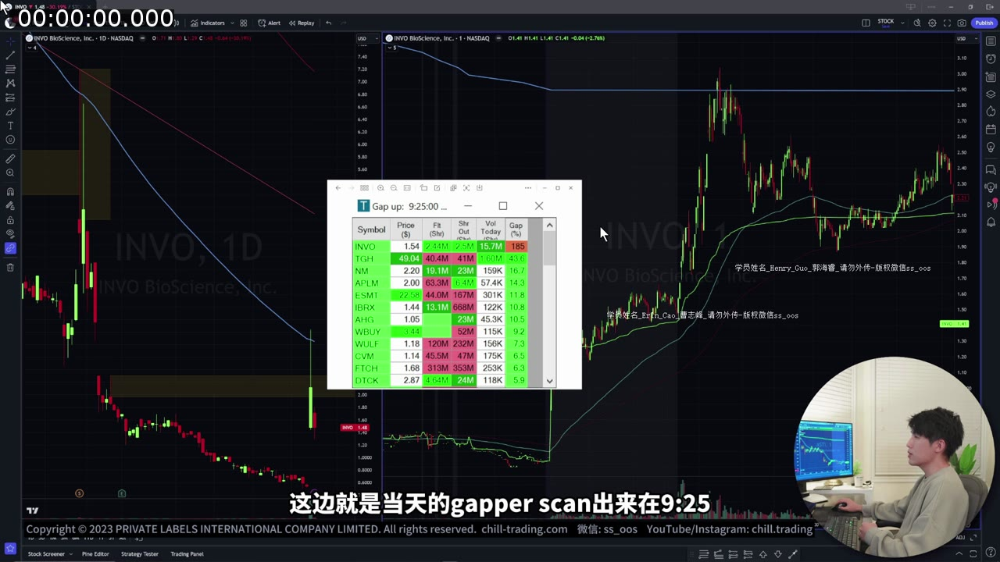
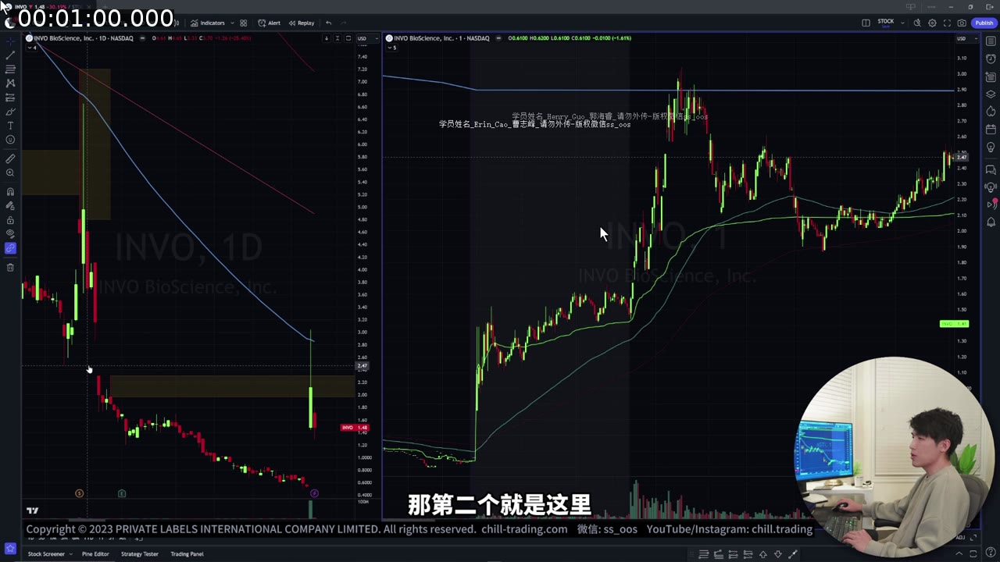
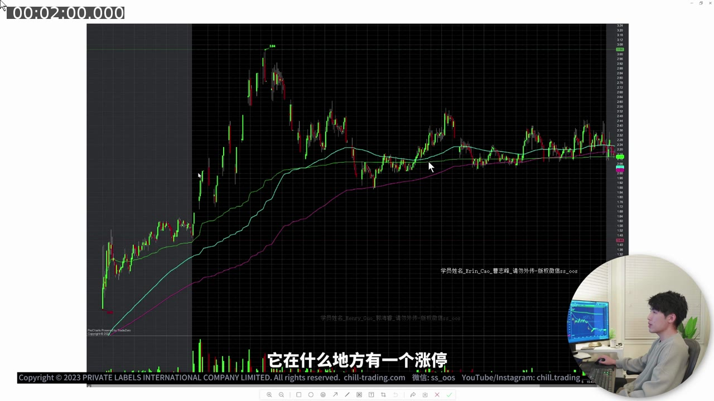
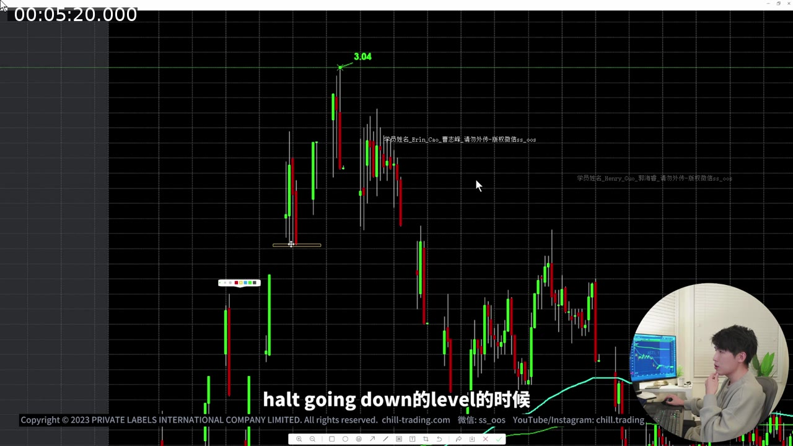
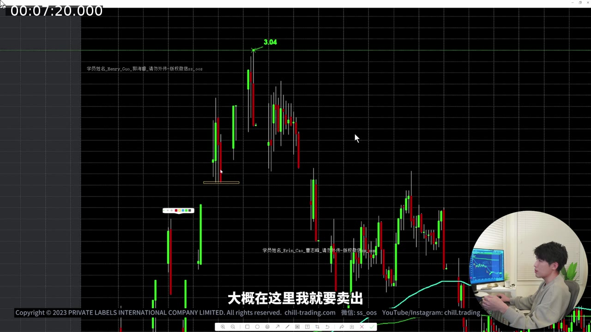
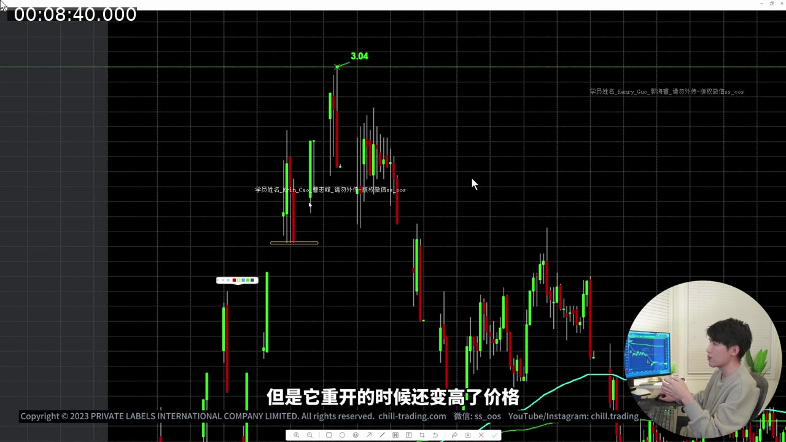
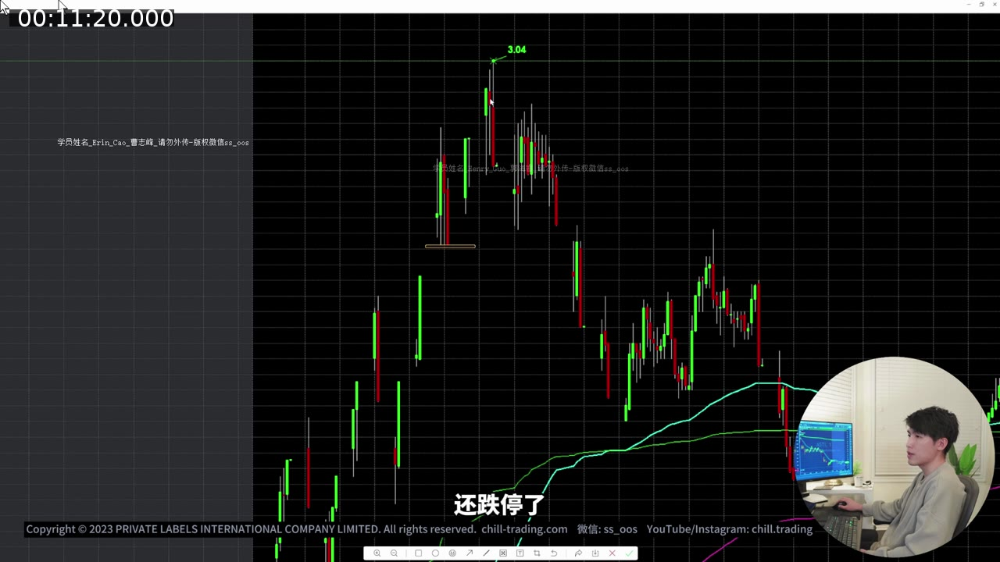

# 第 9 课：Case Study — INVO 完整交易复盘

> 对应视频：`09-invo-case-study.mp4`  
> 时长：约 13 分 09 秒  
> 核心主题：盘前选股、关键价位、熔断后的决策、Level 2 观察、失败交易复盘、何时停止交易

## 配图阅读方法

这节课是完整 case study。截图应按“时间顺序”而不是按最终盈亏阅读：

1. 盘前先看 scanner 和预画阻力；
2. 每次暂停前记录价格、动能与 Level 2；
3. Resume 后只评价当时可见的信息；
4. 把讲师的好决策、错误和幸运脱困分别标记。

图中右侧未来 K 线在真实交易时尚不存在。复盘时不要因为已经知道 INVO 后来如何运行，就把不确定选择改写成必然结果。

## 一、这节课真正要学什么

这不是一套可以机械复制的“INVO 买卖公式”，而是一段完整的盘中决策复盘。最值得学习的不是某一笔交易赚了多少，而是交易者如何随着新信息不断调整判断：

1. 盘前为什么只留下 INVO；
2. 开盘后为什么先观察，而不是立即追涨；
3. 哪些熔断恢复后的机会可以尝试，哪些应该放弃；
4. 一笔本来盈利的交易，为什么最后变成被困在熔断中的高风险仓位；
5. 为什么股价接近 3 美元和日线 EMA100 后，交易逻辑发生了变化；
6. 为什么最后选择停止交易。

视频中的股票代码是 **INVO**。自动语音转写偶尔会把它识别成 “IMVO”，本资料统一修正为 INVO。

---

## 二、开盘前：不是“找到一只股票”，而是先排除不合格候选

### 1. 9:25 左右查看 Gapper Scanner

讲师在开盘前约 5 分钟查看涨幅榜。当天符合他偏好的股票并不多，最终只留下 INVO：

- 流通盘相对较小；
- 成交量明显高于其他候选；
- 盘前涨幅较大；
- 盘前价格仍在活跃波动；
- 股价约 1.50 美元，虽然低于讲师平时更偏好的 2.50 美元以上区间，但当时没有更好的候选。

其他股票被排除的典型原因包括：

- 盘前成交量太低；
- 流通盘太大；
- 股价太高，不符合当天想做的小盘股类型；
- 盘前走势不够活跃。



**图 9-1 怎么看：**

- 中间 scanner 同时显示多只盘前异动股票；
- INVO 的选择来自 float、volume、gap percentage 和盘前走势的组合，不是因为列表排第一；
- 左侧日线用于排查上方更长期位置，右侧盘前图用于判断当前活跃度；
- 当天候选少不能成为降低标准或强迫交易的理由。

### 2. 一个容易被忽略的风险

“当天只有这一只看起来能做”并不等于“必须做这一只”。

候选稀少时，人很容易产生强迫交易心理：

> 我已经坐在电脑前了，今天总要做点什么。

但真正的交易条件仍然必须独立成立。候选少，只能说明当天市场机会可能少，不能降低入场标准。

---

## 三、盘前先画好三个关键阻力位

讲师在开盘前标出大致三个阻力区域：

| 位置 | 大致价格 | 来源 | 含义 |
|---|---:|---|---|
| 第一阻力 | 约 $2.10 | 历史价格区间 | 股价第一次快速拉升时可能出现抛压 |
| 第二阻力 | 约 $2.50 | 历史价格区间 | 更高一级的前期压力 |
| 第三阻力 | 约 $3.00 | 日线 EMA100 + 整数位 | 技术指标与心理整数位重合，阻力更值得重视 |

这里的重要方法是：

1. **先在盘前确定位置**，不要等股价已经冲到那里才临时解释；
2. 历史阻力、均线和整数位如果集中在同一区域，通常比单一信号更重要；
3. 关键价位不是“到这里一定反转”，而是“到这里必须重新评估风险和动能”。

视频还提醒：不同图表平台对熔断期间的无成交时间处理可能不同。做复盘时，应使用能清楚显示实际暂停和恢复时间的平台，否则蜡烛长度和时间轴可能造成误解。



**图 9-2 怎么看：**

- 左侧 Daily Chart 用水平线和 EMA 标出更长期位置；
- 右侧盘前图把约 $2.10、$2.50 和 $3 附近映射到当天价格路径；
- $3 同时接近整数位和 Daily EMA100，因此权重高于单一随机水平线；
- 这些线是“到达后重新评估”的位置，不是盘前就能确定的卖点。

---

## 四、开盘后的第一段：先看市场如何表态

### 1. 开盘先下探，再从 VWAP 附近反弹

INVO 开盘后先向下走，随后触及 VWAP 附近并反弹，第一次向上触发波动性暂停。

讲师没有在第一次恢复交易后立刻做 dip buy，原因是：

- 当时大盘和小盘股环境并不活跃；
- 第一次暂停后的方向仍不明确；
- 恢复后可能继续向上，也可能立即反向并向下暂停；
- 没有必要为了抢第一段波动承担最大的不确定性。

这体现了一个很实用的原则：

> 不确定时，先让第一根恢复后的 K 线提供信息。

### 2. 等第二根 K 线确认，再做前高突破

讲师等恢复后的第二根 K 线突破上一根 K 线高点后买入，并在接近再次向上暂停的位置卖出。

这笔交易的逻辑是：

1. 第一次恢复后没有立即崩落；
2. 第二根 K 线突破前一根高点，说明买盘仍在推进；
3. 目标不是无限持有，而是利用短时动能走到可能再次暂停的位置；
4. 到目标区域后先退出，不赌一定会真正暂停。

股价当时并没有立即被暂停，因此可以把它理解为一次“接近暂停价但未真正触发”的假暂停情形。讲师已经按原计划离场，没有因为“它可能还会涨”临时改变退出纪律。



**图 9-3 怎么看：**

- 灰色区间表示无正常连续交易的暂停阶段；
- 恢复后第一根 K 先提供方向信息，讲师没有立即 dip buy；
- 后续突破前一根高点才构成相对明确的动能确认；
- 出场靠近下一次暂停价，是按短时目标管理，而不是预测后续整段最高点。

---

## 五、连续向上暂停后：为什么反而不追

随后 INVO 再次向上暂停。恢复时，价格已经接近盘前标出的第一阻力，而且短时间内经历了多次剧烈暂停。

讲师没有继续做恢复后的 dip buy，主要因为：

- 第一阻力就在附近；
- 连续向上暂停后，追涨者已经很多；
- 恢复价可能大幅跳空；
- 如果上涨失败，拥挤的多头会同时卖出；
- 这时风险收益比不如早期阶段。

之后股价虽然先高开恢复，但很快下跌并触发向下暂停。这一段说明：

> “刚刚连续上涨”不是下一笔交易继续上涨的充分理由。价格越接近预先标出的阻力，越需要降低对旧动能的依赖。

---

## 六、做空者可能反过来成为上涨燃料

当股价向下暂停后，讲师观察它恢复后究竟会继续下跌，还是重新反弹。

视频提到：

- INVO 在 Interactive Brokers 当时不可借；
- 在 SpeedTrader 当时可以 Locate，费用约为每股 0.03 美元；
- 这说明它并非完全无法做空；
- 低流通盘股票中，如果大量交易者在高位做空，随后价格不跌反涨，空头回补可能进一步推高价格。

逻辑链条如下：

```text
很多人认为涨太多了而做空
        ↓
价格没有按预期下跌
        ↓
空头亏损扩大或被迫止损
        ↓
买入股票回补空仓
        ↓
回补买盘进一步推高价格
```

这就是 short squeeze 的基本机制。但要注意：

- 看到一只股票“很多人可能在做空”，并不能证明它一定会 squeeze；
- 可借状态、Locate 价格和库存会随券商、账户和时间变化；
- 视频里的费用只是当时的界面记录，不是现在或其他券商的固定报价。

---

## 七、第一次“假向下暂停”交易：Level 2 如何参与判断

### 1. 讲师观察什么

当股价快速下跌并接近向下暂停价时，讲师重点观察 Level 2 的 Ask 一侧。

视频中的经验规则大致是：

- 如果 Ask 上一直维持较大的卖单，价格更可能真正暂停；
- 如果 Ask 数量先增加、随后迅速减少，说明卖压可能正在被买盘吸收或撤掉；
- 如果股价没有真正暂停，可能出现从底部快速反弹的 “false halt down”。

讲师提到，他通常希望在向下暂停价附近看到 Ask 数量大约维持在视频平台显示的 “200” 左右、持续约 5–10 秒，才更像会真正暂停。这里的数字是**讲师基于当时平台显示单位和个股行为总结的个人经验**，不能脱离平台单位、股票流动性和市场环境直接照搬。

### 2. 第一次交易为什么成功

这一轮中，Ask 数量一度增加，随后又缩小。讲师判断向下暂停可能失败，于底部附近用快捷键买入。

随后价格快速反弹，他在接近向上暂停价的位置卖出，抓到了一段接近从 K 线底部到顶部的波动。



**图 9-4 怎么看：**

- 图中低位水平标记是可能触发 halt down 的区域；
- 讲师观察 Ask 数量先增加后缩小，判断卖压可能无法维持暂停；
- 买入后价格必须快速离开低点，才与“false halt down”假设一致；
- 截图展示的是成功一次，不能证明视频中的 size 数字对其他股票也有效。

### 3. 正确理解这笔交易

这不是“Ask 变小就一定买”的固定规则。它依赖多个条件同时出现：

- 股票此前仍有较强上涨动能；
- 暂停恢复后多次出现快速反弹；
- 价格接近明确的暂停区间；
- Level 2 卖压发生变化；
- 交易者愿意在判断错误时立即退出。

真正关键的是最后一点：这种交易如果没有快速反弹，原逻辑就已经失效。

---

## 八、第二次尝试失败：本课最重要的错误复盘

### 1. 同样的形态，结果完全不同

之后讲师再次尝试类似的假向下暂停交易：

1. 在低位买入；
2. 股价最初确实反弹；
3. 他继续等待价格走到向上暂停区域；
4. 反弹没有延续，下一根 K 线开始下跌；
5. 他没有及时卖出；
6. 最终持有约 5,000 股进入真正的向下暂停。



**图 9-5 怎么看：**

- 第二次买入后也曾出现短暂反弹，但没有像上一笔那样继续冲向 halt-up level；
- 当反弹失败、价格重新回落时，上一笔成功的形态已经不再重复；
- 未及时退出使可控的小交易变成暂停期间无法主动处理的 5,000 股风险；
- 这张图应被归类为执行错误，不应因后面幸运高开而改写成正确持仓。

### 2. 讲师自己指出的错误

讲师明确承认这一笔操作不好：

- 价格最初反弹时，仓位曾经盈利；
- 当它无法继续向上、并开始回落时，就应该退出；
- 他却仍然期待重复上一笔从底到顶的结果；
- 这使一笔可控的小交易变成无法在暂停期间退出的仓位。

### 3. 深层错误：把上一笔成功当成下一笔的保证

这类错误很常见：

> 上一次同样的形态成功了，所以这一次也应该成功。

但第二次出现时，市场已经发生变化：

- 时间更晚；
- 多空双方仓位不同；
- 动能可能衰减；
- 阻力更近；
- 同一形态被更多交易者看到后，反应也可能不同。

因此，每次入场都必须有独立的失效条件。例如：

> 我买入后，如果价格不能迅速离开低点，或重新跌破触发位置，我就退出。

### 4. 券商切换与延迟不是可以忽略的细节

讲师提到，他刚从 SpeedTrader 切换到 Interactive Brokers，感觉订单执行存在延迟。这可能影响了退出。

但从风险管理角度看：

- 如果不熟悉新券商或新快捷键，应先在模拟环境测试；
- 如果确认有延迟，应主动缩小仓位；
- 不能把正常仓位建立在“这次应该能及时成交”的假设上；
- 5,000 股进入暂停后，风险已经不再由止损键控制。

对暂停股票而言，最危险的不是屏幕上的未实现亏损，而是：

> 暂停期间无法成交，恢复价格又可能直接跳空。

---

## 九、恢复前的 Imbalance：有信息，但不是保证

### 1. 视频中发生了什么

向下暂停接近结束时，DAS 界面显示恢复交易的参考价格或订单不平衡信息。视频中这个价格逐渐上移，并高于原暂停价。

讲师的解释是：

- 一些空头在暂停期间排队用市价单回补；
- 买入回补需求使预期恢复价上升；
- 股票恢复后向上跳，并进一步挤压空头；
- 他最终在突破后的高位卖出。



**图 9-6 怎么看：**

- 这张总结图直接显示的是恢复后的 K 线位置，而不是完整的 imbalance 窗口；
- “恢复前参考价逐渐上移”来自视频对当时 DAS 数据的口述，图中结果与之吻合，但截图本身不足以独立还原订单队列；
- 空头回补可能贡献买盘，但恢复前订单仍可新增、取消或修改；
- 最终恢复更高给了讲师退出机会，并不意味着参考价是成交保证；
- 这次结果含有明显运气，风险管理评价应以“进入暂停前能否控制”而不是最终 P&L 为准。

### 2. 为什么这笔结果不能被误读

讲师也承认这次有运气成分。恢复前看到的参考价并不是成交保证：

- 新订单还会继续进入；
- 已挂订单可能取消或修改；
- 最终恢复价可能低于当时显示值；
- 恢复后也可能立即反向。

所以不能把这段复盘总结成：

> 被困向下暂停后，只要等空头回补，就能安全出来。

更正确的结论是：

> 这次市场给了退出机会，但原本不应该让仓位进入无法主动退出的状态。

---

## 十、接近 3 美元后的最后一笔交易

INVO 随后接近约 3 美元区域。这里同时存在：

- 日线 EMA100；
- 3 美元整数位；
- 当日已经大幅上涨后的获利盘；
- 逐渐下降的成交量。

讲师尝试了一笔恢复后的 dip buy / 当日高点突破交易，但明显更加谨慎。他在突破附近买入后很快卖出，没有继续持有。

价格短暂突破 3 美元后又快速回落，并触发向下暂停。讲师再次观察是否存在假向下暂停机会，但这一次 Ask 上显示的卖单明显更大，约为视频界面中的 “1000”，因此放弃买入。

这个“不做”的决定很重要。真正成熟的复盘不能只统计成交记录，也要记录：

- 看到了什么；
- 为什么原本可能想做；
- 哪个条件不满足；
- 因此为什么跳过。

---

## 十一、如何识别当日动能已经改变

恢复交易后，股价不再像此前那样快速冲向向上或向下暂停价，波动明显变弱，成交量也低于早期阶段。

讲师将以下信号组合起来判断行情可能转为下跌或进入难以预测的阶段：

1. 股价触及日线 EMA100；
2. 同时触及 3 美元整数阻力；
3. 出现假突破；
4. 随后向下暂停；
5. 恢复后不再快速延续；
6. 成交量持续下降。



**图 9-7 怎么看：**

- 顶部约 $3.04 的高点清楚可见；它与日线 EMA100 的对应关系来自图 9-2 的盘前标注，而不是仅凭本图彩色曲线猜测；
- 向上假突破后价格快速回落，并出现向下暂停；
- 恢复后不再像早期那样迅速冲向下一暂停价，说明 momentum regime 已改变；
- 多重阻力、假突破、低量与延续速度下降共同支持停止交易，不能只归因于某一条 EMA。

如果当时有可借股票，讲师表示可能会考虑做空；但 Interactive Brokers 当时没有库存。于是他停止交易。

停止的理由并不是“股价以后一定不会再涨”，而是：

> 当前走势已经不再符合他最擅长、最有把握的高动能阶段。

这是一种非常重要的边界意识：错过后续波动，通常比在优势消失后继续强行交易代价更低。

---

## 十二、逐笔决策记录

| 阶段 | 讲师动作 | 当时依据 | 事后评价 |
|---|---|---|---|
| 第一次向上暂停后 | 先等待 | 市场弱、恢复方向不明确 | 克制，避免承担最大不确定性 |
| 第二根 K 线突破 | 买入并在接近暂停价退出 | 前高突破、动能延续 | 按计划完成，不赌真正暂停 |
| 连续暂停且接近第一阻力 | 不追 | 历史阻力、恢复跳空风险 | 有效过滤高风险追涨 |
| 第一次假向下暂停 | 底部附近买入，反弹后卖出 | Level 2 卖压缩小、此前动能仍强 | 成功，但不能机械复制 |
| 第二次类似尝试 | 买入后未及时退出 | 期待重演上一笔走势 | 明确错误，被困约 5,000 股进入暂停 |
| 暂停恢复后 | 等待上涨后退出 | 参考恢复价上移、空头回补 | 结果有利，但包含明显运气 |
| 3 美元附近突破 | 快进快出 | 当日高点、整数位突破尝试 | 因阻力和量能下降而降低预期 |
| 再次向下暂停附近 | 放弃 dip buy | Ask 卖单更大，条件不同 | 正确地没有强行复制旧形态 |
| 最后阶段 | 停止交易 | EMA100、3 美元、假突破、量能衰减 | 优势消失后主动收手 |

---

## 十三、把这节课整理成可复用的交易检查表

### 盘前

- [ ] 候选股的成交量是否足够？
- [ ] 流通盘、价格和盘前涨幅是否符合自己的策略？
- [ ] 是否只是因为“没有别的股票”而降低了标准？
- [ ] 历史阻力、日线均线和整数位在哪里？
- [ ] 当前券商是否可借？Locate 成本是多少？

### 熔断或暂停恢复前

- [ ] 这是第一次暂停，还是已经连续多次暂停？
- [ ] 恢复位置是否正好靠近盘前阻力？
- [ ] 恢复后若反向跳空，最大可能损失是否能承受？
- [ ] 当前订单、参考恢复价或 imbalance 是否仍在变化？
- [ ] 我的券商、网络和快捷键是否经过测试？

### 做假暂停交易时

- [ ] Level 2 的变化是否与价格和成交量一致？
- [ ] 入场后是否立即得到预期中的快速反弹？
- [ ] 如果没有立刻反弹，明确在哪个位置退出？
- [ ] 仓位是否小到足以承受滑点甚至被困暂停？
- [ ] 是否因为上一笔成功而擅自放宽了这一次的退出条件？

### 决定停止时

- [ ] 成交量是否显著低于早盘？
- [ ] 股价是否到达多重阻力共振区？
- [ ] 突破是否失败？
- [ ] 恢复后的延续速度是否明显下降？
- [ ] 当前行情是否还属于自己最有优势的阶段？

---

## 十四、风险说明

视频中的“涨停、跌停、halt”指美国市场个股因短时间剧烈波动而发生的临时交易暂停，不是中国 A 股每天固定涨跌幅限制的同一套机制。

需要特别警惕：

- 暂停期间不能正常退出；
- 恢复价可能大幅跳空；
- Level 2 显示订单可能撤销，不能等同于真实成交意愿；
- 小盘低价股可能点差大、滑点高、流动性突然消失；
- 做空还涉及库存、Locate 费、回补和被强制平仓等额外风险；
- 视频中的券商界面、路由、费用和平台单位属于录制当时的情况，不能视为当前规则。

本资料用于整理视频内容和教学复盘，不构成具体股票或交易策略建议。尤其不要把视频里的 5,000 股仓位、暂停价买入或 Level 2 数字直接复制到真实账户。

---

## 十五、一句话总结

这节课最值得记住的不是 INVO 最终涨了多少，而是：

> 先用盘前价位建立地图，用价格、成交量和 Level 2 更新判断；形态失败时立即认错，市场状态改变后停止交易，绝不能把一次幸运脱困误认为可重复的风险管理方法。
