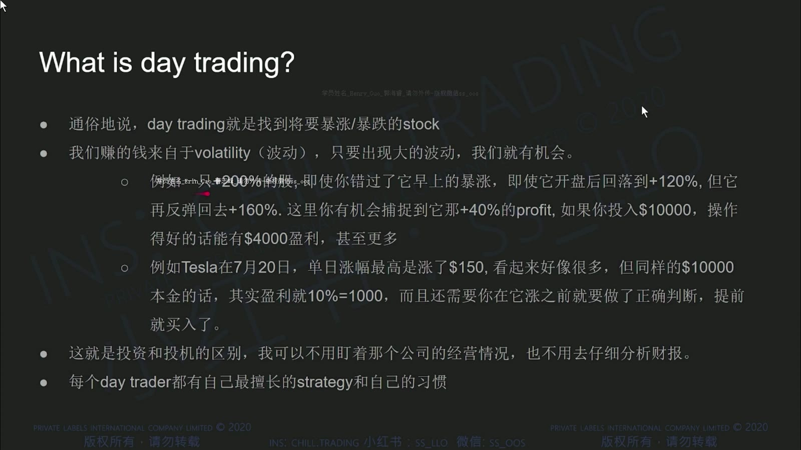
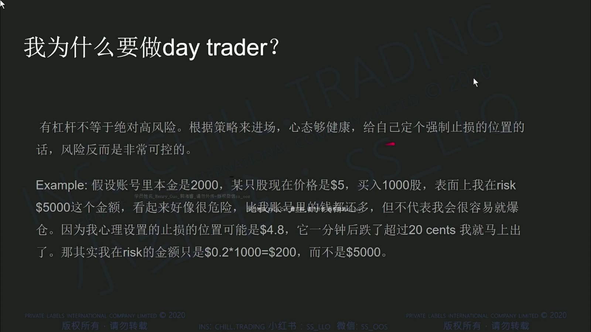
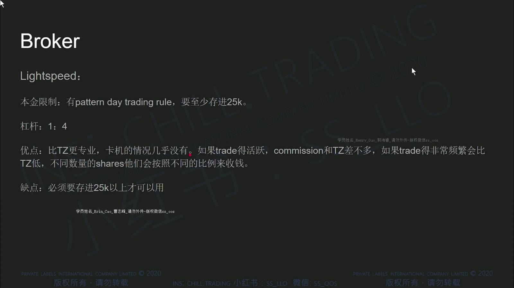
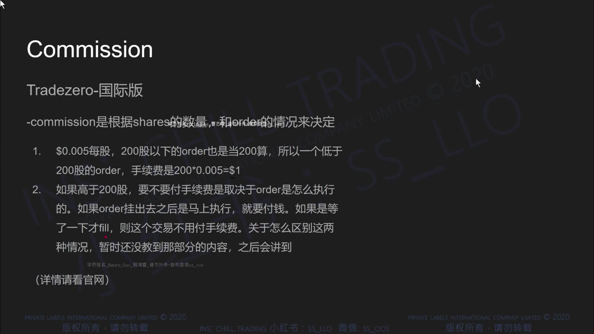
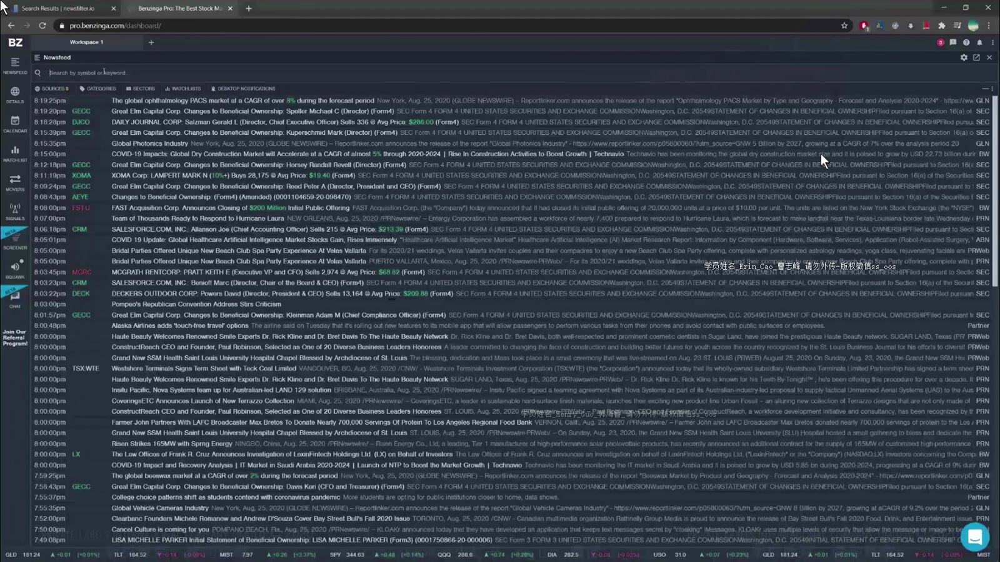
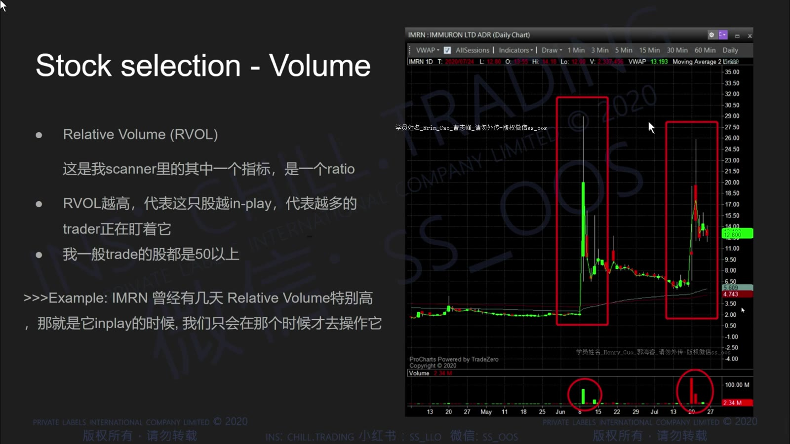
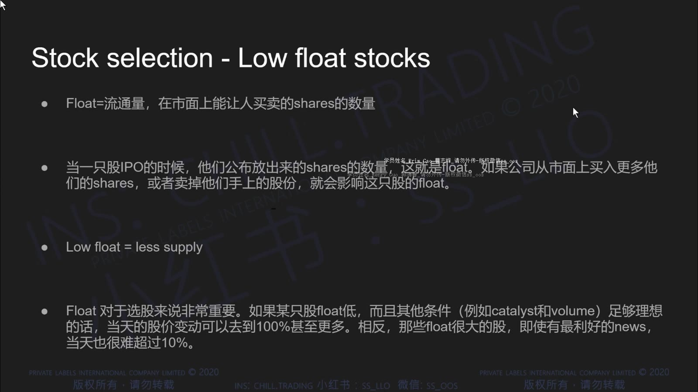
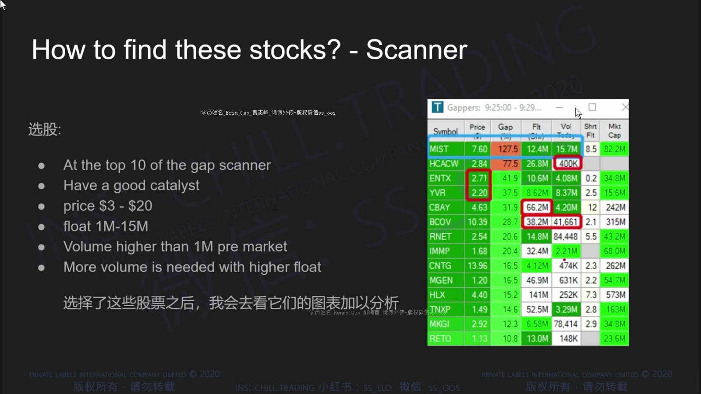

# 基础 01：日内交易、券商与选股

> 对应视频：`1-class1.mp4`
> 视频时长：44:09
> 本课目标：先弄清课程交易的是什么、怎样控制单笔风险，以及讲师如何从异动股中筛选观察对象。

## 1. 课程所说的 Day Trading

日内交易是在同一交易日内完成开仓和平仓，试图从短期价格变化中获利。视频重点关注有新闻、成交量突然放大、流通盘较小的美股异动股。这里赚的是**价格波动**，不是因为持有了企业的长期价值。

**图怎么看：**

- 幻灯片用“早盘上涨、回落、再次反弹”说明：即使错过第一段上涨，盘中仍可能存在可交易的波段。
- 百分比波动只是解释机会，不代表能买在最低、卖在最高；实际可获得的区间还会被点差、滑点、部分成交和反应速度压缩。
- “波动大”同时意味着错误方向的损失也快，不能只把它理解成盈利空间。

### 投资与投机的区别

| 维度 | 长期投资 | 本课程的日内投机 |
|---|---|---|
| 主要依据 | 企业价值、盈利与长期前景 | 当日催化、量能、盘口与价格结构 |
| 持有周期 | 月、年甚至更久 | 秒、分钟或小时，当天离场 |
| 主要风险 | 企业与宏观基本面变化 | 极端波动、执行、杠杆和纪律失控 |
| 成功条件 | 估值与长期判断 | 可重复的入场条件、退出和仓位控制 |

视频认为短持仓可以减少隔夜事件风险，这一点成立；但不能由此推出日内交易“风险较低”。高换手、杠杆、跳空、停牌和流动性不足，会让损失在极短时间内发生。

## 2. 杠杆不等于风险已经被限制

视频举例：账户有 2,000 美元，以 5 美元买入 1,000 股，计划在 4.80 美元止损，于是把计划风险写成：

`(5.00 - 4.80) × 1,000 = 200 美元`

**图怎么看：**

- 左侧的 5,000 美元是持仓名义金额；200 美元只是“按计划价格成交”的理论损失。
- 如果价格直接跳到 4.50 美元，实际亏损将变成约 500 美元，尚未计手续费与滑点。
- 停牌期间无法成交，止损单也不能保证恢复交易后在 4.80 美元退出。

因此应同时区分三个数字：

1. **名义敞口**：入场价 × 股数；
2. **计划风险**：入场价到失效价的距离 × 股数；
3. **尾部风险**：跳空、停牌或失去流动性时可能超过计划风险的部分。

更安全的仓位公式是：

`股数 = 单笔可承受亏损 ÷ (入场价 - 失效价 + 预留滑点)`

预留滑点不能固定照抄，应随股票流动性、点差和波动调整。

## 3. 券商和交易平台看什么

视频比较了 TradeZero 与 Lightspeed，并强调 direct access、订单路由、做空库存和开盘稳定性。

**图怎么看：**

- 画面里的最低入金、杠杆和佣金是录制时资料，不应当成 2026 年开户条件。
- 真正值得保留的是比较维度：账户所在地、监管实体、保证金、平台稳定性、总交易成本和可借库存。
- 同一品牌的美国与国际实体可能适用不同规则，不能仅凭名称判断。

**图怎么看：**

- 视频把 commission、routing fee 和订单股数拆开讲，说明“免佣”不等于零成本。
- 主动拿走流动性和提供流动性的路由费可能不同；实际费率还会随市场、路由和账户方案变化。
- 比较券商时应计算一笔完整往返交易：佣金、路由费、监管费、平台费、行情费和借股费。

截至 2026-07-30，美国 FINRA 日内保证金制度正处于新旧规则过渡期。部分券商已经采用新的盘中风险保证金规则，部分券商可在过渡期内继续旧 PDT 规则；不要照搬视频里的“25,000 美元即可/必须”的二分法。实际操作前看自己的账户协议和 [当前规则说明](../current-rules-and-platform-details.md)。

## 4. 选股四要素

课程的逻辑可以压缩成：

`催化剂 → 成交量 → 流通盘 → 扫描器定位`

这四项用于建立观察名单，不是自动买入信号。

### 4.1 Catalyst：为什么今天有人关注

课程把重大新闻、财报、监管进展、产品发布和并购等称为 catalyst。催化剂的作用，是解释“为什么资金今天突然聚集到这只股票”。

**图怎么看：**

- 幻灯片列出新闻来源，重点是回到原始公告核对，不要只看聊天室标题。
- 右侧示例说明同一家公司可能连续发布多条消息；需要判断哪条真的改变预期。
- “有新闻”不等于利好，也不等于价格一定上涨；融资、增发和模糊的合作公告尤其要读细节。

核对催化剂时至少回答：

- 公告来自公司、SEC 文件还是二手媒体？
- 是新信息，还是旧消息重复传播？
- 会改变收入、现金流或股本吗？
- 是否同时出现注册发行、ATM、可转债或大股东转售？
- 市场已经提前反映了多少？

### 4.2 Volume 与 RVOL：今天是否真的有人交易

成交量是某段时间内成交的股数。RVOL（Relative Volume）用于比较当前成交量与该股票平时同一阶段的成交量。

**图怎么看：**

- 幻灯片强调 volume 高时通常更容易进出、点差更小，但这不是绝对关系。
- 下方成交量柱应和价格一起看：放量突破、放量滞涨和放量下跌的含义不同。
- 绝对成交量还要相对 float 解读；同样 500 万股，对 300 万与 3 亿流通盘完全不同。

课程使用很高的 RVOL 阈值来筛选小盘异动股，这是讲师的个人过滤条件，不是普遍定律。平台对 RVOL 的基准天数和盘前数据处理也可能不同。

### 4.3 Low Float：供给少会放大双向波动

Float 是市场上可供公众交易的股份数量，不等同于总发行股数，也可能因数据商更新滞后而不准确。

**图怎么看：**

- 课程用“可交易筹码少、需求突然增加”解释价格为何容易快速上涨。
- 同一个机制也会放大下跌：买盘消失时，少量卖单就可能把价格压低很多。
- Low float 还伴随更宽点差、操纵风险、停牌和恢复后跳空，不能只看上涨弹性。

视频给出的约 100 万至 1,500 万股、价格 3–20 美元等数字，是课程交易风格的候选范围，不是行业定义。

### 4.4 Scanner：发现候选，不负责替你决策

**图怎么看：**

- 表格包含现价、涨幅、盘前量、流通盘等字段；先按异动程度找到“今天不同寻常”的股票。
- 排名靠前只能说明符合扫描条件，不能说明入场点好或风险小。
- 扫描器数据可能延迟，float 与新闻分类也可能有误，候选股仍需打开图表和公告复核。

## 5. 从扫描器到交易计划

可按下面顺序做盘前准备：

1. 扫描器找到涨幅和量能异常的候选；
2. 核对新闻及 SEC 文件，排除明显误读；
3. 记录 float、成交量、RVOL、点差和是否容易停牌；
4. 在日线和盘中图标出前高、整数位、VWAP 等关键区域；
5. 写出触发条件、失效价、最大股数和不交易条件；
6. 开盘后只有出现计划中的价格行为才下单。

## 6. 本课需要保留与修正的观点

**可以保留：**

- 日内交易关注短期供需与波动；
- 新闻、量能、float 和价格结构应结合；
- 先定义失效价，再由风险反推仓位；
- 券商要比较执行、稳定性和完整成本。

**必须修正：**

- 止损是指令或计划，不是成交价格保证；
- 有催化剂的股票仍会受大盘、行业和流动性影响；
- 低 float 不是天然优势，而是更高的双向尾部风险；
- 视频中的券商、杠杆、佣金和 PDT 数字都可能过时；
- 结果截图中的大额盈利不能证明策略具有可重复优势。

## 7. 复盘问题

1. 我能否用一句话说明这只股票今天为什么活跃？
2. 当前成交量相对它自己平时究竟异常多少？
3. Float 数据来自哪里，更新时间是什么？
4. 计划风险与最坏情况下的尾部风险分别是多少？
5. 如果停牌、点差突然扩大或只部分成交，我的仓位是否仍能承受？
