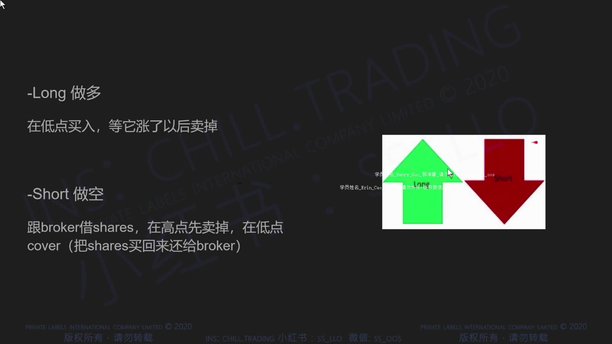
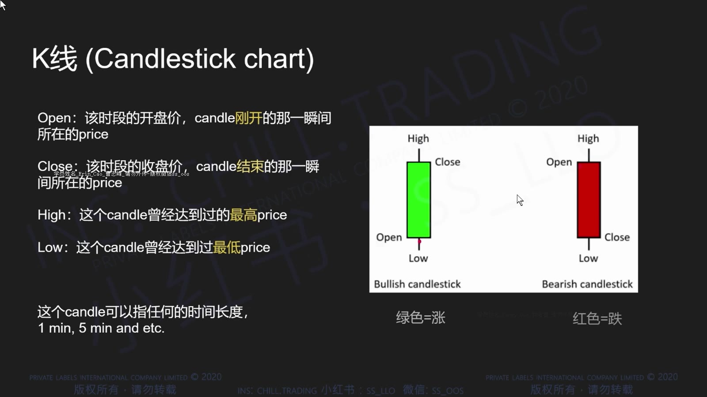
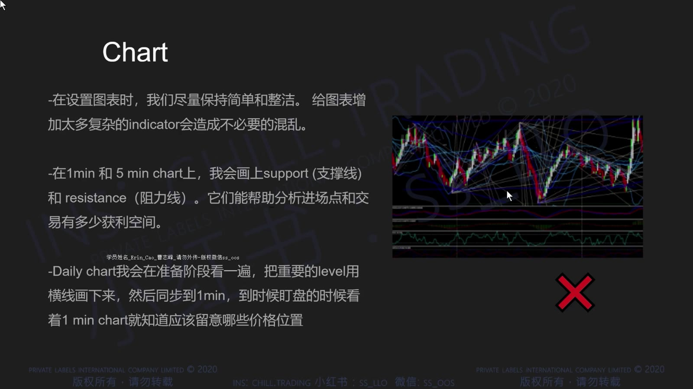
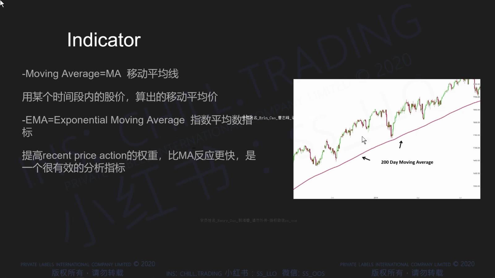
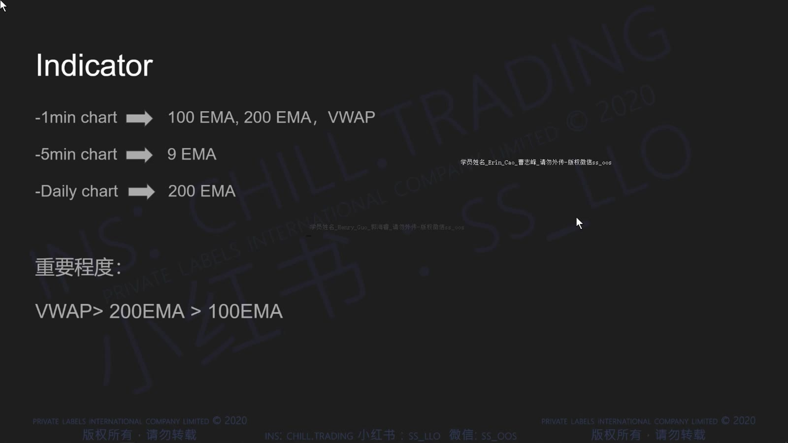
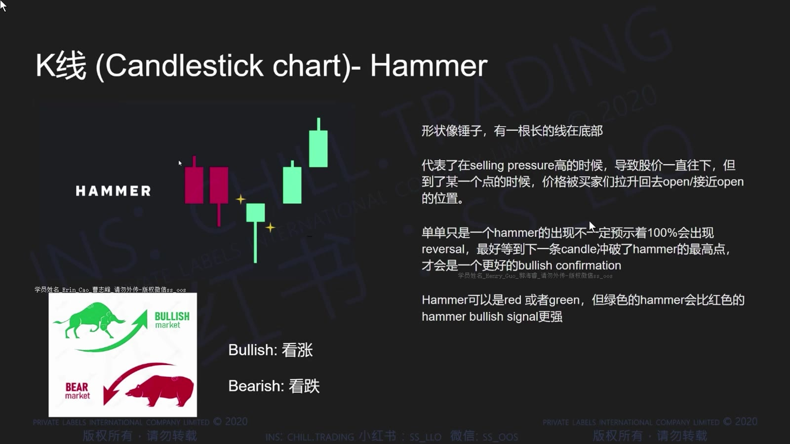
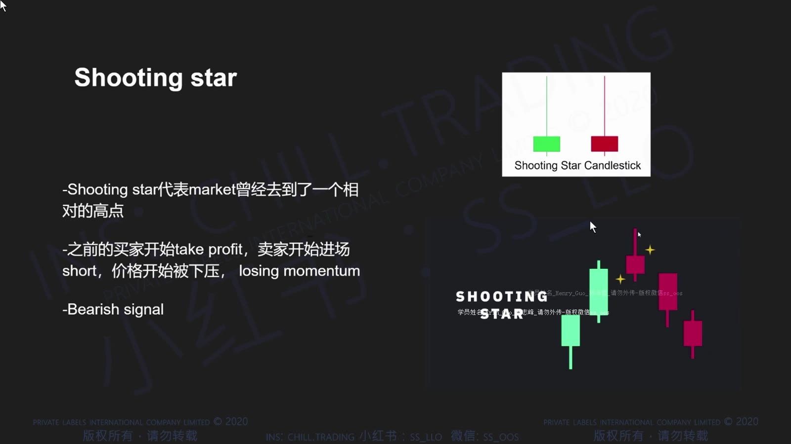
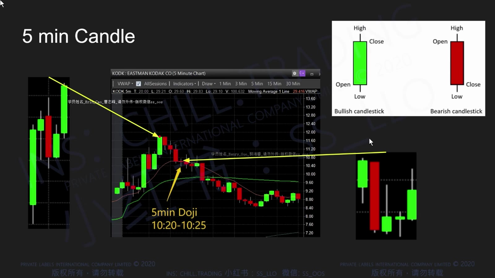

# 基础 02：图表、K 线与常用指标

> 对应视频：`2-class2.mp4`
> 视频时长：30:26
> 本课目标：读懂 Long/Short、K 线、时间周期、成交量、EMA、VWAP、MACD 和 RSI，并知道这些工具不能单独给出答案。

## 1. Long 与 Short

Long 是先买后卖，价格上涨时获利；Short 是借入股票先卖出，之后买回归还，价格下跌时获利。

**图怎么看：**

- Long 的损益近似为 `(卖出价 - 买入价) × 股数`。
- Short 的损益方向相反，但需要借股，且价格理论上可以无限上涨，所以潜在亏损不封顶。
- 图中的直线示意省略了点差、手续费、借股费、强制回补与停牌风险。

## 2. 一根 K 线包含什么

每根蜡烛图记录一个时间窗口内的四个价格：

- Open：开盘价；
- High：最高价；
- Low：最低价；
- Close：收盘价。

**图怎么看：**

- 实体连接 open 与 close；影线延伸到该周期的 high 与 low。
- 绿色通常代表收盘高于开盘，红色通常代表收盘低于开盘，但颜色可由平台自定义。
- 长上影表示价格曾上冲后回落，不能单凭它就断言下一根必跌。

K 线只是在压缩成交过程。同一根长上影，可能来自获利盘、流动性真空、大卖单或停牌前后的跳动，需要结合成交量与位置。

## 3. 时间周期怎样嵌套

**图怎么看：**

- 1 分钟图回答“现在怎样成交”，5 分钟图过滤部分噪音，日线图提供更远的支撑阻力背景。
- 五根完整的 1 分钟 K 线组合成一根 5 分钟 K 线；当前未收盘 K 线仍会改变。
- 不能拿未完成的 5 分钟形态当成已经确认的信号。

课程主要用：

| 周期 | 用途 |
|---|---|
| 1 分钟 | 精细观察入场、突破和快速失败 |
| 5 分钟 | 识别较稳定的趋势与形态 |
| 日线 | 查历史高低点、缺口、长期均线 |

多个周期不是“投票”。更实用的做法是先用较大周期确定区域，再用较小周期决定是否出现可执行的触发和清晰失效位。

## 4. 成交量

**图怎么看：**

- 每根量柱对应同时间窗口的成交股数。
- 量柱颜色通常随价格 K 线或平台规则显示，不等于所有成交都由买方或卖方“主动发起”。
- 突破若没有新增量能，后续跟随需求可能不足；但放量也可能是顶部换手或恐慌出逃。

判断量能时比较三个维度：

1. 与前几根柱相比是否扩张；
2. 与该股票平时同一时段相比是否异常；
3. 放量后价格是否真的推进，还是成交很多却走不动。

## 5. EMA 与 VWAP

EMA 是对近期价格赋予更高权重的移动平均。课程展示了 9、100、200 EMA，并在不同时间周期上分配不同用途。

**图怎么看：**

- 线条的颜色没有通用含义，必须先看自己的平台设置。
- 均线是过去价格计算出的结果，会滞后；价格接近它时是否产生反应，才是需要观察的事实。
- 课程中的 1 分钟 EMA100/200、5 分钟 EMA9 等设置是个人模板，不是最优参数证明。

VWAP 是成交量加权平均价。常见的会话 VWAP 可理解为：

`VWAP = Σ(成交价格 × 成交量) ÷ Σ成交量`

**图怎么看：**

- VWAP 把当天成交价格按成交量加权，常被用作盘中平均成本参考。
- 从下方接近可能遇到卖压，突破后回踩也可能转为支撑；角色取决于接近方向和实际反应。
- 不同平台对盘前数据、价格源和重置时间的处理可能不同，所以数值未必完全一致。

## 6. MACD 与 RSI

**图怎么看：**

- MACD 根据两条指数均线的差计算动量，交叉和柱体变化都来自已经发生的价格。
- 快线上穿慢线不等于必须买入；横盘和剧烈震荡时会频繁给出假信号。
- 如果价格已经接近强阻力，MACD 看多也不能消除上方风险。

RSI 把一定窗口内上涨与下跌的相对强弱压缩到 0–100。常见的 70/30 只是参考阈值。

- 强趋势中 RSI 可以长时间处于“超买”或“超卖”；
- 超买不等于马上下跌，超卖不等于马上反弹；
- 参数和时间周期变化会改变读数。

## 7. 常见 K 线形态

**图怎么看：**

- Hammer 的长下影说明价格下探后被拉回；只有出现在有意义的支撑区，信息量才较高。
- Shooting Star 的长上影说明上冲被压回；出现在阻力区比出现在随机位置更有意义。
- Doji 表示 open 与 close 接近，更多是“暂时平衡/犹豫”，不是方向预测。

形态的有效信息来自“位置 + 前置趋势 + 成交量 + 后续确认”，而不是蜡烛名称本身。

## 8. 多周期阅读步骤

上图中的 K 线形态也必须放回周期关系中理解：一组 1 分钟 K 线会在 5 分钟图上被压成一根，局部剧烈波动可能在大周期上只剩一条影线。大周期用于防止把小噪音误判成趋势，小周期用于寻找更近的失效价。复盘时必须固定当时可见的信息，不能用后来完成的大周期 K 线反推“当时显而易见”。

## 9. 实用读图顺序

每次打开股票，按固定顺序：

1. 日线：历史高低、缺口、长期均线；
2. 5 分钟：当天主趋势、重要平台和量能变化；
3. 1 分钟：入场触发、最近失效位置；
4. VWAP/EMA：只作为参考位置，不替代价格行为；
5. 检查当前 K 线是否已经收盘；
6. 写出如果判断错误在哪里退出。

## 10. 本课最容易误用的地方

- 指标越多不代表确认越强；多个指标可能都由同一价格数据计算，信息高度重复。
- 颜色、参数和计算时段可能因平台不同而变化。
- “价格在 VWAP 上方”只是描述，不自动等于做多。
- K 线形态必须放在支撑阻力和量能环境中解释。
- 任何图形都只能帮助定义概率与风险，不能保证下一根 K 线方向。
