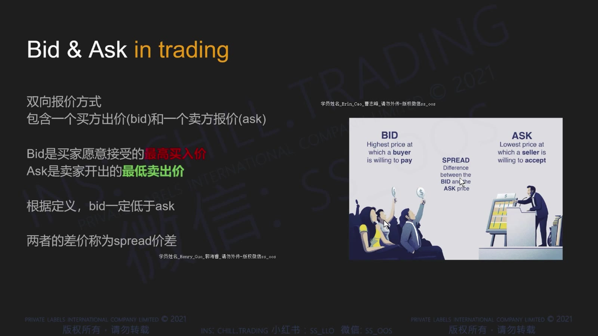
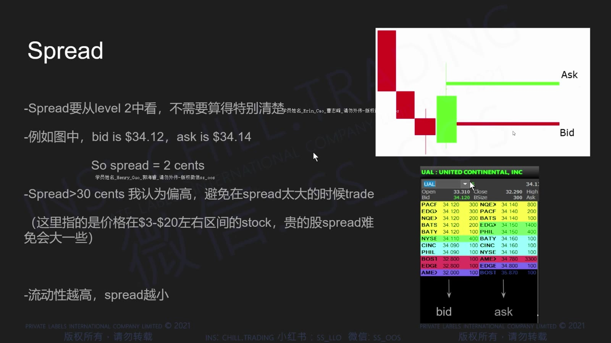
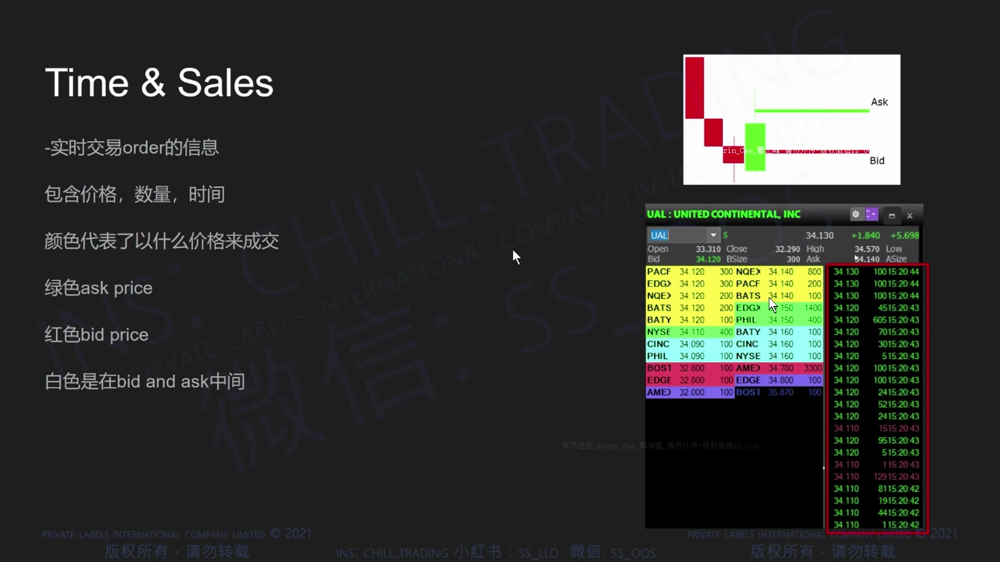
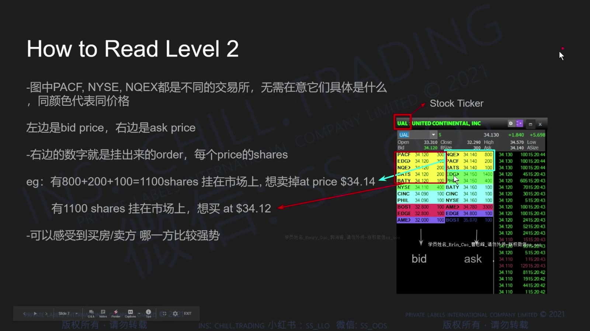
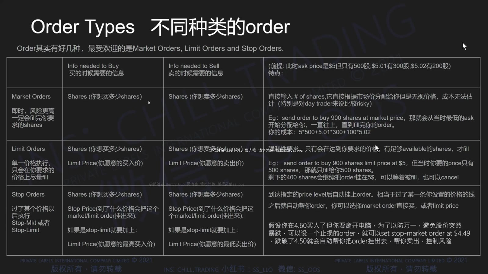
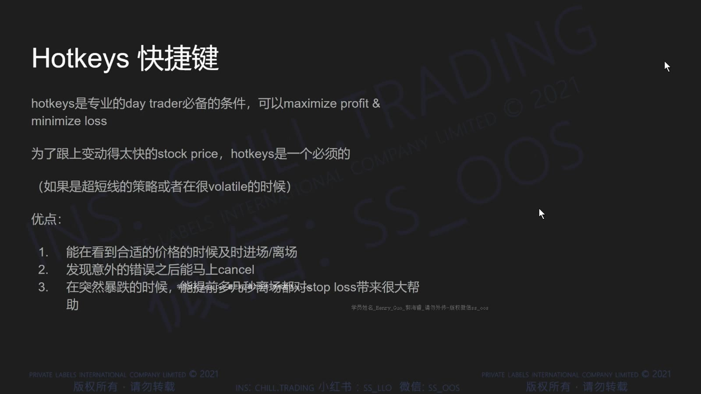
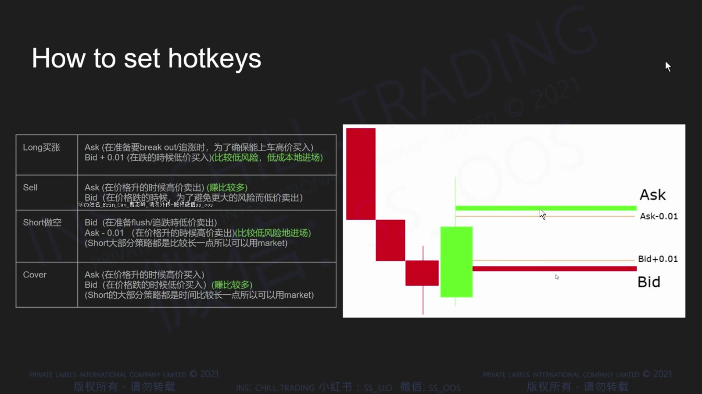
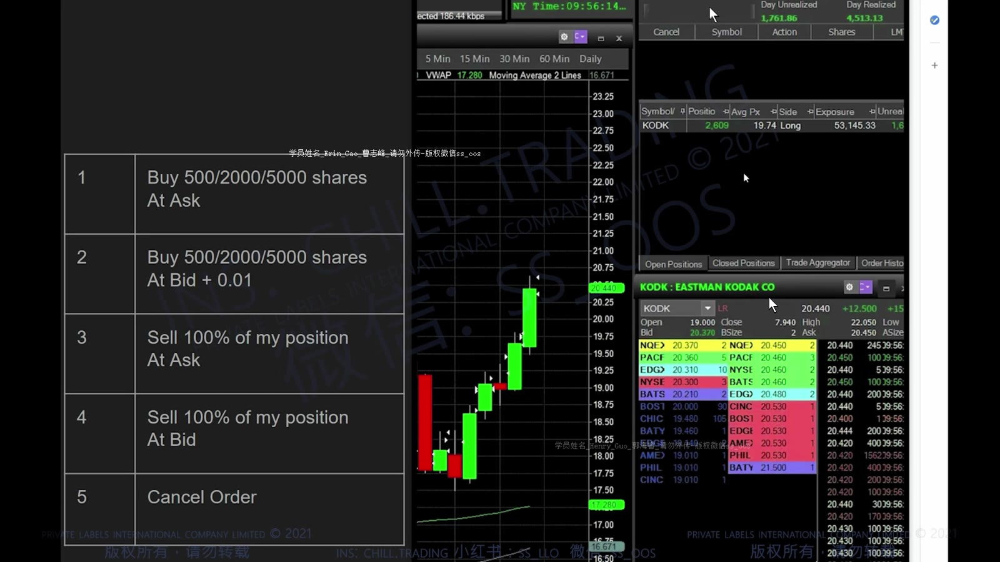
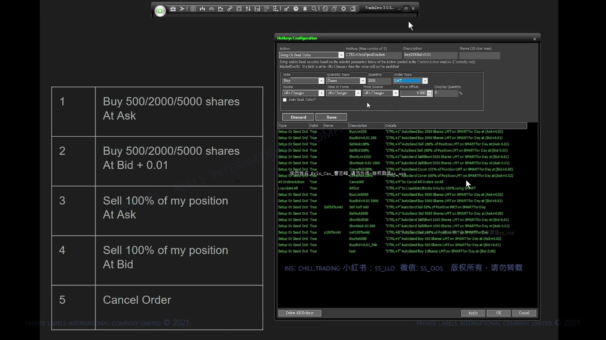

# 基础 03：Bid、Ask、Level 2、订单与 Hotkey

> 对应视频：`3-class3.mp4`
> 视频时长：45:58
> 本课目标：从报价、逐笔成交和盘口理解执行过程，并弄清不同订单类型在快速行情中的真实风险。

## 1. Bid、Ask 与 Spread

Bid 是当前公开报价中最高的买价，Ask 是最低的卖价；两者差值是 spread。

**图怎么看：**

- 想立刻卖出，通常会与 bid 一侧已有买单成交；想立刻买入，通常会与 ask 一侧已有卖单成交。
- 报价是“愿意成交的价格与显示数量”，不是已经完成的交易。
- 小盘股 spread 可能迅速扩大，画面上的 bid/ask 也可能在指令到达前改变。

**图怎么看：**

- 左右两列分别按价格排列买卖盘，最靠近中间的是当前最佳报价。
- 显示数量只是公开部分；隐藏单、不同市场深度和撤单不会完整反映在一个画面中。
- Spread 大时，用市价单跨过去的即时成本更高。

## 2. Time & Sales：已经发生的成交

**图怎么看：**

- Time & Sales 记录实际成交，而 Level 2 主要显示尚未成交的可见报价。
- 视频把 ask 成交标绿、bid 成交标红、中间价标白，这是平台配色约定，不是市场通用语言。
- 连续大单在 ask 成交可说明主动买入压力，但也可能遇到隐藏卖单而价格不再上升。

## 3. Level 2 能告诉你什么

**图怎么看：**

- 每一档展示某价格上的公开买卖意愿，常附市场参与者或路由标识。
- 某价位出现大卖单，可把它列为短期阻力候选；只有价格接触后的真实成交与反应才能验证。
- 大单可以在成交前撤销，也可能是同一参与者拆单，所以不能把盘口墙当成保证。

Level 2 更适合回答“现在执行环境怎样”，而不是“未来一定往哪走”。观察重点包括：

- spread 是否突然变宽；
- 某档报价被持续成交后是否补回；
- 成交主动性变化时价格有没有同步推进；
- 关键位附近是否出现吸收或快速撤单。

## 4. Market Order

**图怎么看：**

- 市价单优先追求执行，不承诺具体成交价格。
- 如果最佳 ask 数量不足，买单会继续向更高报价成交，平均价因此恶化。
- 停牌或极端波动中，市价单可能等待到恢复后才执行，价格可与下单时相差很大。

因此“点了就一定成交”也不严谨：交易暂停、无对手盘、市场拒单或技术故障都可能阻止成交。

## 5. Limit Order

**图怎么看：**

- 限价买单只允许在限价或更低成交；限价卖单只允许在限价或更高成交。
- 它限制最差价格，但不保证成交，也不保证全部成交。
- 在快速上涨中把买入限价设得太低，可能完全错过；这不等于应该改用无价格保护的市价单。

限价单的核心取舍是：

`价格保护更强 ↔ 成交确定性更低`

## 6. Stop Market 与 Stop Limit

**图怎么看：**

- Stop 价格通常只是触发条件；触发后才生成市价单或限价单。
- Stop Market 倾向于确保退出，但可能严重滑点。
- Stop Limit 限制最差价格，但行情越过限价后可能完全无法退出。

止损不能把交易风险锁死。对可能停牌、点差宽、成交稀疏的股票，仓位应先按“止损失效或滑点扩大”进行压力测试。

## 7. Hotkey 的作用与危险

**图怎么看：**

- Hotkey 把价格、股数、路由和买卖动作组合成一次按键，减少手动输入时间。
- 任何字段写错都会被更快执行：错误方向、重复下单、超大股数或反向开仓。
- 视频脚本属于当时的平台与券商配置，不能直接复制到当前实盘。

上线前至少在模拟账户验证：

1. 空仓、持多仓、持空仓时分别按键；
2. 部分成交后再次按键会发生什么；
3. 卖出数量超过持仓会不会反手做空；
4. 路由不可用、停牌、盘前盘后时怎样处理；
5. 按键重复或网络延迟是否会产生多个订单；
6. 撤单键是否只撤当前股票，还是撤全账户订单。

## 8. 从盘口到实际成交

**图怎么看：**

- 图表提供结构，Level 2 提供当前报价，Time & Sales 验证实际成交，订单面板决定你的执行方式。
- 这些窗口必须共同阅读；只盯盘口容易失去更大周期的位置感。
- 屏幕布局复杂时，先确认 symbol 和账户，再确认方向、数量、价格和未成交订单。

## 9. 一个具体执行例子

假设报价为：

- Bid：10.00 × 500 股
- Ask：10.05 × 200 股
- 下一档 Ask：10.12 × 1,000 股

若提交买入 600 股：

- 市价单可能先在 10.05 成交 200 股，再向 10.12 或更高成交剩余部分；
- 10.05 限价单最多在 10.05 或更低成交，但剩余 400 股可能不成交；
- 10.08 限价单也无法保证成交，因为 10.05 的卖单可能在你的订单到达前消失。

这就是为什么应把“看到的价格”“允许的最差价格”和“最后的实际成交”分开记录。

## 10. 下单前五秒检查

- Symbol 是否正确；
- Buy、Sell、Short、Cover 方向是否正确；
- 股数是否与当前风险匹配；
- 使用 Market、Limit、Stop Market 还是 Stop Limit；
- 是否已有未成交订单，重复按键会不会叠加；
- 该股票是否停牌或处于流动性很差的扩展时段。

## 11. 本课结论

- Bid/Ask 是报价，Time & Sales 是成交，Level 2 是不完整的可见意愿；
- 市价单保护执行优先级，限价单保护价格，两者都没有“免费确定性”；
- 止损单不能消除跳空与停牌风险；
- Hotkey 只是加速器，会同时放大良好流程和配置错误；
- 先在模拟环境验证完整生命周期，再考虑真实账户。
