# 基础 04：支撑、阻力、停牌与盘外事件

> 对应视频：`4-class4.mp4`
> 视频时长：32:39
> 本课目标：把支撑阻力理解成需要验证的价格区域，并正确处理停牌、盘前盘后和增发事件。

## 1. 支撑与阻力是区域，不是保证

支撑是价格下跌时可能出现新增需求的区域；阻力是价格上涨时可能出现新增供给的区域。价格突破后，旧阻力可能转为支撑，旧支撑也可能转为阻力，但都要看真实成交反应。

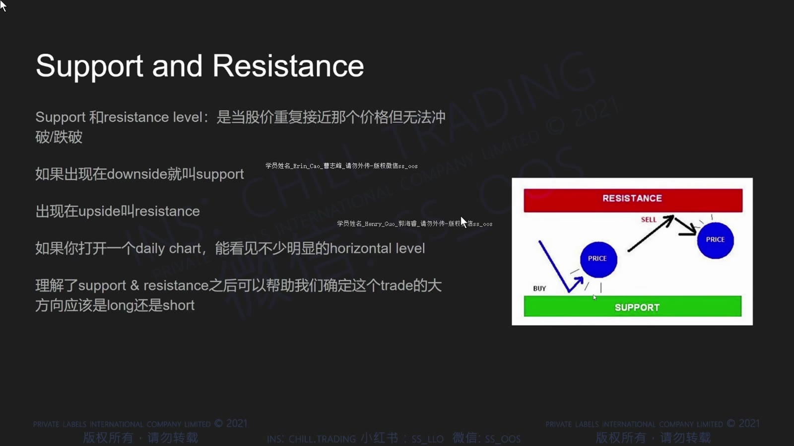

**图怎么看：**

- 示意图把买盘集中区画在下方、卖盘集中区画在上方。
- 实际市场不会精确停在一条像素线上，应给价格、点差和波动留出区域。
- “接近支撑”只表示值得观察，不能替代止损和仓位计划。

课程把常见依据分成心理价位、历史价位、指标、Level 2 和图形结构。

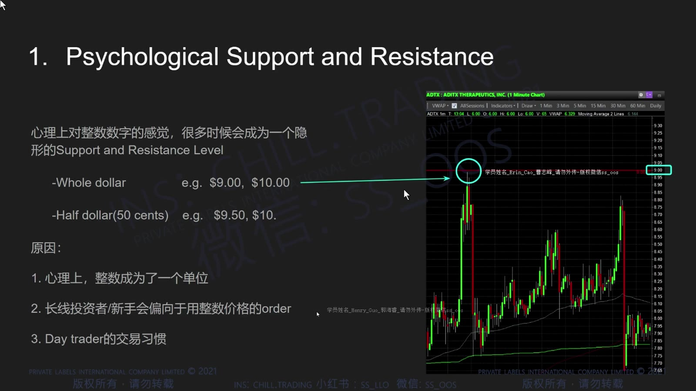

**图怎么看：**

- 五类依据并非彼此独立，例如历史高点可能恰好也是整数位。
- 多个依据重合可以提高关注优先级，但不会把概率变成确定性。
- 最终确认来自价格到达该区域后的成交量、速度和能否站稳。

## 2. 心理价位：Whole 与 Half Dollar

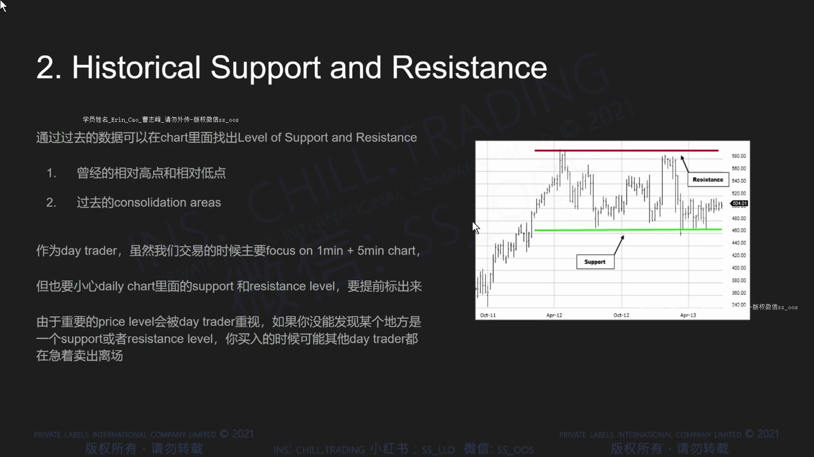

**图怎么看：**

- 10.00、20.00 等整数位容易被人记住，也常聚集止盈、止损和条件单。
- 9.50、10.50 等 half dollar 在低价股中也可能产生反应。
- 心理价位应和当前点差比较；若股票一次跳动就跨越 0.50 美元，单独画半整数位意义较小。

## 3. 历史价位

历史支撑阻力来自过去明显的高点、低点、横盘平台、缺口边缘或高成交区域。

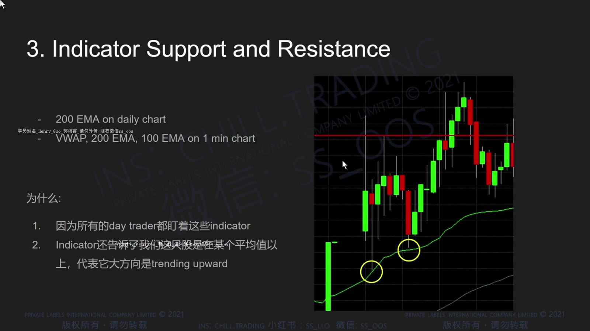

**图怎么看：**

- 图中多次转折的位置比只出现一次的随机价格更值得记录。
- 线应覆盖实际反应区，而不是为了贴合最高影线画得过度精确。
- 距离太远、成交背景完全不同的旧价位，参考价值可能下降。

## 4. 指标形成的动态区域

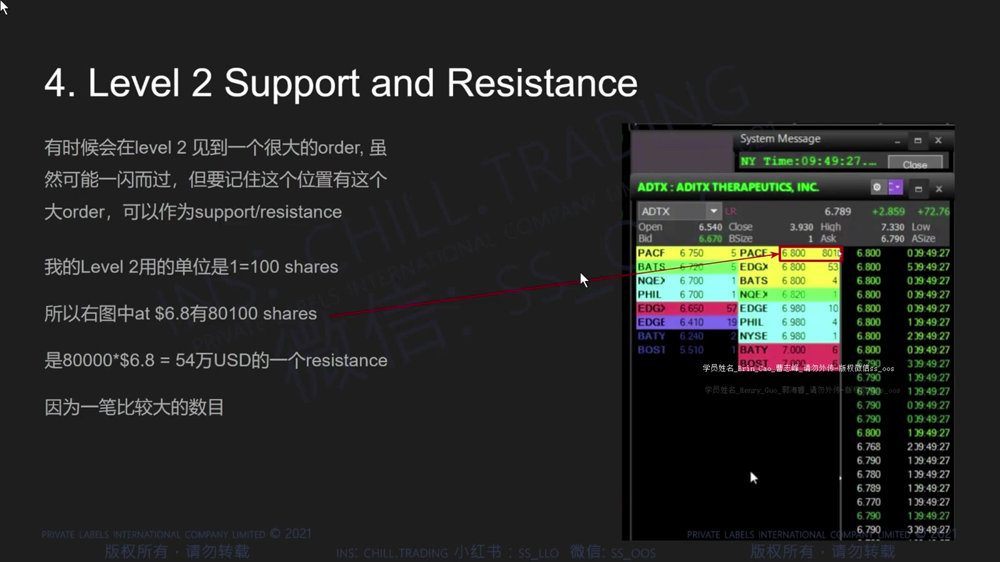

**图怎么看：**

- EMA 和 VWAP 随新数据变化，属于动态参考，不像历史高点那样固定。
- 黄色圈展示价格接近均线后反弹，但不能只保留成功案例。
- 反复测试会消耗一侧订单，也可能说明该区域失效；“测试次数越多越强/越弱”都不是机械规律。

## 5. Level 2 大单

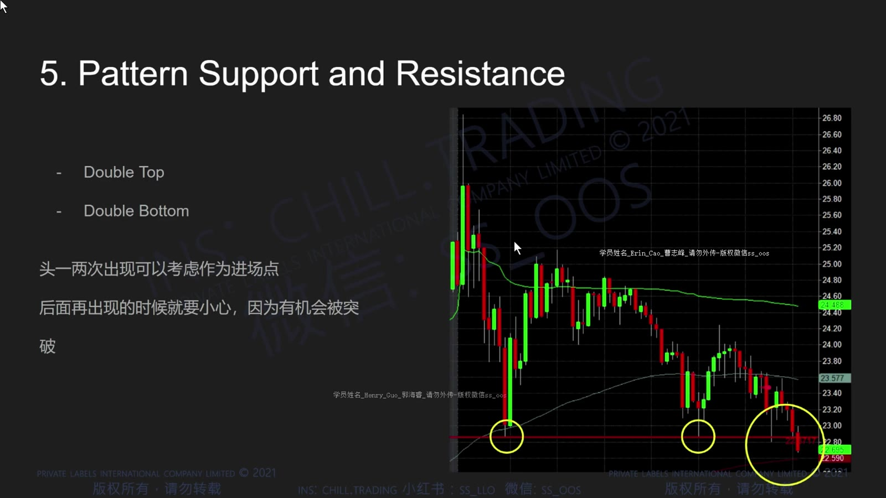

**图怎么看：**

- 某价位的公开大卖单说明当下有可见供给，但订单可以撤销、移动或被隐藏单替代。
- 应观察大单被成交后是否继续补回，以及价格是否能推进。
- 只因看到“墙”就提前反向入场，容易被撤单或真正突破击中。

## 6. 图形结构

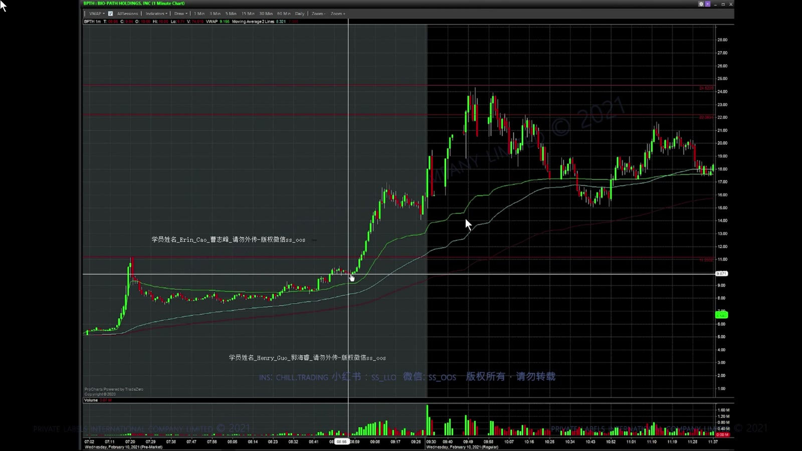

**图怎么看：**

- 双顶表示两次上冲在相近区域失败；双底表示两次下探被买回。
- 第二次触碰时并不知道形态是否会完成，必须等价格反应，不能用事后命名代替决策。
- 两个顶或底之间的量能、时间间隔和大趋势都会影响可解释性。

## 7. 案例：从日线区域转到盘中执行

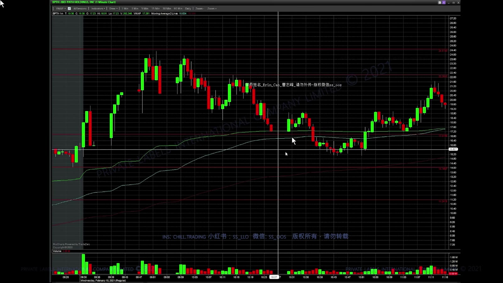

**图怎么看：**

- 先找价格此前明显停顿或反转的区域，再看当日是否再次接近。
- 到位后的第一根红 K 不是自动做空信号；更重要的是反弹能否收复、量能是否衰减。
- 失效条件应写成“突破并站稳某区域”，而不是凭感觉扩大止损。

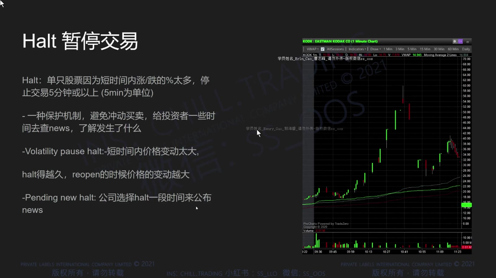

**图怎么看：**

- 屏幕上的多条线应该按优先级分层：最近、最明显、最可能影响当前仓位。
- 线太多会让任何结果都能被事后解释；盘前只保留影响交易计划的关键区域。
- 当前价格位于哪两层之间，比寻找一条“神奇阻力”更实用。

## 8. Halt：暂停期间不能退出

LULD 等机制可能在常规时段的剧烈波动中暂停个股交易。恢复价可能明显高于或低于暂停前价格。

前一张图也能看到停牌风险的关键特征：图表出现时间空白或直接跳到新价格，暂停期间没有连续成交路径。暂停前的 stop 无法在暂停期间执行，恢复时才有机会进入市场。这也是为什么低流通盘、连续加速股票必须使用更小仓位。

视频提出过在 halt down 时挂市价单、等待恢复执行的选择。这个做法不能当作安全方案：恢复可能继续大幅低开，市价单会在可成交的未知价格执行。更稳妥的原则是**在进入停牌前控制仓位**，恢复后重新观察可见报价并使用与风险相符的订单。

## 9. Pre-Market 与 After-Hours

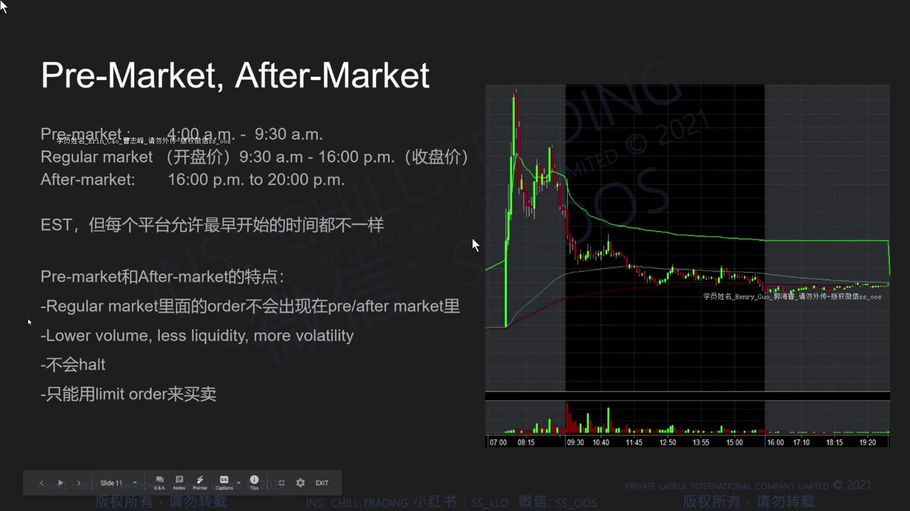

**图怎么看：**

- 常规交易时段通常是美东 09:30–16:00；盘前盘后的开放时长由交易场所和券商决定。
- 灰色背景用于区分盘外时段，实际平台配色可能不同。
- 盘外成交量通常更低、spread 更宽、价格更不确定，很多券商只接受限价单。

课程画面中的具体盘前起止时间不可直接套用。应检查券商当日支持的市场、订单类型、路由以及未成交订单是否会延续到常规时段。

## 10. Offering 不是都等于 IPO

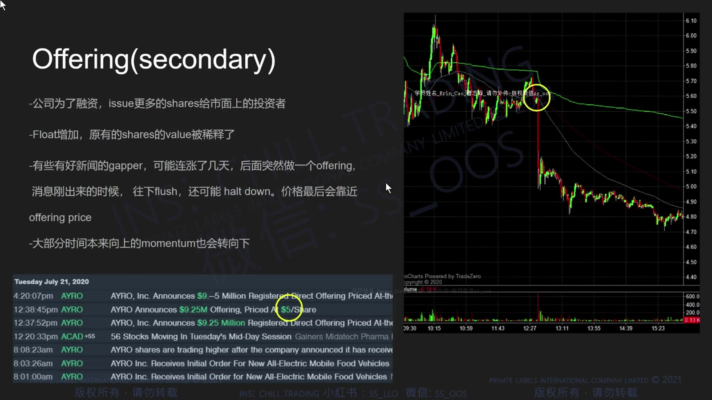

**图怎么看：**

- 图中新闻时间与价格快速下跌相邻，说明融资消息可能改变市场对供给的预期。
- Primary offering 由公司发行新股，可能增加股本并稀释现有持有人。
- Secondary resale 也可能只是现有股东出售；是否稀释必须读发行文件，不能只看“offering”一词。

核对融资消息时看：

- 是已宣布、已定价，还是只有 shelf registration；
- 新发行还是股东转售；
- 股数、价格、承销折扣和预计净募资；
- 是否包含 warrants、可转债或超额配售；
- 发行价与当前市场价的距离。

## 11. 本课操作框架

盘前为每只候选股建立：

1. 最近的历史支撑与阻力区；
2. whole/half dollar；
3. VWAP 与关键 EMA；
4. 停牌、融资和盘外流动性风险；
5. 价格到达每一区域时的计划动作；
6. 突破站稳或跌破后哪个判断失效。

支撑阻力的价值，不在于预测每次反转，而在于让入场、退出与“不交易”都有事前位置。
