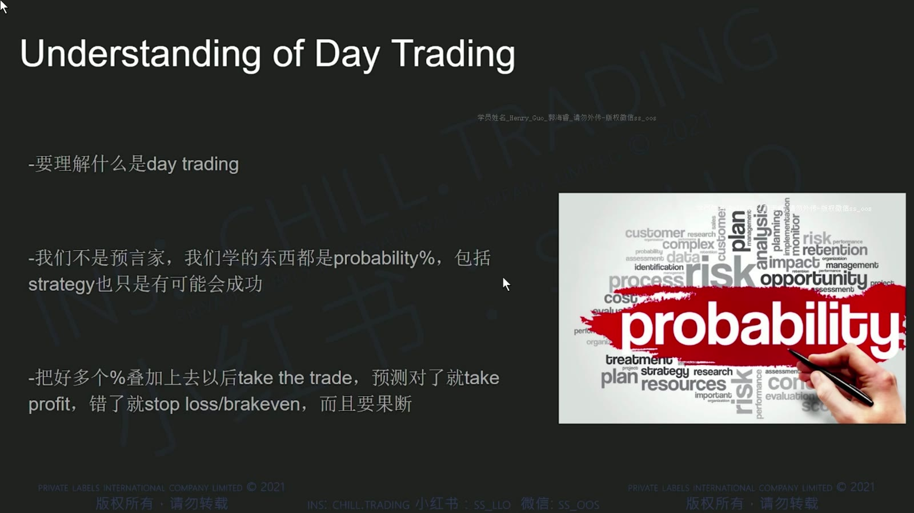
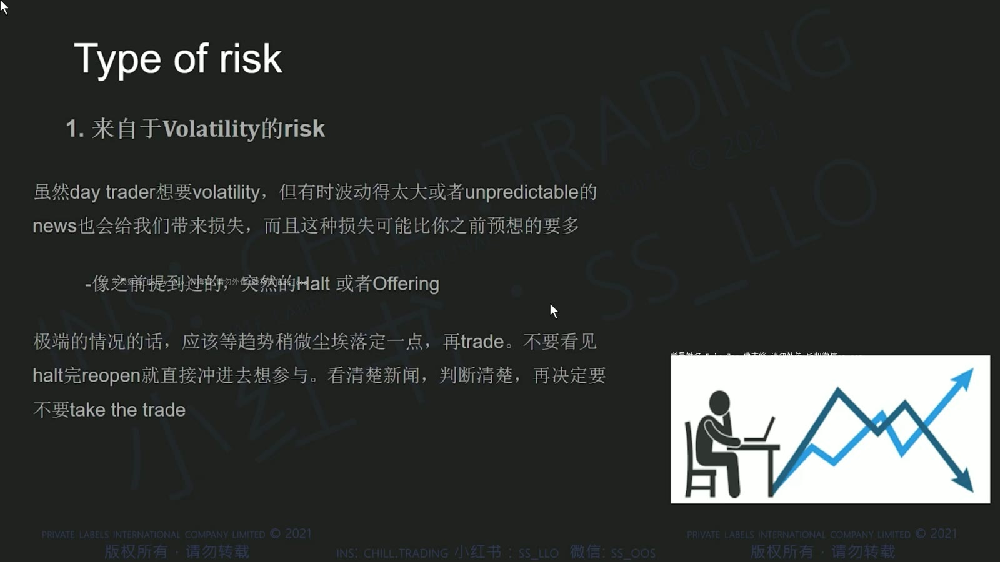
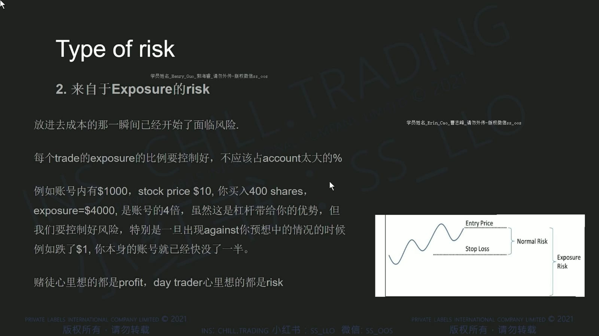
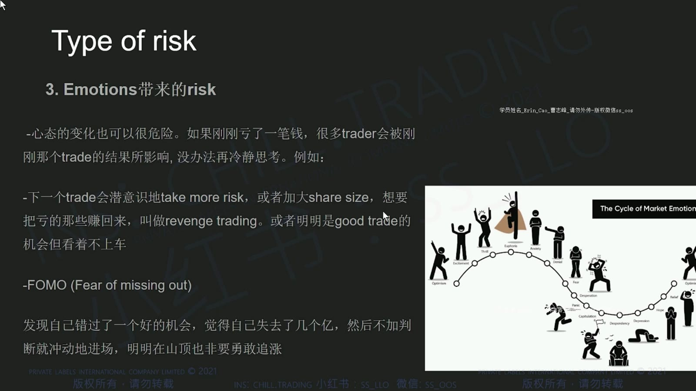
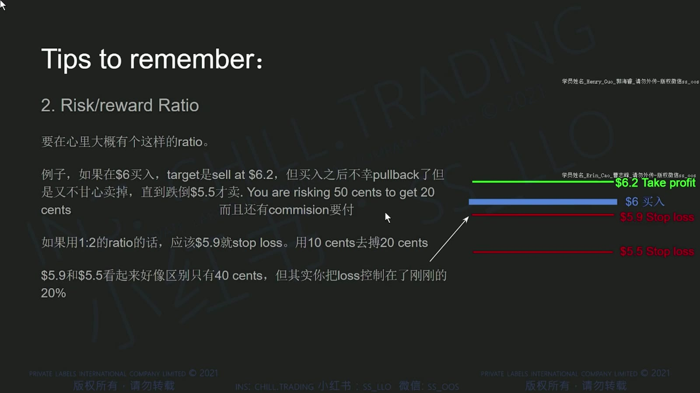
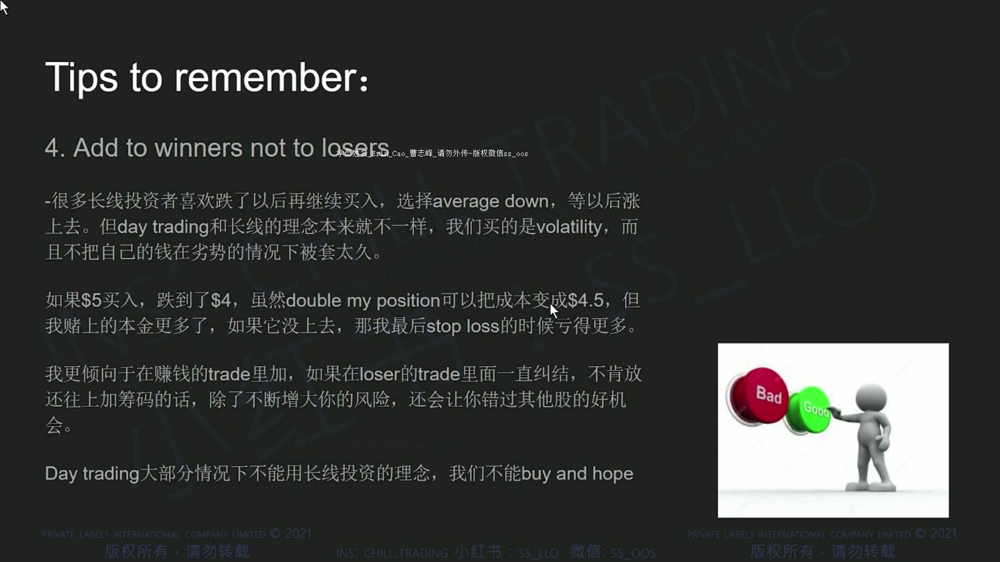
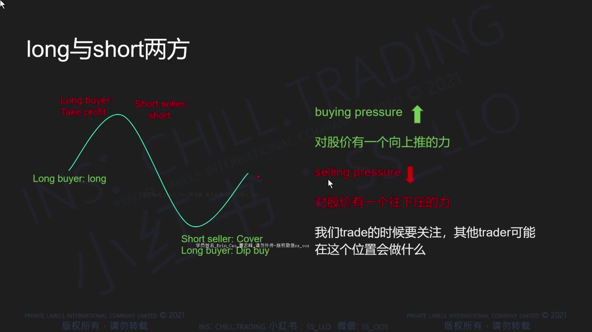
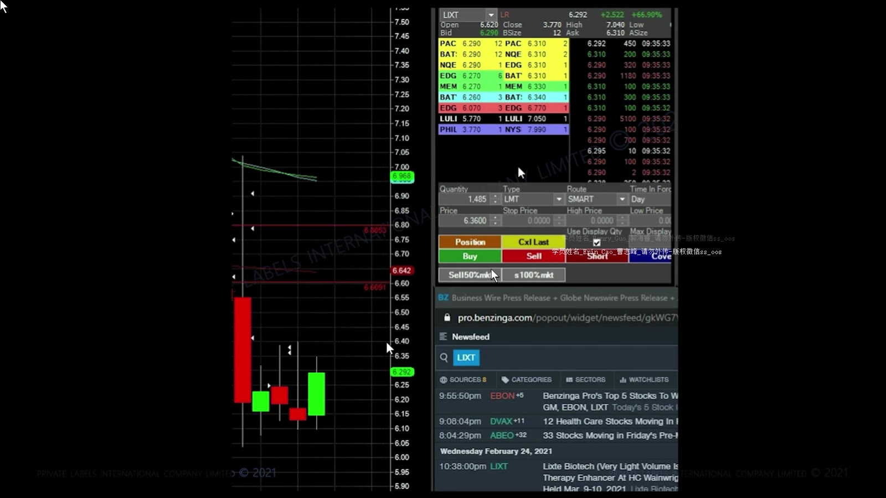
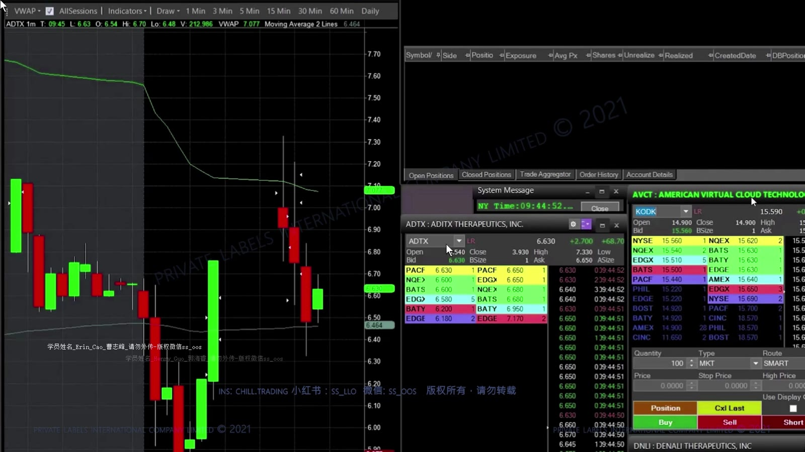

# 基础 05：概率、风险管理与 Long 基础

> 对应视频：`5-class5.mp4`
> 视频时长：28:33
> 本课目标：把交易从“猜对方向”改写成可计算的概率、赔率、仓位与执行流程。

## 1. 交易是概率问题

单笔盈利不能证明策略有效，单笔亏损也不能证明策略无效。需要在相同定义下记录足够多的样本。

**图怎么看：**

- 幻灯片强调策略和经验用于提高条件概率，而不是预测每一笔。
- “胜率超过 50%”仍不足以判断盈利，还需要比较平均盈利与平均亏损。
- 模拟盘能练流程，但成交质量、心理压力和借股条件与实盘不同。

期望值可近似写为：

`EV = 胜率 × 平均盈利 - 败率 × 平均亏损 - 平均交易成本`

例如胜率 45%、平均赚 2R、平均亏 1R，在忽略成本时：

`0.45 × 2R - 0.55 × 1R = +0.35R`

这里的 R 是单笔计划风险，不是固定美元数。

## 2. 三类风险

### 2.1 Volatility Risk

**图怎么看：**

- 视频列出突发新闻、halt 和 offering，说明价格路径可能突然脱离历史图形。
- 波动不是只有标准差；对执行而言，点差、跳空和订单簿变薄都很关键。
- 历史波动小不代表下一分钟安全，尤其是消息驱动的小盘股。

### 2.2 Exposure Risk

**图怎么看：**

- 入场与 stop loss 之间的距离决定每股计划风险。
- 股数越大，同样的小幅不利波动会产生越大美元亏损。
- 图中的正常止损只覆盖连续成交场景，跳空后实际退出可能远离计划线。

仓位计算例：

- 最大可承受亏损：100 美元；
- 入场：5.00；
- 失效价：4.85；
- 预留滑点：0.05；
- 每股风险：0.20；
- 最大股数：`100 ÷ 0.20 = 500 股`。

### 2.3 Emotional Risk

**图怎么看：**

- 情绪风险常表现为错过后追价、亏损后加仓、连续下单和擅自移动止损。
- 它不是靠“意志坚定”就能消失，最好用最大日亏损、强制冷静时间和订单限制约束。
- 复盘应记录有没有遵守流程，不能只看最后赚亏。

## 3. 入场前定义退出

**图怎么看：**

- Entry、take profit、stop loss 应在下单前由结构确定。
- Stop 应放在“交易逻辑失效”的位置，再由距离反推股数；不能先选想买的股数，再把止损挤到很近。
- 如果到目标前有明显阻力，理论利润空间应按现实障碍缩短。

一份最小交易计划应包含：

| 项目 | 要回答的问题 |
|---|---|
| Setup | 为什么现在存在优势？ |
| Trigger | 哪个价格行为出现才入场？ |
| Invalidation | 什么事实说明判断错了？ |
| Size | 最坏可接受亏损对应多少股？ |
| Exit | 目标、分批和时间退出怎样执行？ |
| No-trade | 哪些条件下直接放弃？ |

## 4. Risk/Reward 不能脱离胜率

**图怎么看：**

- 图中止损约 0.20 美元、目标约 0.40 美元，所以名义赔率为 1:2。
- 真实平均亏损可能因滑点超过 1R，真实平均盈利也可能因提前卖出小于 2R。
- 只有把同一 setup 的实际成交样本统计出来，1:2 才不是纸面数字。

盈亏平衡胜率（忽略成本）为：

`Break-even win rate = 平均亏损 ÷ (平均盈利 + 平均亏损)`

若平均赚 2R、亏 1R，理论盈亏平衡胜率约 33.3%；计入成本和滑点后会更高。

## 5. Add to Winners，不是自动追高

**图怎么看：**

- 价格按预期推进后加仓，通常比下跌中无限摊平更容易保持逻辑一致。
- 但加仓会增加总敞口，也可能把整体平均成本抬到不利位置。
- 每次加仓都应重新计算全仓 stop 后的总美元风险，不能只看首笔已经浮盈。

一个安全检查是：

`全仓风险 = Σ[(各批入场价 - 共同失效价) × 各批股数]`

若加仓后全仓风险超过单笔预算，就需要减少新股数、上移有效 stop，或不加仓。

## 6. Long 与 Short 的互动

价格上涨可能同时来自新多头买入和空头回补；下跌可能来自多头卖出和新空头入场。

**图怎么看：**

- 图表只能显示合成后的成交价格，不能精确标记每一笔是谁在买。
- “空头回补”是可能解释，若没有借股、空头仓位等可靠数据，不应写成确定事实。
- 上涨后量能衰减、买盘不再推进，比猜测参与者身份更可操作。

## 7. 1 分钟与 5 分钟 Breakout

**图怎么看：**

- 水平高点被突破只是触发条件，后续能否在其上方接受成交才决定质量。
- 1 分钟信号更快但噪音更多；5 分钟更慢，失效距离通常也更大。
- 突破后立刻跌回平台称为失败突破；若无预设退出，快速行情会把小亏变成大亏。

Breakout 的最小组成：

1. 事前可见的水平位；
2. 接近时量能与价格收缩或重新加速；
3. 触发时有足够流动性；
4. 清晰的失效位置；
5. 上方还有可实现的利润空间。

## 8. 日内风险上限

除了单笔 R，还应设：

- 单日最大亏损；
- 连续亏损后的暂停次数；
- 单一股票总敞口；
- 停牌股和盘外时段的更低仓位上限；
- 任何时候最大未实现亏损；
- 平台或网络异常时的应急退出方法。

课程中的固定 1:2 和“加赢家”是组织思路，不是盈利保证。真正需要验证的是自己的成交记录、成本和最差尾部事件。
