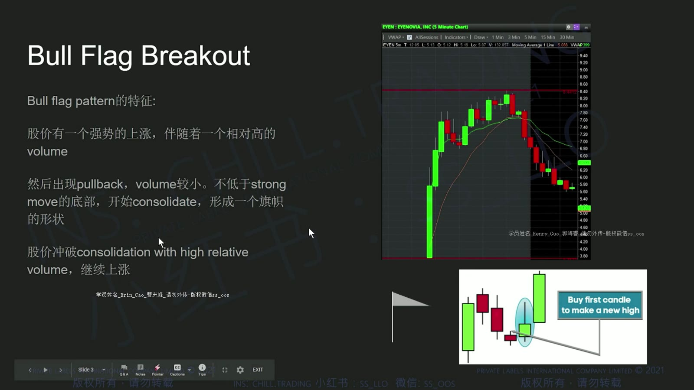
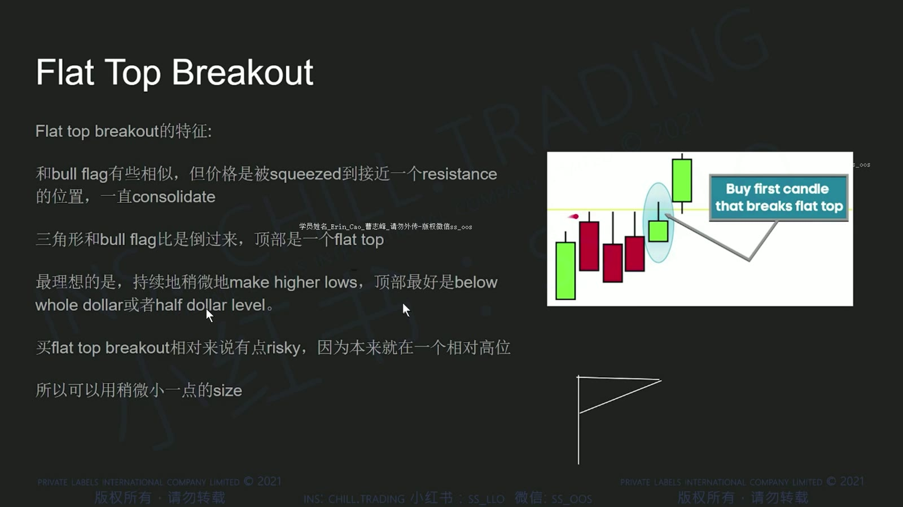
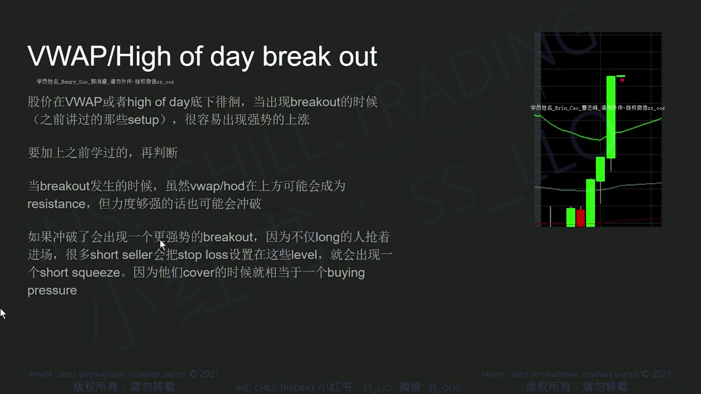
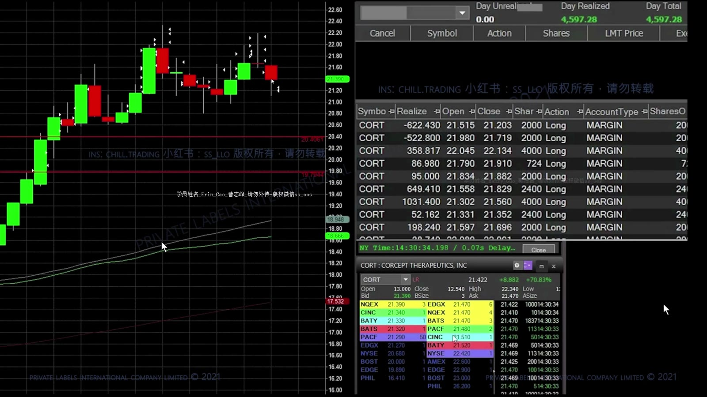
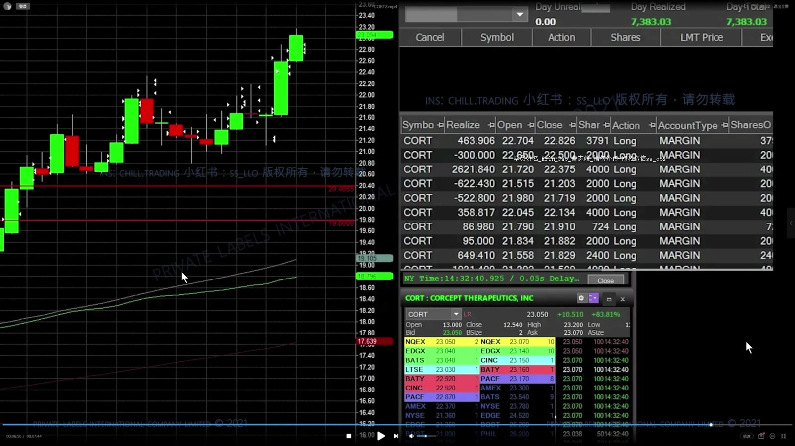
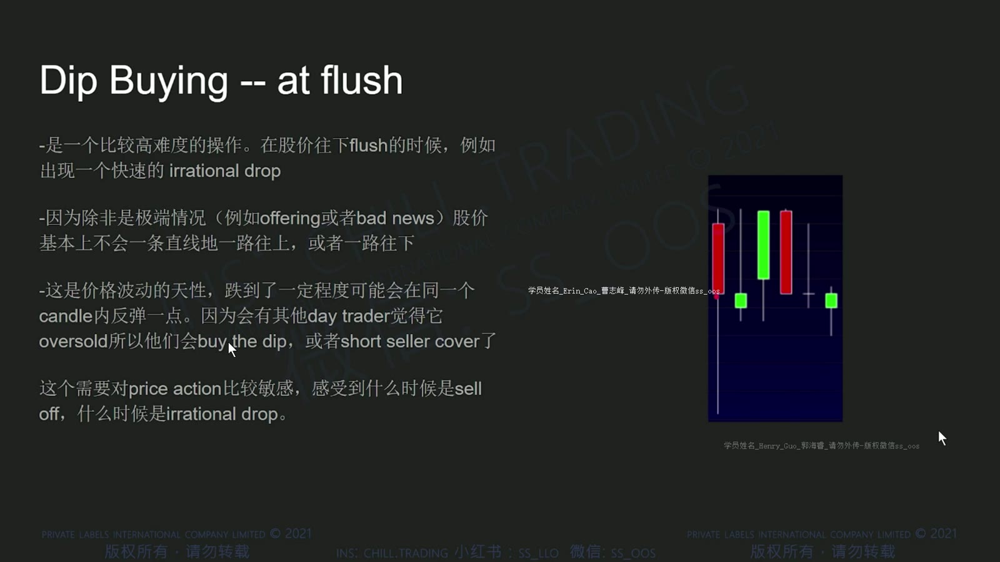
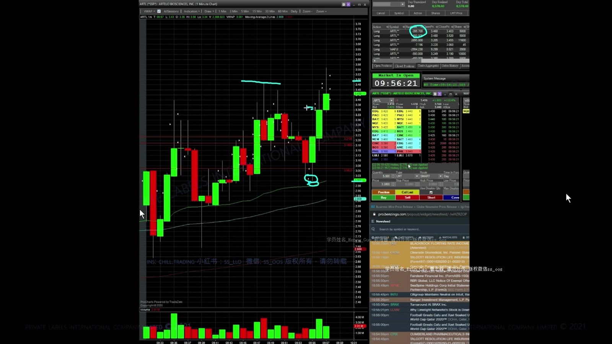
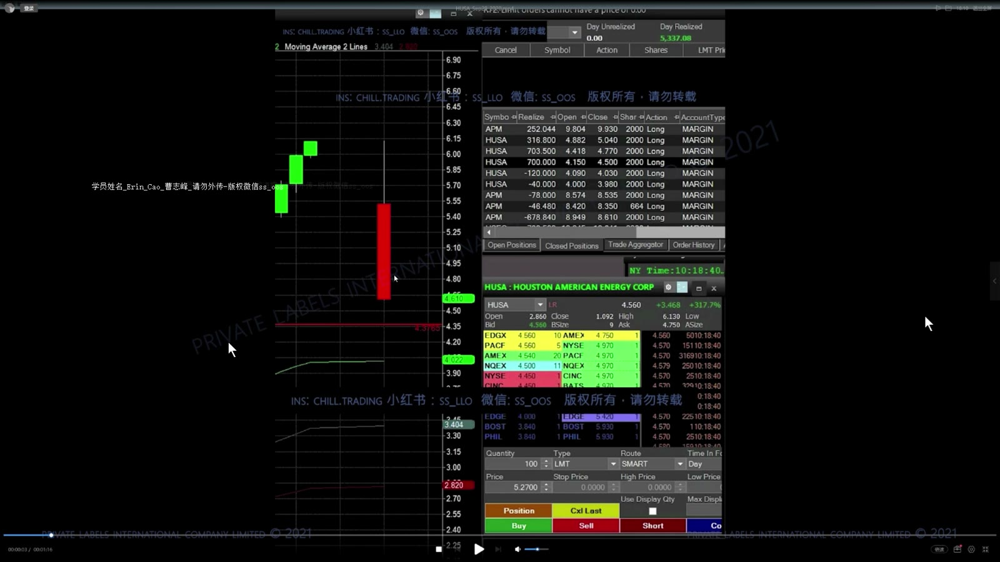
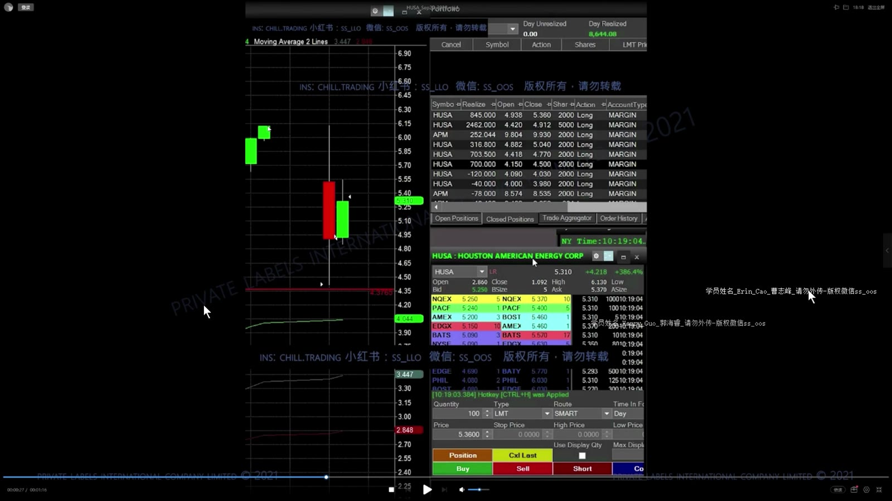
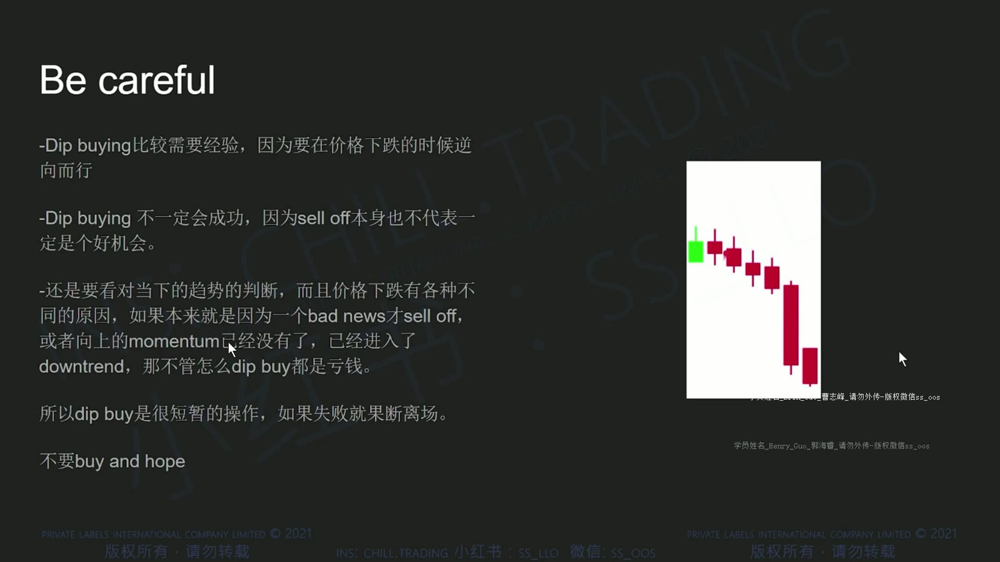

# 基础 06：Bull Flag、突破与 Dip Buying

> 对应视频：`6-class6.mp4`
> 视频时长：41:30
> 本课目标：识别三类突破结构，理解突破后的回踩与急跌低吸，并为每种情形定义失效条件。

## 1. Bull Flag Breakout

Bull flag 通常由快速上涨、较有秩序的回调或横盘、再次突破组成。

**图怎么看：**

- 旗杆是前一段明显上涨，旗面是成交量通常收缩的整理。
- 触发位置是整理区上沿，而不是看到第一段上涨就追入。
- 如果回调跌破关键支撑、量能失控或上涨空间被上方阻力压住，形态质量下降。

## 2. Flat Top Breakout

Flat top 是价格多次接近同一上沿却未突破，低点可能逐步抬高。

**图怎么看：**

- 水平上沿说明卖盘集中在相近价格；低点抬高可表示买方愿意越来越早承接。
- 多次测试也可能消耗买盘或诱发假突破，不能机械地认为测试越多越容易突破。
- 入场离上沿越远，追价越严重，失效位也越难设置。

## 3. VWAP / High of Day Breakout

**图怎么看：**

- HOD 是当日截至当前的最高价，会随新高更新；VWAP 是动态平均成本参考。
- 小周期先突破整理区，再接近 VWAP 或 HOD，可能形成连续触发。
- 多个位置重合提高关注度，但上方卖压也会更集中，必须看实际成交是否推进。

## 4. 实盘突破：触发、加仓与退出

**图怎么看：**

- 左侧 K 线显示冲高后在高位整理，右侧订单记录用于还原分批成交。
- 复盘不能只圈最终突破；应记录首次入场时可见的上沿、stop 与上方空间。
- 多次加仓会改变平均成本和全仓风险，必须逐笔重算。

**图怎么看：**

- 价格没有立刻延续时，横盘既可能是蓄势，也可能是买盘衰竭。
- 观察回落是否守住旧阻力、成交量是否收缩，以及再次上冲有没有新增成交。
- “还没跌”不是继续持有的充分理由；时间退出也应写进计划。

## 5. Breakout 后的 Dip Buy

突破后价格常回踩原阻力或 VWAP。若该区域转为支撑，并出现卖压衰减，课程称为 dip buying after breakout。

**图怎么看：**

- 先确认前面真的发生过有效突破，再观察回踩深度。
- 回踩到旧上沿后迅速收回，比无支撑地持续下跌更符合策略逻辑。
- 入场必须靠近明确失效位；若需要很宽的 stop，股数应相应下降。

**图怎么看：**

- 回踩低点没有破坏前一结构，之后重新抬高，是课程想捕捉的确认。
- 事后图看起来顺滑，实盘中每根未完成 K 线都可能继续向下。
- 不要因为“已经从高点跌了很多”而买；需要能说明承接出现在哪里。

## 6. At-Flush Dip Buying

另一类低吸是在快速下杀（flush）后等待卖压释放、价格重新站回某参考位。

**图怎么看：**

- 长红 K 说明短时间卖压很强，不等于价格已经便宜。
- 先观察低点是否停止下移、spread 是否恢复、买盘是否能把价格推回。
- 若急跌来自坏消息、融资或流动性消失，技术反弹可能不出现。

**图怎么看：**

- 画面展示从上涨到大红 K 的突然切换，说明“等回调”可能瞬间变成接飞刀。
- 下杀中使用市价买入会面对未知滑点，也可能紧接着进入 halt down。
- 真正可控的机会通常出现在波动开始收敛后，而不是最大红 K 尚未完成时。

**图怎么看：**

- 幻灯片明确指出 dip buy 失败后可能继续下跌。
- “跌很多”不是反转信号；bad news、sell-off 和整体 momentum 改变都可能让原逻辑失效。
- 失败时要按计划退出，不能把日内低吸变成无限期持仓。

## 7. 三种结构对比

| Setup | 触发 | 常见失效 | 主要风险 |
|---|---|---|---|
| Bull flag | 整理上沿突破 | 跌破旗面低点/关键支撑 | 假突破、追价 |
| Flat top | 水平上沿被接受 | 突破后迅速跌回 | 高位供给仍在 |
| VWAP/HOD | 动态位置与当日高点被突破 | 无法站稳并失去近端支撑 | 拥挤交易、快速反转 |
| Dip after breakout | 旧阻力回踩转支撑 | 跌回原区间 | 把失败突破误判为回踩 |
| At-flush dip | 下杀停止且重新出现承接 | 低点继续下移 | 接飞刀、停牌、消息风险 |

## 8. 入场检查表

- 这个水平位在入场前是否已清晰可见？
- 是第一段突破，还是已经延伸很远后的追价？
- 当前 spread 与预期利润相比是否过大？
- 上方最近阻力有多远？
- 失效价在哪里，包含滑点后应买多少股？
- 若停牌、坏消息或继续 flush，最大损失是否可承受？
- 这笔交易是“看到确认”，还是只因为害怕错过？

任何 breakout 或 dip buy 都是条件组合，不是单一蜡烛形态。先有价格地图，再谈触发；先有退出，再谈盈利目标。
