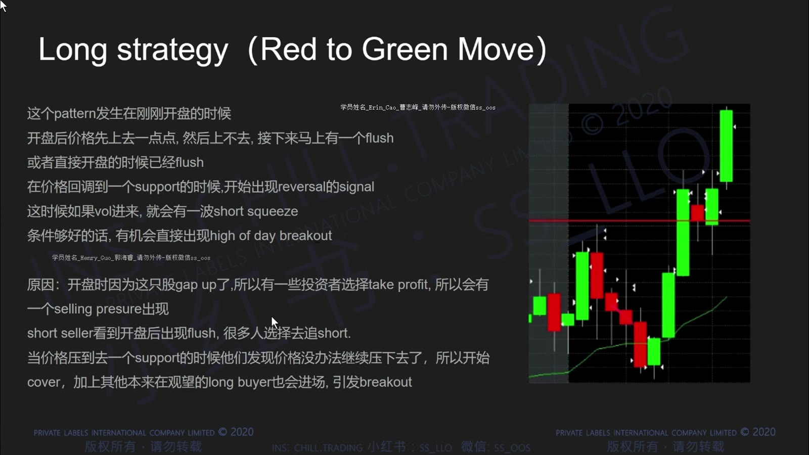
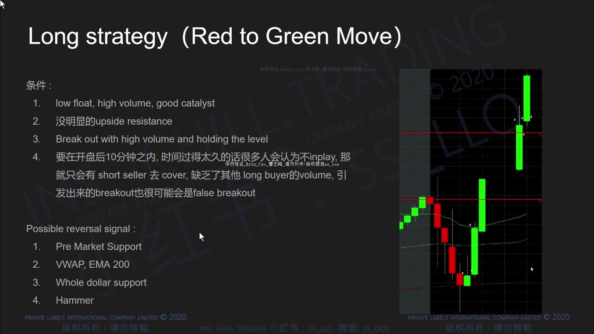
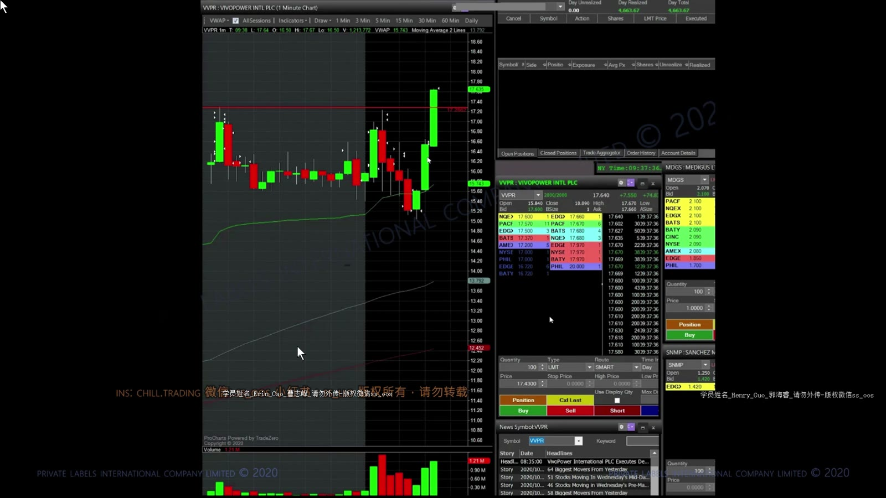
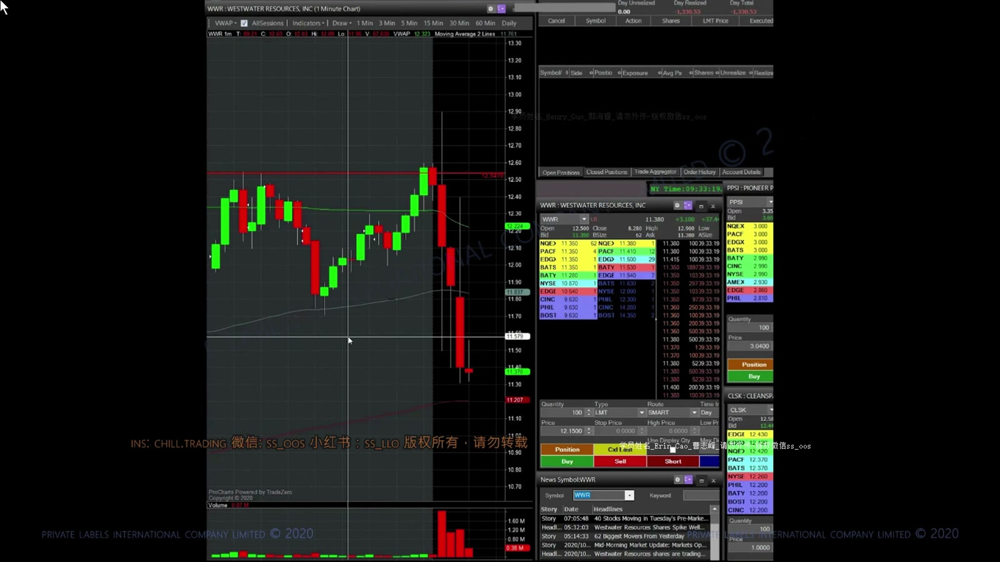
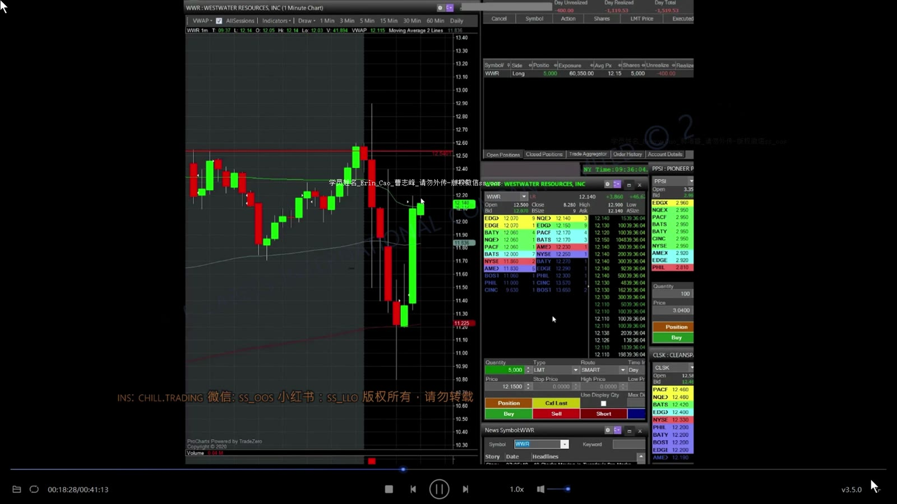
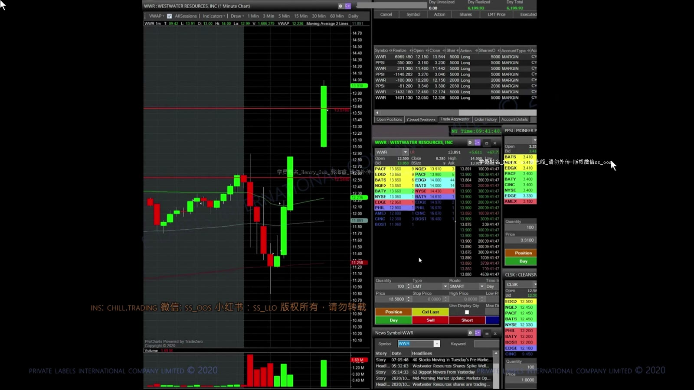
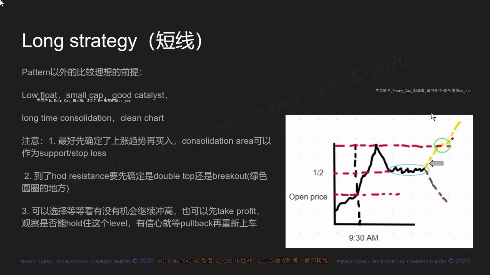
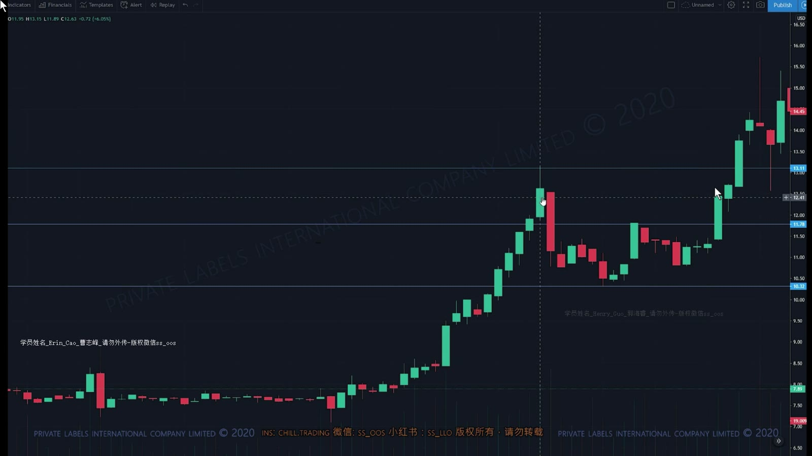

# 基础 07：Red-to-Green 与 Squeeze 结构

> 对应视频：`7-class7.mp4`
> 视频时长：41:19
> 本课目标：理解开盘由弱转强和长时间整理后的突破，但不把“空头回补”当作未经验证的确定事实。

## 1. 什么是 Red-to-Green Move

课程把开盘先跌到前收盘价下方、随后重新回到前收盘价上方的变化称为 Red-to-Green。前收盘价是参考线，“red/green”描述当天涨跌状态。

**图怎么看：**

- 开盘后先出现红 K 和 flush，价格在支撑附近停止下移。
- 重新站上前收盘价后，原先的弱势叙事被破坏，可能吸引买盘和空头回补。
- 前收盘价不是因果开关；真正重要的是下跌失败、承接和突破后的持续成交。

## 2. 课程列出的前提

**图怎么看：**

- 课程要求 low float、high volume、good catalyst，并希望上方没有明显阻力。
- 这些条件用于寻找容易形成供需失衡的股票，也同时意味着更高停牌和滑点风险。
- “good catalyst”必须经原始公告核实；市场反应比主观新闻标签更重要。

课程还列出盘前支撑、VWAP、EMA、whole dollar 与 hammer 等反转参考。不要把它们累加成机械评分，先问哪个位置真正定义了失效。

## 3. 开盘实时案例：第一次 flush

**图怎么看：**

- 价格从开盘区域快速下探，底部量能开始放大。
- 此时只能说“可能出现承接”，还不能根据一根下影线确认反转。
- 如果买入，stop 应围绕已形成的低点或结构失效，而不是无限等待回到成本。

**图怎么看：**

- 从低点恢复后，连续更高低点说明卖方暂时无法继续推进。
- 接近前收盘/盘中阻力时，观察是否真正成交并站稳。
- 课程把上涨解释为 short squeeze；更严谨的说法是“新增买盘与可能的空头回补共同造成需求”。

## 4. 失败与二次反转

**图怎么看：**

- 第一次反弹没有保证趋势持续，随后大红 K 重新测试低位。
- 如果初始交易的失效条件已经触发，应先退出；不能因为仍期待 squeeze 而扩大亏损。
- 快速反复会显著增加滑点和追涨杀跌，仓位应比平稳行情小。

**图怎么看：**

- 下杀后出现强绿 K，但反弹幅度大不等于低点安全。
- 更有用的证据是：下一次回踩是否形成更高低点，以及上方被套成交是否阻挡。
- 复盘要同时保留失败段和恢复段，避免只截最后上涨。

## 5. Consolidation Squeeze

长时间横盘会让多空仓位在窄区间内积累。若价格向上突破，原先依赖横盘上沿做空的人可能止损回补，进一步增加买单。

**图怎么看：**

- 先画横盘上沿、下沿和区间内逐渐变化的量能。
- 突破上沿后若立即跌回，属于失败；能在上方接受成交才更有意义。
- “区间里积累很多空头”通常无法从图表直接证明，应视为解释假设。

**图怎么看：**

- 画面重点不是复制某个固定 K 线形状，而是找持续时间、水平边界和突破后的扩张。
- 区间越长不代表一定向上；也可能向下破位。
- 只有向上触发时才考虑 long，并以区间重新失守作为候选失效。

## 6. Red-to-Green 计划模板

1. 标出前收盘、盘前低点、VWAP、整数位和最近上方阻力；
2. 等开盘 flush 停止，不在最大红 K 中猜底；
3. 观察能否形成更高低点并收复关键参考；
4. 选择靠近失效位的触发，按包含滑点的风险计算股数；
5. 接近 HOD 或历史阻力时分批处理；
6. 若重新跌破结构或进入 halt，按预案处理，不临时扩大风险。

## 7. 如何避免事后偏差

复盘时把画面停在入场前，逐项写：

- 当时已经知道哪些支撑？
- 反转 K 线已经收盘了吗？
- 上方到 HOD 的空间是否足够？
- 如果没有后来的大绿 K，这笔入场仍合理吗？
- 对“short squeeze”的判断有什么可观测证据，哪些只是推测？

Red-to-Green 是价格状态转换，不是买入按钮。真正可重复的是对失败下跌、重新承接、上方空间和风险边界的组合判断。
