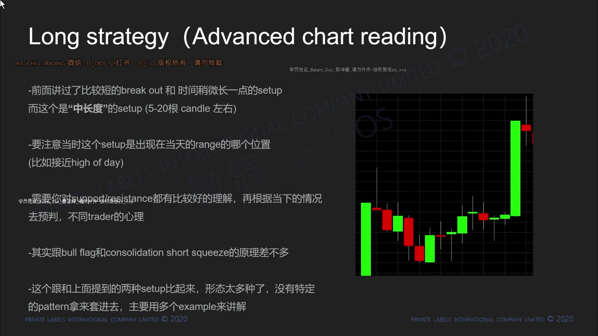
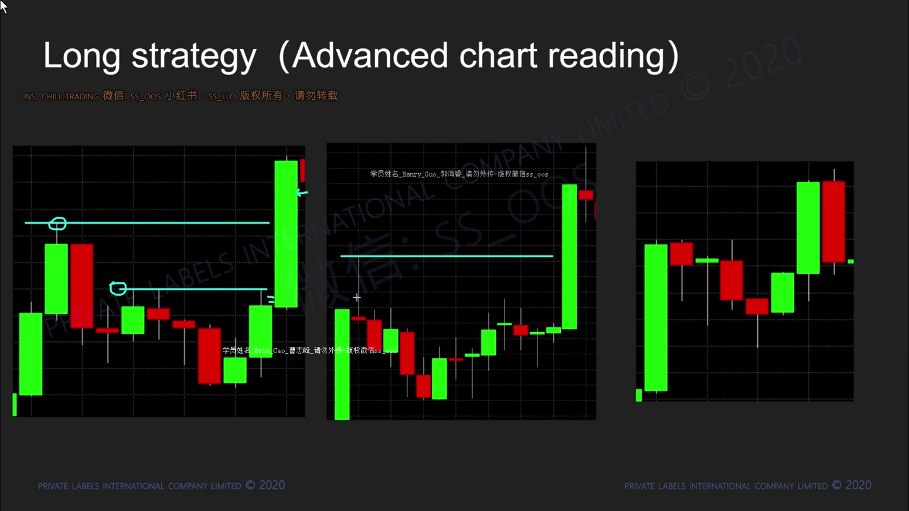
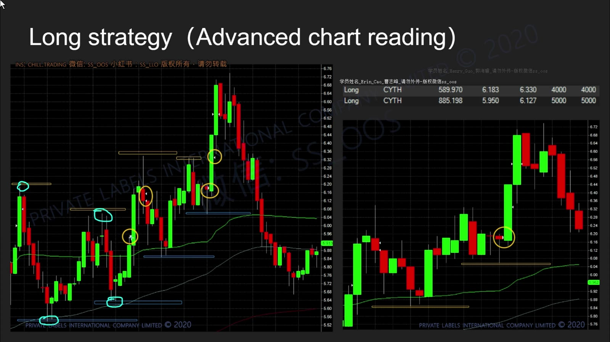
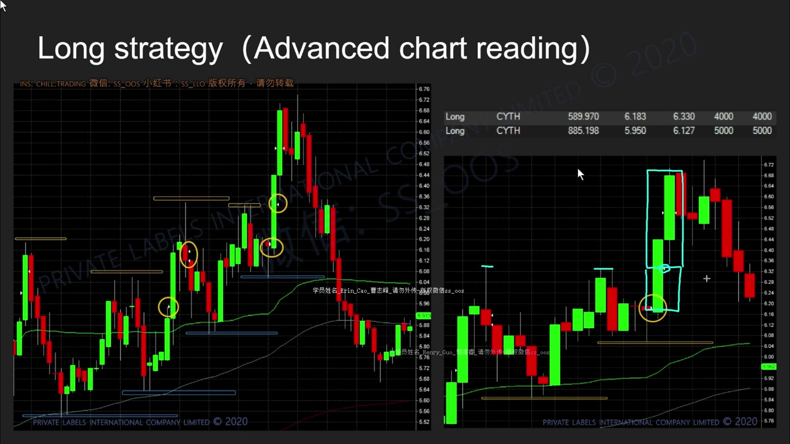
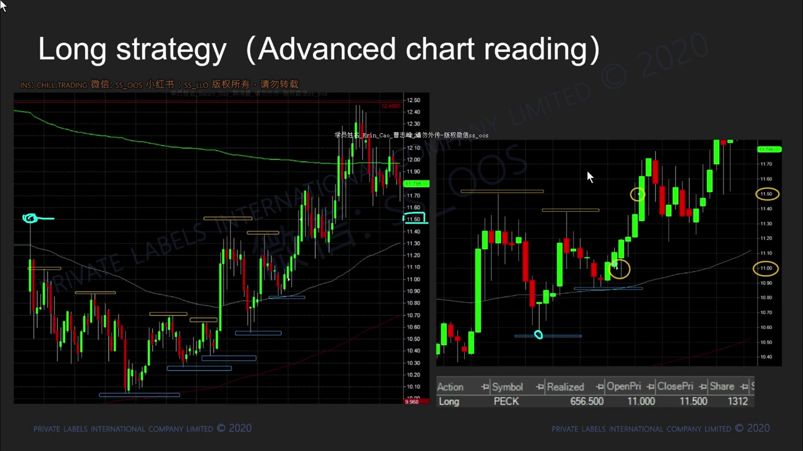
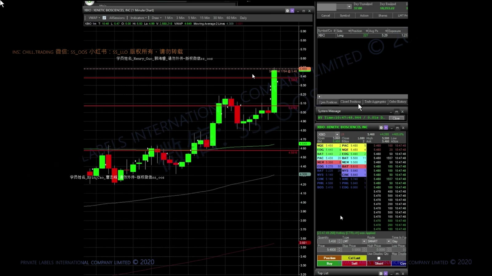
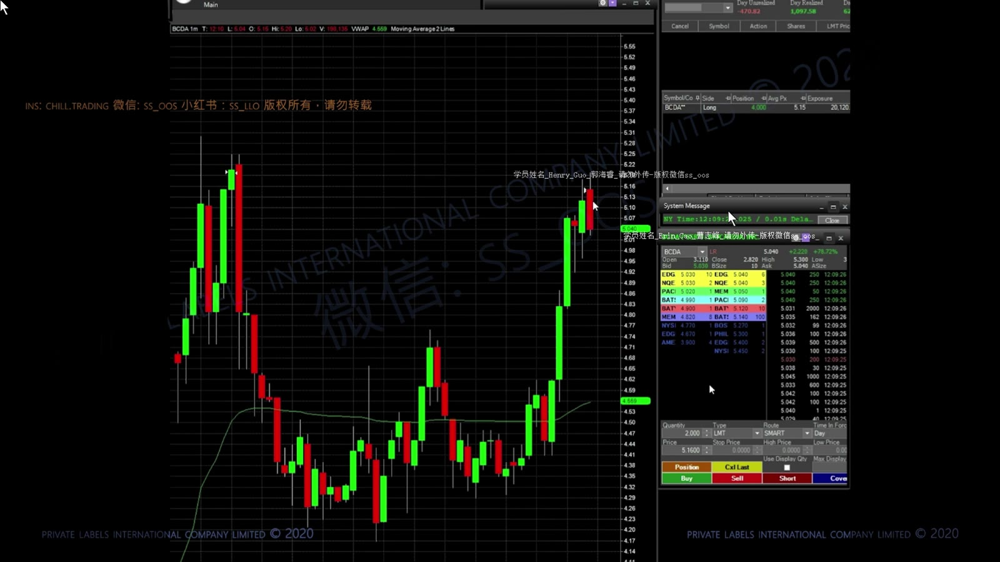
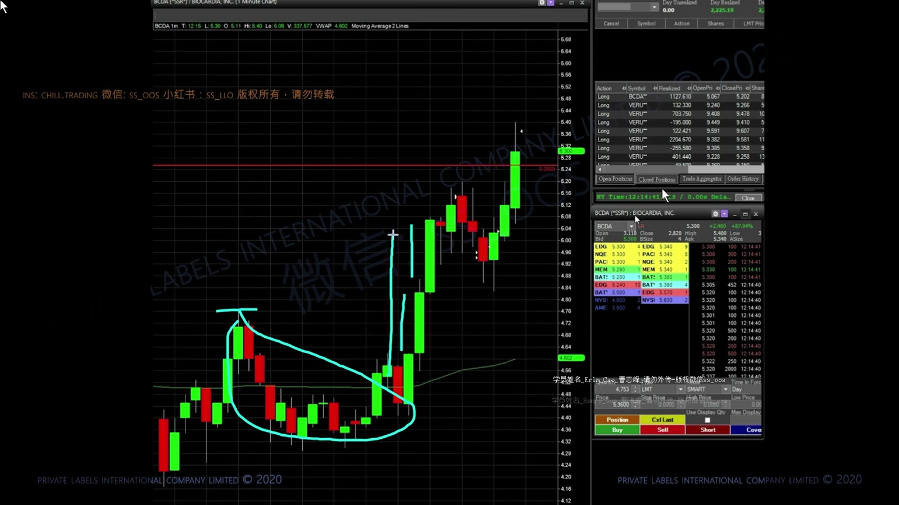

# 基础 08：盘中结构与多周期读图

> 对应视频：`8-class8.mp4`
> 视频时长：40:40
> 本课目标：在 1 分钟图上动态更新支撑阻力，把多个小结构放回 5 分钟和日线背景，而不是背固定图形。

## 1. 这节课真正训练什么

课程把这一部分称为 advanced chart reading，但核心动作很基础：

`找最近支撑 → 找最近阻力 → 等价格确认 → 更新地图`

**图怎么看：**

- 大绿 K 前的局部高点是阻力候选，整理低点是支撑候选。
- 价格突破后，旧阻力是否转为支撑要等回踩验证。
- 这类结构比 bull flag 更自由，因此更需要明确规则，避免每张图都能事后解释。

## 2. 同一段走势可以有多种画法

**图怎么看：**

- 水平线标出每一阶段可见的局部高低点，不是一次性画好后永不改变。
- 较小阻力被突破后，目标可以转向更高一级阻力。
- 线的作用是限定决策，不是让图表看起来解释完整。

为了减少主观性，画线时记录：

- 该位置至少被测试几次；
- 当时是否有明显成交量；
- 是已收盘 K 线还是仍在变化；
- 与 VWAP、整数位或大周期区域是否接近；
- 突破后怎样才算“站稳”。

## 3. 价格阶梯：Support → Resistance → New Support

**图怎么看：**

- 黄色圈展示突破前后的关键转折，水平线表示每一级价格障碍。
- 强趋势不是直线上涨，而是推进、回踩、重新找到支撑。
- 若新低跌破前一有效支撑，阶梯结构被破坏，应降低多头预期。

## 4. 大突破后先等整理

**图怎么看：**

- 大绿 K 后立即追入，stop 往往很远，risk/reward 变差。
- 等价格形成新支撑和新阻力，能够把失效位缩小到当前结构。
- 如果回落直接穿过前支撑，说明不是健康整理，而可能是失败突破。

## 5. 多层阻力与获利位置

**图怎么看：**

- 近端阻力用于第一目标，更高阻力用于判断是否保留剩余仓位。
- 买在支撑附近与等阻力突破后买，胜率、入场确认和 stop 距离不同。
- 不应只因价格最后涨到更高位置，就否定较早按计划止盈。

## 6. 把 1 分钟结构放回大图

**图怎么看：**

- 远景能看出早盘高点、午间低量整理和后续再启动。
- 小周期上的漂亮突破若正撞到大周期高点，实际空间可能很小。
- 同一水平位在早盘高量与午间低量时段的意义不同。

多周期分工：

| 周期 | 主要问题 |
|---|---|
| 日线 | 上方历史套牢/突破空间在哪里？ |
| 5 分钟 | 当天是上升、下降还是宽幅震荡？ |
| 1 分钟 | 触发与最近失效位在哪里？ |
| Level 2/T&S | 当前是否具备可接受的执行条件？ |

## 7. HOD 附近的决定

**图怎么看：**

- 价格沿更高低点接近红色水平阻力，说明多头仍在推进。
- 越靠近 HOD 买入，确认更强，但失败时回撤也可能更快。
- 应提前决定：做突破、等突破回踩，还是因空间不足放弃。

## 8. 从失败结构中学习

**图怎么看：**

- 左侧冲高失败后出现大幅回落，旧多头结构已经结束。
- 底部横盘形成新的交易区间，后续突破属于新 setup，不能沿用原 stop 和原叙事。
- 图中最后上涨很醒目，但实时应先经历“是否能守住底部”的不确定阶段。

## 9. 一套可复现的读图流程

1. 隐藏后续 K 线，防止看到结果；
2. 在日线标出最重要的两三层区域；
3. 在 5 分钟图判断当前趋势；
4. 在 1 分钟图只画最近有效支撑和阻力；
5. 写出两种路径：突破怎样处理，跌破怎样处理；
6. 每形成一个新高/新低就检查地图是否需要更新；
7. 保存入场前、入场后和退出后三张图，比较决策而非只看盈亏。

“会看图”不是能给已经发生的走势命名，而是在只看到左侧数据时，仍能写出有限、清楚、可证伪的下一步计划。
