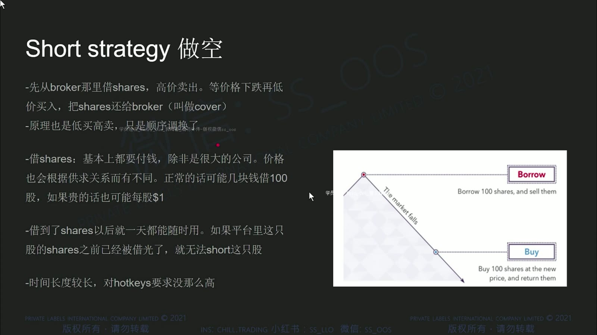
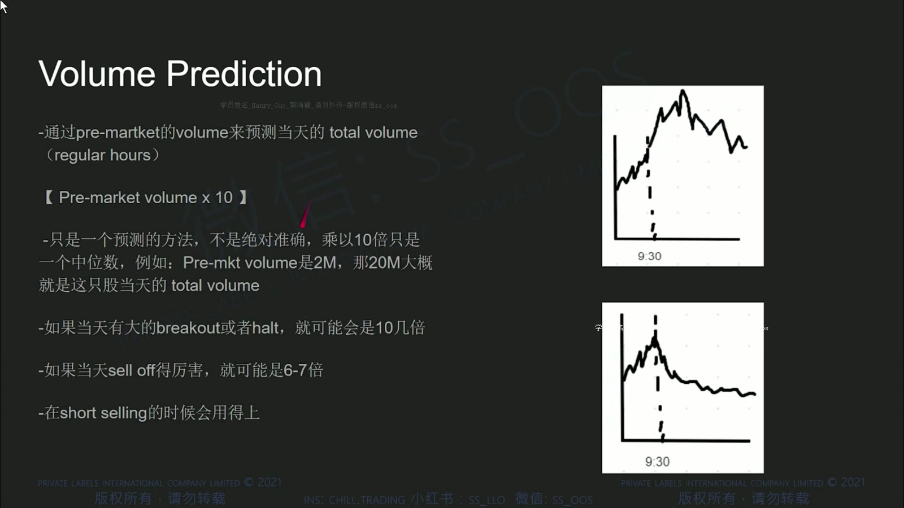
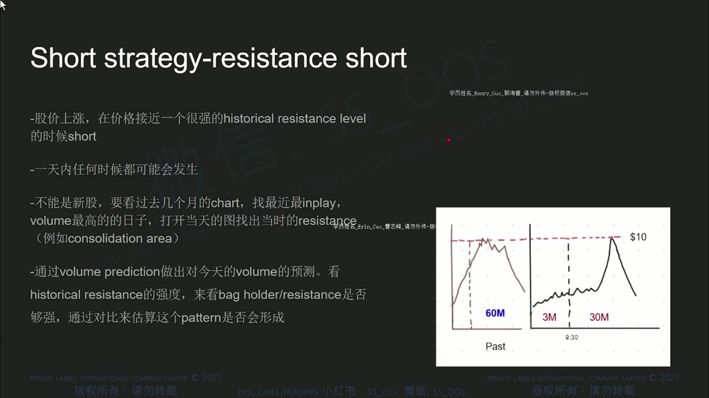
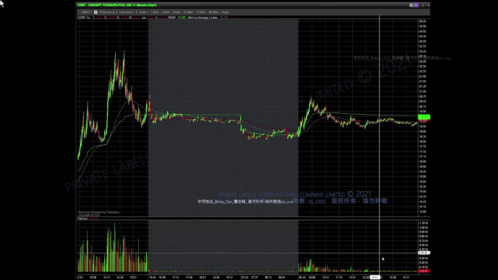
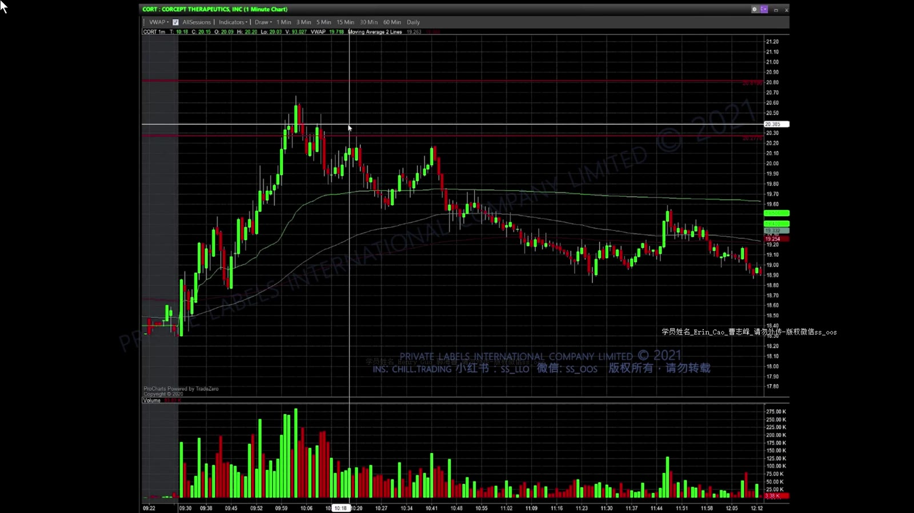
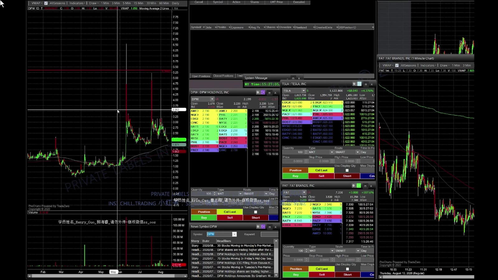
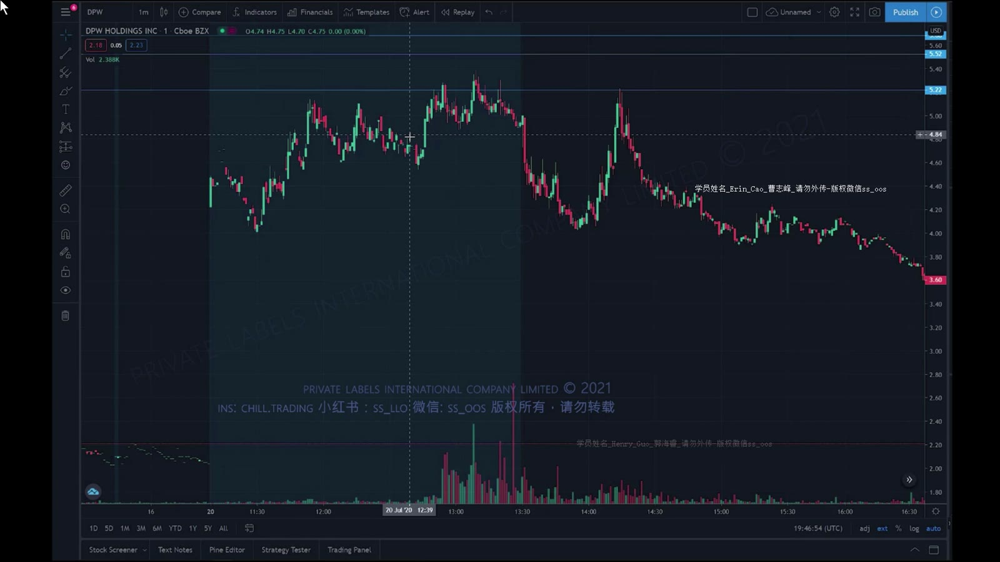

# 基础 09：做空、历史阻力与 Gap-Up Short

> 对应视频：`9-class9.mp4`
> 视频时长：26:51
> 本课目标：理解借股做空的完整风险，并把课程的 volume prediction 当成待验证启发式，而不是公式。

## 1. 做空的交易链

做空通常是从券商借入股票、先卖出，再买回归还。利润近似为：

`(卖出价 - 回补价) × 股数 - 借股与交易成本`

**图怎么看：**

- Borrow/Locate 在开仓前解决可交割性，不代表库存永远不会变化。
- 价格上涨时亏损扩大，理论上没有上限；停牌恢复上跳会让 stop 无法按原价执行。
- 即使最终没开仓，Locate 也可能已经产生成本，能否退回取决于券商规则。

额外风险包括：

- 借股费突然变化或库存召回；
- 强制回补；
- 股息及公司行动义务；
- squeeze、停牌与跳空；
- borrow 数据和 short-interest 数据滞后。

## 2. “盘前量 × 10”不是预测定律

**图怎么看：**

- 课程用 `盘前成交量 × 10` 粗估常规时段总量。
- 视频自己也展示持续突破、停牌或消息变化时倍数会完全失效。
- 不同盘前时长、开盘前剩余时间、股票类型和市场环境不能共用一个固定倍数。

更合理的用法是把它当基线，并记录预测区间：

- 截止同一盘前时间；
- 与历史相似事件比较；
- 根据开盘首 5/15/30 分钟重新更新；
- 给出高低情景，而不是单一数字。

**图怎么看：**

- 图中上涨和成交量持续扩张，说明新的关注者不断进入。
- 一旦出现连续 HOD、新闻或 halt，早先的盘前基线就应作废。
- 错误做法是因为“已经超过预测量”就认定价格一定反转。

## 3. Historical Resistance Short

课程先在日线寻找过去高成交量日的顶部或横盘区域，再观察今天价格是否以较弱量能回到该区域。

**图怎么看：**

- 过去的高成交区可能包含等待解套的持仓者，价格返回时供给可能增加。
- 这只是可能机制，无法从图表知道所有历史持仓是否仍在。
- 真正触发应来自当日冲高失败、低高点或支撑跌破，而不是提前盲目做空。

课程比较“历史阻力日成交量”与“今天估算总量”。这个比率可以作为复盘特征，但没有证据表明某个固定比例能普遍预测反转。Float 越大/小也不会机械决定阻力强弱。

## 4. 入场与 stop

**图怎么看：**

- 价格先触及预先画出的阻力，再形成较低高点和下行结构。
- 在已经大跌后追空，stop 距离远且容易遇到反弹；课程倾向等反弹失败。
- Stop 可放在使阻力判断失效的高点上方，但股数要包含上跳和滑点压力测试。

常用执行顺序：

1. 盘前完成 locate，不等于必须交易；
2. 标出历史阻力区与盘前高点；
3. 等价格到位后观察失败；
4. 触发入场，stop 在结构失效处；
5. 在 VWAP、EMA、前低或 whole dollar 分批 cover；
6. 若价格突破并站稳阻力，按计划退出。

## 5. Gap-Up Resistance Short

**图怎么看：**

- Gap 百分比大意味着潜在回落空间，也意味着动能和 squeeze 风险更大。
- 视频使用 50% 等阈值，这是课程筛选条件，不是法规或普遍最优参数。
- 新闻越强、成交量越超预期，历史阻力越可能直接被突破。

**图怎么看：**

- 事后图呈现清晰下降趋势，但开盘时仍可能先上冲并触发 stop。
- 盘前高点可作为风险参考，不能保证在停牌或跳空时成交。
- 分批 cover 能锁定部分利润，同时剩余仓位仍需明确 trailing invalidation。

## 6. 为什么“阻力到了就空”危险

- 强催化会吸引远超历史的成交量；
- 可借库存紧张会增加拥挤和回补压力；
- 过去阻力可能因基本面改变而失效；
- 公开 float、short interest 与 borrow rate 可能滞后；
- 低价低流通盘可连续 halt up；
- 做空者的最大盈利接近股价跌到零，最大亏损却不封顶。

## 7. 复盘字段

每笔 resistance short 至少记录：

- 历史阻力的事前截图和选择理由；
- 当日实际量相对盘前估算的误差；
- 催化剂、float、borrow/locate 成本；
- 入场时是否已有失败信号；
- 最大有利/不利波动；
- stop 的计划价与实际成交价；
- 是否因盈利结果美化了原本不合格的入场。

这套方法的价值是建立“等价格回到预定区域再验证”的纪律；最需要丢弃的是固定倍数、固定量比和“历史套牢盘一定会卖”的确定性。
