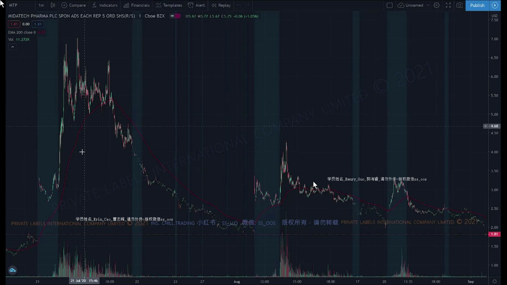
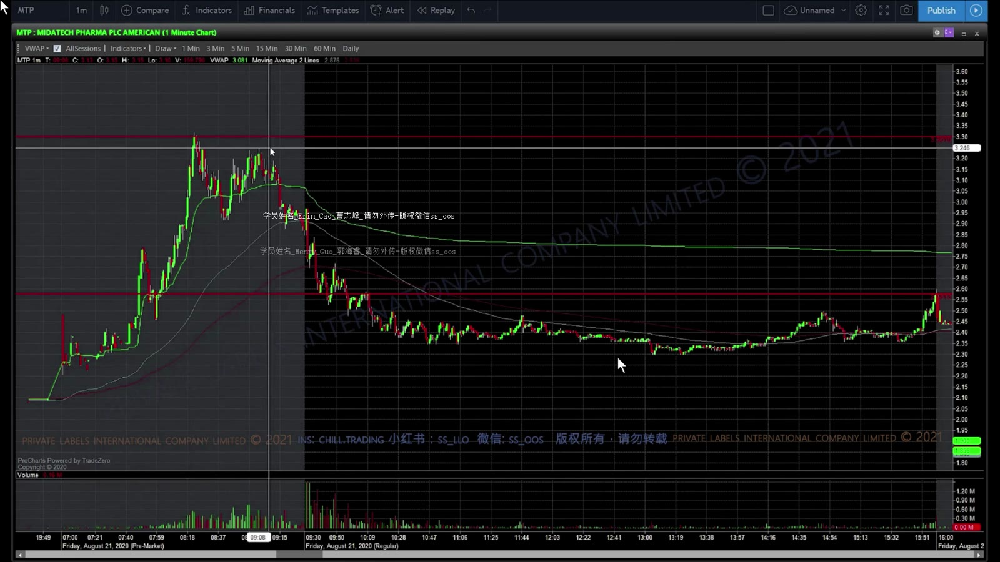
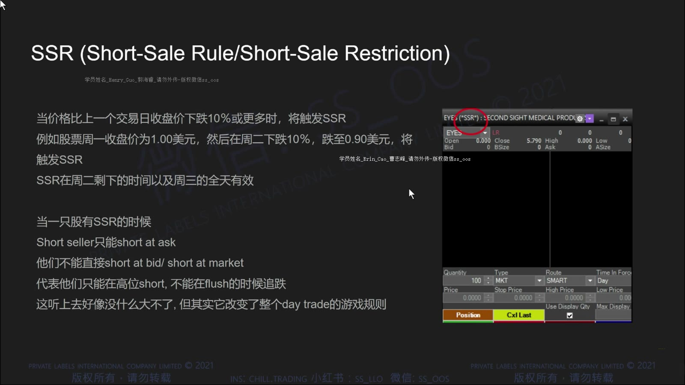
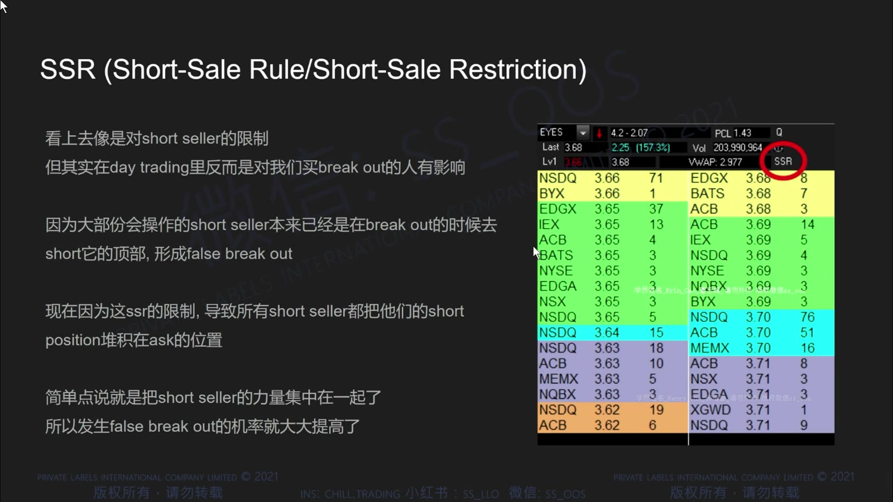
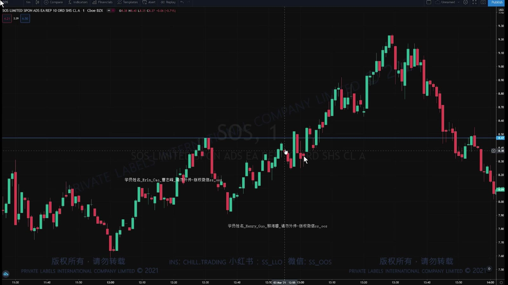
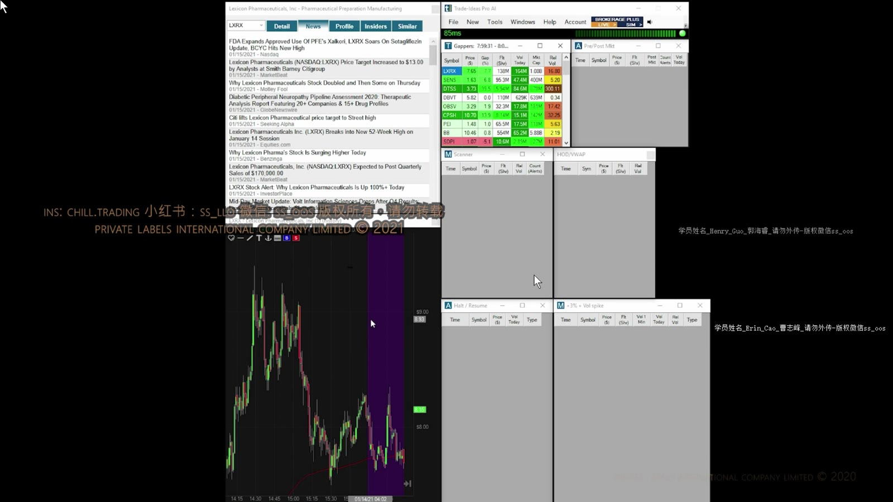
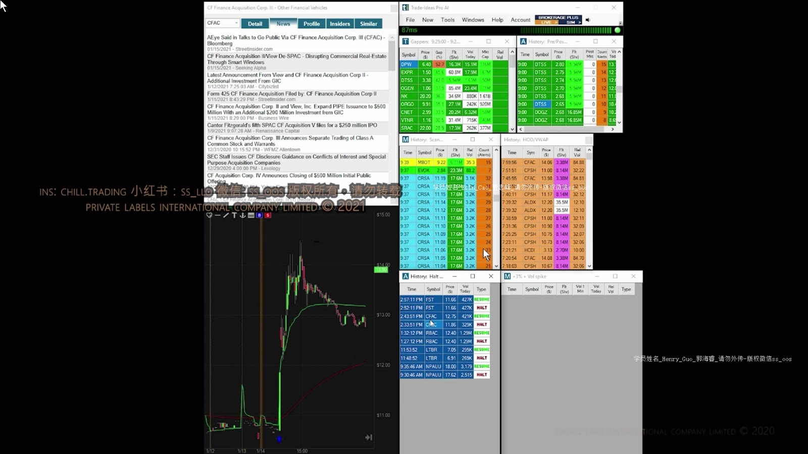
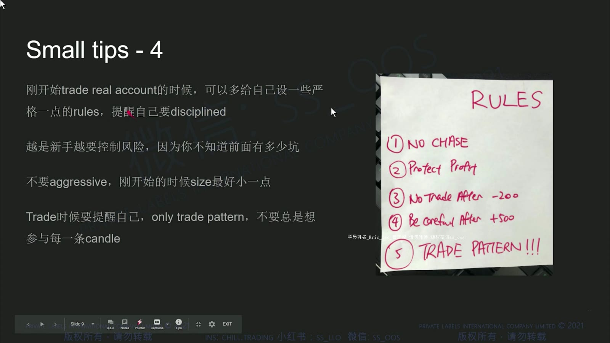

# 基础 10：SSR、交易工具与个人规则

> 对应视频：`10-class10.mp4`
> 视频时长：34:55
> 本课目标：正确理解 Short Sale Restriction，整理交易屏幕，并把纪律写成可以执行和复盘的规则。

## 1. 前课案例的延伸

**图怎么看：**

- 图中最终跌幅很大，但不能据此假设最高点容易做空。
- 从顶部到下跌确认之间可能有多次剧烈反弹，空头 stop 必须按局部结构设置。
- 复盘应标出当时可见的入场触发，而不是只展示完整右侧结果。

## 2. SSR 的准确含义

美国 Regulation SHO Rule 201 的价格测试在上市市场确认股票于常规时段较前一常规时段收盘价下跌至少 10% 时触发。

**图怎么看：**

- 10% 是由上市市场依据合并成交数据判定，不是交易者看图自行宣布。
- 触发后不是“禁止做空”，而是限制普通短卖单在当前 National Best Bid 或更低价格显示/执行。
- 课程界面的 SSR 标识只说明平台状态，仍要以券商和上市市场信息为准。

限制通常持续：

- 触发当日剩余时间；
- 下一个交易日；
- 若下一日再次下跌至少 10%，会重新触发并延长。

**图怎么看：**

- 简化理解是普通 short order 要在当前最佳买价之上等待，而不能主动打到 bid。
- 因此下跌过程中更难立即建立空仓，反弹到 ask 附近时可能更容易成交。
- 这不等于 SSR 一定制造 squeeze；价格仍可继续下跌。

当前官方细节与例外见 [当前规则说明](../current-rules-and-platform-details.md)。

## 3. SSR 如何改变执行

**图怎么看：**

- 快速下跌时普通短卖单可能排队而未成交，实际入场会晚于设想。
- 价格反弹时成交并不代表阻力已经确认，反弹也可能继续扩大。
- 回测若直接使用 K 线触价假设成交，会高估 SSR 环境下的执行质量。

## 4. Short Squeeze 不是 SSR 的必然结果

**图怎么看：**

- 强上涨可能来自多种买盘来源，SSR 只改变部分短卖订单的价格测试。
- 价格上涨后仍可出现持续下跌，不能用“SSR 在”判断方向。
- 观察借股紧张、成交量、回补压力和关键位失败，比只看一个状态标签有效。

## 5. 交易屏幕的功能分区

**图怎么看：**

- 新闻窗口回答催化剂，扫描器发现候选，图表提供结构，Level 2/T&S 展示执行环境。
- 窗口越多不代表信息越好；每个窗口应有明确问题，否则只增加注意力切换。
- 最关键的账户、symbol、仓位、未成交订单和风险数据应放在不易看错的位置。

推荐最小布局：

1. 一张日线/5 分钟背景图；
2. 一张 1 分钟执行图；
3. Level 2 + Time & Sales；
4. 当前仓位与未成交订单；
5. 新闻与基础数据；
6. 交易日志入口。

## 6. 扫描与平台参数会变化

**图怎么看：**

- 扫描器列出的 gap、价格、float 和 volume 是候选排序，不是策略结论。
- 不同数据源的 float、新闻速度和盘前量可能不一致。
- 软件界面、行情套餐、佣金和路由在录制后均可能变化，应重新配置而非复制截图。

## 7. 从模拟盘转到实盘

模拟盘应先证明流程稳定，而不是只看累计盈利：

- 能否连续按同一 setup 定义交易；
- 是否每笔先算风险和股数；
- 是否正确处理部分成交、撤单和 stop；
- 是否遵守最大日亏损；
- 日志是否包含计划价与实际价。

转实盘后，仓位应小到足以观察真实滑点和心理反应。模拟盘连续盈利不证明策略已排除抽样偏差，也不代表真实成交同样好。

## 8. 写下个人规则

**图怎么看：**

- 规则包含不追价、等待形态、达到日亏损后停止等行为约束。
- 好规则必须可观察：例如“亏损达到 2R 后当天停止”，比“保持纪律”可执行。
- 每月根据日志评估规则，不因单笔结果临时改动。

可直接建立的规则框架：

| 类别 | 示例 |
|---|---|
| Setup | 只交易事前定义的 2–3 类结构 |
| Risk | 每笔最多 0.25R/0.5R；单日最多 2R |
| Execution | 禁止在 halt 中排无价格保护的市价单 |
| Behavior | 连续两笔流程错误后停止 |
| Review | 收盘后保存入场前截图并写实际滑点 |

## 9. 本课最重要的纠偏

- SSR 是价格测试限制，不是做空禁令；
- SSR 不保证上涨，也不保证 squeeze；
- 平台上的旧标识和订单行为必须用当前券商环境验证；
- 工具只负责提供数据，不能替代 setup 和风险边界；
- 个人规则要用数字和条件写清，才能在压力下执行。
