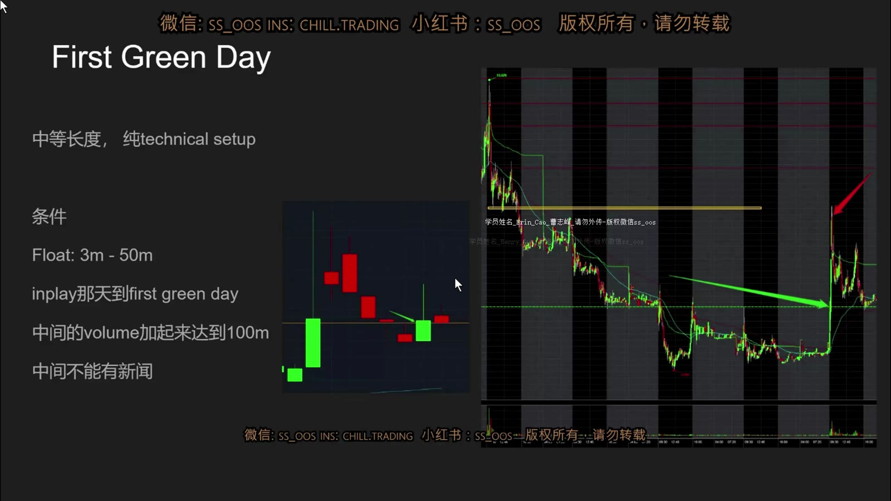
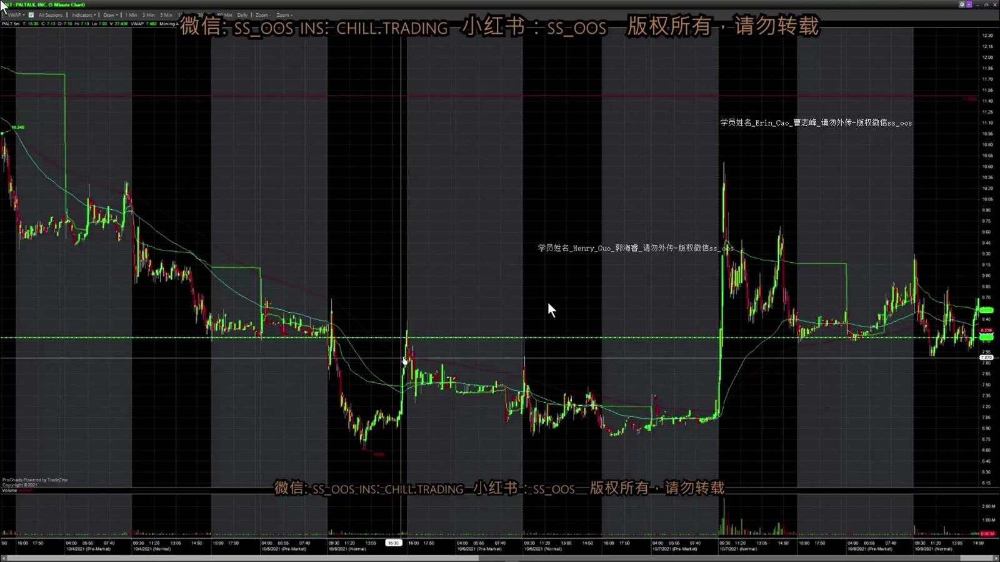
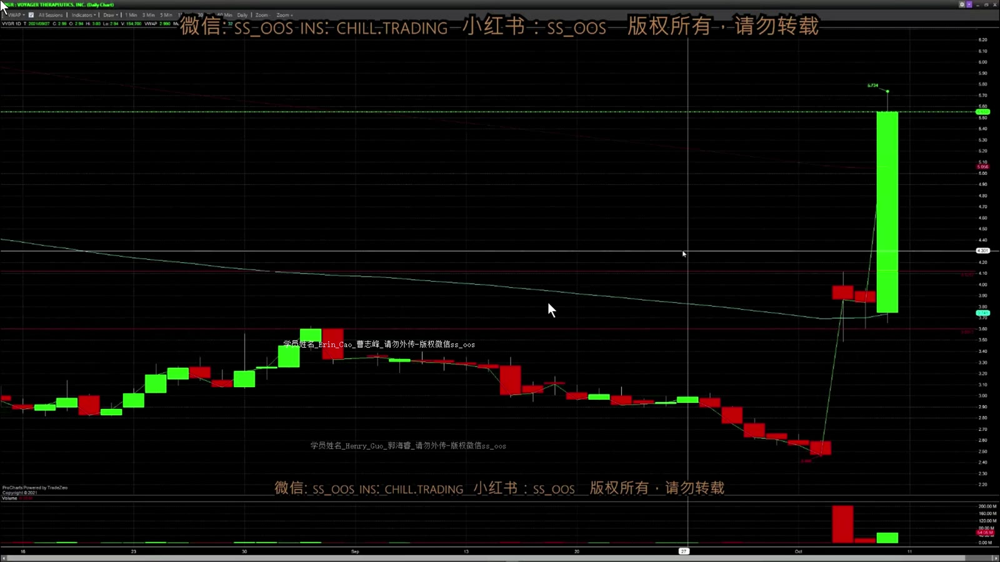
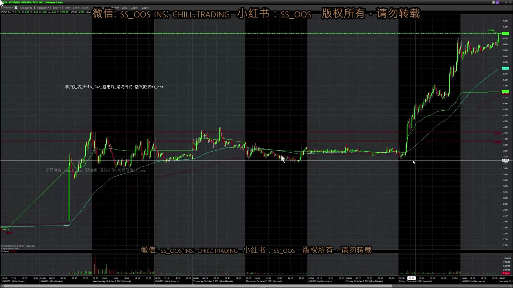
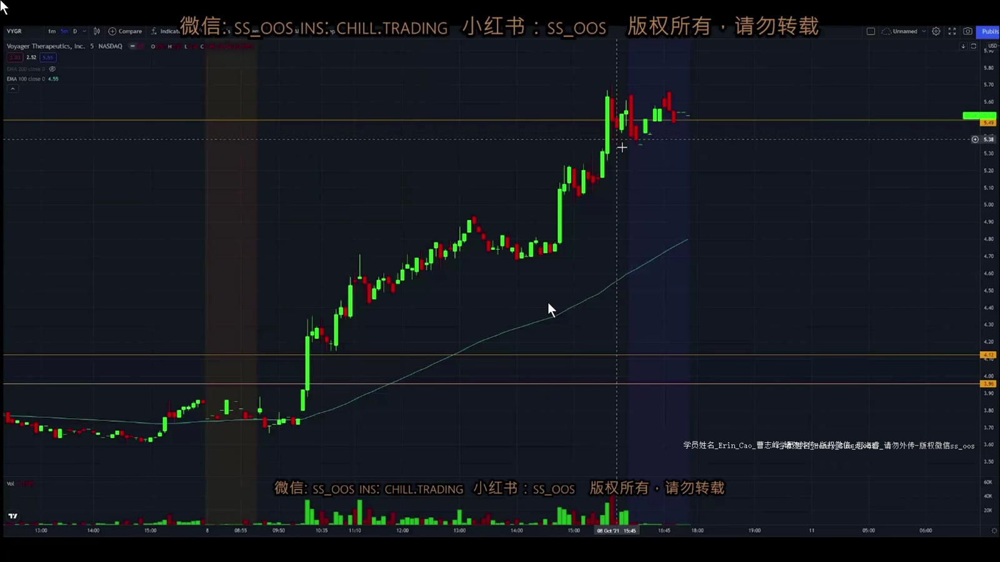

# 基础 11：First Green Day

> 对应视频：`11-class11.mp4`
> 视频时长：21:53
> 本课目标：整理讲师仍在研究中的 First Green Day 想法，并明确哪些条件只是早期启发式，尚不能视为已验证策略。

## 1. Setup 的定义

一只股票曾经是高成交量的 in-play 股票，随后连续数日回落或横盘。课程寻找它第一次突破前一日高点、日线重新形成绿色 K 线的那一天。

**图怎么看：**

- 左下简图表示首次大涨后连续红日，之后出现第一根向上的日线。
- 右侧多日图中，黄色水平线是上方阻力，绿色斜线帮助观察下降趋势。
- 真正触发是突破前一交易日高点，不是只因当天 K 线暂时变绿；未收盘日线仍会变化。

讲师在视频开头明确说，这个 pattern 当时仍在研究，条件“只是暂时的，以后可能修改”。因此本课应该作为**研究假设**阅读。

## 2. 课程的四个候选条件

1. Float 约 300 万–5,000 万股；
2. 之前有一次明显 in-play 的高量日；
3. 高量日至 First Green Day 之间累计成交量约超过 1 亿股；
4. 中间没有新消息导致提前 gap up。

这些数字来自少量个人案例，没有被视频证明具有统计显著性。尤其“累计 1 亿股”没有按 float 归一化：对 300 万股与 5,000 万股 float 的含义完全不同。研究时更合理的特征是累计换手率：

`累计换手率 ≈ 区间累计成交量 ÷ 可交易流通盘`

即使如此，也不能由换手率直接推断有多少空头仍未回补。

## 3. 课程提出的行为解释

视频推测：首次高量日后，买盘减少、价格多日回落，空头逐步建立仓位；当股票不再创新低并突破前一日高点，一部分空头止损回补，形成连锁上涨。

这个解释可用于提出问题，但图表本身不能证明：

- 横盘里究竟有多少净空头；
- 当天买盘中多少来自回补；
- 历史 short interest 是否仍然有效；
- 新增多头、做市活动与期权对冲各贡献多少。

可观察事实应写成：“价格停止创新低、形成更高低点、突破前日高点且量能增加。”

## 4. PALT 案例

**图怎么看：**

- 首次高量日之后，价格总体下降，后几日量能明显缩小。
- 临近 setup 时，低点不再持续下移，并接近前一日高点。
- 上方黄色阻力是潜在退出区；入场前必须确认到它仍有足够利润空间。

课程对 PALT 的计划是：

1. 在接近并突破前一日 high 时寻找入场；
2. 若突破后短暂整理，可等第一次 pullback；
3. 下一个历史 consolidation 区约为目标；
4. 也可以在 whole dollar 提前分批止盈。

**图怎么看：**

- 大绿 K 说明触发后出现真实成交扩张，但不能拿它反证任何提前买入都合理。
- 若扫描器在大绿 K 后才报警，追入时离失效位更远，risk/reward 已经变化。
- 课程因此强调要从过去 watchlist 主动跟踪，而不是只等动量扫描器。

## 5. VYGR 案例

**图怎么看：**

- 前两日高点接近，低点逐步抬高，为突破提供了可见的局部结构。
- 盘前曾短暂越过高点但量能低，课程仍以常规时段的高点和成交为主要参考。
- 第一根突破后等待 pullback，可把 stop 放得更接近结构失效位。

**图怎么看：**

- 价格缓慢上涨而不是瞬间 squeeze，说明 float 与流动性会影响节奏。
- Daily EMA200 和过去 consolidation 都是上方供给候选。
- 最终收在目标附近不证明能够事前持有到收盘；退出应服从计划和实时量价。

## 6. 低量“失败”案例告诉了什么

视频最后展示一个累计量未达到课程阈值的案例。价格确有反弹，但每根 5 分钟成交量很小、spread 较宽，难以用较大仓位执行。

这里应把“策略失败”和“不可交易”分开：

- 方向可能上涨；
- 但流动性不足会使入场、加仓和退出质量很差；
- 回测只看收盘价会漏掉真实执行成本；
- 没有成交容量的理论利润不是可实现利润。

## 7. 怎样把想法变成可验证研究

不要直接采用视频阈值。先建立样本定义：

1. 明确首次 in-play 日的最小涨幅、成交量与价格范围；
2. 明确 First Green Day 是盘中突破还是收盘确认；
3. 将累计成交量按 float 归一化；
4. 记录有无新公告、融资、反向拆股与退市风险；
5. 使用包含 spread、滑点和无成交的回测；
6. 保留所有失败、未触发和不可交易样本；
7. 在样本外时间段验证参数，不根据少数成功图反复调阈值。

## 8. 实盘观察清单

- 前一日高点与当前价距离；
- 最近几日是否停止创新低；
- 今日成交量是否相对前几日扩张；
- 到下一层日线阻力还有多少空间；
- Spread 是否允许按计划股数进出；
- 是否有新 SEC 文件或公司公告改变原先技术 setup；
- 若突破后立刻跌回，失效价和最大亏损是多少。

本课最有价值的是“持续跟踪过去的 in-play 股票，并在日线状态首次改善时观察”。最需要警惕的是用三个成功/失败案例把临时参数当成成熟优势。
