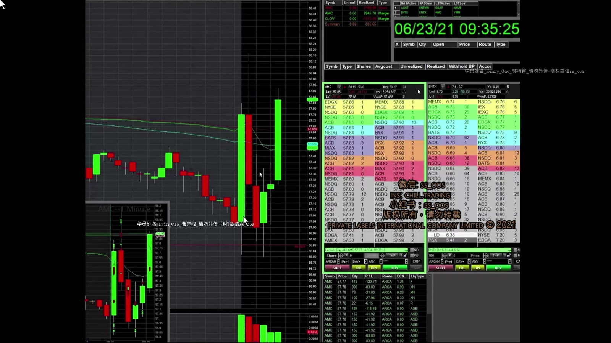
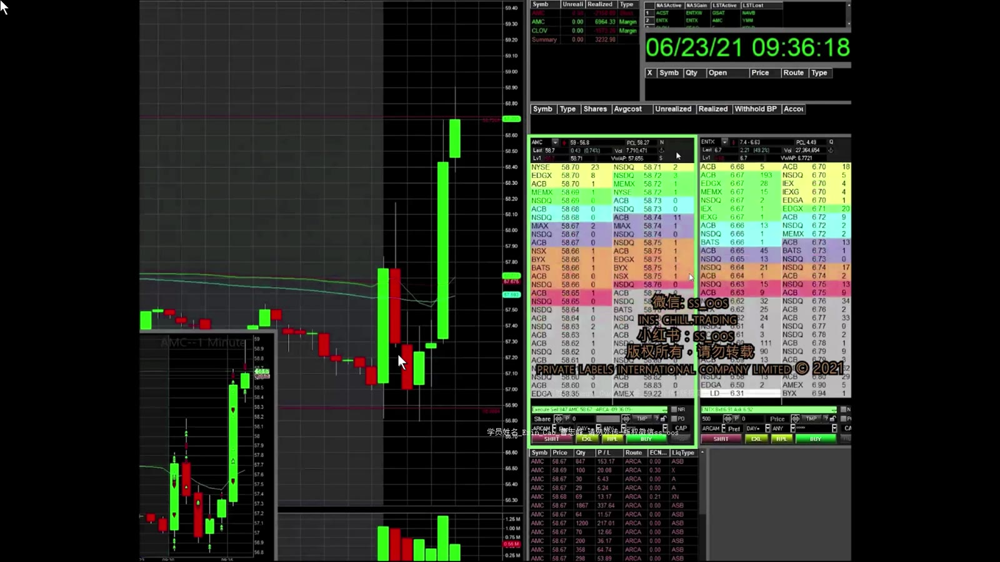
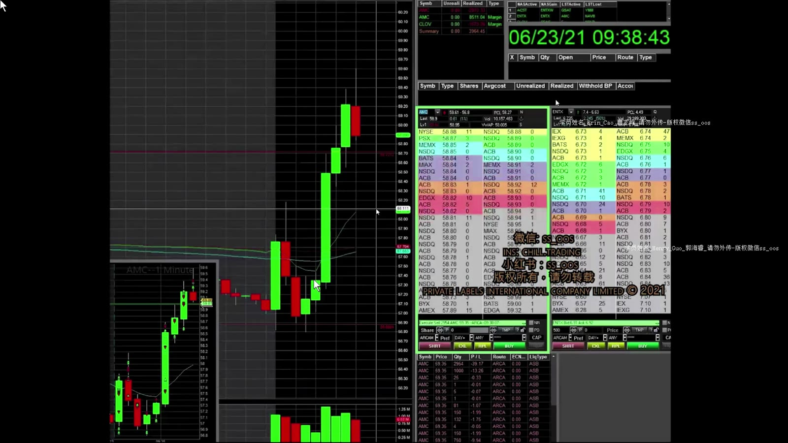
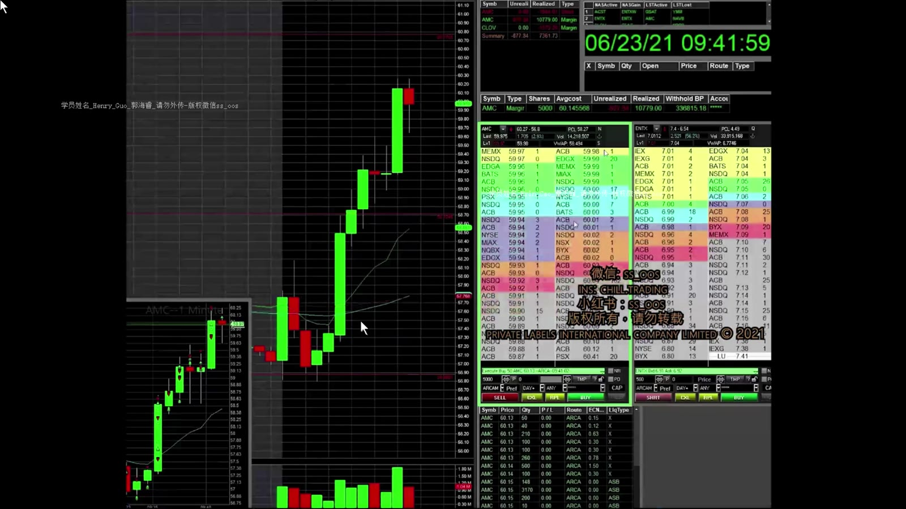
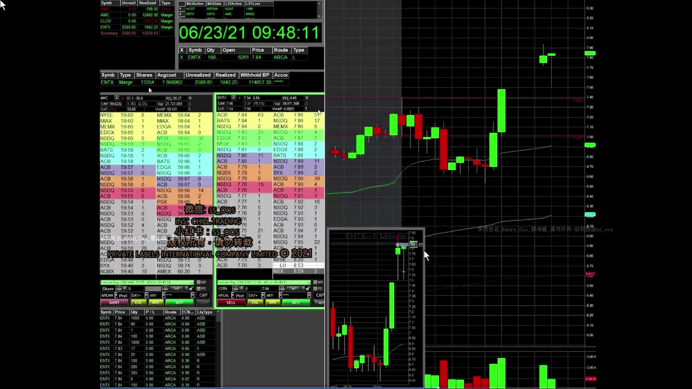

# 基础 12：AMC 与 ENTX 实盘复盘

> 对应视频：`12-AMC_ENTX.mp4`
> 视频时长：15:50
> 本课目标：按真实时间线拆解多空切换、部分成交、追价和停牌恢复交易，不用最终盈亏掩盖执行问题。

## 1. 案例背景

视频交易日主要关注 AMC、ENTX 和 CLOV。本段重点是 AMC 的高价高成交波动，以及 ENTX 从 halt 恢复后的 dip buy。

讲师解释 AMC 仓位时说，股价更高不必然意味着股数更小，应按波动调整 size。这个方向还不完整：仓位应按**失效距离、预留滑点和最大美元风险**计算，不能只看平均波动。AMC 当时一分钟可移动约 1 美元，大仓位会把数秒噪音放大为巨大盈亏。

## 2. AMC：开盘先空，错误后立即反手观察

**图怎么看：**

- 价格开盘先上冲后回落，讲师尝试在 VWAP 附近做空，期待 false breakout。
- 价格没有按预期下跌，而是向上 squeeze；视频明确把这笔空单列为较大亏损并及时 stop。
- 正确学习点不是“马上反手”，而是原假设被突破后必须退出，再独立评估新的多头 setup。

开盘最初几分钟的特点：

- K 线 range 大；
- Level 2 更新快；
- 部分成交和滑点明显；
- Long/Short 叙事可以在数秒内失效。

## 3. AMC：突破、回踩和过早止盈

**图怎么看：**

- 强上涨后价格在高位回调，讲师等待旧高点附近能否成为支撑。
- Dip buy 的优势是失效位置较近；危险是上方已经延伸，随时可能出现大幅获利回吐。
- 视频中多次出现只部分 fill，说明屏幕股数不等于计划股数，后续加仓必须按实际仓位重算。

讲师也承认一笔过早卖出：刚出现上推便止盈，随后半秒继续 squeeze。这不必自动判为错误。若退出符合事前计划，就只需记录少赚；只有因为恐惧、无规则退出，才是流程问题。

## 4. AMC：冲动做空与失败的小波段

**图怎么看：**

- 连续三根大绿 K 后，讲师仅凭“应该有人止盈”立即做空，随后因动能仍强而小亏 cover。
- 大涨后的确更接近回撤，但“涨得多”不是反转触发。
- 更好的触发是冲高失败、较低高点、关键支撑跌破，且 stop 位清楚。

视频还尝试在一根 K 线内部做小幅 long/short。高频切换增加：

- 点差与手续费；
- 未完全成交；
- 情绪化补偿前一笔亏损；
- 把微小噪音误认为 setup。

如果无法在入场前一句话说清触发与失效，就应跳过。

## 5. AMC：60 美元附近的突破计划

**图怎么看：**

- 价格回踩 60 附近后在其上方收得较高，讲师期待下一根 K 线 breakout。
- 计划买 5,000 股但只成交约 2,900 股，最终持仓约 7,900 股；这是流动性和队列位置的真实影响。
- 整数位被站稳只是候选确认，上方历史阻力约 60.7–61 仍会限制空间。

这段应该记录两套风险：

1. 初始 dip buy 到 60 下方失效的风险；
2. 加仓后全仓平均价上升、回落时新增的总风险。

## 6. ENTX：从 Halt 恢复后 Dip Buy

ENTX 在约 8 美元附近触发向上暂停。讲师估算约 5 分钟后恢复，并计划等恢复后的回调再买。

**图怎么看：**

- 恢复后价格先保持高位，讲师买入约 10,000 股并在接近 8 美元前快速止盈。
- 下一次回调买约 9,600 股，反弹后部分加仓，再用 7.93 限价卖出，主动避免测试 8 美元失败。
- 这里获利不代表“halt 后 dip buy”安全；恢复价、点差和下一次停牌方向都不可预知。

随后视频也展示失败：

- 高位追入期待立刻突破，价格跌破 8，约亏 2,000 美元；
- 再次低吸后，若 K 线收低便立即退出；
- 更低位置约 7.7 重新建立交易，突破 8 后止盈。

关键不是不断重试，而是每次必须重新定义 setup，且累计亏损仍受单日上限约束。

## 7. 可复用的案例结论

### 做得较好的部分

- 空单逻辑失效时及时 cover；
- 承认高位追入和冲动做空的质量较差；
- 部分成交后取消剩余订单；
- 在明显整数阻力前用限价单锁定利润。

### 高风险部分

- 使用非常大的 size 做秒级波动；
- 连续多空切换，交易密度过高；
- 仅凭连续绿 K 就猜顶；
- 把 halt 恢复后的未知价格路径当成普通 dip；
- 盈利后继续重复入场，容易放松日内风险上限。

## 8. 复盘模板

对每一笔单独记录：

| 字段 | 内容 |
|---|---|
| Symbol / 时间 | AMC 或 ENTX，精确到秒 |
| 方向 | Long / Short |
| Setup | VWAP false breakout、HOD breakout、dip after halt 等 |
| 计划/实际股数 | 包含 partial fill |
| 失效 | 哪个价格行为说明判断错 |
| 计划/实际退出 | 记录滑点和未成交 |
| 流程评分 | 是否按规则，不看最后赚亏 |

一段视频里出现十多次点击，不应合并成“一笔成功交易”。只有逐笔拆开，才能知道优势来自 setup，还是来自高波动下的偶然净结果。
