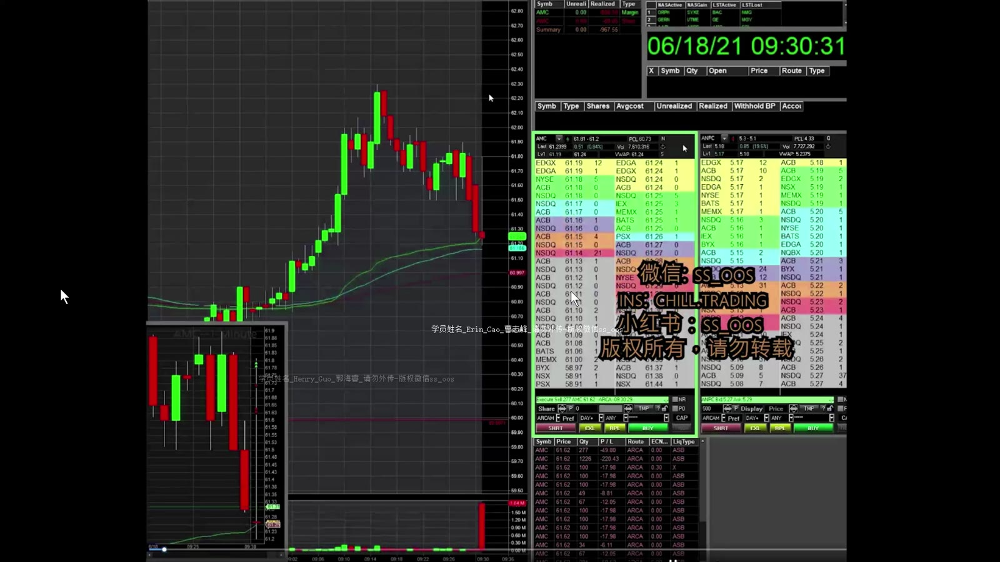
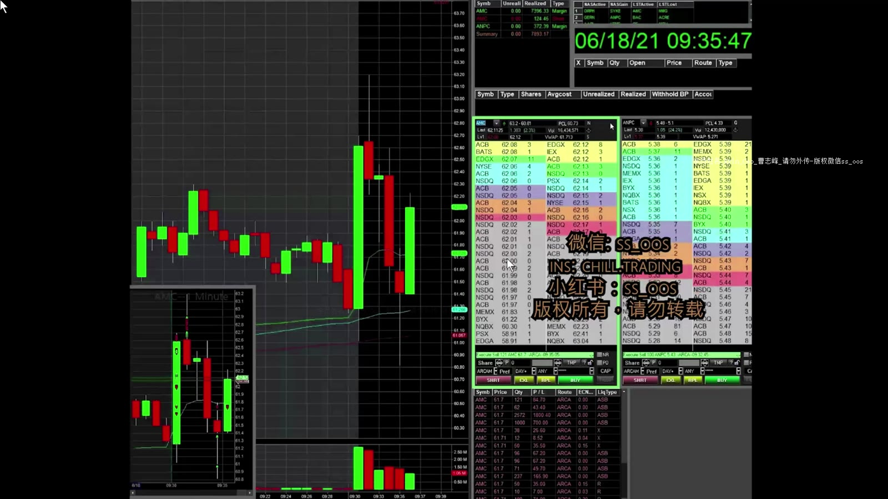
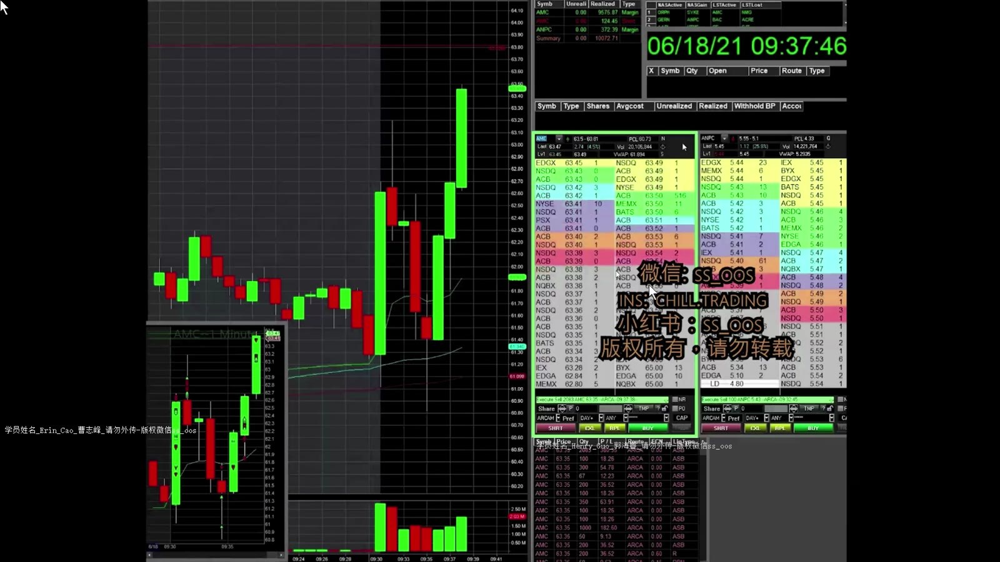
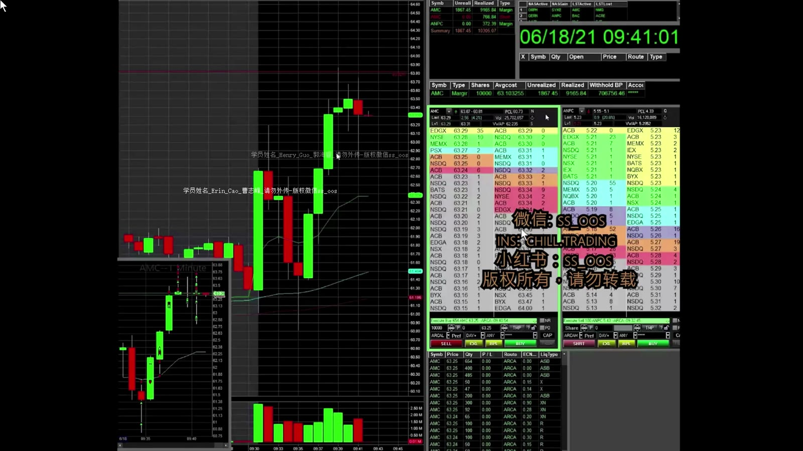
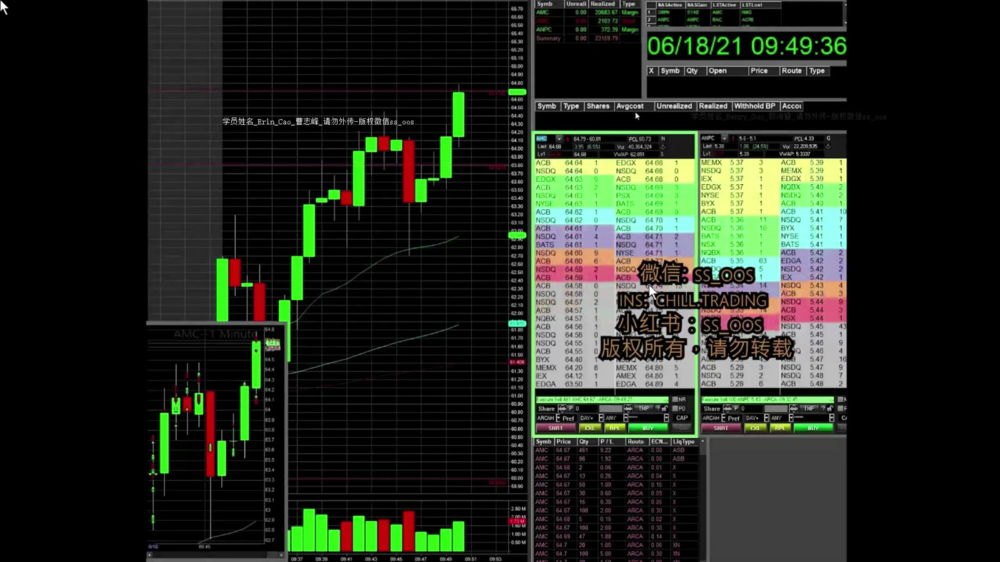
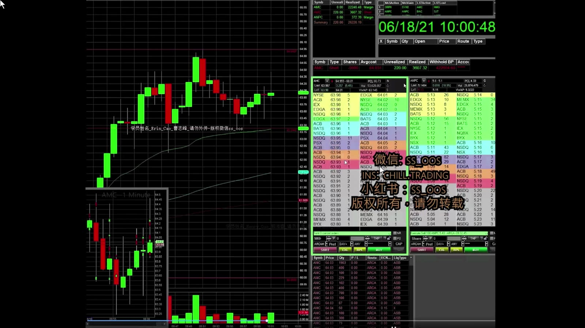

# 基础 13：AMC 开盘实盘复盘

> 对应视频：`13-open_AMC_20k.mp4`
> 视频时长：17:37
> 本课目标：逐分钟观察开盘波动、Red-to-Green、HOD 突破与趋势反转，重点检查 20,000 股级别仓位怎样放大执行错误。

## 1. 09:30–09:31：第一分钟的速度

**图怎么看：**

- 开盘成交集中，K 线在数秒内大幅扩张，Level 2 和实际成交可能快速脱节。
- 讲师先 short，发现价格不下跌便 cover；之后尝试 long，未延续便退出。
- 这段展示的是假设快速失效，不是鼓励每次变化都反手。

如果券商开盘卡顿或自己无法稳定读取订单状态，最简单的风险控制是避开第一分钟。

## 2. 09:31–09:34：Hammer 不等于立即突破

**图怎么看：**

- 价格跌破当日低点后被拉回，形成下影线，但上方仍有大红 K 的供给。
- 讲师没有立即买 hammer breakout，因为直接重回 HOD 的距离和阻力不合理。
- 随后走势证明这是一次 false breakout；重要的是判断逻辑，而不是结果碰巧验证。

低吸位置较低时，可以用最近低点定义风险；如果必须等待很久才知道判断错，仓位就不应太大。

## 3. 09:34–09:36：冲动入场的代价

**图怎么看：**

- 价格在 VWAP/开盘参考附近反复，尚未立即突破。
- 视频记录一笔高位买入后被大单拉下，约亏 3,000 美元，并承认 entry 冲动。
- 大仓位下几角钱的不利移动就是数千美元，必须在点击前看到明确失效。

之后价格重新回到该区域，K 线接近收盘且位置较高，才形成更清楚的 Red-to-Green 条件。

## 4. 09:36–09:40：Red-to-Green 与 HOD 目标

**图怎么看：**

- 前一根 K 线先下探 VWAP 后收回，下一根迅速延续，符合“下跌失败后转强”。
- 讲师在接近当日高点时先止盈，因为盘口出现较大 ask、价格不再立即推进。
- 这次盈利来自靠近支撑的 entry 与明确目标，不是因为“red 变 green”四个字。

随后在当日高点附近重新追入，视频自己评价风险较大。目标附近的二次入场，通常上方空间更少、失效更远。

## 5. 09:40–09:44：加仓改变平均成本

**图怎么看：**

- 初始 dip entry 较低，但 average up 后全仓成本上升，K 线未立即突破便转为亏损。
- 讲师因担心继续下跌而 stop，之后又在未 flush 的情况下重新入场。
- 复盘应把这些视为不同交易，不能用后一笔盈利抵消前一笔流程错误。

加仓前必须重新计算：

`加仓后总风险 = (全仓平均价 - 共同失效价) × 总股数`

若共同失效价不变，总风险通常会显著增加。

## 6. 09:44–09:47：HOD Breakout 与止盈执行

**图怎么看：**

- 价格从较低 entry 反弹，回踩未破坏结构，之后突破 HOD。
- 讲师在突破时止盈，符合“在预定事件发生时退出”的逻辑。
- 另一次 breakout 想卖却未成交，改 hit bid 时价格已回落，展示了理论图形与实际 fill 的差距。

## 7. 65 美元附近：从上升转为下降的证据

视频后段价格接近 65 出现明显 rejection：

1. 大上影/大红 K 显示上方卖压；
2. 后续低点被跌破；
3. 反弹无法立刻收复；
4. 原本做多的结构转弱。

此时课程开始考虑 short，但正确顺序仍是先确认多头结构失效。看到一根 rejection 就重仓做空，仍可能遭遇下一次 squeeze。

## 8. 20,000 股意味着什么

若持仓 20,000 股：

| 不利移动 | 未计成本的亏损 |
|---:|---:|
| $0.05 | $1,000 |
| $0.10 | $2,000 |
| $0.25 | $5,000 |
| $0.50 | $10,000 |

截图中的大额仓位不是学习目标。对个人账户，应先决定能承受多少美元，再用 stop 距离反推股数；平台 buying power 能买多少与应该买多少是两件事。

## 9. 这段案例最值得学的内容

- 讲师会直接指出冲动、高位和卖点不佳，而不是只展示成功；
- 第一根 K 线和 stop 的实际成交尤其不稳定；
- Red-to-Green 需要“下跌失败 + 收复参考 + 上方空间”；
- Average up 会快速抬高全仓风险；
- 最终大 flush 发生前已经出现 rejection 与结构破坏，但仍没有确定性；
- 当出现大红 K 且失去 VWAP 后，应停止机械 dip buy，等待新结构。

复盘的目标不是模仿点击速度，而是减少不必要的点击，让每次下单都能对应一个可证伪的计划。
