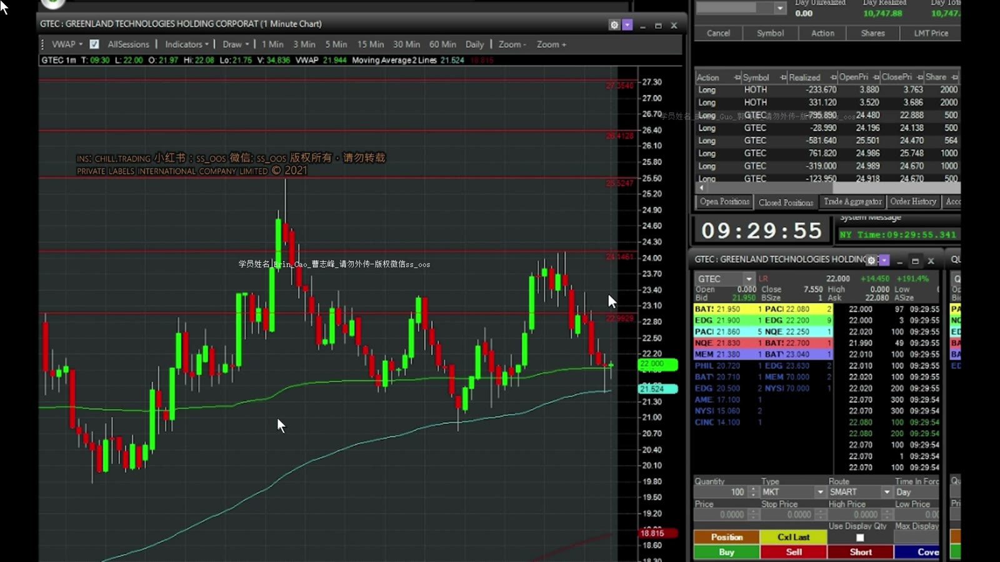
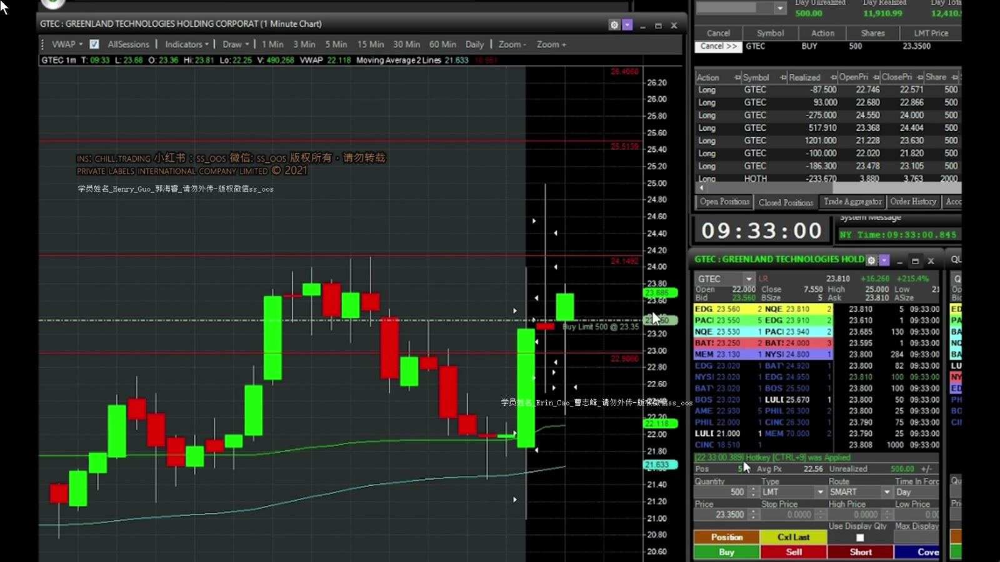
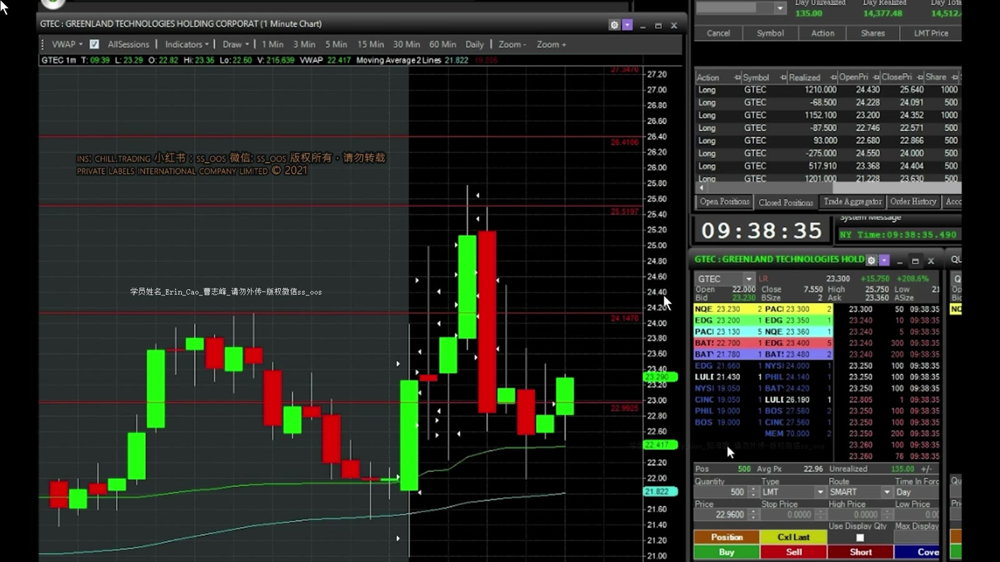
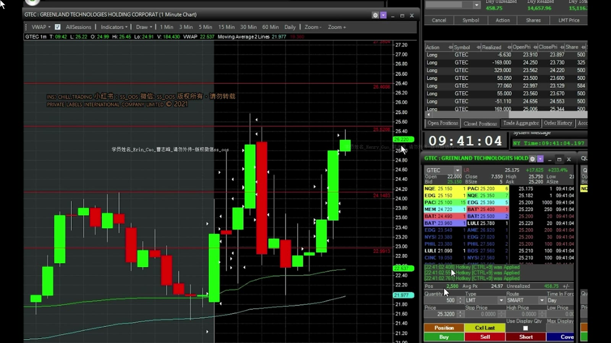
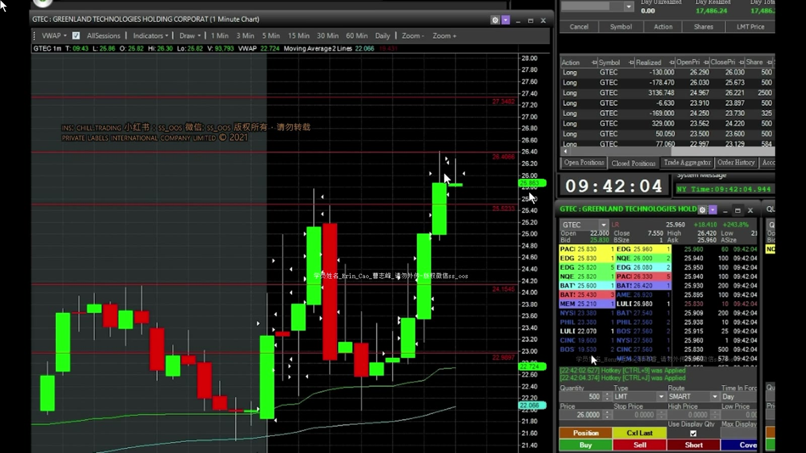

# 基础 14：GTEC 开盘实盘复盘

> 对应视频：`14-open_GTEC.mp4`
> 视频时长：14:46
> 本课目标：观察低流通盘股票开盘时快进快出的真实成本，并区分大量试单与真正清晰的 HOD setup。

## 1. 盘前利润不能成为开盘风险额度

GTEC 因消息在盘前从个位数上涨到 20 多美元。讲师盘前已获得约 1 万美元利润，开盘改用较小的 500 股仓位。

**图怎么看：**

- 图中已有多层盘前水平，说明股票在开盘前完成了大幅价格发现。
- 20 多美元的价格配合低 float，几角到数美元的瞬时波动都可能发生。
- “今天已经赚了”不应提高后续可接受亏损；更稳妥的是降低风险或锁定单日结果。

## 2. 09:30–09:33：缺乏稳定水平时的小额试单

视频开盘先高位买入，未延续便退出；随后多次 dip buy，其中一笔在盘前支撑附近买 500 股，反弹后止盈。

问题在于开盘初期：

- K 线尚未形成稳定高低点；
- Spread 与滑点快速变化；
- “没有马上反弹”与“逻辑已经失效”容易混淆；
- 多笔小亏会累计为显著成本。

讲师在一笔 dip buy 等约十多秒仍无反弹，因担心下一根 flush 而卖出。这属于时间止损：预期是立即反应，时间过去而事实未出现，交易逻辑便减弱。

## 3. 09:33–09:35：Red-to-Green / HOD 的清晰触发

**图怎么看：**

- 价格从低位反弹并重新进入前一交易区间，结构比开盘最初的随机 dip 清晰。
- 讲师先用 500 股低吸，在 breakout 前再加 500 股，突破后止盈。
- 这是视频较明确的 setup：支撑、触发、目标都有事前位置。

25 美元多次充当整数阻力。第一次测试失败后，等 pullback 再观察，比在阻力正下方追价更合理。

## 4. 09:35–09:40：VWAP 附近的重建

**图怎么看：**

- 价格跌破 VWAP 后反弹，随后形成新的局部支撑与 23.5 附近阻力。
- 讲师等待下一根 K 线突破，而不是把第一次反弹直接当成恢复。
- 若当前 K 线重新下跌，原支撑失效，应迅速退出。

这段还展示一次常见错误：看到 breakout 后没有马上推进便卖，随后价格 retest 又重新买入。重入并非一定错误，但必须确认是新信号，而不是因害怕错过而追回。

## 5. 09:40–09:42：向 Halt Band 加速

**图怎么看：**

- 价格在 25 附近收高，讲师连续按五次 500 股 hotkey，合计约 2,500 股。
- 屏幕上的 halt level 从约 25.78 上移到 26.42，反映 LULD 价格带会随参考价格更新。
- 等价格带移动并不保证上涨，也不能把价格带当成目标价；它只是当时市场机制状态。

视频最终约 26.2 卖出，称该笔约赚 3,000 美元。复盘时仍应问：

- 连按五次是否可能误发六次；
- 全仓 stop 在哪里；
- 若瞬间 halt down，2,500 股最坏亏损多少；
- 未成交订单是否仍留在市场。

## 6. 09:42 之后：Spread 扩大，退出失败

**图怎么看：**

- 大幅冲高后价格进入剧烈反复，盘口深度变薄。
- 视频两次尝试卖出未及时成交，最终 stop loss，直接展示宽 spread 的执行成本。
- 最后一段大 flush 前，价格已表现为无法反弹和局部支撑破坏；继续 dip buy 风险显著增加。

当价格接近 halt down band 时，不能因为“跌很多”就抄底。若进入暂停，普通 stop 在暂停期间无法执行，恢复可能直接低开。

## 7. 这段视频的真实交易质量

讲师总结开盘后约赚 7,000 多美元，但同时承认：

- 只有 HOD breakout 是较明确的 setup；
- 其他很多只是极短的支撑反弹和 K 线内波动；
- 多笔小 trade 亏损；
- 大 flush 得以避开，部分依赖快速退出。

因此不能用净利润给所有入场打高分。更合理的分类：

| 类型 | 质量判断 |
|---|---|
| 盘前支撑附近小仓 dip | 有位置，但开盘噪音高 |
| Red-to-Green / HOD | 结构最清楚 |
| 阻力下连续追入 | 风险收益差 |
| 宽 spread 中反复低吸 | 执行风险高 |
| 大 flush 后继续抄底 | 应避免 |

## 8. 可复用规则

- 开盘前两分钟仓位单独设更低上限；
- 只有价格真正建立支撑后才把它写进计划；
- 连续按 hotkey 前显示预计总股数和最大风险；
- Spread 超过预期目标的一定比例时不交易；
- 两次未按预期立即反应后暂停同一类试单；
- 接近 LULD band 时按“可能暂停且无法退出”计算仓位；
- 盘前盈利不属于“可以还给市场的钱”。
