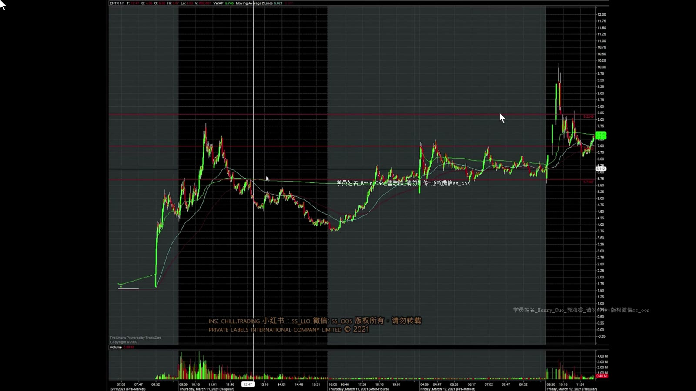
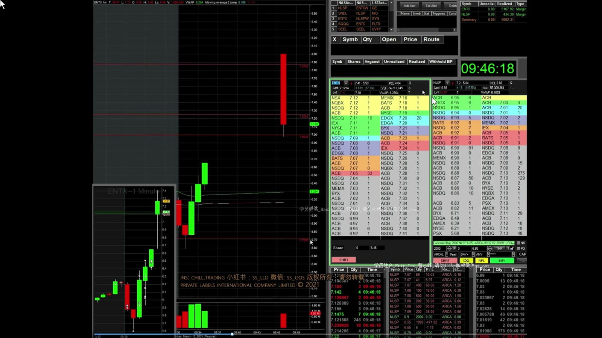
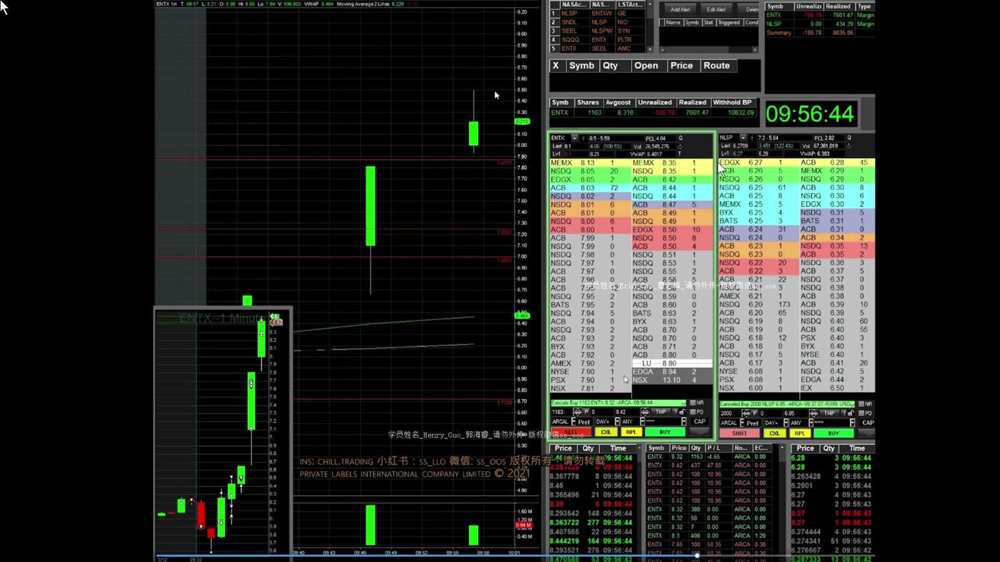
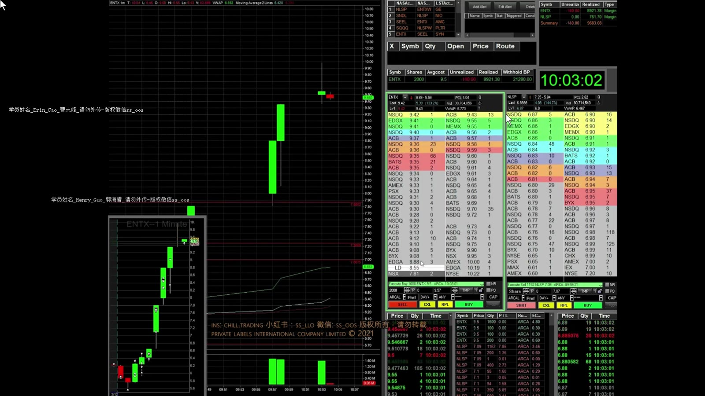
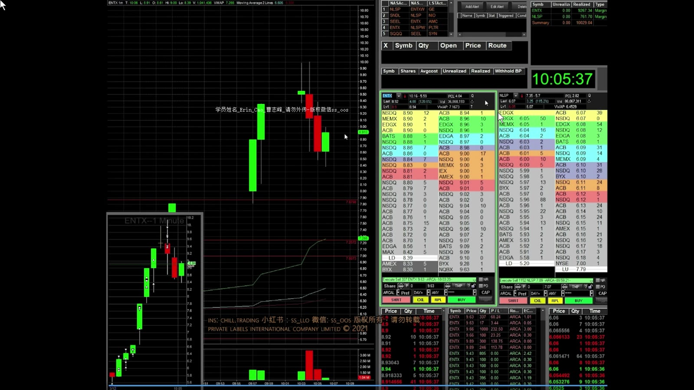
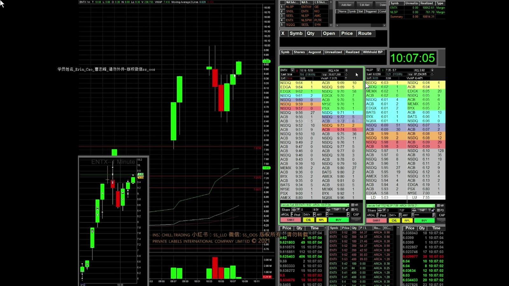

# 基础 15：ENTX Red-to-Green 与连续停牌复盘

> 对应视频：`15-rtg_halts_ENTX.mp4`
> 视频时长：16:30
> 本课目标：复盘盘后转强、Red-to-Green、连续向上暂停与 10 美元失败，理解停牌恢复时间和恢复价格均不可依赖。

## 1. 为什么这天不直接当 Resistance Short

ENTX 前一日冲高回落，但盘后重新上涨并横盘，第二天盘前仍有成交量且守住支撑。课程因此没有机械采用 gap-up resistance short，而是考虑 trapped shorts 回补带来的向上机会。

**图怎么看：**

- 左侧前一日确有高位成交与回落，但右侧盘后价格重新回到上方区域。
- 如果只看历史阻力，会忽略隔夜市场已经接受更高价格这一新信息。
- Long 假设仍需以盘前支撑、前日高点和实际突破确认，不能只靠“可能有空头被套”。

## 2. 5.70 支撑到 Red-to-Green

**图怎么看：**

- 5.70 是盘前可见支撑，讲师在第二根 K 线低位买入，并在 6 美元前先止盈。
- 6 美元突破后重新入场，随后突破当日/前日参考线并止盈。
- 第二根 K 线跌破 6 后迅速收回，才提供新的 dip buy 依据；不是每次跌破整数位都应买。

之后 VWAP 回踩形成支撑，价格再次向 6.5 推进并进入向上暂停。

## 3. 恢复时间异常：不能自己猜开盘秒数

第一次暂停持续约 12 分钟，视频原本按常见 5、10、15 分钟节奏等待，恢复时两个图表甚至短暂显示不同价格。

**图怎么看：**

- 恢复不是私人计时器倒数结束就必然发生；开盘竞价、监管原因和订单失衡都可能延长。
- 两个图表不同步说明数据源和刷新延迟在关键时刻真实存在。
- 讲师反应过来时约 7.1 买入、7.6 卖出，盈利不能消除恢复价未知和延迟风险。

视频猜测“系统可能有问题”并非可验证结论。更安全的处理是监听交易所/券商的正式状态，恢复后先确认可见 bid/ask、成交和订单状态。

## 4. 连续向上 Halt 后降低仓位

**图怎么看：**

- 第二次恢复后先上冲、再 dip；没有低风险回调时，讲师只得到约 800 股部分成交并很快卖出。
- 第三段用约 2,000 股在新 K 线 dip 后入场，于 8.98、接近 9 美元止盈。
- 连续 halt up 会同时增加潜在上涨和向下恢复风险；降低 size 比因前面盈利而加大仓位更合理。

错过 9 美元以上的后续上涨属于计划代价，不是必须纠正的错误。连续暂停后的追价通常没有近端失效位。

## 5. 9.50 支撑与 10 美元隐藏卖压

**图怎么看：**

- 第一次计划以 9.50 作支撑，价格立即跌破，讲师 hit bid 退出，约小亏 100 多美元。
- 随后 9.35 附近停止下移，重新买入；这应视为新 setup，不是把原亏损仓补回来。
- 接近 10 美元时价格无法推进，Level 2 表现出大量供给，部分卖单只成交 500 股。

“Hidden seller”是对成交吸收现象的合理假设，但无法仅凭一个画面确认身份。可操作事实是：大量成交后价格仍过不了 10，且剩余仓位的退出开始恶化。

## 6. 10 美元失败后的 Flush

价格无法突破 10 后快速跌到接近向下价格带。讲师停止立即交易，等待新支撑；随后尝试 1 分钟新高。

**图怎么看：**

- 大红 K 改变了原先连续上升结构，9 美元从支撑候选转为阻力候选。
- 在约 8.85 低吸并加到 4,000 股后，反弹未到预期 9.4–9.6，最终接近保本退出。
- 视频承认最高曾浮盈 1,000 多却因期待更高而回吐；这属于退出计划与实时证据不一致。

后面一笔在 9.62 高位买入、期待单根 K 内小反弹，价格没有反应，约亏 600 多。视频明确指出 entry 太高，下一根 K 才是更合理的观察点。

## 7. 连续停牌交易的风险边界

LULD 价格带不是上涨目标，也不是支撑：

- 价格带动态变化；
- 到达价格带不一定立即暂停；
- 暂停可能超过常见时间；
- 恢复可以向任一方向跳空；
- 暂停期间无法执行普通退出；
- 多个数据源可能在恢复瞬间不同步；
- 部分成交会留下意外仓位。

仓位压力测试应至少假设恢复时不利跳空 10%、20% 或更大，并判断账户是否仍可承受。

## 8. 全案例时间线

| 阶段 | 可见信息 | 合理动作 | 主要危险 |
|---|---|---|---|
| 盘前/开盘 | 盘后转强、5.70 支撑 | 等支撑确认、突破 6 | 把历史阻力机械做空 |
| 第一次 halt 前 | Red-to-Green、VWAP 支撑 | 分批止盈、减仓 | 停牌中无法退出 |
| 第一次恢复 | 时间与价格不确定 | 小仓、快速确认 | 数据不同步 |
| 连续 halt up | 动能强、失效远 | 降低 size、不追 | 向下恢复 |
| 10 美元附近 | 多次无法推进 | 兑现、收紧失效 | 隐藏供给、部分成交 |
| 10 美元失败 | 大 flush、结构改变 | 等新支撑 | 继续接飞刀 |

## 9. 最终结论

这段视频最有价值的不是连续上涨和万元利润，而是同时展示了：

- 前一套 short 逻辑为什么被隔夜新信息否定；
- 恢复时间并不整齐；
- 图表和报价会不同步；
- 关键价位可快速从支撑变阻力；
- 部分成交使计划仓位与实际仓位不同；
- 盈利交易后仍会出现贪心、追价和高位小亏。

停牌交易没有办法靠手速完全控制。最重要的控制发生在进入暂停之前：仓位足够小，任何一次未知恢复都不会威胁账户。
