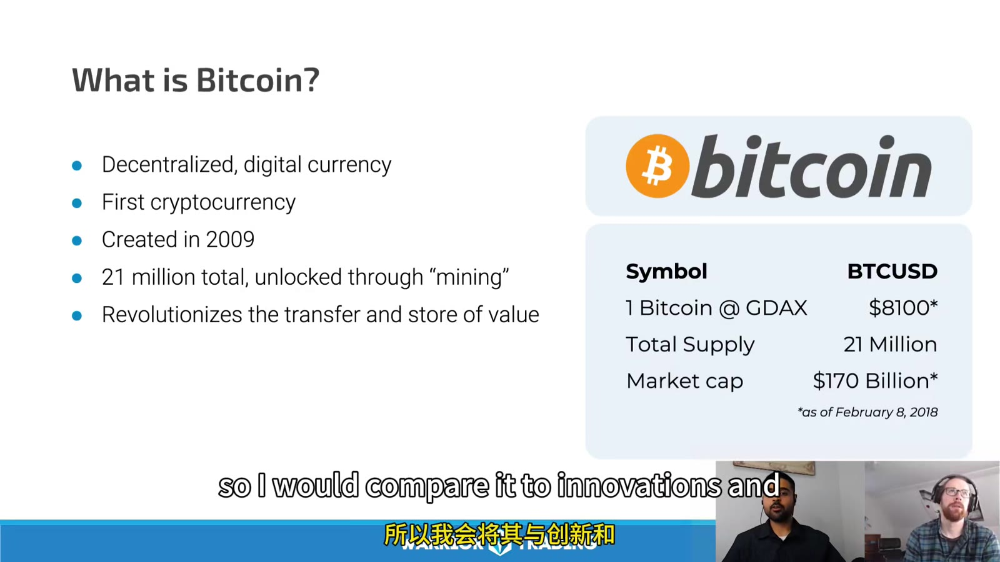
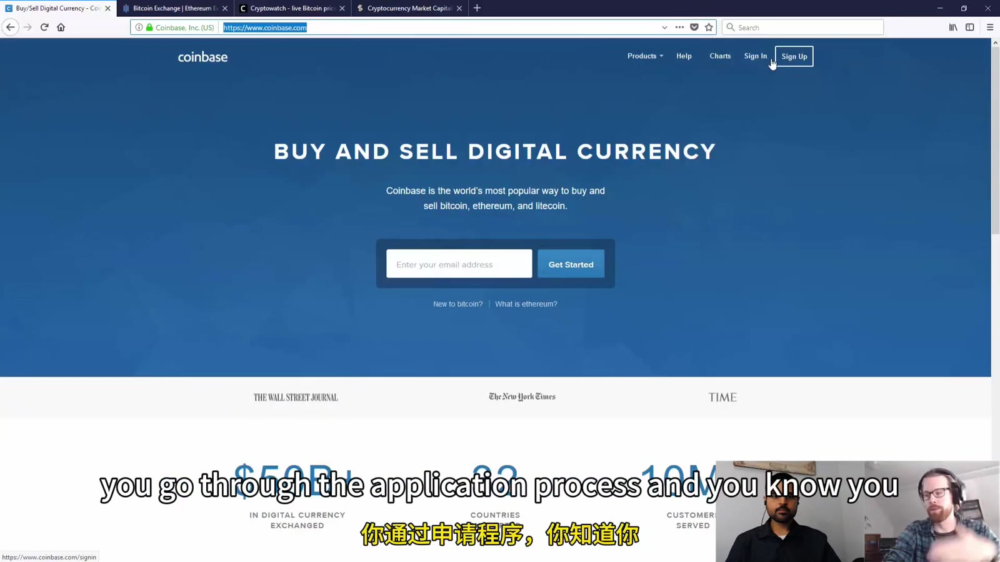
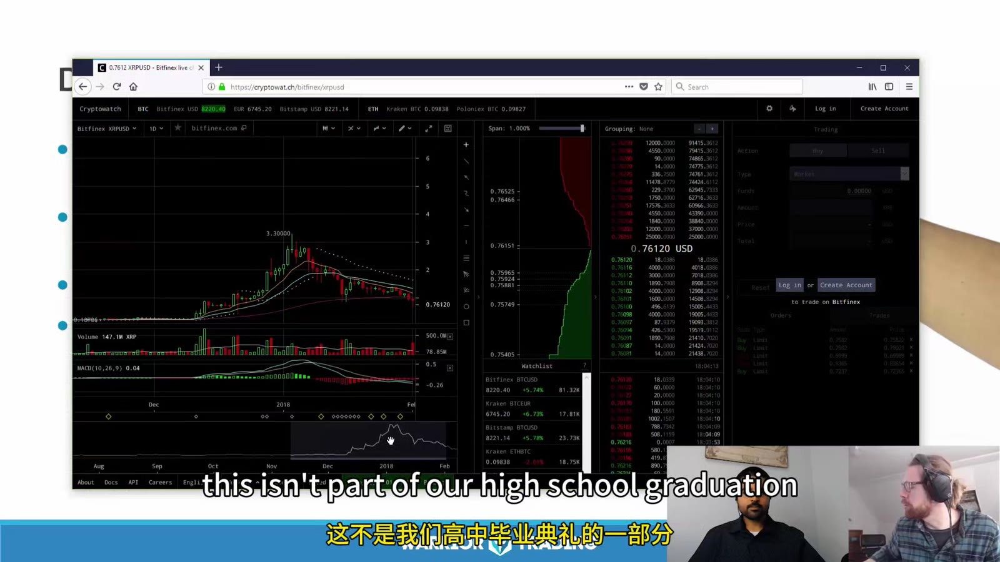
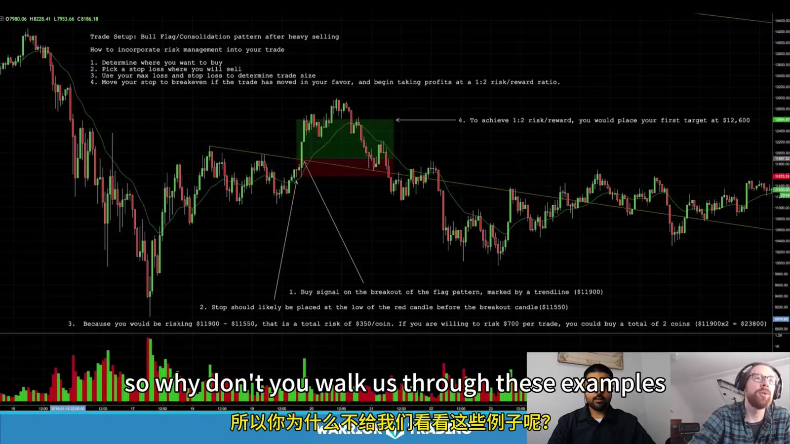

# Crypto Market Structure and Risk

> 对应视频：v0342–v0343

## v0342：市场、资产与交易场所

课程从 50% 级别的市场回撤切入，强调 crypto 的上涨叙事不能代替风险控制。它先区分：

- 作为 payment/medium of exchange 的使用；
- 作为长期 speculative asset 的持有；
- 短线买入后按更高价格卖出的 trading；
- spot coin 与 cash-settled futures。



**图怎么看：**

- 画面中的 supply、mining、transaction confirmation 是概念层，不等于某个 token 有投资价值。
- “总量有限”只解释供给规则的一部分；需求、竞争、协议升级、custody 和监管同样影响价格。
- 视频给出的 transaction speed/throughput 数字属于当时网络状态与表述，不应用来做今天的币种排名。

### Bitcoin、altcoins 与 futures

课程介绍 Bitcoin 后，用 Ethereum、Litecoin、Ripple/XRP 等对比用途、速度和供给。可复用的分析框架：

```text
what problem does the network claim to solve
consensus and issuance
current circulating/max supply
who can change the protocol
actual users and transaction activity
fees and settlement finality
concentration of holders/validators
security history
token rights
liquidity by venue and pair
```

视频说 futures 为做空和机构参与提供路径。Spot coin、futures、ETF/other products 的法律权利、杠杆、cash/physical settlement 和 counterparty 风险不同，不能把它们视作同一持仓。



**图怎么看：**

- 不同交易所的同一资产价格可能不同，因为 order book、参与者和 fiat pair 不同。
- 课程从 Coinbase 转入 GDAX，再看 order book 与 trades；这套具体操作已过时。
- 当前 Coinbase 官方资料说明 Coinbase Pro 已由 Coinbase Advanced 取代，因此截图只能用来学 market depth，不可跟着点菜单。

### 交易场所选择

视频建议比较交易量后选择 venue。仅看 volume 不够，还要查：

- 运营实体、所在司法辖区和适用监管；
- 客户资产是否隔离；
- fiat/crypto deposit 和 withdrawal；
- hot/cold wallet 比例、MFA、allowlist；
- insolvency 时客户权利；
- proof-of-reserves 的范围和负债缺口；
- maker/taker、withdrawal 和 network fees；
- order book 深度与异常成交；
- API/status page/incident history；
- 税务导出。

美国 SEC 的投资者材料提醒，third-party custodian 被攻击、停业或破产时，客户可能失去访问；self-custody 则由自己承担 private key/seed phrase 的全部责任。课程没有充分展开这一层，实际交易必须补上。

## v0343：Risk Management

课程从交易所 withdrawal backlog、服务能力和监管不足开始，随后用讲师在 Ripple/XRP 上的意外大亏说明：没有计划的仓位遇到全天候高波动，会让人无法理性反应。



**图怎么看：**

- 一根大 candle 可能跨过计划 stop，多数损失在数分钟内发生。
- 95% accuracy 也可能被一笔超大 loss 抹掉；胜率不能独立评价策略。
- Crypto 24/7 交易意味着睡眠时也有 gap-like move、headline 和 venue outage 风险。

### 三类核心风险

1. **Volatility risk**：供需不平衡和较浅深度造成快速波动；
2. **Headline risk**：监管、交易所、协议、security incident 随时改变价格；
3. **24-hour risk**：没有统一收盘，持仓、监控和人工反应能力持续消耗。

还应增加：

- custody/private-key risk；
- stablecoin/fiat rail risk；
- venue insolvency/counterparty risk；
- leverage/liquidation risk；
- oracle/index/basis risk；
- network congestion/fork risk；
- tax/reporting risk。



**图怎么看：**

- Stop 应放在结构失效处，再由 entry-to-stop 距离算 position size。
- Thin altcoin 的 market stop 可能穿过多档，limit stop 又可能完全不成交。
- 图上 2:1 target 只是计划起点；订单深度不足时，纸面 reward 无法兑现。

### Position sizing

```text
risk_per_unit = abs(entry - structural_stop)
base_units = max_dollar_risk / risk_per_unit
final_units = min(
  base_units,
  liquidity_limit,
  venue_limit,
  leverage_limit,
  custody_limit
)
```

计算还要对 slippage、fees 和 gap/liquidation buffer 留余地。若一次正常波动就触发情绪、冲动加仓或拒绝止损，课程建议直接把 size 降 80%，从几乎没有心理压力的规模重建。

### Stop、心理和恢复

- 先接受 loss 是业务组成，不能追求每笔回到 green；
- Exercise/meditation 在课程中作为耐受不舒服感的训练，不是交易 edge；
- 一旦发现自己等待 loser “变回 winner”，立即回到预先的 invalidation；
- 大亏后暂停 live，保存 fills/订单/行情，检查是滑点、平台、size 还是 rule break；
- 在 simulator 用同类波动重新演练；
- 只有执行稳定才恢复很小 size。

CFTC 的客户提示把 spot venue 缺乏保护、flash crash、操纵、网络攻击以及杠杆放大列为主要风险，并强调只使用可以承受全部损失的资金。课程里的技术 setup 不能消除这些非图表风险。

## 当前使用时必须修正

- GDAX 后来更名 Coinbase Pro，Coinbase Pro 又被 Coinbase Advanced 取代；
- 视频的币价、volume 排名、费用和币种列表均为历史；
- White paper、交易所“proof of reserves”和热门叙事都不是审计或客户资产保障；
- Spot、perpetual、dated futures、option 的 liquidation/settlement 不同；
- 不在没有验证 withdrawal 和备用 custody 路径的 venue 放入超出交易所需的资金。

## 当前官方参考

- [Coinbase：Coinbase Pro 已由 Coinbase Advanced 取代](https://help.coinbase.com/en/pro/managing-my-account/account-information/transitioning-to-advanced-trade)
- [Investor.gov：Crypto Asset Custody Basics](https://www.investor.gov/introduction-investing/general-resources/news-alerts/alerts-bulletins/investor-bulletins/crypto-asset-custody-basics-retail-investors-investor-bulletin-0)
- [CFTC：Understand the Risks of Virtual Currency Trading](https://www.cftc.gov/LearnAndProtect/AdvisoriesAndArticles/understand_risks_of_virtual_currency.html)
