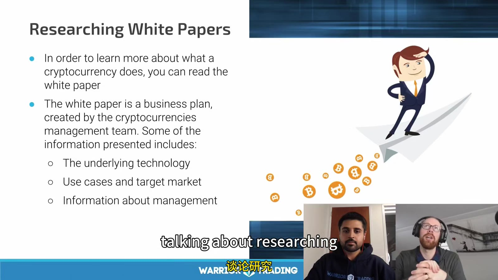
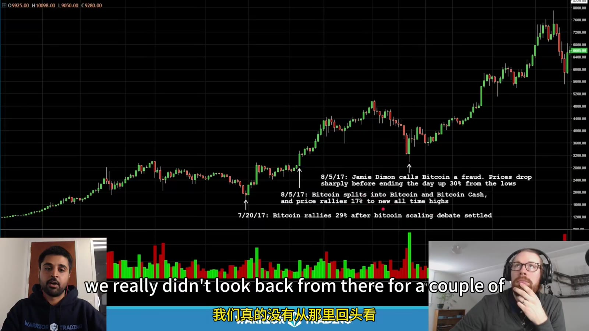
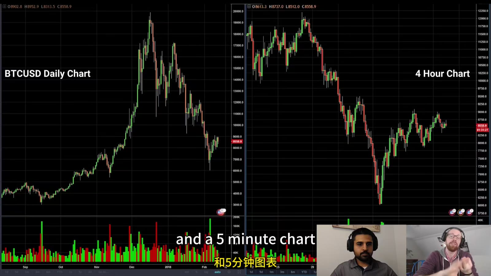
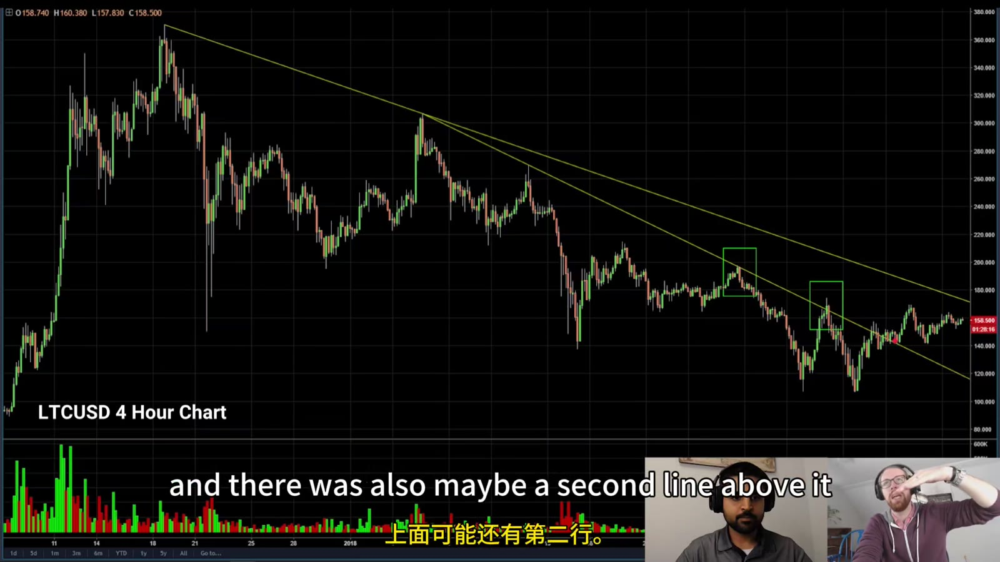
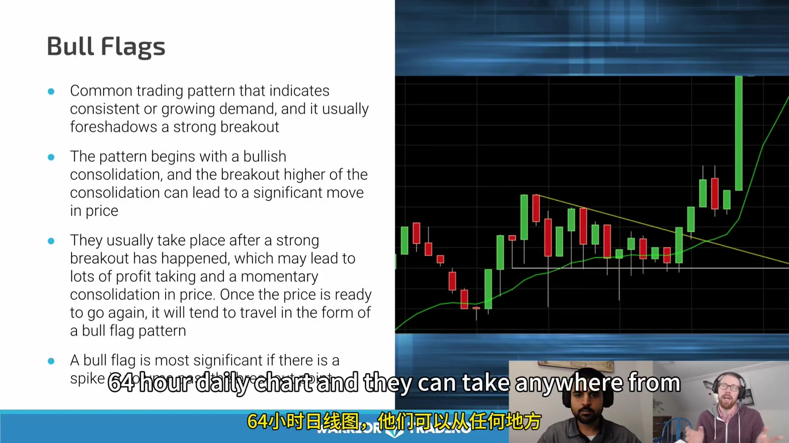

# Crypto Research and Technical Analysis

> 对应视频：v0344–v0345

## v0344：White Paper、News 与市场反应

课程把 white paper 类比为项目的 business plan，建议阅读目标、技术、token supply、团队和 roadmap。这个类比有局限：white paper 是发行方自己写的陈述，不是经审计财务报表，也不保证代码或治理按计划实现。



**图怎么看：**

- Supply schedule 会影响潜在稀释；要区分 max、circulating、locked、team/investor allocation。
- 小市值/低流通 token 对 headline 和 FOMO 更敏感，类似 low-float stock，但市场结构和法律权利并不相同。
- “技术听起来先进”不等于 token 会捕获该网络的经济价值。

### White-paper 核对表

```text
problem and target user
why a blockchain/token is necessary
source code and live network
issuance, unlocks, burns
team/investor allocation
governance and admin keys
consensus/security assumptions
audits and exploit history
revenue/fee/value-capture mechanism
competitors
legal entity and jurisdiction
actual usage vs marketing metrics
```

### News reaction

视频的核心不是预测每条新闻，而是观察市场“如何反应”：

- 强市场可能忽略 bad news、放大 good news；
- 弱市场可能忽略 good news、对 bad news 急跌；
- 如果预期极坏消息发布后价格不再创新低，说明卖压可能已被吸收；
- 反之，好消息不涨是弱势证据。



**图怎么看：**

- 把 headline 的准确时间标到 chart，再看之前是否已提前移动。
- 高 buy-side volume 只能说明该区域有强参与，不能识别参与者或保证底部。
- 录制期关于 China ICO ban、银行高管言论等只是历史案例，不能当当前催化剂。

## v0345：Technical Analysis

本课按 timeframe、trend line、support/resistance、volume、moving averages 和 patterns 展开。它强调技术分析的目标是找到概率优势，不是知道未来。



**图怎么看：**

- Day trader 可用 1m/5m，较长持有用 15m/60m，swing 更看 4h/daily。
- 同一段 6,000 → 9,000 的 bounce，在 daily 是少数 candles，在 intraday 包含很多可交易与不可交易波动。
- 先选持有周期，再选 timeframe；不能交易 1m entry 却在亏损后改成 daily thesis。

### Trend lines

- 至少两个点才能画线，第三次测试才更有验证价值；
- 调整到连接最多明确 swing points，而不是为了支持仓位任意旋转；
- 下方 rising line 是候选 support，上方 falling line 是候选 resistance；
- 破线要看 close、volume、retest 和 timeframe；
- 斜线与水平 daily level 汇合时更值得关注。



**图怎么看：**

- 课程用 extreme lows/highs 构造边界；每个点都应是当时市场实际反应处。
- 跌破后重新站回并 consolidation，才说明 buyers 可能把旧 resistance 变成 support。
- 两点连线能产生无数结果，要防止后视镜挑线。

### Volume 与 order flow

课程把 volume 用在每笔交易：

- breakout 时 volume expansion 说明参与增加；
- pullback 时 volume contraction 更符合有序整理；
- 下跌后出现异常 buy volume 可能说明吸收；
- order book/market depth 是尚未成交意图；
- Time & Sales 是已经成交的记录；
- 不同交易所的 volume 不能不加区分地合并。

### Moving averages

20-period average 在 daily 是 20 天，在 1m 是 20 分钟。Period 相同不代表经济含义相同。课程讨论：

- EMA 对新价格反应更快；
- 趋势中可作动态 context；
- 过于滞后的 crossover 可能在价格离高点很远才给 exit；
- Moving average 是价格的变换，不是独立信息源。

### Patterns



**图怎么看：**

- Bull flag：impulse up → controlled pullback/consolidation → resistance break，最好伴随 breakout volume。
- Bear flag：impulse down → weak ascending consolidation → support break。
- Pattern 的“旗杆”给 momentum context；没有 impulse 的小横盘不能仅凭形状叫 flag。
- Entry 后若没有立即 follow-through，应重新挑战 thesis，而不是等 pattern 名称拯救仓位。

## 防止技术分析变成画图游戏

每个截图复盘写：

```text
data venue and pair
timezone
timeframe
information visible at decision time
level defined before entry
trigger
stop and target
volume/order-book condition
fees/slippage
outcome
whether the rule was followed
```

使用同一规则标注失败样本。只保存“教科书 bull flag”会让自己误判真实命中率。
