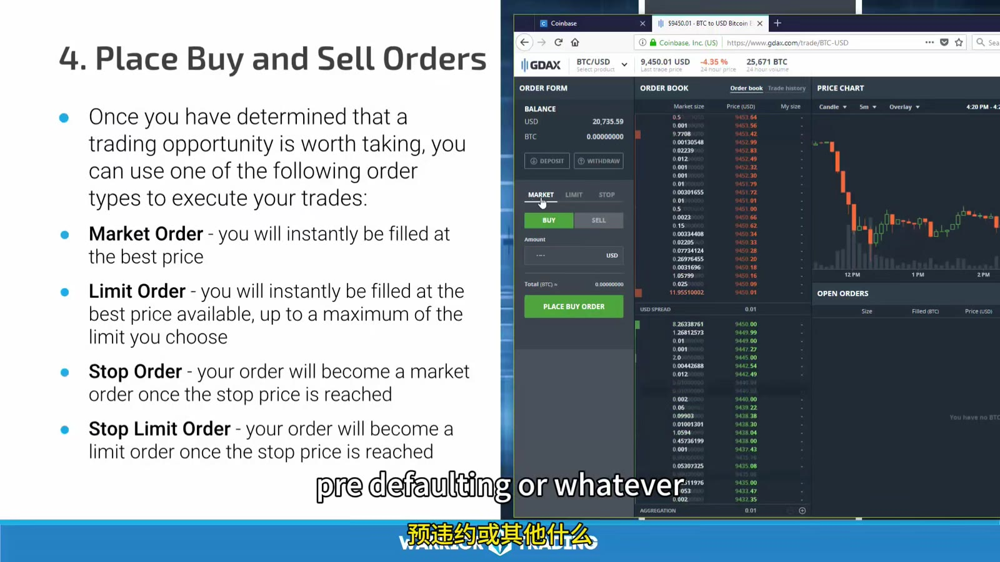
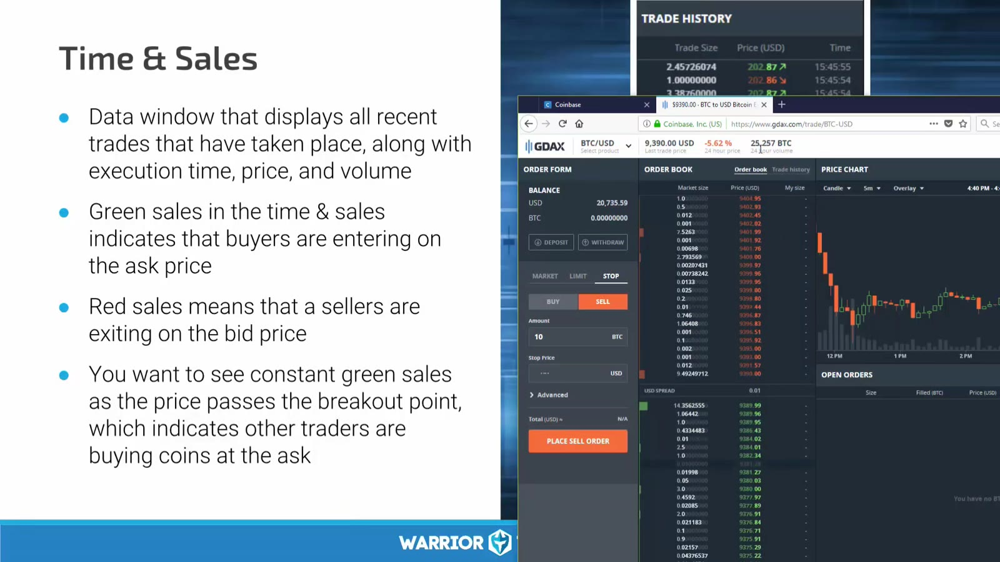
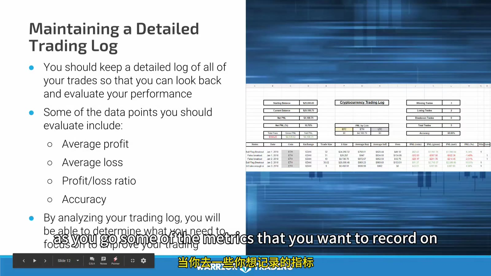

# Crypto Execution and Review

> 对应视频：v0346

## v0346：从知识到下单

课程用五步把技术知识转成交易技能：

1. 建立 watchlist；
2. 做 technical analysis；
3. 写 trade plan；
4. 放置 buy/sell orders；
5. 持仓期间持续 challenge thesis。


**图怎么看：**

- 清单的顺序很重要：不能先看到价格跳动、下单后再补理由。
- Watchlist 让注意力集中，但 24/7 市场不代表每天必须交易。
- Setup 频率随 market regime 下降时，正确动作是等待，不是放松过滤。

### Trade plan

```text
pair and venue
direction
setup
entry trigger
structural stop
max dollar risk
size
first target and partial
final target/trailing rule
time stop
maximum slippage
what new evidence invalidates the trade
venue/custody failure response
```

视频指出计划中的 “亏 1,000 或赚 2,000” 不是两种唯一结果。若 entry 后无 follow-through、volume 消失或 structure 变坏，break-even/small loss 退出优于机械等 full stop。

## Order types



**图怎么看：**

- Market 优先成交、不保证价格；薄 order book 会扫过多档。
- Limit 限定最差可接受价、不保证成交；买 limit 是最高愿付，卖 limit 是最低愿收。
- Stop 触发后如何变成 market/limit 要看 venue 规则。
- 界面金额可能以 fiat notional 或 coin quantity 表示；单位读错会造成数量级错误。

由于截图平台已经停用，今天下单前必须用当前产品文档确认 trigger basis、stop-limit、time in force、post-only、reduce-only 和 fee behavior。

## Market Depth 与 Time & Sales



**图怎么看：**

- Depth 显示价格层级上的未成交 size，随时可能 cancel；
- Time & Sales 显示实际成交的 price、size、time；
- 连续 aggressive buys 与 ask 被消耗可确认短线买压，但 spoof、隐藏单和跨 venue flow 会使单一 book 不完整；
- 一个 venue 的“sea of green”不代表整个 crypto market。

### 执行练习

先在 simulator/replay 做：

1. 限制一个 pair 和一个 setup；
2. 下最小 size；
3. 分别测试 market、passive limit、aggressive limit；
4. 记录 acknowledgement、partial fill、average fill；
5. 测 cancel/replace；
6. 模拟网络中断；
7. 从备用端确认 open orders；
8. 导出 trades 与 statement 对账。

## Challenge the trade

课程强调 entry 后持续问：

- Breakout 为什么没有立即推进？
- Volume 是否按预期增加？
- 原 resistance 是否真的变 support？
- Spread/depth 是否恶化？
- 新 headline 或 venue incident 是否改变风险？
- 我是在执行计划，还是因为不想承认 loss 而移动 stop？

“挑战”不是每个 tick 都退出，而是检查事先写下的失效证据。

## Trade review



**图怎么看：**

- 每次 buy/sell 的 size、price、time 是对账基础。
- 颜色只表示相对成交方向或界面分类，不能代替 side/fee 字段。
- 月末比较 accuracy、P/L ratio、average winner/loser 和上月差异，再只选 2–3 个改进项。

Crypto 还要额外记录：

- venue/pair；
- maker/taker fee；
- withdrawal/network fee；
- funding/basis（若衍生品）；
- liquidation distance；
- transfer/custody incident；
- 24h session 的统一日界线；
- fiat valuation source。

若没有这些字段，spot 与 derivatives、不同 venue 和不同计价币的 P&L 会被错误混合。
