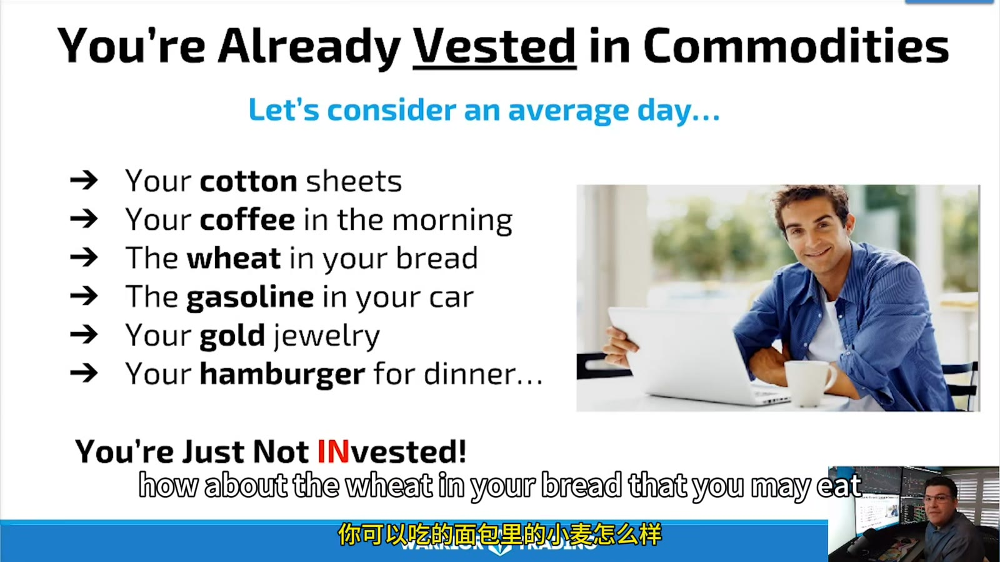
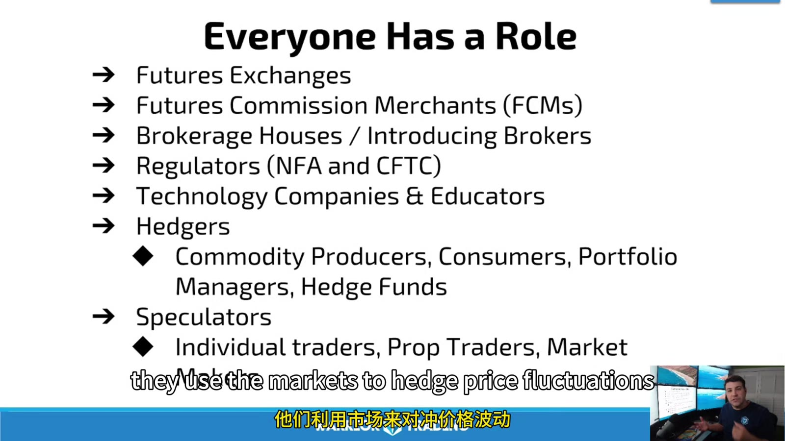
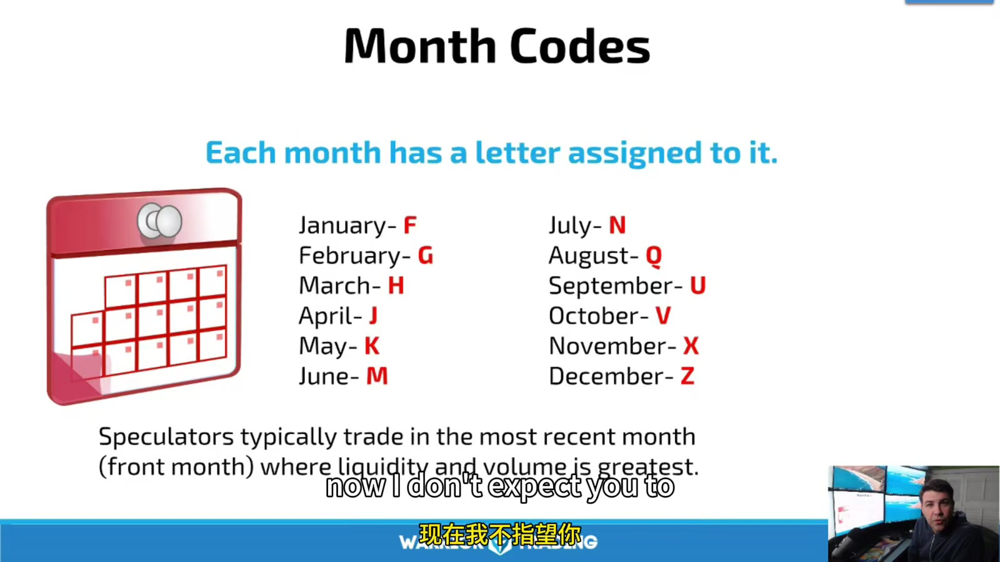

# Contracts, Participants, and Symbols

> 对应视频：v0347–v0349

## v0347：什么是 Commodity Futures

Futures 是标准化合约：双方同意在未来按合约规则买卖/结算某个 underlying。交易所预先定义 quantity、quality、delivery location/settlement、expiration、tick 和 trading hours，交易者主要选择方向、月份、价格和数量。



**图怎么看：**

- Corn、wheat、cattle、energy 等来自实体供需；index futures 则以金融指数为 underlying。
- 现货双方若直接寻找彼此，规格和交割需求很难匹配；标准合约和集中市场提高可比性和流动性。
- 交易 futures 不等于通常会收到实物，但持有到 expiration/notice period 可能触发 settlement/delivery obligation。

### Futures 市场提供的功能

- 标准化；
- 集中 price discovery；
- clearing 降低双边 counterparty risk，但不能消除市场/FCM/operational risk；
- 较容易 offset 现有头寸；
- Hedger 转移 price risk；
- Speculator 提供风险资本与流动性；
- 可对 equity index、rates、energy、metals、agriculture 等表达方向。

课程把 futures 描述成“只决定价格方向，其他已决定”。对初学者仍要补充：contract month、roll basis、margin、settlement、currency、daily limit 和 tax treatment 都会实质影响交易。

## v0348：Market Participants



**图怎么看：**

- Exchange/clearing、FCM、regulators、commercial hedgers、institutional/prop 和 individual speculators 各有不同角色。
- Retail trader 的对手方不一定是某个 farmer；clearing 体系对多方净额和履约进行管理。
- “受监管”不等于不会亏损，监管主要处理市场诚信、客户资金和机构行为。

### 角色

- **Exchange/Clearing house**：合约上市、撮合、结算和风险管理；
- **FCM**：承接客户 futures 账户、保证金、statement 和交易接入；
- **IB**：介绍/服务客户，客户资金通常由 FCM 持有；
- **CFTC/NFA**：美国 derivatives 的监管和自律框架；
- **Commercial hedger**：用期货降低生产、库存或采购价格风险；
- **Institutional/fund**：资产配置、hedging、relative-value 或 speculation；
- **Prop trader**：使用公司资本；
- **Individual trader**：为自身账户承担利润和损失。

选择美国 futures firm 时，可用 NFA BASIC 查 firm、principals 和 disciplinary history。只看低佣金或课程推荐不够。

## v0349：Symbols and Contract Specifications

Futures symbol 通常由：

```text
root + month code + year code
```

组成，但 broker/chart vendor 会用不同前缀、空格和连续合约写法。课程用 corn、crude oil 等说明，不能从一个平台复制 ticker 到另一个平台直接下单。



**图怎么看：**

- 月份字母与年份共同指定某一份独立合约；“continuous/front-month chart”通常不是可直接结算的单一合约。
- 规格表还包括 tick size/value、contract unit、listed months、trading hours、price limit、last trade/notice/settlement。
- 视频说通常交易 front month，是流动性经验规则；roll 前后要比较实际 volume/open interest。

### 月份代码

```text
F Jan   G Feb   H Mar   J Apr
K May   M Jun   N Jul   Q Aug
U Sep   V Oct   X Nov   Z Dec
```

记忆代码不能替代订单确认。每次下单读完整：

```text
underlying
exchange
contract month/year
multiplier
tick size and tick value
currency
settlement method
last trading day
first notice/delivery risk
current volume/open interest
```

### P&L 基础

```text
ticks_moved = price_move / minimum_tick
gross_P&L = ticks_moved × tick_value × contracts
```

不同合约相同“1 point”对应金额不同。Risk sheet 应使用交易所当前 specification，而不是视频里的旧数值。

## 当前官方参考

- [NFA：Investor FAQs 与 BASIC background check](https://www.nfa.futures.org/faqs/investors.html)
- [NFA BASIC](https://www.nfa.futures.org/BasicNet/basic-search-landing.aspx)
