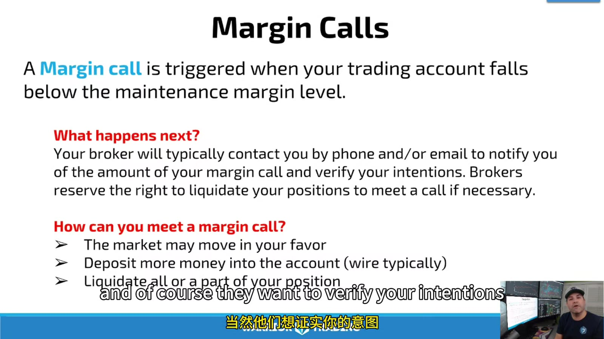
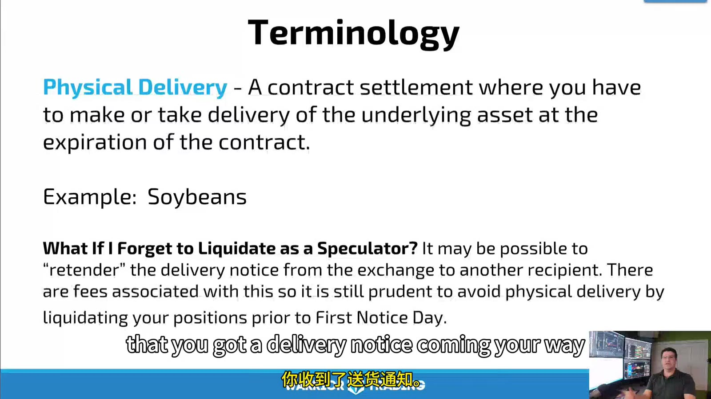

# Margin, Expiration, and Rolls

> 对应视频：v0350–v0351

## v0350：Trading on Margin

Futures margin 是 performance bond，不是股票 margin loan 的同义词。仓位每日 mark to market，亏损直接改变账户 equity 和可用 margin。



**图怎么看：**

- Initial margin 是建立/持有头寸所需基准，maintenance 是之后必须维持的下限。
- 某些 broker 给更低 intraday/day margin；它不是风险更小，只是允许更高 leverage。
- 视频的 5%–15%、corn $770、day margin $385 等均为录制期例子，不能直接用于今天。

### Mark to market 与 margin call

账户按当前/settlement price 重新估值。当 equity 低于要求时，可能：

1. 补充资金；
2. 减少一部分仓位；
3. 全部平仓；
4. 被 FCM 风控强制 liquidate。

Broker 不需要等到你的技术 stop 才保护自己。快速市场中 liquidation price 也可能比预期差。

### 真正的 leverage

```text
notional = futures_price × contract_multiplier × contracts
leverage = total_notional / account_equity
risk_to_stop = ticks_to_stop × tick_value × contracts
```

不能用 “margin 只需 $X” 作为可承受 size。若 $50 margin 控制 $15,000 notional，小幅指数变化也会相对账户产生巨大损益。

### Margin 变化

Exchange/FCM 可因 volatility、event risk、overnight holding 或 concentration 调高要求。计划至少预留：

- stop loss；
- slippage；
- margin increase；
- overnight gap；
- open orders 全部成交；
- data/platform fee；
- transfer delay。

## v0351：Expiration、Settlement 与 Roll



**图怎么看：**

- Physical delivery 与 cash settlement 是两套后果；不能从“多数人会平仓”推断自己没有义务。
- First notice date、last trading day、delivery period 的先后依产品不同。
- Broker 往往设自己的 liquidation deadline，可能早于 exchange 最后日期。

### 三种处理方式

- **Offset**：对同一月份做相反、等量交易，使净仓归零；
- **Roll**：平掉近月，同时在远月建立新仓；
- **Settlement/Delivery**：持有至合约规则生效。

CME 的现行教育资料也把 offset、roll 和 settlement 列为 expiration 前三种选择，并强调具体日期随合约变化。

### Roll 不是“改一下 ticker”

```text
old contract P&L closes
new contract opens at its own market price
roll spread = new price - old price
fees/slippage apply to both legs
chart may show artificial gap if back-adjusted
```

视频用 long 3 contracts：卖出近月 3 张归零，再买远月 3 张。两者是独立合约，不会自动继承 entry price。

### 何时 roll

课程建议观察近月和下一月的 volume/open interest 转移，而非机械等到最后一天。实际流程：

1. 查 exchange calendar/spec；
2. 查 broker cutoff；
3. 检查 physical/cash settlement；
4. 比较两月 spread、volume、depth；
5. 选择 calendar-spread order 或分腿执行；
6. 核对旧月 position 为 0、新月数量正确；
7. 更新图表和 journal 的 contract code。

不要只依赖连续合约图。它可能 back-adjusted，适合分析但不能显示真实 roll cash flow。

## 当前官方参考

- [CME Group：Understanding Futures Expiration and Contract Roll](https://www.cmegroup.com/education/courses/introduction-to-futures/understanding-futures-expiration-contract-roll)
- [CME Group：Expiration and Settlement](https://www.cmegroup.com/education/courses/introduction-to-futures/get-to-know-futures-expiration-and-settlement)
