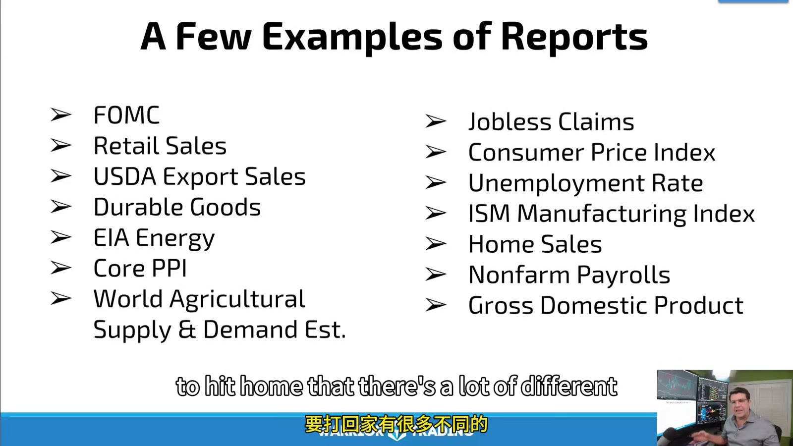
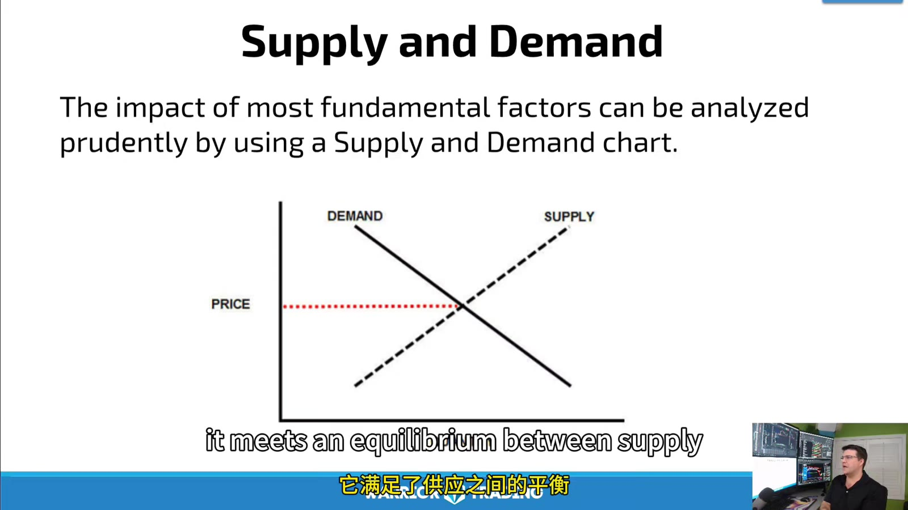
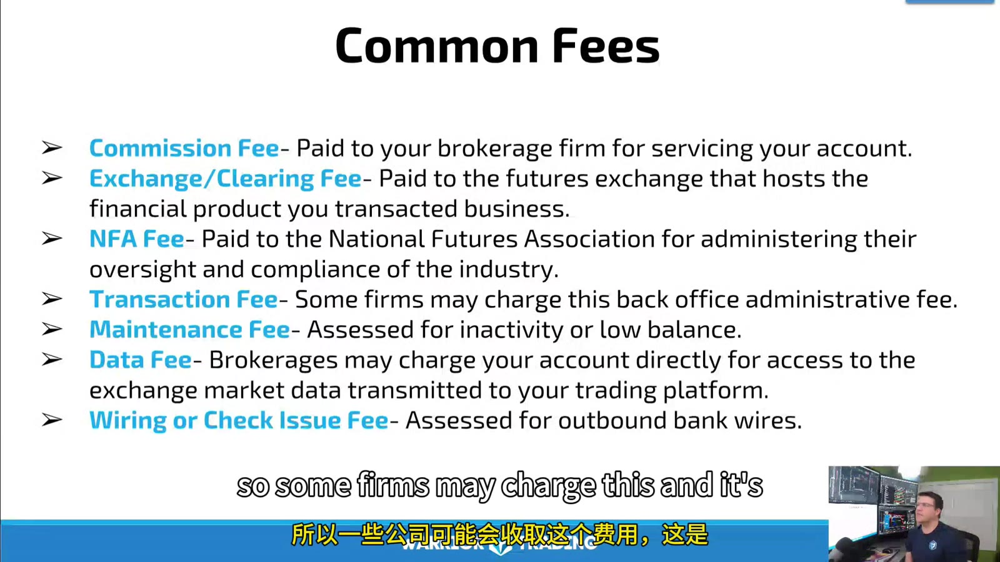
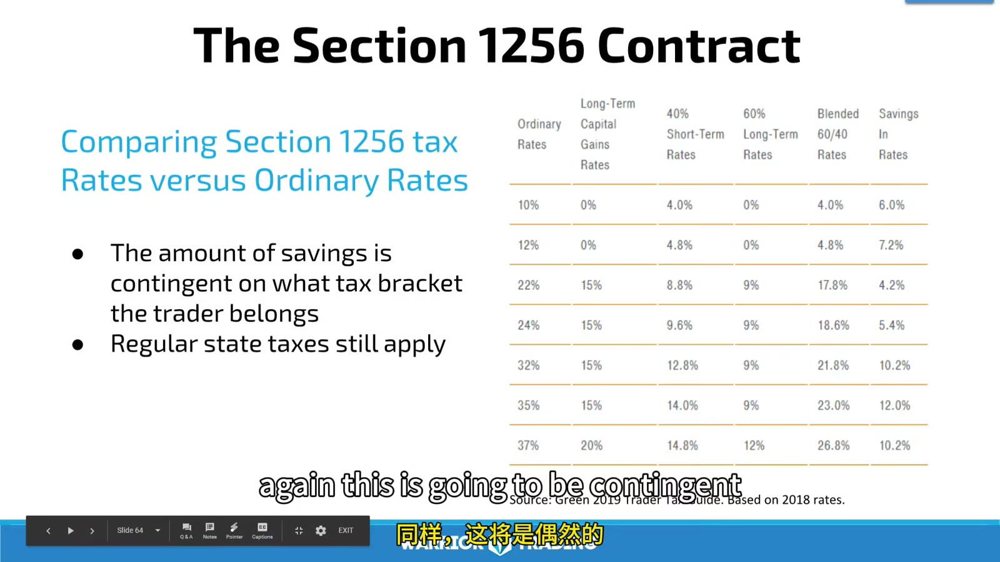

# Reports, Fundamentals, Fees, and Taxes

> 对应视频：v0352–v0355

## v0352：Economic Reports

课程列举 monetary policy、retail sales、USDA export sales、durable goods、EIA energy、PPI、WASDE、employment 等报告。不同 futures 对报告敏感性不同。



**图怎么看：**

- 报告要同时记录 release time、actual、consensus、prior/revision；
- 市场交易的是实际与预期的差异，以及仓位是否已经提前 priced in；
- 图上的第一反应可能在几秒内反转，不能把“好数据”简单映射成涨。

### FOMC 案例

课程解释政策利率影响 borrowing cost、消费和资产估值。对交易更重要的是：

```text
pre-event expected path
actual decision
statement changes
projections/press conference
positioning
price reaction across rates, USD, equities
```

所有人都能看到数据，edge 不在知道报告存在，而在预先定义 scenarios、控制 event slippage，并客观跟随反应。

## v0353：Fundamental Information



**图怎么看：**

- Demand 增加或 supply 受限，其他条件相同会提高 equilibrium price；
- Supply 增加或 demand 减少则相反；
- 真实市场会同时发生库存、替代、运输、天气、政策和 currency 变化，曲线不是单因果预测器。

### 主要驱动

- production/yield；
- inventory/storage；
- weather/natural disaster；
- transport/supply chain；
- exports/imports；
- seasonal demand；
- energy/input cost；
- currency and rates；
- geopolitical/policy；
- economic growth。

Technical trader 仍要知道重大基本面事件，因为它们会改变 volatility、gap 和正常 stop 分布。基本面提供“为什么可能动”，price/volume 提供“现在是否真的动”。

## v0354：Account Fees



**图怎么看：**

- 一次 round trip 可能包含 commission、exchange、clearing、NFA 和 platform/data 等多个 line items。
- “每边佣金”必须换算成完整 round trip，再乘 contracts 和交易次数。
- 录制期金额、专业/非专业 data 价格和 wire fee 都会变化。

### 总成本

```text
all_in_round_turn
= broker commission both sides
 + exchange and clearing
 + regulatory
 + platform/data allocation
 + slippage
```

还应计入 inactivity、routing、phone-assisted、withdrawal/wire 和 liquidation fees。最便宜不保证最好，但若平均 edge 只有一两个 ticks，任何成本误差都会改变 expectancy。

## v0355：U.S. Taxes（历史课程，需重新核对）

课程讲到 Section 1256、mark to market、60/40 和 wash-sale。讲师也明确声明自己不是税务专业人士。



**图怎么看：**

- 图表基于当时税率和 2019 tax guide，不能用于当前报税；
- “futures 都一样”过度简化，要确认具体产品是否属于 Section 1256 contract；
- 居住地、实体、trader/investor status、hedging 和跨境情况都会改变处理。

美国 IRS 当前 Publication 550 说明：regulated futures contract 属于 Section 1256 类别之一；年底通常按 fair market value 视同售出，净 gain/loss 一般按 60% long-term、40% short-term处理。Form 6781 用于报告 Section 1256 与 straddle 相关损益。

这不是说：

- 所有国外或 crypto 衍生品都自动符合；
- 所有 futures loss 都可任意 carry back；
- 不需要保存 statement；
- 州税或其他国家税务相同；
- 任何交易者都可忽略 wash-sale/straddle/hedging 等特殊规则。

做法：保留 1099-B/statement、monthly activity、year-end open positions、fees 和 deposits/withdrawals，交给熟悉 derivatives 的税务专业人士。

## 当前官方参考

- [IRS Publication 550：Section 1256 与 mark-to-market](https://www.irs.gov/publications/p550)
- [IRS Form 6781](https://www.irs.gov/forms-pubs/about-form-6781)
