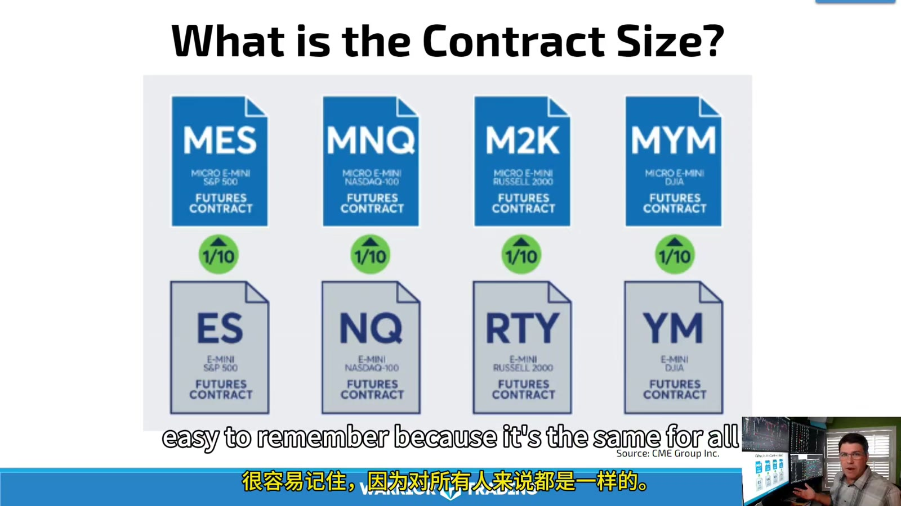
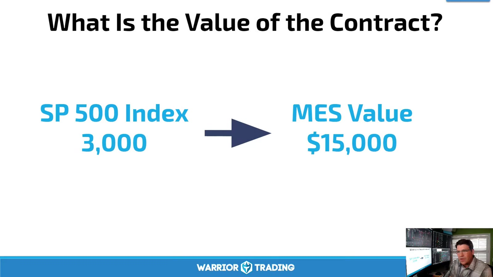

# Micro E-mini and Operating Discipline

> 对应视频：v0356–v0357

## v0356：Micro E-mini Futures

视频录于 Micro E-mini 2019 年推出不久，介绍 MES、MNQ、M2K、MYM。它们是对应 E-mini 的 1/10 notional size，因此更容易用多张合约分批，但仍是 leveraged futures。



**图怎么看：**

- MES、MNQ、M2K、MYM 分别映射 S&P 500、Nasdaq-100、Russell 2000、Dow。
- Month/year code 仍必须加在 root 后；截图中的 `U9` 只代表 2019-09。
- “更小”是相对 E-mini，不等于适合任意小账户。

### 录制期 multiplier 例子

- MES：$5 × index；
- MNQ：$2 × index；
- M2K：$5 × index；
- MYM：$0.50 × index。

下单前仍要到交易所规格页确认 tick、trading hours 和 settlement。视频用 S&P 3,000、MES notional $15,000、broker day margin 约 $50 演示 leverage；这些市场点位和 margin 已是历史。



**图怎么看：**

- 低 margin 不会降低 contract 的 tick P&L；
- 多张 micro 可 scale in/out，但也让不知不觉叠加过多合约更容易；
- Nearly 24-hour session 包含每日 maintenance break、假日和流动性低谷，不等于任何时段 execution 相同。

### Expiration

Micro equity index futures quarterly cash settle。课程给三种选择：roll、offset、expire。CME 当前资料仍说明 Micro E-mini 在 3/6/9/12 月第三个星期五按相关指数 official opening level 结算；但每次仍查具体 calendar。

## v0357：Ten Success Tips


**图怎么看：**

- 这节没有新 setup，讲的是怎样让前面合约知识变成长期可执行流程。
- “成功交易很无聊”指每天重复同一研究、风险和复盘步骤。
- 课程给出的 30%–50% margin usage 是讲师经验 barometer，不是安全保证；更应按 stress loss 管理。

### 十条内容

1. **Successful trading is boring**：不因星期或短期 drawdown 每天更换系统；
2. **Overfund the account**：留出 margin buffer；避免可用资金几乎全被占用；
3. **Don’t take markets personally**：正确执行也会亏，volatility 不是针对个人；
4. **Learn every day**：小剂量学习和 end-of-day review；
5. **Develop your own strategy**：跟随讲师只作训练，目标是独立；
6. **Know and obey risk limits**：per-trade、daily、weekly limit 写了就执行；
7. **Tune out skeptics**：不要让外界意见改变已验证流程；
8. **Control the environment**：关闭电话/电视/人员干扰；
9. **Even the best aren’t perfect**：不追求抓 high/low，只取计划中的 middle；
10. **Set and reward goals**：按 process goal 评价，不只看收入。

### 需要修正的两点

- 视频引用“85%–90% futures traders lose”的宽泛统计，没有给具体研究，不能当精确概率；
- “教育自己就会进入成功的 10%–15%”也不是统计推论。教育是必要条件之一，不保证 profitability。

### 更实用的 margin stress rule

不要只限制 margin usage percentage，同时计算：

```text
open risk to stops
gap/event stress loss
all pending orders filled
exchange/broker margin increase
largest historical intraday move
correlated positions moving together
```

### Daily process

```text
before:
  contract/month, calendar, reports, margin, risk limits
during:
  orders, position, stop, environment, loss limit
after:
  broker statement, screenshot, rule adherence, one lesson
weekly:
  expectancy, drawdown, costs, regime, strategy changes
```

独立交易的标志不是不再学习别人，而是能完整解释自己的 universe、setup、risk、execution 和停止条件。

## 当前官方参考

- [CME Group：Managing Micro E-mini Futures Expiration](https://www.cmegroup.com/education/courses/micro-e-mini-futures/managing-micro-e-mini-futures-expiration)
