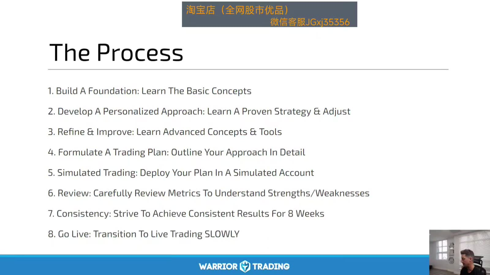
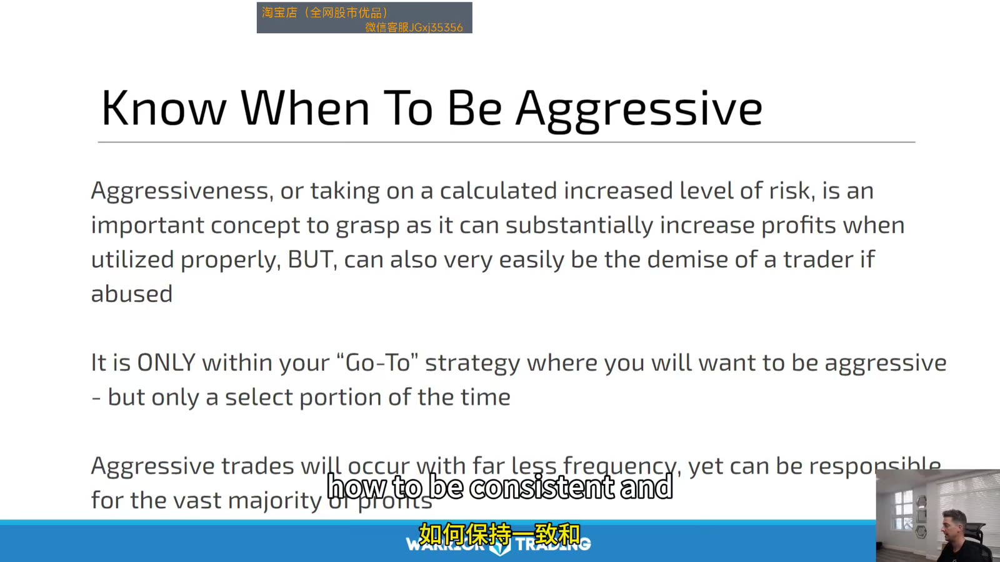
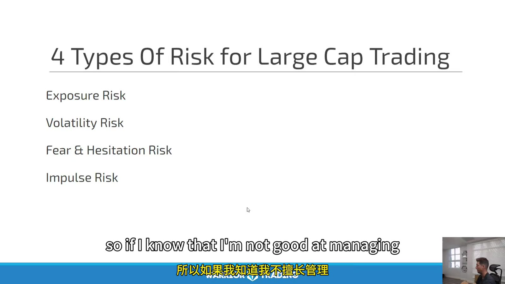
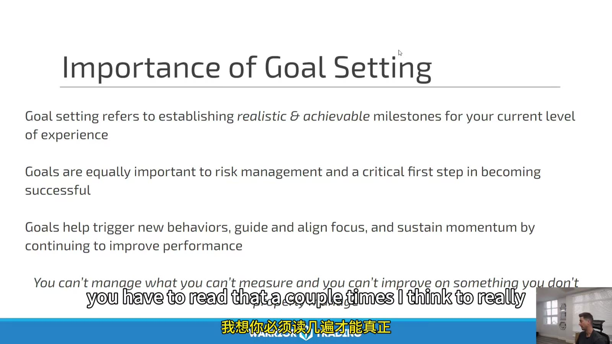

# Large Cap 01：Process and Risk

> 对应视频：Chapter 1–2
> 本节重点：Large-cap trading 仍然从基础、规则、模拟、复盘到小规模 live；“更有流动性”不等于仓位可以脱离风险点无限放大。

## 1. 学习流程



**图怎么看：**

- Slide 从基础、个性化策略、进阶工具、交易计划、模拟、复盘、一致性到 live。
- 这是一条 evidence chain：后一阶段需要前一阶段的数据，不只是等待时间。
- “连续 8 周”可作为最低观察窗，但仍需足够交易样本和不同 market regime。
- Go live 应缓慢放大，先验证真实成交与心理变化。

可验证的 gate：

```text
written rules
→ 100+ tagged samples
→ positive expectancy after costs
→ max drawdown within limit
→ high rule adherence
→ smallest live size
```

## 2. 何时允许 aggressive



**图怎么看：**

- Slide 只允许在 go-to strategy 的少数高质量场景增加风险。
- Aggressive 必须定义为具体 size multiplier，不是情绪上“更有把握”。
- 高频普通 setup 与低频 A+ setup 分开统计，才知道放大是否合理。
- 即使是历史最好 setup，单笔仍可能失败，daily loss 不可取消。

建议：

```text
base risk = 1 unit
A setup   = 1 unit
A+ setup  = at most 1.25–1.5 units after evidence
rule violation / cold regime = 0–0.5 unit
```

具体倍数由个人回撤承受力决定，不照抄。

## 3. 四类风险



**图怎么看：**

- Exposure risk：仓位 notional、beta、隔夜和相关性。
- Volatility risk：ATR、新闻、earnings、宏观公布与 gap。
- Fear/hesitation risk：错过计划触发、迟停损。
- Impulse risk：无计划追价、revenge trade、过度交易。
- 后两项虽然是行为风险，最终也必须用仓位、锁仓和规则控制。

还应补充：

- liquidity/slippage；
- operational/platform；
- model/regime；
- borrow/short；
- legal/account；
- correlated portfolio risk。

## 4. 目标设定



**图怎么看：**

- Slide 强调目标要现实、可测量。
- 每日固定盈利金额不可控，并会诱发过度交易；过程目标更合适。
- 先设最大损失、规则遵守率、setup 样本数，再设 size-growth gate。
- P&L 结果应评估，但不能成为当天必须达到的任务。

可控目标：

- 每笔下单前有 stop 与 size；
- 规则外交易为 0；
- 达 daily stop 后不再下单；
- 每日完成截图和成交核对；
- 每周只改一个规则；
- 20 个交易日后再决定是否加仓。

## 5. Large cap 的 exposure 计算

单票：

```text
shares = per-trade risk / abs(entry - stop)
notional = shares × entry
```

组合还要看：

```text
net exposure
gross exposure
sector concentration
beta-adjusted exposure
event concentration
```

同时 long AAPL、MSFT、NVDA 不是三笔完全独立风险；指数或科技板块下跌可能一起触发。

## 6. 止损只是预期，不是成交保证

- Market hours 内的 liquid large cap 通常比 small cap 更易执行；
- Earnings、macro release、halt 和 overnight gap 仍可能跳过 stop；
- Stop-market 控制触发、不控制价格；
- Stop-limit 控制价格、不保证成交；
- 预设 loss 要留 slippage buffer；
- 重大事件前降低 size 或退出。

## 7. 每周 risk review

统计：

| 指标 | 目的 |
|---|---|
| Planned vs actual risk | 发现滑点/违规 |
| Gross/net exposure | 识别方向集中 |
| Correlated loss days | 识别伪分散 |
| MAE by setup | 校准 stop |
| Rule violations | 管理行为风险 |
| P&L by event day | 隔离宏观/财报风险 |
| Size tier expectancy | 验证 aggressive 是否有效 |

流程的终点不是“敢下大单”，而是风险增加仍能被同一套证据和规则解释。
