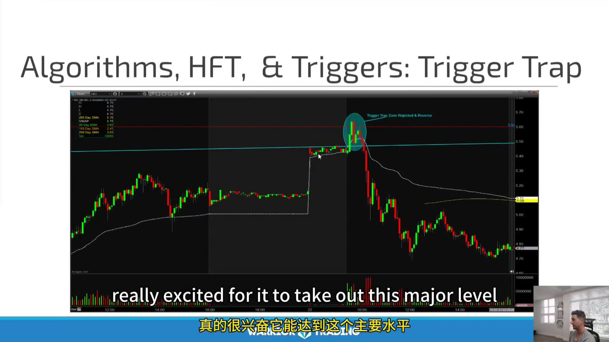
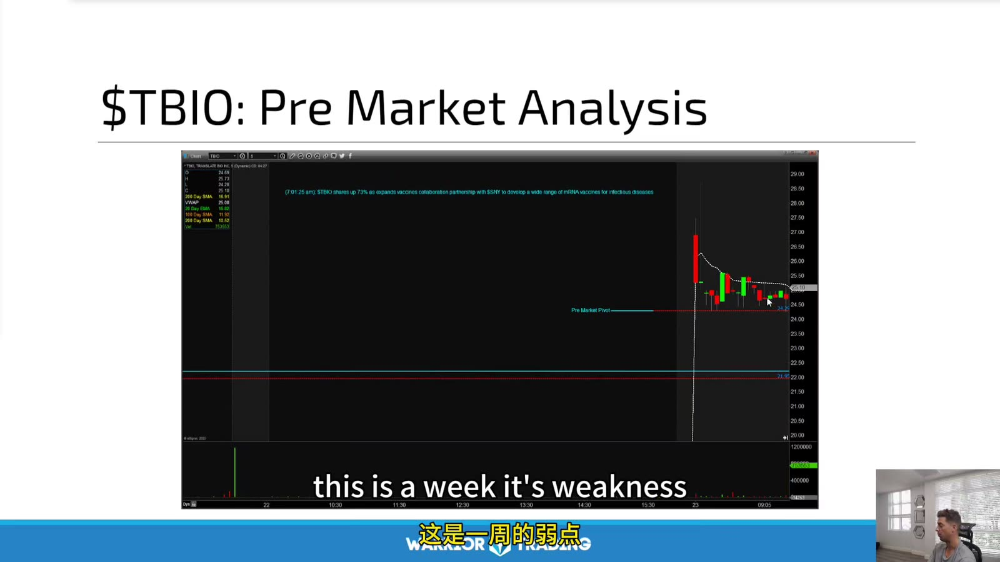
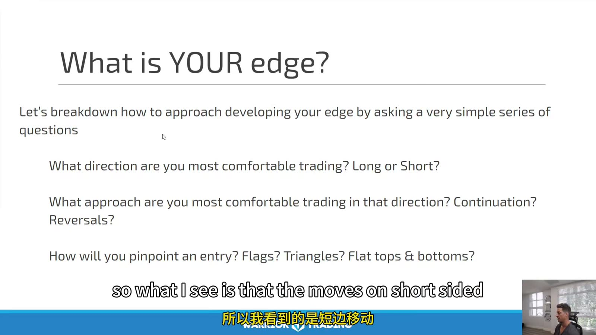
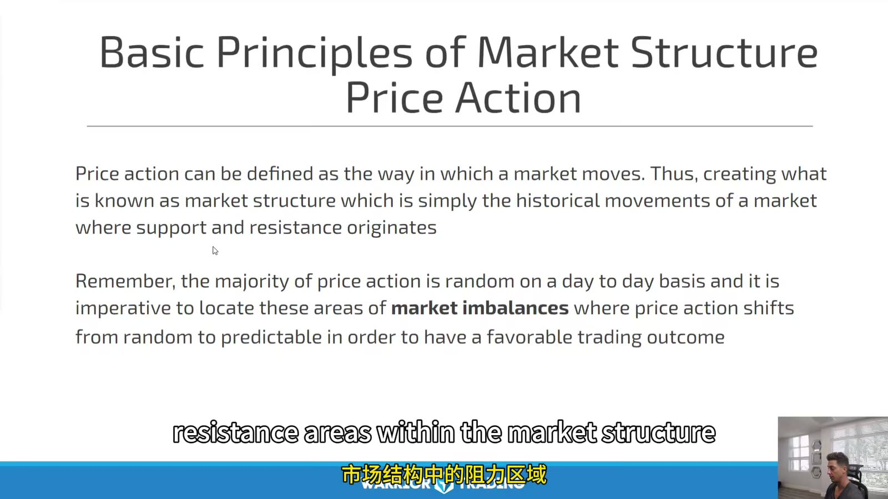

# Large Cap 02：Stock Selection and Edge

> 对应视频：Chapter 3–4
> 本节重点：Large-cap 候选来自有效 catalyst、异常成交和清楚日线位置；edge 则是自己在明确方向、形态和执行方式上的统计优势。

## 1. Trigger trap



**图怎么看：**

- 图中价格突破明显水平后瞬间反转，课程称为 trigger trap。
- “算法造成”是可能机制，但单张 chart 无法识别具体参与者或意图。
- 可交易事实是：突破没有 acceptance、价格快速跌回并破坏 micro structure。
- 预防方式是等待 close/retest、控制滑点，而不是猜某个大户在“猎杀”。

## 2. Premarket analysis



**图怎么看：**

- 图上先标 gap、premarket high/low、前一日与日线水平，再判断 strength/weakness。
- Premarket volume 与 spread 决定这些水平是否可靠；一笔孤立成交不应定义关键位。
- Large cap 也要区分 earnings gap、analyst action、macro sympathy 与无消息波动。
- 开盘前写 bullish 与 bearish 两套条件，避免单向锚定。

候选排序：

```text
fresh catalyst
× relative volume
× daily location
× tradable range
× liquidity
÷ event uncertainty
```

这不是数学公式，而是保证每项都被考虑。

## 3. Edge 的三个问题



**图怎么看：**

- Slide 依次问：偏 long/short、偏 continuation/reversal、用何种具体 entry。
- Edge 必须窄到能标注样本，例如 “earnings gap-down + VWAP rejection short”。
- “我擅长看盘”无法统计，也无法区分 market beta。
- 方向偏好可以保留，但应确认不是因为不愿止损某一侧。

## 4. Market structure



**图怎么看：**

- Slide 将历史价格运动形成的支撑/阻力称为 market structure。
- “多数 price action 随机”是教学概括，不是严格概率定理。
- 对交易真正有用的是预先定义的 imbalance、reference level 和 response。
- 只有在相同规则的大样本中表现稳定，结构才构成 edge。

## 5. Catalyst 的层级

优先核验：

1. 公司原始公告/SEC filing；
2. Earnings release 与 call；
3. 监管或宏观官方来源；
4. 主流新闻；
5. Analyst note；
6. 社交媒体仅作线索。

“No news, no trade”可作为个人过滤器，但 large cap 在指数 rebalance、sector move 或宏观数据下也可能有有效 context；必须写清策略边界。

## 6. Relative volume 与 absolute liquidity

- RVOL 高说明相对自身平时更活跃；
- Absolute volume/depth 决定仓位是否可执行；
- 高 RVOL 但 wide spread 的标的仍可能差；
- 低 RVOL 的 mega cap 绝对成交量仍可很大；
- 用相同时段比较，避免开盘量与全天均值误比。

## 7. Edge hypothesis 模板

```text
Universe:
Catalyst:
Market/sector condition:
Daily location:
Intraday setup:
Entry:
Invalidation:
Exit:
Holding time:
Excluded conditions:
Estimated costs:
```

然后做：

- in-sample 定义规则；
- out-of-sample 验证；
- live-small 验证执行；
- 按 market regime 分层；
- 保留所有失败和未成交。

## 8. 不把解释当证据

常见事后解释：

- “算法扫掉 stop”；
- “market maker 压盘”；
- “大家都在看这个水平”；
- “大资金吸筹”。

除非有可核实数据，否则日志只写观察事实：

```text
traded 0.15 above resistance
closed back below within 30 seconds
spread widened from 0.02 to 0.08
retest failed
```

事实可复盘，故事不可回测。
