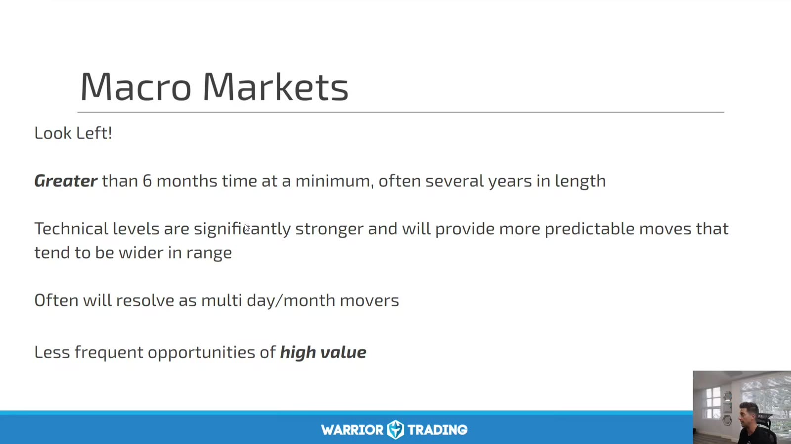
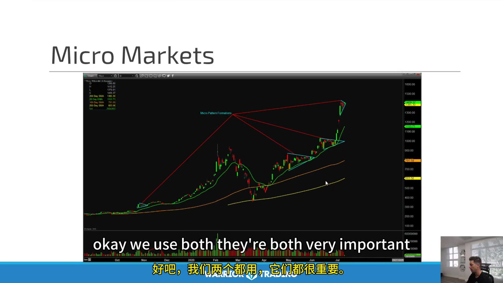
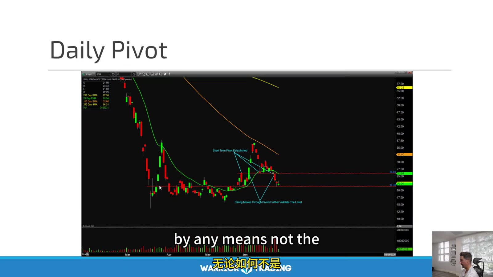
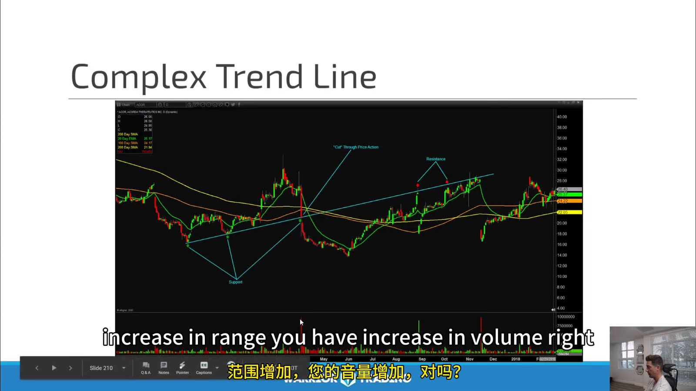

# Large Cap 03：Macro, Micro and Key Levels

> 对应视频：Chapter 5–6
> 本节重点：Macro structure 决定大级别空间，micro structure 决定当日 entry。支撑阻力是市场曾经反应的区域，不是必须反弹的线。

## 1. Macro market



**图怎么看：**

- Slide 把 macro 视为至少 6 个月、常达数年的结构。
- 大级别水平可能引发多日/月反应，但机会更少。
- “更强、更可预测”是经验判断；重大基本面变化仍可直接穿越历史水平。
- 日内交易也要向左看日线/周线，避免在关键位前才入场。

Macro checklist：

- weekly/daily trend；
- 52-week/all-time high/low；
- major gap；
- prior earnings reaction；
- 200/50-day averages；
- sector/index structure；
- upcoming event。

## 2. Micro market



**图怎么看：**

- 图中多个小 triangle/pullback 构成 micro entry，红色箭头指向更大级别目标。
- Micro setup 只有在 macro space 足够时才值得交易。
- 多个局部形态共享同一上升趋势，不是独立信号。
- 大级别目标只是潜在 magnet；途中仍需按 micro invalidation 管理。

## 3. Daily pivot



**图怎么看：**

- 红色水平线来自前一日或更大级别反应点，盘中价格在附近形成局部结构。
- Pivot 应在开盘前标出并注明来源，避免事后移动。
- 价格第一次触及、突破后 retest、第三次测试是不同 setup。
- 区域附近若 spread/volume 异常，静态水平不能替代执行判断。

## 4. Complex trendline



**图怎么看：**

- 图中用多段 swing high/low 连接趋势路径，展示价格并非沿单一直线运行。
- Trendline 锚点越多，事后拟合空间越大；必须规定用哪些 confirmed swings。
- 突破线条后要看是否破坏 price structure，而非只因像素越线就下单。
- Volume expansion 可以辅助判断，但不是必然先行指标。

## 5. 建立 level hierarchy

按优先级标线：

1. Weekly/monthly structural levels；
2. Daily high/low、gap、earnings levels；
3. Premarket high/low；
4. Prior day high/low/close；
5. Intraday opening range、VWAP、swing。

颜色和线型固定，避免同一 chart 变成无法阅读的“彩虹线”。

## 6. Level 是区域，订单需要精确价

分析上：

```text
resistance zone = 100.00–100.30
```

执行上：

```text
entry trigger = 100.35 trade-through
max limit = 100.42
stop/invalidation = close below 99.95 or structure low
```

把区域与订单价分开，既承认市场噪声，也保持可执行性。

## 7. Break、retest、acceptance

- **Break**：价格第一次穿越；
- **Retest**：回到原水平；
- **Acceptance**：在新区域持续成交/收盘；
- **Rejection**：快速回到原区间。

只记录 “breakout” 会混合四种不同路径。至少用固定秒数/K 数定义 acceptance。

## 8. Macro 与 micro 冲突

例如：

```text
weekly resistance above
daily trend up
5m reversal short
```

这不是简单的多空抵消。写明交易周期：

- 5m short 只以日内回撤为目标；
- 不把它升级成长期 bearish thesis；
- 到 daily support 前及时减仓；
- 若 micro structure reclaim，立即失效。

## 9. 练习

每天开盘前：

1. 只画 macro levels；
2. 保存截图；
3. 开盘后新增 micro levels；
4. 收盘后标出哪些真的产生反应；
5. 统计触及、突破、retest 与 rejection；
6. 不删除没有反应的水平。

这样才能检验自己画线的预测价值，而非只展示最准确的线。
