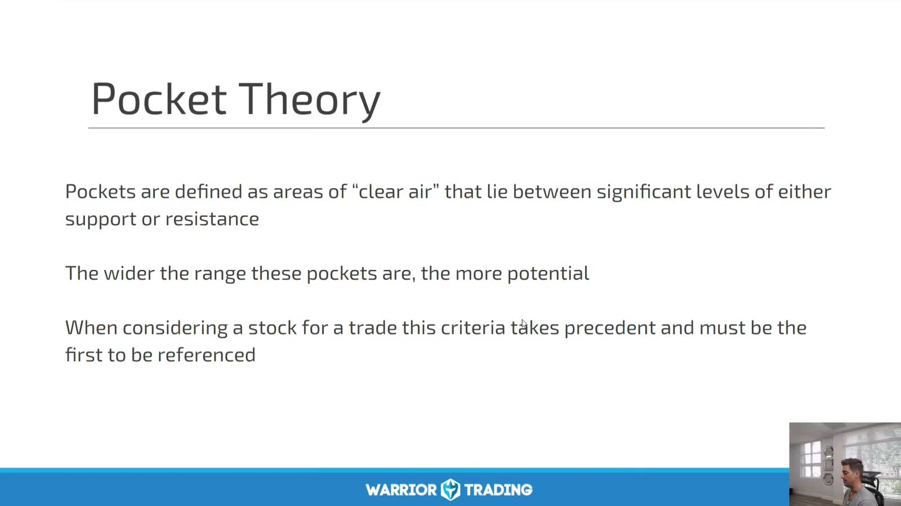
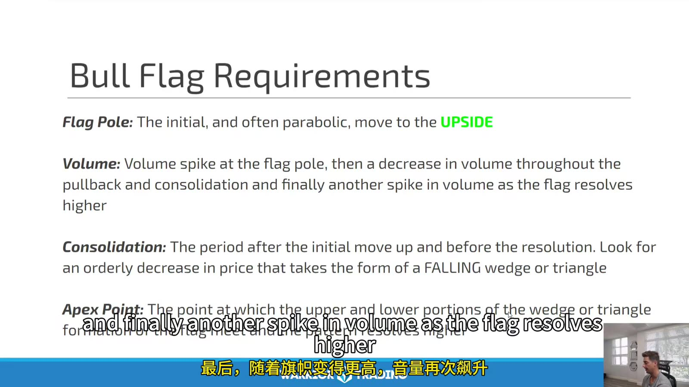
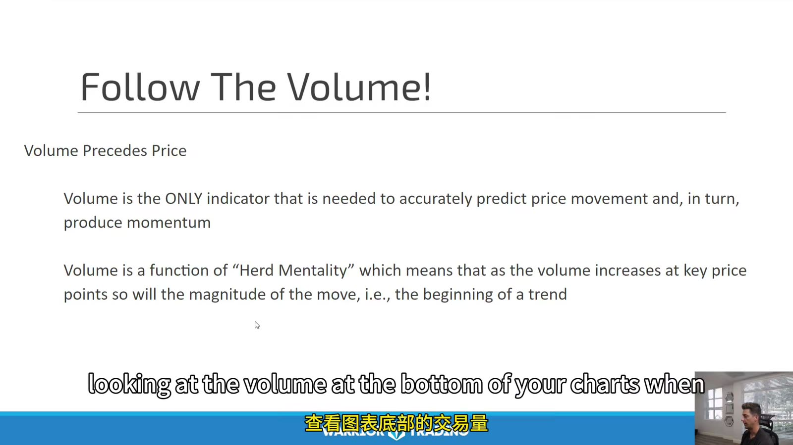
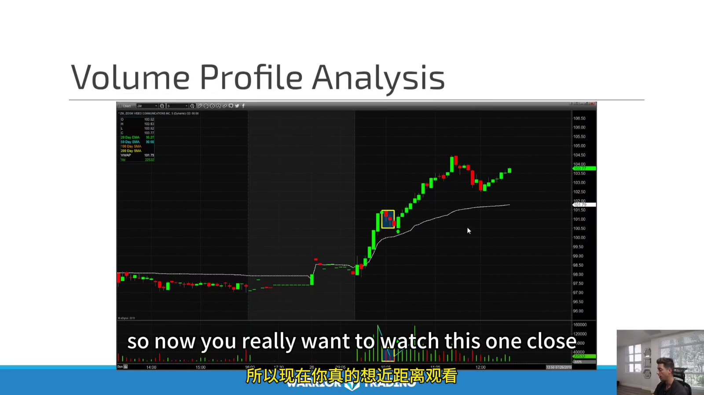

# Large Cap 04：Daily Patterns, Confirmation and Volume

> 对应视频：Chapter 7、10
> 本节重点：Pattern 给出结构，volume 与 price acceptance 给出确认。Volume 很重要，但“唯一能预测价格的指标”是过度表述。

## 1. Pocket theory



**图怎么看：**

- Pocket 是两个重要支撑/阻力之间相对缺少结构的价格区间。
- 区间越宽，理论可运行空间越大；但仍可能在中间形成新流动性。
- Entry 前先计算 pocket width 与 stop distance，确认有足够 R。
- “Clear air” 是 chart 描述，不表示 order book 真空。

## 2. Bull flag requirements



**图怎么看：**

- Slide 列出 flag pole、量能扩张、整理量缩、下降 wedge/triangle 与 apex。
- 形态的核心是 impulse 后有序回撤，不是必须长得完全一样。
- Breakout volume re-expansion 常见但不是保证；low-volume breakout 也可能持续。
- Apex 太近才进场可能出现拥挤假突破，需看上方 pocket。

## 3. Volume 与 price



**图怎么看：**

- Slide 提出 “volume precedes price” 并称 volume 是唯一所需指标。
- 这应视为课程观点而非事实：成交量本身没有方向，且高量可能是吸收、分配或事件再定价。
- Price response to volume 比 volume 绝对值更有信息。
- 低量时的突破可能脆弱，高量但价格不前进也可能更危险。

## 4. Volume profile analysis



**图怎么看：**

- 图中 breakout 时放量、趋势延续，回撤时量相对收缩。
- 这是理想 continuation profile，但必须与失败样本对照。
- 普通底部 volume bars 是按时间聚合；price-volume profile 是按价格聚合，不能混称。
- Premarket 与 regular-hours volume 基础不同，应分开比较。

## 5. Confirmation 的四个维度

1. **Price**：突破、收盘、retest、higher low；
2. **Volume**：相对历史和相同时段是否扩张；
3. **Market/sector**：是否同向支持；
4. **Execution**：spread、depth 与实际 fill 是否允许。

它们常相关，不能把 “4 个确认” 直接乘成超高胜率。

## 6. Volume-price matrix

| Price | Volume | 可能含义 | 下一步 |
|---|---|---|---|
| 上涨 | 扩张 | 参与增加 | 看能否保持/接受 |
| 上涨 | 收缩 | 供给少或需求弱 | 等突破确认 |
| 横盘 | 扩张 | 吸收/换手 | 等方向离开 |
| 下跌 | 扩张 | 主动卖出/止损 | 查支撑和事件 |
| 下跌 | 收缩 | 缓慢回撤 | 可能 continuation context |

没有任何一格自动等于买或卖。

## 7. Relative volume 的正确基准

比较同一标的：

- 同一时段；
- 同一 session；
- 类似 event day；
- rolling median 而非单日异常均值；
- corporate action 调整后数据。

开盘 10 分钟自然比午间活跃，不能用全天平均直接判断。

## 8. False confirmation

常见陷阱：

- Breakout volume 很大但 candle 有长上影；
- Level 突破后 1–2 根 K 即跌回；
- Sector/market 不跟随；
- 一次 block print 抬高 volume；
- Closing auction 量被误当盘中 momentum；
- News halt 恢复后的异常 volume。

所以 confirmation 的定义要包含**价格是否在新区域保持**。

## 9. Pattern 样本表

记录：

```text
pattern name
daily location
pocket width
impulse volume ratio
pullback volume ratio
breakout volume ratio
acceptance duration
market/sector return
spread/slippage
1R/2R reached?
failed within N bars?
```

用同一套字段比较 bull flag、triangle 与 flat top，才知道究竟是 pattern、volume 还是 market context 提供 edge。
