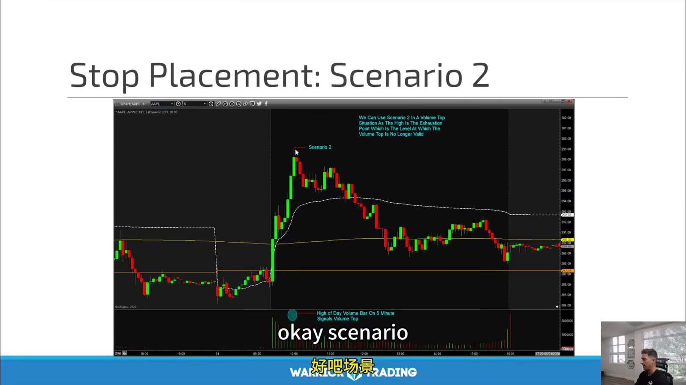
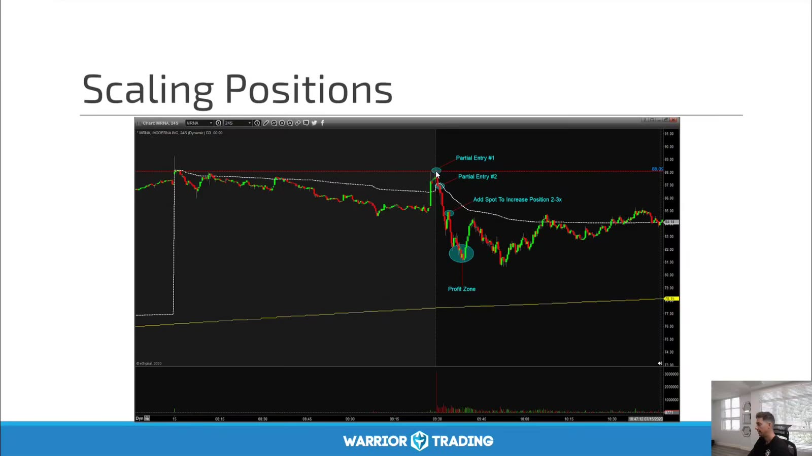
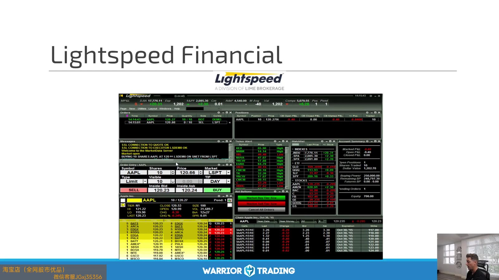
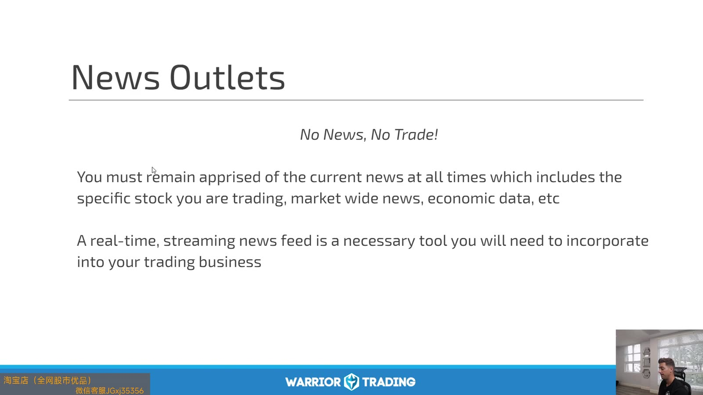

# Large Cap 05：Trade Management and Tools

> 对应视频：Chapter 11–12
> 本节重点：Trade management 先决定何时失效，再决定加减仓；平台、新闻和数据服务只负责可靠执行，不创造策略 edge。

## 1. Stop placement



**图怎么看：**

- 图中开盘后先下探、急拉，再逐步回落；不同 entry 对应不同结构 stop。
- Stop 应放在 thesis 失效处，而不是按账户想亏多少钱反推任意价格。
- 若结构 stop 太远，用 size 解决；把 stop 塞进噪声只会提高无效止损率。
- 开盘 gap 与快速 candle 可能让实际成交超过 stop。

## 2. Scaling positions



**图怎么看：**

- 图中标出 initial entry、add、partial exit 和 final zone。
- 每次 add 都是新决策，必须重新计算总仓到 stop 的美元风险。
- 只在 winner 加仓也可能使总风险增加；提高 stop 不能保证 gap/flush 时成交。
- Partial profit 会降低风险，但过早减仓也可能让平均 winner 不足以覆盖 loss。

统一记账：

```text
lot 1: shares, entry
lot 2: shares, entry
current weighted average
current stop
total open risk
realized P&L
remaining target
```

## 3. Trade management 顺序

1. Entry 前写 invalidation；
2. 成交后核对真实 average price；
3. 到 1R 前不因 P&L 颜色移动 stop；
4. 达预定 level 才 partial；
5. Add 前确保总风险仍在上限；
6. 结构失效就退出；
7. 收盘后用实际 fills 复盘。

## 4. 平台是执行基础设施



**图怎么看：**

- 画面是录制期平台，按钮、费用和 route 可能已经变化。
- 需要理解的是 positions、open orders、Level 2、Time & Sales、order entry 的职责。
- 平台推荐有商业和地域背景，不应仅凭课程选择 broker。
- 先核查监管、资产保护、费用、data、route、short availability 与应急支持。

## 5. News feed



**图怎么看：**

- Slide 使用 “No News, No Trade” 强调实时新闻。
- 对 earnings/news momentum 策略，这是合理过滤器；对 index/technical strategy 则需另行定义。
- 新闻 feed 速度不等于准确；headline 后仍要核对原始 release/filing。
- Macro calendar 必须与 company news 同时监控。

## 6. 工具的最小集合

- regulated broker；
- reliable real-time market data；
- chart with consistent adjustments；
- scanner/watchlist；
- original news/filing access；
- economic calendar；
- execution platform；
- risk controls；
- broker statement export；
- journal。

每个新增工具都应解决一个已识别问题；否则只增加认知负担。

## 7. Data integrity

开盘前检查：

- feed 是否实时；
- 时区和 session；
- split/dividend adjustment；
- chart 与 broker quote 是否一致；
- open positions/orders；
- buying power；
- short/SSR 状态；
- corporate event。

数据错一项，精细技术分析也会失效。

## 8. Emergency plan

写在平台外：

```text
broker trade desk phone
account identifier
how to cancel all
how to flatten by web/mobile
internet backup
power backup
what to do on quote freeze
max position allowed during outage
```

平台冻结时不要反复点击产生重复订单；先从另一渠道核对 open orders。

## 9. 工具评价指标

用数据而非界面偏好比较：

- order acknowledgement latency；
- fill quality vs NBBO；
- rejected/canceled orders；
- uptime；
- data gaps；
- monthly fixed cost；
- per-share/contract fees；
- export completeness；
- support response。

真正的目标是稳定、可审计地执行交易计划。
