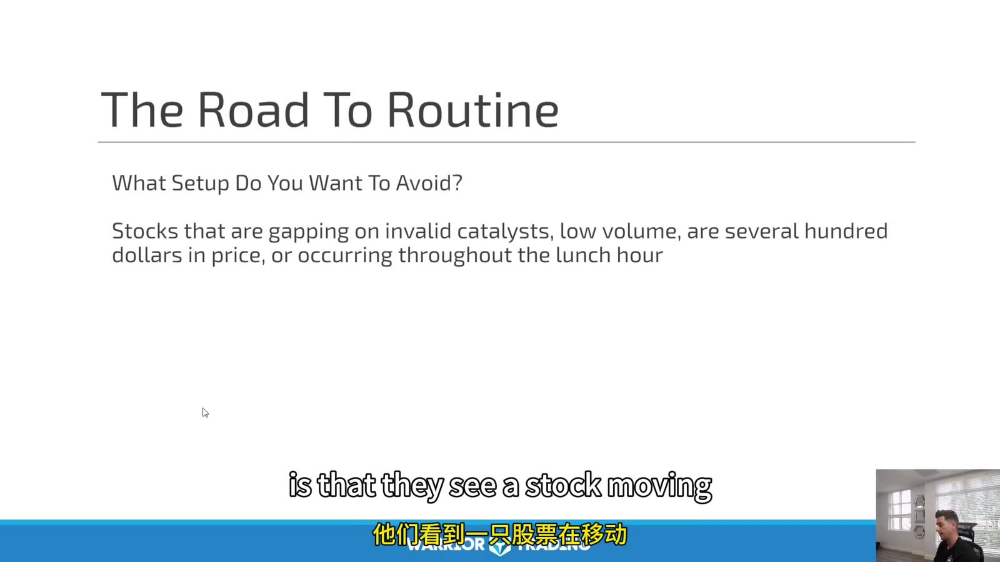
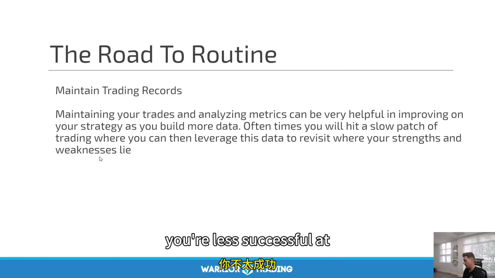
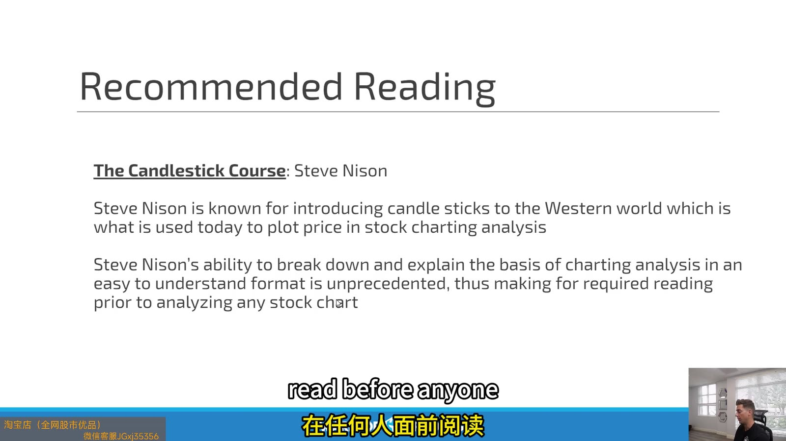
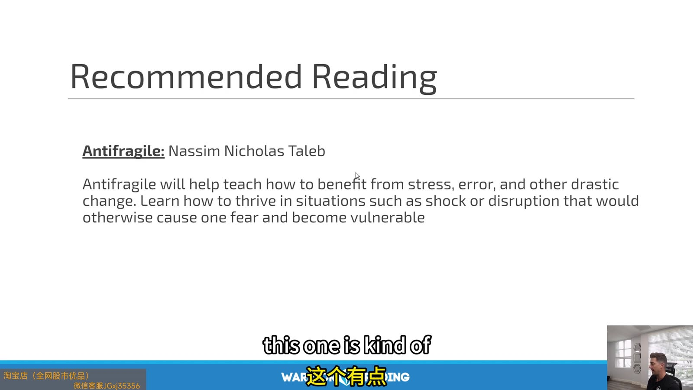

# Large Cap 06：Routine, Trading Business and Reading

> 对应视频：Chapter 13–14
> 本节重点：日常流程的作用是减少临场决定；记录用于验证 edge。推荐阅读只能提供模型，不能替代自己的交易数据。

## 1. Road to routine：先写 avoid list



**图怎么看：**

- Slide 建议避开无效催化剂、低成交量、价格极高或午间才出现的 gap。
- 这些是课程作者的过滤条件，应根据自己的策略验证。
- No-trade list 通常比继续增加 setup 更能减少随机亏损。
- “价格数百美元”本身不是风险；关键是波动、spread 与每股 stop，可通过更少股数处理。

## 2. Maintain trading records



**图怎么看：**

- Slide 强调用记录寻找 strength/weakness 并改进策略。
- Broker P&L 只告诉结果，不告诉 setup、rule、context 与过程。
- 每次修改策略要保存 version 和生效日，避免把不同规则混合统计。
- 复盘需要包括 skipped trades 和 no-trade decisions，不只成交。

## 3. Daily routine

盘前：

- 检查 positions/open orders；
- 宏观与 earnings calendar；
- market/sector overnight；
- candidate catalyst；
- daily/premarket levels；
- bullish/bearish/no-trade scenarios；
- risk limits 与 size。

盘中：

- 只交易计划标的或符合 scanner rules 的新候选；
- 下单前口述 trigger/stop/target；
- 达 daily stop 后 lockout；
- 记录异常，不即时重写策略。

盘后：

- 对账 fills/fees；
- 保存 entry 前与 exit 后截图；
- 标 rule adherence；
- 写一条可操作改进；
- 不在单笔情绪下改参数。

## 4. Trading as business

“Business” 应理解为：

- 有资本预算；
- 有明确风险上限；
- 有记录和版本；
- 分离研究与执行；
- 评估成本与机会成本；
- 做税务/合规确认；
- 有灾难恢复。

它不意味着利润稳定、可以靠每日目标发工资，或所有费用都能税前扣除。

## 5. 推荐书的边界



**图怎么看：**

- Slide 推荐 Steve Nison 的 candlestick 内容，重点是理解 K 线语言。
- Candle 名字是压缩 OHLC 路径的标签，不应作为孤立买卖信号。
- 不同市场、周期和 trend context 下，同一 candle 结果不同。
- 阅读后把定义转换成可回测条件，不背图鉴。



**图怎么看：**

- Slide 把 antifragility 与从压力、错误和冲击中受益联系起来。
- 交易系统不能仅靠励志概念；首先要避免 ruin，再谈利用波动。
- 小而可控的实验、defined downside 与可恢复错误更接近实用含义。
- 不能用“反脆弱”合理化无限摊平或承受一次巨大尾部亏损。

## 6. 阅读转化模板

每读一个概念，写：

```text
claim:
operational definition:
market/universe:
entry:
invalidation:
sample needed:
failure cases:
result:
```

没有 operational definition 的概念只留在研究笔记，不进入 live plan。

## 7. Weekly review

每周固定回答：

- 哪个 setup 扣费后贡献最大；
- 哪个时间段亏损；
- 亏损来自正常方差还是违规；
- 实际 stop/slippage 是否超预算；
- 市场 regime 是否改变；
- no-trade filter 拦住了什么；
- 下周只改哪一个变量；
- 哪些内容需要更多样本而不是立即结论。

## 8. Monthly business review

```text
gross P&L
- commissions / fees
- data / software
- borrow / interest
= trading net
```

再比较：

- drawdown；
- capital at risk；
- hours；
- tax reserve；
- alternative benchmark；
- strategy capacity。

这比“这个月绿色”更接近真实经营结果。
