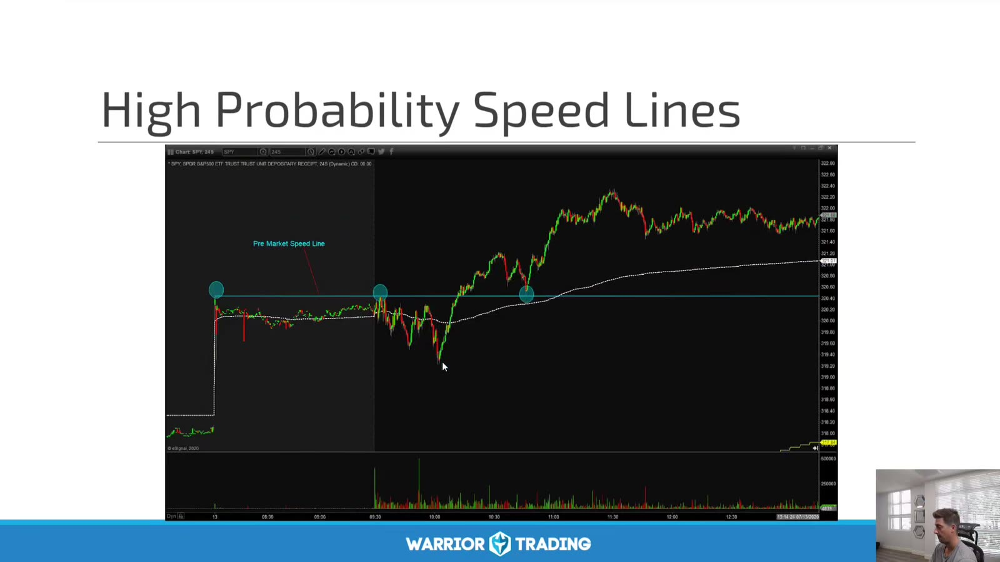
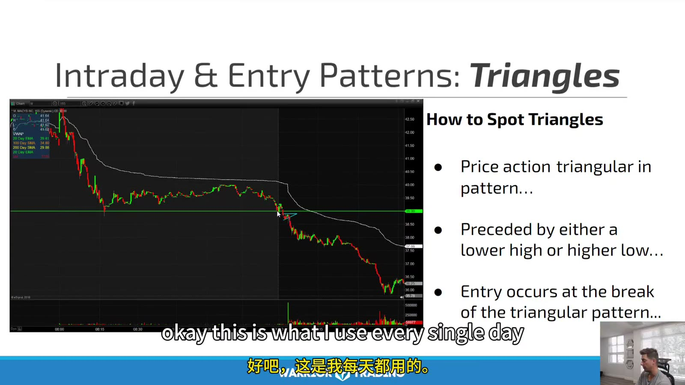
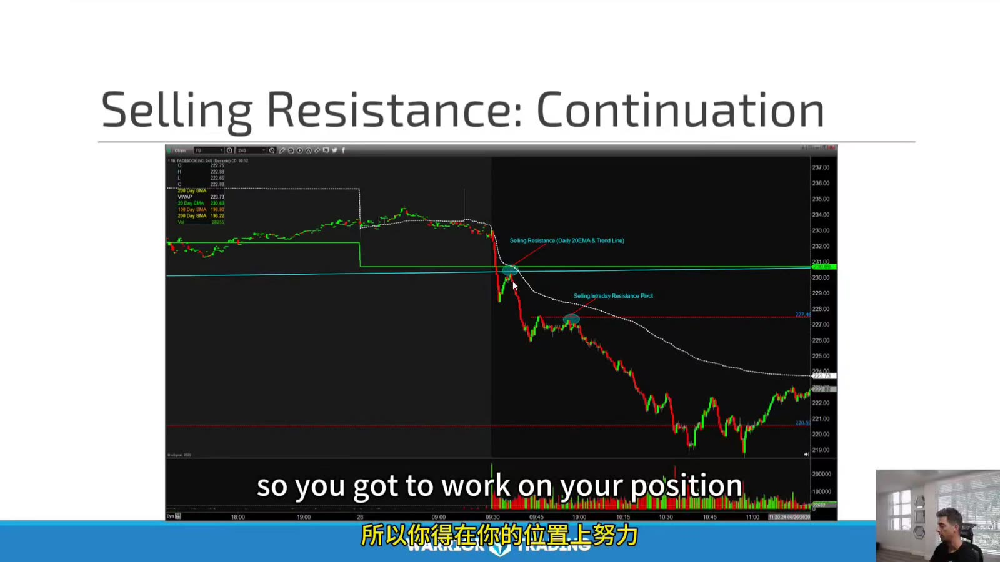
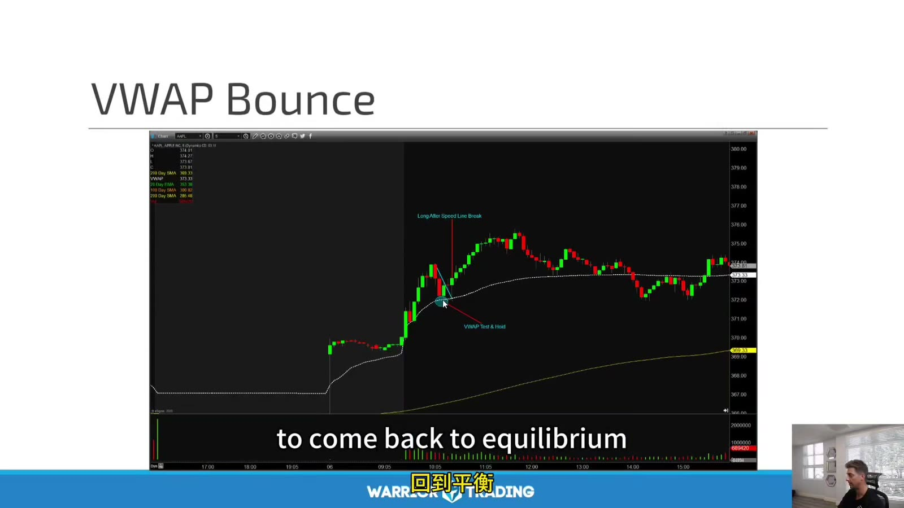

# Large Cap 07：Intraday Entry and Technical Strategies

> 对应视频：Chapter 8–9
> 本节重点：Entry pattern 负责把结构转成触发；technical strategy 负责定义方向、目标与失效。不要把事后画出的线当作实时精确预测。

## 1. High-probability speed line



**图怎么看：**

- 图中把开盘前后的高点连成水平/斜向参考，价格跌破后又强力收回并上行。
- “High probability” 是课程命名，不是已给出统计概率。
- Line 的锚点与最少触及次数必须预先规定，否则可在任何走势上事后贴合。
- 真正触发是 break、reclaim 或 retest response，不是线本身。

## 2. Triangle



**图怎么看：**

- 图中价格振幅收缩，上下边界逐渐靠近；entry 位于离开 triangle 的一侧。
- Triangle 前应有 context，例如 lower high 或 higher low；孤立收缩没有方向。
- 靠近 apex 时空间小、假突破多，必须看下一结构位。
- Breakout 后 acceptance/retest 比单个 wick 更可靠。

## 3. Selling resistance：continuation



**图怎么看：**

- 价格在 resistance 附近受阻，跌破后沿趋势继续下行。
- Short entry 可以是 rejection、breakdown 或 failed retest，三者风险不同。
- Stop 参考 resistance 上方或 failed-retest high。
- 下方 major support/pocket end 决定 target；不能因趋势漂亮无限持有。

## 4. VWAP bounce



**图怎么看：**

- 价格 gap/冲高后回落到 VWAP 附近出现买盘反应，随后恢复。
- VWAP 是当日成交量加权均价，不是自然支撑。
- Entry 需要 rejection candle、higher low 或 reclaim；第一次触碰未必有效。
- 如果价格在 VWAP 下方形成 acceptance，bounce thesis 失效。

## 5. Entry pattern 统一字段

```text
context: trend/reversal, macro level
pattern: triangle/retest/rejection
trigger: exact price event
acceptance: N seconds/bars
stop: structure invalidation
target: next pocket/level
max limit:
time stop:
```

不允许只写 “看起来要突破”。

## 6. Anticipation、confirmation、retest

| Entry | 优点 | 缺点 |
|---|---|---|
| Anticipation | 价格好、stop 近 | 方向未确认 |
| Confirmation | 趋势已启动 | 容易追价 |
| Retest | 可验证 acceptance | 可能不给机会 |

每种单独统计。不能拿 anticipation 的低价与 retest 的高胜率组成一个不存在的策略。

## 7. Large-cap short 的额外条件

- borrow/ETB 状态；
- SSR；
- dividend 与 corporate event；
- sector/index beta；
- squeeze catalyst；
- closing auction；
- overnight risk（若不平仓）。

流动性高降低部分执行风险，但 news squeeze 仍可显著 gap。

## 8. VWAP 与 resistance 的组合

例如 stock 在 daily resistance 下方、盘中又跌破 VWAP：

- 两个参考都来自价格与成交路径，相关性很高；
- 应写成一个 hypothesis：“daily rejection + intraday weakness”；
- Stop 可放在 VWAP reclaim 或 daily level 上方，取决于交易周期；
- 目标先看 intraday low，再看更大 pocket；
- 不能把两个标签当作两倍胜率。

## 9. 复盘

保存 entry 前后各一张图，并标：

- 当时已经可见的线；
- 哪些是事后新增；
- actual fill；
- first retest；
- 1R/2R；
- false break duration；
- market/sector；
- volume profile；
- 未成交或 skipped trade。

只有保留当时画面，才能判断自己是在识别结构还是解释结果。
