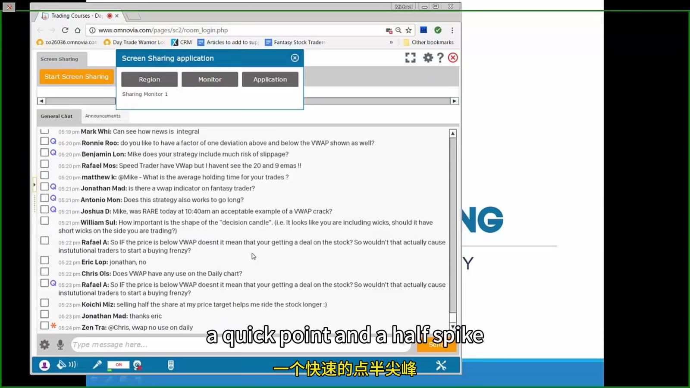
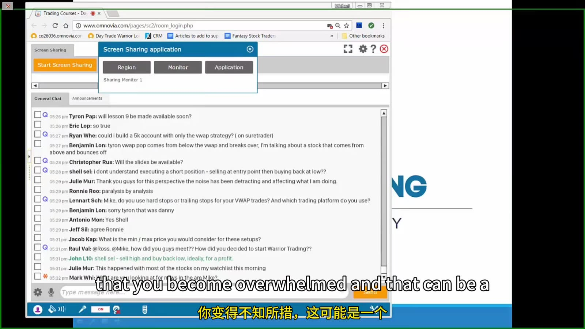
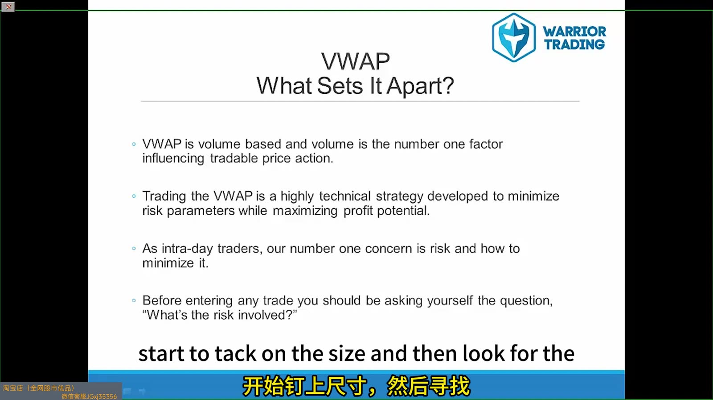
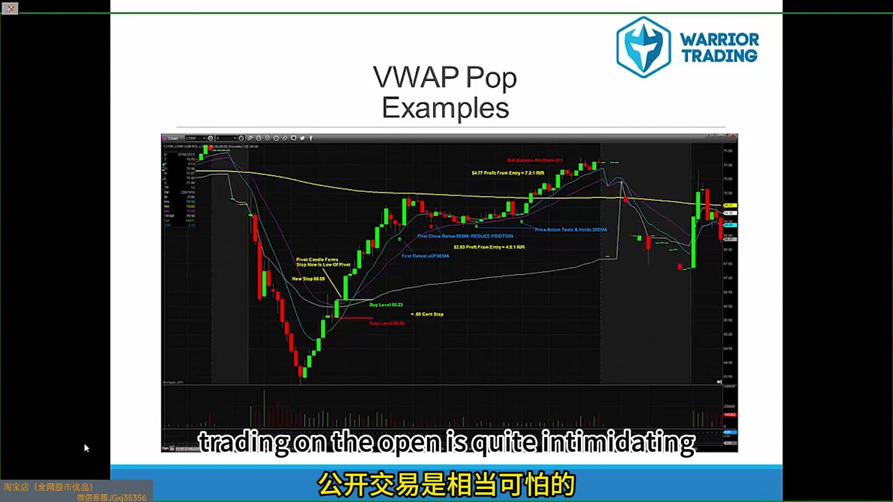

# Large Cap 08：VWAP Framework and FAQ

> 对应视频：VWAP Course 与 FAQ
> 本节重点：VWAP 是 session 内的成交量加权均价。它可作为均衡参考，但不是单独策略；entry 仍需结合 trend、level、volume 与 price response。

## 1. FAQ 的价值：暴露规则模糊处



**图怎么看：**

- 画面是在线问答列表，问题涉及 entry、假突破、stop、platform 等。
- 多人反复问同一问题，通常说明策略定义还不够 operational。
- FAQ 答案是补充说明，不应覆盖预先写好的风险上限。
- 把每个问题转成 playbook 的明确规则，避免下次再靠临场问。

## 2. 把 FAQ 分类



**图怎么看：**

- 问题数量很多，容易让学习者把例外越堆越多。
- 分类为 selection、entry、stop、target、platform、psychology 六类更易维护。
- 同一规则遇到大量例外时，应缩小适用市场，而不是不断补丁。
- 答案必须落到可测试条件，例如 “收回 VWAP 后保持两根 1m K”。

## 3. VWAP 的定义

典型 session VWAP：

```text
VWAP = Σ(price_i × volume_i) / Σ(volume_i)
```

平台可能用 tick、trade 或 bar 近似，也可能选择 typical price。必须确认：

- session 从何时开始；
- 是否包含盘前；
- corporate action 调整；
- 数据源；
- anchored VWAP 是否另算；
- 多日 chart 是否每天 reset。

## 4. VWAP 与普通 moving average



**图怎么看：**

- Slide 强调 VWAP volume-weighted，并把它用于风险最小化。
- Volume weighting 只是计算差异，不保证比任何均线更能预测价格。
- VWAP 反映已发生交易的平均成本参考，不能看见隐藏意图。
- 风险是否更小取决于 stop distance、structure 和 execution。

## 5. VWAP pop



**图怎么看：**

- 图中价格从 VWAP 下方收回后加速上涨，也有冲高后重新回落的路径。
- Pop trigger 应定义为 reclaim、first pullback 或 break micro high。
- 若 entry 已离 VWAP 很远，stop 到 VWAP 的风险可能过大。
- 开盘附近 VWAP 样本少、变化快，不能把早期数值当稳定均衡。

## 6. 四种 VWAP setup

| Setup | Context | Trigger | Invalidation |
|---|---|---|---|
| Bounce | 上方强势回撤 | VWAP 反应 + higher low | 接受在 VWAP 下 |
| Reclaim/pop | 从下向上恢复 | reclaim + hold | 跌回并破 micro low |
| Rejection/fade | 下方弱势反弹 | lower high/破 micro low | 接受在 VWAP 上 |
| Break-and-retest | 趋势转换 | break 后 retest | retest 失败 |

每种单独统计。

## 7. Open 与 later session

开盘：

- VWAP 数据少；
- spread/volatility 大；
- catalyst repricing；
- first cross 噪声高。

午后：

- VWAP 更稳定；
- volume 低；
- 多次 cross 可能表示 range；
- closing flow 会改变。

同一规则不能默认跨时段有效。

## 8. VWAP response 的证据

比 “碰线” 更强的观察：

- 回撤到 VWAP 时 volume 收缩；
- 出现 rejection wick 后破 high；
- Level 2/prints 显示实际成交但价格不再下行；
- retest 守住；
- market/sector 同向；
- 上方有足够 pocket。

但这些信号相关，仍需长期样本。

## 9. Stop 设计

三种 stop：

1. VWAP 另一侧固定 buffer；
2. 最近 swing low/high；
3. acceptance stop：在另一侧保持 N bars。

固定 buffer 简单但不适应波动；swing stop 结构合理但可能较远；acceptance stop 减少 wick 止损却增加平均损失。用 MAE 分布比较。

## 10. 常见失败

- VWAP 横向、价格反复穿越；
- 开盘 first cross；
- 重大 news 直接重估；
- 大盘与 sector 强烈反向；
- 假 reclaim 后立即 flush；
- entry 离 VWAP 太远；
- 把 long loser 等待 VWAP 当成 swing；
- anchored VWAP 与 session VWAP 混淆。

## 11. VWAP 日志

```text
VWAP setup type
session start/config
time of day
distance from VWAP at entry
VWAP slope
number of prior crosses
relative volume
market/sector
trigger/stop
acceptance duration
MFE/MAE
fees/slippage
```

FAQ 的最终答案不应是更多口头规则，而是一套能从日志中验证的明确边界。
