# Advanced Mentor Sessions：2018

> 30 场，合计 24.5 小时。返回 [Advanced Mentor Sessions 目录](../README.md)。

## v0690：高级交易策略回顾

> 日期：2018-07-12　·　时长：00:33:18

**本场重点：** 迪士尼和LB的交易策略，识别价格反转的关键信号。

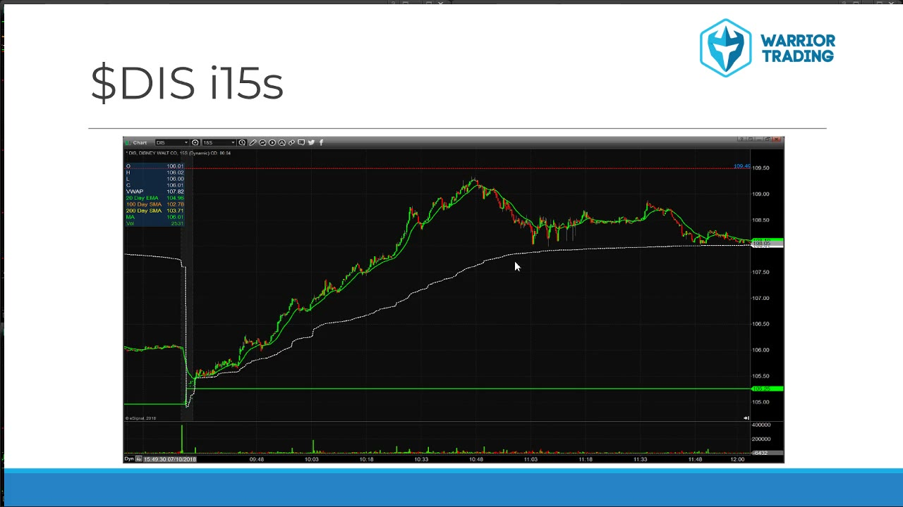

**图怎么看：**

- 这张图表显示了迪士尼股票（$DIS）在15分钟周期内的价格走势。
- 可以看到价格从高点下跌，随后出现反弹。
- 成交量柱的高度反映对应周期内的总成交量；红绿着色通常跟随价格柱的涨跌规则，不能直接拆成两种方向的主动成交。
- 均线（MA）显示出价格的趋势方向，当前价格低于短期均线，表明市场可能继续下跌。

### 关键内容

- 迪士尼和LB的交易均基于价格反转，但需注意市场波动性。
- 迪士尼的交易成功，而LB的交易则未达到预期。
- 迪士尼和LB的交易展示了如何利用价格反转进行交易。

### 分析与执行顺序

1. 首先，观察迪士尼股价在10950点位的反弹和回落，确认价格反转信号。
2. 然后，在15秒图表上观察迪士尼股价的波动，确认价格反转的关键信号。
3. 接着，观察LB股价在3350点位附近的支撑情况，确认支撑水平。
4. 最后，根据价格反转信号进行交易，注意市场波动性和交易风险。
5. 总结，迪士尼和LB的交易展示了如何利用价格反转进行交易，但需注意市场波动性

### 案例与细节

- 迪士尼股价在10950点位出现强劲反弹，随后回落，形成价格反转信号。
- LB股价在3350点位附近形成支撑，但未能突破，显示市场力量。
- 使用15秒图表来识别价格反转的关键信号，提高交易准确性。
- 迪士尼的交易成功，从10930点位卖出，获利约1点。
- LB的交易未达到预期，从3360点位卖出，但市场回升，导致亏损

### 风险与边界

- 夏季市场通常较为平静，交易机会较少，需要耐心等待。
- 使用技术指标确认支撑和阻力水平，提高交易决策的可靠性。
- 迪士尼和LB的交易展示了如何利用价格反转进行交易，但需注意市场波动性。
- 使用市场可执行限价订单（Marketable Limit Order）确保交易执行准确。

### 复盘问题

- 迪士尼和LB的交易分别基于哪些价格反转信号？
- 如何使用15秒图表来识别价格反转的关键信号？
- 迪士尼和LB的交易分别取得了怎样的结果？
- 如何使用技术指标确认支撑和阻力水平？
- 夏季市场通常较为平静，这对交易策略有何影响？

---

## v0691：有效执行交易

> 日期：2018-07-25　·　时长：01:03:37

**本场重点：** 交易执行的关键在于计划、风险评估和价格观察，情绪管理至关重要。

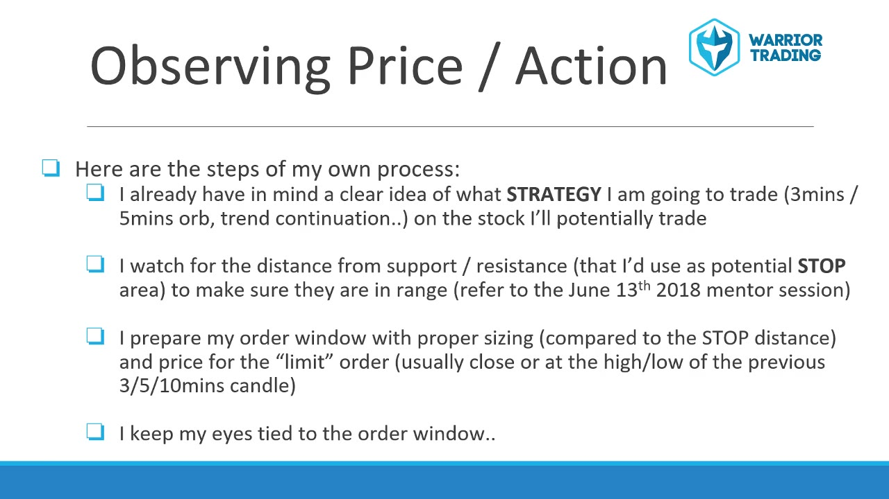

**图怎么看：**

- 在股票交易中，我已明确知道要进行哪种策略（3分钟/5分钟或趋势延续）。
- 我关注支撑/阻力的距离，以确保它们处于安全范围内。
- 我准备订单窗口，大小合适，并设定限价单的价格。
- 我密切关注订单窗口，以便及时调整止损和止盈点。

### 关键内容

- 交易执行是策略成功的核心，需要制定详细的计划。
- 风险评估包括确认交易策略、止损位置和目标价格。
- 价格观察是执行交易前的最后一环，确保风险回报比合理。
- 情绪管理影响交易决策，需保持冷静。
- 交易执行过程中需不断调整风险和收益。
- 使用限价订单可以减少滑点，但需根据市场情况灵活调整。
- 交易执行需结合技术分析和市场经验，形成个人习惯。
- 交易执行过程中的关键步骤包括计划、识别模式、寻找入场点和执行交易。
- 交易后需进行回顾，以改进未来交易策略

### 分析与执行顺序

1. 首先，制定交易计划，包括选择交易策略、设定止损和目标价格。
2. 其次，识别正确的交易模式，确保符合既定策略。
3. 然后，寻找潜在的价格区域以确定入场点。
4. 接着，评估风险和回报，确保交易具有合理的风险回报比。
5. 最后，执行交易，监控价格变动，及时调整止损和目标价格。
6. 交易后进行回顾，总结经验教训，改进交易策略

### 案例与细节

- 在交易NLSN时，发现价格异常波动，导致限价单被填在预期价格之上。
- 使用限价单在2180价位下单，实际被填在2201价位，表明市场存在意外波动。
- 通过观察价格走势，及时调整止损和目标价格，确保交易策略的有效性。
- 在交易过程中，使用三个不同的订单窗口来监控和执行多只股票的交易。
- 在交易NLSN时，发现价格在短时间内大幅波动，导致交易结果出现偏差

### 风险与边界

- 交易执行过程中可能遇到市场波动，导致交易结果不符合预期。
- 情绪波动会影响交易决策，可能导致错误的交易执行。
- 交易策略的有效性依赖于市场环境的变化，需不断调整。
- 交易执行过程中的滑点风险，可能影响交易结果。
- 交易执行依赖于个人经验和市场理解，不同人可能有不同的执行方式

### 复盘问题

- 在交易执行过程中，如何确保风险和回报比合理？
- 在交易后，如何进行有效的回顾和总结经验教训？
- 在交易过程中，如何应对市场波动带来的不确定性？

---

## v0692：分析主要市场指数

> 日期：2018-07-26　·　时长：00:53:35

**本场重点：** 掌握主要市场指数的分析方法，以指导交易决策。适用于大型股票市场的交易者。

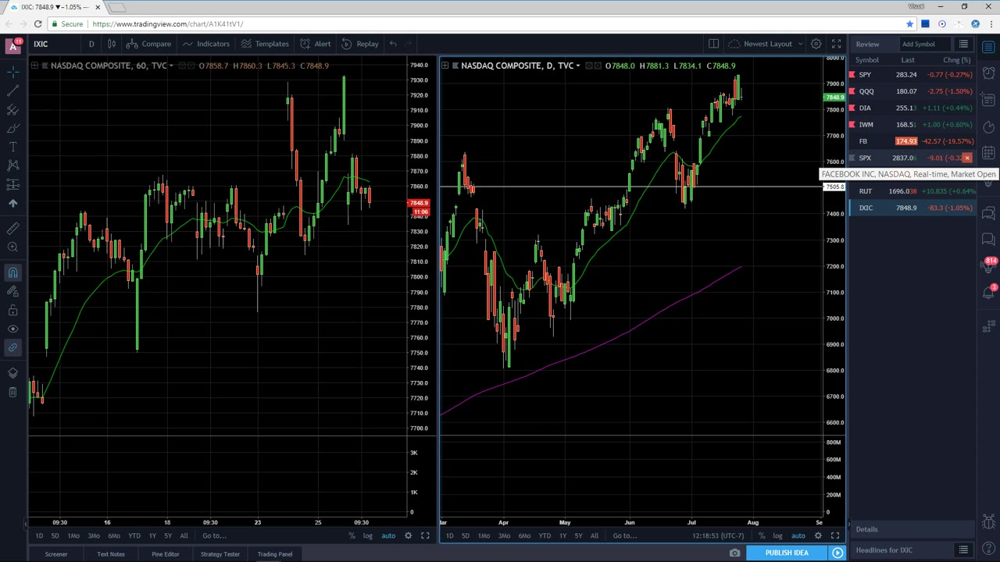

**图怎么看：**

- 这张图表显示了纳斯达克综合指数（NASDAQ Composite）的日线图，可以看到指数在2015年7月至8月期间的波动情况。
- 图表上标有水平线，可能表示支撑位和阻力位。
- 成交量柱的高度反映对应周期内的总成交量；红绿着色通常跟随价格柱的涨跌规则，不能直接拆成两种方向的主动成交。
- 从图表中可以看出，指数在2015年7月到8月期间经历了明显的上涨趋势。

### 关键内容

- 市场指数是代表特定市场部分的股票平均值，通过价格计算得出。
- S&P 500是最重要的市场指数之一，代表美国500家最大公司的表现。
- 不同指数的权重方式不同，影响其表现和解读。
- 分析主要市场指数有助于判断市场整体趋势，决定是否做多、做空或观望。
- 技术形态如突破、回调等，可以作为交易信号。
- NASDAQ在科技股表现强劲时，通常领先于其他指数。
- 跟踪主要市场指数有助于识别市场不同板块的相对强弱。
- 市场环境变化会影响指数的表现，如经济事件和政策变动。
- 使用图表工具（如TradingView）进行实时分析，减少延迟。
- 分析主要市场指数需要长期视角，但也能提供短期交易机会

### 分析与执行顺序

1. 首先介绍市场指数的概念及其计算方法。
2. 然后讲解S&P 500、Dow Jones、NASDAQ和Russell 2000等主要指数的特点。
3. 接着分析这些指数之间的关系及其对市场的影响。
4. 最后通过实际案例展示如何利用这些指数进行交易决策。
5. 在整个过程中，强调分析的主要目的是帮助交易者做出更明智的决策

### 案例与细节

- S&P 500在2018年2月经历大幅修正后，未能突破新高，而NASDAQ则迅速突破。
- 当Facebook发布负面财报后，NASDAQ出现大幅下跌，而S&P 500则相对稳定。
- 当市场出现重大经济事件时，如美联储会议，主要指数会表现出显著波动。
- 使用TradingView平台实时监控主要指数，确保交易决策基于最新数据。
- 通过比较SPY和QQQ的走势，可以发现科技股的表现往往领先于大盘

### 风险与边界

- 市场环境变化可能导致主要指数的表现与预期不符。
- 技术形态的解读存在主观性，不同交易者可能有不同的看法。
- 主要市场指数的分析依赖于实时数据，数据延迟可能影响决策。
- 录制年代限制为2018年至2021年，期间市场环境和政策可能发生变化。
- 主要市场指数的表现受多种因素影响，包括宏观经济状况和政策变化

### 复盘问题

- 如何利用主要市场指数来判断市场整体趋势？
- 在分析主要市场指数时，需要注意哪些关键的技术形态？
- 如何利用不同指数之间的差异来识别市场不同板块的相对强弱？

---

## v0693：夏季市场波动与交易策略

> 日期：2018-08-02　·　时长：00:52:29

**本场重点：** 夏季市场波动大，交易机会少，需要耐心等待优质交易机会。

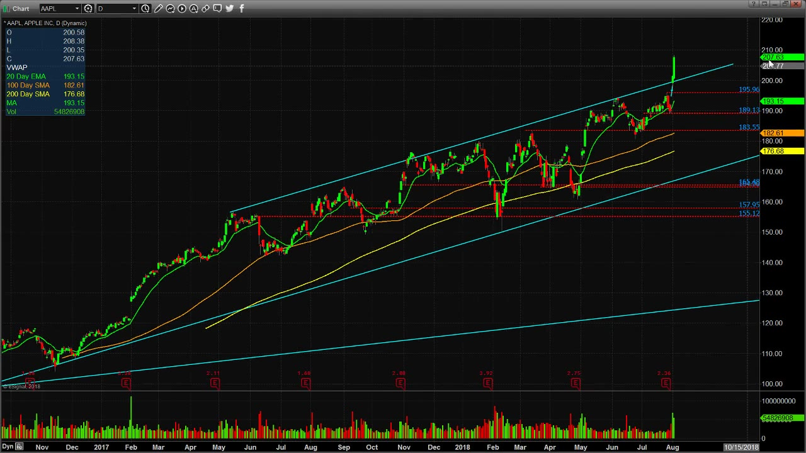

**图怎么看：**

- AAPL股票在2017年11月至2018年8月期间显示了明显的上升趋势。
- 图表上可以看到20日EMA、100日SMA和200日SMA等技术指标。
- 成交量柱显示了不同时间段的买卖活动。
- 整体来看，AAPL股票在这段时间内表现出强劲的上涨趋势。

### 关键内容

- 夏季市场成交量减少，价格波动性降低，交易机会稀少。
- Twitter的交易展示了如何利用支撑线进行短卖。
- 苹果和特斯拉等股票在午餐时间交易效果不佳。
- 交易者需要识别并避免无效的交易机会。
- 使用技术分析设定止损，避免随机交易。
- 保持交易纪律，避免过度交易。
- 夏季市场波动大，需要耐心等待更好的交易机会。
- 通过观察价格形态和趋势线来识别潜在的交易机会。
- 在市场波动小时段内，交易者应更加谨慎。
- 利用模拟器练习交易技能，提高耐心和决策能力

### 分析与执行顺序

1. 回顾上周交易表现，指出市场波动性大，难以捕捉有效交易机会。
2. 详细讲解Twitter的交易策略，包括入场点和止损设置。
3. 分析苹果和特斯拉等股票在午餐时间交易的效果不佳的原因。
4. 强调识别并避免无效交易机会的重要性。
5. 分享如何通过技术分析设定止损，避免随机交易的方法。
6. 提醒交易者在市场波动小时段内应更加谨慎，避免过度交易。
7. 鼓励交易者利用模拟器练习交易技能，提高耐心和决策能力

### 案例与细节

- Twitter的交易展示了如何利用支撑线进行短卖，包括在197点附近入场。
- 苹果在预市突破上升阻力线后，交易者选择在198.40点止损，以避免进一步下跌。
- 特斯拉在午餐时间交易效果不佳，因为市场波动性大，难以捕捉有效交易机会。
- 通过观察价格形态和趋势线，识别潜在的交易机会，如Twitter的支撑线和苹果的上升阻力线。
- 使用技术分析设定止损，避免随机交易，例如在苹果的交易中设定在198.40点止损。
- 在模拟器中练习交易技能，提高耐心和决策能力，如通过模拟交易来测试不同的交易策略

### 风险与边界

- 夏季市场成交量减少，可能导致交易机会稀少，需要耐心等待更好的交易机会。
- 午餐时间交易效果不佳，因为市场波动性大，难以捕捉有效交易机会。
- 过度交易可能导致资金损失，需要严格遵守止损规则。
- 市场环境不断变化，交易策略需要适时调整。
- 模拟交易虽然有助于提高技能，但实际市场与模拟环境存在差异，需谨慎对待

### 复盘问题

- 如何识别并避免无效的交易机会？
- 在夏季市场波动大时，如何制定有效的交易策略？
- 如何通过技术分析设定止损，避免随机交易？

---

## v0694：高级交易策略与案例分析

> 日期：2018-08-09　·　时长：00:33:57

**本场重点：** 通过分析Roku、Goose和Yelp等股票的交易机会，掌握预市价模式识别和快速入场技巧。

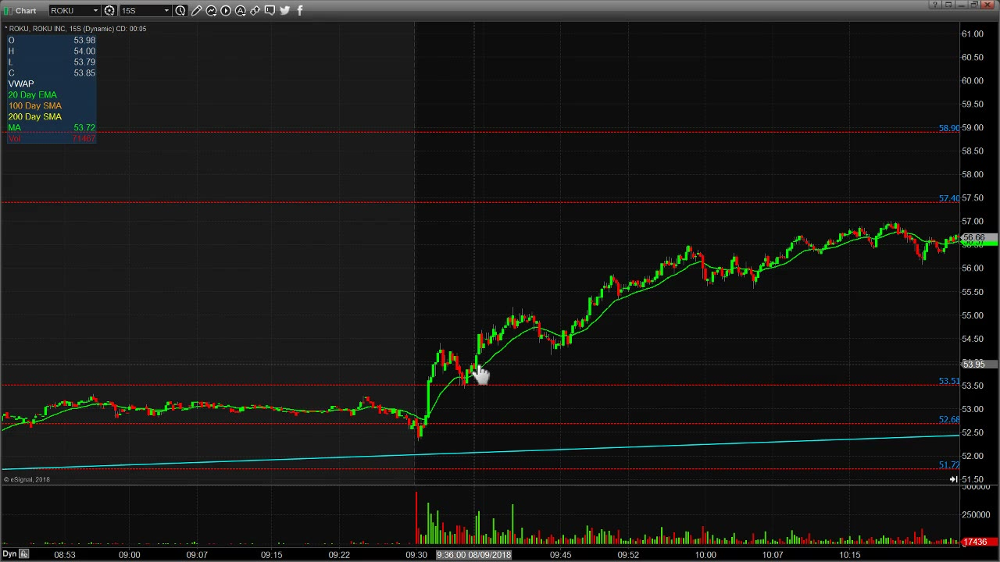

**图怎么看：**

- 这张截图显示了Roku公司的股价走势图，包括开盘价、最高价、最低价和收盘价。
- 图中还显示了移动平均线（MA）、EMA（20日、100日、200日）和成交量。
- 从图中可以看出，Roku的股价在一段时间内呈现上升趋势。
- 这些技术指标可以帮助投资者判断市场趋势和买卖时机。

### 关键内容

- Roku股票在预市价出现强劲上涨，突破20日均线，形成良好的交易机会。
- 使用15秒图表进行快速入场，结合VWAP（成交量加权平均价格）进行交易。
- 识别股票的支撑和阻力水平，利用这些水平进行交易决策。
- 通过记录自己的交易过程，可以更好地理解自己的交易行为。
- 在市场波动较大时，选择具有较强成交量的股票进行交易。
- 利用技术指标如VWAP来判断股票的买卖点。
- 在市场相对平静时，选择具有较强动能的股票进行交易

### 分析与执行顺序

1. 观察Roku股票在预市价的强劲上涨，突破20日均线，形成交易机会。
2. 使用15秒图表观察Goose股票的快速入场点，结合VWAP进行交易。
3. 分析Yelp股票的预市价模式，尽管有上升趋势，但成交量不足，需进一步确认。
4. 在市场波动较大时，保持耐心，设置止损以避免被反向波动影响。
5. 记录自己的交易过程，以便更好地理解自己的交易行为和决策过程

### 案例与细节

- Roku股票在预市价出现大缺口，突破20日均线，形成良好的交易机会。
- Goose股票在预市价出现大缺口，但成交量较小，形成潜在的交易机会。
- Yelp股票在预市价出现上升趋势，但成交量不足，需进一步确认。
- 使用15秒图表观察Roku股票的快速入场点，结合VWAP进行交易。
- 在市场波动较大时，选择具有较强成交量的股票进行交易，如Roku和Goose。
- 利用技术指标如VWAP来判断股票的买卖点，如Roku和Goose的交易机会

### 风险与边界

- 在市场波动较大时，选择具有较强成交量的股票进行交易，可能会错过一些快速交易机会。
- 在市场相对平静时，选择具有较强动能的股票进行交易，可能会面临较大的波动风险。
- 使用15秒图表进行快速入场，可能会因为图表时间较短而错过一些重要的交易信号。
- 在市场波动较大时，保持耐心，设置止损以避免被反向波动影响，可能会导致错过一些交易机会。
- 通过记录自己的交易过程，可以更好地理解自己的交易行为，但也可能因为过度分析而错失交易机会

### 复盘问题

- 在Roku股票的交易过程中，是如何识别快速入场点的？
- 在Goose股票的交易过程中，是如何利用预市价模式进行交易的？
- 在Yelp股票的交易过程中，是如何判断成交量不足的影响的？
- 在市场波动较大时，是如何设置止损以避免被反向波动影响的？
- 通过记录自己的交易过程，是如何更好地理解自己的交易行为的？

---

## v0695：高级交易策略回顾

> 日期：2018-08-16　·　时长：00:50:28

**本场重点：** 本周交易策略有效，但市场波动导致部分交易未达预期。

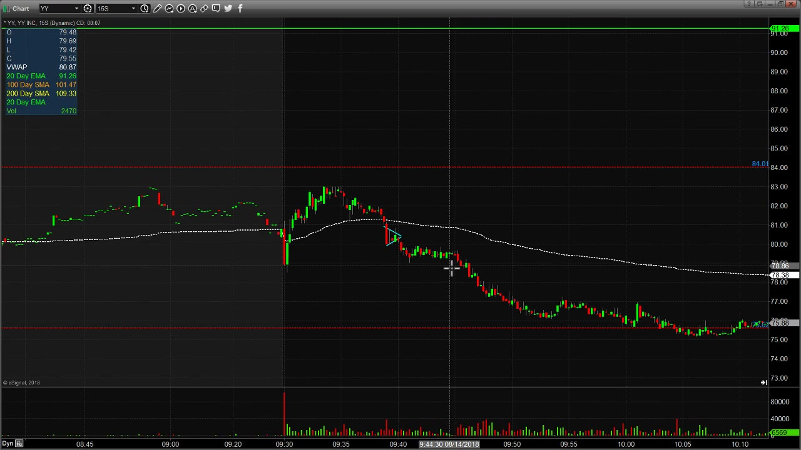

**图怎么看：**

- 这张图表显示了YY股票在15分钟周期下的价格走势。
- 可以看到20日EMA、100日SMA和200日SMA的移动平均线。
- 成交量柱的高度反映对应周期内的总成交量；红绿着色通常跟随价格柱的涨跌规则，不能直接拆成两种方向的主动成交。
- 当前价格在红色水平线附近波动，表明市场可能处于盘整状态。

### 关键内容

- 使用预市图表来识别趋势和交易机会，如NLSN和TAL的双顶形态。
- 在突破关键支撑位后进行短头交易，如TAL和CGC。
- 利用15秒图表确认交易信号，提高准确性。
- 设置合理的止损点以控制风险，如CGC和JD。
- 市场波动导致部分交易未能实现预期收益，如JD。
- 使用标准VWAP和5分钟EMA作为参考指标。
- 保持交易纪律，避免过度交易，如CGC和JD。
- 市场波动性增加时，交易策略需更加谨慎。
- 使用简单的缺口扫描器来筛选交易标的，如NLSN和TAL

### 分析与执行顺序

1. 周一至周三，通过预市图表识别交易机会，如NLSN和TAL的双顶形态。
2. 周二，利用TAL的突破支撑位进行短头交易，成功获利。
3. 周三，CGC的交易策略较为复杂，通过多次测试确认目标价。
4. 周四，市场波动导致部分交易未能实现预期收益，如JD。
5. 使用15秒图表确认交易信号，提高交易准确性，如CGC和JD的止损点设置

### 案例与细节

- NLSN：预市高开后迅速回落，形成双顶形态，成功进行短头交易。
- TAL：预市低开后反弹，突破支撑位，成功进行短头交易。
- CGC：预市高开后回落，形成硬性下跌趋势，成功进行短头交易。
- JD：预市高开后回落，形成明显的支撑位，但实际交易中未能突破，导致亏损。
- NLSN：预市高开后回落，形成双顶形态，成功进行短头交易，最终获利。
- TAL：预市低开后反弹，突破支撑位，成功进行短头交易，最终获利

### 风险与边界

- 市场波动性增加时，交易策略需更加谨慎，可能导致部分交易未能实现预期收益。
- 使用15秒图表确认交易信号，虽然提高了准确性，但也可能错过某些交易机会。
- 市场异常情况（如Macy's的交易中断）可能导致错过交易机会。
- 使用缺口扫描器筛选交易标的，虽然简单，但可能遗漏一些潜在的交易机会。

### 复盘问题

- 如何在市场波动性增加时调整交易策略？
- 如何利用预市图表识别交易机会？
- 如何在实际交易中应用15秒图表确认交易信号？
- 如何设置合理的止损点以控制风险？

---

## v0696：大型股技术分析

> 日期：2018-09-20　·　时长：00:44:08

**本场重点：** TLR、Tesla 和 MU 的技术分析，识别关键支撑阻力位，制定交易策略。

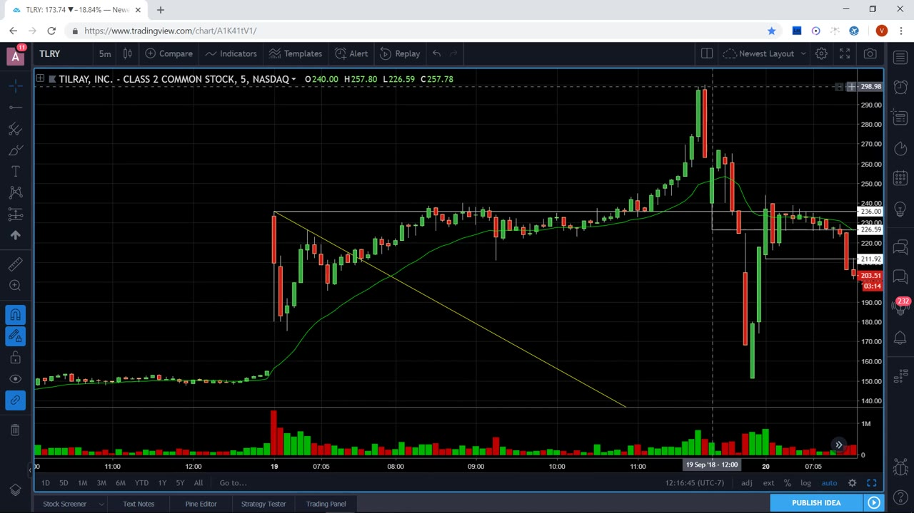

**图怎么看：**

- 特斯拉（TSLA）的技术分析图显示了股票价格在不同时间段内的波动情况。
- 图中可以看到特斯拉股票的价格在2018年期间经历了多次上升和下降。
- 图中的水平线表示支撑和阻力位，帮助投资者判断买卖时机。
- 通过观察价格趋势和支撑阻力位，可以制定相应的交易策略。

### 关键内容

- TLR 近期暴涨，从 $150 升至 $300，显示巨大波动性。
- Tesla 在 SEC 调查后出现大幅下跌，关键支撑位在 $277。
- MU 形成三底破位形态，触发卖盘。
- 使用期权利润计算器工具评估潜在回报和风险。
- TLR 在 $220 和 $235 入场，止损设在 $210 和 $220。
- Tesla 支撑位 $277 和阻力位 $291.42，表明市场重要水平。
- MU 三底破位后，支撑位 $46 成为关键阻力位。
- 期权利润计算器帮助计算潜在回报和风险。
- TLR 涨幅超过 100%，显示高风险高回报特性。
- MU 三底破位后，支撑位 $46 成为关键阻力位，表明市场重要水平。

### 分析与执行顺序

1. 分析 TLR 的五分钟图表，识别突破关键阻力位 291.42 的信号。
2. 确定 Tesla 的支撑位 $277 和阻力位 $291.42，作为交易参考。
3. 利用 MU 的三底破位形态，设定关键支撑位 $46 作为交易目标。
4. 使用期权利润计算器评估买入 $44 的看跌期权的潜在回报和风险。
5. 根据 TLR 的技术分析，制定入场和止损策略，包括 $220 和 $235 入场点。

### 案例与细节

- TLR 从 $150 涨至 $300，涨幅超过 100%，显示高波动性和高风险。
- Tesla 在 SEC 调查后，股价从 $291.42 下跌，验证了关键支撑位的重要性。
- MU 形成三底破位形态，支撑位 $46 成为关键阻力位，触发卖盘。
- 使用期权利润计算器，假设 MU 可能跌至 $42，计算 $44 看跌期权的潜在回报和风险。
- TLR 在 $220 和 $235 入场，止损设在 $210 和 $220，显示高风险高回报特性。

### 风险与边界

- TLR 和 Tesla 的高波动性可能导致快速反转，需谨慎管理风险。
- MU 的支撑位 $46 成为关键阻力位，表明市场重要水平，但需注意市场变化。
- 期权利润计算器基于历史数据，可能无法准确预测未来市场走势。
- 录制年代限制，当前市场条件可能与当时有所不同。

### 复盘问题

- TLR 的技术分析如何帮助识别入场和止损点？
- Tesla 的关键支撑位 $277 和阻力位 $291.42 如何影响交易决策？
- MU 的三底破位形态如何转化为关键阻力位 $46？
- 期权利润计算器如何帮助评估期权交易的风险和回报？
- 如何根据市场变化调整交易策略？

---

## v0697：技术分析与快速交易策略

> 日期：2018-09-27　·　时长：00:42:57

**本场重点：** 识别关键技术形态，利用快速交易策略捕捉市场波动，注意市场情绪和情绪化决策。

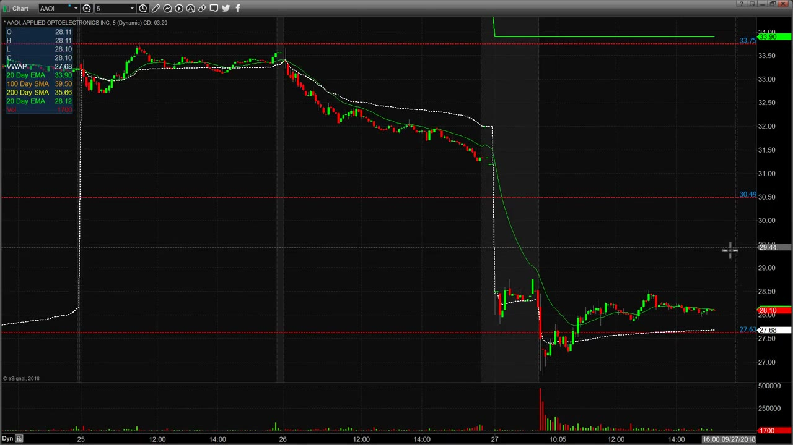

**图怎么看：**

- 这张图表显示了AAPL和SPDR S&P 500 ETF的K线图。
- AAPL的K线图显示了一个明显的下降趋势，而SPDR S&P 500 ETF则显示出上升趋势。
- AAPL的20日EMA在28.12附近，100日SMA在39.50附近，200日SMA在35.66附近。
- SPDR S&P 500 ETF的20日EMA在290.88附近，100日SMA在280.46附近，200日SMA在275.26附近。

### 关键内容

- BBBY股票出现大缺口下跌，显示强烈的技术卖压。
- AOI在预市低点失败，表明市场可能反转。
- 苹果股价形成旗形形态，预示潜在突破。
- 使用百分比止损策略，快速执行交易订单。
- 预市高点是判断趋势的重要参考点。
- 市场情绪影响交易决策，需谨慎对待。
- 技术形态和成交量是判断市场趋势的关键。
- 快速交易策略需要精确的入场和出场时机。
- 使用平台如LightSpeed进行自动化交易管理。

### 分析与执行顺序

1. 分析BBBY的每日图表，识别大缺口和趋势线。
2. 观察AOI在预市低点的失败，确认市场可能反转。
3. 查看苹果股价的旗形形态，预测可能的突破方向。
4. 设置百分比止损策略，确保快速执行交易订单。
5. 利用LightSpeed平台进行自动化交易管理，减少人为错误。
6. 监控市场动态，及时调整交易策略。
7. 保持纪律，遵守交易规则，避免情绪化交易

### 案例与细节

- BBBY在1550附近出现大缺口，随后测试该水平，显示强烈的卖压。
- AOI在预市低点失败，表明市场可能反转，未能突破关键支撑位。
- 苹果股价形成旗形形态，预示可能突破，实际突破发生在22430附近。
- 使用LightSpeed平台，设置1%、2%和4%的止损点，确保快速执行交易订单。
- 预市高点为9830，AOI未能形成有效突破，表明市场可能反转。
- BBBY和苹果的快速交易策略展示了如何利用技术形态和成交量捕捉市场波动

### 风险与边界

- 市场情绪波动可能导致交易决策失误。
- 技术形态失效时，交易策略可能失效。
- 使用自动化交易工具需要熟悉其功能和限制。
- 市场环境变化可能影响交易策略的有效性。
- 录制年代限制，当前市场环境可能与过去有所不同

### 复盘问题

- 如何识别关键的技术形态，如旗形和缺口？
- 在预市低点失败的股票，如何判断市场可能反转？
- 使用百分比止损策略时，如何确保快速执行交易订单？
- 如何利用LightSpeed平台进行自动化交易管理？
- 在快速交易策略中，如何保持纪律和避免情绪化交易？

---

## v0698：市场动量回归与交易策略

> 日期：2018-10-04　·　时长：00:37:07

**本场重点：** 今天市场动量回归，但因缺乏流动性而未进行交易；需谨慎选择交易时机。

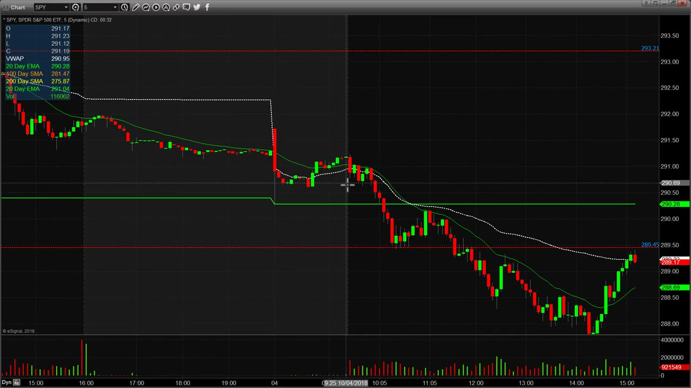

**图怎么看：**

- 画面中，我们可以看到GM股票的价格在下跌过程中，成交量逐渐减少。
- 这表明市场对GM股票的需求正在下降，可能预示着进一步的下跌。
- 同时，200日均线和100日均线都向下倾斜，进一步支持了当前的趋势。
- 因此，在这种情况下，投资者应保持谨慎，并考虑在价格反弹时再进行交易。

### 关键内容

- 今天市场表现出良好的动量，但因缺乏流动性而未进行交易。
- 市场在20日移动平均线下方波动，增加了交易风险。
- 通过观察图表，可以更好地理解市场趋势和交易机会。
- 使用技术指标和趋势线可以帮助识别交易信号。
- 市场动量回归，但需谨慎选择交易时机。
- 交易需要结合心理因素和风险控制。
- 使用E-Signal的热键功能可以提高交易效率。

### 分析与执行顺序

1. 观察市场动量，确认动量回归。
2. 分析MNK股价走势，确认支撑位。
3. 检查SPY指数在20日移动平均线附近的波动情况。
4. 评估市场流动性，确认成交量不足。
5. 使用技术指标和趋势线识别交易信号。
6. 结合心理因素和风险控制，制定交易策略。

### 案例与细节

- MNK股价在29美元附近形成支撑，但成交量不足，导致未能抓住机会。
- SPY指数在20日移动平均线附近反复被买入，增加了交易难度。
- MNK股价在2870美元附近形成短期支撑，但成交量不足，导致未能抓住机会。
- GM股价在2450美元附近形成支撑，但成交量不足，导致未能抓住机会。
- MNK股价在2720美元附近形成支撑，但成交量不足，导致未能抓住机会。

### 风险与边界

- 市场动量回归，但需谨慎选择交易时机，避免盲目跟风。
- 市场流动性不足，可能导致交易机会错过。
- 心理因素影响交易决策，需保持冷静。
- 录制年代限制，当前市场环境可能与过去有所不同。

### 复盘问题

- 今天市场动量回归，但为何未进行交易？
- 如何通过观察图表来识别交易机会？
- 使用E-Signal的热键功能有哪些优势？
- 如何结合心理因素和风险控制制定交易策略？

---

## v0699：使用速度线进行日内交易

> 日期：2018-10-18　·　时长：00:44:51

**本场重点：** 使用速度线进行日内交易，结合宏观趋势和快速数据点，提高交易准确性。

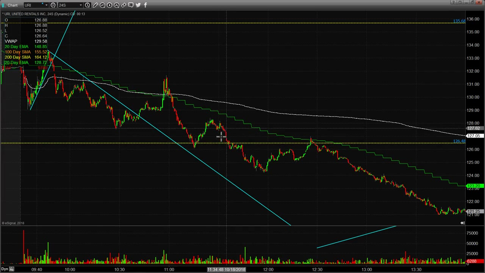

**图怎么看：**

- 画面中，可以看到一个股票的价格走势图，其中包含了速度线（蓝色线条）。
- 速度线显示了价格运动的趋势方向，帮助交易者判断市场可能的方向。
- 通过结合速度线和其他技术指标，如均线和成交量，可以更准确地预测价格走势。
- 成交量柱的高度反映对应周期内的总成交量；红绿着色通常跟随价格柱的涨跌规则，不能直接拆成两种方向的主动成交。

### 关键内容

- 速度线适用于日内交易，但不适合长期趋势分析。
- IBM股票的交易实例展示了如何使用速度线进行交易。
- 使用速度线时，需要关注价格突破后的确认动作。

### 分析与执行顺序

1. 使用30秒时间框架内的快速数据点来绘制速度线，捕捉价格波动。
2. 当价格突破速度线时，可以作为入场信号，低风险进入。
3. 结合宏观趋势和快速数据点，提高交易决策的准确性。
4. 使用速度线作为止损点，确保交易策略的稳健性。
5. 在快速时间框架内，价格动作更为频繁，需要快速反应。
6. 使用速度线时，需要结合其他技术指标，如支撑位和阻力位。
7. 结合快速数据点和宏观趋势，可以提高交易成功率

### 案例与细节

- IBM股票在30秒时间框架内的价格走势，展示如何使用速度线进行交易。
- 使用IBM股票的快速数据点绘制速度线，当价格突破速度线时，作为入场信号。
- 结合IBM股票的快速数据点和宏观趋势，提高交易决策的准确性。
- 使用IBM股票的速度线作为止损点，确保交易策略的稳健性。
- 在快速时间框架内，价格动作更为频繁，使用IBM股票的例子展示快速反应的重要性

### 风险与边界

- 使用速度线时，需要结合其他技术指标，否则可能无法准确判断市场走势。
- 在快速时间框架内，价格动作频繁，容易出现误判，需要谨慎操作。
- 录制年代限制，适用于2018年到2021年的市场环境，不适用于当前市场变化。
- 使用速度线时，需要关注价格突破后的确认动作，否则可能导致错误交易
- 结合快速数据点和宏观趋势时，需要实时监控市场动态，否则可能错过最佳交易机会

### 复盘问题

- 使用速度线进行交易时，如何确保决策的准确性？
- 结合快速数据点和宏观趋势时，有哪些关键因素需要考虑？
- 在快速时间框架内，如何快速做出正确的交易决策？

---

## v0700：强趋势与弱趋势的区别

> 日期：2018-10-25　·　时长：01:16:13

**本场重点：** 区分强趋势和弱趋势，了解何时采取何种策略，以及如何识别趋势类型。

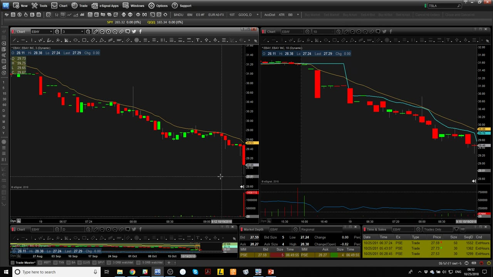

**图怎么看：**

- 在图C中，展示了多个股票的K线图，包括PYPL、EBAY、MOMO、CAT和IRBT，这些股票在不同日期（如10/19/2018和10/24/2018）显示了不同的趋势。
- 通过观察这些K线图，可以清楚地看出哪些股票的趋势较强，哪些较弱。
- 例如，PYPL和MOMO在10/19/2018显示为强趋势，而EBAY在同一天显示为弱趋势。
- 这种对比有助于投资者理解市场中的强弱趋势，从而做出更明智的投资决策。

### 关键内容

- 趋势交易是跟随现有价格走势，而不是与其对抗。
- 强趋势通常发生在开盘初期，伴随高成交量和高波动性。
- 弱趋势则发生在一天中的其他时段，伴随较低的成交量和较慢的价格移动。
- 强趋势需要快速反应，而弱趋势则需要更多耐心。
- 强趋势通常在开盘后几分钟内形成，而弱趋势则可能持续更长时间。
- 识别趋势的关键在于观察价格行动和成交量的变化。
- 强趋势和弱趋势的识别有助于制定更有效的交易策略。
- 交易者应根据自己的经验调整策略，以适应不同的市场环境。
- 强趋势和弱趋势的识别有助于降低交易风险，提高盈利机会

### 分析与执行顺序

1. 首先，回顾趋势交易的基本概念。
2. 接着，定义强趋势和弱趋势的具体特征。
3. 然后，通过实际案例展示如何识别这两种趋势。
4. 最后，强调识别趋势的重要性及其对交易策略的影响。
5. 在整个过程中，强调交易者应根据自己的经验进行调整，以适应不同的市场环境。

### 案例与细节

- ticker：TXT；date：2018年10月18日；description：开盘前出现大缺口，随后价格反弹，测试13分钟均线，但未能突破。这表明这是一个潜在的弱趋势。；analysis：开盘后价格迅速反弹，测试13分钟均线失败，表明这是一个弱趋势。
- ticker：PayPal；date：2018年10月19日；description：开盘后价格迅速上涨，但未能突破前一天的高点，形成弱趋势。；analysis：开盘后价格迅速上涨，但未能突破前一天的高点，形成弱趋势。
- ticker：eBay；date：2018年10月19日；description：开盘后出现大红烛，表明强趋势的可能性较低。随后价格测试13分钟均线失败，形成弱趋势。；analysis：开盘后出现大红烛，表明强趋势的可能性较低。随后价格测试13分钟均线失败，形成弱趋势。

### 风险与边界

- 强趋势和弱趋势的识别依赖于市场环境的变化，因此需要不断更新策略。
- 交易者应谨慎对待市场变化，避免过度依赖单一指标。
- 录制年代限制为2018年至2021年，期间市场环境可能有所变化。

### 复盘问题

- 如何识别强趋势和弱趋势？
- 在实际交易中，如何根据市场情况调整交易策略？
- 强趋势和弱趋势的识别对交易结果有何影响？

---

## v0701：交易杠杆ETF

> 日期：2018-10-31　·　时长：00:55:49

**本场重点：** 理解杠杆ETF的作用，掌握正确的交易策略，注意风险控制。

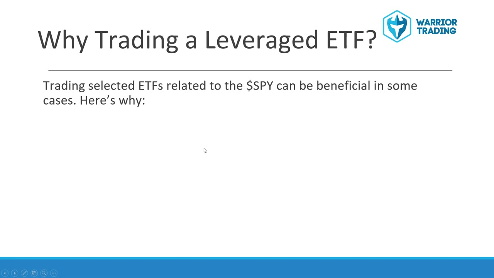

**图怎么看：**

- 这张幻灯片解释了为什么在某些情况下，交易与$SPY相关的杠杆ETF是有益的。
- 幻灯片上显示了两个图表，左侧是一个杠杆ETF的图表，右侧是$SPY指数的图表。
- 左侧图表显示了杠杆ETF的价格波动，右侧图表显示了$SPY指数的价格波动。
- 通过对比这两个图表，可以分析杠杆ETF如何影响市场表现。

### 关键内容

- ETF是一种可交易的证券，跟踪特定指数、商品或资产组合。
- TVIX是跟踪SPY两倍日回报的杠杆ETF，具有更高的波动性和潜在收益。
- TVIX的交易价格范围较广，适合小额账户进行交易。
- TVIX与SPY存在反向相关性，适合做多SPY下跌时。
- TVIX的交易需要密切关注SPY的技术走势，而不是直接跟随TVIX的走势。
- TVIX的交易风险较高，需要严格的风险管理。
- TVIX的交易需要根据市场情况灵活调整，避免长期持有亏损头寸。
- TVIX的交易需要考虑市场趋势，如熊市到来时的应对策略。

### 分析与执行顺序

1. 首先介绍ETF的基本概念，包括定义和运作方式。
2. 然后介绍TVIX的具体运作方式及其特点。
3. 接着通过实际案例展示TVIX在市场大幅波动时的表现。
4. 进一步解释TVIX与SPY之间的反向相关性及其交易策略。
5. 最后强调TVIX交易的风险管理，包括止损和风险管理的重要性。

### 案例与细节

- TVIX在10月10日开盘前出现大幅卖压，但随后反弹，显示了其高波动性。
- 10月10日，SPY下跌8点，而TVIX上涨9点，显示出两倍的回报率。
- 10月11日，SPY继续下跌，TVIX则反弹，显示了反向相关性。
- TVIX在10月10日开盘后迅速反弹，但随后再次下跌，显示了其高波动性。
- TVIX在10月10日开盘后的15分钟内，从25500点跌至25200点，显示了其快速波动的特点。

### 风险与边界

- TVIX的交易风险较高，长期持有亏损头寸可能导致更大损失。
- TVIX的交易需要密切关注市场趋势，避免盲目跟风。
- TVIX的交易需要严格的风险管理，包括设置止损和止盈。
- TVIX的交易需要考虑市场环境，如熊市到来时的应对策略。
- TVIX的交易需要关注技术指标，如13EMA和VWAP的支撑作用。

### 复盘问题

- 在交易TVIX时，如何确定正确的入场点？
- 在交易TVIX时，如何平衡风险和收益？
- 在交易TVIX时，如何处理市场波动带来的不确定性？

---

## v0702：不频繁交易的重要性

> 日期：2018-11-01　·　时长：00:44:03

**本场重点：** 不频繁交易可以减少风险，提高盈利概率。但需要耐心等待高质量的交易机会。

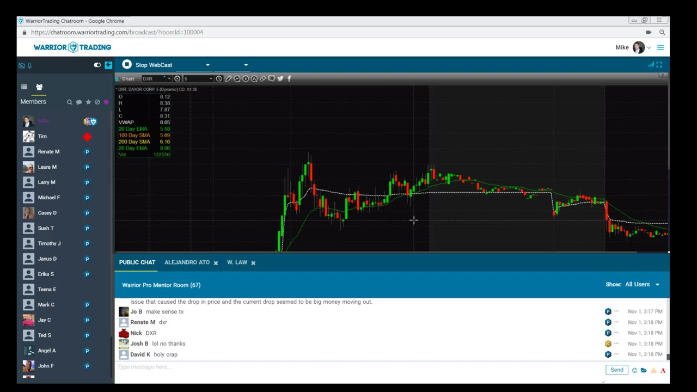

**图怎么看：**

- 在图表中可以看到DAIR股票的价格走势，显示了多个重要的技术指标，如移动平均线（EMA）、短期和长期移动平均线。
- 成交量柱的高度反映对应周期内的总成交量；红绿着色通常跟随价格柱的涨跌规则，不能直接拆成两种方向的主动成交。
- 图表下方的聊天区显示了参与者之间的讨论，他们对当前市场动态进行了评论和分析。
- 通过观察图表和聊天区的互动，可以理解投资者如何根据技术指标做出决策，并讨论市场趋势和策略。

### 关键内容

- 讲师指出，W股票的图表显示价格波动剧烈，缺乏明确的技术突破，不适合交易。
- 通过分析W股票的图表，讲师强调了技术分析的重要性，以及如何识别高概率低风险的交易机会。
- 讲师提到，如果在W股票上进行交易，可能会被市场波动影响，导致亏损。
- 讲师强调，耐心等待高质量的交易机会是关键，而不是频繁交易。
- 通过W股票的例子，讲师展示了如何识别和等待高概率低风险的交易机会。
- 讲师指出，如果不能识别和等待这些高质量的交易机会，可能会导致亏损。
- 讲师提到，通过等待高质量的交易机会，可以减少风险并提高盈利概率。
- 讲师强调，耐心等待高质量的交易机会是提高交易成功率的关键。
- 讲师指出，频繁交易可能会导致账户被市场波动影响，从而造成损失。

### 分析与执行顺序

1. 讲师首先展示了W股票的图表，分析其价格波动情况。
2. 然后，讲师解释了如何识别高概率低风险的交易机会，强调了技术分析的重要性。
3. 接着，讲师通过W股票的具体例子，展示了如何识别和等待这些高质量的交易机会。
4. 最后，讲师总结了耐心等待高质量的交易机会的重要性，强调了减少风险和提高盈利概率的方法。
5. 在整个过程中，讲师反复强调了识别和等待高质量交易机会的重要性，以及如何避免频繁交易带来的风险。

### 案例与细节

- W股票在上午的价格波动非常剧烈，显示出明显的波动性，但没有形成明确的技术突破，因此不适合交易。
- 当W股票的价格接近19时，虽然技术上看起来不错，但实际价格并没有突破这个水平，因此没有形成有效的交易机会。
- 当W股票的价格突破19时，虽然看起来有潜力，但实际价格并没有持续上涨，因此没有形成有效的交易机会。
- 当W股票的价格再次尝试突破19时，虽然技术上看起来不错，但实际价格并没有突破这个水平，因此没有形成有效的交易机会。

### 风险与边界

- 频繁交易可能会导致账户被市场波动影响，从而造成损失。
- 如果没有识别和等待高质量的交易机会，可能会导致亏损。
- 频繁交易可能会增加风险，降低交易成功率。
- 录制年代限制，此内容适用于2018年至2021年的市场环境。

### 复盘问题

- 如何识别和等待高质量的交易机会？
- 频繁交易可能导致哪些风险？
- 如何通过技术分析来识别高概率低风险的交易机会？

---

## v0703：预市开盘模式与趋势交易

> 日期：2018-11-07　·　时长：01:07:50

**本场重点：** 识别预市模式以优化股票选择，提高交易效率。关键在于理解不同模式下的交易策略。

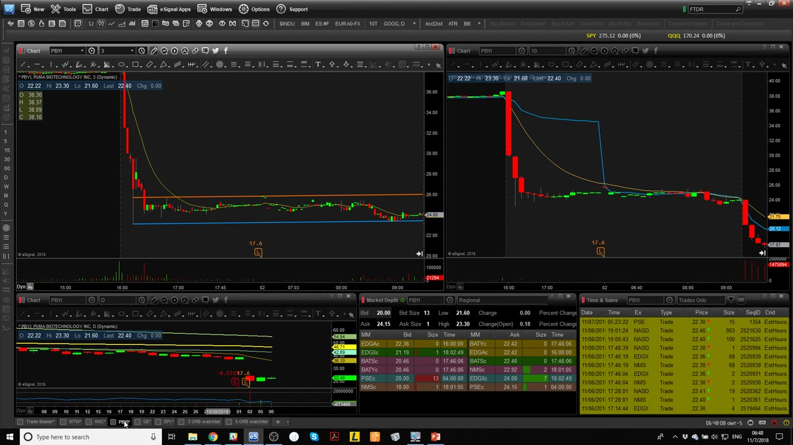

**图怎么看：**

- 在图C中，显示了两个股票的K线图，上方为FBYI，下方为QQQ。
- 左侧的FBYI股票显示出一个明显的缺口，随后价格在一段时间内保持在一个狭窄的范围内波动。
- 右侧的QQQ股票也显示出一个类似的缺口，价格随后突破了13EMA。
- 这些图表展示了如何通过识别缺口并等待价格突破来制定交易策略。

### 关键内容

- 预市模式是选择股票的关键，尤其是大型股票。
- 识别模式后，需等待价格突破预市低点或高点，再进行交易。
- 不同模式下，交易策略有所不同，需灵活应对。
- GE股票在开盘初期表现出强劲反弹，但最终回落，验证了预市模式的重要性。
- WTW股票的预市下跌模式与开盘后的强劲下跌走势一致，展示了模式识别的有效性。
- K-HC股票的预市反弹模式与开盘后的回调一致，进一步证明了模式识别的价值。
- 预市模式识别需要结合价格行动和成交量，以判断后续走势。
- 交易者应根据风险回报比选择合适的入场时机，而非盲目跟随市场波动。
- 预市模式识别有助于提高交易效率，减少不必要的交易次数。
- 交易者需保持耐心，避免过早入场，以免错过最佳交易机会

### 分析与执行顺序

1. 首先，识别预市模式，如下跌通道、横盘整理等。
2. 然后，等待价格突破预市低点或高点，确认趋势。
3. 接着，观察成交量和价格行动，判断后续走势。
4. 最后，根据风险回报比选择合适的入场时机，执行交易。
5. 在整个过程中，保持耐心，避免过早入场。
6. 定期回顾交易记录，总结成功与失败的经验教训。
7. 持续学习新的交易策略，提高交易技能

### 案例与细节

- ticker：WTW；description：WTW股票在预市出现明显的下跌通道，开盘后继续下跌，验证了预市模式的有效性。
- ticker：GE；description：GE股票在预市出现明显的下跌通道，开盘后短暂反弹，但最终回落，验证了预市模式的有效性。
- ticker：K-HC；description：K-HC股票在预市出现明显的反弹通道，开盘后回调，验证了预市模式的有效性。

### 风险与边界

- 预市模式识别依赖于价格行动和成交量，这些因素可能因市场变化而改变。
- 交易者需注意市场情绪的变化，避免因情绪波动而做出错误的交易决策。
- 预市模式识别适用于2018年至2021年的市场环境，当前市场环境可能有所不同。
- 交易者需谨慎对待预市模式，避免过度依赖单一模式进行交易决策。

### 复盘问题

- WTW股票的预市模式是如何识别的？
- GE股票在开盘初期的表现如何？最终结果是什么？
- K-HC股票的预市模式与开盘后的走势有何关系？

---

## v0704：大型股市场技术分析

> 日期：2018-11-08　·　时长：01:02:12

**本场重点：** 分析大型股市场近期波动，识别关键支撑和阻力位，制定短期交易策略。

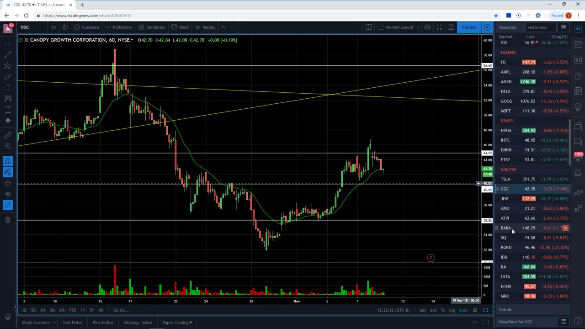

**图怎么看：**

- 整体界面显示了多个股票的实时和技术分析图表。
- 实际可见的ticker包括CGC、NFLX、MSFT等。
- 画面信息对应本场主题，展示了大型股市场的近期波动情况。
- 这张截图不能单独证明某一只股票的具体走势，需要结合其他信息进行综合分析。

### 关键内容

- SPY在夏季期间几乎没有波动，但进入秋季后出现剧烈波动，形成趋势线支撑。
- 10月市场出现第二次10%修正，表明市场对未来走势不确定。
- 使用趋势线分析，发现SPY在关键支撑位测试后反弹。
- 当前SPY处于短期熊市，但长期趋势仍不确定。
- 通过技术分析识别关键支撑和阻力位，制定短期交易策略。
- SPY在突破趋势线后出现显著反弹，但随后再次回落，表明市场情绪复杂。
- 使用技术指标如趋势线和支撑位进行交易决策，但需谨慎管理风险。
- 通过短期交易策略捕捉市场波动，但需注意市场可能快速反转。
- 使用模拟器练习期权交易，但实际交易中需考虑更多市场因素

### 分析与执行顺序

1. 回顾夏季市场平静期，分析进入秋季后的剧烈波动。
2. 使用SPY图表识别支撑和阻力位，标记关键趋势线。
3. 分析10月市场修正，识别支撑位测试和反弹。
4. 利用技术指标如趋势线和支撑位制定短期交易策略。
5. 使用范围扩展技术预测未来价格走势，但需注意市场可能快速反转。
6. 在模拟器中练习期权交易，但实际交易中需考虑更多市场因素。
7. 总结市场波动特点，强调技术分析的重要性，但需谨慎管理风险

### 案例与细节

- SPY在280和281阻力位附近形成重要支撑和阻力位，表明市场在此区域犹豫。
- CGC在下跌趋势中形成支撑位，随后突破趋势线，形成短期反弹。
- MRO在下跌趋势中形成支撑位，但突破趋势线后未立即下跌，表明市场情绪复杂。
- ALTA在投资者会议前出现大幅波动，显示市场对特定事件反应强烈。
- INTC在48美元附近形成支撑位，突破趋势线后出现显著上涨，表明市场情绪积极

### 风险与边界

- 市场情绪复杂，短期波动难以预测，需谨慎管理风险。
- 使用范围扩展技术预测未来价格走势，但并非每次有效。
- 模拟器练习有助于理解期权交易，但实际交易中需考虑更多市场因素。
- 技术分析仅是决策的一部分，需结合其他市场信息。
- 录制于2018年，部分市场条件和规则可能已发生变化

### 复盘问题

- 如何识别关键支撑和阻力位？
- 使用范围扩展技术时，如何判断目标价格？
- 在实际交易中，如何管理风险？
- 如何结合技术分析和其他市场信息做出决策？
- 模拟器练习对实际交易有何帮助？

---

## v0705：添加到现有头寸以增加盈利

> 日期：2018-11-14　·　时长：01:06:28

**本场重点：** 通过添加到现有头寸来增加盈利，但需谨慎管理风险。

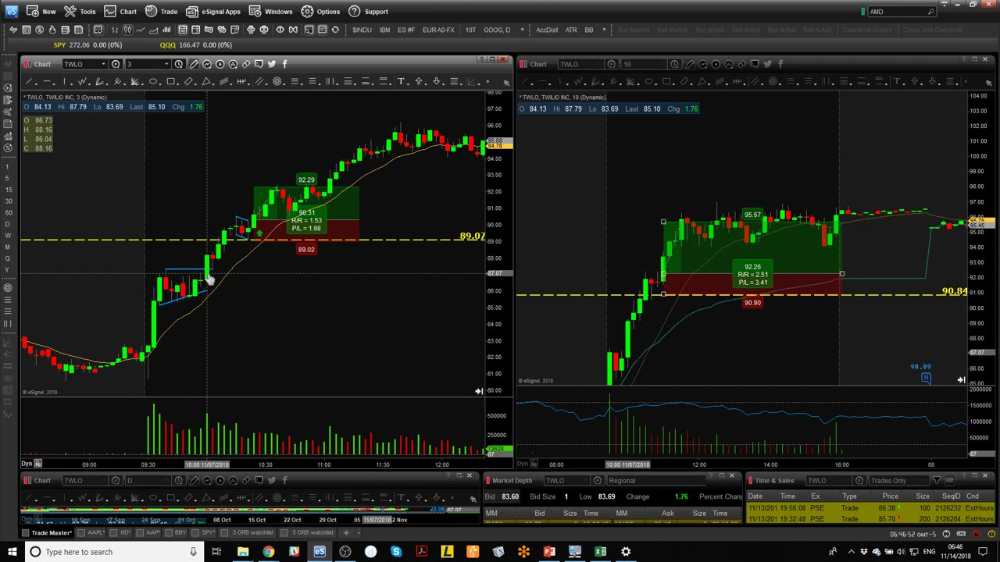

**图怎么看：**

- 在图中，显示了TWLO股票的价格走势，包括蜡烛图、均线和成交量。
- 图中的均线显示出上升趋势，表明市场可能正在上涨。
- 成交量柱的高度反映对应周期内的总成交量；红绿着色通常跟随价格柱的涨跌规则，不能直接拆成两种方向的主动成交。
- 这些图表元素有助于分析市场动态和确定最佳时机进行加仓操作。

### 关键内容

- 添加到现有头寸可以增加潜在利润，但也增加了风险。
- 成功的添加策略需要耐心和正确的入场时机。
- 添加后需要重新调整止损点，确保盈利最大化。
- 添加策略适用于长期和短期交易。
- 添加策略需要根据股票的波动性进行调整。
- 添加策略需要在市场有足够波动性和成交量时实施。
- 添加策略需要在正确的时间点进行，以避免追涨杀跌。
- 添加策略需要在市场趋势明确时实施，以确保盈利。
- 添加策略需要在市场出现新信号时进行，以避免过度追涨。
- 添加策略需要在市场回调时进行，以确保盈利最大化

### 分析与执行顺序

1. 首先确定入场点，通常在开盘后的前五分钟。
2. 当达到1.5倍盈亏比时，卖出一半的仓位。
3. 等待下一个有利的三分钟或十分钟形态再进行添加。
4. 计算新的平均价格作为新的止损点。
5. 在达到新的1.5倍盈亏比时，再次卖出一半的仓位。
6. 在达到新的2.5倍盈亏比时，卖出剩余仓位。
7. 在整个过程中，保持耐心，避免追涨杀跌

### 案例与细节

- ticker：TWLO；price：87.10；shares：300；stop_loss：86；profit_target：1.5 to 1；new_position：450 shares；new_stop_loss：89.07；final_profit：$3,000
- ticker：TWLO；price：92.20；shares：300；stop_loss：89.07；profit_target：2.5 to 1；new_position：525 shares；new_stop_loss：95.70；final_profit：$3,000
- ticker：TWLO；price：87.20；shares：300；stop_loss：86；profit_target：1.5 to 1；new_position：450 shares；new_stop_loss：89.07；final_profit：$1,500

### 风险与边界

- 添加策略需要在市场趋势明确时实施，否则容易追涨杀跌。
- 添加策略需要在市场出现新信号时进行，否则容易过度追涨。
- 添加策略需要在市场回调时进行，否则容易追涨杀跌。
- 添加策略需要在市场有足够波动性和成交量时实施，否则容易失败。
- 添加策略需要在正确的时间点进行，否则容易追涨杀跌。
- 录制年代限制：此策略适用于2018年至2021年的市场环境

### 复盘问题

- 在什么情况下应该考虑使用添加策略？
- 如何确定正确的入场时机？
- 如何调整止损点以确保盈利最大化？
- 在哪些市场条件下不适合使用添加策略？
- 如何避免追涨杀跌？

---

## v0706：标记趋势线和关键点

> 日期：2018-11-21　·　时长：01:07:33

**本场重点：** 建立良好的交易习惯，通过标记支持和阻力来预测市场走势。

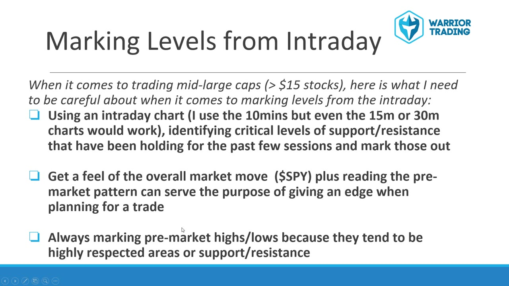

**图怎么看：**

- 使用10分钟的内盘图表识别支撑/阻力水平，并在这些水平上标记。
- 了解整体市场动向（如SPY）以及阅读开盘前的模式可以为交易计划提供优势。
- 始终标记开盘高点/低点，因为它们往往被视为高度受尊重的支撑/阻力区域。

### 关键内容

- Roberto强调了建立良好交易习惯的重要性，特别是对于每日交易准备阶段。
- 在预市期间，他专注于股票选择过程，而不是立即进行开仓操作。
- 通过分析日线图和标记关键点，可以更好地预测市场的潜在走势。
- 使用技术指标（如20日、50日、100日和200日移动平均线）来判断股票开盘价的强弱。
- 关注52周高点，这是重要的支撑位或阻力位。
- 在交易日内，重点关注过去几期的支撑和阻力位，以提高交易决策的准确性。
- 在交易前，标记预市高点和低点，这些是重要的支撑和阻力位。
- 保持交易策略的一致性，避免过度依赖单一的交易信号。
- 使用专业的图表软件（如TradingView）来标记关键点，提高交易效率

### 分析与执行顺序

1. 在交易前，准备当天的交易计划，包括股票选择和关键点标记。
2. 使用GAP扫描器快速打开图表，分析日线图上的关键点。
3. 在预市期间，专注于股票选择，而不是立即进行交易。
4. 使用技术指标（如移动平均线）来判断股票的开盘强弱。
5. 标记52周高点作为重要的支撑或阻力位。
6. 在交易日内，关注过去几期的关键支撑和阻力位。
7. 使用10分钟图表来识别关键支撑和阻力位，以更精确地捕捉价格动向

### 案例与细节

- ticker：AAPL；price_action：苹果股票在预市期间出现大幅下跌，日线图显示从230美元跌至180美元附近。；key_points：标记181美元作为重要的支撑位，因为它在过去多次被测试但未能突破。；trade_strategy：等待价格跌破13日移动平均线，并在10分钟图上确认新低后进行短头。；result：成功捕捉到1.3点的平均收益，但需要耐心等待确认信号。
- ticker：NVDA；price_action：英伟达在财报发布后的第二天出现波动，日线图显示从62美元附近下跌。；key_points：标记62美元作为重要的支撑位，因为它在预市期间被确认为关键支撑位。；trade_strategy：等待价格跌破62美元并在10分钟图上确认新低后进行短头。；result：成功捕捉到超过10点的跌幅，但需要谨慎选择入场时机。
- ticker：KSS；price_action：科尔集团在预市期间表现不佳，日线图显示低于所有移动平均线。；key_points：标记62美元作为重要的支撑位，因为它在预市期间被确认为关键支撑位。；trade_strategy：等待价格跌破62美元并在10分钟图上确认新低后进行短头。；result：成功捕捉到超过10点的跌幅，但需要谨慎选择入场时机。

### 风险与边界

- 预市数据对于制定交易策略至关重要，缺乏预市数据可能导致决策失误。
- 过度依赖单一的交易信号可能导致错误的交易决策。
- 使用专业的图表软件可以提高交易效率，但需要熟悉其功能。
- 市场环境的变化可能影响交易策略的有效性，需要持续监控市场动态。

### 复盘问题

- 在预市期间，如何确定关键支撑和阻力位？
- 在交易日内，如何利用过去的支撑和阻力位进行交易决策？
- 使用10分钟图表时，如何识别关键支撑和阻力位？
- 如何平衡交易策略的一致性和市场环境的变化？

---

## v0707：识别牛熊陷阱

> 日期：2018-11-28　·　时长：00:49:10

**本场重点：** 识别陷阱是避免被套的关键；牛熊陷阱常见于市场开盘前；需结合技术指标判断。

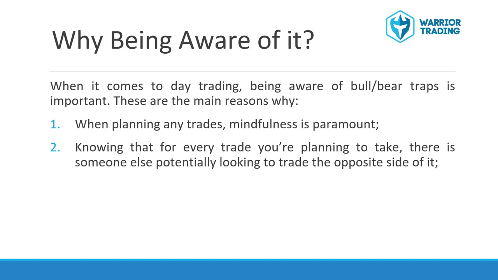

**图怎么看：**

- 幻灯片标题“Why Being Aware of it?”说明日内交易者为什么要意识到 bull／bear trap，而不是把每次突破都直接当成趋势延续。
- 第一点强调制定计划时要保持觉察：入场前先写出什么价格行为会证明自己错误，避免突破失败后才寻找解释。
- 第二点提醒每笔计划的另一侧都可能有相反观点的交易者；因此需观察突破后是否获得跟随、价格能否守住关键位，而非只看瞬间穿越。
- 这一页给的是风险意识，没有展示具体图表或保证某种识别方法有效；实际判断仍要结合课程中的 NVIDIA 等案例、成交环境和止损。

### 关键内容

- 牛熊陷阱描述市场中常见的现象，如股票价格急剧下跌后看似反弹，实则只是短暂回调。
- 识别陷阱的关键在于意识到市场可能存在的虚假信号，如快速反弹后的再次下跌。
- 牛熊陷阱通常发生在市场开盘前后，尤其是开盘前的预市场阶段。
- 使用技术指标（如13 EMA和VWAP）来识别过度延伸的走势，避免在此基础上进行交易。
- 制定硬性规则，如避免在开盘后的前三分钟进行交易，以减少陷阱带来的损失。
- 牛熊陷阱的风险在于过度依赖前期走势，忽视市场的真实变化，导致错误决策。
- 识别陷阱需要结合市场经验和技术分析，避免盲目跟随市场情绪。
- 牛熊陷阱常见于高波动股票，需快速止损以防止进一步损失。
- 识别陷阱的关键在于保持冷静，避免被市场情绪左右，做出理性决策

### 分析与执行顺序

1. 首先，了解市场术语和相关概念，如牛熊陷阱的定义。
2. 其次，通过案例分析，识别市场中的牛熊陷阱，如NVIDIA股票的交易实例。
3. 然后，使用技术指标（如13 EMA和VWAP）来识别过度延伸的走势，避免在此基础上进行交易。
4. 接着，制定硬性规则，如避免在开盘后的前三分钟进行交易，以减少陷阱带来的损失。
5. 最后，通过实际交易案例，验证识别和避免陷阱的方法是否有效，总结经验教训。
6. 在整个过程中，保持冷静，避免被市场情绪左右，做出理性决策。
7. 通过案例分析，展示如何识别和避免牛熊陷阱，如NVIDIA股票的交易实例。

### 案例与细节

- ticker：NVIDIA；price_action：市场开盘前出现明显的卖压，随后价格反弹，但很快再次下跌。；technical_indicators：使用13 EMA和VWAP指标识别过度延伸的走势。；trading_decision：避免在开盘后的前三分钟进行交易，等待市场稳定后再做决策。；outcome：正确识别陷阱，避免了不必要的损失。
- ticker：NVIDIA；price_action：市场开盘前出现明显的卖压，随后价格反弹，但很快再次下跌。；technical_indicators：使用13 EMA和VWAP指标识别过度延伸的走势。；trading_decision：在开盘后的前三分钟进行交易，结果是价格继续下跌，损失较大。；outcome：错误识别陷阱，导致了较大的损失。
- 讲师并排比较NVIDIA相隔五天的两张三分钟图：11月16日盘前疲弱并关注跌破161，开盘后跌破盘前低点，前半小时约下跌10点；五天后相似盘前形态却迅速向上反转成bear trap，说明不能把上一次结果套到相似图形，等待开盘前三分钟结束可以避开过早做空。

### 风险与边界

- 识别陷阱的风险在于过度依赖前期走势，忽视市场的真实变化，导致错误决策。
- 制定硬性规则的风险在于过于严格，可能导致错过潜在的盈利机会。
- 识别陷阱的有效性受限于市场环境的变化，需不断更新策略。
- 识别陷阱的局限在于无法预测所有市场变化，仍有可能遭受损失。
- 识别陷阱的局限在于依赖技术指标，而技术指标本身也可能存在误差。

### 复盘问题

- 在识别牛熊陷阱的过程中，哪些技术指标最为关键？
- 制定硬性规则时，有哪些注意事项可以避免过度严格？
- 通过案例分析，如何验证识别和避免陷阱的方法是否有效？
- 在实际交易中，如何平衡避免陷阱与抓住盈利机会之间的关系？
- 识别陷阱的关键因素是什么？

---

## v0708：如何使用 Trading View 设置图表

> 日期：2018-12-06　·　时长：01:04:44

**本场重点：** 本课程详细讲解了如何设置 Trading View 的图表布局，包括主题选择、时间框架、指标使用等，适合初学者快速上手。

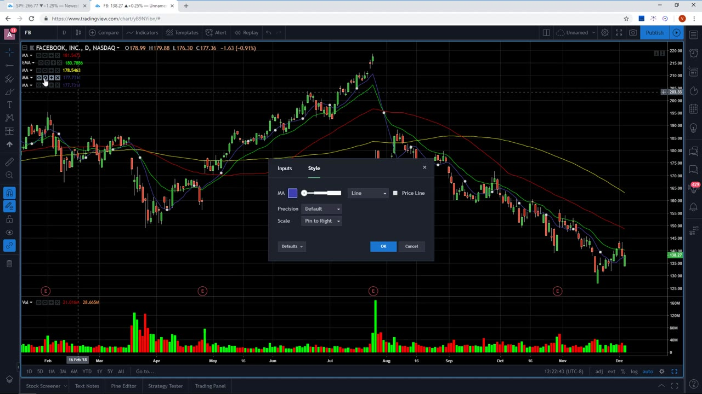

**图怎么看：**

- 在图中可以看到MICRON TECHNOLOGY, INC.的股价走势，显示了其价格变动情况。
- 图中还显示了MACD指标，用于分析股票的技术面。
- 成交量柱状图显示了不同时间段内的交易活动。
- 图表右侧的表格提供了其他相关股票的信息，如AMD、TSLA等。

### 关键内容

- 通过更改主题颜色和布局，可以提高图表的可读性。
- 利用 Trading View 的多种工具，如趋势线、水平线、价格范围工具等，进行技术分析。
- 使用 Trading View 的警报功能，设置价格触发点以获取通知。
- 通过保存自定义布局，可以在多个窗口中同步技术分析结果。
- 使用 Trading View 的多窗口功能，可以在不同设备上同时查看图表。
- 分享个人的股票筛选标准，帮助学员找到潜在的交易机会。
- 提醒学员注意 Trading View 的版本更新，确保使用最新功能

### 分析与执行顺序

1. 讲师首先介绍了 Trading View 的默认布局，并指出其不足之处。
2. 然后演示了如何更改主题颜色和布局，以提高图表的可读性。
3. 接着展示了如何使用 Trading View 的多种工具，如趋势线、水平线、价格范围工具等，进行技术分析。
4. 进一步讲解了如何使用 Trading View 的警报功能，设置价格触发点以获取通知。
5. 最后，讲师分享了个人的股票筛选标准，帮助学员找到潜在的交易机会。
6. 强调 Trading View 主要用于图表分析，而非直接下单交易。
7. 介绍如何使用 Trading View 的屏幕和回放功能来寻找交易机会。

### 案例与细节

- 讲师展示了如何使用 Trading View 的趋势线工具，连接两个关键点，以预测未来的支撑位和阻力位。
- 使用价格范围工具测量 Facebook 从高点到低点的跌幅，显示了 61.45 美元的跌幅和 32.63% 的百分比跌幅。
- 通过设置警报，当 AMD 股票价格低于 21 美元时，会自动弹出通知框。
- 讲师分享了个人的股票筛选标准，包括市场资本化、行业表现等，帮助学员找到潜在的交易机会。
- 使用 Trading View 的屏幕和回放功能，查看特定日期的市场表现，例如 2016 年 12 月 6 日的市场数据。

### 风险与边界

- Trading View 的某些功能可能需要订阅高级版本才能使用，如多窗口功能和警报数量。
- 使用 Trading View 进行技术分析时，需要关注市场变化，确保分析结果的时效性。
- Trading View 的版本更新可能会导致某些功能的变化，需要及时更新以适应新版本。
- 使用 Trading View 进行交易时，需要注意市场波动，避免因技术分析失误而造成损失。

### 复盘问题

- 如何设置 Trading View 的主题颜色和布局？
- 如何使用 Trading View 的趋势线工具进行技术分析？
- 如何设置 Trading View 的警报功能以获取价格触发通知？
- 如何使用 Trading View 的屏幕和回放功能来寻找交易机会？
- 如何保存自定义布局并在多个窗口中同步技术分析结果？

---

## v0709：技术分析与趋势交易

> 日期：2018-12-13　·　时长：00:56:53

**本场重点：** 技术分析和趋势交易是提高交易成功的有效方法，但需要耐心和经验。2018年12月13日的交易分析提供了多个案例。

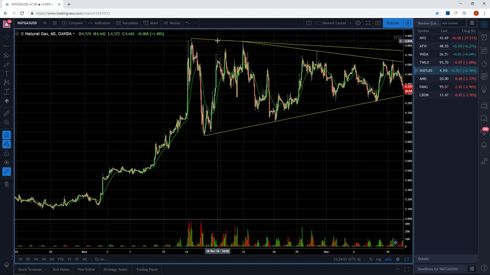

**图怎么看：**

- 图表显示了天然气的价格走势，价格在一段时间内呈现上升趋势。
- 图表中的绿色和红色柱状图代表成交量，成交量的变化反映了市场买卖的活跃程度。
- 均线（黄色虚线）显示出价格的趋势方向，表明当前价格可能处于上升趋势。
- 图表右侧的股票列表显示了其他相关股票的表现，有助于投资者进行多资产配置。

### 关键内容

- ATVI股票在一段时间内形成了紧缩的区间，随后突破了趋势线，但很快又回落。
- XPO股票的大幅下跌无法通过技术分析预测，强调了趋势交易的重要性。
- VNDA股票的旗形形态显示了技术分析的有效性，但需要耐心等待突破。
- 自然气（UNG）的范围扩展显示了技术分析在商品交易中的应用。
- Fang股票的每日图表显示了技术分析在波动市场中的挑战。
- Crone股票的缺口回撤展示了技术分析在重大新闻事件后的应用。
- 特斯拉（Tesla）期权价格昂贵，反映了高波动性的市场需求。
- 技术分析需要持续更新，依赖于实时市场数据。
- 交易策略应根据市场环境调整，尤其是在高波动时期。
- 使用TradingView可以保存分析，方便跨设备使用

### 分析与执行顺序

1. 分析ATVI股票的每日和60分钟图表，识别紧缩区间和趋势线突破。
2. 观察XPO股票的每日图表，发现缺乏技术突破的迹象，强调趋势交易的重要性。
3. 研究VNDA股票的五分钟图表，识别旗形形态，等待突破时机。
4. 分析自然气（UNG）的小时图，识别趋势线突破和范围扩展。
5. 评估Fang股票的每日图表，识别高波动性和技术分析的挑战。
6. 观察Crone股票的五分钟和60分钟图表，识别缺口回撤和趋势线突破。
7. 分析特斯拉（Tesla）期权价格，识别高波动性和期权定价。
8. 总结技术分析需要持续更新，依赖实时市场数据。
9. 强调交易策略应根据市场环境调整，尤其是在高波动时期

### 案例与细节

- ATVI股票在2018年12月13日形成了紧缩区间，随后突破了趋势线，但很快又回落。
- XPO股票在2018年12月13日经历了大幅下跌，无法通过技术分析预测，强调了趋势交易的重要性。
- VNDA股票在2018年12月13日形成了旗形形态，等待突破时机。
- 自然气（UNG）在2018年12月13日形成了范围扩展，显示了技术分析在商品交易中的应用。
- Fang股票在2018年12月13日形成了高波动性，技术分析难以准确预测。
- Crone股票在2018年12月13日形成了缺口回撤，展示了技术分析在重大新闻事件后的应用。
- 特斯拉（Tesla）期权价格在2018年12月13日显示了高波动性和期权定价

### 风险与边界

- 技术分析依赖于实时市场数据，数据缺失可能导致分析失效。
- 交易策略需要根据市场环境调整，否则可能在高波动时期失败。
- 使用TradingView保存分析，依赖于云存储，云服务中断可能影响数据访问。
- 录制年代限制，技术分析和市场环境的变化可能影响策略的有效性

### 复盘问题

- 如何识别技术分析中的关键趋势线突破？
- 在高波动性市场中，如何调整交易策略以适应市场变化？
- 如何利用TradingView保存分析，确保跨设备使用？

---

## v0710：适应市场变化的策略调整

> 日期：2018　·　时长：00:31:30

**本场重点：** 问题在于如何在市场条件变化时调整策略，结论是应保持策略的核心不变，仅在大小和耐心方面进行调整，边界是避免改变核心策略。

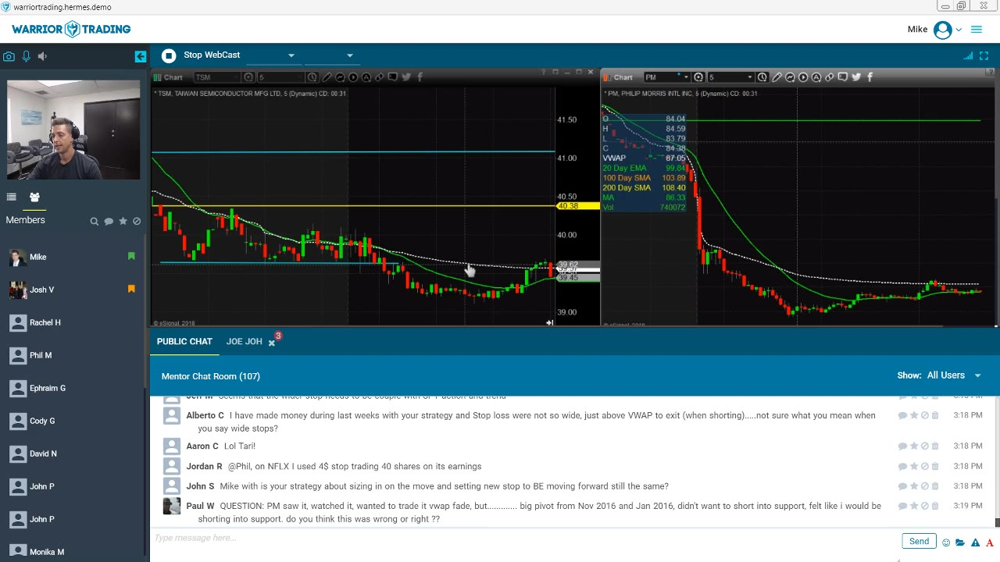

**图怎么看：**

- 在图表中，可以看到股票价格的波动情况，以及均线（如20日均线、100日均线等）的位置。
- 聊天室中有参与者讨论了市场条件的变化对策略的影响，强调了在市场条件变化时保持策略核心不变的重要性。
- 参与者们分享了他们在交易过程中的经验和建议，包括如何选择合适的止损点和止盈点。
- 通过这些图表和对话，可以学习到如何根据市场变化调整交易策略，同时保持策略的核心不变。

### 关键内容

- 过去几周市场条件不稳定，导致交易难度增加。
- 当市场条件变化时，需要调整策略，但不应改变核心策略。
- 宽止损和耐心是作者当前策略的核心。
- 紧止损可能导致错过盈利机会，但也会减少亏损。
- 市场条件变化时，应调整交易规模而非改变止损策略。
- 夏季市场流动性较低，交易难度增加，需适当减小交易规模。
- 市场条件变化时，应关注价格走势和技术指标。
- 紧止损策略适用于低流动性和波动性较大的市场。
- 宽止损策略适用于大市值股票和稳定市场。
- 市场条件变化时，应灵活调整交易策略，但不应改变核心策略

### 分析与执行顺序

1. 首先，回顾过去几周市场条件的变化，指出交易难度增加。
2. 然后，讨论如何在市场条件变化时调整策略，强调不应改变核心策略。
3. 接着，介绍宽止损和耐心作为当前策略的核心。
4. 进一步，解释紧止损可能导致错过盈利机会，但也会减少亏损。
5. 最后，强调市场条件变化时应灵活调整交易策略，但不应改变核心策略

### 案例与细节

- 在TSM交易中，由于市场条件变化，作者尝试保持较紧的止损，但最终错过了盈利机会。
- 在PM交易中，由于市场条件变化，作者尝试保持较紧的止损，但最终错过了盈利机会。
- 在IBM交易中，由于市场条件变化，作者尝试保持较紧的止损，但最终错过了盈利机会。

### 风险与边界

- 紧止损策略适用于低流动性和波动性较大的市场，但在大市值股票和稳定市场中可能不适用。
- 市场条件变化时，应灵活调整交易策略，但不应改变核心策略，否则可能导致亏损增加。
- 紧止损策略可能导致错过盈利机会，但也能减少亏损，因此需要权衡。

### 复盘问题

- 在市场条件变化时，如何确定是否需要调整策略？
- 宽止损和紧止损分别适用于哪些市场条件？
- 在市场条件变化时，如何平衡盈利机会和亏损风险？

---

## v0711：市场内部指标的应用

> 日期：2018　·　时长：00:38:11

**本场重点：** 通过市场内部指标预测市场走势，特别是利用tick、VIX、TLT等指标来识别市场情绪变化。

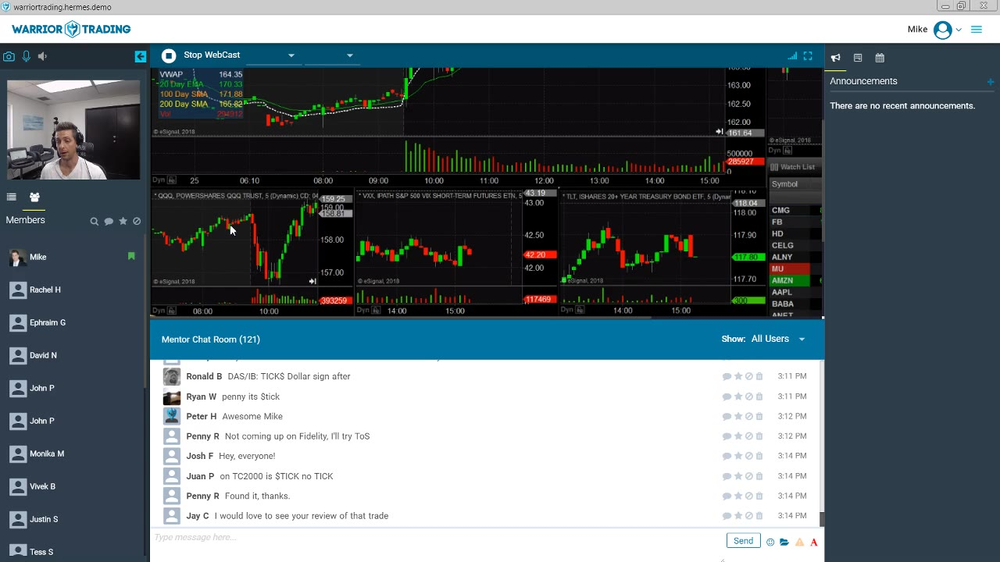

**图怎么看：**

- 通过市场内部指标预测市场走势，特别是利用tick、VIX、TLT等指标来识别市场情绪变化。
- 画面中，可以看到多个市场内部指标，如VIX、TLT等，这些指标可以帮助投资者理解市场情绪的变化。
- 画面中的图表显示了不同时间段的价格波动情况，包括K线图、均线和成交量柱状图，这些信息对于分析市场趋势非常有用。
- 通过观察这些指标和图表，投资者可以更好地做出决策，从而提高交易的成功率。

### 关键内容

- 使用tick指标可以预测市场走势，特别是当tick突破500点时。
- VIX指标反映市场恐惧程度，通常与市场走势相反。
- TLT指标反映债券市场情绪，债券价格上涨表示市场担忧增加。
- 市场内部指标如tick、VIX、TLT等可以帮助识别市场趋势和情绪变化。
- 当市场出现负tick时，可能是市场即将反转的信号。
- VIX上升通常预示市场将出现卖压。
- TLT上涨表示资金从股市流出，进入债券市场。
- 结合多个市场内部指标可以更准确地预测市场走势。
- 市场内部指标的应用需要结合技术分析和市场情绪判断。

### 分析与执行顺序

1. 首先打开市场内部指标界面，包括tick、VIX、TLT等。
2. 持续监控这些指标的变化，特别是tick突破500点的情况。
3. 当发现VIX上升时，检查市场是否出现卖压。
4. 观察TLT是否上涨，以判断资金流向。
5. 结合多个指标进行综合分析，预测市场走势。

### 案例与细节

- 昨天苹果股票在市场高点时表现强劲，而其他科技股则大幅下跌，这表明市场存在明显的分化。
- 当市场出现大量负tick时，市场可能会出现进一步的回调。
- VIX指数在市场下跌时急剧上升，表明市场情绪恶化。
- 当TLT指数开始上升时，市场资金可能正从股市流出。
- 在市场出现低风险高回报机会时，可以进行短空操作。

### 风险与边界

- 市场内部指标的应用依赖于实时数据，数据延迟可能导致误判。
- 市场内部指标仅作为辅助工具，不能完全替代技术分析。
- 录制年代限制为2018年，当前市场环境可能已发生变化。
- 市场内部指标的有效性取决于投资者对市场的理解程度。

### 复盘问题

- 昨天市场出现哪些具体现象，导致你认为市场可能即将反转？
- 如何结合VIX、TLT和tick指标来判断市场情绪变化？
- 在实际操作中，你如何处理市场内部指标与其他技术分析方法之间的关系？

---

## v0712：如何让盈利头寸继续运行

> 日期：2018　·　时长：00:38:30

**本场重点：** 本节讨论如何在市场波动中保持盈利头寸，避免过早获利了结。

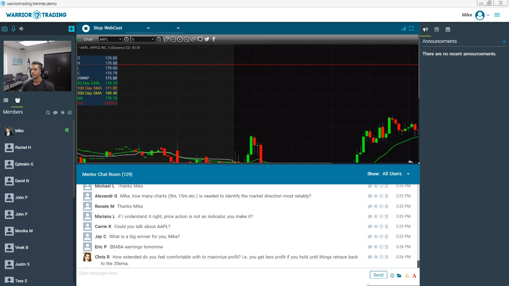

**图怎么看：**

- 图表显示了AAPL股票的价格走势，展示了如何在市场波动中保持盈利头寸。
- 均线（MA）和移动平均线（SMA）显示出市场的趋势方向。
- 成交量柱的高度反映对应周期内的总成交量；红绿着色通常跟随价格柱的涨跌规则，不能直接拆成两种方向的主动成交。
- 通过分析这些指标，可以更好地理解市场动态并做出决策。

### 关键内容

- NXPI在96水平突破后出现反转，表明需要谨慎处理。
- 利用20日移动平均线作为参考，可以更好地保持盈利头寸。
- 价格行动拐点可用于判断是否继续持有头寸。
- VWAP（成交量加权平均价格）也可作为参考指标。
- 保持在20日移动平均线下方时，应继续持有短头寸。
- 当价格突破20日移动平均线时，应考虑退出。
- 特斯拉等股票的波动性较大，不适合长期持有。
- 保持在20日移动平均线下方时，可以增加头寸。
- 利用价格行动拐点可以更准确地判断何时退出。
- 保持在20日移动平均线下方时，可以更好地控制风险

### 分析与执行顺序

1. 观察NXPI在96水平的突破，确认突破后的价格行动。
2. 使用20日移动平均线作为参考，判断是否继续持有。
3. 当价格突破20日移动平均线时，考虑退出。
4. 利用价格行动拐点来判断是否继续持有。
5. 在保持在20日移动平均线下方时，可以增加头寸。
6. 利用VWAP作为参考，判断是否继续持有。
7. 在保持在20日移动平均线下方时，可以更好地控制风险

### 案例与细节

- NXPI在96水平突破后，价格动作反转，表明需要谨慎处理。
- 特斯拉的价格动作较为混乱，不适合长期持有。
- Facebook的价格动作较为混乱，不适合长期持有。
- 阿里巴巴在开盘价附近形成价格行动拐点，表明可以继续持有。
- SPY指数在200日移动平均线下方形成价格行动拐点，表明可以继续持有

### 风险与边界

- 市场波动较大时，使用20日移动平均线可能会导致频繁进出。
- 价格行动拐点可能因市场情绪变化而失效。
- 录制年代限制，此策略适用于2018年至今的市场环境。
- 特斯拉等股票的波动性较大，不适合长期持有，可能导致亏损

### 复盘问题

- 在NXPI突破96水平后，如何判断是否继续持有？
- 使用20日移动平均线作为参考时，如何确定是否退出？
- 价格行动拐点如何帮助判断是否继续持有？
- 在哪些情况下，使用VWAP作为参考指标更为合适？

---

## v0713：股票交易策略详解

> 日期：2018　·　时长：00:24:50

**本场重点：** 通过LB股票交易实例，讲解如何识别趋势反转点并设置止损止盈。

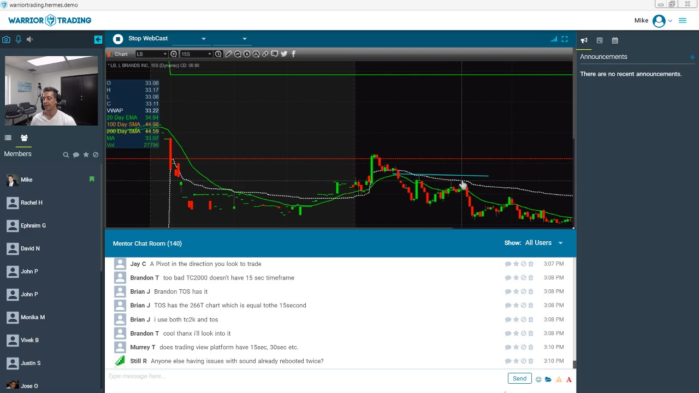

**图怎么看：**

- 在LB股票交易实例中，通过分析K线图、均线（如20日EMA、100日SMA等）以及成交量（VWAP），可以识别出趋势反转点，并设置止损止盈。
- 图中显示了LB股票的价格走势，包括K线图、均线和成交量，帮助投资者理解市场趋势和买卖时机。
- 通过观察K线图中的价格波动和均线的交叉情况，可以判断出市场可能的趋势变化，从而制定相应的交易策略。
- 在交易过程中，结合成交量的变化，可以帮助投资者更好地把握市场情绪和买卖机会，提高交易成功率。

### 关键内容

- LB股票在早盘出现大幅下跌，突破52周低点，显示强烈的卖压。
- 交易策略强调耐心等待最佳入场时机，避免过早介入。
- 设置止损在初始入场点上方，确保在趋势反转后及时退出。
- 交易过程中，关注Level 2数据以确认入场时机。
- 交易成功的关键在于识别趋势反转点，并严格遵守交易纪律。

### 分析与执行顺序

1. 使用Primus扫描器筛选出具有潜力的股票，如LB。
2. 观察LB股票在52周低点附近的支撑位，确认这是一个重要的技术支撑点。
3. 等待LB股票价格回踩VWAP和20均线，确认趋势反转后再入场。
4. 在入场后，密切关注Level 2数据，确认价格走势符合预期。
5. 一旦确认趋势反转，迅速下单入场，同时设置止损在初始入场点上方。
6. 保持耐心，等待价格进一步下跌，确认趋势反转后再加仓。
7. 在达到预设目标价后，逐步减仓，保留部分利润以应对市场波动。

### 案例与细节

- LB股票在开盘后出现大幅下跌，突破52周低点，显示强烈的卖压。
- 技术分析显示，LB股票在52周低点附近形成了关键的支撑位，随后被突破。
- 交易过程中，等待价格回踩VWAP和20均线，确认趋势反转后再入场。
- 使用Primus扫描器发现交易机会，结合技术指标进行决策。
- 交易过程中，密切关注Level 2数据，确认价格走势符合预期。

### 风险与边界

- 该策略依赖于准确的技术分析和市场情绪判断，任何误判都可能导致亏损。
- 市场环境变化可能导致交易策略失效，因此需要持续监控市场动态。
- 该策略适用于历史数据，但未来市场情况可能有所不同，需谨慎应用。
- 交易过程中，如果市场突然出现重大新闻，可能导致交易计划被打乱。

### 复盘问题

- 在交易过程中，如何确保准确识别趋势反转点？
- 如何设置止损以保护资金安全？
- 在实际操作中，如何平衡耐心等待与快速行动之间的关系？

---

## v0714：识别支撑、阻力和枢轴水平

> 日期：2018　·　时长：00:58:16

**本场重点：** 识别支撑、阻力和枢轴水平是技术分析的重要组成部分，通过历史数据和图表分析来预测价格反转和突破。

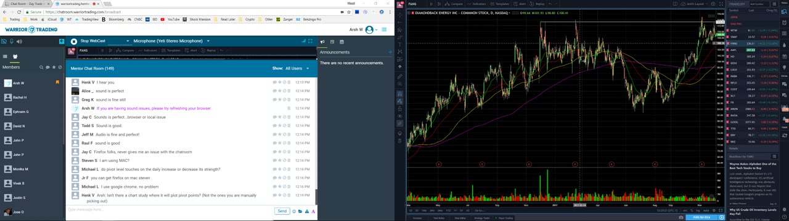

**图怎么看：**

- 画面中，可以看到一个股票的K线图，显示了价格的历史波动情况。
- 成交量柱的高度反映对应周期内的总成交量；红绿着色通常跟随价格柱的涨跌规则，不能直接拆成两种方向的主动成交。
- 图中的黄色线表示移动平均线，帮助识别趋势和支撑/阻力水平。
- 用户在聊天室中讨论了如何使用这些图表元素进行技术分析，特别是关于支撑、阻力和枢轴点的概念。

### 关键内容

- 支撑和阻力水平是技术分析的重要工具，帮助预测价格反转和突破。
- 所有时间高点和低点是重要的支撑和阻力水平，因为它们定义了价格范围的边界。
- 近期高点和低点也是重要的支撑和阻力水平，因为它们反映了市场的即时反应。
- 枢轴水平是重要的支撑和阻力水平，但不一定立即提供交易机会，而是作为价格反应的关键点。
- 支撑可以变成阻力，反之亦然，这取决于价格的走势。
- 识别支撑和阻力水平时，应关注市场普遍关注的水平，因为这些水平更可能提供有效的交易机会。
- 使用历史数据和图表分析来识别支撑、阻力和枢轴水平，有助于提高交易决策的准确性。
- 枢轴水平是价格反复测试的关键点，这些测试可以确认支撑和阻力的有效性。
- 缺口可以是重要的支撑和阻力水平，特别是当它们较大时。
- 支撑和阻力水平的识别需要结合其他技术分析方法，以提高交易决策的准确性

### 分析与执行顺序

1. 首先，介绍支撑、阻力和枢轴水平的概念及其重要性。
2. 然后，通过具体的股票例子，展示如何识别这些水平。
3. 接着，解释支撑和阻力水平如何影响价格走势。
4. 最后，强调识别这些水平时应注意的关键点，包括市场普遍关注的水平和历史数据的重要性。
5. 在整个过程中，使用图表和具体股票实例来辅助解释。
6. 通过实际交易案例，展示如何利用这些水平进行交易决策。

### 案例与细节

- ticker：IMTE；price_levels：['历史最高价 $10', '历史最低价 $2']；description：IMTE 股票在日线图上突破了 $10 的阻力位，随后再次测试该水平，最终突破成功。
- ticker：MOTS；price_levels：['历史最高价 $528', '历史最低价 $400']；description：MOTS 股票在日线图上突破了 $528 的历史最高价，随后再次测试该水平，最终突破成功。
- ticker：SNAP；price_levels：['历史最低价 $1128', '历史最高价 $1400']；description：SNAP 股票在日线图上突破了 $1128 的历史最低价，随后再次测试该水平，最终突破失败。
- ticker：WTW；price_levels：['历史最高价 $75', '历史最低价 $66']；description：WTW 股票在日线图上突破了 $66 的历史最高价，随后再次测试该水平，最终突破成功。
- ticker：FB；price_levels：['历史最高价 $195', '历史最低价 $167']；description：FB 股票在日线图上突破了 $167 的历史最低价，随后再次测试该水平，最终突破成功。

### 风险与边界

- 支撑和阻力水平的有效性依赖于市场情绪和交易量的变化。
- 历史数据可能无法完全反映当前市场状况，因此需要结合实时数据进行分析。
- 识别支撑和阻力水平时，应考虑市场普遍关注的水平，而不是孤立地看待每个水平。
- 技术分析方法的有效性会随市场环境变化而变化，因此需要持续更新和验证。

### 复盘问题

- 如何识别支撑和阻力水平？
- 支撑和阻力水平如何影响价格走势？
- 如何结合其他技术分析方法来提高交易决策的准确性？

---

## v0715：改变心态，聚焦过程

> 日期：2018　·　时长：00:37:31

**本场重点：** 改变心态，从关注金钱转向关注过程；成功的关键在于心态调整；小账户也能实现快速盈利。

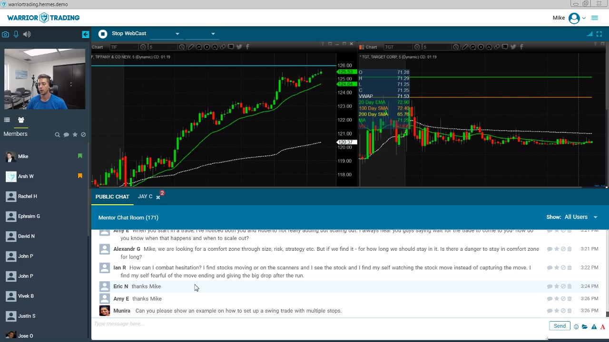

**图怎么看：**

- 在实时交易图表中，可以看到股票价格的波动和成交量的变化，这有助于理解市场动态。
- 聊天记录显示了参与者之间的互动，特别是关于如何调整心态和选择最佳交易机会的讨论。
- 通过这些图表和对话，可以学习到如何在交易过程中保持冷静和专注，从而提高成功率。
- 这些内容与本场主题“改变心态，聚焦过程”紧密相关，强调了心态调整的重要性。

### 关键内容

- 心态调整是成功的关键，从关注金钱转向关注过程。
- 小账户同样可以实现快速盈利，关键在于心态调整。
- 成功的新手需要理解过程而非盲目追求大仓位。
- 心态调整有助于减少压力，提高决策质量。
- 想象自己拥有大账户的心态，有助于制定正确的交易策略。
- 频繁交易增加风险，而耐心等待优质机会则更有效。
- 通过不断练习和经验积累，逐步提升交易技能。
- 保持耐心，避免过度交易，以减少损失。
- 成功的关键在于持续改进和适应市场变化

### 分析与执行顺序

1. 首先，理解心态调整的重要性，从关注金钱转向关注过程。
2. 其次，思考如果拥有大账户，会如何交易，从而制定正确的交易策略。
3. 再次，通过不断练习和经验积累，逐步提升交易技能。
4. 最后，保持耐心，避免过度交易，以减少损失。
5. 定期评估自己的交易策略，确保不断改进和适应市场变化

### 案例与细节

- 讲师提到，如果拥有大账户，不会每天频繁交易，而是等待合适的时机。
- 举例说明，如果今天没有合适的入场点，即使可以赚几百美元，也不进行交易。
- 讲师分享了自己在交易中的经验，如等待TIF突破VWAP后才进行交易。
- 讲师提到，如果看到股票在支撑位附近徘徊，不应停留太久，应迅速做出决定。
- 讲师举例说明，如果看到股票出现上升楔形形态，不应立即卖出，而应等待反转信号

### 风险与边界

- 心态调整需要时间，短期内可能看不到明显效果。
- 频繁交易增加风险，可能导致资金快速耗尽。
- 心态调整适用于小账户交易者，但大账户交易者可能需要不同的策略。
- 市场环境变化可能导致交易策略失效，需持续学习和适应。
- 录制年代限制，当前市场环境可能与当时有所不同

### 复盘问题

- 你如何理解心态调整对交易的重要性？
- 在实际交易中，你是如何应用心态调整的？
- 你认为心态调整需要多长时间才能见效？

---

## v0716：Primus Scan Software 介绍

> 日期：2018　·　时长：00:45:51

**本场重点：** Primus Scan Software 是一种高度定制化的扫描工具，特别适用于高频交易和自动化策略开发。

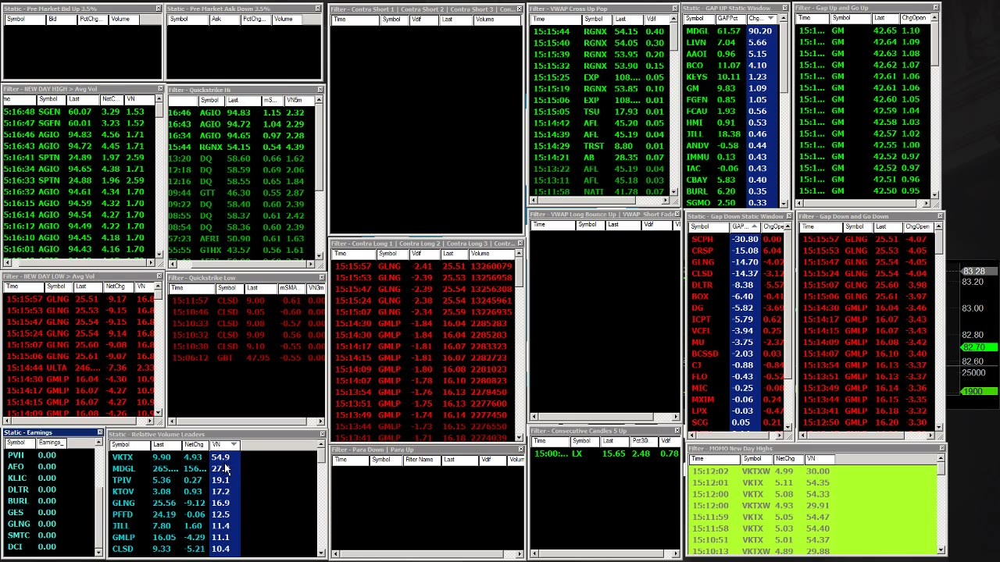

**图怎么看：**

- 图中显示了多个股票的实时交易数据，包括股票代码、最新价格、成交量等。
- 可以观察到不同股票的价格波动情况，以及它们之间的相对位置。
- 通过这些数据，投资者可以分析市场趋势和买卖机会。
- 此图有助于理解高频交易中的动态价格行为和成交量变化。

### 关键内容

- Primus 提供高度定制化的能力，特别适合高频交易者和自动化策略开发者。
- 它具有黑箱能力，可以连接到交易平台进行自动交易。
- Primus 支持多种扫描策略，包括 VWAP、新日高、新日低等。
- 它具有实时数据访问的优势，特别是对于低流通股票。
- Primus 的布局分为大市值和小市值两种，方便用户选择。
- 每月 75 美元的价格非常实惠，适合投资者尝试。
- Primus 支持多种图表和指标，如 VWAP、Bollinger Bands 等。
- Primus 可以通过私人会话帮助用户构建扫描策略。
- Primus 的扫描结果可以实时显示在图表上，方便用户监控。
- Primus 支持多种交易策略，如缺口扫描、快速打击等。

### 分析与执行顺序

1. 讲师首先介绍了 Primus 的背景和用途。
2. 然后展示了大市值和小市值的扫描布局。
3. 接着详细讲解了各种扫描策略及其使用方法。
4. 最后演示了如何使用 Primus 进行实时交易监控。
5. 讲师还强调了 Primus 的定制化能力和黑箱交易功能。

### 案例与细节

- PT, C 在新日高和高成交量的情况下表现强劲，表明这些股票具有持续上涨的潜力。
- GM 在五分钟图上突破了 Bollinger Bands，显示出强烈的上涨趋势。
- GMLP 在下午 3 点左右突破了 245 点，显示出强劲的上涨势头。
- DLTR 在早上开盘后出现大幅下跌，表明该股票可能受到负面新闻的影响。
- GMLP 在下午 3 点左右突破了 245 点，显示出强劲的上涨势头，随后在 Contra Long 扫描中再次出现，表明该股票具有进一步上涨的潜力。

### 风险与边界

- Primus 的定制化功能需要一定的编程知识，新手可能难以上手。
- 每月 75 美元的价格虽然便宜，但对于频繁交易者来说，可能仍需考虑其他成本。
- Primus 的实时数据访问依赖于网络连接，网络不稳定可能影响交易效果。
- 录制于 2018 年，部分交易规则和市场环境可能已发生变化。

### 复盘问题

- Primus Scan Software 的主要优势是什么？
- 如何利用 Primus 的扫描策略进行自动化交易？
- Primus 的布局是如何区分大市值和小市值股票的？

---

## v0717：高级交易复习

> 日期：2018　·　时长：00:35:26

**本场重点：** 本周交易复习，识别关键图表模式，理解入场时机的重要性。

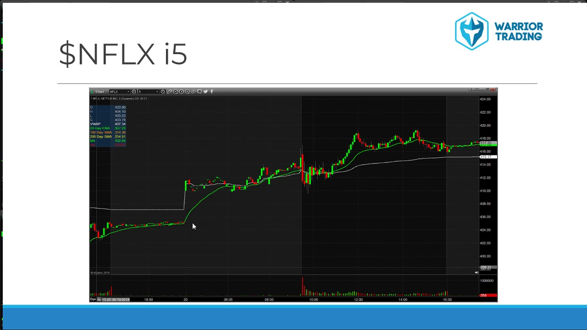

**图怎么看：**

- 这张图表显示了Netflix (NFLX) 的日线图，展示了股票价格的波动情况。
- 图表上可以看到多个技术指标，如移动平均线（MA）、相对强弱指数（RSI）等。
- 通过观察价格趋势和这些技术指标的变化，投资者可以做出买卖决策。
- 对于高级交易者来说，识别关键图表模式和理解入场时机非常重要。

### 关键内容

- 入场时机至关重要，需要考虑支撑位和阻力位之间的空间。
- 入场时机需谨慎，确保有足够的空间进行交易。
- 使用VWAP（成交量加权平均价格）作为参考点，判断是否入场。
- 市场波动性较低时，应更加谨慎地选择交易机会。
- 使用Thinkorswim平台的图表功能，提高交易决策的准确性。
- 市场疲软时，应关注长期技术指标，寻找潜在的交易机会

### 分析与执行顺序

1. 首先回顾本周交易的股票，包括JD、Apple、Netflix和MU。
2. 分析每个股票的关键图表模式，如双顶形态和支撑位突破。
3. 识别入场时机，考虑支撑位和阻力位之间的空间。
4. 使用15秒图表进行精确交易，识别价格行动中的关键转折点。
5. 利用VWAP作为参考点，判断是否入场。
6. 总结入场时机的重要性，强调入场前的充分准备。
7. 提醒学员注意市场波动性，选择合适的交易机会

### 案例与细节

- JD股票在预市和开盘时出现双顶形态，表明可能的下跌趋势。
- Apple股票在开盘后出现明显的下跌趋势，但未突破支撑位。
- Netflix股票在开盘后出现明显的下跌趋势，但未突破支撑位。
- MU股票在开盘后突破支撑位，显示出强烈的下跌趋势。
- 使用Thinkorswim平台的图表功能，查看15秒图表中的价格行动。
- 在市场疲软时，使用长期技术指标，如日线图的趋势线，寻找潜在的交易机会

### 风险与边界

- 录制于2018年，市场环境和交易规则可能已发生变化。
- 使用VWAP作为参考点，需要确保数据的准确性和实时性。
- 市场波动性较低时，应更加谨慎地选择交易机会，避免过度交易。
- 使用Thinkorswim平台的图表功能，需要熟悉其操作方法和界面布局

### 复盘问题

- 本周哪些股票的交易表现最好？
- 如何识别入场时机的关键图表模式？
- 在市场波动性较低时，应采取哪些策略来选择交易机会？

---

## v0718：大型股市场回顾与问答

> 日期：2018　·　时长：00:59:16

**本场重点：** 分析大型股市场的趋势，识别关键支撑和阻力位，并讨论如何利用这些信息进行交易。

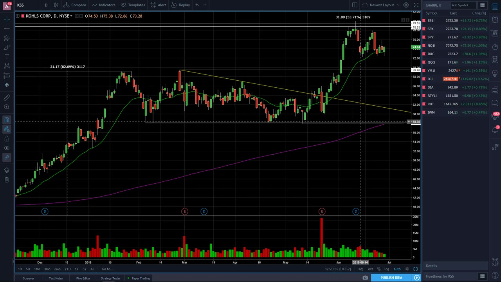

**图怎么看：**

- 画面为大型股K线图，黄色斜线围出下降通道；价格在通道内整理后向上突破，右上方出现一段高位回撤与再整理。
- 紫色长期均线位于价格下方，成交量区在突破附近出现较高柱体；这些元素帮助区分短线突破与更高周期支撑背景。
- 它对应市场回顾中的支撑阻力分析：先标通道和水平位，再观察突破后的承接，而不是只因某根大阳线就追入。
- 图上突破已经发生，存在明显事后视角；实时交易仍需提前定义失效位置，并考虑大盘方向、新闻和流动性。

### 关键内容

- 自2016年以来，股市持续上涨，但2018年2月出现重大修正，市场从顶部跌至底部。
- 大型股市场通常波动较大，需要密切关注支撑和阻力位的变化。
- 使用趋势线和支撑阻力位可以帮助识别潜在的交易机会。
- 短期交易者应保持耐心，避免过度交易，以提高成功率。
- 大型股市场中的技术模式更容易被其他交易者识别和响应。
- 使用技术指标如趋势线和支撑阻力位是识别交易机会的重要工具。
- 交易者应关注市场趋势，而不是长期预测市场走势。
- 止损设置应在交易前确定，以控制风险。

### 分析与执行顺序

1. 首先，分析SPY的日线图，识别支撑和阻力位。
2. 然后，使用趋势线来识别可能的突破点。
3. 接着，分析特定股票如CGC的图表，识别支撑和阻力位。
4. 最后，根据市场趋势和支撑阻力位制定交易策略。
5. 在交易过程中，始终监控市场动态，及时调整策略。
6. 使用技术指标如趋势线和支撑阻力位来识别潜在的交易机会。
7. 在交易前设定止损，以控制风险。

### 案例与细节

- SPY在2018年2月的修正后形成了一个横向区间，随后突破了这一区间，但目前又回到了这个区间内。
- CGC在2018年形成了一个明显的支撑位，但在突破后未能维持上涨趋势。
- 使用趋势线和支撑阻力位可以识别潜在的交易机会，如在CGC突破后立即买入。
- 在交易过程中，如果价格突破支撑阻力位，应迅速采取行动，以抓住交易机会。
- 使用技术指标如趋势线和支撑阻力位可以帮助识别潜在的交易机会，如在CGC突破后立即买入。

### 风险与边界

- 市场趋势可能会发生变化，因此需要持续监控市场动态。
- 技术指标的有效性取决于市场环境，不同市场环境下可能表现不同。
- 止损设置应在交易前确定，以避免在市场突然变化时做出冲动决策。
- 大型股市场中的股票通常具有更高的成交量和更广泛的投资者基础，因此技术模式更容易形成和被响应。

### 复盘问题

- 在SPY的图表中，哪些支撑和阻力位是最关键的？
- 如何利用趋势线和支撑阻力位来识别潜在的交易机会？
- 在交易过程中，如何确保止损设置的有效性？
- 在大型股市场中，哪些技术指标最有效？
- 如何根据市场趋势调整交易策略？

---

## v0719：特斯拉交易案例分析

> 日期：2018　·　时长：00:33:52

**本场重点：** 特斯拉在假期后的强劲反弹，利用技术指标进行精准入场和退出。

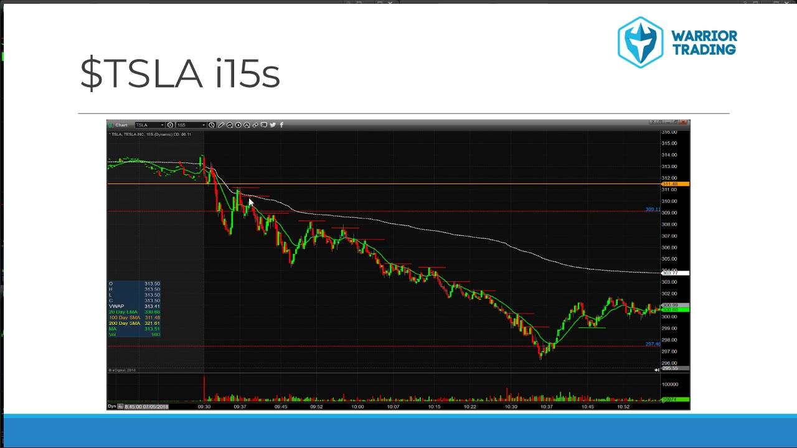

**图怎么看：**

- 整体界面显示特斯拉股票的日线图，包含价格走势、均线、成交量等信息。
- 实际可见的ticker为$TSLA，周期为i15s。
- 图中展示了特斯拉股票在假期后的强劲反弹，利用技术指标进行精准入场和退出。
- 这张截图不能单独证明特斯拉股票的具体走势，但可以提供参考数据和分析依据。

### 关键内容

- 特斯拉在假期后出现异常活跃的交易，突破了关键支撑位。
- 成交量底（Volume Bottom）出现在支撑位附近，表明反转可能性。
- 特斯拉的高波动性需要更大的止损，但提供了大利润机会。
- 使用15秒图表可以更清晰地识别价格动作和支撑位。
- 技术指标如支撑位和阻力位是判断市场趋势的关键。
- 成交量底是判断市场反转的重要信号，需结合其他指标综合判断。
- 利用技术指标进行精准交易，需要结合市场情绪和风险控制

### 分析与执行顺序

1. 观察特斯拉在假期后的价格走势，发现突破关键支撑位。
2. 使用15秒图表确认价格动作，识别做空信号。
3. 设置止损和目标价，确保风险控制。
4. 等待价格回调至支撑位，确认做空信号。
5. 执行交易，监控价格变动，及时调整策略。
6. 总结交易经验，记录成功和失败的原因，持续优化交易策略

### 案例与细节

- 特斯拉在15秒图表上形成了明显的做空信号，价格突破了关键支撑位。
- 成交量底出现在支撑位附近，表明市场可能反转。
- 特斯拉的高β值使其成为关注的重点，但波动性也增加了风险。
- 通过15秒图表观察到的价格动作，确认了做空信号。
- 特斯拉的高成交量和价格波动使其成为重点关注对象。
- 利用成交量底确认市场反转，结合其他技术指标进行综合判断。

### 风险与边界

- 特斯拉的高波动性可能导致交易频繁，增加交易成本。
- 成交量底虽然表明反转可能性，但需结合其他指标综合判断。
- 技术指标的有效性依赖于市场环境和交易者的解读能力。
- 特斯拉作为高β值股票，其价格波动性较大，需谨慎操作。
- 交易策略的成功依赖于市场环境的变化，需持续跟踪市场动态

### 复盘问题

- 特斯拉在假期后的交易表现如何？
- 如何利用15秒图表识别价格动作和支撑位？
- 成交量底在判断市场反转时起到了什么作用？
- 如何平衡特斯拉的高波动性和交易风险？
- 在实际交易中，如何结合多种技术指标进行综合判断？

---
