# Advanced Mentor Sessions：2019

> 45 场，合计 36.1 小时。返回 [Advanced Mentor Sessions 目录](../README.md)。

## v0720：市场内部指标解读

> 日期：2019-01-03　·　时长：00:44:31

**本场重点：** 通过市场内部指标（如SPY、Tick、VIX等）来预测市场趋势，适用于高级交易者。

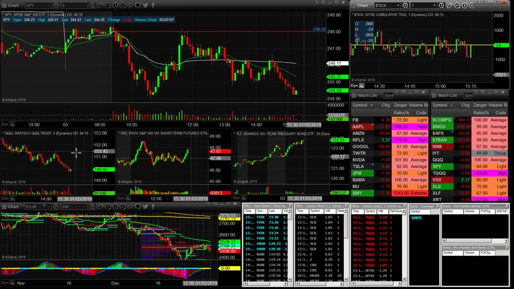

**图怎么看：**

- 这张截图显示了多个市场内部指标，包括SPY、Tick、VIX等，用于分析市场趋势。
- 在截图中可以看到多个图表，包括价格走势、成交量柱状图和时间序列数据。
- 这些图表提供了实时的市场动态，帮助高级交易者做出决策。
- 通过分析这些指标，可以预测市场的短期和长期趋势。

### 关键内容

- Tick指标跟踪纽约证券交易所的股票涨跌情况，是市场方向的领先指标。
- SPY指数反映了整个市场的走势，是交易者的重要参考。
- VIX衡量市场波动性，高VIX值通常预示着市场将出现较大波动。
- TLT债券指数显示市场情绪变化，高VIX值通常伴随市场下跌。
- 相对成交量高的股票更容易产生显著的市场影响。
- 市场内部指标需要结合使用，以提高预测准确性。
- 在市场波动较大时，交易者应更加谨慎，避免盲目跟风。
- 市场内部指标的应用有助于识别市场趋势，但并非绝对可靠。
- 交易者需关注市场内部指标的变化，以做出更明智的决策

### 分析与执行顺序

1. 首先，讲师介绍了SPY指数作为市场趋势的主要参考。
2. 然后，讲解了Tick指标如何反映市场整体的涨跌情况。
3. 接着，解释了VIX指标如何衡量市场波动性。
4. 最后，介绍了TLT债券指数如何反映市场情绪。
5. 在整个过程中，讲师强调了这些指标的综合应用，以提高预测准确性

### 案例与细节

- 讲师提到，当Tick指标持续为负时，表明市场正在向下移动，如230分后的情况。
- 当VIX开始上升时，表明市场可能即将出现较大的波动，如VIX从低点上升的情况。
- TLT债券指数在市场恐惧增加时会上升，如市场恐惧增加时TLT指数上升的情况。
- 讲师指出，当市场相对成交量较高时，交易机会更大，如Apple股票在高相对成交量时的表现。
- 讲师举例说明，当市场出现大波动时，交易者应更加谨慎，如特斯拉在圣诞节假期后的表现

### 风险与边界

- 市场内部指标并非绝对准确，有时会出现误导性的信号。
- 市场内部指标的应用依赖于特定的市场环境，不同市场环境下效果可能不同。
- 由于录制于2019年，部分指标和市场环境已发生变化，需谨慎应用。
- 市场内部指标的有效性受市场情绪和投资者行为的影响，这些因素难以量化。
- 交易者需结合其他技术分析工具，以提高决策的准确性

### 复盘问题

- Tick指标如何帮助预测市场趋势？
- VIX指标在市场波动时有何作用？
- TLT债券指数如何反映市场情绪？
- 如何结合使用这些市场内部指标以提高预测准确性？
- 在哪些情况下，市场内部指标可能会失效？

---

## v0721：如何管理大仓位

> 日期：2019-01-10　·　时长：00:44:00

**本场重点：** 通过案例分析，了解如何在市场有利时增加仓位，以及如何设置止损来控制风险。

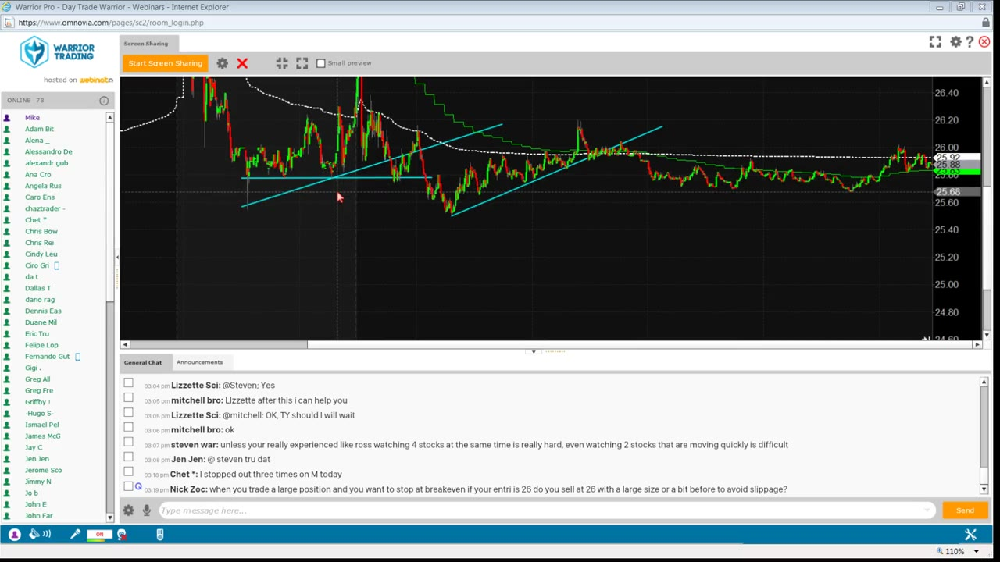

**图怎么看：**

- 在图表中，可以看到一个股票的价格走势，显示了价格在不同水平上的波动情况。
- 图表上标有水平线和趋势线，帮助识别价格的支撑和阻力位。
- 对话框中的讨论涉及如何在市场有利时增加仓位，并设置止损以控制风险。
- 参与者之间的交流提供了关于如何在交易中应用这些策略的具体建议和经验分享。

### 关键内容

- 在市场有利时增加仓位，需要确保技术面和基本面支持。
- 设置紧止损以控制风险，尤其是在大仓位交易时。
- 增加仓位需基于长期盈利记录和市场条件分析。
- 市场波动性增加时，应减少仓位大小。
- 利用速度线突破进行入场，需确认多次失败。
- 在SSR股票上交易时，使用25美分的偏移量以确保订单被填。
- 在不利情况下及时退出，避免进一步损失。
- 逐步增加仓位，避免一次性大幅增加。
- 保持纪律，避免因市场波动而频繁交易。
- 注意市场整体趋势，避免盲目追涨杀跌

### 分析与执行顺序

1. 观察市场走势，确认是否有利增加仓位。
2. 分析技术面和基本面，确保有足够支撑。
3. 设置紧止损，控制潜在风险。
4. 逐步增加仓位，避免一次性大幅增加。
5. 利用速度线突破进行入场，确认多次失败。
6. 在不利情况下及时退出，避免进一步损失。
7. 总结经验教训，调整策略以适应市场变化

### 案例与细节

- 在Macy's股票上，当市场出现明显卖压时，决定增加仓位。
- 设置紧止损，如在2610水平止损，以控制潜在风险。
- 利用速度线突破进行入场，确认多次失败后才下单。
- 在不利情况下及时退出，如在2590水平止损，避免进一步损失。
- 逐步增加仓位，从5000股到10000股，确保风险可控

### 风险与边界

- 市场波动性增加时，增加仓位的风险会增大。
- 缺乏长期盈利记录时，增加仓位可能导致亏损。
- 市场条件不佳时，增加仓位可能无法获利。
- 依赖单一技术指标进行决策存在风险。
- 录制年代限制，市场环境和交易规则可能已发生变化

### 复盘问题

- 在增加仓位前，如何确认市场有利？
- 如何设置紧止损以控制风险？
- 在不利情况下，如何及时退出以避免进一步损失？
- 如何逐步增加仓位，避免一次性大幅增加？
- 如何利用速度线突破进行入场，确保决策的准确性？

---

## v0722：市场对齐与交易策略

> 日期：2019-01-17　·　时长：00:41:21

**本场重点：** 理解市场对齐的重要性，制定交易策略以适应市场趋势，避免逆市操作。

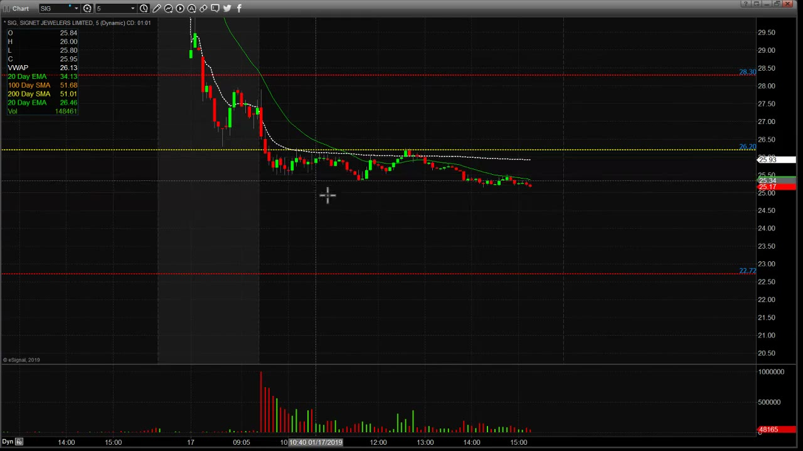

**图怎么看：**

- 这张截图显示了市场对齐的概念，通过对比不同股票的价格走势，可以观察到市场在特定时间段内的行为。
- 图中标注了多个关键指标，如20日EMA、100日SMA和200日SMA，这些指标用于判断市场的长期趋势。
- 成交量柱的高度反映对应周期内的总成交量；红绿着色通常跟随价格柱的涨跌规则，不能直接拆成两种方向的主动成交。
- 通过分析这些图表，投资者可以更好地理解市场动态，制定相应的交易策略，避免逆市操作。

### 关键内容

- 市场对齐是指市场趋势与交易方向一致，有利于提高交易成功率。
- 使用20日移动平均线作为市场对齐的指标，当突破时表明趋势可能反转。
- 在市场对齐时，可以采取积极的交易策略，如在BAC的交易中实现盈利。
- 市场对齐时，需要关注支撑和阻力水平，如BAC突破20日均线。
- 市场对齐时，可以利用技术指标确认趋势，如.spy指数突破关键水平。
- 市场对齐时，需要制定不同的交易情景，如市场上涨或下跌时的应对策略。
- 市场对齐时，可以增加交易规模，但需注意风险控制，如JPM的交易中。
- 市场对齐时，需要监控市场内部指标，如VIX、QQ、ADD等。
- 市场对齐时，需要保持交易纪律，如制定交易计划并记录。
- 市场对齐时，需要灵活调整交易策略，如SIG的交易中出现市场对齐失效

### 分析与执行顺序

1. 回顾昨日BAC的交易，展示市场对齐的重要性。
2. 分析市场对齐时的技术指标，如20日移动平均线和.spy指数。
3. 展示不同交易情景，如市场上涨或下跌时的应对策略。
4. 解释如何利用市场对齐制定交易计划，包括止损和止盈点。
5. 举例说明市场对齐时的交易策略，如BAC和JPM的交易。
6. 强调市场对齐时的风险管理，如JPM的交易中出现的快速回撤。
7. 总结市场对齐时的注意事项，如保持交易纪律和灵活调整策略

### 案例与细节

- BAC：技术面显示强劲的缺口向上，突破20日均线，市场对齐良好，实现盈利。
- JPM：市场对齐时尝试交易，但出现快速回撤，最终亏损40美分。
- .spy：市场对齐时，.spy指数突破关键水平，支持市场上涨。
- SIG：市场对齐时尝试交易，但未能持续下跌，最终未成交。
- CSX：市场对齐时，设定继续下跌的触发点，但未达到，最终未成交

### 风险与边界

- 市场对齐时，需要警惕市场突然逆转的风险，如JPM的交易中。
- 市场对齐时，需要控制交易规模，避免过度投入，如JPM的交易中。
- 市场对齐时，需要监控市场内部指标，如VIX、QQ、ADD等，以及时调整策略。
- 市场对齐时，需要保持交易纪律，避免盲目追涨杀跌。
- 市场对齐时，需要灵活调整交易策略，如SIG的交易中出现市场对齐失效

### 复盘问题

- 在市场对齐时，如何确定交易规模？
- 在市场对齐时，如何监控市场内部指标？
- 在市场对齐时，如何制定交易计划？
- 在市场对齐时，如何处理快速回撤的风险？
- 在市场对齐时，如何灵活调整交易策略？

---

## v0723：大型股市场分析与交易策略

> 日期：2019-01-23　·　时长：01:06:46

**本场重点：** 分析大型股市场趋势，利用技术分析寻找交易机会，特别是利用趋势线突破进行短卖。

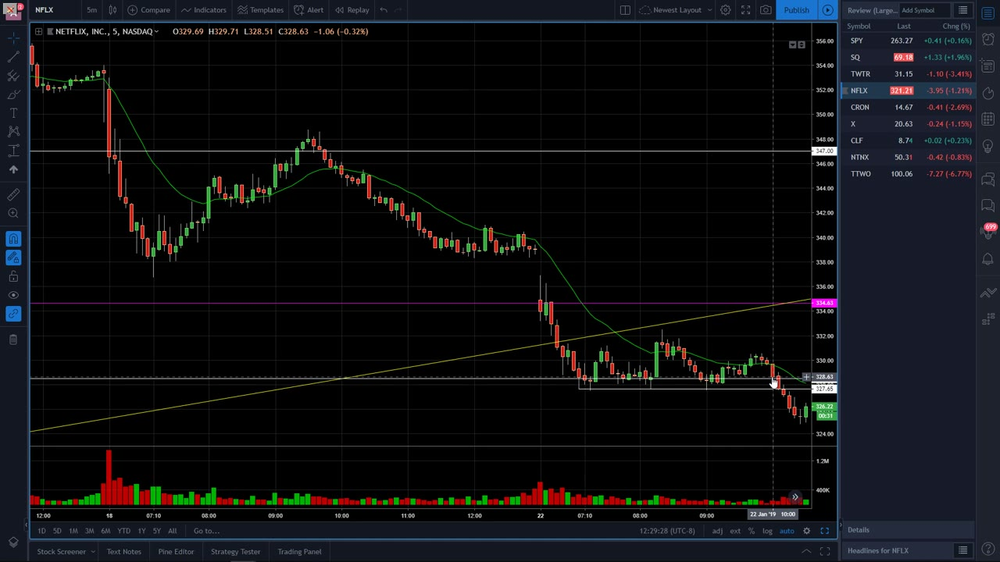

**图怎么看：**

- 画面中，我们可以看到Netflix（NFLX）的股价走势图，显示了其价格波动和趋势。
- 画面中的黄色趋势线表明了当前的趋势方向，而紫色水平线可能表示支撑或阻力位。
- 通过观察价格走势和趋势线，投资者可以识别出潜在的交易机会，如趋势线突破。
- 图A还展示了其他股票的价格表现，帮助投资者进行多股票对比分析。

### 关键内容

- SPY在12月市场底部后出现大幅上涨，形成上升趋势。
- SQ股票在SPY趋势线上涨后出现显著上涨，表明市场情绪积极。
- Twitter股票在突破趋势线后出现快速回调，显示可能的牛市陷阱。
- Netflix股票在财报发布后出现大幅波动，显示市场情绪变化。
- 使用技术分析识别趋势线突破作为交易信号，特别是大型股市场。
- 结合SPY和其他大型股的表现，制定交易策略，以应对市场波动。
- 利用趋势线突破进行短卖，特别是在大型股市场中。
- 结合多种技术分析工具（如牛旗形态、缺口和支撑位）进行综合判断。
- 关注市场整体趋势，利用技术分析工具预测短期走势。
- 利用图表分析工具（如Trading View）进行实时监控和交易

### 分析与执行顺序

1. 首先分析SPY的走势，确定市场趋势。
2. 识别大型股市场的技术分析信号，如趋势线突破。
3. 利用技术分析工具（如Trading View）进行实时监控。
4. 根据市场趋势和技术信号制定交易计划。
5. 执行交易计划，包括设置止损和止盈点。
6. 监控交易结果，调整策略以适应市场变化。
7. 总结交易经验，优化未来交易策略

### 案例与细节

- SQ股票在SPY趋势线上涨后出现显著上涨，表明市场情绪积极。
- Twitter股票在突破趋势线后出现快速回调，显示可能的牛市陷阱。
- Netflix股票在财报发布后出现大幅波动，显示市场情绪变化。
- 使用Trading View平台进行实时监控，发现Twitter股票突破趋势线后的回调。
- 结合SPY和其他大型股的表现，制定交易策略，如在Twitter股票突破趋势线后进行短卖。
- 利用Trading View平台进行实时监控，发现Netflix股票在财报发布后的大幅波动

### 风险与边界

- 市场波动可能导致交易信号失效，需要灵活调整策略。
- 技术分析依赖于历史数据，无法完全预测未来市场走势。
- 使用Trading View平台进行交易时，需要考虑平台的兼容性和稳定性。
- 市场环境变化可能导致交易策略失效，需要定期更新策略。
- 技术分析依赖于图表和指标，需要谨慎解读，避免误判
- 录制年代限制，当前市场环境与2019年相比可能有所不同

### 复盘问题

- 如何利用SPY的趋势来预测大型股市场的整体走势？
- 在识别技术信号时，如何确保信号的有效性？
- 如何结合多种技术分析工具进行综合判断？
- 在制定交易计划时，如何设置合理的止损和止盈点？
- 如何根据市场变化调整交易策略？

---

## v0724：交易计划与执行

> 日期：2019-01-30　·　时长：01:02:20

**本场重点：** 交易计划是成功的关键，但执行才是决定盈利与否的核心。

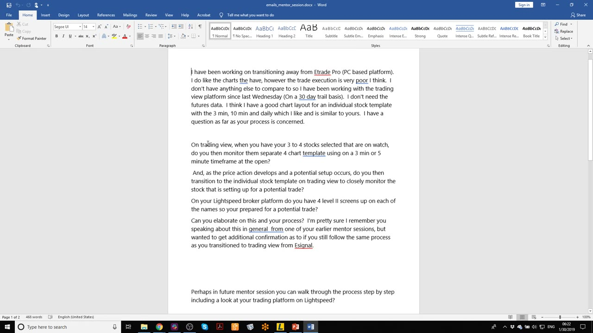

**图怎么看：**

- 画面中，可以看到多个股票的交易图表，包括NVIDIA、Netflix、Atlassian和SPDR S&P 500等。
- 图表显示了不同股票的价格走势、移动平均线（EMA）以及成交量。
- 这些图表对于理解市场趋势和制定交易策略至关重要。
- 通过分析这些图表，投资者可以更好地了解股票的表现和潜在的投资机会。

### 关键内容

- 交易计划是盈利的基础，但执行是关键。
- 交易者需要明确策略、止损点和目标价。
- 执行过程中需要监控价格动作，避免过度追涨杀跌。
- 使用热键快速下单，减少失误。
- 在市场开盘后三分钟内不进行交易，以过滤噪音。
- 使用Level Two窗口监控价格，但不依赖深度。
- 交易时使用限价单，避免滑点。
- 设置多级止损和利润目标，逐步退出。
- 交易者需具备良好的心理素质，避免冲动交易。
- 交易计划需根据市场变化灵活调整

### 分析与执行顺序

1. 首先，明确交易策略和目标价。
2. 其次，监控价格动作，避免过度追涨杀跌。
3. 然后，使用热键快速下单，减少失误。
4. 最后，设置多级止损和利润目标，逐步退出。
5. 在整个过程中，保持冷静，避免冲动交易。
6. 根据市场变化灵活调整交易计划。
7. 在市场开盘后三分钟内不进行交易，以过滤噪音

### 案例与细节

- 使用Level Two窗口监控价格，但不依赖深度，例如在NVIDIA股票上，当价格接近高点或低点时下单。
- 在交易View平台上，同时监控多个股票的三个或五分钟图表，以便快速识别交易机会。
- 使用热键快速下单，例如控制+1买入100股，控制+2买入200股，以此类推。
- 在交易过程中，使用限价单，例如在NVIDIA股票上，当价格达到163.15时，设置卖出1000股的限价单。
- 设置多级止损和利润目标，例如在NVIDIA股票上，先设置第一利润目标为160，再设置第二利润目标为164.50

### 风险与边界

- 交易计划需根据市场变化灵活调整，否则可能无法适应市场波动。
- 使用热键快速下单时，需确保操作准确，否则可能导致错误下单。
- 在市场开盘后三分钟内不进行交易，可能会错过最佳交易机会。
- 使用限价单时，需考虑滑点风险，否则可能影响交易结果。
- 交易过程中需保持冷静，避免冲动交易，否则可能导致亏损

### 复盘问题

- 交易计划的具体步骤是什么？
- 如何使用Level Two窗口监控价格？
- 使用热键快速下单时需要注意什么？
- 如何设置多级止损和利润目标？
- 在交易过程中，如何保持冷静避免冲动交易？

---

## v0725：大型股市场分析与技术交易策略

> 日期：2019-01-31　·　时长：01:01:16

**本场重点：** 分析AMD和NOW的技术走势，强调趋势跟踪与风险控制的重要性。

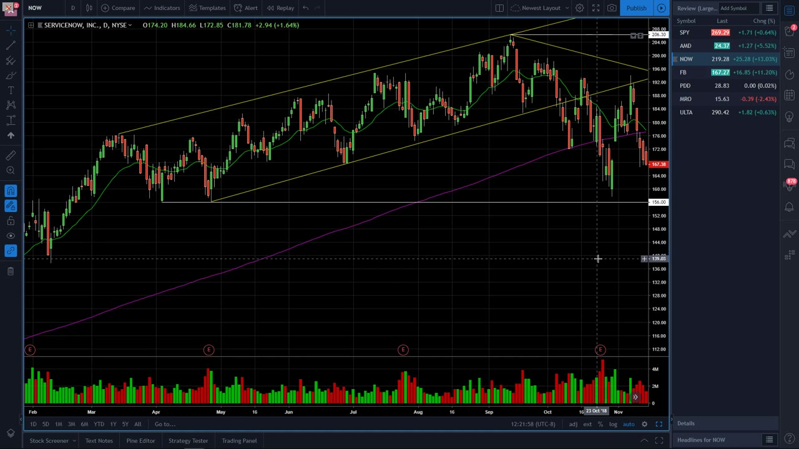

**图怎么看：**

- 图中黄色斜线标出较长的上升通道，价格在右侧跌破通道后快速下挫，随后从低位反弹，但仍处于原通道下方。
- 紫色长期均线横贯下方，成交量在破位和反弹阶段出现变化；通道下沿和前低可作为判断趋势是否失效的参考。
- 这张图能支持AMD、NOW等大型股案例的核心：趋势跟踪必须同时设计破位后的风险控制，不能把每次反弹都当成趋势恢复。
- 历史反弹不代表价格会重新进入通道；只有后续结构、量能和关键位重新确认，才可能改变原先的风险判断。

### 关键内容

- SPY是分析市场的关键工具，显示了过去两周的绿色蜡烛，表明市场整体上涨。
- AMD在近期形成了强劲的技术走势，但因竞争对手的负面消息导致突破失败。
- NOW在近期形成了技术阻力位，但突破未成功，显示市场犹豫。
- MRO和ALTA显示出潜在的技术突破机会，但需要等待更多确认。
- 使用止损单的风险在于可能过早退出有利可图的交易。
- 技术突破需要结合市场情绪和实际数据进行综合判断。
- 长期投资者可以考虑Facebook作为投资标的，但需关注SPY的表现。
- 使用Trading View的警报功能可以帮助监控股票的关键技术点。
- AMD在1月30日的开盘价突破了关键支撑位，形成技术突破信号，但随后因竞争对手的负面消息导致股价回撤，说明技术突破需结合市场情绪。
- NOW在1月31日的开盘价接近关键阻力位，但未能突破，显示市场犹豫，技术阻力位突破需谨慎验证。
- MRO在1月31日的开盘价形成了潜在的突破形态，但需要等待更多确认，说明技术突破前需进一步观察。
- ALTA在1月31日的开盘价接近关键支撑位，但尚未突破，显示市场仍在观望，技术突破需耐心等待。
- 使用Trading View的警报功能设置买入点，监控关键技术点，有助于及时捕捉交易机会，但需注意误报可能影响决策。

### 分析与执行顺序

1. 首先分析SPY的小时图，确认市场趋势。
2. 识别AMD的突破模式，但因竞争对手的影响导致突破失败。
3. 观察NOW的支撑位，确认突破未成功。
4. 分析MRO和ALTA的图表，寻找潜在的突破机会。
5. 使用Trading View的警报功能设置买入点，监控关键技术点。

### 案例与细节

- AMD在1月30日的开盘价突破了关键支撑位，形成技术突破信号。
- NOW在1月31日的开盘价接近关键阻力位，但未能突破。
- MRO在1月31日的开盘价形成了潜在的突破形态。
- ALTA在1月31日的开盘价接近关键支撑位，但尚未突破。
- SPY在1月31日的开盘价突破了关键支撑位，形成技术突破信号。
- AMD在1月30日的开盘价突破了关键支撑位，形成技术突破信号，但随后因竞争对手的负面消息导致股价回撤，说明技术突破需结合市场情绪。
- NOW在1月31日的开盘价接近关键阻力位，但未能突破，显示市场犹豫，技术阻力位突破需谨慎验证。
- MRO在1月31日的开盘价形成了潜在的突破形态，但需要等待更多确认，说明技术突破前需进一步观察。
- ALTA在1月31日的开盘价接近关键支撑位，但尚未突破，显示市场仍在观望，技术突破需耐心等待。

### 风险与边界

- 使用止损单可能导致错过有利可图的交易。
- 技术突破需要结合市场情绪和实际数据进行综合判断。
- 长期投资者需关注短期市场波动对投资决策的影响。
- 使用Trading View的警报功能可能会产生误报，影响决策。
- 使用止损单可能导致错过有利可图的交易，特别是在技术突破初期，市场情绪可能迅速变化。
- 技术突破需要结合市场情绪和实际数据进行综合判断，否则可能因误判而错失良机。
- 长期投资者需关注短期市场波动对投资决策的影响，避免因短期波动而频繁调整投资策略。
- 使用Trading View的警报功能可能会产生误报，影响决策，因此需要谨慎设置并定期检查警报准确性。

### 复盘问题

- 如何在技术突破和市场情绪之间找到平衡？
- 在使用止损单时，如何确定合理的止损水平？
- 如何利用Trading View的警报功能优化交易策略？

---

## v0726：数据聚合在交易中的应用

> 日期：2019-02-14　·　时长：00:39:37

**本场重点：** 数据聚合可以简化交易过程，提高决策速度和准确性。但需要熟悉特定交易平台的脚本编写。

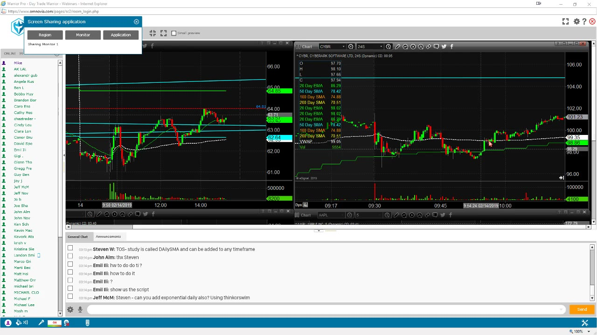

**图怎么看：**

- 该截图展示了交易软件界面，包括多个股票图表和实时交易数据。
- 可以看到多个股票的K线图和均线，以及成交量柱状图。
- 界面中有多个用户聊天记录，显示了交易者之间的互动。
- 截图中没有明确显示数据聚合的应用场景，但提供了交易过程中的实时信息。

### 关键内容

- 数据聚合是将不同时间框架的数据整合到单一图表中，以简化交易过程。
- 通过数据聚合，可以同时监控多个股票和时间框架，提高决策效率。
- 使用脚本将每日移动平均线转移到任何时间框架，实现数据的即时更新。
- 快速时间框架有助于捕捉价格动作，提高交易机会识别率。
- 通过聚合数据，可以减少切换不同时间框架的次数，避免信息遗漏。
- 使用脚本可以将数据整合到单一图表中，提高交易效率。
- 快速时间框架显示的价格动作比慢速时间框架更清晰，提高交易成功率。
- 通过聚合数据，可以更好地理解市场情绪和趋势。
- 快速时间框架的使用需要熟悉特定交易平台的脚本编写。
- 数据聚合适用于多种交易策略，包括日内交易和摆动交易

### 分析与执行顺序

1. 讲师首先介绍了数据聚合的概念，即整合不同时间框架的数据。
2. 然后展示了如何将每日移动平均线转移到任何时间框架，使用脚本实现。
3. 接着演示了如何在单一图表中整合多个股票和时间框架的数据。
4. 最后，讲师强调了快速时间框架的重要性，以及如何利用这些数据做出更好的交易决策。
5. 整个过程中，讲师多次强调了脚本编写的重要性，以实现数据的即时更新和整合

### 案例与细节

- 讲师使用NTAP（N-TAP）的例子，展示了如何将5分钟、1分钟和每日图表的数据整合到单一图表中。
- 通过脚本将每日移动平均线转移到24秒时间框架，帮助识别价格动作。
- 使用脚本将每日移动平均线转移到5分钟时间框架，帮助识别价格动作。
- 通过快速时间框架（如24秒），识别出价格动作中的失败尝试，提高交易决策的准确性。
- 使用脚本将每日移动平均线转移到不同时间框架，帮助识别价格动作中的关键点

### 风险与边界

- 数据聚合依赖于特定交易平台的脚本编写，不同平台可能有不同的实现方式。
- 快速时间框架的使用可能会增加交易频率，导致更高的交易成本。
- 数据聚合需要熟悉特定交易平台的操作，否则可能导致操作失误。
- 快速时间框架的使用可能会增加交易风险，特别是在市场波动较大时
- 数据聚合适用于多种交易策略，但在某些情况下可能无法提供足够的信息

### 复盘问题

- 数据聚合的主要优势是什么？
- 如何使用脚本将每日移动平均线转移到不同时间框架？
- 快速时间框架在交易中起到了什么作用？
- 数据聚合适用于哪些交易策略？
- 使用数据聚合时需要注意哪些风险？

---

## v0727：止损与风险管理

> 日期：2019-02-21　·　时长：00:37:53

**本场重点：** 止损是避免极端损失的关键，但需谨慎执行。

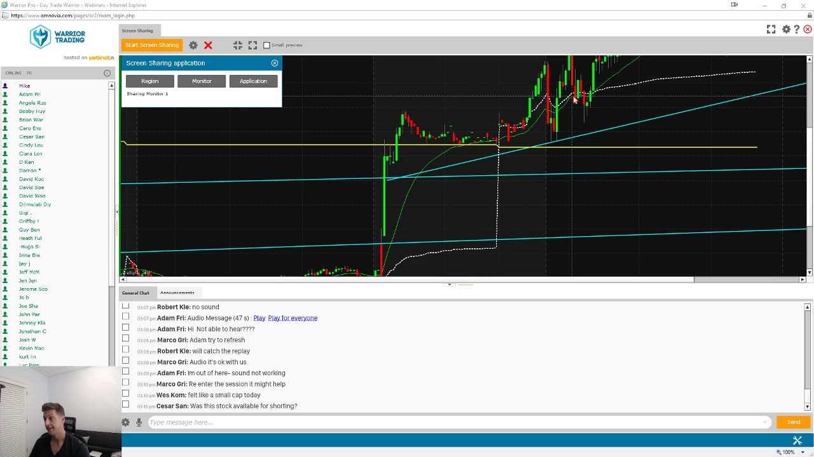

**图怎么看：**

- 共享屏幕主图显示价格快速跳空上行，随后沿青色上升趋势线推进；图中还画有多条青色和黄色水平位，用于分层标记支撑阻力。
- 绿色均线贴近短期价格，灰色阶梯线位于下方；止损可围绕最近结构低点或趋势线失效设计，而不是随意放在噪声范围内。
- 它与本场止损和风险管理相符：先找出交易成立所依赖的结构，再根据入场距离计算仓位，使止损触发代表想法失效。
- 趋势线是人为选择的参考，不同画法会改变距离；快速跳空还可能带来滑点，所以图上止损并不等于实际成交价。

### 关键内容

- CAR股票在开盘后迅速下跌，从34美元跌至32.70美元。
- 尽管有相对强的市场表现，但CAR股票仍需考虑是否平均下注。
- 止损点通常设置在关键支撑位，如200日均线。
- 止损操作需基于整体市场情况和股票表现。
- 平均下注适用于特定情况，如突破重要支撑位。
- 止损操作应谨慎，避免因恐慌而做出错误决策。
- 长期来看，止损操作有助于减少损失，但需频繁练习。
- CAR股票的快速下跌展示了如何在短时间内管理风险
- 在CAR股票快速下跌时，观察到市场相对强健，但CAR股票仍需谨慎考虑是否平均下注，因为即使有相对强的表现，也不能忽视关键支撑位的支撑作用。
- 当CAR股票突破200日均线支撑位时，需要重新评估止损点，通常应设在关键支撑位附近，以避免过度下注导致更大损失。
- 在CAR股票快速下跌的情况下，分析市场表现和股票趋势，确认是否继续持有，这有助于避免因恐慌而做出错误决策，从而减少损失。
- 尽管CAR股票表现出相对强的市场表现，但在快速下跌时，仍需谨慎考虑是否平均下注，因为这可能加剧亏损，而不是减少损失。
- 在CAR股票快速下跌时，通过设定止损点并谨慎执行，可以有效管理风险，但必须基于整体市场情况和股票表现，否则可能适得其反。

### 分析与执行顺序

1. 开盘后CAR股票迅速下跌，从34美元跌至32.70美元。
2. 分析市场表现和股票趋势，确认是否继续持有。
3. 设定止损点，通常为关键支撑位，如200日均线。
4. 如果股票继续下跌，执行止损操作以减少损失。
5. 总结经验教训，提高未来应对类似情况的能力。
6. 强调止损操作的重要性，但需谨慎执行，避免恐慌决策

### 案例与细节

- CAR股票开盘后迅速下跌，从34美元跌至32.70美元，显示了如何在短时间内管理风险。
- 当CAR股票突破200日均线支撑位时，考虑是否平均下注。
- 如果CAR股票继续下跌，止损操作将帮助减少损失。
- 通过分析市场表现和股票趋势，确定是否继续持有CAR股票。
- 总结经验教训，提高未来应对类似情况的能力。
- 当CAR股票从34美元跌至32.70美元时，观察到市场相对强健，但CAR股票仍需考虑是否平均下注，因为即使有相对强的表现，也不能忽视关键支撑位的支撑作用。
- 在CAR股票快速下跌时，观察到市场相对强健，但CAR股票仍需考虑是否平均下注，因为即使有相对强的表现，也不能忽视关键支撑位的支撑作用。
- 当CAR股票突破200日均线支撑位时，观察到市场相对强健，但CAR股票仍需考虑是否平均下注，因为即使有相对强的表现，也不能忽视关键支撑位的支撑作用。

### 风险与边界

- 止损操作应在理解整体市场情况和股票表现的基础上进行。
- 过度依赖止损操作可能导致频繁交易，增加成本。
- 录制年代限制，止损操作需根据当前市场情况进行调整。
- 止损操作需谨慎执行，避免因恐慌而做出错误决策。
- 在CAR股票快速下跌时，过度依赖止损操作可能导致频繁交易，增加成本，尤其是在市场波动较大时，这可能适得其反。
- 录制年代限制，止损操作需根据当前市场情况进行调整，否则可能无法适应当前市场的变化，导致操作失误。

### 复盘问题

- 在CAR股票快速下跌的情况下，如何确定止损点？
- 如何在保持纪律的同时，避免过度依赖止损操作？
- 在实际操作中，如何平衡止损操作与长期投资策略？

---

## v0728：开盘范围突破与反破策略

> 日期：2019-02-27　·　时长：00:55:08

**本场重点：** 本策略通过开盘前的观察来决定是否进行突破或反破交易，强调在开盘后的前三分钟不进行任何操作。

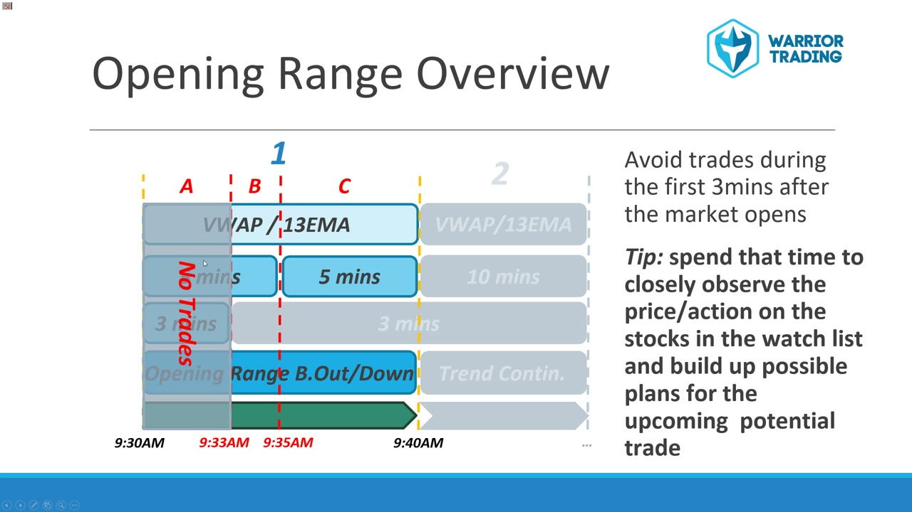

**图怎么看：**

- 图中显示了开盘范围概述，强调在市场开盘后的前三分钟内避免进行任何交易。
- 图中标记了三个关键时间段：A（1389秒）、B（1157秒）和C（2249秒），分别对应不同的市场活动阶段。
- 图中还提到了VWAP/13EMA指标，用于判断市场趋势。
- 图中建议在开盘后的前三分钟内密切观察股票价格动作，并为可能的交易制定计划。

### 关键内容

- 策略基于开盘前的观察，选择合适的股票进行交易。
- 开盘后的前三分钟不进行任何操作，以确保充分了解市场走势。
- 使用13 EMA和预市场高低价作为参考指标。
- 开盘范围突破或反破发生在开盘后的10分钟内。
- 在开盘后的第一根蜡烛确认突破或反破后，再进行交易。
- 设定止损点，通常在1.5倍利润损失比的第一目标附近。
- 根据股票的浮动大小调整进入时机，浮动越大，越谨慎。
- 在开盘后的前三分钟内，观察价格走势，选择合适的股票。
- 开盘后的前三分钟是观察市场走势的关键时期，避免过早行动。
- 开盘后的前三分钟内，不进行任何交易，以确保充分了解市场走势。

### 分析与执行顺序

1. 在开盘后的前三分钟内，观察市场走势，选择合适的股票。
2. 开盘后的前三分钟内，不进行任何交易，以确保充分了解市场走势。
3. 开盘后的10分钟内，寻找突破或反破的机会。
4. 在开盘后的第一根蜡烛确认突破或反破后，再进行交易。
5. 设定止损点，通常在1.5倍利润损失比的第一目标附近。
6. 根据股票的浮动大小调整进入时机，浮动越大，越谨慎。

### 案例与细节

- 在开盘后的前三分钟内，观察市场走势，选择合适的股票。例如，在开盘后的9:33，观察到价格突破了预设的水平，准备进行交易。
- 在开盘后的10分钟内，寻找突破或反破的机会。例如，在开盘后的9:35，观察到价格突破了预设的水平，准备进行交易。
- 在开盘后的第一根蜡烛确认突破或反破后，再进行交易。例如，在开盘后的9:36，价格突破了预设的水平，确认突破后进行交易。
- 设定止损点，通常在1.5倍利润损失比的第一目标附近。例如，在开盘后的9:37，价格突破了预设的水平，确认突破后进行交易，止损点设置在1.5倍利润损失比的第一目标附近。
- 根据股票的浮动大小调整进入时机，浮动越大，越谨慎。例如，在开盘后的9:38，价格突破了预设的水平，确认突破后进行交易，但止损点设置得更保守。

### 风险与边界

- 开盘后的前三分钟内，不进行任何交易，以确保充分了解市场走势。如果市场突然出现异常波动，可能会错过最佳交易机会。
- 开盘后的前三分钟内，不进行任何交易，以确保充分了解市场走势。如果市场趋势发生快速变化，可能会导致交易决策失误。
- 开盘后的前三分钟内，不进行任何交易，以确保充分了解市场走势。如果市场流动性不足，可能会导致交易成本增加。
- 开盘后的前三分钟内，不进行任何交易，以确保充分了解市场走势。如果市场出现重大新闻事件，可能会导致交易决策失误。

### 复盘问题

- 在开盘后的前三分钟内，如何选择合适的股票进行交易？
- 在开盘后的10分钟内，如何判断突破或反破的机会？
- 如何根据股票的浮动大小调整进入时机？
- 在开盘后的前三分钟内，不进行任何交易的原因是什么？

---

## v0729：交易策略：制定清单

> 日期：2019-02-28　·　时长：00:35:31

**本场重点：** 制定交易清单的重要性在于简化决策过程，提高交易纪律性。

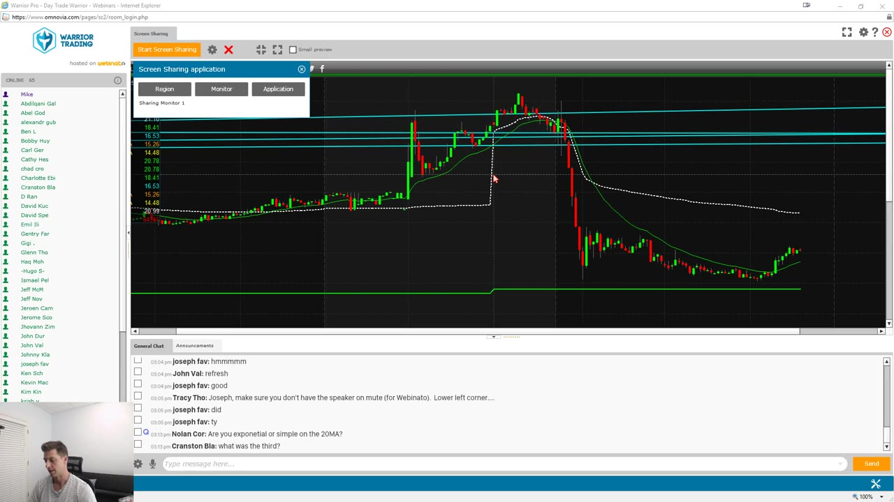

**图怎么看：**

- 画面中，可以看到一个股票的K线图，显示了价格波动和成交量的变化。
- 图中的均线（绿色虚线）显示出价格的趋势方向。
- 交易者可以通过观察这些均线来判断市场的趋势和买卖机会。
- 此外，图B还显示了实时的市场数据，包括成交量和价格变化，帮助交易者做出决策。

### 关键内容

- 交易者往往缺乏结构化的进入和退出策略，这导致交易失误。
- 制定清单有助于减少决策失误，提高交易纪律性。
- 清单应包括每日最大亏损、每笔交易的最大风险以及止损点等关键信息。
- 使用20日移动平均线作为风险管理工具，帮助管理交易平衡。
- 设定止损点时，不应将其置于显而易见的支持或阻力水平之上。
- 交易者应根据市场情况灵活调整风险敞口，但需保持一致性。
- 制定清单有助于应对最坏情况，减少意外损失带来的影响。
- 交易者应定期回顾和调整清单，以适应市场变化。
- 使用简单计算方法确定止损点，如25美分的止损对应150美元的风险敞口

### 分析与执行顺序

1. 讲师首先介绍了交易者常见的问题，即缺乏结构化的进入和退出策略。
2. 然后讲解了如何制定清单，包括每日最大亏损、每笔交易的最大风险等关键信息。
3. 接着演示了如何使用20日移动平均线来管理交易平衡。
4. 最后强调了制定清单的重要性，并鼓励交易者定期回顾和调整清单。
5. 通过实际案例展示了如何应用这些原则，如使用B-I-L-I股票进行短卖的例子。
6. 讲师还提到了在交易过程中遇到的常见问题，如如何处理突破支撑位的情况。
7. 最后，讲师强调了交易者应具备的纪律性和一致性，以提高交易成功率

### 案例与细节

- 在交易Cell Gene时，使用上方VWAP作为止损点，确保止损不在显而易见的支持水平上。
- 设定每笔交易的最大风险为150美元，每日最大亏损为500美元，确保交易者有明确的止损策略。
- 使用20日移动平均线作为参考，当价格突破该线时，交易者应考虑平仓或调整头寸。
- 在交易过程中，如果市场情况发生变化，交易者应重新评估风险敞口并调整止损点。
- 通过实际交易案例，如SQ股票的交易，展示了如何应用这些原则来管理交易风险

### 风险与边界

- 制定清单需要交易者具备一定的市场经验和判断力，否则可能无法准确设定止损点。
- 市场环境的变化可能导致交易策略失效，因此交易者需要定期回顾和调整清单。
- 交易者应避免过度依赖单一指标，如20日移动平均线，以减少单一指标失效的风险。
- 录制年代限制为2019年，交易环境和市场规则可能已发生变化，交易者需结合当前情况进行调整

### 复盘问题

- 如何确保交易者在制定清单时能够准确设定止损点？
- 在交易过程中，如何应对市场环境的变化，确保交易策略的有效性？
- 如何通过定期回顾和调整清单来提高交易者的纪律性和一致性？

---

## v0730：开盘价突破与反破策略详解

> 日期：2019-03-06　·　时长：01:00:58

**本场重点：** 讲解开盘价突破与反破策略，特别关注四种不同情景下的操作方法。

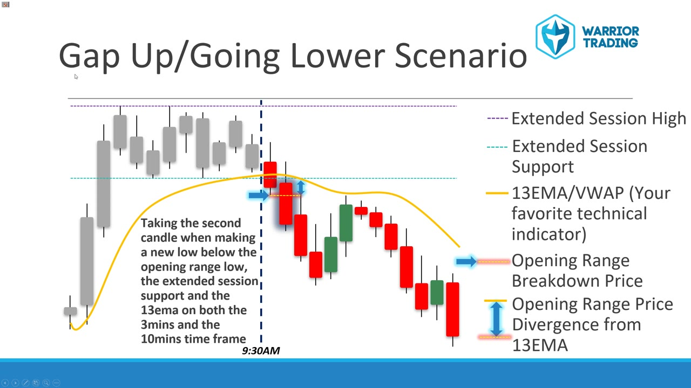

**图怎么看：**

- 在图中，显示了一个开盘价突破并向下移动的场景。
- 当价格在开盘价以下形成新的低点时，应考虑在第二根蜡烛出现。
- 同时，需要确认3分钟和10分钟时间框架上的13EMA/VWAP（您的首选技术指标）。
- 此外，还需注意开盘区间价格与13EMA之间的差异。

### 关键内容

- 开盘价突破发生在市场开盘后的前10分钟，分为三个阶段：9:30-9:33、9:33-9:36、9:36-9:40。
- 开盘价突破或反破策略主要关注9:30-9:40期间的价格走势。
- 开盘价突破通常表现为缺口向上或向下，分别对应上涨或下跌。
- 开盘价反破策略关注缺口向下但收盘价高于开盘价的情况。
- 使用VWAP和L13 EMA作为关键技术指标，帮助识别潜在交易机会。
- 开盘价突破或反破策略需要在市场开盘前确定支撑和阻力水平。
- 开盘价突破策略要求在前三分钟内避免任何交易，以观察价格走势。
- 开盘价反破策略要求在开盘后寻找突破支撑或阻力的机会。
- 开盘价突破策略的成功概率较高，而反破策略则需谨慎对待。
- 开盘价突破策略通常表现为短期趋势，而反破策略则可能需要更长时间确认

### 分析与执行顺序

1. 开盘价突破策略要求在市场开盘前确定支撑和阻力水平。
2. 开盘价突破策略要求在前三分钟内避免任何交易，以观察价格走势。
3. 开盘价突破策略要求在开盘后寻找突破支撑或阻力的机会。
4. 开盘价反破策略要求在开盘后寻找突破支撑或阻力的机会。
5. 开盘价反破策略要求在开盘后确认突破支撑或阻力的有效性。
6. 开盘价突破策略要求在突破后设定止损和止盈点位。
7. 开盘价反破策略要求在反破后设定止损和止盈点位

### 案例与细节

- ticker：SQ；price_action：开盘价反破，股价从低点反弹至高点；strategy：开盘价反破策略；result：成功捕捉到趋势，持续上涨
- ticker：CRM；price_action：开盘价突破，股价从低点反弹至高点；strategy：开盘价突破策略；result：成功捕捉到趋势，持续下跌
- ticker：TSLA；price_action：开盘价突破，股价从低点反弹至高点；strategy：开盘价突破策略；result：成功捕捉到趋势，持续上涨

### 风险与边界

- 开盘价突破策略的成功依赖于市场流动性，流动性不足可能导致策略失效。
- 开盘价反破策略的风险在于可能遇到假突破，导致错误交易。
- 策略的成功率受市场情绪和新闻事件的影响，需谨慎对待。
- 录制年代限制：策略适用于2019年及之后的市场环境，不适用于当前市场变化。
- 策略依赖于特定的技术指标（如VWAP和L13 EMA），这些指标可能因市场变化而失效

### 复盘问题

- 开盘价突破策略和反破策略的主要区别是什么？
- 如何在开盘前确定支撑和阻力水平？
- 在开盘价突破策略中，前三分钟内应如何操作？
- 开盘价反破策略中，如何确认突破的有效性？
- 如何设置止损和止盈点位以确保交易安全？

---

## v0731：Warrior Trading Simulator 操作详解

> 日期：2019-03-07　·　时长：00:52:08

**本场重点：** 了解 Warrior Trading Simulator 的操作方法，特别是期权交易功能；适合使用该平台进行模拟交易的新手。

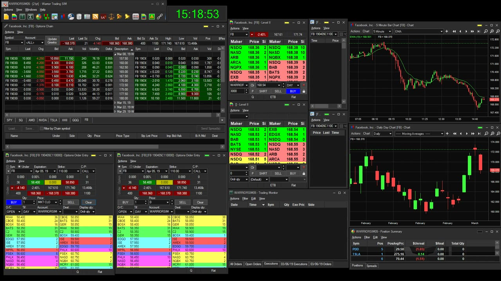

**图怎么看：**

- 在图中可以看到Facebook, Inc. (FB)的5分钟级别图表，显示了股票价格的波动情况。
- 图表上显示了不同时间段的价格变化，包括开盘价、最高价、最低价和收盘价。
- 成交量柱的高度反映对应周期内的总成交量；红绿着色通常跟随价格柱的涨跌规则，不能直接拆成两种方向的主动成交。
- 通过观察图表，可以分析出Facebook, Inc. (FB)股票在过去一段时间内的价格走势和市场情绪。

### 关键内容

- 平台提供了多种窗口，包括期权链、订单录入、图表等，方便用户进行模拟交易。
- 通过双击期权可以快速打开订单录入窗口，简化了交易流程。
- 期权订单录入窗口支持自动设置限价单，无需手动选择。
- 平台还提供了时间销售窗口和Level 2窗口，帮助用户更好地监控市场动态。
- 通过保存布局，用户可以自定义自己的交易界面，提高工作效率。
- 模拟交易中可以使用各种图表和指标，但需注意这些工具可能不如实际交易平台全面。
- 平台支持多种订单类型，但新手需注意时间衰减对交易的影响。
- 通过设置价格警报，用户可以在多个股票之间切换，避免错过交易机会。
- 模拟交易中可以使用止损单，但需注意市场波动可能导致频繁触发止损。
- 模拟交易中可以尝试不同策略，但需注意市场环境的变化可能影响策略效果

### 分析与执行顺序

1. 讲师首先介绍了如何加载自定义布局，这是用户开始模拟交易的第一步。
2. 然后讲解了如何通过双击期权快速打开订单录入窗口，简化了交易流程。
3. 接着详细说明了如何在订单录入窗口中设置限价单，无需手动选择。
4. 讲师还介绍了如何使用时间销售窗口和Level 2窗口来监控市场动态。
5. 最后，讲师强调了保存布局的重要性，以便用户可以根据自己的需求定制界面。
6. 在整个过程中，讲师多次强调了模拟交易与实际交易的区别，提醒用户注意风险。
7. 通过这些步骤，用户可以逐步熟悉 Warrior Trading Simulator 的操作方法

### 案例与细节

- 在订单录入窗口中，用户可以自动设置限价单，只需输入价格即可。
- 通过双击期权，用户可以快速打开订单录入窗口，进行下单操作。
- 在Level 2窗口中，用户可以看到当前的买卖价差，有助于判断市场深度。
- 通过设置价格警报，用户可以在多个股票之间切换，避免错过交易机会。
- 模拟交易中可以使用止损单，但需注意市场波动可能导致频繁触发止损。

### 风险与边界

- 模拟交易与实际交易存在差异，用户需注意这些差异可能带来的风险。
- 模拟交易中可以使用止损单，但需注意市场波动可能导致频繁触发止损。
- 模拟交易中可以尝试不同策略，但需注意市场环境的变化可能影响策略效果。
- 模拟交易平台的功能虽然强大，但可能不如实际交易平台全面，用户需注意这一点。

### 复盘问题

- 如何通过保存布局来定制自己的交易界面？
- 在订单录入窗口中，如何设置限价单？
- 如何使用价格警报来监控市场动态？
- 模拟交易中，如何设置止损单以控制风险？

---

## v0732：支撑与阻力的应用

> 日期：2019-03-13　·　时长：01:07:35

**本场重点：** 支撑与阻力的应用是识别价格水平，制定交易计划的关键步骤。本课程提供了具体的交易策略和实例。注意，这些策略基于历史数据，不适用于当前市场。

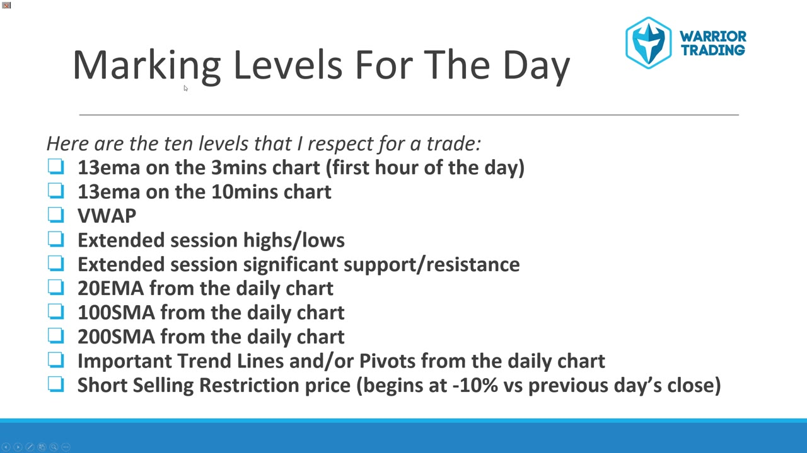

**图怎么看：**

- 整体界面显示了特斯拉(TSLA)的股票图表，包括K线图、均线和其他技术指标。
- 实际可见的ticker为TSLA，周期为3分钟。
- 画面信息展示了如何在特定时间段内标记关键水平，如EMA、VWAP、趋势线等。
- 这张截图不能单独证明任何具体交易策略，但可以作为理解支撑与阻力应用的基础。

### 关键内容

- 支撑与阻力是价格水平，用于识别潜在交易机会。
- 在准备交易日时，标记支撑与阻力水平至关重要。
- 使用13EMA、10分钟EMA等技术指标来识别关键价格水平。
- 确认突破后，等待下一个蜡烛确认，确保交易信号有效。
- 风险管理是交易成功的关键，确保止损点合理。
- 交易策略包括短卖和长买，但以短卖为主。
- 使用预市场模式和趋势线来评估潜在交易机会。
- 交易决策基于价格突破和确认，而非单一价格水平。
- 交易过程中，保持纪律，遵循既定计划。
- 交易策略基于历史数据，不适用于当前市场
- 在每日图表上识别主要价格周期和趋势线，有助于预测价格走势。
- 使用13EMA、10分钟EMA等技术指标，可以更准确地识别关键价格水平，提高交易决策的可靠性。
- 确认突破后，等待下一个蜡烛确认，可以减少假突破带来的误判，提高交易信号的有效性。
- 标记支撑与阻力水平时，关注52周高点和低点，有助于识别长期趋势中的关键支撑和阻力位。
- 交易过程中，保持纪律，遵循既定计划，可以避免情绪波动导致的错误决策，提高交易成功率

### 分析与执行顺序

1. 打开GAP扫描器，查看每日图表，识别主要价格周期和趋势线。
2. 标记支撑与阻力水平，重点关注关键价格点，如52周高点和低点。
3. 使用13EMA、10分钟EMA等技术指标，识别关键价格水平。
4. 确认突破后，等待下一个蜡烛确认，确保交易信号有效。
5. 设置止损点，确保风险管理合理。
6. 根据预市场模式和趋势线评估潜在交易机会。
7. 交易过程中，保持纪律，遵循既定计划

### 案例与细节

- ticker：TSLA；price_level：27890；breakdown：三分钟开盘价低于13EMA；confirmation：第二根蜡烛确认突破；profit_ratio：2.5:1
- ticker：OKTA；price_level：380421；breakdown：三分钟开盘价低于13EMA；confirmation：形成新的低点；profit_ratio：9.5:1
- ticker：SVIX；price_level：2485；breakdown：三分钟开盘价高于13EMA；confirmation：形成新的高点；profit_ratio：40:1
- ticker：TSLA；price_level：27890；breakdown：三分钟开盘价低于13EMA；confirmation：第二根蜡烛确认突破；profit_ratio：2.5:1；此例展示了如何通过确认突破来验证交易信号的有效性。
- ticker：OKTA；price_level：380421；breakdown：三分钟开盘价低于13EMA；confirmation：形成新的低点；profit_ratio：9.5:1；此例说明了确认突破后的蜡烛确认如何增强交易信号的可靠性。
- ticker：SVIX；price_level：2485；breakdown：三分钟开盘价高于13EMA；confirmation：形成新的高点；profit_ratio：40:1；此例展示了如何通过确认突破后的高点来锁定潜在的盈利机会

### 风险与边界

- 交易策略基于历史数据，不适用于当前市场。
- 过度扩展的价格水平可能导致更高的风险。
- 交易过程中需要保持纪律，避免情绪影响。
- 交易决策依赖于特定的技术指标，可能失效
- 过度扩展的价格水平可能导致更高的风险，因为这类价格水平更容易出现反转。
- 交易过程中需要警惕情绪波动，避免因贪婪或恐惧而做出错误的交易决策。
- 交易策略基于历史数据，不适用于当前市场，因此需要谨慎应用。
- 过度依赖技术指标可能导致忽视市场变化，从而错失潜在的交易机会

### 复盘问题

- 如何识别支撑与阻力水平？
- 确认突破后，为什么需要等待下一个蜡烛确认？
- 交易过程中，如何管理风险？

---

## v0733：趋势延续交易策略

> 日期：2019-03-20　·　时长：00:58:10

**本场重点：** 趋势延续是跟随趋势的一种策略，适用于新手，但需注意市场流动性与时间窗口。

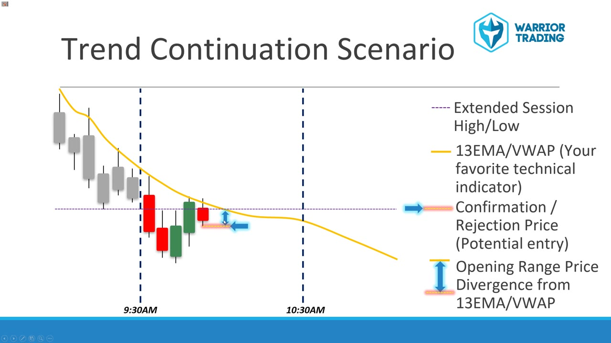

**图怎么看：**

- 图中显示了趋势延续交易策略的应用场景。
- 在图表中，可以看到价格在开盘后不久出现了一次明显的上升，随后在13EMA/VWAP（你的首选技术指标）上方形成一个确认/拒绝的价格点。
- 这表明市场可能正在尝试突破之前的阻力位，从而继续原有的上涨趋势。
- 此外，开盘范围价格与13EMA/VWAP之间的差异也显示出一种潜在的买盘力量，进一步支持了趋势延续的观点。

### 关键内容

- 趋势延续策略基于趋势是你的朋友这一理念。
- 策略包括七个步骤：选择股票、准备入场计划、等待初始动作、寻找突破、适当风险管理、快速进入和管理交易。
- 使用 13 日指数移动平均线（EMA）和成交量加权平均价格（VWAP）作为技术指标。
- 策略主要适用于开盘后的第一个小时，之后市场波动性降低。
- 止损点通常设置在 13 EMA 或 VWAP 上，以确保风险控制。
- 盈利目标通常设定为 1.5 到 2 倍的风险回报比。
- 策略适用于长线和短线交易，但需注意市场流动性。
- 策略适用于特定股票，而非所有股票。
- 在开盘后的第一个小时内，市场流动性最强，因此是执行趋势延续策略的最佳时间窗口。
- 使用 13 日 EMA 和 VWAP 作为技术指标，可以有效识别趋势延续的关键水平，提高交易成功率。
- 趋势延续策略要求交易者保持耐心，等待市场自然形成突破，而不是强行干预市场。
- 交易者需要根据市场情况灵活调整交易计划，避免过度依赖固定模式导致亏损。
- 在开盘后的第一个小时内，市场波动较大，交易者需要密切关注价格走势，及时调整交易策略。

### 分析与执行顺序

1. 首先，选择合适的股票进行交易。
2. 其次，根据前一天的支撑和阻力水平制定入场计划。
3. 第三，等待市场开盘后的初始动作结束。
4. 第四，寻找突破关键水平的机会。
5. 第五，根据风险控制适当调整仓位大小。
6. 第六，一旦价格重新测试关键水平并确认突破，立即入场。
7. 最后，严格遵守交易计划，管理好风险和利润。

### 案例与细节

- ticker：PDT；price_action：开盘前下跌，形成低低低高模式；entry_point：2685；stop_loss：2705；target_profit：2474；risk_reward_ratio：10:1
- ticker：MMK；price_action：开盘后迅速上涨；entry_point：略低于开盘价；stop_loss：略高于开盘价；target_profit：略高于开盘价；risk_reward_ratio：4:1
- ticker：Adobe；price_action：开盘前下跌，形成低低低高模式；entry_point：25460；stop_loss：256；target_profit：略低于开盘价；risk_reward_ratio：0.94:1
- ticker：PDT；price_action：开盘前下跌，形成低低低高模式；entry_point：2685；stop_loss：2705；target_profit：2474；risk_reward_ratio：10:1；在开盘前的低低低高模式中，交易者耐心等待价格突破关键水平，最终获得高额回报。
- ticker：MMK；price_action：开盘后迅速上涨；entry_point：略低于开盘价；stop_loss：略高于开盘价；target_profit：略高于开盘价；risk_reward_ratio：4:1；在开盘后的快速上涨中，交易者利用技术指标确认突破，成功实现盈利。
- ticker：Adobe；price_action：开盘前下跌，形成低低低高模式；entry_point：25460；stop_loss：256；target_profit：略低于开盘价；risk_reward_ratio：0.94:1；在开盘前的低低低高模式中，交易者通过技术指标确认突破，尽管风险回报比略低，但仍成功获利。

### 风险与边界

- 策略仅适用于特定时间段内的市场流动性较强时。
- 止损点设置过低可能导致频繁止损。
- 市场流动性不足时，可能难以执行交易计划。
- 策略适用于特定股票，而非所有股票。
- 开盘后的第一个小时过后，市场流动性减弱，交易者需要警惕市场波动性降低带来的风险。
- 市场流动性不足时，交易者可能无法及时执行交易计划，导致错过最佳交易机会。
- 过度依赖固定模式可能导致交易者忽视市场变化，从而在不利情况下遭受损失。
- 录制年代边界为 2019 年，交易者需要考虑市场环境的变化，避免因时代差异导致的策略失效。

### 复盘问题

- 如何确定股票是否适合应用此策略？
- 如何在开盘后第一个小时内识别关键支撑和阻力水平？
- 如何根据风险控制适当调整仓位大小？

---

## v0734：精准入场技术

> 日期：2019-03-21　·　时长：00:48:42

**本场重点：** 精准入场是交易的关键，通过快速时间框架找到三角形模式来捕捉股票的突破点。

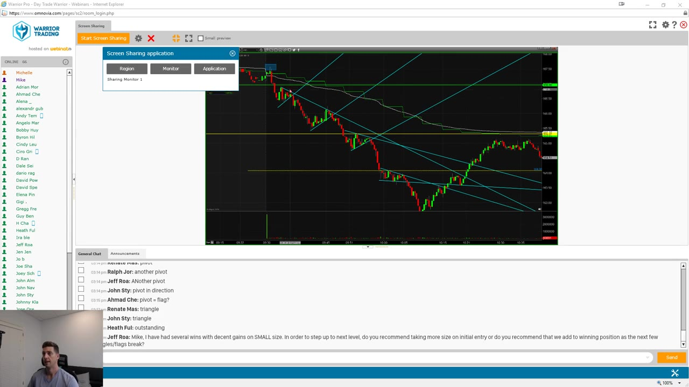

**图怎么看：**

- 画面中的价格先持续下跌，随后低位反弹；多条青色斜线从不同高低点延伸，形成下降通道、交叉位和可能的收敛区域。
- 短期绿色均线跟随价格弯曲，黄色水平线提供更大级别边界；这些线用于缩小观察区域，而不是把整段下跌都当成一个入场点。
- 它对应精准入场技术：在更快时间框架等待三角形或趋势线交汇处的明确触发，同时用最近结构定义紧凑失效位。
- 线条越多不代表信号越强，过度拟合容易事后解释任何走势；实时使用时应只保留交易计划事先定义的关键线。

### 关键内容

- 精准入场依赖于快速时间框架上的三角形模式。
- 三角形模式通常出现在股票突破关键水平时。
- 三角形模式是统计上最强大的突破之一。
- 三角形模式帮助识别最佳入场点，降低风险。
- 快速时间框架上的三角形模式有助于捕捉股票的主要走势。
- 三角形模式的形成需要确认的低点或高点。
- 三角形模式的突破点是最佳入场点。
- 三角形模式的形成需要耐心等待价格行动确认。
- 三角形模式的突破后，应调整止损以锁定利润。
- 三角形模式适用于所有类型的股票，不限于大型股票。

### 分析与执行顺序

1. 首先，观察股票在快速时间框架上的价格行动。
2. 寻找形成三角形模式的迹象，通常出现在突破关键水平时。
3. 确认三角形模式需要低点或高点的确认。
4. 当三角形模式形成并突破时，这是最佳的入场点。
5. 根据三角形模式调整止损，锁定利润。
6. 继续监控价格行动，确保三角形模式的确认。
7. 当三角形模式再次形成时，可以重新入场。

### 案例与细节

- 在Facebook的例子中，股票在快速时间框架上形成了一个三角形模式，突破了20日移动平均线。
- 在PDD的例子中，股票在快速时间框架上形成了一个三角形模式，突破了支撑位2660。
- 在AMD的例子中，股票在快速时间框架上形成了一个三角形模式，突破了趋势线。
- 三角形模式的形成需要确认的低点或高点，例如Facebook的2660和PDD的2650。
- 三角形模式的突破点是最佳的入场点，例如Facebook的16660和PDD的2660。

### 风险与边界

- 快速时间框架上的三角形模式可能不适用于所有类型的股票，尤其是流动性较低的股票。
- 三角形模式的确认需要耐心等待价格行动的确认，这可能导致错过最佳入场点。
- 三角形模式的形成和突破需要时间，这可能影响交易速度。
- 三角形模式的止损调整需要谨慎，过早或过晚的调整都可能导致亏损。

### 复盘问题

- 如何识别快速时间框架上的三角形模式？
- 三角形模式的突破点是如何确定的？
- 在三角形模式形成过程中，如何调整止损以锁定利润？

---

## v0735：如何构建有效的股票观察列表

> 日期：2019-04-11　·　时长：00:33:02

**本场重点：** 构建股票观察列表需要满足三个关键标准：缺口、催化剂和技术形态。这些标准确保股票有潜力进行有意义的交易。

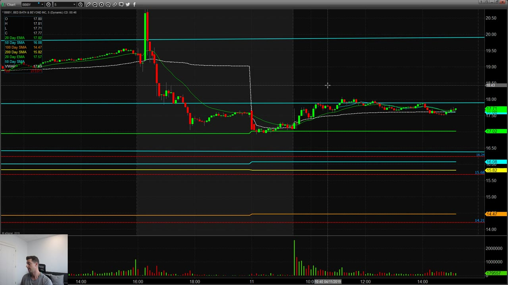

**图怎么看：**

- 在图中可以看到BBBY的K线图，显示了价格趋势。
- 图中有多个均线（50日、100日、200日）和移动平均线（EMA），用于分析价格趋势。
- 成交量柱状图显示了不同时间段的成交量情况。
- 图中还显示了VWAP（虚拟加权平均价格）和价格水平线，帮助识别支撑和阻力位。

### 关键内容

- 缺口至少3%，表明市场情绪强烈。
- 催化剂包括公司公告或新闻，如业绩报告，是推动股价变动的关键。
- 技术形态需要有足够的空间让股票移动，通常通过移动平均线来判断。
- 缺口和催化剂结合，但技术形态最为重要，决定是否将股票加入观察列表。
- 缺口和催化剂只是开始，技术形态是决定股票是否值得交易的关键。
- 使用5分钟图表监控价格动作，确认突破水平后才能考虑交易。

### 分析与执行顺序

1. 首先，识别缺口，缺口至少3%，表明市场情绪强烈。
2. 其次，寻找催化剂，如业绩报告或公司公告，推动股价变动。
3. 然后，检查技术形态，确保股票有足够的空间移动。
4. 最后，使用5分钟图表监控价格动作，确认突破水平后才能考虑交易。
5. 根据上述标准筛选股票，构建观察列表，确保股票有潜力进行有意义的交易。

### 案例与细节

- ICPT在早上出现3%的缺口，随后公布了负面的临床试验数据，导致股价下跌。
- BDBY在早上出现3%的缺口，但因为业绩不佳且缺乏足够的技术支撑，最终未能形成有效的交易。
- WTW在早上出现3%的缺口，虽然分析师下调了目标价，但技术形态良好，提供了交易机会。
- X公司分析师下调评级，但技术形态良好，提供了交易机会。
- BBVY虽然有业绩报告，但技术形态不佳，最终未能形成有效的交易。

### 风险与边界

- 缺口和催化剂结合，但技术形态最为重要，决定是否将股票加入观察列表。如果技术形态不佳，即使有缺口和催化剂，股票也可能无法形成有效的交易。
- 缺口和催化剂结合，但技术形态最为重要，决定是否将股票加入观察列表。如果技术形态不佳，即使有缺口和催化剂，股票也可能无法形成有效的交易。例如，BDBY尽管有3%的缺口和负面催化剂，但由于缺乏技术支撑，最终未能形成有效的交易。
- 在使用5分钟图表监控价格动作时，可能会误判突破水平，尤其是在市场波动较大时。这可能导致过早或过晚采取交易行动，增加交易风险。例如，WTW虽然技术形态良好，但在实际操作中仍需谨慎监控，避免因误判而错失最佳交易时机。

### 复盘问题

- 如何识别缺口，并解释缺口至少3%的重要性？
- 如何区分有效的催化剂和无效的催化剂？
- 如何使用5分钟图表监控价格动作，确认突破水平后才能考虑交易？
- 如何根据缺口、催化剂和技术形态构建有效的股票观察列表？

---

## v0736：高级交易策略详解

> 日期：2019-04-18　·　时长：00:55:58

**本场重点：** 通过SQ和AMD的交易案例，理解如何识别趋势和支撑阻力位，以及如何制定交易策略。

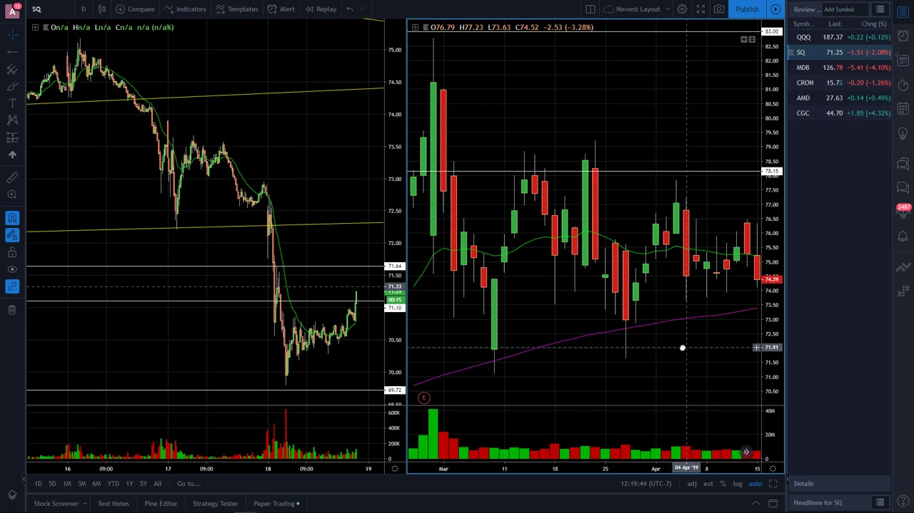

**图怎么看：**

- 画面中，我们可以看到SQ和AMD的K线图，显示了它们的价格走势和成交量。
- 成交量柱的高度反映对应周期内的总成交量；红绿着色通常跟随价格柱的涨跌规则，不能直接拆成两种方向的主动成交。
- 画面中的黄色线条是移动平均线，用于识别趋势和支撑阻力位。
- 画面中的表格显示了当前市场的多个股票，包括SQ、AMD等，提供了实时的价格和变化情况。

### 关键内容

- SQ的熊市整合模式，通过三次测试确认支撑线的有效性。
- SQ突破支撑线后，价格迅速下跌，验证了熊市趋势。
- SQ的交易策略基于技术图表分析，而非事件驱动。
- SQ的交易机会源于熊市整合后的突破，利用支撑线进行短空。
- SQ的交易结果展示了技术分析的重要性，即使短期内亏损也能学到宝贵经验。
- SQ的交易策略依赖于趋势线和支撑阻力位，而非单一指标。
- SQ的交易成功在于耐心等待价格测试支撑线，然后迅速决策。
- SQ的交易风险在于时间衰减和市场波动带来的不确定性。
- SQ的交易策略适用于长期趋势分析，而非短期波动。
- SQ的交易机会来源于市场情绪和技术分析的结合

### 分析与执行顺序

1. 观察SQ的60分钟图表，识别熊市整合模式。
2. 在三次测试支撑线后，确认支撑线的有效性。
3. 当价格突破支撑线时，迅速做出卖出决定。
4. 监控价格行动，确认熊市趋势。
5. 利用支撑线进行短空交易，设定止损点。
6. 耐心等待价格测试支撑线，确保交易策略的准确性。
7. 记录每次交易的结果，总结经验教训

### 案例与细节

- SQ的60分钟图表显示熊市整合模式，形成三底突破。
- SQ的交易策略基于技术图表分析，而非事件驱动。
- SQ的交易机会来源于熊市整合后的突破，利用支撑线进行短空。
- SQ的交易结果展示了技术分析的重要性，即使短期内亏损也能学到宝贵经验。
- SQ的交易策略依赖于趋势线和支撑阻力位，而非单一指标。
- SQ的交易成功在于耐心等待价格测试支撑线，然后迅速决策

### 风险与边界

- SQ的交易策略依赖于市场情绪和技术分析的结合，市场情绪变化可能导致交易失败。
- SQ的交易策略可能在短期内亏损，但长期来看能带来收益。
- SQ的交易策略适用于长期趋势分析，而非短期波动。
- 录制年代限制：此策略适用于2019年市场环境，当前市场环境可能有所不同。
- SQ的交易策略依赖于技术图表分析，市场波动可能导致交易失败

### 复盘问题

- SQ的交易策略是如何识别熊市整合模式的？
- SQ的交易策略是如何利用支撑线进行短空交易的？
- SQ的交易策略在哪些情况下可能会失败？

---

## v0737：技术分析策略与风险管理

> 日期：2019-05-09　·　时长：01:08:14

**本场重点：** 三重底部突破和旗形突破策略的应用，以及风险管理的重要性。

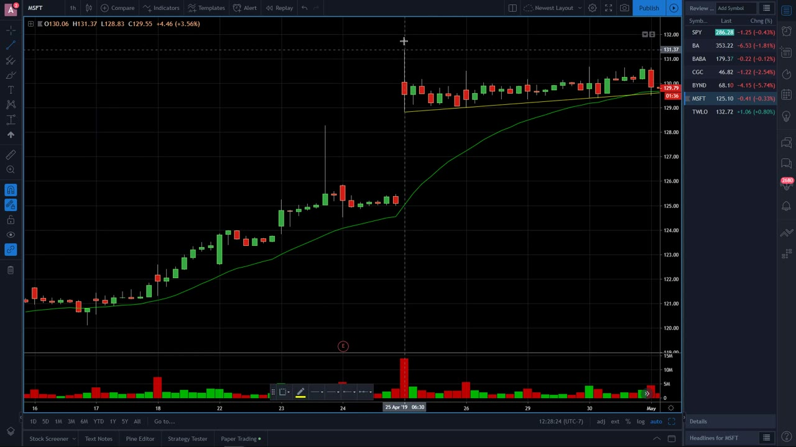

**图怎么看：**

- 在1432秒的截图中，可以看到一个明显的三重底部突破形态，这表明市场可能正在形成新的上升趋势。
- 同时，旗形突破策略也得到了展示，通过观察旗形的形成和突破点，投资者可以更好地理解市场的潜在方向。
- 此外，截图中还包含了实时的成交量柱状图，帮助投资者了解市场的情绪和力量。
- 这些图表和策略对于理解市场动态和制定风险管理计划至关重要。

### 关键内容

- 讲师分享了多种技术分析策略，包括三重底部突破和旗形突破。
- 三重底部突破策略显示股票三次触底同一水平，第四次测试时可能形成突破。
- 旗形突破策略在阿里巴巴（BABA）股票上成功应用，股票突破后继续上涨。
- 熊市整合突破策略在微软（MSFT）和CGC股票上成功应用，股票突破后继续下跌。
- BYND和TWLO股票也分别出现了三重底部突破和旗形突破，策略成功。
- 讲师强调了风险管理的重要性，使用止损单来管理风险。
- 操作步骤包括记录关键支撑和阻力水平，标记趋势线，监测价格行动。
- 失败条件包括突破后出现反弹，价格回到支撑水平以上，或突破后价格继续下跌但幅度有限。
- 平台使用图表分析工具进行技术分析。
- 小盘股策略更适合日内时间框架，因为它们通常表现出强劲的涨势，容易形成突破。
- 旗形突破策略的成功依赖于股票在突破后继续维持原有的上涨或下跌趋势，这表明市场情绪强烈。
- 三重底部突破策略的有效性在于第四次测试突破水平时，股票往往会出现显著的上涨或下跌，这反映了市场信心的变化。
- 支撑和阻力水平的确认需要结合历史价格数据和当前市场情绪，这些数据可以帮助投资者做出更准确的判断。
- 趋势线的标记是识别突破的关键步骤，它帮助投资者确定市场的方向，从而做出更明智的投资决策。
- 价格行动的监测是确认突破是否有效的关键，这要求投资者密切关注市场动态，以便及时调整策略。

### 分析与执行顺序

1. 讲师介绍了多种技术分析策略，包括三重底部突破和旗形突破。
2. 记录关键支撑和阻力水平，标记趋势线，以识别突破点。
3. 监测价格行动，以确认突破的有效性。
4. 使用止损单来管理风险，尤其是在突破后出现反弹时。
5. 计划在突破后立即卖出，以避免损失。
6. 区分价格行为和市场行为，市场行为对个股很重要，需要同时分析。

### 案例与细节

- B.A.股票在第四次测试三重底部突破水平时形成了突破。
- 阿里巴巴（BABA）股票经历了上涨趋势后转为横向整理，随后突破旗形。
- 微软（MSFT）股票经历了下跌趋势后转入横向整理，最终突破趋势线。
- CGC股票也经历了下跌趋势后转入横向整理，最终突破趋势线。
- BYND股票经历了下跌趋势后转入横向整理，最终突破趋势线。
- TWLO股票经历了下跌趋势后转入横向整理，最终突破趋势线。
- 阿里巴巴（BABA）股票在突破旗形后，价格迅速上升了10%，显示出强烈的市场买盘兴趣。
- 微软（MSFT）股票在突破熊市整合趋势线后，连续三天上涨超过5%，验证了熊市整合突破策略的有效性。
- CGC股票在突破熊市整合趋势线后，价格在接下来的一周内下跌了3%，这表明市场情绪并未完全转向乐观。

### 风险与边界

- 如果突破后出现反弹，且价格回到支撑水平以上，则应考虑止损。
- 如果突破后价格继续下跌，但幅度有限，则应考虑继续持有。
- 支撑位可能不是明确可见的，但在价格下跌时可以考虑在支撑位附近平仓。
- 长期趋势线不适用于日内交易，因为市场反应不够精确。
- 如果突破后价格出现大幅回调，且未能恢复原趋势，这可能是市场情绪发生变化的信号，投资者应考虑止损。
- 长期趋势线在短期内可能显得模糊不清，导致投资者无法准确判断市场走势，从而增加决策失误的风险。
- 过度依赖技术指标而忽视基本面分析，可能导致投资者忽略公司实际经营状况的变化，从而做出错误的投资决策。

### 复盘问题

- 三重底部突破策略的关键点是什么？
- 旗形突破策略的成功案例有哪些？
- 如何使用止损单来管理风险？
- 在什么情况下应该考虑继续持有？
- 区分价格行为和市场行为有什么重要性？

---

## v0738：识别并避免过度延伸模式

> 日期：2019-07-03　·　时长：00:53:11

**本场重点：** 识别过度延伸模式，避免被陷阱，理解市场行为

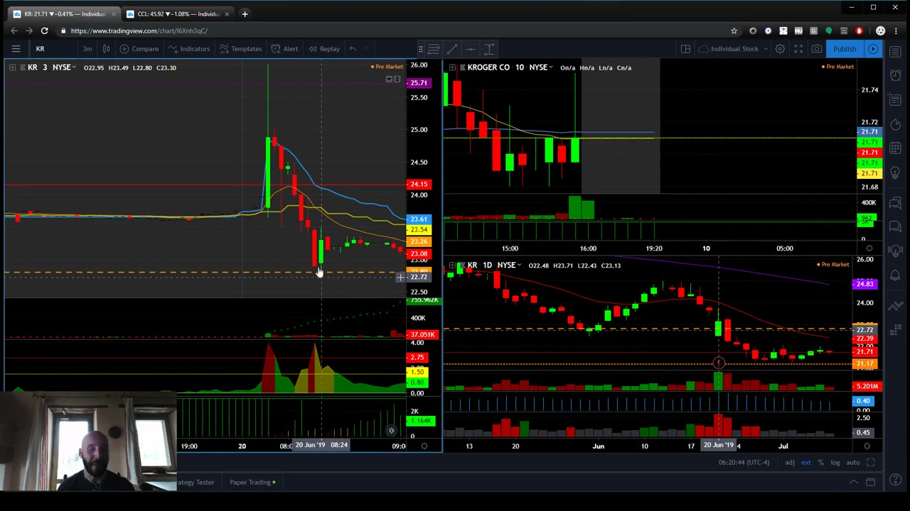

**图怎么看：**

- 画面中，可以看到KROGER CO股票的价格走势，显示了开盘价、最高价、最低价和收盘价。
- 图中的水平线表示支撑位和阻力位，帮助投资者判断股价可能的波动范围。
- 成交量柱状图显示了不同时间段内的买卖活动，有助于分析市场的活跃程度。
- 通过观察这些图表，投资者可以更好地理解市场行为，并做出相应的投资决策。

### 关键内容

- 在预市期间寻找特定模式，如缺口、价格范围和成交量
- 过度延伸模式可能导致市场反转，增加风险
- 识别过度延伸模式需要客观分析，避免确认偏差
- 过度延伸模式通常出现在高阻力水平附近
- 过度延伸模式可能在开盘后迅速反转
- 过度延伸模式可能导致后续交易失败
- 过度延伸模式可能出现在关键支撑或阻力水平附近
- 过度延伸模式可能在开盘后迅速扩展
- 过度延伸模式通常出现在高阻力水平附近，因为大量卖压聚集在此，容易引发市场反转。
- 识别过度延伸模式需要关注价格范围和成交量的变化，尤其是当价格突破关键支撑或阻力水平时。
- 过度延伸模式可能导致开盘后的快速反弹，形成新的高点，这增加了交易失败的风险。
- 过度延伸模式可能在开盘前形成紧缩的价格区间，随后迅速扩大，表明市场情绪急剧变化。
- 过度延伸模式的出现往往伴随着成交量的显著增加，这增加了市场波动性和不确定性。

### 分析与执行顺序

1. 在预市期间筛选股票，寻找特定模式
2. 识别过度延伸模式，注意价格范围和成交量
3. 监控开盘前的价格走势，避免过度延伸模式
4. 在开盘后重新评估交易机会，避免过度延伸模式
5. 识别过度延伸模式后，等待更好的交易机会

### 案例与细节

- ticker：KR；price_range：从22.30到22.80；volume：50,000到1.5百万；pattern：缺口后回撤，形成新的低点；behavior：开盘后迅速反弹，形成新的高点
- ticker：CCL；price_range：从47.90到47.14；volume：三根红色蜡烛；pattern：缺口后回撤，形成新的低点；behavior：开盘后迅速反弹，形成新的高点
- ticker：KR；price_range：从22.30到22.80；volume：50,000到1.5百万；pattern：缺口后回撤，形成新的低点；behavior：开盘后迅速反弹，形成新的高点；观察证据显示，价格在开盘前形成了一个紧缩的价格区间，随后迅速扩大，表明市场情绪急剧变化。
- ticker：CCL；price_range：从47.90到47.14；volume：三根红色蜡烛；pattern：缺口后回撤，形成新的低点；behavior：开盘后迅速反弹，形成新的高点；观察证据显示，价格在开盘前形成了一个紧缩的价格区间，随后迅速扩大，表明市场情绪急剧变化。

### 风险与边界

- 过度延伸模式可能在开盘后迅速反转，导致交易失败
- 过度延伸模式可能出现在关键支撑或阻力水平附近，增加风险
- 过度延伸模式可能在开盘后迅速扩展，增加风险
- 录制年代限制为2019年，市场环境可能已发生变化
- 过度延伸模式可能导致开盘后的快速反弹，形成新的高点，这增加了交易失败的风险。
- 过度延伸模式可能出现在关键支撑或阻力水平附近，增加交易失败的可能性。
- 过度延伸模式可能在开盘后迅速扩展，增加市场波动性和不确定性，从而增加交易风险。
- 录制年代限制为2019年，市场环境可能已发生变化，因此过度延伸模式的识别和应对策略需结合当前市场情况进行调整。

### 复盘问题

- 如何识别过度延伸模式？
- 在开盘前如何监控价格走势？
- 如何避免被过度延伸模式的陷阱？

---

## v0739：设置波动率预期

> 日期：2019-07-17　·　时长：01:10:05

**本场重点：** 通过分析过去的大波动日来预测未来的波动性，以提高交易成功率。

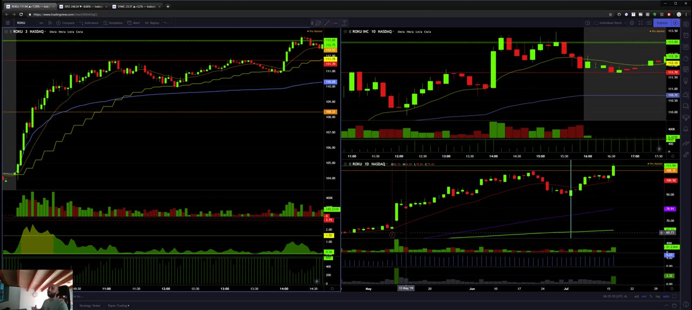

**图怎么看：**

- 画面中，可以看到DOMINOS PIZZA INC.的股价在特定时间段内经历了显著的波动。
- 成交量柱的高度反映对应周期内的总成交量；红绿着色通常跟随价格柱的涨跌规则，不能直接拆成两种方向的主动成交。
- 水平线和趋势线可能用于识别支撑和阻力位，帮助判断价格走势。
- 通过观察这些图表，可以分析过去的波动性，并据此预测未来的波动性。

### 关键内容

- 使用ATR（平均真实范围）来衡量股票在一天内的波动幅度。
- 回顾过去的大波动日，了解股票的潜在波动性。
- 寻找大波动日后的价格走势，确认股票是否具有持续上涨的动力。
- 利用13EMA（13分钟移动平均线）和3分钟图表来确认价格走势。
- 在大波动日后的首次测试中，确认价格是否能突破关键支撑位。
- 根据历史数据调整止损点，确保合理止损。
- 利用高相对成交量来判断未来可能的波动性。
- 结合技术指标和市场情绪来综合评估波动性。
- 在预市期间分析过去的大波动日，以预测当前市场的波动性。
- 通过实际交易案例展示如何应用波动率预期策略

### 分析与执行顺序

1. 查看每日图表上的ATR值，确定股票的波动范围。
2. 回顾过去的大波动日，分析股票的潜在波动性。
3. 在大波动日后的首次测试中，确认价格是否能突破关键支撑位。
4. 利用13EMA和3分钟图表来确认价格走势，确保趋势明确。
5. 根据历史数据调整止损点，确保合理止损。
6. 在预市期间分析过去的大波动日，以预测当前市场的波动性。
7. 结合技术指标和市场情绪来综合评估波动性，确保策略有效

### 案例与细节

- ticker：ROKU；price_moves：从开盘价到最高价，涨幅超过19%。；volume：相对成交量显著增加，显示市场兴趣。；chart_analysis：13EMA和3分钟图表显示强劲的上升趋势。；entry_point：在13EMA附近买入，确认趋势明确。；target：设定第一目标为1.5倍，第二目标为4倍，第三目标为6倍。；outcome：股票继续上涨，达到所有目标。
- ticker：DPZ；price_moves：开盘后迅速下跌，但随后反弹。；volume：相对成交量显著增加，显示市场兴趣。；chart_analysis：13EMA和3分钟图表显示强劲的上升趋势。；entry_point：在13EMA附近买入，确认趋势明确。；target：设定第一目标为1.5倍，第二目标为4倍，第三目标为6倍。；outcome：股票继续上涨，达到所有目标。
- ticker：SYMC；price_moves：开盘后大幅下跌，但随后反弹幅度有限。；volume：相对成交量显著减少，显示市场兴趣减弱。；chart_analysis：13EMA和3分钟图表显示波动性降低。；entry_point：未采取行动，因为缺乏持续上涨的动力。；target：无。；outcome：股票继续下跌，未达到预期目标。

### 风险与边界

- 波动性预期策略依赖于历史数据，因此在市场环境变化时可能失效。
- 过度依赖单一指标可能导致误判，需要结合多种技术指标进行分析。
- 波动性预期策略适用于日内交易，不适合长期投资。
- 录制年代限制为2019年，市场环境和监管规则可能已发生变化。

### 复盘问题

- 回顾Roku和DPZ的交易案例，哪些因素导致了成功？
- SYMC的交易案例中，哪些因素导致了失败？
- 如何结合多个技术指标来更准确地预测波动性？
- 在预市期间分析过去的大波动日时，需要注意哪些关键指标？
- 如何根据历史数据调整止损点，以确保合理的风险控制？

---

## v0740：AMD和黄金的交易策略

> 日期：2019-08-08　·　时长：01:12:37

**本场重点：** 通过技术分析确定目标价格和交易策略，以及使用期权进行风险管理。

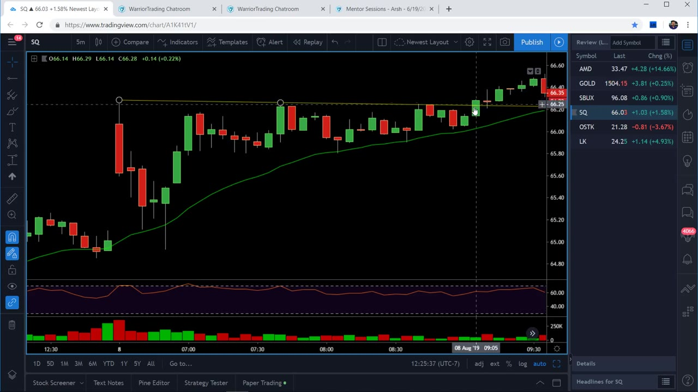

**图怎么看：**

- 在1524秒的截图中，可以看到TradingView平台上的K线图，显示了AMD和黄金的价格走势。
- 截图中还显示了均线（绿色线），帮助识别趋势方向。
- 成交量柱的高度反映对应周期内的总成交量；红绿着色通常跟随价格柱的涨跌规则，不能直接拆成两种方向的主动成交。
- 截图提供了实时市场数据，有助于理解当前市场的动态。

### 关键内容

- AMD的阻力位3,414预计会引发短期回调，短线交易者应在接近阻力位时开仓。
- 帕尔·图德·琼斯预测未来12到24个月黄金将涨至1,700美元，使用技术分析确定目标价格。
- 星巴克形成了一种看涨收敛，突破趋势线的概率较高，但完成范围扩展的概率较低。
- 使用期权的优势包括杠杆效应和灵活性，计算盈亏平衡价格等于期权成本加上行权价。
- Netflix的三重底部突破后，出现反向缺口，应立即卖出，大型股交易同样能获得类似回报。
- 不建议关注Level 2，因为它主要由算法主导，不利于长期交易。
- 初始账户规模为500美元时，风险为100%，但随着账户增长，风险控制在1000美元以内。
- 虚值期权更具有投机性，而实值期权更稳健，达到80%的成功率需要大量经验和技术分析。
- 通过两年的试错，最终建立了稳定的交易策略，分享了黄金交易机会。
- Warrior Trading Simulator中的绿色虚线可能是最后成交价格，需进一步确认。
- 帕尔·图德·琼斯预测未来12到24个月黄金将涨至1,700美元，基于长期盘整和红烛显示的强劲阻力。
- 使用技术分析确定目标价格，例如通过之前的支撑点测量范围扩展，预测金价可能达到1,600美元。
- 大型股交易提供了极高的胜算，几乎每次都能将胜算放在自己一边，通过技术分析找到活跃交易的股票。
- 使用期权的优势包括杠杆效应和灵活性，例如购买35美元的看涨期权，盈亏平衡价格为35+11=46美元，适合日内突破或止损买入。
- 通过两年的试错，最终建立了稳定的交易策略，分享了黄金交易机会，强调了耐心和持续学习的重要性。

### 分析与执行顺序

1. 分析大型股票市场的走势，识别关键阻力位和支撑位。
2. 使用技术分析工具确定目标价格和交易策略，例如使用图表分析和期权分析。
3. 根据交易者的风险承受能力，调整初始账户规模和风险控制。
4. 通过实际交易案例，如星巴克和Netflix，验证交易策略的有效性。
5. 利用期权进行风险管理，计算盈亏平衡价格，确保交易策略的稳健性。
6. 分享成功的交易经验，鼓励新手交易者建立自己的交易策略。
7. 使用Warrior Trading Simulator进行模拟交易，验证交易策略的实际效果。

### 案例与细节

- AMD的阻力位3,414，预计会引发短期回调。
- 星巴克形成了一种看涨收敛，突破趋势线的概率较高。
- Netflix的三重底部突破后，出现反向缺口，应立即卖出。
- 使用期权的优势包括杠杆效应和灵活性，例如购买35美元的看涨期权，盈亏平衡价格为35+11=46美元。
- AMD的阻力位3,414预计会引发短期回调，短线交易者应在接近阻力位时开仓，止损设在阻力位上方。
- 星巴克形成了一种看涨收敛，突破趋势线的概率较高，但完成范围扩展的概率较低，适合日内突破或止损买入。
- Netflix的三重底部突破后，出现反向缺口，应立即卖出，大型股交易同样能获得类似回报，通过技术分析找到活跃交易的股票。

### 风险与边界

- Level 2主要由算法主导，不利于长期交易，因此不建议关注。
- 初始账户规模为500美元时，风险为100%，随着账户增长，风险控制在1000美元以内。
- 虚值期权更具有投机性，而实值期权更稳健，达到80%的成功率需要大量经验和技术分析。
- Warrior Trading Simulator中的绿色虚线可能是最后成交价格，需进一步确认。
- 不建议关注Level 2，因为它主要由算法主导，不利于长期交易，可能导致决策失误。
- 初始账户规模为500美元时，风险为100%，随着账户增长，风险控制在1000美元以内，需谨慎管理资金。
- 虚值期权更具有投机性，而实值期权更稳健，达到80%的成功率需要大量经验和技术分析，避免盲目跟风。

### 复盘问题

- 如何根据技术分析确定目标价格和交易策略？
- 使用期权进行风险管理的具体步骤是什么？
- 为什么不建议关注Level 2？
- 如何通过实际交易案例验证交易策略的有效性？
- 达到80%的成功率需要哪些经验和技能？

---

## v0741：趋势线突破策略与价格行为分析

> 日期：2019-08-15　·　时长：01:18:55

**本场重点：** 本课程重点讲解了如何利用趋势线突破策略进行交易，并通过具体案例分析了价格行为的重要性。

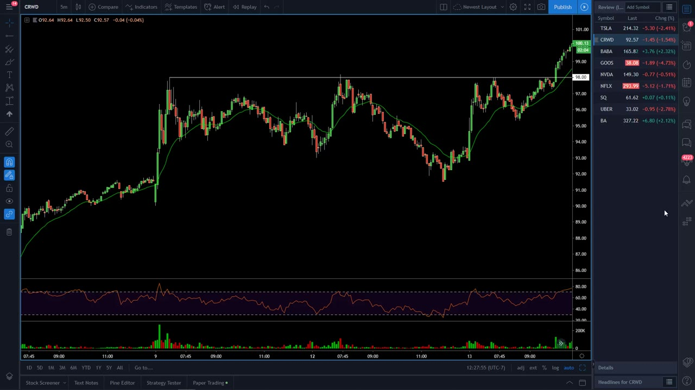

**图怎么看：**

- 画面中，可以看到趋势线突破后的价格走势，这表明市场可能进入新的趋势。
- 图中的绿色趋势线显示了当前的趋势方向，而红色蜡烛表示价格的波动。
- 通过观察价格行为和趋势线的突破，可以判断市场的潜在方向。
- 此图例展示了如何使用趋势线突破策略进行交易决策。

### 关键内容

- 特斯拉在60分钟图上形成了一个趋势线突破，突破发生在228美元，确认了趋势线的突破。
- 阿里巴巴在开盘后形成了一个三重底形态，突破了16650美元的关键支撑位，确认了有效突破。
- 奈飞在开盘后形成了一个三重底形态，突破了320.50美元的关键支撑位，确认了有效突破。
- 讲师强调了在关键点设置止损的重要性，特别是在突破趋势线后，如果价格反弹到之前的高点，则表明交易想法可能错误。
- 第四次突破通常会立即突破，但有时也会出现反弹，需要仔细分析。
- 确认突破后，股价保持在支撑位以下，确认了有效突破。
- 风险在于如果股价回升至支撑位以上，则可能表明突破无效。
- 讲师强调了根据价格行为来判断是否执行交易的重要性，特别是在突破趋势线后，如果价格反弹，则应考虑退出。
- 设置止损时，特斯拉止损设在支撑位附近，阿里巴巴和奈飞止损设在阻力位附近。
- 操作过程中，需要确认突破是否有效，确认后继续持有，否则退出。

### 分析与执行顺序

1. 讲师首先介绍了特斯拉的趋势线突破策略，包括形成三重顶形态和突破228美元。
2. 随后，讲师讲解了阿里巴巴的三重底突破策略，包括突破16650美元的关键支撑位。
3. 接着，讲师介绍了奈飞的三重底突破策略，包括突破320.50美元的关键支撑位。
4. 讲师强调了在关键点设置止损的重要性，特别是在突破趋势线后，如果价格反弹到之前的高点，则表明交易想法可能错误。
5. 最后，讲师总结了如何根据价格行为来判断是否执行交易，特别是在突破趋势线后，如果价格反弹，则应考虑退出。

### 案例与细节

- 特斯拉：趋势线突破，止损设在支撑位附近。
- 阿里巴巴：三重底突破，止损设在阻力位附近。
- 奈飞：三重底突破，止损设在阻力位附近。
- 突破后，股价保持在支撑位以下，确认了有效突破。
- 风险在于如果股价回升至支撑位以上，则可能表明突破无效。
- 讲师强调了在关键点设置止损的重要性，特别是在突破趋势线后，如果价格反弹到之前的高点，则表明交易想法可能错误。

### 风险与边界

- 风险在于如果股价回升至支撑位以上，则可能表明突破无效。
- 虽然紧缩止损可以减少风险，但如果价格反弹，则可能导致过早退出。
- 讲师强调了在关键点设置止损的重要性，特别是在突破趋势线后，如果价格反弹到之前的高点，则表明交易想法可能错误。
- 第四次突破通常会立即突破，但有时也会出现反弹，需要仔细分析。

### 复盘问题

- 如何在突破趋势线后设置止损？
- 如何根据价格行为来判断是否执行交易？
- 在突破趋势线后，如果价格反弹到之前的高点，应该如何处理？
- 讲师提到的第四次突破通常会立即突破，但有时也会出现反弹，这需要如何分析？

---

## v0742：牛旗形态与技术分析

> 日期：2019-09-19　·　时长：01:14:19

**本场重点：** 识别牛旗形态的关键支撑位和突破后的交易机会，以及如何利用技术分析工具进行交易决策。

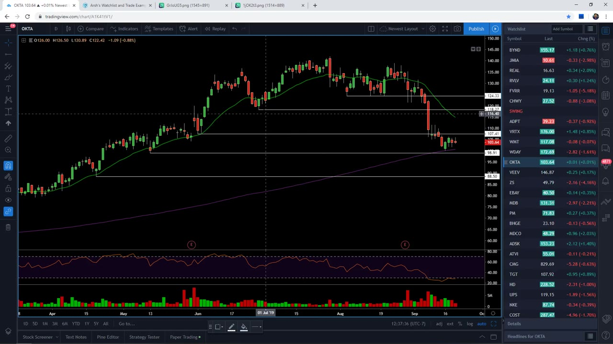

**图怎么看：**

- 在1560秒的课程画面中，可以看到多个股票的K线图，包括OKTA、NOW等。
- 截图显示了不同股票的价格走势，其中OKTA的K线图显示出明显的上升趋势。
- 截图右侧的表格列出了多个股票的最新价格和涨跌幅，帮助投资者了解市场动态。
- 通过观察这些图表和表格，投资者可以更好地理解当前市场的状况，并做出相应的交易决策。

### 关键内容

- 牛旗形态是指强劲上涨趋势后跟随横向整理，预示后续可能继续上涨。
- 18834是重要支撑位，帮助股票保持在该区间内。
- 204作为目标价，因为突破趋势线后没有重大阻力。
- 三线趋势线作为关键阻力点，第三测试通常会拒绝突破。
- 关键趋势线的拒绝信号表明可能成为重大触发点。
- 185是另一个可能的触发点，但未参与。
- 趋势线突破点提供了低风险高概率入场机会。
- Octa的三底突破后，技术上进入熊市。
- 11点的蜡烛显示突破趋势线，但未立即短空。
- 确保止损紧贴，避免过大风险。
- 185作为另一个可能的触发点，虽然未参与，但其位置对后续走势有重要参考价值。
- 三线趋势线作为关键阻力点，第三测试通常会拒绝突破，表明市场力量在此平衡。
- 关键趋势线的拒绝信号表明可能成为重大触发点，需密切关注市场动态。
- 趋势线突破点提供了低风险高概率入场机会，但需结合其他技术指标综合判断。
- 18834是重要支撑位，帮助股票保持在该区间内，表明市场在此区域存在较强支撑力

### 分析与执行顺序

1. 识别牛旗形态的关键支撑位和趋势线。
2. 观察突破后的价格走势，确认突破的有效性。
3. 设置止损和止盈，控制风险。
4. 利用技术分析工具，如蜡烛图和趋势线，进行交易决策。
5. 关注关键支撑位和阻力位的变化，及时调整交易策略。

### 案例与细节

- RTN出现牛旗形态，突破后目标价在204至214.76之间。
- 18834是重要支撑位，帮助股票保持在该区间内。
- 204作为目标价，因为突破趋势线后没有重大阻力。
- 三线趋势线作为关键阻力点，第三测试通常会拒绝突破。
- 11点的蜡烛显示突破趋势线，但未立即短空。
- RTN出现牛旗形态，突破后目标价在204至214.76之间，显示突破后的价格走势具有较高的预测价值。
- BBY股票的平底未被突破，表明可能会上涨，6915仍然是关键水平，突破后可能继续上涨，说明关键支撑位的重要性。
- FANG股票（FAANG）包括Facebook、Apple、Amazon、Netflix、Nvidia和Google，这些科技巨头的走势对市场情绪有显著影响
- NOW股票在日线图上形成了横向整理形态，但尚未形成有效的做空机会，现在正寻找向上突破的机会，说明技术形态的多样性
- Octa的三底突破后，技术上进入熊市，显示技术分析在判断市场趋势方面的作用

### 风险与边界

- 市场条件发生变化时，牛旗形态可能不再适用。
- 突破后的价格走势可能与预期不符，导致交易失败。
- 止损设置不当可能导致资金损失。
- 录制于2019年，当前市场条件可能有所不同。
- 市场条件发生变化时，牛旗形态可能不再适用，需重新评估市场环境。
- 突破后的价格走势可能与预期不符，导致交易失败，需灵活调整策略。
- 止损设置不当可能导致资金损失，需严格遵守止损原则。
- 录制于2019年，当前市场条件可能有所不同，需结合最新数据进行分析

### 复盘问题

- 如何识别牛旗形态的关键支撑位和趋势线？
- 突破后的价格走势如何确认？
- 如何设置止损和止盈以控制风险？
- 当前市场条件是否与2019年录制时相同？

---

## v0743：日内交易与技术分析

> 日期：2019-10-24　·　时长：01:15:42

**本场重点：** 讲师强调了使用支撑和阻力水平的重要性，并指出这些水平需要被测试至少三次才能被视为有效的突破点。

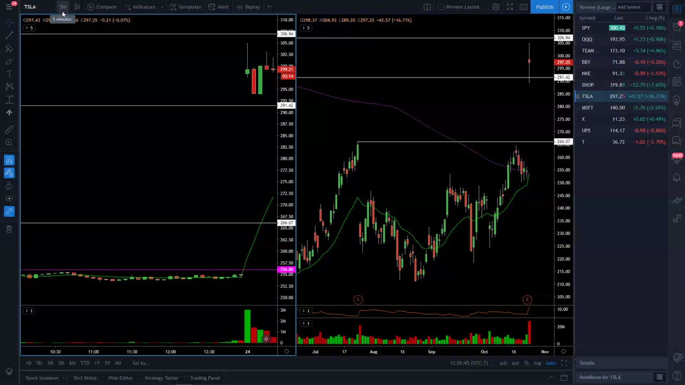

**图怎么看：**

- 这张截图显示了特斯拉(TSLA)在2019年10月到11月期间的5分钟K线图。
- 可以看到价格在不同时间段内波动较大，显示出市场的活跃度。
- 成交量柱的高度反映对应周期内的总成交量；红绿着色通常跟随价格柱的涨跌规则，不能直接拆成两种方向的主动成交。
- 均线（紫色）显示了价格的趋势方向，有助于识别趋势和支撑/阻力水平。

### 关键内容

- 讲师专注于大型股票市场的日内交易和摆动交易，强调了跟踪SPY和QQQ ETF的重要性。
- SPY日线图显示形成收敛模式，突破趋势线将是一个看涨信号。
- 讲师关注微软的三重顶突破，预计会突破至14168上方。
- 讲师提到使用第一个五分钟蜡烛的低点作为支撑水平，对于AMD股票，短期内可能继续上涨。
- 讲师建议关注大型股票市场中的热门股票，并定期更新自己的观察列表。
- 对于短期交易，更倾向于使用股票而不是期权，因为期权的时间衰减可能会影响交易结果。
- 讲师提到使用Trading View平台进行交易，但平台问题和技术困难导致错过某些交易机会。
- 讲师分析了AMD股票的价格走势，认为短期内可能继续上涨，但长期来看，由于即将公布的财报，可能会出现大幅波动。
- 讲师强调了正确时机的重要性，以最小化风险，并指出使用成交量作为交易信号的方法。
- 讲师提到，当股票价格出现显著下跌时，成交量的增加可以作为潜在买入信号。
- 讲师提到，使用第一个五分钟蜡烛的低点作为支撑水平，这有助于识别可靠的支撑点，从而减少误判的风险。
- 讲师建议关注大型股票市场中的热门股票，因为这些股票通常具有更高的流动性，有助于降低交易成本。
- 讲师强调了正确时机的重要性，以最小化风险，这意味着需要密切关注市场动态，及时调整交易策略。
- 讲师提到使用Trading View平台进行交易，这表明该平台提供了丰富的图表工具和实时数据，有助于提高交易效率。
- 讲师分析了AMD股票的价格走势，认为短期内可能继续上涨，这说明技术分析可以提供有价值的市场洞察。

### 分析与执行顺序

1. 讲师首先介绍了自己专注于大型股票市场的日内交易和摆动交易。
2. 然后，讲师分析了SPY和QQQ ETF的走势，指出SPY接近历史高点，市场可能在接下来几天突破。
3. 接着，讲师更新了他的监控列表，从Google Docs迁移到Microsoft Excel。
4. 讲师分享了Team的短期警报，关注旗形收敛突破，并解释了如何通过价格触发来管理交易。
5. 最后，讲师分析了AMD股票的价格走势，预测其可能继续上涨，并讨论了如何识别支撑和阻力水平。

### 案例与细节

- BBY在突破平顶收敛后，可能会上涨至7449。
- Shop在近期出现大幅下跌，提供了短期做空机会。
- J.P. Morgan的盘前跳空为突破提供了动力。
- T的3671支撑位，预计不会突破，但需关注盘后表现。
- BBY在突破平顶收敛后，可能会上涨至7449，这表明技术形态的突破可以作为预测未来走势的重要依据。
- Shop在近期出现大幅下跌，提供了短期做空机会，这说明市场情绪变化可以成为交易决策的重要参考。
- J.P. Morgan的盘前跳空为突破提供了动力，这说明盘前的表现可以影响当天的交易策略。

### 风险与边界

- 讲师提到的市场条件和策略基于2019年的市场情况，可能不适用于当前市场。
- 使用成交量作为交易信号的方法需要谨慎，因为成交量的变化可能受到多种因素影响。
- 正确识别支撑和阻力水平需要丰富的经验和市场洞察力。
- 平台问题和技术困难可能导致错过某些交易机会。
- 使用成交量作为交易信号的方法需要谨慎，因为成交量的变化可能受到多种因素影响，如市场情绪波动等。
- 正确识别支撑和阻力水平需要丰富的经验和市场洞察力，否则容易产生误判，导致交易失败。
- 平台问题和技术困难可能导致错过某些交易机会，这说明技术基础设施的稳定性对交易成功至关重要。

### 复盘问题

- 讲师是如何确定支撑和阻力水平的？
- 为什么讲师建议关注大型股票市场中的热门股票？
- 如何利用成交量作为交易信号？
- 讲师提到的市场条件和策略是否仍然适用当前市场？

---

## v0744：交易如何改变生活

> 日期：2019-12-26　·　时长：00:55:19

**本场重点：** 交易改变了作者的生活，不仅提高了效率，还增强了自我控制和心理韧性。

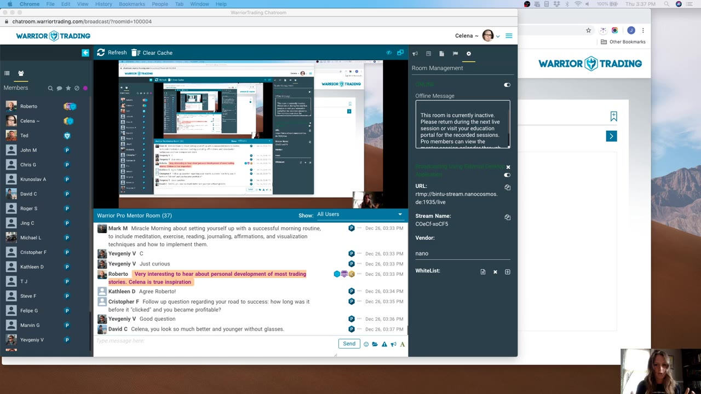

**图怎么看：**

- 这张图片显示了一个关于交易如何改变生活的课程资源列表。
- 资源包括Gary Dayton的《Trade Mindfully》、Mark Douglas的《Trading in the Zone》等书籍。
- 此外，还提到了Steven Proctor的Mindfulness Training应用、CrossFit或其他高强度训练计划。
- 最后，提到了FOMO Fridays和Mindful Mondays的活动。

### 关键内容

- 作者从2016年秋季开始交易，至今已有三年。
- 交易改变了作者的生活，不仅提高了效率，还增强了自我控制和心理韧性。
- 作者强调了行为模仿的重要性，如遵循规则和自我纪律。
- 作者分享了如何通过冥想和锻炼来提高交易表现。
- 交易帮助作者更好地理解自己的情绪和动机，从而做出更好的决策。
- 作者提到交易带来的意外收获，如更冷静的性格和更高的自我同情。
- 作者推荐了一些书籍和资源，如《Trade Mindfully》和《Trading in the Zone》。
- 作者分享了如何通过设定每日目标来提高交易表现。
- 作者强调了交易心理的重要性，以及如何通过自我反思来改进。
- 作者提到交易初期的心理压力和如何克服它

### 分析与执行顺序

1. 作者回顾了自己从2016年秋季开始交易的经历。
2. 作者分享了如何通过行为模仿来提高效率，如遵循规则和自我纪律。
3. 作者强调了冥想和锻炼对提高交易表现的重要性。
4. 作者分享了如何通过设定每日目标来提高交易表现。
5. 作者讨论了交易心理的重要性，并分享了如何通过自我反思来改进。
6. 作者强调了交易心理的重要性，并分享了如何通过自我反思来改进

### 案例与细节

- 作者提到自己在交易前曾忽视规则，但后来意识到规则的重要性。
- 作者分享了如何通过冥想和锻炼来提高交易表现。
- 作者提到自己在交易初期的心理压力和如何克服它。
- 作者分享了如何通过设定每日目标来提高交易表现。

### 风险与边界

- 交易心理的重要性在不同阶段可能有所不同，需要持续关注。
- 交易规则和策略的有效性可能随市场变化而变化。
- 交易初期的心理压力可能会持续存在，需要长期应对。

### 复盘问题

- 作者是如何通过行为模仿来提高交易效率的？
- 作者分享了哪些书籍和资源来帮助交易者提高心理韧性？
- 作者是如何通过设定每日目标来提高交易表现的？
- 作者提到交易初期的心理压力和如何克服它，这对你有何启示？

---

## v0745：使用 Trading View 的 PineScript 编写自定义指标

> 日期：2019　·　时长：01:09:38

**本场重点：** 本课程讲解如何使用 Trading View 的 PineScript 编写自定义指标，特别是如何计算前一天的高点和低点。

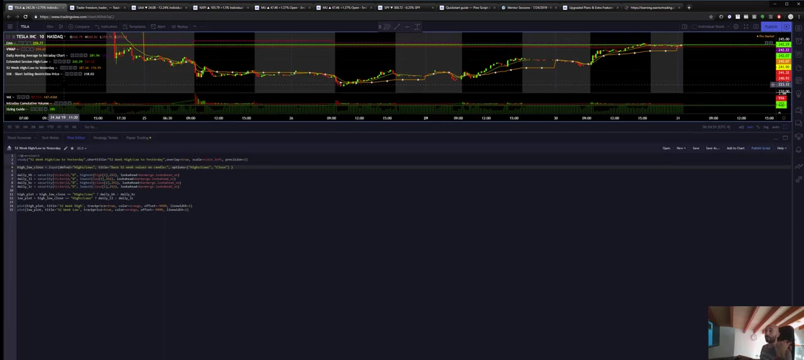

**图怎么看：**

- 画面中，显示了如何使用Trading View的PineScript编写自定义指标。
- 通过代码示例，可以理解如何计算前一天的高点和低点。
- 画面中的代码展示了如何在PineScript中实现这一功能。
- 通过观察图表，可以直观地看到指标的效果及其对市场分析的影响。

### 关键内容

- PineScript 是 Trading View 的编程语言，用于编写自定义指标和策略。
- 使用 `security` 函数可以获取特定股票的高点和低点数据。
- 通过 `plot` 函数可以在图表上绘制这些数据。
- 需要定义上下文（如日线、15分钟线）以确保指标正确显示。
- 可以通过保存和分享代码将自定义指标发布到 Trading View 的公共库。
- PineScript 的版本 4 已发布，但课程使用的是版本 3 的代码。
- 通过复制和粘贴代码可以快速创建类似的自定义指标。
- 指标可以用于回测，验证策略的有效性。
- 使用 Trading View 的高级功能可以提高图表的显示效果

### 分析与执行顺序

1. 首先，了解 Trading View 的指标库和搜索功能。
2. 然后，使用 PineScript 编写代码来计算前一天的高点和低点。
3. 接着，使用 `plot` 函数在图表上绘制这些数据。
4. 最后，保存并分享代码到 Trading View 的公共库。
5. 通过调整上下文和参数，确保指标正确显示。
6. 使用高级功能如子分钟图表，提高图表的显示效果

### 案例与细节

- 使用 `security` 函数获取 IBM 股票的 15分钟收盘价。
- 通过 `plot` 函数在图表上绘制前一天的高点和低点。
- 定义上下文为每日，使用 `high` 和 `low` 函数获取前一天的数据。
- 通过调整颜色和宽度，使指标更易于识别。
- 使用高级功能如子分钟图表，查看更详细的市场数据

### 风险与边界

- 使用 PineScript 时可能会遇到语法错误，需要仔细检查代码。
- 指标的有效性依赖于数据的准确性和市场的变化。
- PineScript 版本更新可能会影响现有代码的兼容性。
- 录制年代限制，某些功能和设置可能已发生变化

### 复盘问题

- 如何使用 Trading View 的搜索功能找到所需的指标？
- 在编写 PineScript 代码时，需要注意哪些关键点？
- 如何确保自定义指标在不同时间框架下的正确显示？
- 如何利用高级功能如子分钟图表提高图表的显示效果？

---

## v0746：股票开盘优先级选择

> 日期：2019　·　时长：00:33:35

**本场重点：** 选择开盘优先级的三个关键问题：最明显的机会、潜力大小和股票知名度。

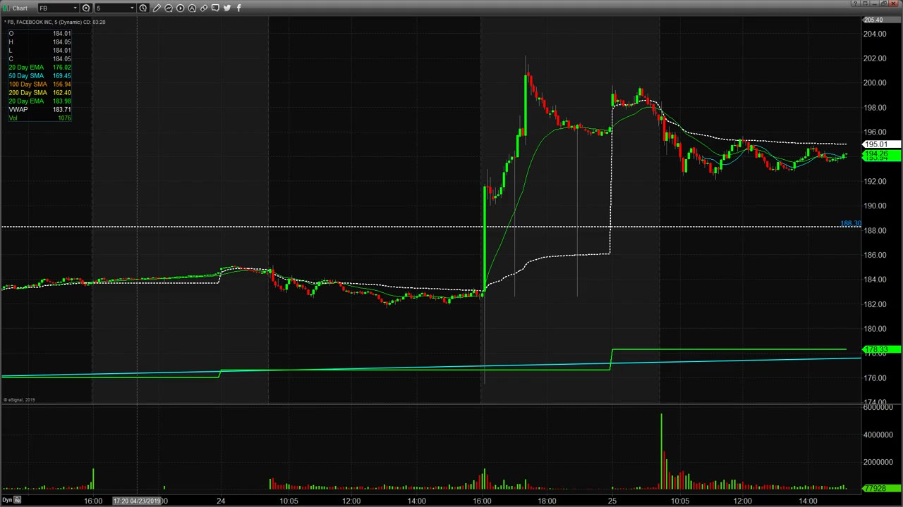

**图怎么看：**

- 图中显示了Facebook（FB）股票的日线图，包括开盘价、最高价、最低价和收盘价。
- 可以看到20日EMA、50日EMA、100日EMA和200日EMA等技术指标。
- 成交量柱的高度反映对应周期内的总成交量；红绿着色通常跟随价格柱的涨跌规则，不能直接拆成两种方向的主动成交。
- 图中显示了股票在开盘后的波动情况，以及不同均线的支撑和阻力作用。

### 关键内容

- 开盘时成交量最高，股票需要快速形成趋势。
- 选择最有潜力的股票，通常需要考虑成交量和价格走势。
- 优先级选择有助于集中精力，避免过度分散。
- 使用20日移动平均线作为止损点，有助于控制风险。
- 优先级选择基于股票的知名度，知名股票更受关注。
- 通过分析价格走势和成交量，可以判断股票的潜在动量。
- 选择最有潜力的股票时，需考虑其催化剂是否有效，如Facebook的业绩公告通常导致股价波动。
- 评估股票动量时，应关注成交量和价格走势，例如XLNX在开盘时虽有下跌趋势，但成交量较小，表明动量不足。
- 优先级选择有助于集中精力，避免过度分散，特别是在面对多个潜在交易机会时。
- 使用20日移动平均线作为止损点，有助于控制风险，尤其是在动量不足的情况下，如3M的表现。
- 知名股票如Facebook因其高曝光度而更受关注，这增加了交易成功的可能性。
- 通过分析价格走势和成交量，可以判断股票的潜在动量，例如Facebook在开盘时未能突破20日移动平均线，表明动量不足。

### 分析与执行顺序

1. 首先，确定最明显的机会，通常是由于催化剂引起的明显价格变动。
2. 其次，评估每个股票的潜在动量，包括成交量和价格走势。
3. 第三，考虑股票的知名度，选择更受关注的股票。
4. 最后，在开盘时，根据上述标准选择最有潜力的股票进行交易。
5. 在交易过程中，使用20日移动平均线作为止损点，以控制风险。

### 案例与细节

- Facebook在开盘时表现出明显的上涨趋势，但未能突破20日移动平均线，表明动量不足。
- XLNX在开盘时表现出明显的下跌趋势，但成交量较小，表明动量不足。
- 3M在开盘时表现出有序的回调，但未能突破支撑位，表明动量不足。
- Facebook在开盘时表现出明显的上涨趋势，但未能突破20日移动平均线，表明动量不足，因此选择其他更有潜力的股票。
- XLNX在开盘时表现出明显的下跌趋势，但成交量较小，表明动量不足，因此选择其他更有潜力的股票。
- 3M在开盘时表现出有序的回调，但未能突破支撑位，表明动量不足，因此选择其他更有潜力的股票。
- 当Facebook的业绩公告发布时，通常会引发股价大幅波动，这是选择该股票作为优先级的重要依据。

### 风险与边界

- 开盘时成交量可能不足以推动股票形成持续趋势。
- 使用20日移动平均线作为止损点可能在某些情况下无效。
- 选择优先级的策略可能在市场变化时失效。
- 录制年代限制为2019年，策略可能需要调整以适应当前市场环境。
- 开盘时成交量可能不足以推动股票形成持续趋势，尤其是在动量不足的情况下，如3M的表现。
- 使用20日移动平均线作为止损点可能在某些情况下无效，尤其是在动量不足且市场波动较大的情况下。

### 复盘问题

- 如何确定最明显的机会？
- 如何评估每个股票的潜在动量？
- 如何使用20日移动平均线作为止损点？
- 如何选择最有潜力的股票进行交易？

---

## v0747：体积分析入门

> 日期：2019　·　时长：00:44:20

**本场重点：** 理解体积分析的重要性，学会识别价格突破和趋势反转，避免虚假突破。

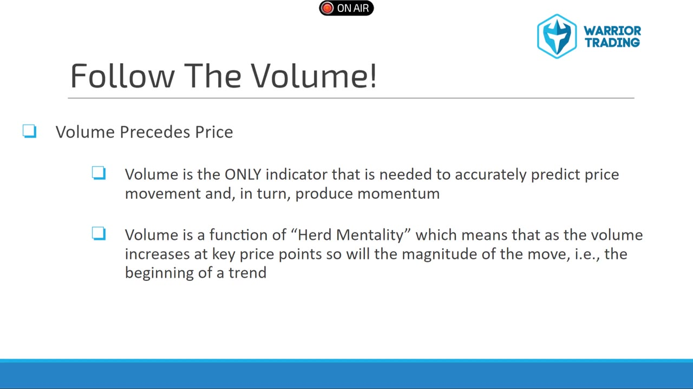

**图怎么看：**

- 在图表中，可以看到价格在关键支撑位附近出现反弹，成交量显著增加。
- 成交量的变化反映了市场情绪的变化，表明投资者可能对价格的反弹感到乐观。
- 通过观察成交量的变化，可以更好地判断价格突破的有效性。
- 在趋势反转时，成交量通常会放大，这有助于识别真正的趋势变化。

### 关键内容

- 体积是价格变动的关键驱动因素，没有买家和卖家，股票不会移动。
- 体积分析可以帮助识别价格突破和趋势反转，从而提高交易成功率。
- 在价格突破时，体积应该增加；在趋势反转时，体积应该减少。
- 体积分析适用于所有时间框架，包括一分钟和五分钟图表。
- 识别虚假突破的关键是体积是否在突破时增加。
- 在趋势反转时，体积应该在最高点后不再增加。
- 使用体积分析可以提高交易决策的准确性，减少错误交易的机会。
- 体积分析需要时间和实践来熟练掌握，但一旦掌握，将大大提高交易表现。
- 在快速时间框架（如一分钟）上更容易识别体积变化。
- 体积分析适用于多种交易策略，包括趋势跟随和反转交易

### 分析与执行顺序

1. 首先，了解体积是价格变动的关键驱动因素，没有买家和卖家，股票不会移动。
2. 其次，学习如何识别价格突破时体积的变化，例如在突破时体积应该增加。
3. 然后，学习如何识别趋势反转时体积的变化，例如在最高点后体积不再增加。
4. 接着，练习在不同时间框架（如一分钟和五分钟）上识别体积变化。
5. 最后，通过实际交易应用体积分析，以提高交易决策的准确性。
6. 在整个过程中，注意识别虚假突破的关键是体积是否在突破时增加。
7. 通过反复练习和实际交易应用，逐步掌握体积分析技巧

### 案例与细节

- ticker：TGT；price_break：在Target股票的突破时，体积显著增加，表明这是一个真实的突破。；volume_profile：在突破后的回调期间，体积减少，表明卖压减弱。；entry_point：当体积再次增加时，进入交易，确认突破的有效性。；outcome：最终确认突破有效，继续跟随趋势。
- ticker：TWTR；price_break：在Twitter股票的突破时，体积显著增加，表明这是一个真实的突破。；volume_profile：在突破后的回调期间，体积减少，表明卖压减弱。；entry_point：当体积再次增加时，进入交易，确认突破的有效性。；outcome：最终确认突破有效，继续跟随趋势。
- ticker：LB；price_break：在LB股票的突破时，初始体积非常高，随后逐渐减少。；volume_profile：在突破后的回调期间，体积减少，表明卖压减弱。；entry_point：当体积再次增加时，进入交易，确认突破的有效性。；outcome：最终确认突破有效，继续跟随趋势。

### 风险与边界

- 在快速时间框架（如一分钟）上识别体积变化可能更困难，需要更多练习。
- 虚假突破可能会导致错误交易，因此需要谨慎识别。
- 虽然体积分析非常有用，但它并不能保证每次交易都成功。
- 录制年代限制为2019年，市场环境和规则可能已发生变化。
- 在使用体积分析时，还需要结合其他技术指标和市场分析。

### 复盘问题

- 在突破时，体积应该怎样变化？
- 在趋势反转时，体积应该怎样变化？
- 如何在快速时间框架上识别体积变化？
- 在实际交易中，如何应用体积分析来提高交易决策的准确性？
- 除了体积分析，还需要考虑哪些其他因素来做出更好的交易决策？

---

## v0748：Zanger体积比率的应用

> 日期：2019　·　时长：00:18:36

**本场重点：** Zanger体积比率是一种辅助决策工具，通过监测股票的相对成交量来判断市场动向。

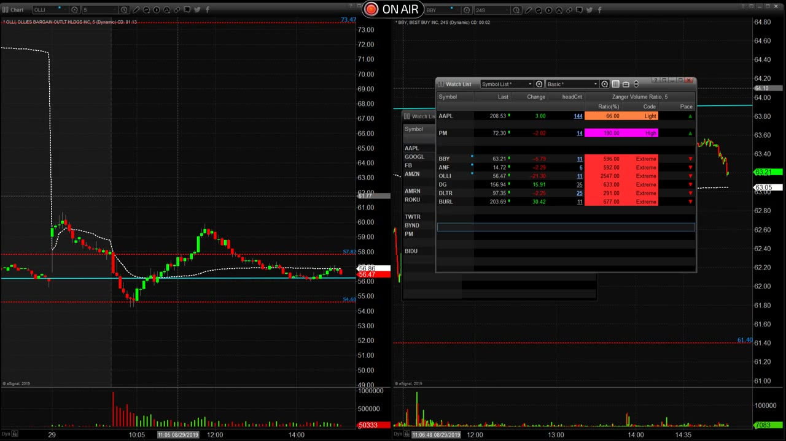

**图怎么看：**

- 在图中可以看到OLLI的股价在上升趋势中，成交量也在增加。
- Zanger Volume Ratio显示了每个股票的相对成交量情况。
- 通过观察Zanger Volume Ratio，可以判断哪些股票的成交量较高，可能预示着市场情绪的变化。
- 在图中，AMZN的Zanger Volume Ratio为94.00%，表明其成交量较高，可能是市场关注的焦点。

### 关键内容

- Zanger体积比率用于监测股票的相对成交量，帮助识别高成交量的股票。
- 设置Zanger体积比率需要添加一个新的观察列表，并选择合适的间隔和回溯天数。
- 相对成交量低于100%表示股票交易量低于正常水平，高于100%则表示交易量高于正常水平。
- 通过Zanger体积比率可以识别出具有高成交量的股票，这些股票可能有更大的价格波动。
- Zanger体积比率适用于多种交易策略，如日内交易、趋势跟踪等。
- 使用Zanger体积比率可以帮助投资者更好地理解市场的兴趣程度和潜在的交易机会。
- Zanger体积比率仅在E-Signal平台上可用，其他交易平台可能没有类似的工具。
- 通过Zanger体积比率可以快速了解市场整体的成交量情况，有助于做出快速决策。
- Zanger体积比率可以帮助投资者识别出那些成交量突然增加的股票，这些股票可能有更大的价格波动潜力。

### 分析与执行顺序

1. 打开E-Signal平台，进入观察列表设置。
2. 添加新的观察列表，并选择编辑列。
3. 添加Zanger体积比率观察列表。
4. 设置观察列表的时间模板为Zanger。
5. 将股票添加到观察列表中，开始监控其相对成交量。
6. 定期检查观察列表，以识别出高成交量的股票。
7. 利用Zanger体积比率进行交易决策，特别是在市场出现大幅波动时。

### 案例与细节

- PM股票今天交易在1.9倍的正常相对成交量，表明市场对该股票有兴趣。
- BBY股票今天交易在5.9倍的正常相对成交量，显示出市场对该股票的兴趣较大。
- OLLI股票今天交易在2500倍的正常相对成交量，显示出市场对该股票的兴趣极大。
- D-L-T-R-T-R-R-L股票今天交易在6倍的正常相对成交量，显示出市场对该股票的兴趣较大。
- LB股票上周突破趋势线，显示市场对该股票的兴趣较大。

### 风险与边界

- Zanger体积比率仅在E-Signal平台上可用，其他交易平台可能没有类似的工具。
- 使用Zanger体积比率时，需要确保正确设置观察列表的时间模板和回溯天数。
- Zanger体积比率依赖于历史数据，因此对于新上市的股票可能不够准确。
- 市场环境的变化可能会影响Zanger体积比率的准确性，因此需要持续关注市场动态。

### 复盘问题

- 如何设置Zanger体积比率的观察列表？
- 如何利用Zanger体积比率识别出高成交量的股票？
- Zanger体积比率在哪些交易策略中特别有用？

---

## v0749：五点新手交易指南

> 日期：2019　·　时长：00:42:35

**本场重点：** 新手应关注股票筛选、耐心等待、顺势而为、预市形态及快帧交易，以提高交易效率。

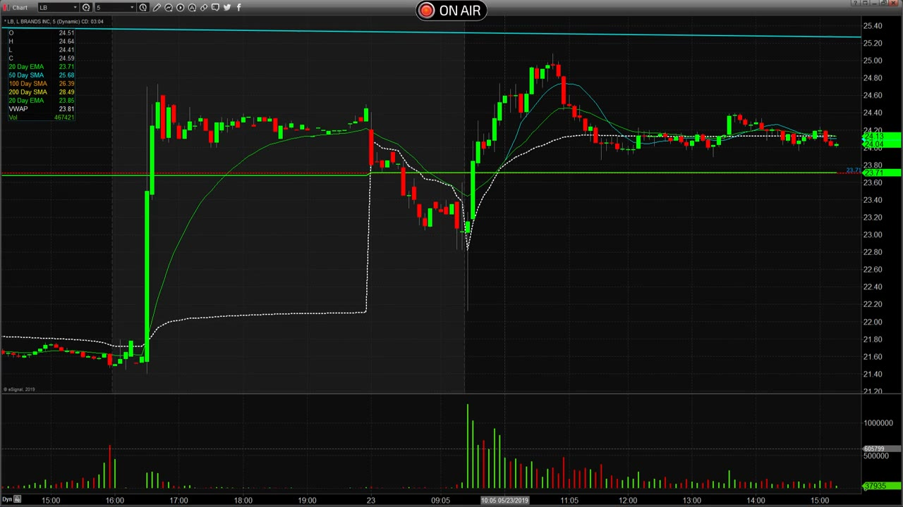

**图怎么看：**

- 这张图表显示了股票LB, L BRANDS INC.的价格走势，包括短期和长期移动平均线（20日EMA、50日SMA、100日SMA）、成交量（VWAP）等技术指标。
- 从图表中可以看出，股票在一段时间内经历了上升趋势，随后出现了一次明显的下跌。
- 成交量柱的高度反映对应周期内的总成交量；红绿着色通常跟随价格柱的涨跌规则，不能直接拆成两种方向的主动成交。
- 通过观察这些技术指标，投资者可以更好地理解市场情绪和价格趋势，从而做出更明智的投资决策。

### 关键内容

- 讲师指出，新手应优先筛选具有催化剂的股票，如财报、公司公告等。
- 强调交易时应减少频率，耐心等待最佳时机。
- 建议跟随市场趋势进行交易，避免逆势操作。
- 讲解预市形态的重要性，如缺口下跌、基底形态等。
- 介绍使用快帧交易来提高交易清晰度，如识别价格动作的关键点。
- 提醒新手注意市场波动性，避免过度追涨杀跌。
- 强调交易时应保持耐心，避免频繁交易带来的风险。
- 建议新手利用预市形态和快帧交易来提高交易成功率。
- 讲师提到，快帧交易能帮助识别价格动作的关键点，如低点、高点等。
- 强调交易时应关注市场变化，避免盲目跟风

### 分析与执行顺序

1. 讲师首先介绍了股票筛选的方法，包括寻找具有催化剂的股票。
2. 接着讲解了如何在交易中减少频率，耐心等待最佳时机。
3. 进一步说明了跟随市场趋势进行交易的重要性。
4. 通过实例展示了预市形态的应用，如缺口下跌和基底形态。
5. 最后介绍了使用快帧交易来提高交易清晰度的方法。
6. 讲师还提醒新手注意市场波动性，避免过度追涨杀跌。
7. 强调交易时应保持耐心，避免频繁交易带来的风险

### 案例与细节

- LB公司在开盘前出现缺口下跌，随后在开盘时继续下跌，形成预市形态。
- LOW公司出现基底形态，开盘后股价上涨，验证了预市形态的有效性。
- LOW公司开盘前出现高点，开盘后股价下跌，形成预市形态。
- LB公司在开盘前出现低点，开盘后股价反弹，形成预市形态。

### 风险与边界

- 市场环境变化可能导致预市形态失效，新手需灵活应对。
- 快帧交易依赖于快速反应，新手可能因经验不足而误判。
- 交易策略需根据市场情况进行调整，避免一成不变。
- 市场波动性增加时，预市形态的准确性会降低，新手需谨慎操作

### 复盘问题

- 如何识别具有催化剂的股票？
- 在交易中如何减少频率，耐心等待最佳时机？
- 如何利用预市形态进行交易？
- 快帧交易有哪些优势和风险？
- 如何根据市场变化调整交易策略？

---

## v0750：市场周期对日交易的影响

> 日期：2019　·　时长：00:33:39

**本场重点：** 了解不同季节对市场行为的影响，尤其是夏季的低成交量和年末的高成交量，以及如何调整交易策略。

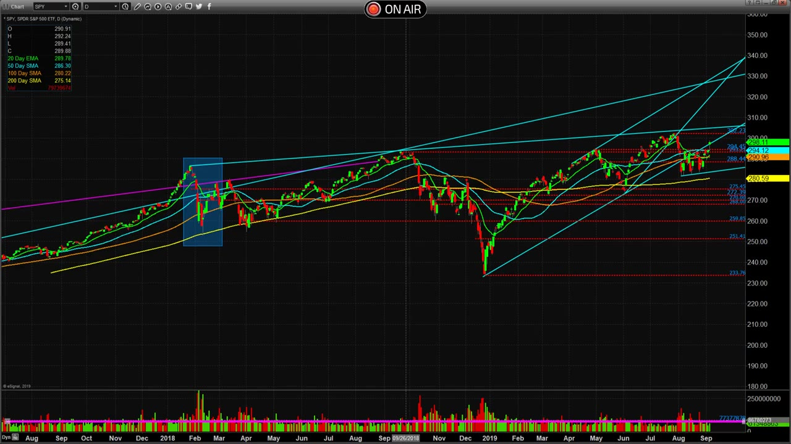

**图怎么看：**

- 图中显示了SPY指数的日线图，包括短期、中期和长期移动平均线。
- 在2019年1月到5月期间，市场表现活跃，成交量较高。
- 从5月开始，市场进入了一个相对平静的时期，成交量显著下降。
- 到了年底，市场再次活跃，成交量增加，显示出年末的高成交量特点。

### 关键内容

- 夏季市场成交量较低，主要因为大部分市场参与者休假。
- 第四季度和第一季度是交易量最高的时期，适合寻找持续性交易机会。
- 夏季市场波动较小，需要更早获利并更紧止损。
- 节假日前后成交量通常较低，影响市场整体表现。
- 使用相对成交量来判断市场活跃度，如预市和开盘前五分钟的成交量。
- 选择大市值股票进行交易，因其技术分析更为成熟。
- 设置风险参数，确保每日盈利目标至少为亏损的两倍。
- 根据市场周期调整交易策略，夏季减少预期交易，增加观望。
- 利用技术指标预测市场走势，提高交易成功率。
- 保持耐心，避免在市场不活跃时过度交易

### 分析与执行顺序

1. 讲师首先介绍四季市场特点，重点是夏季的低成交量。
2. 然后详细解释夏季市场成交量低的原因，包括市场参与者休假。
3. 接着讲解第四季度和第一季度的高成交量，适合寻找持续性交易机会。
4. 进一步说明夏季市场波动较小，需要更早获利并更紧止损。
5. 最后强调节假日前后成交量较低，影响市场整体表现。
6. 通过实例展示如何使用相对成交量来判断市场活跃度。
7. 分享个人经验，选择大市值股票进行交易，因其技术分析更为成熟。
8. 设置风险参数，确保每日盈利目标至少为亏损的两倍。
9. 根据市场周期调整交易策略，夏季减少预期交易，增加观望

### 案例与细节

- 夏季市场成交量较低，主要因为大部分市场参与者休假，导致成交量大幅下降。
- 第四季度和第一季度的成交量较高，如2018年12月到2019年1月，成交量显著上升。
- 使用相对成交量来判断市场活跃度，如预市和开盘前五分钟的成交量。
- 选择大市值股票进行交易，如特斯拉（Tesla），因其技术分析更为成熟。
- 设置风险参数，确保每日盈利目标至少为亏损的两倍，如亏损100，则期望盈利200

### 风险与边界

- 录制年代限制，信息适用于2018年至2021年的市场情况。
- 节假日前后成交量较低，可能影响交易决策。
- 夏季市场波动较小，需要更早获利并更紧止损，否则容易亏损。
- 市场周期变化可能导致交易策略失效，需灵活调整

### 复盘问题

- 夏季市场成交量低的具体原因是什么？
- 如何利用技术指标预测市场走势？
- 如何根据市场周期调整交易策略？
- 如何设置风险参数以确保每日盈利目标至少为亏损的两倍？
- 哪些因素可能导致交易策略失效？

---

## v0751：五月交易总结

> 日期：2019　·　时长：00:38:32

**本场重点：** 总结了五月的交易情况，强调了风险管理的重要性，并指出市场波动性在夏季会有所增加。

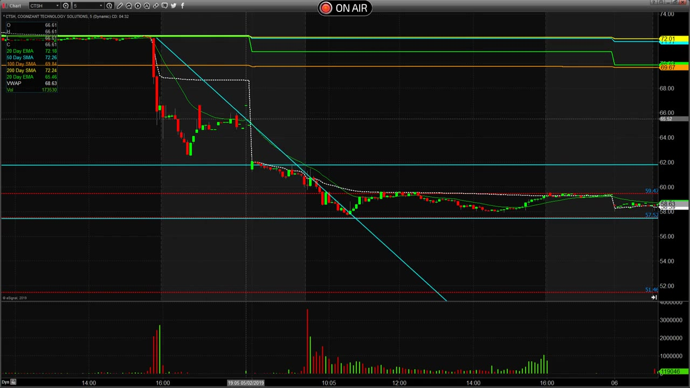

**图怎么看：**

- 这张图表显示了CTSH股票的价格走势，包括短期和长期移动平均线（SMA），以及成交量柱状图。
- 从图表中可以看出，CTSH股票的价格在一段时间内经历了明显的下跌，随后出现反弹。
- 成交量柱的高度反映对应周期内的总成交量；红绿着色通常跟随价格柱的涨跌规则，不能直接拆成两种方向的主动成交。
- 通过观察这些图表，可以分析市场情绪和投资者行为，从而做出更明智的投资决策。

### 关键内容

- 五月交易量较轻，主要原因是假期和个人安排。
- 交易策略包括利用缺口回撤、双顶和双底等技术形态。
- 风险管理是关键，包括设置止损和控制仓位大小。
- 市场波动性在夏季会增加，需要更加谨慎地管理风险。
- 交易者应关注高成交量股票，以提高盈利机会。
- 交易者需学会识别并利用价格走势，以做出更好的交易决策。
- 交易者应保持耐心，等待合适的入场时机，避免盲目追涨杀跌。
- 交易者需定期回顾交易记录，总结经验教训，改进交易策略。
- 交易者应关注市场新闻和公司公告，以捕捉潜在的交易机会。

### 分析与执行顺序

1. 讲师首先回顾了五月的整体交易情况，指出交易量较轻。
2. 然后详细分析了苹果公司的交易案例，包括交易策略和结果。
3. 接着讨论了SQ和CTSH的交易案例，强调了技术分析的重要性。
4. 进一步讲解了如何利用缺口回撤、双顶和双底等技术形态进行交易。
5. 最后总结了交易心得，强调了风险管理的重要性，提醒交易者注意夏季市场的波动性。

### 案例与细节

- 苹果公司交易：利用缺口回撤策略，但最终亏损2000美元。
- SQ交易：利用缺口下破和趋势线突破进行短空，盈利超过3000美元。
- CTSH交易：利用缺口下破和支撑位进行短空，盈利约8000美元。
- MIL交易：尝试利用缺口回撤进行短空，但由于市场波动较大而亏损。
- Walmart交易：利用缺口回撤策略进行短空，但最终亏损1200美元。

### 风险与边界

- 交易者需注意市场波动性在夏季会增加，可能导致更大的波动和风险。
- 交易者应严格遵守止损规则，避免因市场波动而遭受更大损失。
- 交易者需定期回顾交易记录，总结经验教训，以改进交易策略。
- 交易者应关注市场新闻和公司公告，以捕捉潜在的交易机会，但需谨慎操作。

### 复盘问题

- 你从苹果公司的交易案例中学到了什么？
- 在SQ和CTSH的交易中，哪些技术形态对你产生了积极影响？
- 你如何理解交易者在夏季市场中需要更加谨慎地管理风险？
- 你计划如何改进自己的交易策略，以应对夏季市场的波动性？

---

## v0752：预市场模式分析

> 日期：2019　·　时长：00:32:38

**本场重点：** 通过预市场模式分析提高开盘交易的预测性，但需谨慎处理无明显模式的股票。

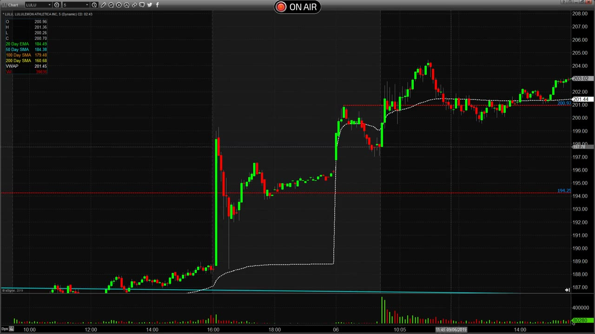

**图怎么看：**

- 这张图表显示了LULU股票的价格走势，包括20日EMA、50日SMA、100日SMA和200日SMA等技术指标。
- 从图表中可以看出，LULU股票在开盘后经历了快速上涨，随后出现了一次明显的回调。
- 成交量柱的高度反映对应周期内的总成交量；红绿着色通常跟随价格柱的涨跌规则，不能直接拆成两种方向的主动成交。
- 根据图表中的技术指标和成交量变化，可以推测出当前市场情绪和潜在的交易机会。

### 关键内容

- 预市场模式分析可以帮助提高开盘交易的预测性，但需要谨慎处理无明显模式的股票。
- 预市场基底模式和预市场漂移模式是两种常见的模式，前者需要等待基底被突破，后者需要寻找持续的低点。
- 如果股票在预市场表现出明显的不确定性或犹豫，应避免进行交易。
- 预市场漂移模式需要股票持续向下移动，而预市场基底模式则需要突破基底。
- 预市场模式分析的关键在于识别模式并等待模式确认后再进行交易。
- 预市场模式分析适用于小规模交易，每天一到三个交易机会。
- 预市场模式分析需要关注价格走势而非成交量。
- 预市场模式分析需要耐心等待模式确认，避免过早行动。
- 预市场模式分析需要结合其他技术指标进行综合判断，以提高准确性。
- 预市场模式分析需要关注股票的波动性和趋势，避免过度追涨杀跌。

### 分析与执行顺序

1. 首先，识别预市场基底模式和预市场漂移模式，这两种模式是常见的预市场模式。
2. 然后，观察股票是否在预市场表现出明确的模式，如基底或漂移。
3. 接着，等待模式确认，例如基底被突破或漂移模式中的低点持续出现。
4. 最后，根据确认的模式进行交易，确保交易具有高概率和低风险。
5. 在整个过程中，需要结合其他技术指标进行综合判断，以提高交易的准确性。
6. 同时，需要关注股票的波动性和趋势，避免过度追涨杀跌。
7. 最后，需要耐心等待模式确认，避免过早行动。

### 案例与细节

- ticker：AAPL；price_action：预市场基底模式；description：苹果公司预市场表现出了基底模式，价格在预市场形成了一个稳定的基底，随后开盘时突破了这个基底，形成了新的高点。
- ticker：DXC；price_action：预市场漂移模式；description：戴克公司（DXC）在预市场表现出了漂移模式，价格逐渐上升，形成了更高的低点和更高的高点，开盘时突破了最近的高点。
- ticker：ZS；price_action：预市场基底模式；description：ZS公司在预市场表现出了基底模式，价格在预市场形成了一个稳定的基底，随后开盘时未能突破这个基底，继续维持原趋势。
- ticker：ALTA；price_action：预市场漂移模式；description：阿尔塔公司（ALTA）在预市场表现出了漂移模式，价格逐渐下降，形成了更低的低点和更低的高点，开盘时未能突破最近的低点，继续维持原趋势。
- ticker：CRWD；price_action：无明显预市场模式；description：CRWD公司在预市场没有表现出明显的模式，价格波动较大，没有形成稳定的基底或漂移模式，开盘时价格波动较大，难以确定趋势。

### 风险与边界

- 预市场模式分析依赖于模式确认，如果模式未能确认，可能会导致错误的交易决策。
- 预市场模式分析需要耐心等待模式确认，过早行动可能导致亏损。
- 预市场模式分析适用于小规模交易，不适合大规模交易，因为风险较高。
- 预市场模式分析需要结合其他技术指标进行综合判断，否则可能无法准确预测市场走势。
- 预市场模式分析依赖于历史数据，当前市场环境的变化可能会影响模式的有效性。

### 复盘问题

- 如何识别预市场基底模式和预市场漂移模式？
- 在预市场模式分析中，如何判断模式是否已经确认？
- 在预市场模式分析中，如何结合其他技术指标进行综合判断？
- 在预市场模式分析中，如何避免过早行动导致的亏损？

---

## v0753：交易开盘

> 日期：2019　·　时长：00:41:53

**本场重点：** 交易开盘是获取最大利润的最佳时机，但需要精确的入场点和快速反应。

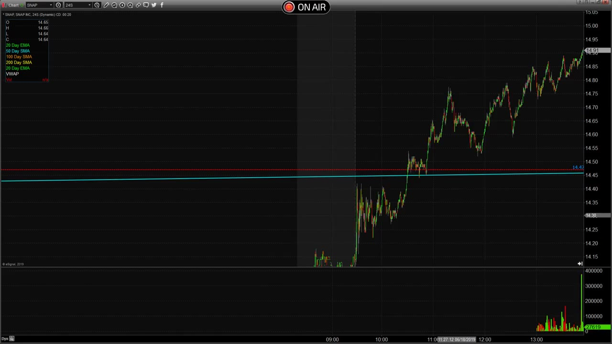

**图怎么看：**

- 画面中，可以看到开盘后价格迅速上涨，并且成交量显著增加。
- 这表明市场可能正在经历一个强劲的买盘潮。
- 投资者可以考虑在开盘价附近进行买入操作以捕捉这一波上涨。
- 同时，注意观察后续价格走势和成交量的变化，以便做出更明智的决策。

### 关键内容

- 开盘时成交量最高，有助于捕捉大波动。
- 使用快时间框架（24秒）来识别精确的入场点。
- 开盘后成交量迅速下降，交易难度增加。
- 关注价格行动，确认技术设置后再入场。
- 开盘时的价格波动比一天中的其他时段更大。
- 使用快时间框架可以减少噪音和不确定性。
- 开盘后成交量下降，交易风险增加。
- 开盘时的价格波动提供了最大的盈利机会。
- 使用快时间框架可以提高交易的准确性。
- 开盘后成交量下降，交易难度增加。

### 分析与执行顺序

1. 记录开盘时的成交量曲线，了解成交量的变化。
2. 使用快时间框架（24秒）来识别精确的入场点。
3. 监控股票价格行动，确认技术设置后再入场。
4. 在开盘后的前几分钟内进行交易，利用成交量的高峰。
5. 使用快时间框架来减少噪音和不确定性，提高交易的准确性。
6. 在开盘后成交量下降时，减少交易规模以降低风险。
7. 在开盘后成交量下降时，监控价格行动，确认技术设置后再入场。

### 案例与细节

- Snap在开盘时被拒绝，价格反弹，但随后再次被买入。
- Play在开盘时形成支撑，价格在支撑上方反弹。
- CCL在开盘时成交量达到峰值，随后逐渐下降。
- Snap在开盘时形成支撑，价格在支撑上方反弹，但随后被卖回。
- Play在开盘时形成支撑，价格在支撑上方反弹，但随后被卖回。

### 风险与边界

- 开盘后成交量下降，交易难度增加。
- 使用快时间框架可能会导致过度交易。
- 开盘后成交量下降，交易风险增加。
- 开盘后成交量下降，可能导致错过最佳交易机会。

### 复盘问题

- 在开盘时，如何识别最佳的入场点？
- 使用快时间框架（24秒）有哪些优势和劣势？
- 在开盘后成交量下降时，如何调整交易策略？

---

## v0754：2019年9月市场回顾

> 日期：2019　·　时长：00:44:30

**本场重点：** 本月市场以波动为主，难以捕捉持续性机会；耐心等待高概率交易机会。

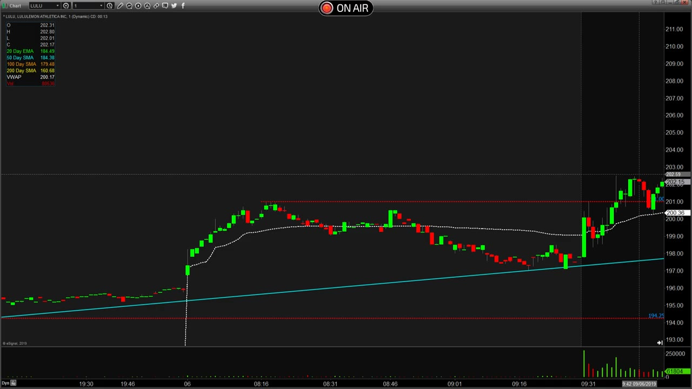

**图怎么看：**

- 这张图表显示了LULU股票的价格走势，包括20日EMA、50日SMA、100日SMA和200日SMA等技术指标。
- 从图表中可以看出，LULU股票在最近一段时间内经历了明显的上涨和下跌，显示出市场的波动性。
- 通过观察这些技术指标，投资者可以更好地理解当前市场的趋势，并做出相应的投资决策。
- 建议投资者在进行交易时，结合其他分析工具和技术指标，以提高交易的成功率。

### 关键内容

- 9月市场波动较大，多数股票表现不佳。
- 预市分析显示，一些股票存在不利的预市模式。
- 市场在开盘后通常会出现横向波动，难以抓住持续性机会。
- 少数股票如FDX表现出良好的交易机会。
- 市场整体呈现低成交量和窄幅波动的特点。
- 预市高点往往无法在开盘后维持。
- 市场在开盘后的波动性较大，但难以预测。
- 市场周期性地出现波动，需耐心等待高概率交易机会。
- MDCO在预市高开后出现下跌，但未能维持，说明预市高点难以在开盘后保持，需谨慎操作。
- AEO在预市高点未能在开盘后维持，市场波动较大，表明预市模式对交易决策有重要影响。
- S-B-U-X（星巴克）的预市模式显示市场可能下跌，但实际表现不佳，说明预市模式并非绝对可靠。
- COUP在预市高点未能在开盘后维持，市场波动较大，说明预市模式需要结合实际情况灵活判断。
- Lulu在预市高点未能在开盘后维持，市场波动较大，说明预市模式需谨慎解读，避免盲目跟风

### 分析与执行顺序

1. 回顾9月的交易情况，分析市场表现。
2. 识别出MDCO、AEO等股票的交易机会。
3. 解释预市模式对交易决策的影响。
4. 分析市场在开盘后的波动情况。
5. 总结市场周期性的波动特征，强调耐心等待高概率交易机会的重要性。

### 案例与细节

- MDCO：预市高开后出现下跌，但未能维持。
- AEO：预市高点未能在开盘后维持，市场波动较大。
- S-B-U-X（星巴克）：预市模式显示市场可能下跌，但实际表现不佳。
- COUP：预市高点未能在开盘后维持，市场波动较大。
- Lulu：预市高点未能在开盘后维持，市场波动较大。
- MDCO：预市高开后出现下跌，但未能维持，说明预市高点难以在开盘后保持，需谨慎操作。在E-Signal平台上，可以看到MDCO的预市高点未能在开盘后维持。
- AEO：预市高点未能在开盘后维持，市场波动较大。在Trading View平台上，可以看到AEO的预市高点未能在开盘后维持，市场波动较大，说明预市模式对交易决策有重要影响。
- S-B-U-X（星巴克）：预市模式显示市场可能下跌，但实际表现不佳。在E-Signal平台上，可以看到星巴克的预市模式显示市场可能下跌，但实际表现不佳，说明预市模式并非绝对可靠。
- COUP：预市高点未能在开盘后维持，市场波动较大。在E-Signal平台上，可以看到COUP的预市高点未能在开盘后维持，市场波动较大，说明预市模式需要结合实际情况灵活判断。
- Lulu：预市高点未能在开盘后维持，市场波动较大。在E-Signal平台上，可以看到Lulu的预市高点未能在开盘后维持，市场波动较大，说明预市模式需谨慎解读，避免盲目跟风

### 风险与边界

- 市场在预市和开盘后的波动性较大，难以预测。
- 市场周期性地出现波动，需耐心等待高概率交易机会。
- 市场在开盘后的波动性较大，但难以抓住持续性机会。
- 市场在开盘后的波动性较大，需谨慎操作。
- 市场在预市和开盘后的波动性较大，难以预测，说明预市模式并非绝对可靠，需谨慎操作。
- 市场周期性地出现波动，需耐心等待高概率交易机会，说明市场波动性较大，难以抓住持续性机会。
- 市场在开盘后的波动性较大，但难以抓住持续性机会，说明市场波动性较大，需谨慎操作。
- 市场在开盘后的波动性较大，需谨慎操作，说明市场波动性较大，难以预测，需谨慎操作

### 复盘问题

- 哪些股票在预市和开盘后表现不佳？
- 如何识别预市模式中的不利信号？
- 在开盘后的波动中，如何寻找高概率交易机会？

---

## v0755：如何识别并交易极端反转

> 日期：2019　·　时长：00:41:40

**本场重点：** 识别反转信号，制定交易策略，避免长期持有。

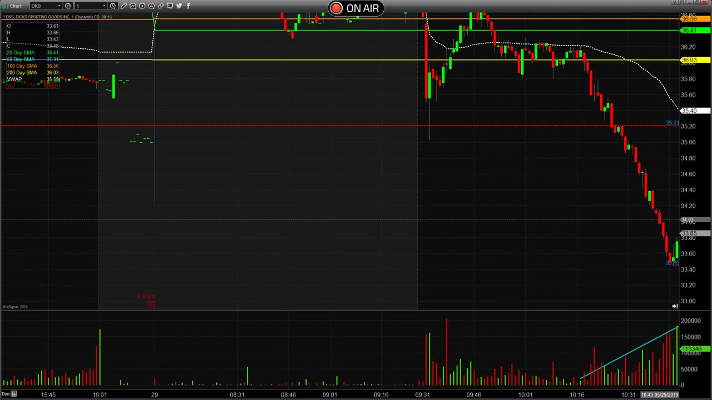

**图怎么看：**

- 画面中，我们可以看到SPLK股票的价格在一段时间内经历了显著的下跌，随后出现了一次反弹。
- 成交量柱的高度反映对应周期内的总成交量；红绿着色通常跟随价格柱的涨跌规则，不能直接拆成两种方向的主动成交。
- 均线（如20日均线和50日均线）显示了价格的趋势方向，当前价格似乎接近这些均线。
- 成交量适合与前序时段或历史基准比较参与程度，但仅凭柱体颜色无法判断哪一方主动，也不能由此推断下一步方向。

### 关键内容

- 反转交易可以增加利润，但不是主要盈利手段。
- 识别反转信号需要关注成交量和价格走势。
- 反转交易通常需要快速反应，不适合长期持有。
- 成交量底是反转的重要标志，表明趋势可能反转。
- 硬性快速移动后出现的成交量底，预示着反转。
- 使用更快的时间框架可以更早识别反转信号。
- 反转交易需要设定合理的止损点，控制风险。
- 反转交易适用于短期利润积累，而非长期投资。
- 市场波动性大时，反转交易更为有效。
- 反转交易依赖于市场心理和订单真空现象

### 分析与执行顺序

1. 讲师首先介绍反转交易的基本概念及其局限性。
2. 通过DKS和SPLK的案例，展示如何识别反转信号。
3. 讲解如何在图表上识别成交量底和价格走势。
4. 强调快速反应的重要性，以及如何设置止损点。
5. 总结反转交易的适用场景和风险控制方法。
6. 提醒学员注意市场波动性和订单真空现象对反转交易的影响

### 案例与细节

- DKS：在5分钟图表上，识别出成交量底和价格反转信号，进行短多操作。
- SPLK：识别出成交量底和价格反转信号，进行长多操作，随后迅速获利。
- OSTK：识别出成交量顶和价格反转信号，进行短多操作，随后获利。
- AAMD：识别出成交量底和价格反转信号，进行长多操作，但因接近VWAP而未执行。
- DKS和SPLK：通过成交量底和价格反转信号，进行快速交易，实现短期利润

### 风险与边界

- 反转交易依赖于市场心理和订单真空现象，这些因素难以预测。
- 市场波动性大时，反转交易更为有效，但风险也相应增加。
- 反转交易不适合长期持有，容易导致资金被套。
- 市场环境变化可能导致反转信号失效，需持续监控。
- 录制于2019年，当前市场环境可能有所不同，需谨慎应用

### 复盘问题

- 如何识别成交量底和价格反转信号？
- 在哪些情况下，反转交易更为有效？
- 如何设置止损点以控制风险？
- 如何在实际交易中应用这些策略？

---

## v0756：选择退出点的方法

> 日期：2019　·　时长：00:35:00

**本场重点：** 选择退出点的方法是为了提高交易的一致性，尤其是在快速变动的市场中。这种方法简单且易于实施，适用于不同价格范围的股票。

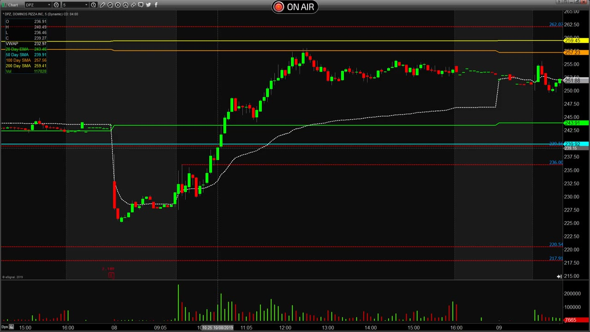

**图怎么看：**

- 画面中，可以看到股票价格在9:26时出现了一次明显的上升趋势。
- 成交量柱的高度反映对应周期内的总成交量；红绿着色通常跟随价格柱的涨跌规则，不能直接拆成两种方向的主动成交。
- 均线（20日、50日、100日）显示出股票价格的趋势走向，帮助判断市场的长期趋势。
- 通过观察这些图表，可以更好地理解市场动态，为后续的交易决策提供依据。

### 关键内容

- 讲师提到使用百分比来确定退出点，适用于不同价格范围的股票。
- 对于低于20美元的股票，使用2%的百分比；高于20美元的股票，使用1%的百分比。
- 使用百分比可以保持一致性，尤其是在快速变动的市场中。
- 在进入交易前，先计算百分比，然后根据价格变动进行退出。
- 使用百分比设定止损点，以避免大幅亏损。
- 在交易过程中，根据价格波动调整退出点，以保持一致性。
- 使用百分比设定退出点可以简化交易策略，提高执行效率。
- 使用百分比设定退出点需要考虑市场波动性和股票价格范围。
- 使用百分比设定退出点可以提高交易的一致性，但需要灵活判断。
- 使用百分比设定退出点需要结合技术分析和其他交易策略。

### 分析与执行顺序

1. 讲师首先介绍了使用百分比设定退出点的方法，适用于不同价格范围的股票。
2. 对于低于20美元的股票，使用2%的百分比；高于20美元的股票，使用1%的百分比。
3. 在进入交易前，先计算百分比，然后根据价格变动进行退出。
4. 使用百分比设定止损点，以避免大幅亏损。
5. 在交易过程中，根据价格波动调整退出点，以保持一致性。
6. 使用百分比设定退出点可以简化交易策略，提高执行效率。

### 案例与细节

- 在交易BBBY时，使用1%的百分比设定退出点，当股价达到1244时，卖出一半的仓位。
- 在交易DPZ时，使用1%的百分比设定退出点，当股价达到238时，卖出一半的仓位。
- 在交易Roku时，使用1%的百分比设定退出点，当股价达到11510时，卖出一半的仓位。
- 在交易BBY时，使用2%的百分比设定退出点，当股价达到1244时，卖出一半的仓位。
- 在交易X时，使用1%的百分比设定退出点，当股价达到1090到990时，卖出一半的仓位。

### 风险与边界

- 使用百分比设定退出点可能在市场大幅波动时失效，导致亏损。
- 使用百分比设定退出点需要结合技术分析和其他交易策略，否则可能导致亏损。
- 使用百分比设定退出点的方法适用于快速变动的市场，但在稳定市场中可能效果不佳。
- 使用百分比设定退出点的方法适用于不同价格范围的股票，但在特定股票上可能效果不佳。

### 复盘问题

- 使用百分比设定退出点的方法适用于哪些类型的股票？
- 在使用百分比设定退出点时，如何确保交易的一致性？
- 在交易过程中，如何根据市场波动调整退出点？

---

## v0757：口袋理论详解

> 日期：2019　·　时长：00:25:26

**本场重点：** 识别具有足够范围的股票以进行交易，确保范围大于平均真实波动幅度，从而提高交易成功率。

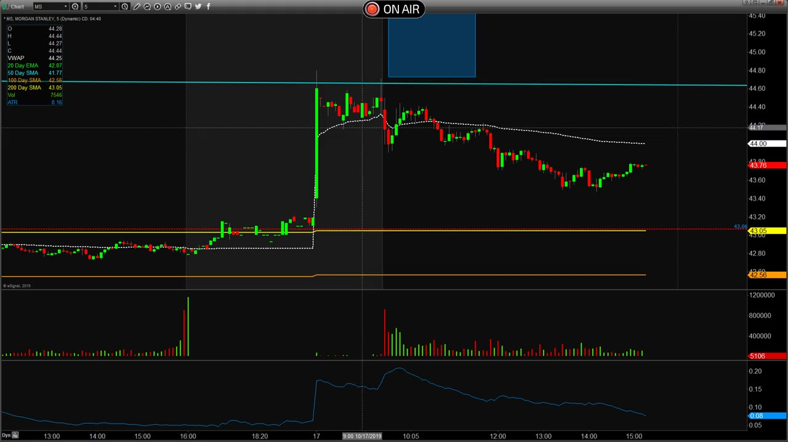

**图怎么看：**

- 画面中，我们可以看到MORGAN STANLEY的5分钟周期图表。
- 图表显示了价格在不同水平上的波动情况。
- 红色和绿色的柱状图代表成交量，颜色较深表示较高成交量。
- 均线（黄色）显示出价格的趋势方向，表明当前市场趋势。

### 关键内容

- 识别股票的平均真实波动幅度（ATR），作为判断是否值得交易的标准。
- 计算支持和阻力之间的范围，确保范围大于ATR，以保证有足够的空间进行交易。
- 通过实际案例展示如何应用口袋理论，如Netflix、Morgan Stanley等。
- 强调识别有效口袋的重要性，以提高交易的可预测性和成功率。
- 使用ATR作为参考标准，确保交易范围足够大，避免小范围波动带来的不确定性。
- 通过不同股票的实例，展示如何识别和利用有效口袋进行交易。
- 强调识别有效口袋是提高交易成功率的关键步骤之一。
- 通过实际交易案例，展示如何利用有效口袋进行交易，如Fast F-A-S-T等。
- 指出识别有效口袋需要结合支持和阻力水平，确保交易范围足够大。
- 强调识别有效口袋是提高交易成功率的关键步骤之一，确保交易范围足够大

### 分析与执行顺序

1. 首先，识别股票的平均真实波动幅度（ATR）。
2. 然后，计算支持和阻力之间的范围，确保范围大于ATR。
3. 接着，通过实际案例展示如何应用口袋理论，如Netflix、Morgan Stanley等。
4. 最后，总结识别有效口袋的重要性，以提高交易的可预测性和成功率。
5. 通过实际交易案例，展示如何利用有效口袋进行交易，如Fast F-A-S-T等。
6. 强调识别有效口袋需要结合支持和阻力水平，确保交易范围足够大。
7. 总结识别有效口袋是提高交易成功率的关键步骤之一，确保交易范围足够大

### 案例与细节

- Netflix在突破支撑位后，形成了一个有效的口袋，随后进行了垂直下跌。
- Morgan Stanley在突破主要下降阻力后，形成了一个有效的口袋，随后进行了上涨。
- Fast F-A-S-T在突破支撑位后，形成了一个有效的口袋，随后进行了上涨。
- UNH在突破支撑位后，形成了一个有效的口袋，随后进行了上涨。
- W-Day在突破支撑位后，形成了一个有效的口袋，随后进行了上涨

### 风险与边界

- 识别有效口袋需要结合支持和阻力水平，如果市场突然出现大幅波动，可能会导致识别错误。
- 识别有效口袋依赖于历史数据，如果市场环境发生变化，可能不再适用。
- 识别有效口袋需要结合技术分析，如果技术分析出现偏差，可能会影响识别结果。
- 识别有效口袋依赖于ATR值，如果ATR值变化较大，可能会影响识别结果。
- 识别有效口袋依赖于市场情绪，如果市场情绪突然变化，可能会影响识别结果

### 复盘问题

- 如何识别股票的平均真实波动幅度（ATR）？
- 如何计算支持和阻力之间的范围，确保范围大于ATR？
- 通过哪些实际案例可以更好地理解口袋理论的应用？
- 识别有效口袋需要结合哪些因素？
- 识别有效口袋有哪些潜在风险？

---

## v0758：精准入场策略

> 日期：2019　·　时长：00:27:23

**本场重点：** 精准入场是交易成功的关键，尤其是在快速变动的市场中。关键在于识别正确的入场点，而不是频繁尝试。

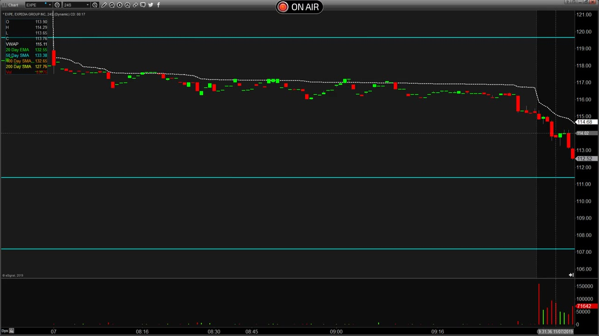

**图怎么看：**

- 画面中，我们可以看到一个股票的K线图，显示了价格波动和成交量。
- 成交量柱的高度反映对应周期内的总成交量；红绿着色通常跟随价格柱的涨跌规则，不能直接拆成两种方向的主动成交。
- 水平线和斜线分别代表了不同的均线，如20日均线、50日均线和100日均线。
- 这些均线可以帮助投资者判断市场的趋势和支撑阻力位。

### 关键内容

- 讲师提到，市场条件不利，因此调整了提前获利的策略。
- 精准入场点是交易成功的核心，因为一旦错过入场点，就无法从交易中获利。
- 使用快时间帧图表（如24秒）来识别价格动作和模式。
- 识别低高点或高低点作为入场信号，这是判断趋势延续的关键。
- 在快速变动的市场中，识别精准入场点需要快速反应。
- 使用限价订单或图表交易功能可以更有效地执行交易。
- 市场条件变化会影响图表的清晰度，因此需要灵活调整策略。
- 使用快时间帧图表可以更准确地识别价格动作和趋势。
- 识别精准入场点需要不断练习和经验积累。
- 使用快时间帧图表可以提高交易成功率，但需要适应快速变化的市场环境。

### 分析与执行顺序

1. 讲师首先回顾了当天市场的快速变动情况，以及如何调整策略以提前获利。
2. 然后详细解释了如何使用快时间帧图表来识别价格动作和趋势。
3. 接着通过具体的股票例子（如EXPE）展示了如何识别精准入场点。
4. 最后强调了使用限价订单或图表交易功能的重要性，以提高交易效率。
5. 在整个过程中，讲师反复强调了识别精准入场点的重要性，并提供了实际操作示例。

### 案例与细节

- EXPE股票在开盘后形成了一个低高点，讲师利用这个点进行了精准入场。
- IQ股票在开盘后形成了一个低高点，但错过了第一个入场机会，随后在更高的价格水平上形成了另一个低高点。
- 使用24秒快时间帧图表识别价格动作和趋势，发现了一个明显的低高点，从而进行了精准入场。
- 使用限价订单功能，在突破特定价格水平时自动下单，避免了情绪化的交易决策。
- 使用图表交易功能，直接在图表上设置订单，提高了交易效率。

### 风险与边界

- 市场条件的变化可能会影响图表的清晰度，导致识别精准入场点的难度增加。
- 过度依赖快时间帧图表可能导致忽视长期趋势，从而影响交易决策。
- 使用限价订单或图表交易功能需要熟悉相关平台的操作，否则可能导致交易失败。
- 录制年代限制意味着某些市场条件和交易策略可能已发生变化，需要结合当前情况进行调整。

### 复盘问题

- 如何识别精准入场点？
- 使用快时间帧图表有哪些优势和局限性？
- 如何结合限价订单或图表交易功能进行交易？
- 在快速变动的市场中，如何保持冷静并做出正确的交易决策？

---

## v0759：如何构建有效的股票观察列表

> 日期：2019　·　时长：00:32:10

**本场重点：** 构建股票观察列表是高级交易技能，需在经验积累后进行；避免盲目跟随市场热点，应注重技术分析。

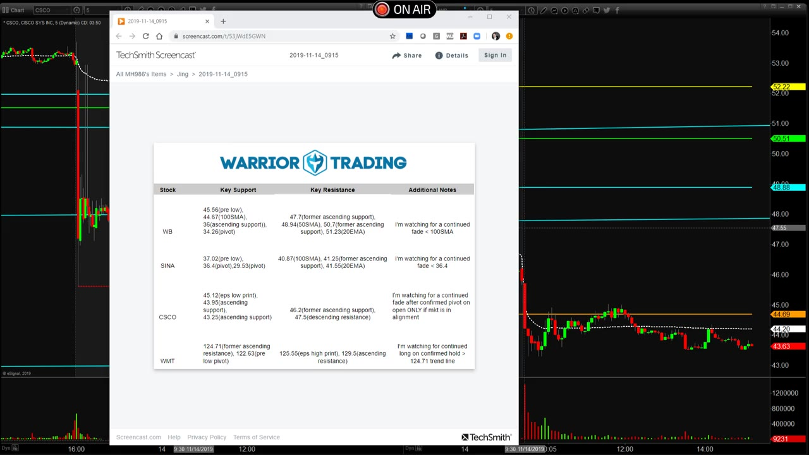

**图怎么看：**

- 这张截图显示了TechSmith Screencast的屏幕录制，其中包含Warrior Trading的股票分析。
- 截图中列出了WB、SINA和CSCO等股票的关键支撑位和阻力位。
- 截图还显示了这些股票的技术指标，如移动平均线（EMA）和支撑/阻力水平。
- 通过这些图表和技术指标，投资者可以更好地理解股票的价格行为和潜在的趋势。

### 关键内容

- 构建股票观察列表需要时间积累和技术分析，不应作为新手的第一课。
- 股票应有显著开盘差距（至少3%），并伴随合理催化剂（如财报）。
- 技术分析是筛选股票的关键，能过滤掉大部分无潜力股票。
- 专注于少数几只股票，避免分散注意力。
- 使用历史数据和经验来选择股票，而非依赖实时扫描。
- 避免分析师评论、收购新闻和发行公告等不可靠信息。
- 构建股票观察列表应在市场开盘前完成，以确保信息准确。
- 使用特定的股票观察列表可以减少决策失误，提高交易效率。
- 构建股票观察列表应基于技术分析，而非单纯的价格波动。
- 构建股票观察列表应结合市场热点和历史表现

### 分析与执行顺序

1. 首先，识别开盘显著差距的股票（至少3%），并寻找合理的催化剂（如财报）。
2. 其次，分析股票的技术图表，识别支撑线和阻力线，判断股票的潜在走势。
3. 然后，根据历史表现和当前市场情况，缩小股票范围，选择最有潜力的几只。
4. 最后，在市场开盘前，确定要关注的股票，并准备相应的交易策略。
5. 在整个过程中，不断回顾和调整选择标准，确保符合市场变化。
6. 通过实际操作，逐步熟悉股票观察列表的构建过程，提高交易成功率。
7. 定期更新股票观察列表，以适应市场变化和新的催化剂

### 案例与细节

- WB股票开盘大幅上涨，达到3%以上，随后出现财报利好消息，符合构建股票观察列表的标准。
- Cisco股票开盘后表现稳定，但技术图表显示支撑线和阻力线清晰，表明未来可能有较大波动。
- 分析师评论和收购新闻被排除，因为它们无法提供可靠的交易信号。
- 构建股票观察列表时，重点关注过去一个月内表现突出的股票，如WB和Cisco。
- 在市场开盘前，WB股票突破关键支撑线，确认交易信号，而Cisco则保持稳定，未出现明显突破

### 风险与边界

- 构建股票观察列表需要时间积累，新手可能难以立即掌握所有技巧。
- 市场环境变化可能导致某些股票不再适合观察列表，需及时调整。
- 依赖单一股票观察列表可能忽视市场其他重要信息，需保持灵活性。
- 录制年代限制为2019年，市场环境和规则可能已发生变化，需谨慎应用。
- 构建股票观察列表时，需注意市场波动性，避免过度自信导致决策失误

### 复盘问题

- 构建股票观察列表时，如何平衡市场热点和历史表现？
- 如何在市场开盘前有效筛选股票，确保信息的准确性？
- 在实际交易中，如何应对突发的市场变化和新的催化剂？

---

## v0760：如何识别和利用关键支撑阻力点（枢轴点）

> 日期：2019　·　时长：00:34:09

**本场重点：** 识别枢轴点是提高交易准确性的关键，但需要在快速时间框架上进行。

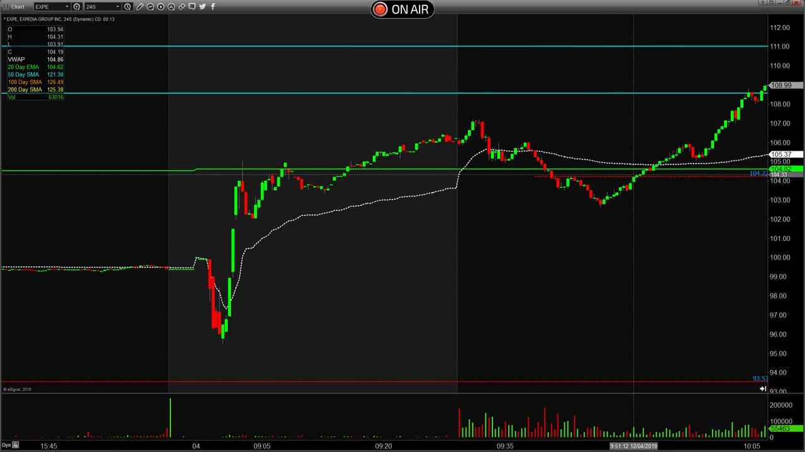

**图怎么看：**

- Expedia Group Inc. (EXPE) 的日线图显示了价格在关键支撑和阻力位之间的波动。
- 50日均线、100日均线和200日均线形成了重要的支撑和阻力水平。
- 价格在这些均线附近出现明显的支撑和阻力，显示出市场的趋势变化。
- 通过分析这些关键支撑和阻力点，投资者可以更好地把握市场方向和时机

### 关键内容

- 枢轴点在快速时间框架上更为明显，有助于识别支撑和阻力。
- 双底或双顶形成枢轴点，表明价格在此区域反复测试。
- 突破枢轴点确认趋势方向，但需多次测试以验证其有效性。
- 使用枢轴点作为止损，确保在突破后立即退出。
- 在快速时间框架上识别枢轴点比在较慢时间框架上更有效。
- 枢轴点形成后，可以作为后续交易的参考点。
- 在快速时间框架上识别枢轴点需要关注价格动作的一致性。
- 利用枢轴点进行交易管理，提高交易准确性。

### 分析与执行顺序

1. 首先，识别快速时间框架上的枢轴点，如24秒图表。
2. 其次，寻找双底或双顶形成的枢轴点，这些点表明价格在此区域反复测试。
3. 然后，确认突破枢轴点的方向，但需多次测试以验证其有效性。
4. 接着，将突破的枢轴点作为止损点，确保在突破后立即退出。
5. 最后，利用枢轴点进行交易管理，提高交易准确性。

### 案例与细节

- ticker：APA；price_action：APA突破了一个大的趋势线，形成了一个双底，表明支撑点。；pivot_point：在双底形成后，价格测试该区域，形成了一个枢轴点。；breakout：APA突破了该枢轴点，表明趋势方向的变化。；stop_loss：使用该枢轴点作为止损点，在突破后立即退出。
- ticker：EXPE；price_action：EXPE在开盘后形成一个双底，表明支撑点。；pivot_point：在双底形成后，价格测试该区域，形成了一个枢轴点。；breakout：EXPE突破了该枢轴点，表明趋势方向的变化。；stop_loss：使用该枢轴点作为止损点，在突破后立即退出。
- ticker：Sage；price_action：Sage在快速时间框架上形成一个双底，表明支撑点。；pivot_point：在双底形成后，价格测试该区域，形成了一个枢轴点。；breakout：Sage突破了该枢轴点，表明趋势方向的变化。；stop_loss：使用该枢轴点作为止损点，在突破后立即退出。

### 风险与边界

- 在快速时间框架上识别枢轴点需要依赖价格动作的一致性，这可能因市场波动而失效。
- 突破枢轴点后立即退出可能错过后续的盈利机会。
- 在较慢时间框架上识别枢轴点不如在快速时间框架上有效，因为细节被隐藏在蜡烛内。
- 市场环境变化可能导致快速时间框架上的枢轴点识别方法不再适用。

### 复盘问题

- 如何在快速时间框架上识别枢轴点？
- 突破枢轴点后立即退出是否总是最佳策略？
- 在较慢时间框架上识别枢轴点的有效性如何？

---

## v0761：年度交易总结与准备

> 日期：2019　·　时长：00:31:58

**本场重点：** 总结过去一年的交易经验，制定来年的交易策略，强调市场季节性变化的重要性。

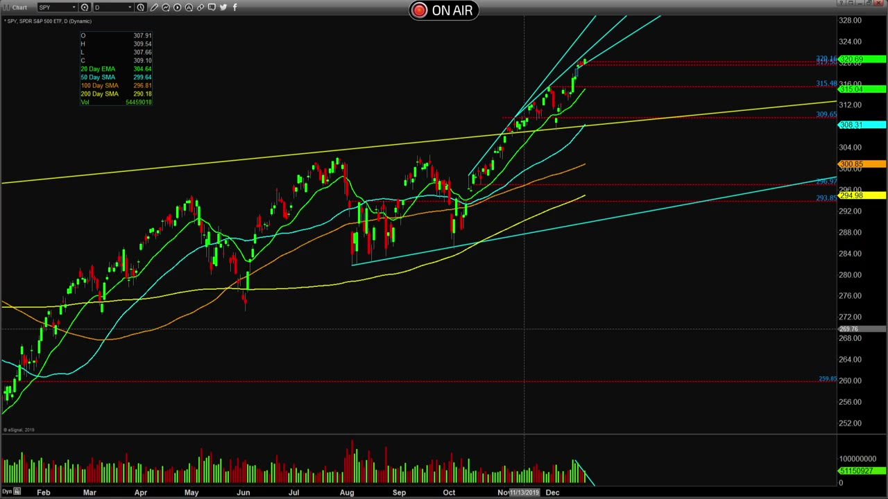

**图怎么看：**

- 这张图表显示了标普500指数（SPY）的日线图，包括短期和长期移动平均线。
- 图表上显示了26日EMA、50日EMA、100日SMA和200日SMA等技术指标。
- 成交量柱的高度反映对应周期内的总成交量；红绿着色通常跟随价格柱的涨跌规则，不能直接拆成两种方向的主动成交。
- 当前价格在300-320之间波动，表明市场处于上升趋势。

### 关键内容

- 讲师回顾了2018年和2019年的市场表现，特别是夏季和年末的市场特点。
- 总结了如何根据市场季节性调整交易策略，如夏季减少交易规模，提高退出速度。
- 强调了保持交易策略的灵活性和适应性，以应对市场变化。
- 建议在年末假期期间保持谨慎，减少交易频率。
- 鼓励记录每日交易数据，以便更好地分析和改进交易策略。
- 提醒交易者要设定合理的盈利目标，避免过度压力。
- 分享了如何通过周度目标来缓解每日交易压力的方法。
- 强调了市场季节性变化对交易策略的影响，如夏季和年末的不同市场特征。
- 建议交易者在年末假期期间保持谨慎，减少交易频率。

### 分析与执行顺序

1. 讲师首先回顾了2018年和2019年的市场表现，特别是夏季和年末的市场特点。
2. 然后分析了如何根据市场季节性调整交易策略，如夏季减少交易规模，提高退出速度。
3. 接着建议交易者在年末假期期间保持谨慎，减少交易频率。
4. 最后分享了如何通过周度目标来缓解每日交易压力的方法。
5. 在整个过程中，讲师强调了记录每日交易数据的重要性，以便更好地分析和改进交易策略。

### 案例与细节

- 讲师提到2018年夏季市场较为缓慢，而2019年夏季则持续时间更长，影响了交易策略。
- 讲师举例说明了如何在夏季减少交易规模，提高退出速度，以适应市场变化。
- 讲师指出，如果在圣诞节假期期间进行交易，可能会遇到市场流动性较低的情况。
- 讲师分享了一个交易者的例子，他在圣诞节假期期间减少了交易频率，避免了不必要的风险。
- 讲师提到，如果在圣诞节假期期间进行交易，可能会遇到市场流动性较低的情况。

### 风险与边界

- 由于录制于2019年，部分市场条件和交易环境可能已发生变化。
- 市场季节性变化的影响可能因地区和市场类型而异。
- 交易者需要根据当前市场情况进行适当调整，而不是简单地复制过去的策略。
- 设定过高的盈利目标可能导致过度压力，影响交易决策。

### 复盘问题

- 回顾2018年和2019年的市场表现，有哪些关键因素影响了交易策略？
- 如何根据市场季节性变化调整交易策略？
- 在年末假期期间，交易者应该采取哪些措施来减少风险？
- 如何通过周度目标来缓解每日交易压力？

---

## v0762：时间框架连续性在交易中的应用

> 日期：2019　·　时长：00:21:34

**本场重点：** 时间框架连续性是交易中重要的确认机制，尤其是在一天交易后期，需要更多确认来提高交易概率。

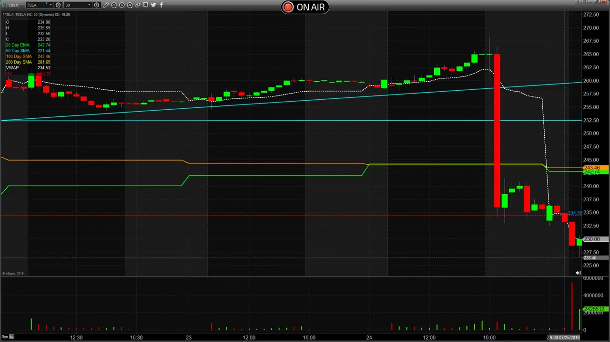

**图怎么看：**

- 特斯拉(TSLA)的交易日K线图显示了价格波动和均线。
- 图中可以看到特斯拉(TSLA)的价格在不同时间段内的波动情况。
- 均线（如20日均线、50日均线等）显示了价格的趋势。
- 成交量柱显示了市场参与者的买卖活动。

### 关键内容

- 交易者通常在开盘后一小时内完成大部分交易，之后需要更多确认。
- 时间框架连续性要求不同时间框架上的图表需一致，以确认交易信号。
- 特斯拉案例中，15分钟和30分钟图表显示价格行动未准备好进行短头。
- CSX案例中，15分钟和30分钟图表确认突破200日均线后的短头机会。
- SA SAVE案例中，15分钟和30分钟图表确认突破特定价位后的短头机会。
- 使用时间框架连续性可以减少无效交易，提高交易成功率。
- 交易者应在10点后切换到较长时间框架图表，以寻找确认信号。
- 时间框架连续性适用于交易后期，但开盘时仍需关注快速变化。
- 交易者应根据较长时间框架图表决定是否入场，然后使用较短时间框架图表确认。
- 时间框架连续性有助于识别交易信号，减少市场噪音带来的干扰

### 分析与执行顺序

1. 交易者在开盘后一小时内完成大部分交易，之后需要更多确认。
2. 在10点后，切换到较长时间框架图表（如15分钟和30分钟），寻找确认信号。
3. 分析较长时间框架图表，确认突破关键价位后的交易信号。
4. 使用较短时间框架图表（如5分钟）进一步确认交易信号的有效性。
5. 根据较长时间框架图表决定是否入场，然后使用较短时间框架图表确认。
6. 在交易后期使用时间框架连续性，可以减少无效交易，提高交易成功率

### 案例与细节

- 特斯拉案例中，15分钟和30分钟图表显示价格行动未准备好进行短头。
- CSX案例中，15分钟和30分钟图表确认突破200日均线后的短头机会。
- SA SAVE案例中，15分钟和30分钟图表确认突破4550价位后的短头机会

### 风险与边界

- 录制年代限制，此策略可能不适用于当前市场环境的变化。
- 时间框架连续性依赖于图表数据，数据错误可能导致错误决策。
- 交易者需注意市场情绪变化，时间框架连续性无法完全预测市场波动
- 交易者需谨慎，避免过度依赖时间框架连续性，忽略其他重要因素

### 复盘问题

- 在哪些情况下，时间框架连续性策略最为有效？
- 如何在实际交易中应用时间框架连续性策略？
- 时间框架连续性策略有哪些潜在的风险和局限性？

---

## v0763：开盘价突破与反向策略

> 日期：2019　·　时长：00:53:07

**本场重点：** 讨论UNH股票的开盘价突破策略，识别反向交易机会，强调技术指标的重要性。

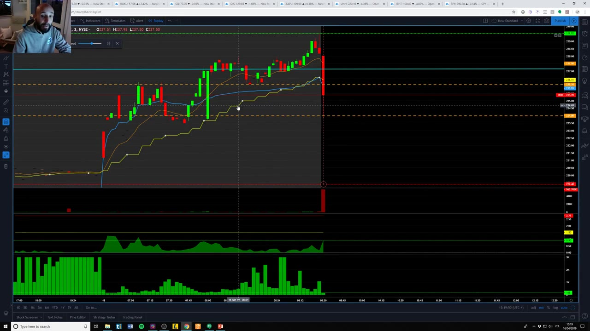

**图怎么看：**

- 画面中，UNH股票的开盘价突破了前期高点，形成了一个重要的反转信号。
- 成交量柱的高度反映对应周期内的总成交量；红绿着色通常跟随价格柱的涨跌规则，不能直接拆成两种方向的主动成交。
- 均线显示出股价在突破后的趋势变化，表明市场可能进入新的上升或下降阶段。
- 通过分析这些技术指标，投资者可以识别出潜在的反向交易机会，并制定相应的交易策略。

### 关键内容

- 策略包括开盘价突破和反向交易两种情况，主要关注开盘价突破。
- 开盘价突破分为向上突破和向下突破，反向交易则关注向上突破后的下跌。
- 使用13EMA和VWAP作为关键技术指标，强调它们的重要性。
- 开盘价突破后，等待第二根蜡烛形成新低，确认反向交易机会。
- 开盘价突破后，需要确认价格突破支撑位，确保交易信号的有效性。
- 开盘价突破后，等待第一根蜡烛完全关闭，避免高波动环境下的交易。
- 使用技术指标进行风险回报比计算，提高交易效率。
- 开盘价突破后，需要确认成交量，确保交易信号的可靠性。
- 开盘价突破后，需要关注市场情绪和催化剂的影响。
- 开盘价突破后，需要确认价格是否突破关键支撑位，确保交易信号的有效性。

### 分析与执行顺序

1. 首先介绍开盘价突破策略，包括向上突破和反向交易两种情况。
2. 然后讲解如何识别反向交易机会，特别是向上突破后的下跌。
3. 接着演示如何使用技术指标（如13EMA和VWAP）进行风险回报比计算。
4. 进一步解释如何确认价格突破支撑位，确保交易信号的有效性。
5. 最后，强调开盘价突破后需要等待第一根蜡烛完全关闭，避免高波动环境下的交易。

### 案例与细节

- UNH股票在开盘价突破后，第二根蜡烛形成新低，确认反向交易机会。
- 开盘价突破后，价格突破了13EMA和VWAP，确认反向交易信号。
- 开盘价突破后，成交量超过300,000股，确认交易信号的有效性。
- 开盘价突破后，价格测试了关键支撑位，确认反向交易信号的有效性。

### 风险与边界

- 开盘价突破策略依赖于技术指标，如果这些指标失效，可能导致错误的交易信号。
- 开盘价突破策略需要确认成交量，如果成交量不足，可能导致无效的交易信号。
- 开盘价突破策略需要确认价格突破支撑位，如果价格未能突破，可能导致无效的交易信号。
- 开盘价突破策略适用于2018年至2021年的市场环境，不适用于当前市场环境。

### 复盘问题

- 如何识别开盘价突破后的反向交易机会？
- 如何使用技术指标进行风险回报比计算？
- 如何确认开盘价突破后的有效交易信号？

---

## v0764：正确止损与任意止损的区别

> 日期：2019　·　时长：00:50:56

**本场重点：** 正确止损能提升交易信心，而任意止损可能导致过度交易。

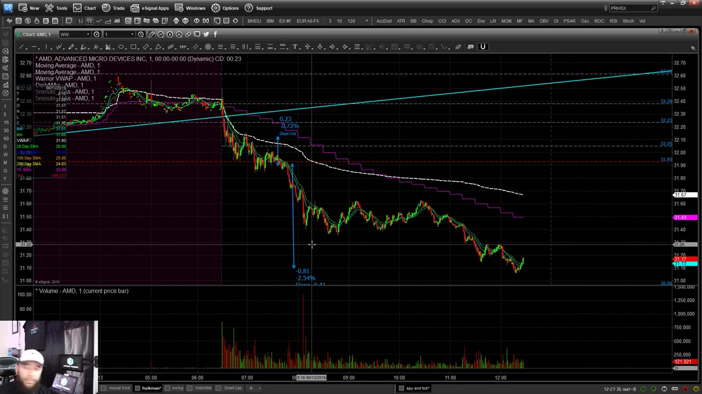

**图怎么看：**

- 深色图表显示价格在左侧整理后向下破位，并沿多条均线或云层下方继续走弱；图中画有水平线和一段蓝色垂直距离标记。
- 蓝色标记把入场附近到下方目标或风险区的距离可视化，红色水平位和趋势线则帮助判断交易想法何时被证伪。
- 这张图适合区分正确止损与任意止损：正确止损依托结构、入场逻辑和预设距离，任意止损只是在价格波动后临时选择数字。
- 历史图上的最佳线位具有事后优势，实际订单还会受价差和滑点影响；不能因为止损看似精确就放大仓位。

### 关键内容

- 止损设置过紧会导致交易者错过预期的方向。
- 使用样本集和硬止损可以帮助交易者克服信心不足的问题。
- 正确止损应基于实际价格动作而非当前高点。
- 交易者需要根据自己的性格调整止损大小。
- 过度交易和信心不足是交易者常见的问题。
- 使用技术指标如VWAP可以帮助确定止损位置。
- 交易者需要根据市场情况调整止损策略。
- 交易者应该避免在心理上过度反应。
- 交易者需要建立正确的交易心态
- 止损设置过紧会限制交易者的操作空间，导致错过预期的价格走势。因此，交易者需要适当放宽止损，以适应市场的波动。
- 当交易者情绪波动时，容易设置过紧的止损，这会增加交易者的心理负担，影响决策的准确性。因此，保持冷静是关键。
- 交易者在新市场或新股票上容易设置过紧的止损，因为缺乏经验会导致过度谨慎。逐步积累经验可以减少这种倾向。
- 当市场趋势明显时，交易者可能会放松止损，但在趋势反转时，过松的止损可能导致重大损失。因此，保持警惕是必要的。
- 交易者在高波动性市场中容易设置过紧的止损，因为频繁的价格波动会引发过度反应。了解市场特性有助于控制风险

### 分析与执行顺序

1. 记录当前交易情况，包括使用的图表和止损设置。
2. 分析交易过程中遇到的问题，如过度交易和信心不足。
3. 设定样本集和硬止损，以帮助交易者克服信心不足的问题。
4. 使用技术指标如VWAP来确定止损位置。
5. 根据市场情况调整止损策略，以适应不同的市场环境。
6. 记录交易过程中的心理变化，以帮助交易者建立正确的交易心态

### 案例与细节

- ticker：AMD；price：20 cents；ratio：2 to 1；graph：三角形突破；indicator：VWAP；behavior：交易者在三角形突破后设置止损，等待回调
- ticker：PLAY；price：30 cents；ratio：2 to 1；graph：三角形突破；indicator：VWAP；behavior：交易者在三角形突破后设置止损，等待回调
- ticker：T-VIX；price：1 dollar；ratio：2 to 1；graph：新闻日波动；indicator：VWAP；behavior：交易者在新闻日设置止损，等待回调
- ticker：AMD；price：20 cents；ratio：2 to 1；graph：三角形突破；indicator：VWAP；行为：交易者在三角形突破后设置20美分的止损，等待回调，但因担心价格进一步上涨而提前退出。
- ticker：PLAY；price：30 cents；ratio：2 to 1；graph：三角形突破；indicator：VWAP；行为：交易者在三角形突破后设置30美分的止损，等待回调，但因担心价格下跌而提前退出。
- ticker：T-VIX；price：1 dollar；ratio：2 to 1；graph：新闻日波动；indicator：VWAP；行为：交易者在新闻日设置1美元的止损，等待回调，但因担心市场大幅波动而提前退出
- ticker：CMG；price：50 cents；ratio：2 to 1；graph：三角形突破；indicator：VWAP；行为：交易者在三角形突破后设置50美分的止损，等待回调，但因担心价格快速上涨而提前退出。
- ticker：AMZN；price：10 cents；ratio：2 to 1；graph：三角形突破；indicator：VWAP；行为：交易者在三角形突破后设置10美分的止损，等待回调，但因担心价格波动而提前退出

### 风险与边界

- 止损设置过紧可能导致交易者错过预期的方向。
- 过度交易和信心不足是交易者常见的问题。
- 交易者需要根据市场情况调整止损策略。
- 录制年代限制为2019年，交易环境可能已发生变化。
- 录制年代限制为2019年，交易环境可能已发生变化，因此交易者需要根据当前市场情况调整止损策略。
- 过度交易和信心不足是交易者常见的问题，这可能导致资金管理不当，增加不必要的风险。
- 交易者在高波动性市场中容易设置过紧的止损，这会增加交易成本并降低盈利潜力。
- 交易者在新市场或新股票上容易设置过紧的止损，这会限制其操作空间并影响交易效果。

### 复盘问题

- 交易者在哪些情况下容易设置过紧的止损？
- 如何通过样本集和硬止损来克服信心不足的问题？
- 交易者在哪些市场环境下更容易过度交易？

---
