# Advanced Mentor Sessions：2020

> 45 场，合计 40.5 小时。返回 [Advanced Mentor Sessions 目录](../README.md)。

## v0765：大型股市场分析与交易策略

> 日期：2020-01-02　·　时长：00:58:34

**本场重点：** 分析大型股市场，识别技术交易机会，强调风险管理与盈利目标。

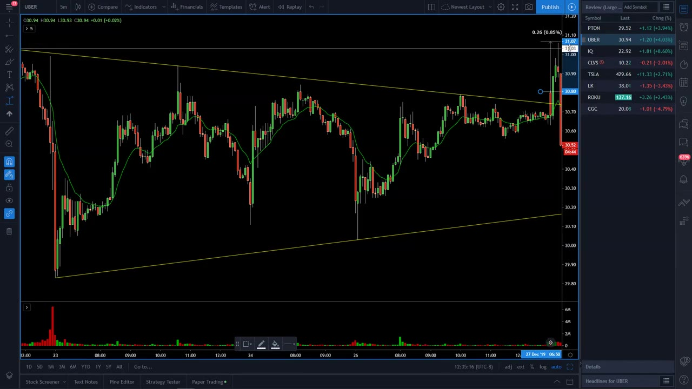

**图怎么看：**

- UBER 在日线图上显示出一个上升趋势，表明股价可能继续上涨。
- 支撑位在30.21附近，如果股价跌破这个水平，可能会引发回调。
- 成交量柱的高度反映对应周期内的总成交量；红绿着色通常跟随价格柱的涨跌规则，不能直接拆成两种方向的主动成交。
- 价格结构显示了股价在不同时间点的波动情况，有助于识别潜在的交易机会。

### 关键内容

- 强调在突破后保持耐心，直到确认突破有效，再继续持有。
- 通过分析历史数据，识别大型股市场的趋势和模式。
- 使用期权交易来降低风险，同时追求高回报。

### 分析与执行顺序

1. 使用60分钟图表分析大型股市场，识别三重底部突破作为短期交易机会。
2. 设定风险回报比，确保在突破点附近进入交易，以实现至少三倍的风险回报。
3. 通过调整止损位来管理风险，确保在突破失败时快速退出。
4. 利用技术指标如趋势线和支撑位来识别潜在的交易机会。
5. 根据市场表现调整交易策略，确保适应市场变化。
6. 分享成功的交易案例，如PTON和IQ的交易策略
7. 强调技术分析的重要性，以及如何将其应用于实际交易

### 案例与细节

- PTON：识别三重底部突破，设定止损在2987下方，目标价分别为2775和2624。
- Uber：识别突破点，设定止损在趋势线下方，目标价为3080。
- CLVS：识别三重底部突破，设定止损在1080下方，目标价为872。
- IQ：识别突破点，设定止损在2245下方，目标价为2930。
- Roku：识别三重底部形成，设定止损在13240下方，目标价为26

### 风险与边界

- 市场波动可能导致突破失败，需要快速调整策略。
- 过度依赖技术指标可能导致错过其他重要信号。
- 市场情绪变化可能影响交易结果，需要灵活应对。
- 录制于2020年，当前市场环境可能已发生变化。
- 风险控制措施可能在不同市场环境下效果不同

### 复盘问题

- PTON的交易策略是如何制定的？
- 在Uber的交易中，如何确定止损位？
- CLVS的交易策略为何未能成功？
- 在Roku的交易中，如何识别三重底部突破？
- 如何根据市场表现调整交易策略？

---

## v0766：趋势交易小盘股策略

> 日期：2020-02-19　·　时长：01:09:15

**本场重点：** 1. 识别趋势交易机会；2. 使用扫描器和Fibonacci工具；3. 遵循计划进行交易。

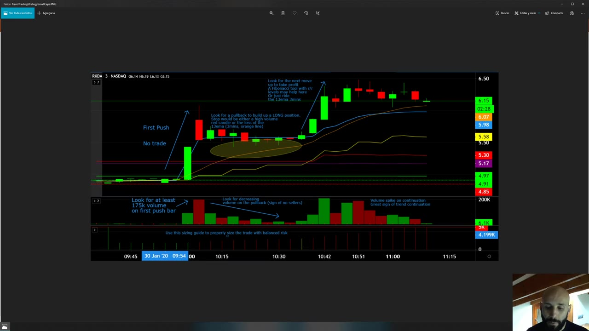

**图怎么看：**

- 画面中，显示了NASDAQ股票的K线图，其中包含了趋势交易的机会。
- 图中使用了多个指标和工具来分析市场趋势，包括均线、支撑位和阻力位。
- 通过观察K线形态和成交量变化，可以识别出潜在的趋势交易机会。
- 图A还提供了具体的交易策略和操作建议，帮助投资者更好地理解和执行交易计划。

### 关键内容

- 讲师分享了趋势交易小盘股的新策略，旨在提高长期盈利能力。
- 使用扫描器识别潜在交易机会，特别是第一波回撤。
- 设置Fibonacci工具来规划交易计划，确保交易一致性。
- 策略适用于小盘股，但需要更快速度和不同心态。
- 使用特定的筛选条件来识别潜在交易标的，包括相对强度、相对成交量等。
- 交易时间间隔设定为五分钟，以适应特定的过滤条件。
- 通过回测验证策略的有效性，确保交易信号的准确性

### 分析与执行顺序

1. 等待扫描器发出信号，识别第一波回撤。
2. 检查成交量是否达到标准，确保有足够的流动性。
3. 使用Fibonacci工具绘制交易计划，包括支撑位和阻力位。
4. 监控成交量，寻找回撤时成交量减少的迹象。
5. 在满足条件后建立多头仓位，使用止损保护。
6. 遵循计划进行交易，关注Fibonacci水平以确定盈利时机。
7. 记录交易结果，进行回测以优化策略

### 案例与细节

- RKDA股票在一天内从5美元涨至6.50美元，符合交易条件。
- BLPH股票在一天内从1027美元涨至8美元，符合交易条件。
- 使用Fibonacci工具绘制交易计划，包括13EMA和止损位。
- 监控成交量，发现回撤时成交量减少，确认交易信号。
- 在满足条件后建立多头仓位，使用止损保护，最终实现盈利

### 风险与边界

- 策略依赖于特定的市场条件，可能在市场波动较大时失效。
- 交易速度要求较高，不适合所有投资者。
- 策略仅适用于小盘股，风险较高。
- 交易信号可能存在延迟，影响交易决策。
- 策略依赖于特定的筛选条件，可能因市场变化而失效

### 复盘问题

- 如何识别潜在的交易信号？
- 如何监控成交量以确认交易信号？
- 如何设置止损以保护交易？
- 如何通过回测优化交易策略？

---

## v0767：模拟交易中的高级设置与策略

> 日期：2020-04-17　·　时长：01:16:56

**本场重点：** 1. 如何在模拟交易中设置热键以提高交易效率；2. 如何根据市场情况调整交易策略；3. 模拟交易与真实交易的区别。

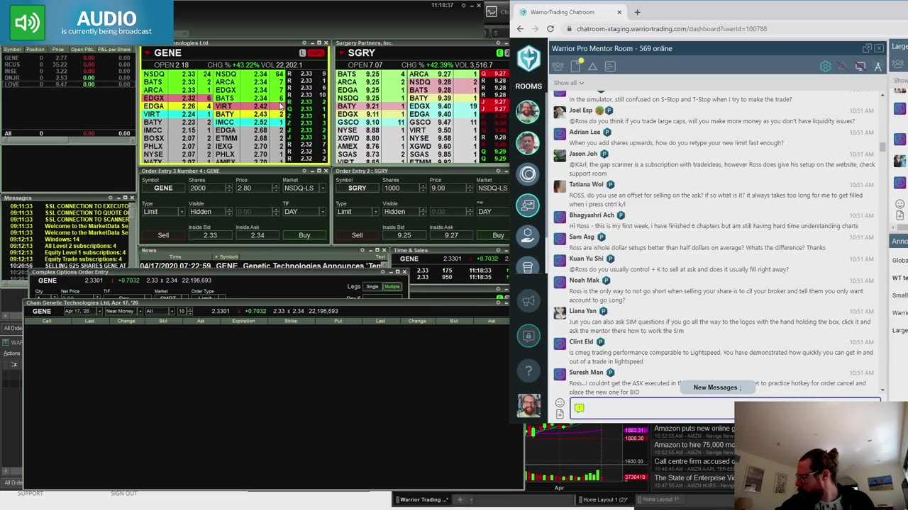

**图怎么看：**

- 实时交易界面展示了Level 2信息，包括股票代码、价格、成交量等。
- Time & Sales窗口显示了当前市场的买卖价差和成交量。
- 订单区域显示了当前的买单和卖单，帮助投资者了解市场动态。
- 这些功能对于模拟交易中的高级设置和策略至关重要，有助于提高交易效率。

### 关键内容

- 讲师解释了如何在模拟交易中修改默认的持仓数量。
- 通过热键可以快速下单，但需要注意市场波动带来的风险。
- 模拟交易中的P&L显示窗口可以帮助用户监控交易盈亏。
- 使用热键进行交易可以提高速度，但也需要谨慎操作。
- 模拟交易中的市场数据更新频率较低，可能影响交易决策。
- 模拟交易中的止损设置可以帮助控制风险，但需结合实际情况灵活调整。

### 分析与执行顺序

1. 讲师首先回答了关于修改模拟交易中持仓数量的问题。
2. 然后解释了如何使用热键进行快速下单，并展示了如何设置止损。
3. 接着讲解了如何利用模拟交易中的图表工具进行交易决策。
4. 最后强调了模拟交易与真实交易之间的差异，提醒学员注意区分。
5. 在整个过程中，讲师多次强调了模拟交易的重要性及其局限性。
6. 通过实际操作演示，讲师展示了如何在模拟交易中进行快速交易。
7. 最后，讲师提醒学员注意模拟交易中的资金管理和心理素质训练

### 案例与细节

- 在模拟交易中，使用热键可以快速下单，如控制S设置止损，控制Z立即卖出。
- 模拟交易中的Gene股票交易显示了如何快速捕捉市场机会，但需注意市场波动。
- 模拟交易中的P&L窗口显示了交易盈亏，帮助用户监控交易效果。
- 使用热键进行交易可以提高速度，但需注意市场波动带来的风险。

### 风险与边界

- 模拟交易中的市场数据更新频率较低，可能导致交易决策失误。
- 模拟交易中的资金管理策略对于新手非常重要，需严格遵守。
- 模拟交易中的心理素质训练对于长期交易成功至关重要，需重视心理调节。
- 模拟交易中的图表工具可以帮助用户更好地理解市场走势，但需注意图表的局限性。
- 模拟交易中的订单执行规则与真实交易有所不同，需注意区分。

### 复盘问题

- 如何在模拟交易中设置热键以提高交易效率？
- 模拟交易中的市场数据更新频率较低，如何应对这一问题？
- 如何根据市场情况调整交易策略？
- 模拟交易与真实交易有哪些主要区别？
- 如何在模拟交易中进行有效的资金管理和心理素质训练？

---

## v0768：高级交易问答

> 日期：2020-04-23　·　时长：00:58:06

**本场重点：** 交易波动大，需快速决策；情绪管理是关键；低成交量股票风险高。

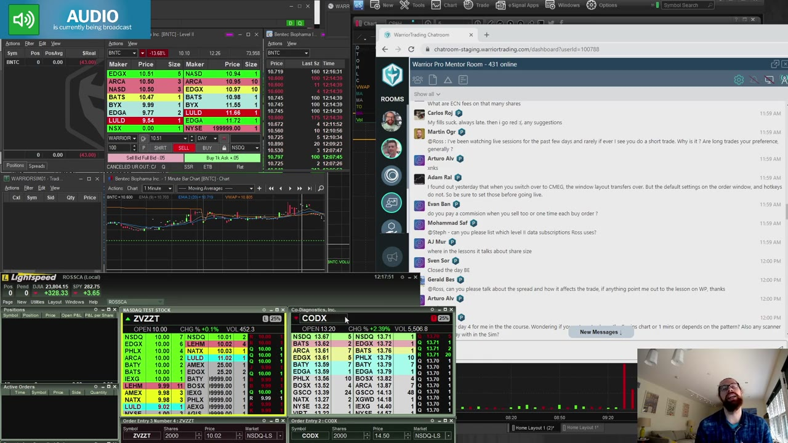

**图怎么看：**

- 画面中，可以看到多个股票的实时交易数据，包括价格、成交量和订单状态。这些数据对于交易者来说非常重要，可以帮助他们做出快速决策。
- 画面中的Level 2显示了不同股票的买卖盘情况，这对于理解市场动态和制定交易策略至关重要。
- 时间与销售（Time & Sales）图显示了股票价格随时间的变化趋势，有助于交易者分析市场的波动性和趋势。
- 表格部分展示了多个股票的详细信息，包括价格、成交量和其他相关指标，这些信息对交易决策非常关键。

### 关键内容

- 交易量大，波动剧烈，需快速决策。
- 情绪管理至关重要，避免冲动操作。
- 低成交量股票风险高，需谨慎。
- 使用五分钱偏移价买入和卖出。
- 预盘交易波动大，需等待开盘后交易。
- 使用LightSpeed交易平台，佣金和ECN费用较高。
- 设置止损单可能减少损失，但需谨慎。
- 保持连续盈利天数，但需警惕亏损。
- 使用五分钱偏移价进行交易，以避免滑点。
- 观察到Whiting股票在预盘交易中波动剧烈，需迅速决策，否则可能错失良机。
- 使用LightSpeed交易平台时，需注意其佣金和ECN费用较高，这将直接影响最终盈利。
- 情绪管理是交易中的关键，避免因情绪波动导致冲动操作，从而增加不必要的风险。
- 低成交量股票如Whiting，需谨慎交易，因为它们更容易出现滑点，影响交易结果。
- 使用五分钱偏移价进行交易，可以有效避免滑点，提高交易成功率，但需确保市场有足够的流动性

### 分析与执行顺序

1. 查看LightSpeed账户，确认今日交易量。
2. 分析Whiting股票的图表，确定交易策略。
3. 使用五分钱偏移价进行买入和卖出。
4. 设置止损单，以减少潜在损失。
5. 监控市场动态，及时调整交易策略。

### 案例与细节

- Whiting股票，交易量299,000股，使用五分钱偏移价进行交易。
- CPAH股票，预盘突破高点，交易量较小，风险较高。
- 设置止损单，防止被市场波动影响，但需谨慎使用。
- 预盘交易波动大，需等待开盘后交易，以避免市场异常波动。
- 在Whiting股票的预盘交易中，观察到价格在短时间内大幅波动，从68元涨至70元，然后又跌回60元，形成一个Doji形态，这表明市场情绪不稳定，需谨慎操作。
- 使用LightSpeed交易平台进行交易时，发现佣金和ECN费用较高，例如在交易300,000股时，ECN费用达到600美元，这显著增加了交易成本，影响最终盈利。
- 在预盘交易中，CPAH股票突破了预盘高点，但交易量较小，且市场波动较大，这增加了交易难度，需要等待开盘后交易，以避免市场异常波动带来的风险。
- 在Whiting股票的交易中，使用五分钱偏移价进行买入和卖出，成功避免了滑点，提高了交易成功率，但在交易量较小的情况下，仍需关注市场流动性。
- 在预盘交易中，观察到Gilead股票因新闻影响而大幅波动，这提醒我们在交易新闻时需谨慎，避免因新闻引发的市场异常波动导致亏损

### 风险与边界

- 预盘交易波动大，需谨慎，市场异常波动可能导致亏损。
- 使用LightSpeed交易平台，佣金和ECN费用较高，影响盈利。
- 情绪管理不佳，可能导致冲动操作，增加风险。
- 低成交量股票风险高，需谨慎，避免滑点。
- 在预盘交易中，由于市场波动较大，容易出现异常波动，这可能导致交易者因无法及时调整策略而遭受损失。
- 使用LightSpeed交易平台时，由于佣金和ECN费用较高，可能会显著降低最终盈利，特别是在交易量较小的情况下，这种影响更为明显。
- 情绪管理不佳可能导致交易者在市场不利时做出冲动操作，从而增加不必要的风险，尤其是在面对高波动性市场时。
- 低成交量股票在预盘交易中更容易出现滑点，这不仅会影响交易结果，还可能导致交易者因无法及时调整策略而遭受损失

### 复盘问题

- 今天交易哪些股票？
- 如何设置止损单？
- 预盘交易有哪些注意事项？
- 情绪管理在交易中扮演什么角色？

---

## v0769：快速问答：交易策略与执行

> 日期：2020-04-24　·　时长：00:28:00

**本场重点：** 快速交易策略、执行风险与市场理解

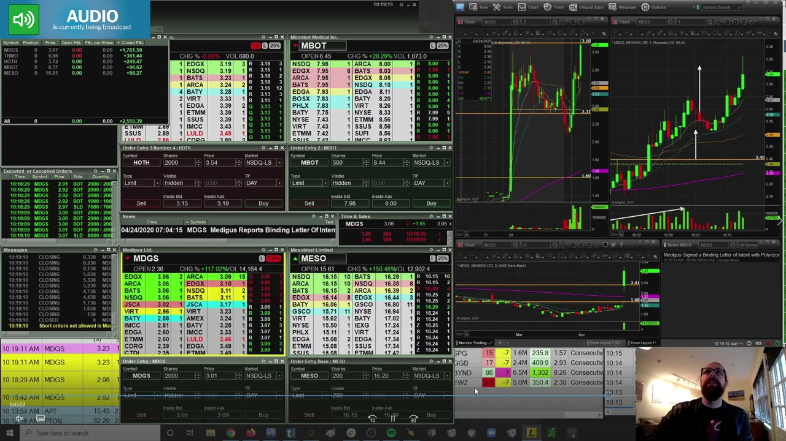

**图怎么看：**

- 画面是多窗口直接交易平台：左侧和下方排列彩色Level 2报价与市场深度，中间有逐笔成交区域，右侧同时显示多张不同周期图表。
- 报价表中的多档价格和数量不断变化，图表则提供价格结构和均线背景；执行时需要把订单簿变化与实际成交结合，而不是只看单个大单。
- 它对应快速问答中的交易执行主题：热键、限价、路由和退出速度都在同一工作区完成，任何界面误读都会直接影响成交质量。
- 静态截图无法呈现报价撤单、隐藏订单和延迟，也不能据红绿颜色断定主动买卖力量；Level 2判断必须结合动态逐笔数据。

### 关键内容

- 快速交易策略依赖实时监控，如MBot股价突破25时手动下单。
- 使用热键（Shift 1）可以提高交易速度，但需注意潜在滑点。
- 实时数据对于识别交易机会至关重要，如MBot突破0.5美元。
- 交易执行需考虑市场波动，避免过度交易导致亏损。
- 交易布局可在不同平台上保存，但需单独设置。
- 交易过程中需关注市场动态，及时调整策略。
- 交易记录中出现部分订单未完全成交的情况，需注意取消订单时的提示。
- 交易过程中需关注市场波动，避免因冲动操作导致亏损。

### 分析与执行顺序

1. 登录模拟交易平台Warrior Sim 01，查看实时数据。
2. 讨论快速交易策略，如MBot股价突破25时手动下单。
3. 演示使用热键（Shift 1）进行快速下单的操作。
4. 强调实时数据的重要性，如MBot突破0.5美元时的交易机会。
5. 讨论交易执行中的风险，如滑点和过度交易。
6. 演示如何在交易过程中调整策略，避免冲动操作。
7. 讨论交易记录中的部分订单未完全成交的情况，注意取消订单时的提示。

### 案例与细节

- MBot股价从25跌至24.9时，手动按下Control Z下单。
- MBot突破0.5美元时，迅速下单以捕捉交易机会。
- 使用Shift 1热键下单，但需注意可能的滑点。
- 交易过程中，观察MBot股价突破85时的交易机会。
- 交易过程中，观察MBot股价突破80时的交易机会。

### 风险与边界

- 快速交易策略依赖实时监控，若市场波动大，可能导致频繁止损。
- 使用热键时需谨慎，避免因操作失误导致损失。
- 交易过程中需关注市场动态，避免因冲动操作导致亏损。
- 录制年代限制，当前市场环境与当时可能有所不同。

### 复盘问题

- 快速交易策略中，如何确保下单时机准确？
- 使用热键时需要注意哪些潜在风险？
- 如何在交易过程中有效管理风险？

---

## v0770：日内交易策略与市场波动

> 日期：2020-04-30　·　时长：01:00:18

**本场重点：** 了解不同交易平台的执行速度差异及如何应对市场突发情况。

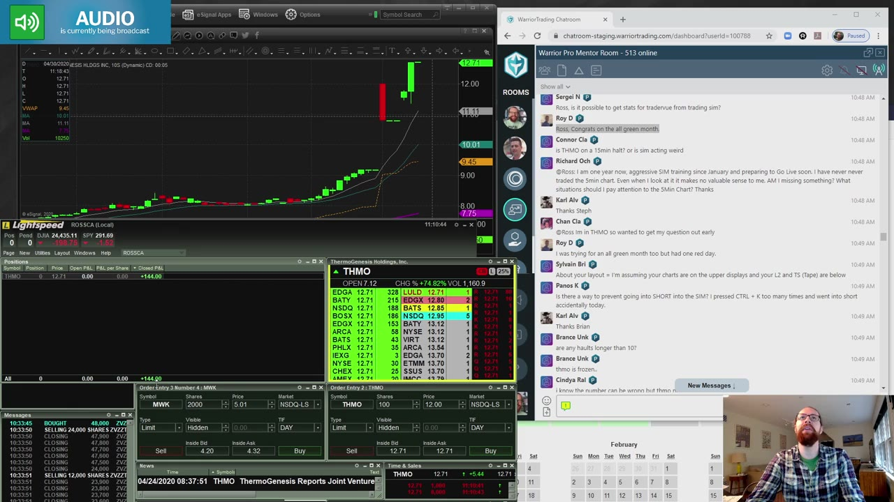

**图怎么看：**

- 在图中可以看到ThermoGenesis Holdings, Inc.的股票价格和成交量。
- 成交量柱显示了当天的买卖活动。
- 图表上显示了股票的价格趋势和成交量的变化。
- 通过观察成交量柱和价格趋势，可以分析市场的活跃度和投资者的情绪。

### 关键内容

- Think or Swim等平台设计用于每周几次交易，而非日内交易，执行速度较慢。
- TD Ameritrade等平台虽然免费但执行速度较慢，适合初学者。
- 使用Thinkerswim进行手动下单，可以设置市场限价单。
- 在市场突然下跌时，需要快速判断是否继续买入或卖出。
- 使用Level 2图表监控买卖盘口，有助于快速决策。
- 在市场长时间停牌时，需要耐心等待并控制风险。
- 使用热键进行快速下单，但需注意可能存在的订单隐藏问题。
- 在市场突然大幅波动时，需要灵活调整交易策略。
- 使用Thinkerswim的Level 2图表进行交易，可以更好地监控市场动态。
- 在市场长时间停牌时，需要关注市场恢复后的价格走势

### 分析与执行顺序

1. 首先，讲师解释了不同交易平台的执行速度差异。
2. 然后，讲师通过实际例子展示了如何在市场突然下跌时快速判断是否继续买入或卖出。
3. 接着，讲师介绍了使用Level 2图表监控买卖盘口的方法。
4. 随后，讲师演示了如何使用热键进行快速下单，并提醒注意可能存在的订单隐藏问题。
5. 最后，讲师强调了在市场长时间停牌时需要耐心等待并控制风险的重要性。
6. 在整个过程中，讲师多次强调了使用Thinkerswim进行交易的优势。
7. 讲师还提醒学员在市场突然大幅波动时需要灵活调整交易策略

### 案例与细节

- 讲师提到TD Ameritrade的执行速度较慢，但免费，适合初学者。
- 在一次实际交易中，讲师使用Level 2图表监控买卖盘口，发现价格突然下跌。
- 讲师通过热键快速下单，但发现订单被隐藏，需要手动取消。
- 在一次长时间停牌后，市场恢复时，价格大幅波动，讲师及时调整了交易策略。
- 讲师使用Thinkerswim进行交易，发现Level 2图表显示的价格与实际交易价格存在差异
- 在一次市场突然下跌时，讲师通过Level 2图表发现价格迅速反弹，及时调整了交易策略

### 风险与边界

- 在市场长时间停牌时，需要关注市场恢复后的价格走势，否则可能会错过最佳交易机会。
- 使用热键进行快速下单时，需要注意订单可能被隐藏，导致无法及时执行。
- 在市场突然大幅波动时，需要灵活调整交易策略，否则可能会面临较大的风险。
- 录制于2020年，部分信息可能不再适用于当前市场环境

### 复盘问题

- 在市场突然下跌时，如何快速判断是否继续买入或卖出？
- 使用Level 2图表监控买卖盘口时，需要注意哪些关键信息？
- 在长时间停牌后，如何判断市场恢复后的价格走势？
- 使用热键进行快速下单时，需要注意哪些潜在问题？
- 在市场突然大幅波动时，如何灵活调整交易策略？

---

## v0771：快速问答环节

> 日期：2020-05-01　·　时长：00:27:40

**本场重点：** 快速回答交易相关问题，强调实时操作的重要性

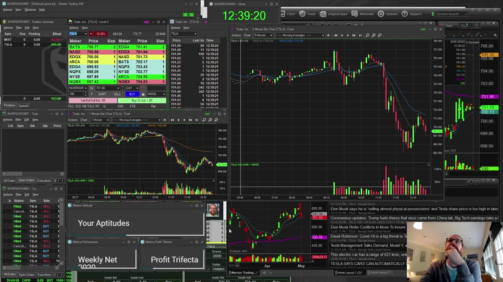

**图怎么看：**

- 实时交易模拟软件界面展示了特斯拉(TSLA)的Level II报价，包括Maker（买方）和Maker（卖方）的价格和数量。
- 成交量柱的高度反映对应周期内的总成交量；红绿着色通常跟随价格柱的涨跌规则，不能直接拆成两种方向的主动成交。
- 成交量柱显示了特斯拉(TSLA)在不同时间段内的成交量变化。
- 实时交易模拟软件界面还提供了实时市场数据和用户互动功能，如聊天室和图表分析工具。

### 关键内容

- 讲师强调实时操作的重要性，使用Level 2数据进行交易
- 计算P&L比率的方法不是实时操作的重点，而是关注潜在利润和止损
- 长期持有分红股是否继续持有取决于多种因素，包括资本收益
- 预测突破时的价格波动范围因股票价格和市场情况而异
- 使用控制键快速设置止损单，以避免在交易中出现大额亏损
- 使用模拟器练习交易，可以更好地理解实际交易中的操作
- 交易时关注Level 2数据，可以帮助识别潜在的交易机会
- 交易时要关注实时图表的变化，及时调整交易策略
- 讲师提到，当看到红盘转绿时，应迅速点击买入按钮，以抓住市场机会。
- 在交易过程中，使用Level 2数据可以帮助识别对手盘和潜在的交易机会，但实际操作中需谨慎。
- 讲师指出，长期持有分红股时，需考虑资本收益、税务影响以及市场波动等因素。
- 在模拟器中练习交易时，可以更好地理解实际交易中的操作，但需注意模拟器与真实交易环境的差异。
- 讲师强调，交易时应密切关注实时图表的变化，及时调整交易策略，以避免错过最佳交易时机

### 分析与执行顺序

1. 讲师打开模拟器，展示如何设置止损单
2. 讲师解释如何使用Level 2数据进行交易
3. 讲师演示如何在模拟器中进行交易
4. 讲师强调使用控制键快速设置止损单的重要性
5. 讲师提醒学员注意实时图表的变化，及时调整交易策略

### 案例与细节

- 特斯拉（Tesla）股价大幅波动，讲师演示如何设置止损单
- 讲师演示如何在模拟器中设置止损单，以保护现有盈利
- 讲师解释如何根据Level 2数据判断是否卖出
- 讲师演示如何在模拟器中进行快速交易，以捕捉市场波动
- 当特斯拉股价从810跌至818时，讲师建议利用Level 2数据来判断是否卖出，因为Level 2显示的是当前的买卖盘情况。
- 在模拟器中，讲师演示了如何设置止损单，例如在特斯拉股价下跌时，将止损设在704附近，以保护现有盈利。
- 讲师提到，当特斯拉股价大幅波动时，他会在模拟器中快速下单，以捕捉市场波动带来的机会，这展示了实时操作的重要性。
- 在模拟器中，讲师演示了如何根据实时图表的变化调整交易策略，例如在股价下跌时迅速卖出，以避免更大损失

### 风险与边界

- 模拟器中的操作与真实交易存在差异，需谨慎转换
- 交易时需关注实时图表变化，避免错过最佳交易时机
- 长期持有分红股需考虑资本收益和其他因素
- 使用Level 2数据进行交易需要熟悉相关工具和操作
- 交易时需关注市场波动，避免大额亏损
- 使用Level 2数据进行交易时，需注意市场可能存在的延迟，这可能导致决策失误。
- 模拟器中的操作与真实交易存在差异，特别是在市场波动较大时，模拟器可能无法完全反映实际情况

### 复盘问题

- 讲师是如何解释使用Level 2数据进行交易的？
- 在模拟器中设置止损单时，讲师提到了哪些关键点？
- 如何根据实时图表的变化调整交易策略？
- 长期持有分红股时，需要考虑哪些因素？

---

## v0772：高级交易问答

> 日期：2020-05-07　·　时长：00:48:46

**本场重点：** 交易者如何设置止损单，以及如何识别隐藏卖单。

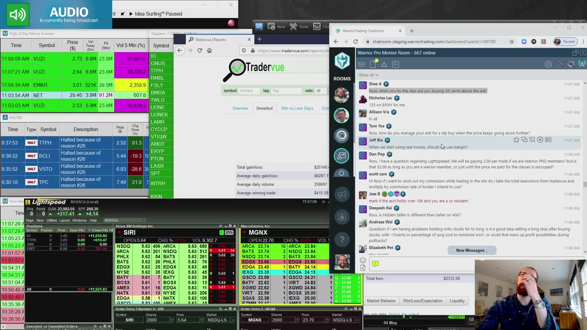

**图怎么看：**

- 画面中，可以看到一个股票的K线图，显示了价格波动情况。
- 图中的水平线表示止损点，帮助交易者在价格达到特定水平时采取行动。
- 右侧聊天室对话框中有关于止损设置和隐藏卖单的讨论。
- 通过分析K线图和聊天记录，可以学习如何有效设置止损单并识别隐藏卖单。

### 关键内容

- 隐藏卖单通常表现为价格不动但大量买入。
- 使用Level 2图表可以更好地识别隐藏卖单。
- 交易者应关注Level 2图表上的大卖单。
- 交易者应快速止损以避免损失。
- 交易者应根据市场情况调整止损单的位置。
- 交易者应使用热键来快速执行买卖操作。
- 交易者应了解不同交易平台之间的细微差别。
- 交易者应熟悉不同交易软件的功能和设置。
- 交易者应根据市场情况灵活调整交易策略。
- 讲师提到，当价格不动但大量买入时，这可能是隐藏卖单，需特别留意。
- 使用Level 2图表时，如果看到价格未动但有大量买入，则可能是隐藏卖单，需及时止损。
- 交易者应关注Level 2图表上的大卖单，因为它们可能预示着市场情绪的变化。
- 交易者应快速止损以避免损失，特别是在市场出现异常波动时。
- 交易者应根据市场情况调整止损单的位置，以适应市场的变化趋势。

### 分析与执行顺序

1. 讲师首先解释了隐藏卖单的识别方法。
2. 然后展示了如何在Level 2图表上识别隐藏卖单。
3. 接着讲解了如何设置止损单以保护资金。
4. 最后强调了交易者应根据市场情况灵活调整策略。
5. 讲师通过实例演示了如何识别隐藏卖单和设置止损单。

### 案例与细节

- 在Pixie股票上，当价格不动但大量买入时，这可能是隐藏卖单。
- 使用Level 2图表时，可以看到价格未动但有大量买入。
- 交易者可以在Level 2图表上看到隐藏卖单，从而及时止损。
- 交易者可以通过设置止损单来保护资金，例如在突破关键水平时设置。
- 在交易过程中，交易者需要根据市场情况灵活调整止损单的位置。
- 在Pixie股票上，当价格不动但大量买入时，这可能是隐藏卖单。例如，当价格在97附近时，大量买单涌入，但价格并未上升，这可能是隐藏卖单的表现。
- 使用Level 2图表时，可以看到价格未动但有大量买入。例如，在Pixie股票上，当价格在97附近时，Level 2显示大量买单涌入，但价格并未上升，这表明隐藏卖单的存在。
- 交易者可以在Level 2图表上看到隐藏卖单，从而及时止损。例如，在Pixie股票上，当价格在97附近时，Level 2显示大量买单涌入，但价格并未上升，交易者应立即设置止损单以保护资金。
- 交易者可以通过设置止损单来保护资金，例如在突破关键水平时设置。例如，在Pixie股票上，当价格突破97时，交易者应立即设置止损单，以防止价格回调导致损失。

### 风险与边界

- 交易者可能无法准确识别隐藏卖单，导致错误的交易决策。
- 交易者可能过度依赖止损单，忽视市场变化。
- 交易者可能在不同交易平台之间遇到兼容性问题。
- 交易者可能在使用Level 2图表时遇到技术障碍。
- 交易者可能在模拟交易中遇到与真实交易不同的情况。
- 交易者可能无法准确识别隐藏卖单，导致错误的交易决策。例如，在Pixie股票上，如果交易者未能识别隐藏卖单，可能会在错误的时机进行交易，导致不必要的损失。
- 交易者可能过度依赖止损单，忽视市场变化。例如，在Pixie股票上，如果交易者过于依赖止损单而忽略了市场变化，可能会在市场反转时错过最佳交易机会。
- 交易者可能在不同交易平台之间遇到兼容性问题。例如，使用LightSpeed平台时，如果交易者发现某些功能在其他平台上不可用，可能会导致交易策略的调整不及时。
- 交易者可能在使用Level 2图表时遇到技术障碍。例如，在Pixie股票上，如果交易者发现Level 2图表显示的信息不清晰或不完整，可能会导致交易决策的失误。

### 复盘问题

- 如何识别隐藏卖单？请举例说明。
- 如何设置止损单以保护资金？请举例说明。
- 交易者在哪些情况下需要调整交易策略？请举例说明。

---

## v0773：交易策略与风险管理

> 日期：2020-05-08　·　时长：01:20:29

**本场重点：** 交易策略的有效性取决于市场条件和情绪管理，风险管理是确保资金安全的关键。

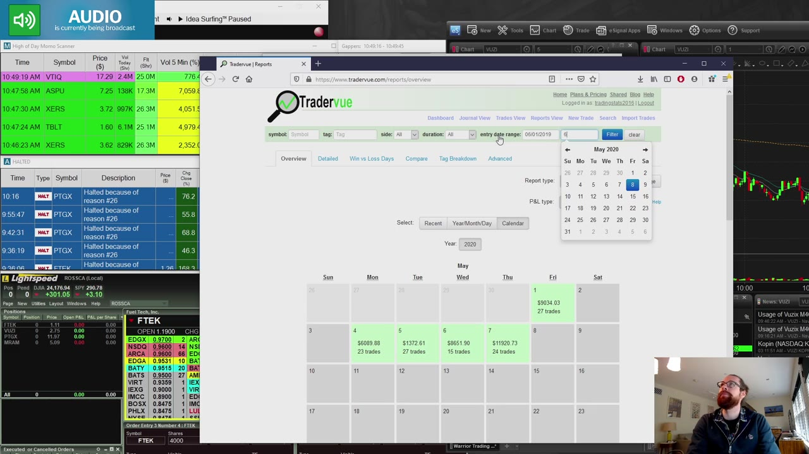

**图怎么看：**

- 在TraderVue报告页面上，可以看到2020年5月的交易数据。
- 页面上显示了不同股票的交易情况，包括开盘价、收盘价、涨跌幅等。
- 用户可以查看每个交易日的详细信息，如成交量、价格变动等。
- 通过这些数据，投资者可以分析市场趋势和交易行为。

### 关键内容

- 讲师提到使用买入停止单的风险，因为它们经常以较高的价格执行，导致损失。
- 在VUZI的交易中，尝试通过成本平均来降低成本基础，但最终未能成功。
- 讲师强调在市场不利时及时止损的重要性，特别是在VUZI的交易中，止损单帮助他避免更大的损失。
- 情绪波动会影响交易决策，特别是在PTGX的交易中，情绪波动导致了错误的交易决策。
- 蜡烛图用于识别市场趋势，例如PTGX的蜡烛图显示了市场波动性。
- 通过观察成交量和价格走势，判断市场是否强劲或疲弱。
- 在FTECH的交易中，利用大订单和市场深度来判断市场动向。
- PTGX的交易展示了如何利用市场反弹进行交易，但最终未能成功。
- 蜡烛图不仅用于识别市场趋势，还能帮助预测未来价格走势，特别是在PTGX的交易中，蜡烛图显示了市场波动性。
- 情绪管理对于交易者至关重要，特别是在PTGX的交易中，情绪波动导致了错误的交易决策，说明情绪管理直接影响交易结果。
- 成本平均策略在市场持续下跌时容易失败，因为每次购买都会以更高的价格买入，从而增加成本。
- 市场波动性增加会增加交易难度，特别是在低成交量股票上，如PTGX，其低成交量导致交易策略难以实施。
- 过度交易可能导致资金损失，特别是在市场不利时，如FTECH的交易中，过度交易使得资金损失加剧

### 分析与执行顺序

1. 讲师首先讨论了交易策略，包括使用买入停止单和成本平均的方法。
2. 然后，讲师强调了风险管理的重要性，特别是及时止损的作用。
3. 接着，讲师介绍了市场分析方法，如使用蜡烛图和量价关系。
4. 最后，讲师分享了具体的交易案例，包括FTECH和PTGX的交易经历。
5. 在整个过程中，讲师反复强调情绪管理和市场波动对交易的影响。

### 案例与细节

- FTECH：利用大订单和市场深度来判断市场动向。
- PTGX：利用市场反弹进行交易，但最终未能成功。
- 蜡烛图：识别PTGX的市场波动性。
- 量价关系：判断市场是否强劲或疲弱。
- 在PTGX的交易中，利用蜡烛图识别市场波动性，发现市场在大波动后进入低成交量阶段，此时交易变得更为困难。
- FTECH的交易中，通过观察大订单和市场深度，判断市场动向，发现市场在高成交量时表现出强劲趋势，而在低成交量时则趋于平稳。
- PTGX的交易案例中，通过量价关系分析，发现市场在高成交量时表现出强劲趋势，但在低成交量时则显得疲弱，影响了交易策略的实施。
- 在PTGX的交易中，利用蜡烛图和量价关系分析，发现市场在大波动后进入低成交量阶段，此时交易变得更为困难，导致交易策略难以实施。
- 在FTECH的交易中，通过观察大订单和市场深度，判断市场动向，发现市场在高成交量时表现出强劲趋势，而在低成交量时则趋于平稳，影响了交易策略的实施

### 风险与边界

- 过度交易可能导致资金损失，特别是在市场不利时。
- 市场波动性增加会增加交易难度，特别是在低成交量股票上。
- 情绪波动会影响交易决策，特别是在PTGX的交易中。
- 录制年代限制：平台、监管、税务和经纪商条件只能表述为历史录制内容。
- 在市场不利时，过度交易可能导致资金损失，特别是在FTECH的交易中，过度交易使得资金损失加剧，说明过度交易的风险。
- 市场波动性增加会增加交易难度，特别是在低成交量股票上，如PTGX，其低成交量导致交易策略难以实施，说明市场波动的风险。
- 情绪波动会影响交易决策，特别是在PTGX的交易中，情绪波动导致了错误的交易决策，说明情绪波动的风险。
- 成本平均策略在市场持续下跌时容易失败，因为每次购买都会以更高的价格买入，从而增加成本，说明成本平均的风险

### 复盘问题

- 在哪些情况下，买入停止单会带来更高的风险？
- 成本平均策略在什么条件下会失败？
- 如何通过蜡烛图和量价关系来识别市场趋势？
- 情绪管理在交易中扮演什么角色？
- 在哪些市场条件下，交易难度会显著增加？

---

## v0774：Dip Trading 和 Hotkey 使用

> 日期：2020-05-14　·　时长：00:50:29

**本场重点：** 如何识别隐藏卖家和使用热键进行交易，以及相关风险。

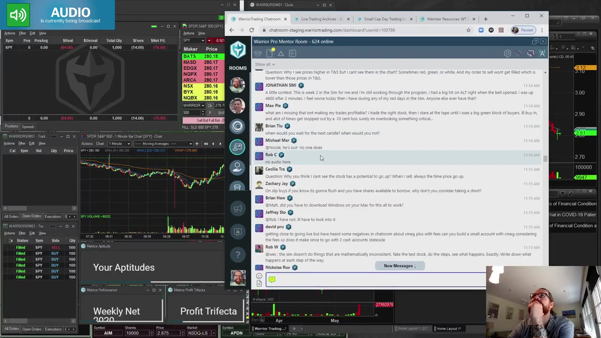

**图怎么看：**

- 中央是 Warrior Trading 聊天室，左侧和背景是模拟账户的持仓、执行记录、报价窗口和图表，右下角是讲师画面。
- 可清楚辨认的主图是 SPY 一分钟图，不是 TSLA；画面还显示 SPY 1,000 股模拟持仓及已实现/净盈亏字段。
- 左下 Executions 表里的红绿文字是平台对 SELL 和 BUY 成交的方向着色；图表 K 线颜色则是涨跌规则，两者不能混为买卖意愿强弱。
- 这张静态图只能说明课程同时演示聊天室、模拟执行和盘中图表，无法单独证明隐藏卖单或当时的真实流动性。

### 关键内容

- 讲师提到在小盘股课程中可以找到隐藏卖家的例子。
- 隐藏卖家通常出现在股票下跌时，但最终未能停止下跌。
- 使用热键进行交易时，需要谨慎设置止损点。
- 在模拟交易中，可以设置费用和佣金。
- 浮动作价与成交量无关，而是指可交易的股票数量。
- 使用热键进行交易时，需要考虑市场波动性。
- 在模拟交易中，可以设置热键来自动执行买卖操作。
- 使用热键进行交易时，需要考虑市场执行速度。
- 使用热键进行交易时，需要考虑市场数据延迟问题

### 分析与执行顺序

1. 讲师首先回答了关于如何识别隐藏卖家的问题。
2. 然后介绍了在模拟交易中设置费用和佣金的方法。
3. 接着讲解了如何使用热键进行交易，并强调了设置止损点的重要性。
4. 最后，讲师提到了使用热键进行交易时需要注意的几个关键点。
5. 讲师还强调了在模拟交易中进行实际交易模拟的重要性。
6. 讲师提醒学员注意市场数据延迟问题，以及如何应对。
7. 讲师还提到了使用热键进行交易时需要考虑的市场波动性问题

### 案例与细节

- 讲师提到在模拟交易中，CODX在下午有不错的走势，可以进行交易。
- 在模拟交易中，可以设置热键来自动执行买卖操作，如控制B键设置止损。
- 在模拟交易中，可以设置每笔交易的费用和佣金。
- 讲师提到在模拟交易中，可以设置热键来自动执行买卖操作，如控制B键设置止损。
- 在模拟交易中，可以设置每笔交易的费用和佣金，包括ECN费用。

### 风险与边界

- 使用热键进行交易时，需要考虑市场数据延迟问题，这可能导致交易失败。
- 使用热键进行交易时，需要考虑市场波动性，这可能导致交易失误。
- 使用热键进行交易时，需要考虑市场执行速度，这可能导致交易失败。

### 复盘问题

- 如何识别隐藏卖家？
- 使用热键进行交易时，如何设置止损点？
- 在模拟交易中，如何设置费用和佣金？
- 使用热键进行交易时，需要注意哪些风险？

---

## v0775：IRA 账户交易策略与风险管理

> 日期：2020-05-29　·　时长：00:40:03

**本场重点：** 讨论 IRA 账户交易策略及风险管理，强调非杠杆交易的重要性。

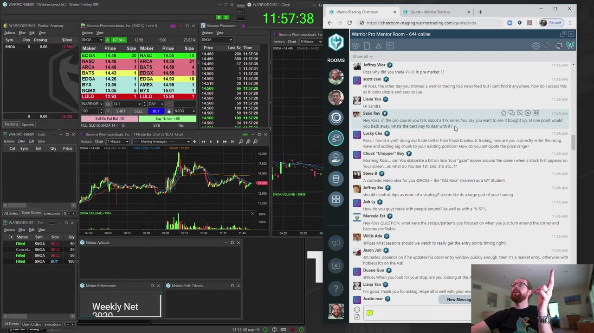

**图怎么看：**

- 在图中可以看到ARCA Biopharma Inc. (NASDAQ: ABIO) 的股票价格走势，显示了其股价的波动情况。
- 水平线表示了支撑位和阻力位，帮助投资者判断买卖时机。
- 成交量柱的高度反映对应周期内的总成交量；红绿着色通常跟随价格柱的涨跌规则，不能直接拆成两种方向的主动成交。
- 图表下方的时间和销售窗口显示了实时交易数据，有助于投资者了解当前市场的动态。

### 关键内容

- IRA 账户不允许使用杠杆交易，因为这会超出贡献限额。
- 交易者需要监控市场波动，及时止损。
- 交易者使用热键快速下单，提高交易效率。
- 交易者通过分析 VWAP 和时间序列数据来识别交易信号。
- 交易者在模拟器中进行大量交易以积累经验。
- 交易者使用 LightSpeed 账户进行大额交易，确保资金安全。
- 交易者通过监控 VWAP 和时间序列数据来识别交易机会。
- 交易者使用热键快速下单，提高交易效率，如在SNOA上使用热键进行交易。
- 交易者通过分析VWAP和时间序列数据来识别交易信号，例如PHIO的首次回调。
- 交易者在模拟器中进行大量交易以积累经验，通常每天进行34次交易，17次往返。
- 交易者使用LightSpeed账户进行大额交易，确保资金安全，最低交易额为40至50,000美元。
- 交易者监控VWAP和时间序列数据来识别交易机会，例如在SNOA上的快速回调。
- 交易者在模拟器中进行大量交易以积累经验，通常每天进行34次交易，17次往返，有助于提高交易技能和决策能力。

### 分析与执行顺序

1. 讲师首先介绍了 IRA 账户的交易规则，强调不允许使用杠杆。
2. 然后讲解了如何识别交易信号，包括 VWAP 和时间序列数据。
3. 接着分享了如何使用热键快速下单，提高交易效率。
4. 最后强调了监控市场波动和及时止损的重要性。
5. 讲师还提到了使用 LightSpeed 账户进行大额交易的好处。

### 案例与细节

- 讲师提到昨天 ABIO 股票飙升，但不是由于操纵。
- 讲师解释了如何识别 VWAP 下的交易信号，如 PHIO 的首次回调。
- 讲师展示了如何使用热键快速下单，如在 SNOA 上的交易。
- 讲师提到使用 LightSpeed 账户进行大额交易，确保资金安全。
- 讲师分享了如何通过监控 VWAP 和时间序列数据来识别交易机会。
- 昨天ABIO股票飙升，但不是由于操纵，而是因为市场平均价格的波动性限制不断移动。
- 在SNOA上，交易者通常在低于要价时卖出，以增加流动性，有时甚至击中标问价。
- 使用LightSpeed账户进行大额交易，确保资金安全，最低交易额为40至50,000美元，可以购买10,000股四或五美元的股票。
- 交易者通过监控VWAP和时间序列数据来识别交易机会，例如在SNOA上的快速回调，通常发生在开盘第一根蜡烛突破新高后。

### 风险与边界

- 交易者需要密切关注市场波动，避免因市场变化导致的损失。
- 使用 LightSpeed 账户虽然安全，但可能需要等待一段时间才能使用。
- 交易者需要定期更新交易策略，以适应市场的变化。
- 交易者需要遵守 IRA 账户的交易规则，避免超出贡献限额。
- 交易者需要密切关注市场波动，避免因市场变化导致的损失，特别是在使用LightSpeed账户时，可能需要等待一段时间才能使用。
- 使用LightSpeed账户虽然安全，但可能需要等待一段时间才能使用，因为账户设置和初始资金可能需要时间来完成。

### 复盘问题

- 交易者如何识别 VWAP 下的交易信号？
- 交易者如何使用热键快速下单？
- 交易者如何监控市场波动和及时止损？
- 交易者如何使用 LightSpeed 账户进行大额交易？

---

## v0776：使用 ADD 指标进行高级交易策略

> 日期：2020-07-02　·　时长：00:53:15

**本场重点：** 使用 ADD 指标识别市场趋势和潜在交易机会，但需注意市场环境变化。

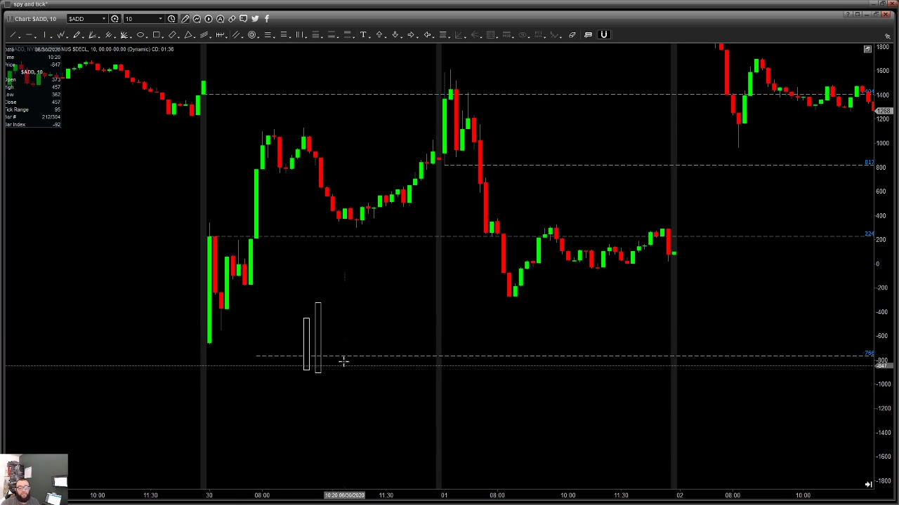

**图怎么看：**

- 画面中，可以看到使用ADD指标分析市场趋势。
- 图表显示了多个股票的K线图，包括SPY、QQQ和$ADD。
- 通过观察K线形态和均线交叉，可以识别出潜在的交易机会。
- 成交量柱的高度反映对应周期内的总成交量；红绿着色通常跟随价格柱的涨跌规则，不能直接拆成两种方向的主动成交。

### 关键内容

- ADD 指标用于计算市场中上涨和下跌股票的数量差，反映市场整体情绪。
- 通过观察 ADD 的初始形态，可以判断市场是否处于强势或弱势。
- ADD 指标在市场波动较大时尤为重要，能帮助识别市场趋势。
- 使用 ADD 指标结合其他技术指标（如蜡烛图）进行综合分析。
- ADD 指标的形态变化反映了市场的流动性变化。
- ADD 指标在市场开盘时尤为关键，能预测全天走势。

### 分析与执行顺序

1. 首先，讲师介绍了 ADD 指标的定义及其作用。
2. 然后，讲师展示了特斯拉的交易情况，包括 ADD 指标的初始形态。
3. 接着，讲师解释了如何通过 ADD 指标的形态变化来判断市场趋势。
4. 随后，讲师通过实例展示了如何结合 ADD 和蜡烛图进行综合分析。
5. 最后，讲师强调了 ADD 指标的使用方法，并回答了观众的问题。

### 案例与细节

- 特斯拉的交易情况显示，市场开盘时 ADD 指标出现大幅波动，表明市场情绪强烈。
- 通过观察 ADD 指标的形态变化，可以判断市场是否处于强势或弱势。
- 在市场波动较大时，ADD 指标的形态变化尤为重要，能帮助识别市场趋势。
- 讲师通过实例展示了如何结合 ADD 和蜡烛图进行综合分析，以识别潜在的交易机会。
- 在市场开盘时，ADD 指标的形态变化尤为关键，能预测全天走势。

### 风险与边界

- 市场环境的变化可能会影响 ADD 指标的准确性。
- 过度依赖 ADD 指标可能导致忽视其他重要市场信号。
- 录制年代限制，当前市场环境与当时可能有所不同。
- ADD 指标的形态变化需要结合市场环境和交易量进行综合判断。

### 复盘问题

- 如何通过观察 ADD 指标的形态变化来判断市场趋势？
- 在市场波动较大时，如何结合 ADD 和蜡烛图进行综合分析？
- 如何根据市场环境和交易量调整 ADD 指标的使用方法？

---

## v0777：构建大型股票观察列表的方法

> 日期：2020-08-06　·　时长：00:49:11

**本场重点：** 构建大型股票观察列表需要关注股票的范围、成交量和技术形态，以确保选出有潜力的股票进行交易。

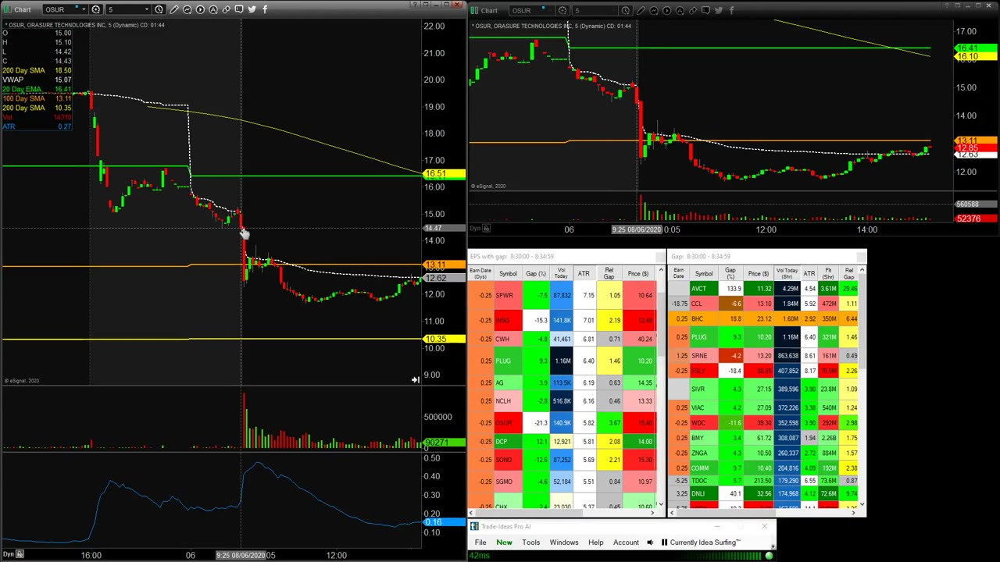

**图怎么看：**

- 在图表中，我们可以看到OSUR的股价在下跌后出现反弹，成交量增加。
- 成交量柱的高度反映对应周期内的总成交量；红绿着色通常跟随价格柱的涨跌规则，不能直接拆成两种方向的主动成交。
- 图表下方的表格列出了多个股票的详细信息，包括日期、符号、涨幅、成交量等。
- 通过分析这些数据，可以判断哪些股票可能具有投资价值。

### 关键内容

- 首先通过EPS扫描器筛选出已发布财报的股票。
- 然后通过缺口扫描器筛选出有缺口的股票。
- 根据ATR值（平均真实波动范围）和成交量来进一步筛选股票。
- 开盘后，根据价格走势调整优先级。
- 构建观察列表是一个多步骤的过程，需要综合考虑多个因素。
- 开盘后，根据价格和技术形态来决定哪些股票将被优先考虑。

### 分析与执行顺序

1. 使用Trade Ideas软件打开EPS扫描器，筛选出已发布财报的股票。
2. 使用Trade Ideas软件打开缺口扫描器，筛选出有缺口的股票。
3. 根据ATR值和成交量进一步筛选股票，排除低ATR值和低成交量的股票。
4. 在开盘前15分钟内，通过价格和技术形态来确定哪些股票将被优先考虑。
5. 开盘后，根据价格走势调整优先级，确保抓住最佳交易机会。
6. 使用相对成交量来确认股票是否在极端交易量下表现良好。

### 案例与细节

- NVO：股价波动小，成交量低，不符合大型股票策略的要求。
- FSLY：股价高，ATR值好，成交量大，符合大型股票策略的要求。
- BLDP：只有2%的缺口，成交量低，不符合大型股票策略的要求。
- SPWR：股价低，成交量不达标，且交易表现不佳，不符合大型股票策略的要求。
- INSG：虽然有良好的ATR值，但图表显示存在拥挤水平，不符合大型股票策略的要求

### 风险与边界

- 构建观察列表的方法依赖于特定的市场环境和交易策略，可能不适用于所有投资者。
- 开盘前的筛选标准比开盘后的更宽松，因为需要更多时间来确认股票的潜力。
- 开盘后，根据价格走势调整优先级，可能会错过最佳交易机会。
- 构建观察列表的方法基于2020年的市场环境和交易策略，可能不适用于当前市场环境。

### 复盘问题

- 开盘前筛选股票时，是如何确定哪些股票将被优先考虑的？
- 开盘后，根据价格走势调整优先级时，有哪些具体的判断标准？
- 构建观察列表的过程中，是如何利用相对成交量来确认股票表现的？

---

## v0778：LightSpeed 新功能介绍

> 日期：2020-09-10　·　时长：00:37:19

**本场重点：** 介绍 LightSpeed 的新功能，帮助用户实现交易的一致性和自动化。

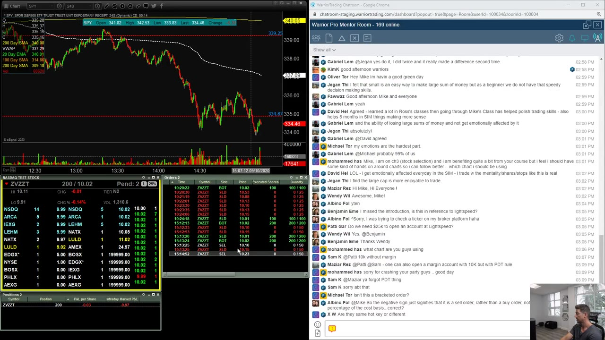

**图怎么看：**

- 画面中，可以看到LightSpeed平台上的实时交易数据。
- 左侧的图表显示了SPY ETF的股价走势，包括200日、20天和100天的移动平均线。
- 右侧聊天室显示了学员们对新功能的讨论，强调了一致性交易的重要性。
- 画面中的订单窗口展示了当前的交易订单，包括买卖方向、价格和数量等详细信息。

### 关键内容

- LightSpeed 开发了新的订单功能，允许用户基于百分比自动下单。
- 该功能适用于长期交易者，帮助他们实现交易的一致性。
- 通过使用百分比，用户可以减少手动计算和猜测，提高交易效率。
- 新功能包括基于购买力的订单设置，帮助用户根据购买力自动调整头寸大小。
- 通过使用这些功能，用户可以减少人为因素的影响，提高交易的一致性。
- 新功能将很快发布，用户可以参考此视频进行设置。
- 该功能适用于多种交易场景，包括股票和小盘股。
- 使用 LightSpeed 的新功能需要一定的技术基础，但操作相对简单。
- 新功能有助于用户专注于交易的核心，而不是繁琐的细节。
- 新功能的使用需要确保交易平台支持，且用户账户满足相关要求。

### 分析与执行顺序

1. 讲师首先介绍了 LightSpeed 的新订单功能，允许用户基于百分比自动下单。
2. 然后，讲师展示了如何设置订单，包括选择百分比和成本基础。
3. 接着，讲师演示了如何将订单设置映射到快捷键上。
4. 最后，讲师通过实际交易场景展示了新功能的应用效果。
5. 在整个过程中，讲师强调了使用新功能的好处，包括减少人为因素的影响和提高交易的一致性。

### 案例与细节

- 在一次交易中，用户使用 LightSpeed 的新功能，以 1% 的百分比卖出股票。
- 用户设置了一个基于购买力的订单，以 50% 的购买力买入股票。
- 通过使用 LightSpeed 的新功能，用户能够在短时间内完成多个订单的下达。
- 在一次测试中，用户使用 LightSpeed 的新功能，成功地以预设的百分比卖出股票。
- 用户通过 LightSpeed 的新功能，实现了交易的一致性，减少了人为因素的影响。

### 风险与边界

- 新功能的使用需要确保交易平台支持，否则可能无法正常使用。
- 用户需要满足账户的相关要求，否则可能无法使用新功能。
- 新功能的使用需要一定的技术基础，对于新手用户可能存在一定的难度。
- 新功能的使用需要一段时间来适应和熟悉，短期内可能无法完全发挥效果。

### 复盘问题

- 新功能的具体设置步骤是什么？
- 使用新功能时需要注意哪些条件？
- 新功能的实际应用效果如何？

---

## v0779：高级交易策略详解

> 日期：2020-10-29　·　时长：00:42:35

**本场重点：** 讲解如何识别股票交易极端情况，以及如何管理风险。

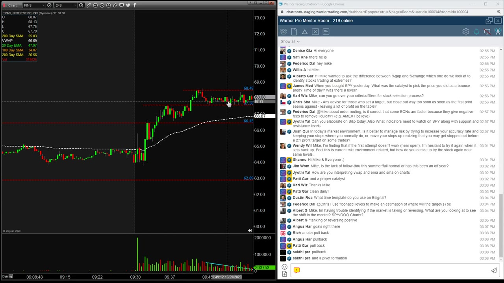

**图怎么看：**

- 在图中可以看到Ostk Overstock Com Inc Del 245的K线图。
- 图中有200日简单移动平均线(SMA)、20日EMA、100日SMA和200日SMA。
- 成交量(Vol.)显示了市场的活跃程度。
- 图中的水平线表示支撑位和阻力位，帮助识别市场趋势和潜在的买卖点。

### 关键内容

- 讲师提到使用百分比变化来识别股票交易极端情况，强调一致性。
- 通过分析成交量和价格走势来判断市场反转。
- 使用技术指标如双底和双顶来识别支撑和阻力。
- 讲师强调在市场不确定时减少风险，避免过早获利了结。
- 使用24秒图表进行快速交易决策，以捕捉市场动向。
- 讲师提到在选举年份市场表现不稳定，存在不确定性。
- 使用VWAP（成交量加权平均价格）进行交易决策，但需谨慎。
- 讲师提到在市场不确定时，减少对大波动股票的参与。
- 讲师强调在市场不确定时，保持耐心，等待明确信号再行动

### 分析与执行顺序

1. 讲师首先解释了如何识别股票交易的极端情况，使用百分比变化和最低成交量参数。
2. 然后，讲师通过分析成交量和价格走势来判断市场是否反转。
3. 接着，讲师展示了如何使用技术指标如双底和双顶来识别支撑和阻力。
4. 讲师进一步解释了如何使用24秒图表进行快速交易决策，以捕捉市场动向。
5. 最后，讲师强调了在市场不确定时减少风险的重要性，避免过早获利了结。
6. 讲师还提到了在选举年份市场表现不稳定，存在不确定性。
7. 讲师建议使用简单的热键进行交易，提高效率。
8. 讲师强调在市场不确定时，减少对大波动股票的参与，保持耐心，等待明确信号再行动

### 案例与细节

- 讲师提到使用百分比变化来识别股票交易极端情况，例如SPY在第三季度GDP数据发布后的表现。
- 通过分析成交量和价格走势来判断市场是否反转，例如在SPY和QQQ上的表现。
- 使用技术指标如双底和双顶来识别支撑和阻力，例如在SPY和QQQ上的表现。
- 使用24秒图表进行快速交易决策，例如在SPY和QQQ上的表现。
- 讲师提到在市场不确定时减少风险的重要性，例如在选举年份市场表现不稳定的情况。
- 使用简单的热键进行交易，例如使用Shift 1买入，Alt 1卖出，Alt X快速平仓

### 风险与边界

- 在市场不确定时，减少对大波动股票的参与可能导致错过潜在机会。
- 使用简单的热键进行交易可能无法应对复杂的市场情况。
- 在选举年份市场表现不稳定，存在不确定性，可能导致交易决策失误。
- 讲师提到的策略是在2020年的市场环境下有效，但在其他市场环境下可能不适用。
- 讲师提到的策略依赖于特定的市场条件，这些条件可能在未来发生变化

### 复盘问题

- 如何识别股票交易的极端情况？
- 如何通过分析成交量和价格走势来判断市场是否反转？
- 如何使用技术指标如双底和双顶来识别支撑和阻力？
- 如何使用24秒图表进行快速交易决策？
- 在市场不确定时，如何减少风险？

---

## v0780：大型股动量扫描器详解

> 日期：2020-11-05　·　时长：00:43:55

**本场重点：** 通过动量扫描器发现未在关注列表中的股票，提高交易机会。

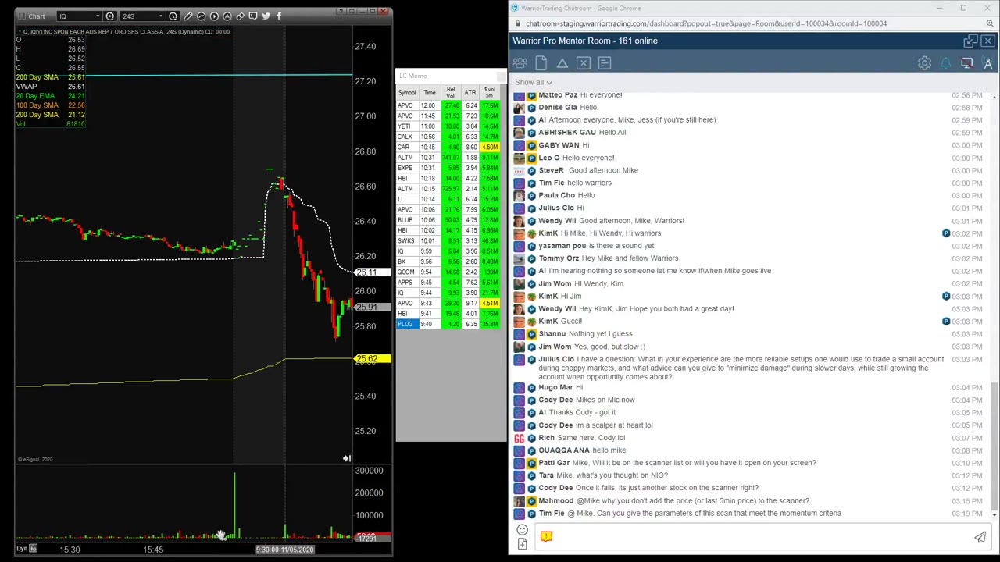

**图怎么看：**

- 图表显示了多个股票的动量指标，如200日简单移动平均线（SMA）和200日指数移动平均线（EMA），帮助识别潜在的交易机会。
- 实时市场数据包括股票代码、价格、成交量等，有助于投资者做出决策。
- 聊天室对话框提供了关于市场趋势和策略的实时讨论，增加了互动性和实用性。
- 通过分析这些数据，投资者可以更好地理解市场动态并制定相应的交易策略。

### 关键内容

- 扫描器用于发现未在关注列表中的股票，特别是那些表现出意外动量的股票。
- 设置参数以确保只有符合条件的股票才会出现在扫描结果中。
- 扫描器有助于识别具有高成交量和潜在大波动的股票。
- 扫描器在开盘后10分钟开始运行，以避免早期市场噪音干扰。
- 通过观察价格走势和成交量来确定是否进行交易。
- 扫描器可以识别出具有高五分钟成交量的股票，表明趋势可能持续。
- 扫描器适用于快速进出交易，但需要谨慎管理风险。
- 扫描器的结果需要结合其他信息（如新闻和财报）进行综合判断。
- 扫描器主要针对大型股，不包括小市值股票。
- 扫描器有助于捕捉市场中的大波动股票，但并非所有股票都会表现良好

### 分析与执行顺序

1. 启动扫描器，设定参数以排除不符合条件的股票。
2. 在开盘后10分钟开始扫描，以避免市场初期的噪音。
3. 观察首次扫描结果，识别出具有高成交量和潜在大波动的股票。
4. 分析价格走势和成交量，确定是否进行交易。
5. 记录每次扫描的结果，以便后续分析和改进策略。
6. 结合其他信息（如新闻和财报）进行综合判断，决定是否进行交易。
7. 根据扫描结果制定交易计划，注意控制风险

### 案例与细节

- 插图显示了插图在9:40出现的第一次扫描结果，插图中的股票表现出强劲的动量。
- 插图中的HBI股票在9:41出现，显示出三角形形态，表明可能继续上涨。
- 插图中的APVO股票在9:43出现，显示出良好的动量和成交量，表明可能继续上涨。
- 插图中的IQ股票在9:44出现，显示出明显的动量和成交量，表明可能继续上涨。
- 插图中的Sava股票在10:30出现，显示出良好的动量和成交量，表明可能继续上涨

### 风险与边界

- 扫描器的结果需要结合其他信息进行综合判断，否则可能会误判。
- 扫描器主要针对大型股，对于小市值股票的效果不佳。
- 扫描器的结果需要谨慎管理风险，避免过度交易。
- 扫描器的参数设置需要定期更新，以适应市场的变化。
- 扫描器的历史数据仅供参考，实际效果可能有所不同

### 复盘问题

- 扫描器如何帮助识别具有高成交量和潜在大波动的股票？
- 如何结合其他信息（如新闻和财报）进行综合判断？
- 扫描器的主要优势是什么？
- 如何根据扫描结果制定交易计划？
- 如何管理风险以避免过度交易？

---

## v0781：宏观设置对日内交易的影响

> 日期：2020-11-12　·　时长：00:53:29

**本场重点：** 理解宏观设置的重要性，识别潜在的大行情，并结合日内图表进行交易。

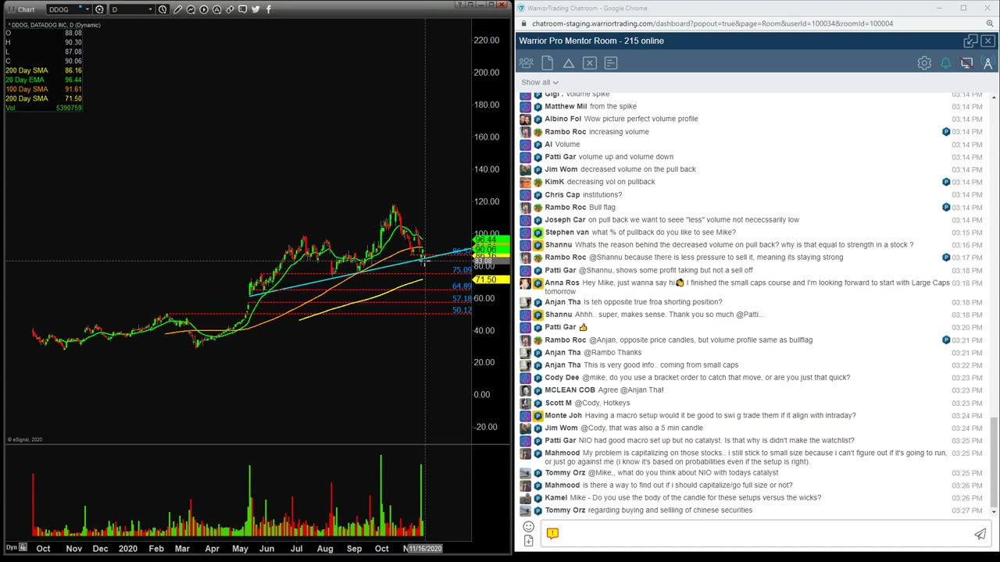

**图怎么看：**

- 在图表中可以看到DOOG股票的价格走势，包括200日简单移动平均线（SMA）、200日指数移动平均线（EMA）以及成交量。
- 成交量柱的高度反映对应周期内的总成交量；红绿着色通常跟随价格柱的涨跌规则，不能直接拆成两种方向的主动成交。
- 通过观察这些图表，可以分析股票的价格趋势和成交量变化，从而做出交易决策。
- 例如，在图表中可以看到价格在某一段时间内出现波动，成交量也相应地发生变化，这可能预示着市场情绪的变化。

### 关键内容

- 宏观设置在日内的重要性，通过XPEV的例子展示。
- 需要关注每日图表，以识别潜在的大行情。
- 时间框架连续性对于识别宏观设置至关重要。
- 宏观设置与日内图表的走势一致时，更有可能出现大行情。
- 催化剂可以触发宏观设置，从而引发大行情。
- 识别宏观设置需要结合技术分析和基本面分析。
- 宏观设置的识别有助于筛选出有潜力的交易标的。
- 宏观设置的识别需要结合多个时间框架的图表。
- 识别宏观设置后，需要结合技术分析进行交易。
- 宏观设置的识别需要结合市场动态和趋势

### 分析与执行顺序

1. 首先，回顾XPEV股票的宏观设置和日内表现。
2. 然后，识别JKS股票的10年趋势线和宏观设置。
3. 接着，分析Uber股票的下降趋势线和宏观设置。
4. 进一步，识别NIO股票的上升趋势线和宏观设置。
5. 最后，讨论Peloton股票的下跌缺口和缺乏宏观设置的情况。
6. 总结，识别宏观设置需要结合多个时间框架的图表。
7. 总结，识别宏观设置需要结合技术分析和市场动态

### 案例与细节

- ticker：XPEV；description：XPEV股票在早上开盘后突破了下降三角形，成交量增加，形成了一个大的上涨行情。
- ticker：JKS；description：JKS股票从28美元涨到90美元，突破了10年的下降趋势线，形成了一个大的上涨行情。
- ticker：UBER；description：UBER股票突破了下降趋势线，形成了一个大的上涨行情。
- ticker：NIO；description：NIO股票从一个上升趋势线突破，形成了一个大的上涨行情。
- ticker：SONO；description：SONO股票接近一个上升趋势线，但没有突破，显示出缺乏宏观设置的情况。

### 风险与边界

- 识别宏观设置需要结合多个时间框架的图表，这增加了分析的复杂性。
- 宏观设置的识别依赖于技术分析，而技术分析可能因市场变化而失效。
- 识别宏观设置需要结合市场动态和趋势，这增加了判断的不确定性。

### 复盘问题

- 如何识别宏观设置并将其应用于日内交易？
- 识别宏观设置时，哪些技术指标是最重要的？
- 如何结合市场动态和趋势来识别宏观设置？

---

## v0782：利用市场大波动日捕捉科技股

> 日期：2020　·　时长：00:43:37

**本场重点：** 在市场大波动日，利用科技股如苹果、特斯拉等进行预测性交易，提高交易成功率。

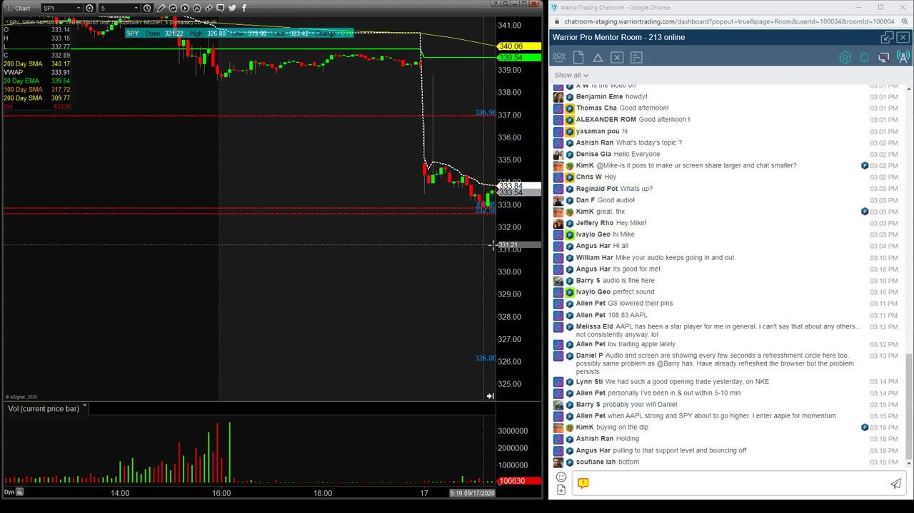

**图怎么看：**

- 图表显示了苹果股票（AAPL）的价格趋势，包括开盘价、最高价、最低价和收盘价。
- 成交量柱的高度反映对应周期内的总成交量；红绿着色通常跟随价格柱的涨跌规则，不能直接拆成两种方向的主动成交。
- 图表中的水平线标记了支撑位和阻力位，帮助分析价格可能的运动方向。
- 通过观察这些图表，可以判断市场情绪和投资者行为，从而做出更明智的交易决策。

### 关键内容

- 市场大波动日（如921）出现大缺口，科技股如苹果、特斯拉表现尤为明显。
- 市场大缺口后，科技股通常会反弹，形成可预测的交易机会。
- 科技股如苹果在市场关键支撑点附近表现稳定，适合低风险交易。
- 市场大波动日，科技股表现更为可预测，适合捕捉大范围的交易机会。
- 当市场出现大缺口时，科技股如苹果的表现尤为显著，因为它们通常与市场同步波动。
- 在市场关键支撑点附近，苹果股价表现出较高的稳定性，这为低风险交易提供了机会。
- 利用100天移动平均线作为支撑点，可以更好地预测科技股的走势，尤其是在市场大波动日。
- 科技股如苹果在市场关键支撑点附近的表现，有助于识别潜在的交易机会，提高交易成功率。
- 在市场大波动日，科技股的表现更为可预测，因此可以利用这些股票进行趋势延续交易，降低风险。
- 观察科技股在关键支撑点附近的走势，可以帮助识别交易机会，尤其是在市场大波动日。

### 分析与执行顺序

1. 识别市场大波动日，关注科技股如苹果的表现。
2. 利用100天移动平均线作为支撑点，进行趋势交易。
3. 观察科技股在关键支撑点附近的走势，寻找交易机会。
4. 利用三角形突破进行趋势延续交易，风险较低。
5. 在市场大波动日，利用科技股如苹果的表现进行预测性交易。

### 案例与细节

- 921日市场大缺口，苹果股价在100天移动平均线附近波动，形成可预测的交易机会。
- 917日市场大缺口，苹果股价在100天移动平均线附近波动，形成可预测的交易机会。
- 914日市场大缺口，苹果股价在100天移动平均线附近波动，形成可预测的交易机会。
- 921日市场大缺口，苹果股价在100天移动平均线附近波动，形成可预测的交易机会。当天市场开盘后，苹果股价测试了100天移动平均线，随后反弹，形成了一个明显的三角形突破，表明趋势延续。
- 917日市场大缺口，苹果股价在100天移动平均线附近波动，形成可预测的交易机会。当天市场开盘后，苹果股价测试了100天移动平均线，随后反弹，形成了一个明显的三角形突破，表明趋势延续。
- 914日市场大缺口，苹果股价在100天移动平均线附近波动，形成可预测的交易机会。当天市场开盘后，苹果股价测试了100天移动平均线，随后反弹，形成了一个明显的三角形突破，表明趋势延续。

### 风险与边界

- 市场大波动日并非每天都有，需耐心等待合适的交易机会。
- 科技股如苹果的表现受市场情绪影响，需谨慎操作。
- 市场大波动日的交易机会仅限于特定时间段，需密切关注市场动态。
- 市场大波动日并非每天都有，需耐心等待合适的交易机会，否则可能错过最佳时机。
- 科技股如苹果的表现受市场情绪影响，需谨慎操作，避免因情绪波动导致的交易失误。

### 复盘问题

- 如何识别市场大波动日，并利用科技股进行预测性交易？
- 在市场大波动日，如何利用100天移动平均线作为支撑点进行趋势交易？
- 如何利用三角形突破进行趋势延续交易，降低风险？

---

## v0783：最佳开盘交易时间框架

> 日期：2020　·　时长：00:55:53

**本场重点：** 讨论如何利用开盘时段进行交易，以及不同时间框架的选择。开盘时段内快速时间框架的重要性。

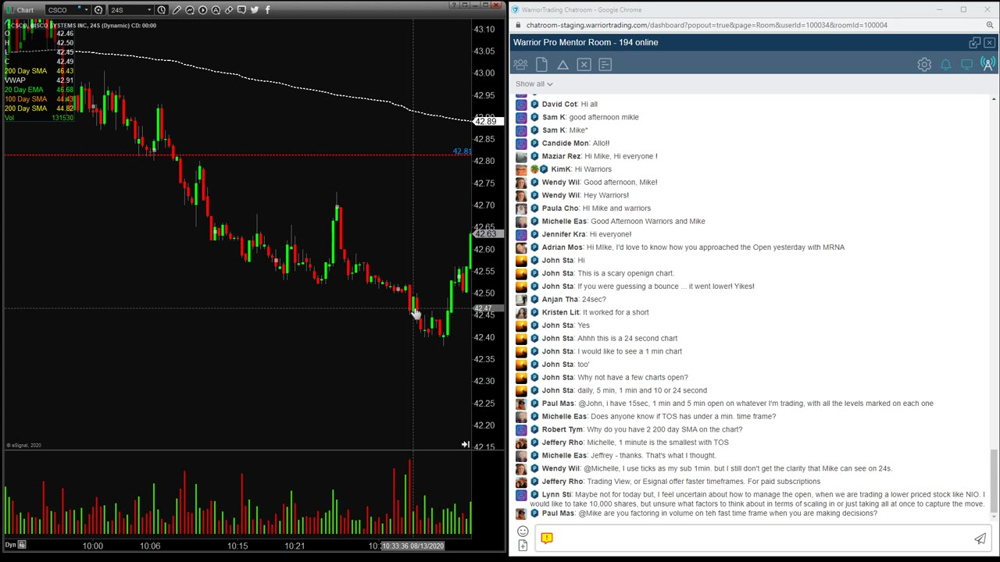

**图怎么看：**

- 这张截图展示了在开盘时段内，不同股票的价格波动情况。
- 可以看到成交量柱的变化，反映了市场参与者对这些股票的关注程度。
- 水平线表示了不同的均线，帮助分析市场的趋势。
- 成交量柱的高度反映对应周期内的总成交量；红绿着色通常跟随价格柱的涨跌规则，不能直接拆成两种方向的主动成交。

### 关键内容

- 开盘时段是市场最活跃的时间，因此非常重要。
- 快速时间框架（如24秒）在开盘时段内提供清晰的价格行动信息。
- 五分钟图表在开盘初期提供不了有价值的信息。
- 开盘后的前10到15分钟开始使用五分钟图表寻找交易机会。
- 快速时间框架有助于捕捉开盘时的精准入场点。
- 开盘后快速调整时间框架以适应市场变化。
- 开盘时段内快速交易可以最大化利润潜力。
- 快速时间框架在开盘时提供更清晰的价格行动信息，有助于预测市场走势。
- 快速时间框架有助于识别开盘时的突破和反转信号。
- 快速时间框架在开盘时提供更短的止损设置，降低风险

### 分析与执行顺序

1. 讲师首先定义了开盘时段，并解释了快速时间框架的重要性。
2. 然后，讲师通过具体例子展示了快速时间框架在开盘时的优势。
3. 接着，讲师讨论了何时切换到五分钟图表寻找交易机会。
4. 最后，讲师强调了快速时间框架在开盘时的使用方法及其重要性。
5. 在整个过程中，讲师通过具体的图表和实例来说明观点。
6. 讲师还强调了快速时间框架在开盘时提供更清晰的价格行动信息的重要性。
7. 讲师通过具体案例展示了快速时间框架在捕捉开盘时的精准入场点方面的优势

### 案例与细节

- CSCO股票在开盘时出现了一个三角形模式，快速时间框架帮助识别了突破点。
- 在开盘后的第一分钟内，CSCO股票出现了一次明显的下跌，快速时间框架帮助识别了这一趋势。
- 在开盘后的第五分钟，CSCO股票出现了一次反弹，快速时间框架帮助识别了这一趋势。
- 在开盘后的第十分钟，CSCO股票出现了一次突破，快速时间框架帮助识别了这一趋势。
- 在开盘后的第十五分钟，CSCO股票出现了一次回调，快速时间框架帮助识别了这一趋势

### 风险与边界

- 快速时间框架在开盘时提供更清晰的价格行动信息，但在其他时间段可能不如五分钟图表有效。
- 开盘后的前10到15分钟是使用五分钟图表的最佳时机，之后可能不再适用。
- 快速时间框架在开盘时提供更短的止损设置，但需要谨慎管理风险。

### 复盘问题

- 快速时间框架在开盘时提供了哪些优势？
- 如何确定何时切换到五分钟图表寻找交易机会？
- 快速时间框架在开盘时提供了哪些具体优势？
- 快速时间框架在开盘时如何帮助识别突破和反转信号？
- 快速时间框架在开盘时如何帮助识别精准入场点？

---

## v0784：周五问答：Ross 的交易策略与经验分享

> 日期：2020　·　时长：01:12:44

**本场重点：** Ross 分享了如何在交易中控制风险、管理损失，并提供了具体的交易案例。

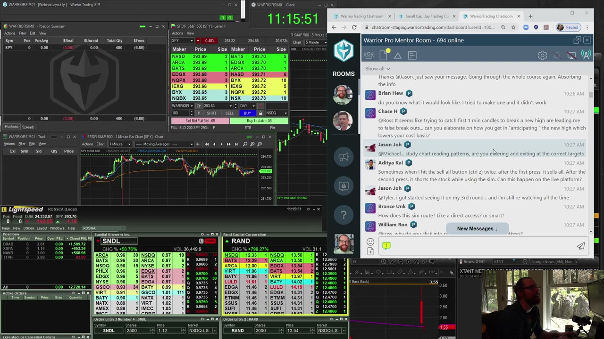

**图怎么看：**

- 实时交易界面展示了多个股票的Level 2信息，包括Maker Price、Size等详细数据。
- 图表显示了不同股票的价格走势，如SPY、NASDAQ、ARCA等。
- 时间与销售数据窗口提供了即时的市场活动情况，如成交量和买卖价差。
- 表格字段显示了股票的详细信息，包括价格、成交量、涨跌幅等关键指标。

### 关键内容

- Ross 在交易前会设定成本基础，并根据市场情况调整。
- Ross 提到使用热键进行快速交易，但需要谨慎操作。
- 他分享了如何通过技术分析来识别潜在的交易机会。
- Ross 强调了在交易中保持耐心和纪律的重要性。
- 他提到使用 Light Speed 平台进行交易的好处和注意事项。
- Ross 分享了如何通过模拟交易来积累经验，但强调实际交易与模拟的不同。
- 他提到了如何通过调整交易规模来管理风险。

### 分析与执行顺序

1. Ross 首先回顾了昨天的交易情况，包括 XTNT 的交易过程。
2. 他解释了如何在交易中设定成本基础，并根据市场情况调整。
3. Ross 分享了如何通过技术分析来识别潜在的交易机会。
4. 他强调了在交易中保持冷静的重要性，尤其是在面临大亏损时。
5. Ross 提到了如何通过模拟交易来积累经验，但强调实际交易与模拟的不同。
6. 他分享了如何通过调整交易规模来管理风险。
7. Ross 还提到了如何通过技术分析来识别潜在的交易机会。

### 案例与细节

- XTNT 的交易：Ross 在 $2.10 购入，$2.00 设置止损，最终在 $2.34 开盘后立即下跌。
- Ross 使用 Light Speed 平台进行交易，但需要支付额外费用。
- Ross 在交易中使用热键进行快速交易，但需要谨慎操作。
- Ross 在交易中设定成本基础，并根据市场情况调整。
- Ross 在交易中使用技术分析来识别潜在的交易机会，如五分钟突破后的第一分钟回弹。
- Ross 在交易中保持冷静，尤其是在面临大亏损时。

### 风险与边界

- Light Speed 平台需要额外付费，可能会增加交易成本。
- 使用热键进行快速交易需要谨慎，以免出现意外的高成本订单。
- 模拟交易与实际交易存在差异，实际交易中可能遇到更多不可预见的情况。
- 交易过程中需要保持冷静，否则可能导致情绪化决策，增加风险。
- 交易策略需要根据市场情况进行调整，不能一成不变。

### 复盘问题

- Ross 如何在交易中设定成本基础？
- 他在交易中使用哪些技术分析工具来识别潜在的交易机会？
- 他在交易中如何保持冷静，尤其是在面临大亏损时？
- 他提到的 Light Speed 平台有哪些优点和缺点？
- 模拟交易与实际交易有哪些主要区别？

---

## v0785：交易策略：棒球打击 vs 基础打击

> 日期：2020　·　时长：00:55:29

**本场重点：** 讨论了两种交易策略的优缺点，棒球打击侧重大盈利机会，基础打击侧重快速盈利。棒球打击适合经验丰富的投资者。

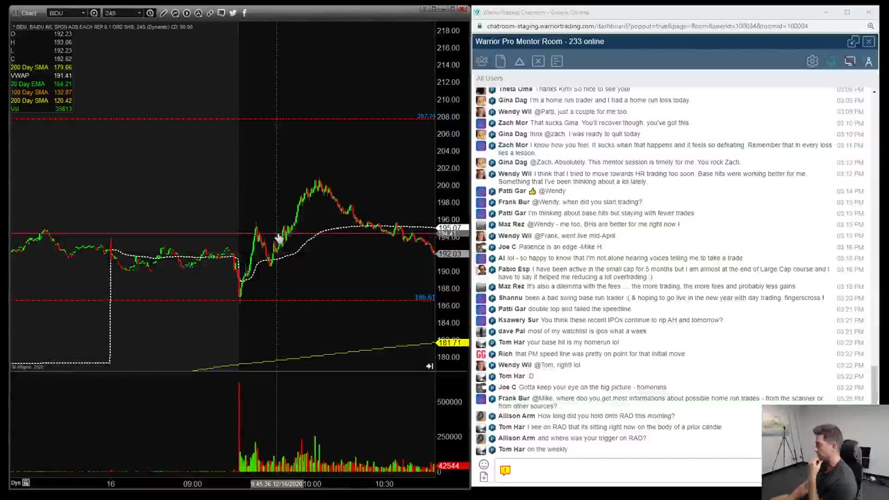

**图怎么看：**

- 在图中可以看到RAD股票的价格走势，显示了开盘价20.85美元，最高点达到21.52美元。
- 图中还显示了20日EMA（快速移动平均线）为16.07美元，100日EMA为12.69美元，200日EMA为13.51美元。
- 成交量柱的高度反映对应周期内的总成交量；红绿着色通常跟随价格柱的涨跌规则，不能直接拆成两种方向的主动成交。
- 图中的水平线标记了重要的支撑位和阻力位，帮助分析市场趋势。

### 关键内容

- 讲师介绍了棒球打击和基础打击两种交易策略的区别。
- 棒球打击追求大盈利，基础打击追求快速盈利。
- 棒球打击适合经验丰富的投资者，基础打击适合新手。
- 市场表现会影响哪种策略更有效。
- 棒球打击需要耐心等待大机会，基础打击则需要快速行动。
- 讲师提到自己从基础打击转向棒球打击的经历。
- 棒球打击和基础打击各有优缺点，需要根据市场情况选择。
- 棒球打击适合大波动市场，基础打击适合小波动市场。

### 分析与执行顺序

1. 讲师首先介绍了棒球打击和基础打击两种交易策略的基本概念。
2. 然后讲解了两种策略的优缺点。
3. 接着分享了自己从基础打击转向棒球打击的经验。
4. 最后总结了选择交易策略时需要考虑的因素。
5. 讲师强调了交易策略的选择需要根据个人经验和市场情况来定

### 案例与细节

- 讲师提到自己在市场波动较大时选择了棒球打击策略，结果亏损了。
- 在市场波动较小时，基础打击策略表现较好。
- 讲师分享了一个棒球打击策略的例子，通过大波动赚取了大量利润。
- 基础打击策略的一个例子是快速捕捉市场波动，但收益较小。
- 讲师提到了一个棒球打击策略失败的例子，因为市场没有按照预期发展

### 风险与边界

- 棒球打击策略需要耐心等待大机会，不适合急于求成的投资者。
- 基础打击策略需要快速行动，不适合反应迟缓的投资者。
- 市场波动性会影响哪种策略更有效，需要实时监控市场。
- 讲师提到自己在市场波动较大时选择了棒球打击策略，结果亏损了，这说明市场波动性对策略选择的影响。
- 讲师强调了交易策略的选择需要根据个人经验和市场情况来定，这说明策略选择的风险

### 复盘问题

- 棒球打击策略和基础打击策略分别适用于什么类型的市场？
- 讲师提到自己从基础打击转向棒球打击的经历，这说明了什么？
- 选择交易策略时需要考虑哪些因素？

---

## v0786：迈克的摆动交易方法

> 日期：2020　·　时长：00:51:47

**本场重点：** 迈克分享了不同于传统摆动交易的方法，强调快速进出核心持仓，结合日内交易策略。

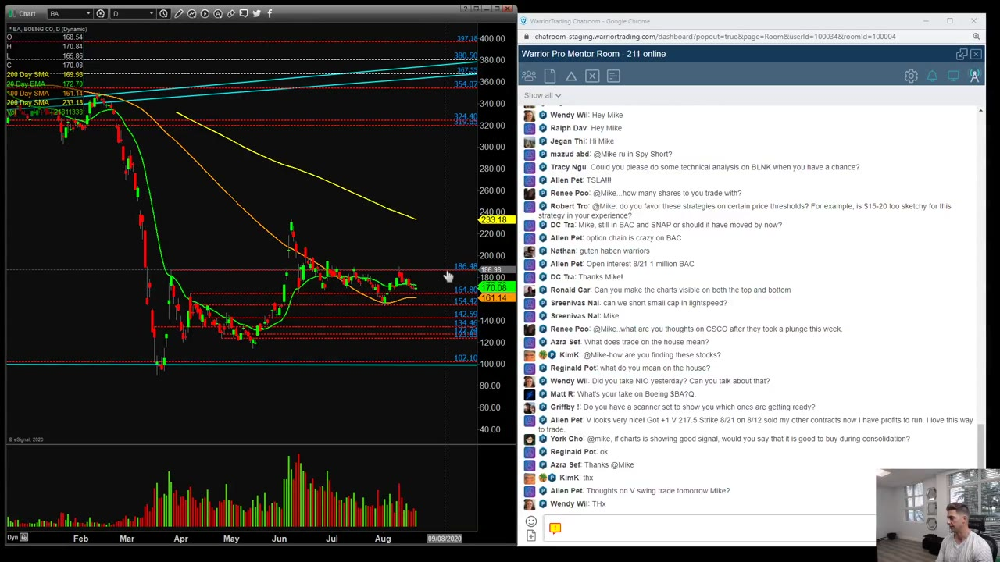

**图怎么看：**

- 左侧主图显示价格大幅下跌后低位修复，图上叠加多条水平价位、均线和斜向参考线；右侧保留课程聊天窗口。
- 急跌后的反弹没有立刻收复全部上方均线，多个前高和水平线构成潜在阻力，这种结构适合讨论核心仓位的减持与重新进入。
- 它对应迈克不同于传统长持的摆动方法：围绕核心想法快速调整仓位，并把日内执行用于改善风险，而不是被动等待数日。
- 聊天意见和单张图都不能确定持仓周期；隔夜跳空、流动性和新闻风险仍需独立纳入摆动交易计划。

### 关键内容

- 迈克的摆动交易方法更活跃，不是传统的持有几天到几周。
- 他利用日内交易的心态来摆动交易，但时间跨度更大。
- 他主要关注高飞股票，如Visa、Facebook等。
- 他使用止损来控制风险，止损设置在摆动交易利润上。
- 他保持核心持仓不超过25,000美元，以减少风险。
- 他通过Excel跟踪交易盈亏，确保准确记录。
- 他利用指数期货作为对冲工具，保护核心持仓。
- 他根据市场情况调整交易策略，有时一天不做新交易。
- 他强调摆动交易需要耐心，但也需要灵活调整。
- 他使用技术分析来识别股票的潜在趋势

### 分析与执行顺序

1. 迈克首先解释了他的摆动交易方法，不同于传统的摆动交易。
2. 他指出自己更频繁地进出核心持仓，而不是传统的摆动交易。
3. 他分享了几个具体的交易案例，包括NKLA、Facebook等。
4. 他解释了如何利用技术分析来识别股票的潜在趋势。
5. 他强调了使用止损来控制风险的重要性。
6. 他展示了如何利用日内交易的心态来进行摆动交易。
7. 他提到使用Excel来跟踪交易盈亏，确保准确记录

### 案例与细节

- ticker：NKLA；price：4150；volume：低；pattern：突破20均线；action：买入并设置止损
- ticker：FB；price：260；volume：低；pattern：突破265；action：买入并设置目标
- ticker：SNAP；price：1410；volume：下降；pattern：突破20均线；action：买入并设置止损
- ticker：V；price：202；volume：高；pattern：突破20均线；action：买入并设置目标
- ticker：MRVL；price：18650；volume：低；pattern：突破20均线；action：观望

### 风险与边界

- 摆动交易依赖市场波动，市场平静时可能无交易。
- 止损设置在摆动交易利润上，可能导致亏损。
- 使用日内交易心态可能导致过度交易。
- 市场变化可能导致交易策略失效。
- 使用指数期货对冲可能影响核心持仓表现

### 复盘问题

- 迈克的摆动交易方法如何区别于传统的摆动交易？
- 他如何使用技术分析来识别股票的潜在趋势？
- 他如何使用止损来控制风险？
- 他如何利用日内交易的心态来进行摆动交易？
- 他如何使用Excel来跟踪交易盈亏？

---

## v0787：使用价格支撑阻力点进行日内交易

> 日期：2020　·　时长：00:54:03

**本场重点：** 通过识别价格支撑阻力点来预测股票价格走势，提高交易成功率。

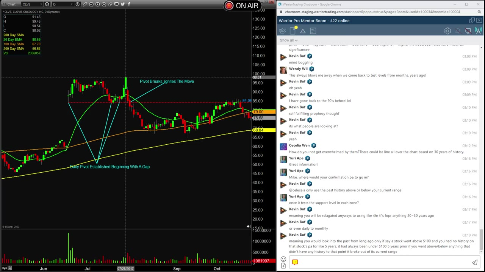

**图怎么看：**

- 画面中，可以看到一个股票的价格走势图，其中包含了重要的支撑和阻力水平。
- 图中的绿色和红色蜡烛表示了价格的涨跌情况，而黄色线条则代表了支撑和阻力水平。
- 通过分析这些支撑和阻力水平，投资者可以更好地理解股票的价格走势，并做出更明智的交易决策。
- 此外，图B还显示了成交量的变化，这有助于判断市场的活跃程度和趋势。

### 关键内容

- 价格支撑阻力点是基于历史价格波动形成的，具有较强的预测性。
- 使用极端价格水平作为支撑阻力点，可以提高交易的准确性和可靠性。
- 价格支撑阻力点的形成需要长时间的价格波动数据支持。
- 价格支撑阻力点可以用来设置止损和止盈，降低交易风险。
- 价格支撑阻力点的应用不仅限于一种交易策略，适用于多种情况。
- 价格支撑阻力点的识别需要结合成交量和价格走势。
- 价格支撑阻力点的形成需要考虑市场情绪和交易者的反应。
- 价格支撑阻力点的使用需要结合技术分析工具，如VWAP。
- 价格支撑阻力点的识别需要结合市场数据和图表分析。
- 价格支撑阻力点的使用需要结合市场波动和交易量的变化

### 分析与执行顺序

1. 首先，识别股票的历史高点和低点，作为初步的价格支撑阻力点。
2. 然后，通过成交量和价格走势确认这些点的可靠性。
3. 接着，利用这些点设置交易策略，包括止损和止盈。
4. 最后，结合市场数据和技术分析工具，持续监控价格支撑阻力点的变化。
5. 在交易过程中，密切关注价格支撑阻力点的变化，及时调整交易策略。
6. 在交易前，先在模拟账户中测试交易策略的有效性。
7. 在交易后，总结交易经验，优化交易策略

### 案例与细节

- 在SPR短卖交易中，使用日线图上的价格支撑阻力点进行交易，成功捕捉到价格大幅波动。
- 在RAD交易中，使用快速时间框架上的价格支撑阻力点进行日内交易，成功捕捉到价格波动。
- 在EXSO交易中，使用价格支撑阻力点进行日内交易，成功捕捉到价格波动。
- 在GE交易中，使用价格支撑阻力点进行长期交易，成功捕捉到价格大幅波动。
- 在CSX交易中，使用价格支撑阻力点进行长期交易，成功捕捉到价格大幅波动

### 风险与边界

- 价格支撑阻力点的识别需要依赖历史数据，无法完全预测未来价格走势。
- 价格支撑阻力点的使用需要结合市场情绪和交易者的反应，存在不确定性。
- 价格支撑阻力点的识别需要结合市场数据和技术分析工具，存在数据误差。
- 价格支撑阻力点的使用需要结合市场波动和交易量的变化，存在市场波动风险。
- 价格支撑阻力点的识别和使用需要结合市场数据和图表分析，存在数据更新延迟的风险

### 复盘问题

- 如何识别价格支撑阻力点？
- 如何结合成交量和价格走势确认价格支撑阻力点的可靠性？
- 如何使用价格支撑阻力点设置止损和止盈？
- 如何结合市场数据和技术分析工具优化交易策略？
- 如何在交易过程中持续监控价格支撑阻力点的变化？

---

## v0788：交易开盘的重要性

> 日期：2020　·　时长：00:42:13

**本场重点：** 理解开盘交易的重要性，掌握精准入场点，减少风险。

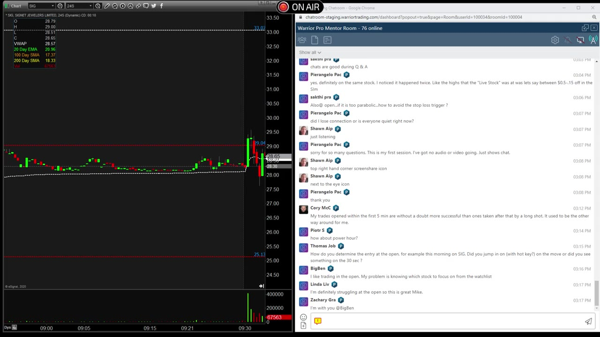

**图怎么看：**

- 在图表中可以看到Skintet Jewelers Limited的股价走势，显示了开盘后的波动情况。
- 成交量柱的高度反映对应周期内的总成交量；红绿着色通常跟随价格柱的涨跌规则，不能直接拆成两种方向的主动成交。
- 均线（20日EMA、100日SMA、200日SMA）提供了趋势分析，帮助识别潜在的趋势方向。
- 通过观察开盘后的价格波动和成交量变化，可以更好地理解市场情绪和潜在的交易机会。

### 关键内容

- 开盘时成交量大，新闻影响显著，是交易者最活跃的时间段。
- 开盘后，随着交易时间推移，成交量和波动性逐渐下降。
- 识别精准入场点的关键在于找到价格形成模式，如更高低点或更低高点。
- 使用24秒图表可以更准确地预测股票走势。
- 开盘时的快速图表分析有助于识别趋势反转点。
- 识别精准入场点可以减少风险，提高交易成功率。
- 开盘时成交量大，新闻影响显著，是交易者最活跃的时间段，因为大多数活跃交易者都在此时管理其头寸。
- 识别精准入场点的关键在于找到价格形成模式，如更高低点或更低高点，这有助于减少风险并提高交易成功率。
- 使用24秒图表可以更准确地预测股票走势，因为它能捕捉到快速的价格变动和市场情绪。
- 开盘后，随着交易时间推移，成交量和波动性逐渐下降，因此识别精准入场点变得更为重要。
- 识别更高的低点或更低的高点作为潜在的入场点，这需要对市场结构有深入的理解，包括新闻、技术指标和市场参与者的反应。

### 分析与执行顺序

1. 在开盘时，关注24秒图表，寻找价格形成模式。
2. 识别更高的低点或更低的高点作为潜在的入场点。
3. 等待价格回调到更高的低点或更低的高点。
4. 在突破关键阻力位或支撑位时进行交易。
5. 设置止损，通常位于关键阻力位或支撑位之外。

### 案例与细节

- ticker：SIG；price_action：开盘后出现快速上涨，随后回调，形成更高的低点。；entry_point：在更高的低点处入场。；stop_loss：设置在关键阻力位5645附近。
- ticker：XPO；price_action：开盘后出现大幅下跌，随后尝试反弹。；entry_point：在更低的高点处入场。；stop_loss：设置在关键支撑位9370附近。
- ticker：MS；price_action：开盘后出现快速上涨，随后回调，形成更高的低点。；entry_point：在更高的低点处入场。；stop_loss：设置在关键阻力位5645附近。
- ticker：SIG；price_action：开盘后出现快速上涨，随后回调，形成更高的低点；entry_point：在更高的低点处入场；stop_loss：设置在关键阻力位5645附近。
- ticker：XPO；price_action：开盘后出现大幅下跌，随后尝试反弹；entry_point：在更低的高点处入场；stop_loss：设置在关键支撑位9370附近。

### 风险与边界

- 开盘时的快速图表分析依赖于实时数据，数据延迟可能导致错误判断。
- 依赖单一图表（如24秒）可能忽略其他重要信息，导致决策失误。
- 录制年代限制，当前市场环境可能与过去有所不同，需灵活调整策略。
- 依赖单一图表（如24秒）可能忽略其他重要信息，导致决策失误，尤其是在市场结构复杂或多变的情况下。
- 录制年代限制，当前市场环境可能与过去有所不同，需灵活调整策略，例如关注更多时间框架的数据和市场动态。

### 复盘问题

- 如何识别开盘时的价格形成模式？
- 在开盘时，如何设置止损以减少风险？
- 哪些因素会影响开盘时的交易量和波动性？

---

## v0789：构建个人交易策略

> 日期：2020　·　时长：00:45:34

**本场重点：** 明确个人交易策略，提高交易效率；通过实例了解如何确定最佳交易策略。

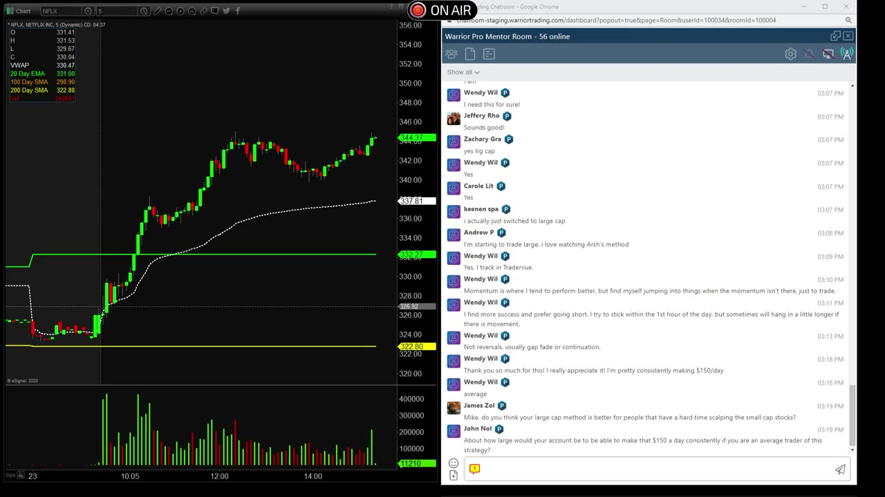

**图怎么看：**

- Wendy Wi提到她正在使用Tradervue跟踪她的交易。
- 她表示自己更喜欢短线交易，并且倾向于在一天的前一个小时进行交易。
- 她感谢Mike的建议，称自己每天都能赚取$150。
- 她询问是否应该在达到每日目标后停止交易，因为这对她来说很难实现。

### 关键内容

- 讲师强调明确个人交易策略的重要性，以提高交易效率。
- 通过实例，讲师帮助参与者确定他们的最佳交易策略。
- 讲师建议设定每周目标，以保持交易纪律。
- 明确交易策略后，参与者应将其贴在显眼位置，以提醒自己。
- 讲师指出，交易策略应集中在单一方法上，以提高一致性。
- 通过实例，讲师展示了如何根据市场表现调整交易策略。
- 讲师强调了使用SIM进行实验的重要性，以更好地理解交易策略。
- 讲师建议使用较小的头寸进行首次实际交易，以克服恐惧。
- 讲师解释了如何通过设定百分比止损来管理交易风险。
- 讲师指出，交易策略应基于个人舒适度，而非盲目跟随他人。
- 讲师强调了持续改进交易策略的重要性，以适应市场变化

### 分析与执行顺序

1. 讲师首先询问参与者是否跟踪交易统计数据，以了解他们的表现。
2. 通过提问，讲师引导参与者确定他们最擅长的交易类型（如短卖、延续等）。
3. 讲师进一步询问参与者在一天中的哪个时间段进行交易，以及他们更倾向于哪种交易类型。
4. 根据参与者的回答，讲师帮助他们确定具体的交易策略，如缺口延续。
5. 讲师建议参与者设定每周目标，并将其记录下来，以保持交易纪律。
6. 最后，讲师鼓励参与者将确定的交易策略贴在显眼位置，以提醒自己。
7. 在整个过程中，讲师不断强调交易策略应基于个人舒适度和市场表现

### 案例与细节

- Wendy提到她正在交易大型股票，但不确定她的最佳交易策略。
- Zachary表示他刚进入市场四个月，不确定他的最佳交易策略。
- 讲师建议Wendy设定每周500美元的目标，以保持交易纪律。
- 讲师建议Zachary设定每周500美元的目标，以保持交易纪律。
- 讲师通过实例说明了如何根据市场表现调整交易策略，如在市场表现良好时增加头寸

### 风险与边界

- 录制年代限制，策略可能需要根据当前市场情况进行调整。
- 交易策略的成功依赖于个人舒适度和市场表现，这可能因人而异。
- 设定固定目标可能会限制交易灵活性，需要适时调整。
- 使用SIM进行实验有助于理解交易策略，但实际交易环境可能有所不同。
- 交易策略的成功依赖于个人舒适度，这可能因人而异，需要持续评估

### 复盘问题

- 你如何确定你的最佳交易策略？
- 你如何设定每周目标，并将其记录下来？
- 你如何确保交易策略符合你的舒适度？
- 你如何根据市场表现调整交易策略？
- 你如何克服首次实际交易时的恐惧？

---

## v0790：目标设定在交易中的重要性

> 日期：2020　·　时长：00:37:31

**本场重点：** 目标设定可以帮助避免频繁交易带来的损失，提高交易纪律性和心理状态。

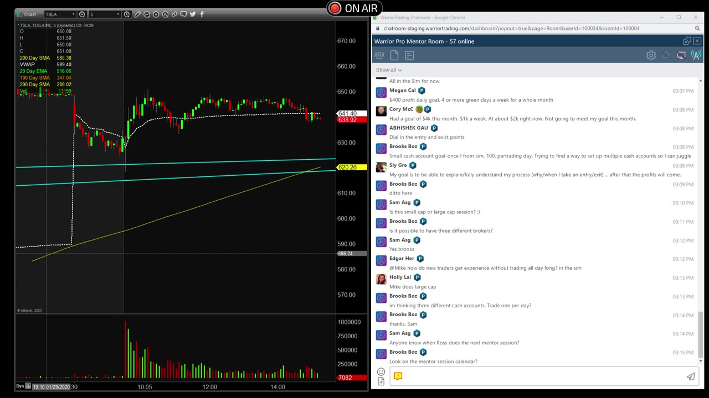

**图怎么看：**

- 在787秒的截图中，特斯拉(TSLA)股票的价格走势图显示了多个重要的技术指标，包括200日简单移动平均线(SMA)、20日简单移动平均线(SMA)、20日指数移动平均线(EMA)、100日简单移动平均线(SMA)和200日简单移动平均线(SMA)，这些指标有助于识别趋势和支撑阻力位。
- 成交量柱的高度反映对应周期内的总成交量；红绿着色通常跟随价格柱的涨跌规则，不能直接拆成两种方向的主动成交。
- 截图中还显示了实时交易数据，包括开盘价(O)、最高价(H)、最低价(L)和收盘价(C)，这些数据对于分析股票价格的波动性和趋势至关重要。
- 此外，截图中还显示了实时聊天室对话，参与者讨论了交易策略、目标设定和风险管理等问题，这些对话为理解交易过程提供了额外的视角。

### 关键内容

- 市场波动性高时，交易机会可能减少，需要通过目标设定来避免频繁交易。
- 每日交易目标可能导致压力，迫使交易者采取次优交易策略，增加亏损风险。
- 每周交易目标更合理，可以减少交易频率，提高交易质量。
- 设定合理的交易目标有助于避免FOMO（恐惧错过）驱动的冲动交易。
- 通过设定目标，可以更好地控制交易情绪，避免报复性交易。
- 市场条件变化时，需要调整交易目标，保持交易策略的灵活性。
- 交易目标应具有现实性，确保交易者能够实现这些目标。
- 交易目标的设定有助于提高交易者的耐心和纪律性。
- 交易目标应具有挑战性，但不至于过于困难，以激发交易者的积极性。
- 交易目标的设定应结合市场条件和个人能力进行调整

### 分析与执行顺序

1. 讲师首先介绍了当前市场的波动性特点，指出市场大幅上涨后，波动性对交易的影响较小。
2. 讲师强调了目标设定的重要性，指出没有目标会导致频繁交易，增加亏损风险。
3. 讲师建议将交易目标设定在每周而非每天，以减少交易压力。
4. 讲师通过实例说明了如何设定合理的交易目标，如每周1000美元的目标。
5. 讲师进一步解释了如何根据市场条件调整交易目标，以适应不同的市场环境。
6. 讲师强调了交易目标应具有现实性和挑战性，以激发交易者的积极性。
7. 讲师最后总结了目标设定对交易者的重要影响，包括提高交易纪律性和心理状态

### 案例与细节

- 讲师提到，如果设定每天200美元的交易目标，可能会被迫进行次优交易，增加亏损风险。
- 讲师举例说明，如果昨天的交易盈利接近7000美元，那么一周的交易目标已经达成，可以更加谨慎地选择交易。
- 讲师指出，如果市场条件发生变化，如夏季市场较慢，交易者应适当降低交易目标，以适应市场变化。
- 讲师分享了一个新交易者的经历，他最初每天交易，但没有明确的交易目标，导致频繁交易和亏损。
- 讲师提到，如果交易者发现自己主要在一个方向上盈利，应该坚持这个方向，而不是同时尝试多个方向，这可能会延迟达到目标的时间

### 风险与边界

- 录制年代限制，此内容适用于2020年的市场情况，可能不适用于当前市场。
- 交易目标的设定需要结合个人能力和市场条件，否则可能难以实现。
- 交易者需要根据市场变化及时调整交易目标，否则可能无法适应市场变化。
- 交易者需要具备一定的交易经验和市场洞察力，才能合理设定交易目标

### 复盘问题

- 设定交易目标时，如何平衡现实性和挑战性？
- 在市场波动较大时，如何通过目标设定来避免频繁交易？
- 如何根据市场条件调整交易目标？
- 交易者在设定目标时，应该考虑哪些因素？
- 如何通过目标设定来提高交易纪律性和心理状态？

---

## v0791：如何利用价格行动和预测性信号进行股票交易

> 日期：2020　·　时长：00:39:29

**本场重点：** 通过分析价格行动和等待确认信号来最大化利润，但需谨慎避免盲目入场。

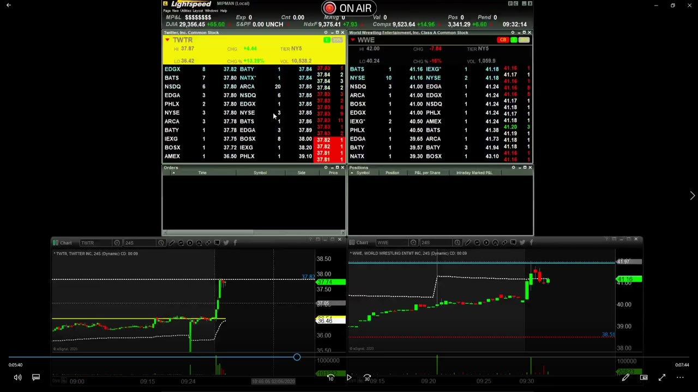

**图怎么看：**

- 在829秒时，图表显示了TWTR和WWE的实时交易数据。
- TWTR的股价在37.50到38.50之间波动，成交量较高。
- WWE的股价在40.00到41.00之间波动，成交量较低。
- 图表下方显示了TWTR的200日简单移动平均线（SMA）和成交量柱状图。

### 关键内容

- 开盘前的不平衡订单显示了市场情绪，Twitter在开盘时有大量买盘。
- 使用24秒图表观察价格行动，等待确认信号进入交易。
- 高预测性信号表明股票可能继续上涨，但需要确认信号。
- 利用bid和offer的差异来判断买卖压力，bid是关键。
- 使用三角形和旗形模式作为确认信号，提高交易成功率。
- 控制风险，设置止损，避免在股票大幅波动时持有过大仓位。
- 利用热键快速下单，提高交易效率。
- 在高预测性信号下进行交易，但需注意市场可能反转的风险。
- 记录自己的交易过程，以便日后回顾和改进策略

### 分析与执行顺序

1. 开盘前查看不平衡订单，确认市场情绪。
2. 开盘后使用24秒图表观察价格行动，寻找确认信号。
3. 等待形成三角形或旗形模式，确认信号出现。
4. 在突破关键水平后，等待确认信号再进行交易。
5. 使用热键快速下单，确保交易速度。
6. 设置止损，控制风险，避免在股票大幅波动时持有过大仓位。
7. 记录交易过程，以便日后回顾和改进策略

### 案例与细节

- 开盘前，Twitter显示出大量的买盘不平衡订单，表明市场情绪积极。
- 开盘后，价格开始上升，但在接近200日移动平均线时出现回调，表明市场存在阻力。
- 当价格突破200日移动平均线后，形成一个三角形模式，等待确认信号。
- 在突破关键水平后，价格开始上升，但随后出现回调，表明市场可能存在反转。
- 使用热键快速下单，成功捕捉到价格上升的时机，获得一定利润

### 风险与边界

- 高预测性信号并不保证股票一定会继续上涨，市场可能反转。
- 在高预测性信号下进行交易时，需要密切关注市场变化。
- 录制年代限制为2020年，当时的市场环境和规则可能已发生变化。
- 在高预测性信号下进行交易时，需要考虑市场可能的突发情况和风险

### 复盘问题

- 在开盘前，如何判断市场的总体情绪？
- 在使用24秒图表时，如何识别确认信号？
- 在突破关键水平后，如何判断是否应该继续持有仓位？
- 在高预测性信号下进行交易时，如何管理风险？
- 如何利用热键快速下单以提高交易效率？

---

## v0792：预市盈率分析与快速交易策略

> 日期：2020　·　时长：00:43:15

**本场重点：** VIAC股票的预市盈率分析显示了如何识别有利时机进行快速交易。

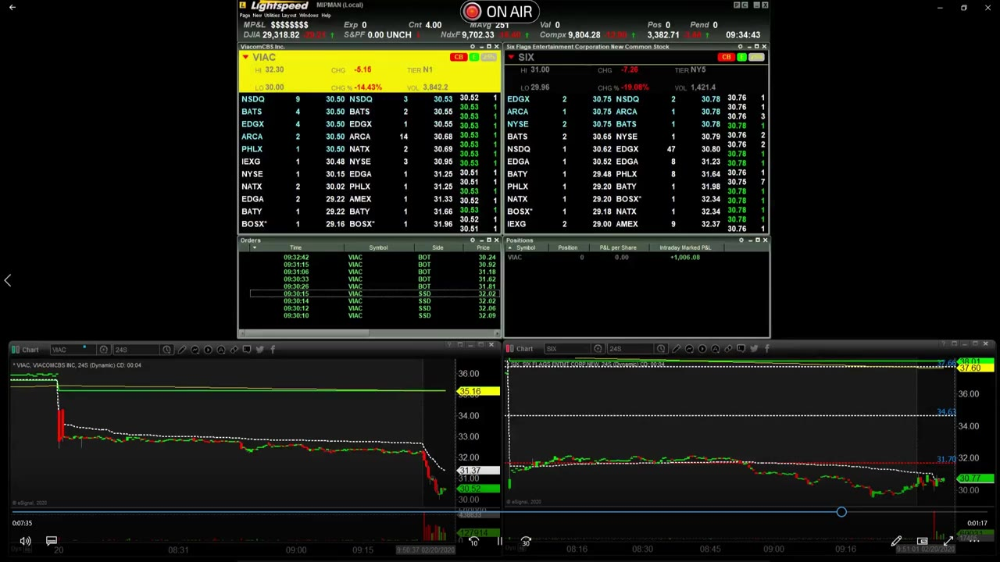

**图怎么看：**

- 在图C中，可以看到VIAC股票的价格走势，显示出一个明显的上升趋势。
- 图表上标注了200日简单移动平均线（SMA）和200日指数移动平均线（EMA），帮助识别支撑和阻力位。
- 成交量柱的高度反映对应周期内的总成交量；红绿着色通常跟随价格柱的涨跌规则，不能直接拆成两种方向的主动成交。
- 通过分析这些图表和技术指标，可以识别出有利的交易机会并采取快速行动。

### 关键内容

- VIAC股票在开盘前出现跳空低开，表明市场情绪不佳。
- 通过查看日线图，发现VIAC股票在最近的低点附近形成了支撑，这为交易提供了基础。
- 预市盈率模式显示VIAC股票有较大的价格波动空间，符合快速交易的条件。
- VIAC股票的支撑位和阻力位清晰，有利于制定交易策略。
- 通过观察订单流，可以判断股票的强弱，从而决定是否进行交易。
- 快速交易的关键在于捕捉市场的瞬间变化，而不是等待完整的形态形成。
- 交易过程中需要关注订单的执行情况，及时调整交易策略。
- 快速交易的风险在于市场可能突然反转，导致亏损。

### 分析与执行顺序

1. 首先，查看VIAC股票的日线图，确定支撑和阻力位。
2. 然后，观察预市盈率模式，确认股票的跳空低开和支撑位。
3. 接着，检查成交量，确保有足够的流动性进行快速交易。
4. 通过订单流分析，判断股票的强弱，决定是否进行交易。
5. 在开盘后，密切关注订单执行情况，及时调整交易策略。
6. 最后，记录交易过程，以便后续分析和改进。
7. 在整个过程中，需要灵活应对市场变化，避免过度依赖单一指标。

### 案例与细节

- VIAC股票在开盘前跳空低开，表明市场情绪不佳。
- 日线图显示VIAC股票在最近的低点附近形成了支撑，这为交易提供了基础。
- VIAC股票的成交量较大，增加了交易的流动性。
- 通过订单流分析，可以判断股票的强弱，从而决定是否进行交易。
- 在开盘后，VIAC股票尝试反弹但失败，随后继续下跌，最终触发了交易策略。

### 风险与边界

- 快速交易策略的风险在于市场可能突然反转，导致亏损。
- 快速交易策略适用于市场波动较大、流动性高的股票。
- 由于录制年代较早，部分交易规则和市场环境可能已发生变化。
- 快速交易策略的成功依赖于对市场动态的准确判断，这存在不确定性。

### 复盘问题

- VIAC股票的预市盈率模式是如何影响交易决策的？
- 在开盘后，如何根据订单流判断股票的强弱？
- 快速交易策略的风险有哪些？如何应对这些风险？

---

## v0793：速度线的应用与理解

> 日期：2020　·　时长：00:35:18

**本场重点：** 理解速度线在市场波动中的应用，掌握其使用方法和注意事项。

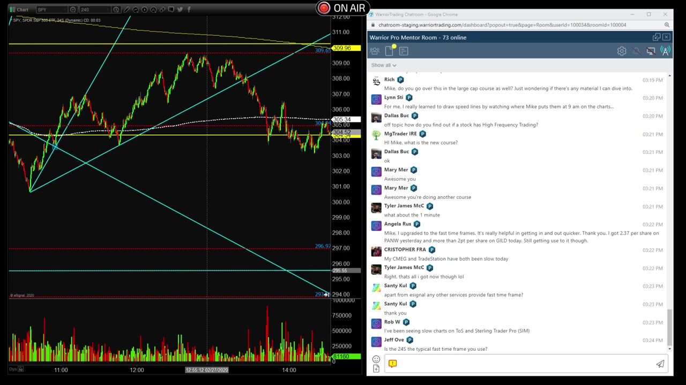

**图怎么看：**

- 在图中，我们可以看到SPY指数的价格走势，包括短期和长期移动平均线（SMA）以及快速移动平均线（EMA）。这些工具帮助投资者识别趋势和支撑阻力位。
- 图中显示了SPY指数在2020年2月27日的开盘价为309.96美元，收盘价为305.34美元。这表明市场在过去一天内经历了上升。
- 成交量柱的高度反映对应周期内的总成交量；红绿着色通常跟随价格柱的涨跌规则，不能直接拆成两种方向的主动成交。
- 通过分析这些图表，投资者可以更好地理解市场动态，并做出更明智的投资决策。

### 关键内容

- 市场波动加剧，速度线成为短期趋势判断工具。
- 速度线用于捕捉方向变化，作为入场和止损参考。
- 速度线适用于快速时间框架，能更好地捕捉市场动作。
- 速度线需要基于极端市场波动来确定关键点。
- 速度线在市场恢复常态后仍有效，但需谨慎使用。
- 速度线在快速时间框架中表现更佳，能更好地验证趋势。
- 速度线需要结合市场实际动作来验证其有效性。
- 速度线在市场波动较大时更为重要，但在稳定市场中也有效。
- 速度线需要结合其他技术指标共同使用，以提高准确性。
- 速度线在市场波动较大时更容易失效，需谨慎使用

### 分析与执行顺序

1. 讲师首先介绍市场波动情况，解释为何需要使用速度线。
2. 讲师解释速度线的基本概念及其用途。
3. 讲师通过实例演示如何在图表上绘制速度线。
4. 讲师强调速度线在快速时间框架中的优势。
5. 讲师指出速度线需要结合市场实际动作来验证其有效性。
6. 讲师举例说明如何利用速度线进行交易决策。
7. 讲师提醒学员注意市场波动对速度线的影响

### 案例与细节

- 使用SPY作为示例，展示如何在图表上绘制速度线。
- 通过UVXY的实例，展示如何在不同时间框架下绘制速度线。
- 使用AMD的实例，展示如何在图表上绘制速度线并进行交易决策。
- 通过SQ的实例，展示如何在图表上绘制速度线并进行交易决策。
- 通过NTNX的实例，展示如何在图表上绘制速度线并进行交易决策

### 风险与边界

- 市场波动较大时，速度线可能失效，需谨慎使用。
- 快速时间框架下的速度线虽然有效，但也可能因市场变化而失效。
- 市场恢复常态后，速度线的有效性会降低，需谨慎使用。
- 市场波动较大时，速度线的表现优于稳定市场，但需注意市场变化。
- 市场波动较大时，速度线的使用效果最佳，但在稳定市场中也有效，需谨慎使用

### 复盘问题

- 如何在快速时间框架中正确绘制速度线？
- 在市场波动较大时，如何利用速度线进行交易决策？
- 在市场恢复常态后，如何继续使用速度线？

---

## v0794：缺口反转交易策略

> 日期：2020　·　时长：00:34:50

**本场重点：** 市场数据异常导致交易困难，缺口反转策略在当前市场环境下具有高预测性。

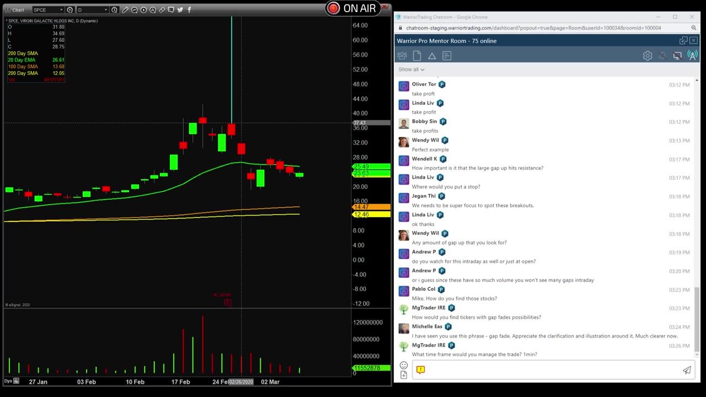

**图怎么看：**

- 图表显示了SPCE股票的价格走势，包括20日EMA、100日SMA和200日SMA等技术指标。
- 成交量柱的高度反映对应周期内的总成交量；红绿着色通常跟随价格柱的涨跌规则，不能直接拆成两种方向的主动成交。
- 价格在黄色水平线附近波动，显示出市场可能正在形成一个支撑或阻力位。
- 图表右侧聊天框中有学员的实时评论，讨论了市场数据异常对交易的影响。

### 关键内容

- 讲师使用E-Signal平台多年，近期出现大规模数据问题，影响交易。
- 缺口反转策略适用于市场强阻力位，且开盘形成更低高点。
- 缺口反转通常在开盘后迅速完成，需要快速反应。
- 特斯拉等股票出现典型缺口反转案例，验证策略有效性。
- 策略依赖于市场快速反应，预判开盘走势。
- 策略成功依赖于市场流动性，预估交易量和价格波动。
- 策略需结合市场数据，判断是否符合交易条件。
- 策略在当前市场环境下具有高预测性，但依赖于数据准确性。
- 策略需结合技术分析，识别关键支撑和阻力位。
- 策略需注意市场数据异常对交易的影响，及时调整策略

### 分析与执行顺序

1. 讲师首先介绍近期市场数据异常，影响交易。
2. 讲解缺口反转策略的基本原理，包括缺口形成和开盘后的反应。
3. 通过特斯拉等股票的具体案例，展示缺口反转策略的操作过程。
4. 强调开盘前的准备和快速反应的重要性，以捕捉市场机会。
5. 结合市场数据，判断是否符合缺口反转策略的交易条件。
6. 根据市场流动性，确定交易规模和止损位置。
7. 总结缺口反转策略的关键要素，包括市场数据、开盘走势和技术分析

### 案例与细节

- ticker：WDC；price_action：WDC股票在1月31日出现大幅上涨，随后开盘后回落，形成典型的缺口反转。；volume：开盘前成交量较大，显示市场流动性充足。；strategy：利用开盘后的快速反应，捕捉市场机会。；outcome：成功捕捉到缺口反转，实现预期收益。
- ticker：AMD；price_action：AMD股票在某日开盘前形成双顶形态，开盘后迅速跌破关键支撑位，形成缺口反转。；volume：开盘前成交量较大，显示市场流动性充足。；strategy：利用开盘后的快速反应，捕捉市场机会。；outcome：成功捕捉到缺口反转，实现预期收益。
- ticker：SPCE；price_action：SPCE股票在2月25日开盘前形成双顶形态，开盘后迅速跌破关键支撑位，形成缺口反转。；volume：开盘前成交量较大，显示市场流动性充足。；strategy：利用开盘后的快速反应，捕捉市场机会。；outcome：成功捕捉到缺口反转，实现预期收益。

### 风险与边界

- 市场数据异常可能导致交易策略失效，需关注数据准确性。
- 开盘后市场流动性不足可能影响交易规模和收益。
- 策略依赖于快速反应，市场波动较大时可能错过最佳时机。
- 策略需结合市场数据，判断是否符合交易条件，否则可能产生亏损。
- 策略在当前市场环境下具有高预测性，但依赖于数据准确性，需定期更新策略

### 复盘问题

- 缺口反转策略的关键要素有哪些？
- 如何判断市场是否适合应用缺口反转策略？
- 在实际操作中，如何控制交易规模和止损位置？

---

## v0795：利用杠杆ETF进行市场波动交易

> 日期：2020　·　时长：00:29:46

**本场重点：** 在市场波动时期，通过交易SPXL和SPXS来捕捉市场波动，但需注意市场不确定性带来的风险。

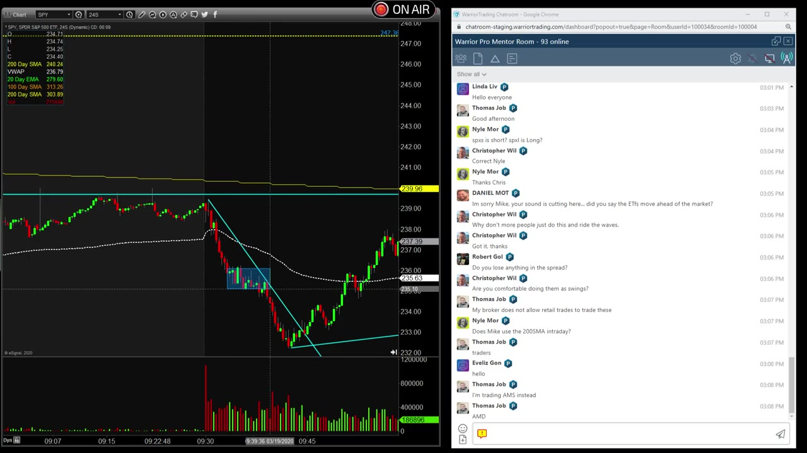

**图怎么看：**

- 图中显示了SPY ETF的价格走势，包括200日简单移动平均线（SMA）和200日指数移动平均线（EMA），帮助识别趋势。
- 成交量柱的高度反映对应周期内的总成交量；红绿着色通常跟随价格柱的涨跌规则，不能直接拆成两种方向的主动成交。
- 实时聊天室对话框显示了参与者对市场波动交易策略的讨论，强调了市场不确定性带来的风险。
- 图表中的水平线和斜线可能代表支撑位和阻力位，用于判断价格突破的方向。

### 关键内容

- 在市场波动时期，使用SPXL和SPXS进行交易可以捕捉市场波动。
- SPXL和SPXS是跟踪S&P 500指数三倍杠杆的ETF。
- SPXL和SPXS分别代表市场上涨和下跌，提供不同的交易机会。
- SPXL和SPXS相比直接交易SPY具有更低的波动性和更高的灵活性。
- SPXL和SPXS的交易需要考虑市场预测和不确定性。
- SPXL和SPXS的交易需要关注市场趋势线和支撑阻力位。
- SPXL和SPXS的交易需要考虑市场波动范围和交易量。
- SPXL和SPXS的交易需要关注VIX和其他波动性指数的表现。
- SPXL和SPXS的交易需要考虑市场大缺口日的特殊交易机会。
- SPXL和SPXS的交易需要考虑市场整体趋势和宏观经济因素。

### 分析与执行顺序

1. 首先，识别市场波动时期，如市场大幅波动或出现大缺口。
2. 其次，使用SPXL和SPXS进行交易，分别代表市场上涨和下跌。
3. 再次，设置止损和目标价，根据市场趋势线和支撑阻力位进行交易。
4. 然后，监控市场波动范围和交易量，确保有足够的流动性。
5. 最后，根据市场整体趋势和宏观经济因素调整交易策略。

### 案例与细节

- 在2020年1月27日的大缺口日，SPXL开盘后迅速反弹，显示了市场反转的可能性。
- SPXL和SPXS的交易需要考虑市场波动范围，如2020年1月27日的市场波动范围较小，但仍有交易机会。
- SPXL和SPXS的交易需要关注市场趋势线，如2020年1月27日的市场趋势线显示了市场反转的可能性。
- SPXL和SPXS的交易需要考虑市场支撑阻力位，如2020年1月27日的支撑位和阻力位显示了市场的波动性。
- SPXL和SPXS的交易需要关注市场整体趋势，如2020年1月27日的市场整体趋势显示了市场反转的可能性。

### 风险与边界

- 市场不确定性可能导致交易失效，特别是在全球危机期间。
- 市场波动范围较小可能限制交易机会，特别是在市场稳定期。
- 交易SPXL和SPXS需要考虑市场波动性和交易量，以避免流动性不足。
- 市场大缺口日的特殊交易机会可能难以把握，特别是在市场剧烈波动时。
- 市场整体趋势和宏观经济因素的变化可能影响交易策略的有效性。

### 复盘问题

- 在市场波动时期，如何选择合适的交易工具？
- 如何在SPXL和SPXS之间做出正确的交易决策？
- 在市场大缺口日，如何利用SPXL和SPXS进行交易？

---

## v0796：确认有效突破的关键因素

> 日期：2020　·　时长：00:41:19

**本场重点：** 确认突破需要关注成交量，成交量不足会导致假突破。

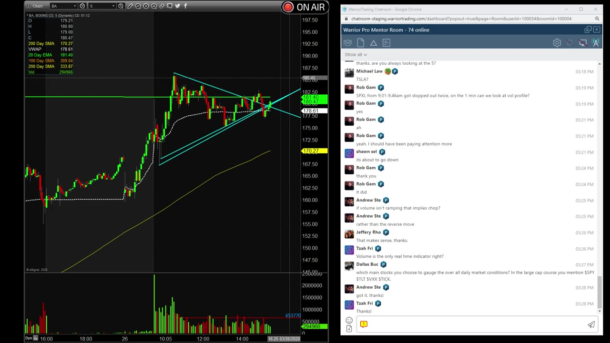

**图怎么看：**

- 在图中，我们可以看到股票BA的价格走势，以及相关的均线和成交量。
- 成交量柱的高度反映对应周期内的总成交量；红绿着色通常跟随价格柱的涨跌规则，不能直接拆成两种方向的主动成交。
- 均线显示了价格的趋势方向，其中黄色线为短期均线，蓝色线为长期均线。
- 成交量的变化可以帮助我们判断市场情绪和趋势的有效性。

### 关键内容

- 突破需要伴随成交量增加，否则是假突破。
- 成交量增加表明突破更有可能成功。
- 持续的成交量表明突破可能继续维持。
- 假突破通常发生在成交量下降时，即使价格上升。
- 真实突破需要成交量显著增加。
- 成交量是判断突破是否有效的关键实时指标。
- 成交量增加表明突破更有可能成功，可以继续持有。
- 成交量下降表明突破可能失败，应考虑退出
- 观察BA股票在下午尝试突破时，成交量下降，导致假突破，说明成交量是判断突破有效性的重要实时指标。
- 当成交量显著增加时，如Netflix股票突破时，成交量显著增加，确认了突破的有效性，表明突破更有可能成功。
- 假突破通常发生在成交量下降时，即使价格上升，如L-Y-F-T股票在突破时，成交量不足，导致假突破，说明成交量下降表明突破可能失败。
- 真实突破需要成交量显著增加，如Roku股票在突破时，成交量显著增加，确认了突破的有效性，表明成交量增加表明突破更有可能成功。
- 成交量是判断突破是否有效的关键实时指标，如SPXL股票在突破时，成交量下降，导致假突破，说明成交量不足可能导致假突破，影响交易决策。

### 分析与执行顺序

1. 观察市场走势，识别潜在突破点。
2. 监控成交量变化，确认突破是否有效。
3. 当成交量下降时，警惕假突破的可能性。
4. 当成交量显著增加时，确认突破的有效性。
5. 根据成交量变化调整交易策略，避免假突破带来的损失

### 案例与细节

- BA股票在下午尝试突破时，成交量下降，导致假突破。
- Roku股票在突破时，成交量显著增加，确认了突破的有效性。
- L-Y-F-T股票在突破时，成交量不足，导致假突破。
- SPXL股票在突破时，成交量下降，导致假突破。
- Netflix股票在突破时，成交量显著增加，确认了突破的有效性
- BA股票在下午尝试突破时，成交量下降，导致假突破，说明成交量下降表明突破可能失败，即使价格上升。
- Roku股票在突破时，成交量显著增加，确认了突破的有效性，表明成交量增加表明突破更有可能成功。
- L-Y-F-T股票在突破时，成交量不足，导致假突破，说明假突破通常发生在成交量下降时，即使价格上升。
- SPXL股票在突破时，成交量下降，导致假突破，说明成交量不足可能导致假突破，影响交易决策。
- Netflix股票在突破时，成交量显著增加，确认了突破的有效性，表明真实突破需要成交量显著增加。

### 风险与边界

- 成交量不足可能导致假突破，影响交易决策。
- 假突破可能导致资金损失，需谨慎操作。
- 成交量变化是判断突破有效性的重要指标，但并非绝对。
- 录制年代限制，当前市场环境可能有所不同
- 成交量下降可能导致假突破，影响交易决策，如BA股票在下午尝试突破时，成交量下降，导致假突破。
- 假突破可能导致资金损失，需谨慎操作，如L-Y-F-T股票在突破时，成交量不足，导致假突破，说明假突破通常发生在成交量下降时，即使价格上升。
- 成交量变化是判断突破有效性的重要指标，但并非绝对，如SPXL股票在突破时，成交量下降，导致假突破，说明录制年代限制，当前市场环境可能有所不同。

### 复盘问题

- 在哪个时间段观察到成交量下降，导致假突破？
- 如何区分真实突破和假突破？
- 在哪些情况下，成交量不足可能导致假突破？

---

## v0797：如何管理股票交易

> 日期：2020　·　时长：00:47:15

**本场重点：** 通过管理快节奏的动量交易和趋势交易来提高交易效率。

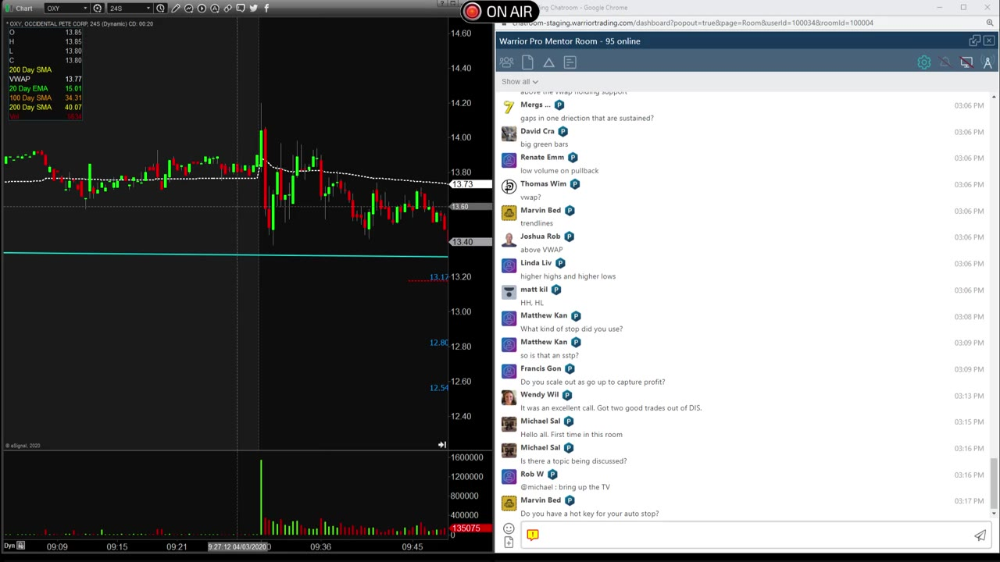

**图怎么看：**

- 在B图中，可以看到实时的股票交易数据，包括价格、成交量和时间序列。
- 图表上显示了多个技术指标，如移动平均线（SMA）、相对强弱指数（RSI）等。
- 用户可以在聊天窗口中进行实时互动，讨论交易策略和市场动态。
- 此截图有助于理解如何通过分析实时数据和市场活动来提高交易效率。

### 关键内容

- 动量交易需要快速进入并及时止损，以保护利润。
- 趋势交易需要逐步建立仓位，并根据价格行动调整止损。
- 动量交易通常在开盘后几分钟内完成，而趋势交易可能持续更长时间。
- 使用价格行动来识别支撑和阻力位，从而决定何时买入和卖出。
- 动量交易和趋势交易都需要设置止损，以防止亏损过大。
- 动量交易通常在开盘价附近进行，而趋势交易则在市场趋势形成后进行。
- 动量交易和趋势交易都需要根据市场情况进行灵活调整。
- 动量交易和趋势交易都需要考虑市场情绪和新闻影响。
- 动量交易和趋势交易都需要根据个人经验和市场情况制定策略。
- 动量交易和趋势交易都需要根据市场波动进行风险管理。

### 分析与执行顺序

1. 首先，识别开盘前的预市场模式，确定是否进行动量交易。
2. 然后，在开盘价附近快速进入动量交易，同时设置止损以保护利润。
3. 接着，根据价格行动调整止损，以保护现有利润。
4. 最后，当动量交易达到目标价位时，及时退出。
5. 对于趋势交易，需要在市场趋势形成后逐步建立仓位。
6. 根据价格行动调整止损，以适应市场变化。
7. 当趋势交易达到目标价位时，及时退出。

### 案例与细节

- ticker：BILI；price_action：开盘价28附近买入，随后卖出，止损设在28.10。；strategy：动量交易策略，快速进入并及时止损。；profit_taking：当股价接近低点时，及时退出以锁定利润。
- ticker：OXY；price_action：突破关键趋势线，开盘价附近买入，随后卖出。；strategy：动量交易策略，快速进入并及时止损。；profit_taking：当股价接近低点时，及时退出以锁定利润。
- ticker：IMMU；price_action：开盘价附近短卖，随后逐步买入，止损设在关键支撑位。；strategy：趋势交易策略，逐步建立仓位并调整止损。；profit_taking：当股价接近低点时，及时退出以锁定利润。

### 风险与边界

- 动量交易和趋势交易都需要根据市场情况进行灵活调整，否则可能导致亏损。
- 动量交易和趋势交易都需要设置止损，否则可能导致亏损过大。
- 动量交易和趋势交易都需要根据市场波动进行风险管理，否则可能导致亏损。
- 动量交易和趋势交易都需要根据个人经验和市场情况制定策略，否则可能导致亏损。

### 复盘问题

- 如何识别动量交易和趋势交易的机会？
- 如何根据价格行动调整止损？
- 如何在动量交易和趋势交易之间切换策略？
- 如何根据市场波动进行风险管理？

---

## v0798：识别和利用股票的成交量顶和底

> 日期：2020　·　时长：00:48:12

**本场重点：** 识别成交量顶和底是捕捉市场反转的关键，但需谨慎操作。

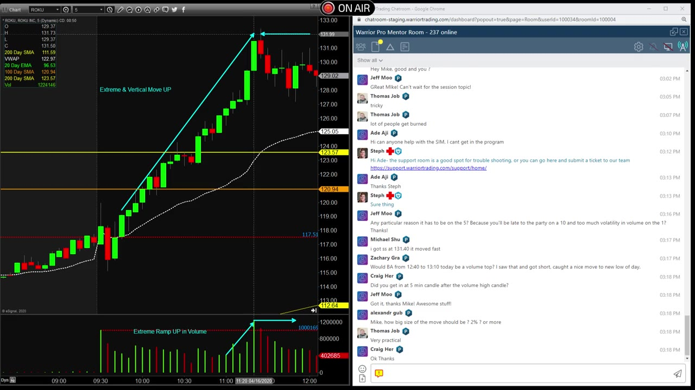

**图怎么看：**

- 在图中可以看到ROKU的K线图，显示了成交量顶和底。
- 成交量顶出现在120.94点附近，成交量柱明显高于其他时间段。
- 成交量底出现在117.51点附近，成交量柱较低。
- 通过观察成交量的变化，可以判断出市场的买卖情绪变化。

### 关键内容

- 成交量顶和底是市场反转的重要信号，通常出现在高波动时期。
- 成交量顶出现在股价快速上升后，成交量达到顶峰但股价不再上升。
- 成交量底出现在股价快速下跌后，成交量达到顶峰但股价不再下降。
- 成交量顶和底需要在5分钟图表上确认，且成交量需超过前一日最高水平。
- 成交量顶和底的确认需要成交量持续上升，直到超过前一日最高水平。
- 成交量顶和底的确认需要股价突破并保持在新的高点或低点。
- 成交量顶和底的确认需要股价在高点或低点附近形成支撑或阻力。
- 成交量顶和底的确认需要成交量在高点或低点附近形成明显的趋势。
- 成交量顶和底的确认需要成交量在高点或低点附近形成明确的形态。
- 成交量顶和底的确认需要成交量在高点或低点附近形成明显的反转

### 分析与执行顺序

1. 首先观察股票价格的快速上升或下降。
2. 然后检查成交量是否在价格快速上升或下降后达到顶峰。
3. 接着确认成交量是否超过前一日的最高水平。
4. 最后确认成交量是否在高点或低点附近形成明显的趋势或形态。
5. 在确认成交量顶和底后，设置止损和目标价。
6. 在成交量顶和底出现后，等待价格回调或反弹。
7. 在价格回调或反弹后，根据成交量顶和底的确认情况决定是否入场

### 案例与细节

- Roku股票在一天内快速上升，成交量达到顶峰，随后价格回落，符合成交量顶的特征。
- Boeing股票在一天内快速下跌，成交量达到顶峰，随后价格回升，符合成交量底的特征。
- 在Roku股票成交量顶出现后，价格在132附近回调，符合成交量顶的特征。
- 在Boeing股票成交量底出现后，价格在147附近回升，符合成交量底的特征。

### 风险与边界

- 成交量顶和底的确认需要在5分钟图表上进行，否则可能无法准确判断。
- 成交量顶和底的确认需要成交量超过前一日最高水平，否则可能无效。
- 成交量顶和底的确认需要股价突破并保持在新的高点或低点，否则可能无效。
- 成交量顶和底的确认需要成交量在高点或低点附近形成明显的趋势或形态，否则可能无效。
- 成交量顶和底的确认需要成交量在高点或低点附近形成明确的反转，否则可能无效。
- 成交量顶和底的确认需要在高波动时期进行，否则可能无效

### 复盘问题

- 在识别成交量顶和底时，如何确保成交量确实超过前一日最高水平？
- 在识别成交量顶和底时，如何确认成交量是否在高点或低点附近形成明显的趋势或形态？
- 在识别成交量顶和底时，如何确认成交量是否在高点或低点附近形成明确的反转？
- 在识别成交量顶和底时，如何确保成交量顶和底的确认是在5分钟图表上进行？
- 在识别成交量顶和底时，如何确认成交量是否突破并保持在新的高点或低点？

---

## v0799：如何在市场波动中保持交易策略

> 日期：2020　·　时长：00:57:12

**本场重点：** 在市场波动中坚持既定交易策略，识别市场环境影响而非个人失误。

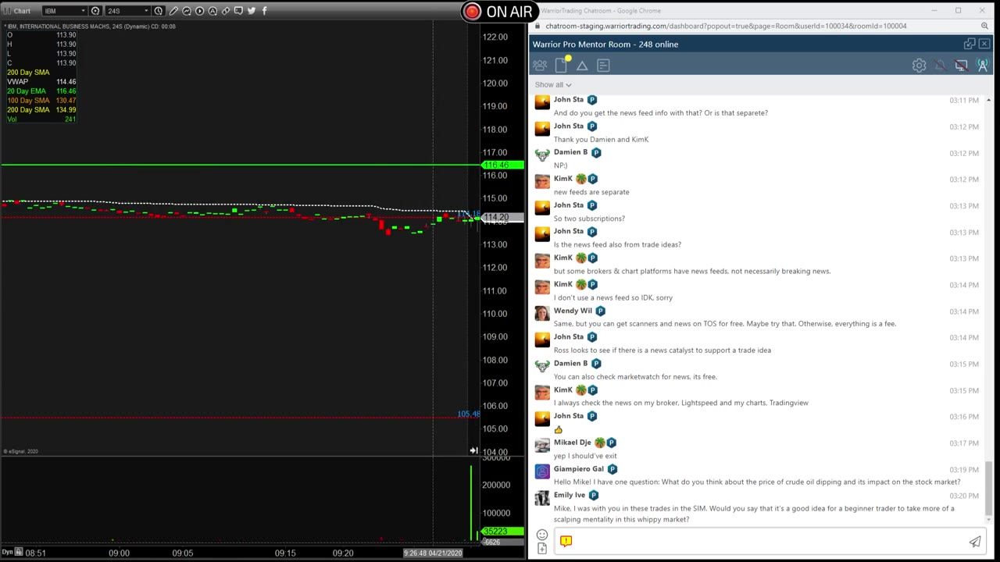

**图怎么看：**

- 在市场波动中坚持既定交易策略，识别市场环境影响而非个人失误。
- 图中显示了多个股票的K线图，包括200日简单移动平均线（SMA）和200日指数移动平均线（EMA），帮助投资者分析市场趋势。
- 成交量柱显示了市场的买卖活动，有助于理解市场情绪和潜在的交易机会。
- 通过实时聊天记录，可以观察到参与者对市场动态的讨论和分析，进一步强调了在市场波动中保持交易策略的重要性。

### 关键内容

- 过去几周市场波动较大，难以找到持续的趋势。
- 通过回顾交易记录，确认是否是市场环境导致的波动而非个人失误。
- 即使市场不利，也要坚持既定的交易策略。
- 市场环境变化时，需要调整交易策略以适应新的市场状况。
- 在市场不利时，应减少风险敞口，避免过度亏损。
- 市场不利时，不应轻易放弃既定的交易策略。
- 市场环境变化时，需要重新评估交易策略的有效性。
- 市场不利时，应关注交易记录中的模式，确认是否是市场环境影响而非个人失误。
- 在市场不利时，应保持冷静，避免情绪化决策

### 分析与执行顺序

1. 回顾交易记录，确认是否是市场环境导致的波动而非个人失误。
2. 分析市场环境，确认当前市场是否不利于交易。
3. 调整交易策略，减少风险敞口，避免过度亏损。
4. 通过快速回调确认点来验证交易策略的有效性。
5. 在市场不利时，保持冷静，避免情绪化决策。
6. 在市场不利时，继续执行既定的交易策略，直到确认市场环境变化
7. 在市场不利时，重新评估交易策略的有效性，确认是否是市场环境影响而非个人失误

### 案例与细节

- OXY股票在周一的交易，市场环境不利，但技术设置良好，最终被市场反噬。
- IBM股票在周一的交易，市场环境不利，技术设置不佳，最终被市场反噬。
- UAL股票在周一的交易，市场环境不利，技术设置良好，最终被市场反噬。
- SNAP股票在周一的交易，市场环境有利，技术设置良好，最终获得不错的收益。
- IMMU股票在当天的交易，市场环境不利，技术设置不佳，最终被市场反噬

### 风险与边界

- 市场环境变化时，交易策略可能不再有效，需要重新评估。
- 在市场不利时，过度亏损可能导致资金链断裂，需谨慎管理风险。
- 市场不利时，情绪化决策可能导致错误的交易行为，需保持冷静。
- 录制于2020年，部分市场规则和条件可能已发生变化

### 复盘问题

- 回顾交易记录，确认是否是市场环境导致的波动而非个人失误？
- 在市场不利时，应采取哪些措施来保护资金？
- 如何在市场不利时保持冷静，避免情绪化决策？

---

## v0800：预市开盘前的股票筛选流程

> 日期：2020　·　时长：00:49:25

**本场重点：** 通过预市筛选股票，确保抓住关键信息，简化决策过程。

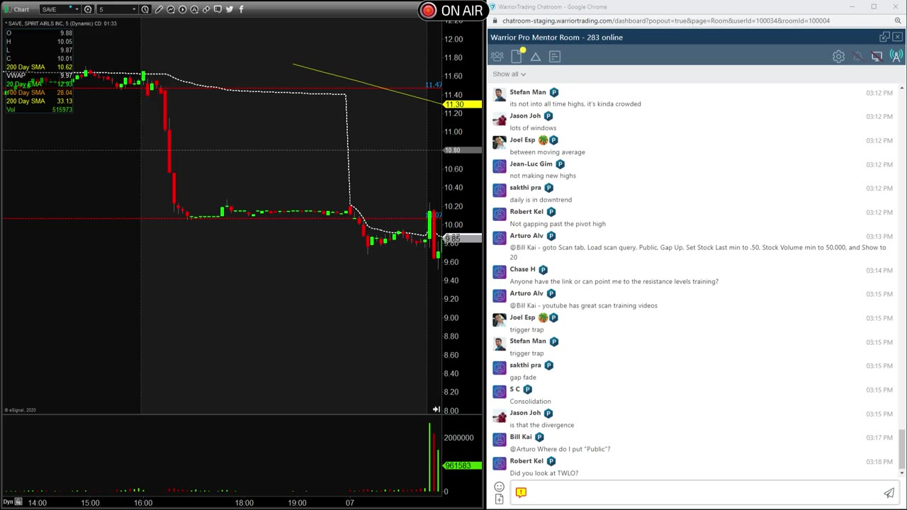

**图怎么看：**

- 在图中可以看到SAVE公司的股价在11.80到11.90区间内波动。
- 成交量柱显示了市场对股价的买卖意愿。
- 均线（200日、100日）显示了股价的趋势。
- VWAP（市值加权平均价格）显示了当前市场的平均价格

### 关键内容

- 通过阅读新闻来了解当天可能有重大变动的股票。
- 结合技术图表分析，确定股票是否有继续上涨的潜力。
- 开盘前的筛选流程有助于减少决策过程中的复杂性，提高效率。

### 分析与执行顺序

1. 早上8点左右开始阅读新闻，了解当天可能有重大变动的股票。
2. 使用Gap Scan工具筛选出大幅波动的股票，至少3%的涨幅或跌幅。
3. 查看这些股票的技术图表，寻找可能继续上涨的迹象。
4. 在开盘前两分钟内，进一步筛选出最有可能行动的两只股票。
5. 利用触发陷阱等技术指标，预测股票的开盘走势。
6. 开盘后，根据价格动作调整仓位，避免被快速反转的价格走势误导。
7. 开盘后不再使用扫描工具，专注于开盘价的波动和成交量的变化

### 案例与细节

- ticker：PAYY；price_change：大幅上涨；chart_pattern：突破长期上升趋势线；technical_indicator：触发陷阱；action：加入观察名单
- ticker：PTON；price_change：大幅上涨；chart_pattern：突破长期上升趋势线；technical_indicator：触发陷阱；action：加入观察名单
- ticker：LYFT；price_change：小幅上涨；chart_pattern：接近20日移动平均线；technical_indicator：无明显技术指标；action：暂时搁置

### 风险与边界

- 开盘前的筛选流程依赖于特定的市场条件，这些条件可能会发生变化。
- 开盘后的操作需要灵活应对市场变化，避免过度依赖前期预测。
- 使用TradeStation平台进行交易，但需注意其学习曲线较陡峭。
- 开盘后不再使用扫描工具，这可能导致错过其他潜在的交易机会

### 复盘问题

- 开盘前的筛选流程是如何帮助减少决策过程中的复杂性的？
- 在开盘后，如何根据价格动作调整仓位以避免被快速反转的价格走势误导？
- 使用TradeStation平台进行交易有哪些优点和缺点？

---

## v0801：NCLH 股票交易案例分析

> 日期：2020　·　时长：00:45:19

**本场重点：** 通过 NCLH 的交易案例，理解如何利用技术图表进行股票交易，并避免市场新闻带来的不确定性。

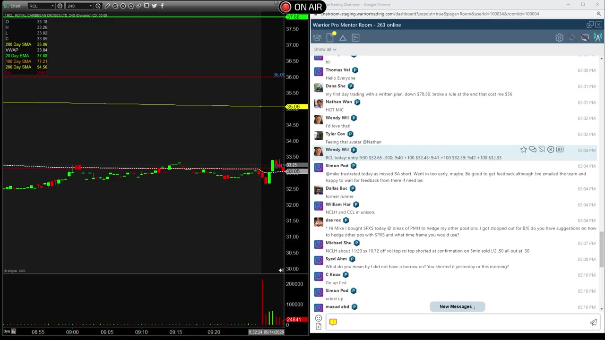

**图怎么看：**

- 通过 NCLH 的交易案例，理解如何利用技术图表进行股票交易，并避免市场新闻带来的不确定性。
- 画面中，可以看到 NCLH 股票的技术图表，包括价格走势、均线（如 200 日均线）、成交量柱等。
- 图表显示了 NCLH 股票的价格波动情况，以及均线的支撑和阻力位。
- 通过观察这些技术指标，可以更好地理解和预测股票市场的走势。

### 关键内容

- NCLH 股票在新闻和技术图表支持下表现良好，显示了技术分析的重要性。
- 讲师强调了每日图表的重要性，指出它能更好地反映股票的整体趋势。
- 市场新闻（如财报）可能带来不确定性，因此应尽量避开这些时间段进行交易。
- 交易时应等待回测失败后再进行操作，以确保更安全的入场点。
- 使用快速时间框架（如 24 秒）进行交易，可以更好地捕捉价格波动。
- 三角形形态是判断趋势反转的重要工具，但需结合成交量确认。
- 交易时应关注价格突破的关键水平，如 20 日均线等。
- 交易策略应包括设置止损点，以控制风险并保护利润。
- 交易时应考虑市场整体趋势，避免在市场波动较大时进行交易。
- 交易者应保持耐心，等待最佳入场时机，而不是盲目跟风。

### 分析与执行顺序

1. 讲师首先介绍了 NCLH 的交易情况，包括入场点和止损点。
2. 然后解释了如何利用技术图表进行交易，特别是每日图表的重要性。
3. 接着讨论了如何利用快速时间框架（如 24 秒）进行交易，以捕捉价格波动。
4. 讲师强调了市场新闻（如财报）可能带来的不确定性，建议避开这些时间段。
5. 最后，讲师总结了交易策略，包括设置止损点和等待最佳入场时机。

### 案例与细节

- NCLH 在开盘时出现下跌缺口，讲师观察到股价在 990 美元附近出现回测失败，随后进行了短空操作。
- RCL 在开盘时也出现了类似情况，但因为技术问题导致交易延迟，最终未能成功抓住机会。
- CODX 在开盘时出现成交量底部，表明这是一个潜在的买入点，但实际操作中并未成功抓住机会。
- NCLH 在开盘时出现 20 日均线回测失败，随后进行了短空操作，最终成功获利。
- UNFI 在开盘时出现三角形形态，但因为成交量不足，最终未能成功抓住机会。

### 风险与边界

- 交易时应考虑市场整体趋势，避免在市场波动较大时进行交易，这可能导致亏损。
- 市场新闻（如财报）可能带来不确定性，因此应尽量避开这些时间段进行交易，这可能导致错过最佳交易机会。
- 快速时间框架（如 24 秒）虽然能捕捉价格波动，但也可能增加交易风险，需要谨慎操作。
- 交易策略应包括设置止损点，以控制风险并保护利润，但这并不能保证每次都能成功。

### 复盘问题

- NCLH 的交易案例中，哪些因素是决定交易成败的关键？
- 如何利用技术图表进行交易，特别是在开盘时发现下跌缺口的情况下？
- 在交易过程中，如何避免市场新闻带来的不确定性？
- 快速时间框架（如 24 秒）对于捕捉价格波动有何优势和风险？
- 交易策略中设置止损点的作用是什么？

---

## v0802：如何应对市场大缺口

> 日期：2020　·　时长：00:50:44

**本场重点：** 识别市场大缺口，采取保守策略，避免大亏损

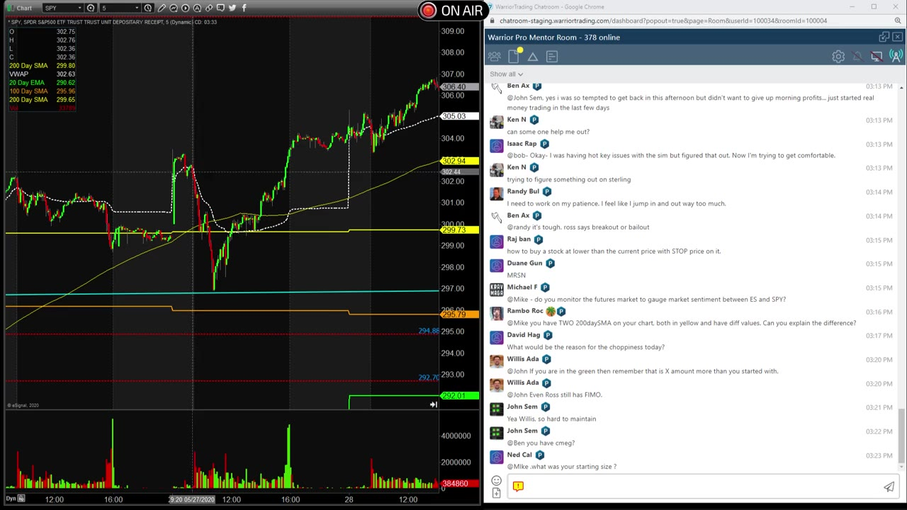

**图怎么看：**

- 画面中，可以看到SPY ETF Trust Trust Unit Depositary Receipt的价格在一段时间内出现了显著的下跌，随后又出现了一次反弹。
- 图中的水平线显示了支撑位和阻力位，帮助投资者判断当前市场的趋势。
- 成交量柱的高度反映对应周期内的总成交量；红绿着色通常跟随价格柱的涨跌规则，不能直接拆成两种方向的主动成交。
- 通过观察这些图表，投资者可以更好地理解市场动态，并做出相应的交易决策。

### 关键内容

- 市场大缺口导致价格行动难以预测，影响交易策略
- 识别市场大缺口后，应采取保守策略，减少头寸
- 市场大缺口通常伴随着小盘股的活跃度增加
- 大缺口后的市场走势往往难以持续，容易回撤
- 交易者应关注市场大缺口后的价格行动，避免盲目追涨
- 采取保守策略后，交易者应更加注重耐心等待
- 市场大缺口通常出现在市场波动加剧时
- 识别市场大缺口后，应调整交易标准，提高耐心
- 市场大缺口通常伴随着小盘股的活跃度增加，因此交易者应关注这些股票的表现。
- 大缺口后的市场走势往往难以持续，容易回撤，因此交易者应避免过度追涨。
- 市场大缺口通常出现在市场波动加剧时，此时交易者应更加谨慎，减少头寸。
- 识别市场大缺口后，应调整交易标准，提高耐心，等待市场信号再进行操作。
- 市场大缺口可能导致交易者暴露于更大风险中，尤其是在缺乏经验时，因此应谨慎对待。

### 分析与执行顺序

1. 识别市场大缺口，评估市场环境
2. 采取保守策略，减少头寸
3. 关注市场大缺口后的价格行动，避免盲目追涨
4. 设置合理的止损点，控制风险
5. 保持耐心，等待市场信号

### 案例与细节

- ABIO股票，市场大缺口后出现快速上涨，但随后回撤
- NCLH股票，市场大缺口后尝试反转向下，但未能成功
- HPQ股票，市场大缺口后进行保守交易，最终获利
- 市场大缺口后，SPY指数出现大幅波动，难以预测
- 市场大缺口后，小盘股表现活跃，而大盘股相对平静
- ABIO股票，市场大缺口后出现快速上涨，但随后回撤，说明市场大缺口后的走势具有不确定性。
- NCLH股票，市场大缺口后尝试反转向下，但未能成功，表明交易者应避免盲目追涨。
- HPQ股票，市场大缺口后进行保守交易，最终获利，说明采取保守策略可以有效降低风险。
- 市场大缺口后，SPY指数出现大幅波动，难以预测，说明市场大缺口后的走势具有不确定性。
- 市场大缺口后，小盘股表现活跃，而大盘股相对平静，说明市场大缺口通常伴随着小盘股的活跃度增加。

### 风险与边界

- 市场大缺口可能导致交易者暴露于更大风险中，尤其是在缺乏经验时
- 过度依赖市场大缺口作为交易依据可能忽视其他重要市场因素
- 市场大缺口后的走势具有不确定性，可能导致交易者无法实现预期收益
- 录制年代限制，当前市场环境可能与过去有所不同
- 市场大缺口可能导致交易者暴露于更大风险中，尤其是在缺乏经验时，因为此时市场难以预测。
- 过度依赖市场大缺口作为交易依据可能忽视其他重要市场因素，如宏观经济数据和公司基本面。
- 市场大缺口后的走势具有不确定性，可能导致交易者无法实现预期收益，特别是在市场波动加剧时。
- 录制年代限制，当前市场环境可能与过去有所不同，因此交易者应结合当前市场情况进行分析。

### 复盘问题

- 如何识别市场大缺口，并采取相应的保守策略？
- 在市场大缺口后，哪些价格行动是需要特别注意的？
- 如何在市场大缺口后保持耐心，避免盲目追涨？

---

## v0803：预市况模式分析

> 日期：2020　·　时长：00:59:10

**本场重点：** 通过预市况模式分析，可以预测开盘后的走势，提高交易成功率。

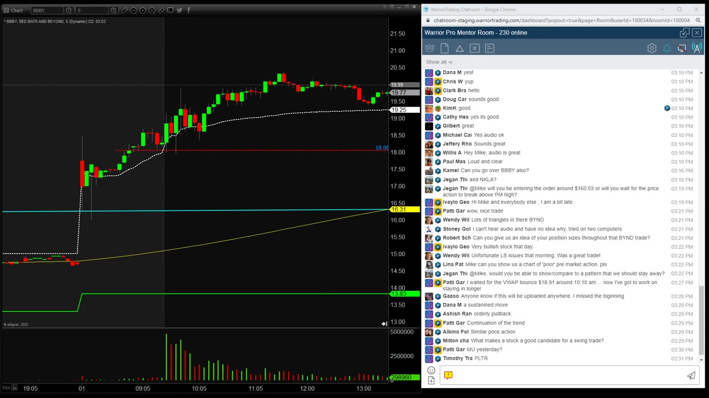

**图怎么看：**

- 图中显示了阿里巴巴集团控股有限公司（BABA）的股价走势图，包括5日动态均线、WAP、EMA等技术指标。
- 可以看到股价在开盘后迅速上涨，并在高位附近形成了一定的盘整形态。
- 成交量柱状图显示了不同时间段的成交量变化，有助于理解市场情绪。
- 图中的水平线可能表示支撑位或阻力位，帮助投资者判断买卖机会

### 关键内容

- 预市况模式是判断股票开盘后走势的重要工具。
- 模式包括强劲的上升趋势、有序的回调和成交量的变化。
- 模式在开盘前保持，有助于确定买入时机。
- 模式在开盘后继续，提供持续的交易机会。
- 模式需要结合成交量和价格变动来识别。
- 模式适用于多种股票，包括大型股和小型股。
- 模式在开盘前和开盘后都有效，但开盘前更关键。
- 模式需要耐心等待，以确保最佳交易机会。
- 模式需要结合市场新闻和其他因素进行分析。
- 模式需要快速决策和灵活调整策略

### 分析与执行顺序

1. 讲师首先介绍了预市况模式的基本概念。
2. 然后讲解了如何识别模式中的关键特征，如成交量和价格变动。
3. 接着展示了几个具体的股票实例，说明模式的应用。
4. 最后强调了模式在实际交易中的重要性和应用方法。
5. 讲师还提到了使用24秒图表的重要性，以获得最佳信号。
6. 讲师分享了如何利用模式进行快速决策和调整策略的方法

### 案例与细节

- BYND：开盘前强劲上升，随后回调，成交量减少，表明需求。
- BBBY：开盘前出现轻微回调，表明市场兴趣。
- NIO：开盘前出现轻微回调，随后继续上升，表明市场信心。
- EXPE：开盘前出现大幅下跌，随后回调，表明市场疲软。
- SLDB：开盘前出现波动，缺乏明确的回调，表明市场不确定性

### 风险与边界

- 模式失效可能是因为市场新闻或其他突发事件导致市场情绪变化。
- 模式识别需要经验，新手可能难以准确识别。
- 模式依赖于成交量和价格变动，这些数据可能受到市场波动的影响。
- 模式识别需要结合其他技术分析工具，否则可能产生误导。
- 模式识别依赖于特定时间框架，不同时间框架可能产生不同的结果

### 复盘问题

- 讲师提到的预市况模式有哪些关键特征？
- 如何识别模式中的关键特征？
- 讲师分享了哪些具体的股票实例？
- 模式识别过程中需要注意哪些风险？
- 如何结合其他技术分析工具来提高模式识别的准确性？

---

## v0804：预市开盘速度线

> 日期：2020　·　时长：00:53:40

**本场重点：** 通过预市价格动作预测开盘走势，利用趋势线和速度线进行买卖点判断。

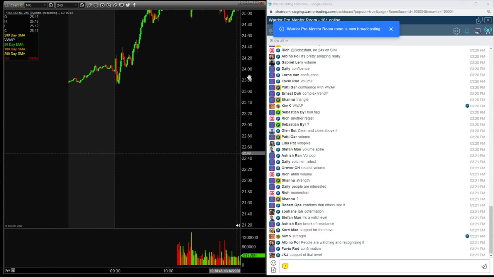

**图怎么看：**

- 在图中可以看到SNAP股票的价格走势，显示了20日均线、100日均线和200日均线。
- 成交量柱的高度反映对应周期内的总成交量；红绿着色通常跟随价格柱的涨跌规则，不能直接拆成两种方向的主动成交。
- 图中显示了价格在24.60附近形成一个支撑位，随后价格突破这个支撑位。
- 成交量适合与前序时段或历史基准比较参与程度，但仅凭柱体颜色无法判断哪一方主动，也不能由此推断下一步方向。

### 关键内容

- 预市价格动作是预测开盘走势的关键，尤其是缺口下行动态。
- 使用趋势线和速度线可以量化预市价格动作，形成买卖点。
- 预市价格动作可以预测股票的开盘方向，提高交易准确性。
- 利用趋势线和速度线进行买卖点判断需要结合预市价格动作。
- 预市价格动作和趋势线、速度线相互验证，提高交易的可靠性。
- 预市价格动作和趋势线、速度线的应用需要结合具体股票的特性。
- 预市价格动作和趋势线、速度线的应用需要结合具体市场环境。
- 预市价格动作和趋势线、速度线的应用需要结合具体交易策略。
- 预市价格动作和趋势线、速度线的应用需要结合具体技术指标。

### 分析与执行顺序

1. 首先，识别预市价格动作，如缺口下行动态。
2. 然后，绘制趋势线和速度线，量化预市价格动作。
3. 接着，观察开盘后的价格反应，确认趋势线和速度线的有效性。
4. 最后，结合具体股票特性，制定交易策略。
5. 在整个过程中，需要不断验证和调整趋势线和速度线的应用。

### 案例与细节

- IBM出现明显的缺口下行动态，随后价格在趋势线下测试并反弹。
- NIO出现大缺口上行动态，随后价格在趋势线上测试并继续上涨。
- SQBG出现快速上升的预市动态，但趋势线和速度线应用效果不佳。
- TLRY在预市范围内波动，趋势线和速度线应用效果较好。
- PLTR出现双底形态，趋势线和速度线应用效果较好，但需结合具体市场环境。

### 风险与边界

- 预市价格动作和趋势线、速度线的应用需要结合具体股票特性，不同股票可能效果不同。
- 预市价格动作和趋势线、速度线的应用需要结合具体市场环境，市场变化可能影响效果。
- 预市价格动作和趋势线、速度线的应用需要结合具体交易策略，策略不同可能效果不同。

### 复盘问题

- 如何识别预市价格动作中的关键信号？
- 如何结合具体股票特性应用趋势线和速度线？
- 如何结合具体市场环境应用趋势线和速度线？
- 如何结合具体交易策略应用趋势线和速度线？

---

## v0805：高级交易技巧与模拟器使用

> 日期：2020　·　时长：01:54:41

**本场重点：** 讲师建议新手在真实账户中降低交易规模，以避免大额亏损；使用Trade Zero进行模拟交易，而不是Interactive Brokers；在模拟器中使用较小的仓位，以更好地模拟真实交易环境。

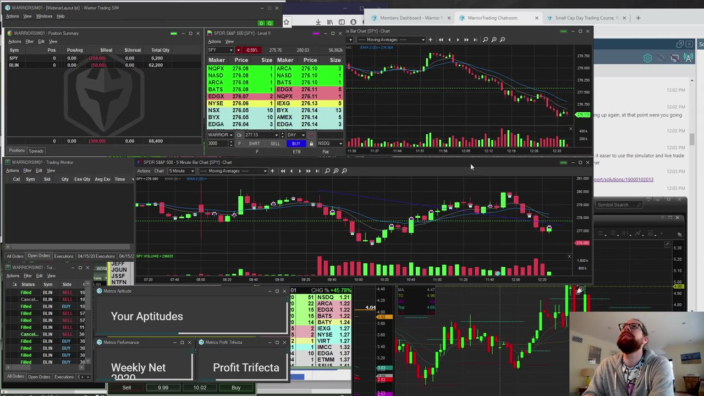

**图怎么看：**

- Level 2 显示了股票的买卖报价，包括买一、买二等，这有助于投资者了解市场上的供需情况。
- 通过观察 Level 2，投资者可以判断当前市场的活跃度和买卖双方的意愿。
- Level 2 的数据对于制定交易策略非常重要，因为它提供了即时的市场动态。
- Level 2 的颜色和条带属于平台的报价分区与显示约定；实际市场深度要看价位、挂单数量、价差以及挂单随时间的变化。

### 关键内容

- 讲师建议新手在真实账户中降低交易规模，以避免大额亏损。这基于模拟器中的经验教训。
- 使用Trade Zero进行模拟交易，因为它更接近真实交易环境，且费用较低。
- 在模拟器中使用较小的仓位，以更好地模拟真实交易环境，帮助新手逐步建立信心。
- 讲师解释了如何在模拟器中设置订单，包括限价单和止损单，以优化交易策略。
- 讲师建议通过隐藏盈亏来训练自己在感觉表现不佳时及时退出，以避免大额亏损。
- 讲师建议在突破VWAP时卖出，以捕捉利润，同时使用Trade Zero进行模拟交易。
- 讲师建议新手在真实账户中降低交易规模，以避免大额亏损，因为模拟器中的资金是虚拟的，可以当作游戏，新手容易忽视风险。
- 使用Trade Zero进行模拟交易，因为它支持实时止损设置，有助于捕捉利润，同时费用较低，适合新手逐步建立信心。
- 在模拟器中使用较小的仓位，以更好地模拟真实交易环境，避免大额亏损，但实际交易环境可能有所不同，新手需要适应。
- 讲师解释了如何在模拟器中设置订单，包括限价单和止损单，以优化交易策略，新手可以通过这种方式学习如何管理风险。
- 使用TC 2000进行模拟交易，尽管已多年未用，但它更接近真实交易环境，可以帮助新手理解市场动态，但其功能和费用结构可能在未来发生变化。

### 分析与执行顺序

1. 讲师首先解释了如何在模拟器中设置订单，包括限价单和止损单。
2. 然后，讲师讨论了如何识别假突破，强调了开盘时股票的扩展程度。
3. 接着，讲师解释了如何在模拟器中设置移动平均线，包括颜色和周期的选择。
4. 随后，讲师讨论了不同交易平台的优缺点，包括TD Ameritrade和TradeZero。
5. 最后，讲师建议使用Trade Zero进行模拟交易，因为它支持实时止损设置，有助于捕捉利润。

### 案例与细节

- 使用Trade Zero进行模拟交易，因为它支持实时止损设置，有助于捕捉利润。
- 在模拟器中设置订单，包括限价单和止损单，以优化交易策略。
- 使用TC 2000进行模拟交易，尽管已多年未用，但它更接近真实交易环境。
- 在模拟器中交易时应使用较小的仓位，以更好地模拟真实交易环境，避免大额亏损。
- 使用Trade Zero进行模拟交易，因为它支持实时止损设置，有助于捕捉利润，例如设置10或15美分的止损，以快速调整交易策略。
- 在模拟器中设置订单，包括限价单和止损单，以优化交易策略，例如在突破VWAP时卖出，以捕捉利润，同时使用Trade Zero进行模拟交易。
- 使用TC 2000进行模拟交易，尽管已多年未用，但它更接近真实交易环境，例如在模拟器中交易时应使用较小的仓位，以更好地模拟真实交易环境，避免大额亏损。

### 风险与边界

- 使用Trade Zero进行模拟交易，尽管它更接近真实交易环境，但其功能和费用结构可能在未来发生变化。
- 在模拟器中使用较小的仓位，以更好地模拟真实交易环境，避免大额亏损，但实际交易环境可能有所不同。
- 使用TC 2000进行模拟交易，尽管已多年未用，但它更接近真实交易环境，但其功能和费用结构可能在未来发生变化。
- 讲师建议使用Trade Zero进行模拟交易，因为它支持实时止损设置，有助于捕捉利润，但实际交易环境可能有所不同。
- 使用Trade Zero进行模拟交易，尽管它更接近真实交易环境，但其功能和费用结构可能在未来发生变化，新手需要关注这些变化。
- 在模拟器中使用较小的仓位，以更好地模拟真实交易环境，避免大额亏损，但实际交易环境可能有所不同，新手需要谨慎操作。
- 使用TC 2000进行模拟交易，尽管已多年未用，但它更接近真实交易环境，但其功能和费用结构可能在未来发生变化，新手需要适应这些变化。

### 复盘问题

- 如何在模拟器中设置订单，包括限价单和止损单？
- 如何识别假突破，特别是在开盘时股票的扩展程度？
- 为什么使用Trade Zero进行模拟交易？
- 如何在模拟器中设置移动平均线，包括颜色和周期的选择？
- 如何在模拟器中使用较小的仓位，以更好地模拟真实交易环境？

---

## v0806：大市值股票交易策略：鱼钩形态

> 日期：2020　·　时长：01:01:38

**本场重点：** 识别鱼钩形态，理解入场时机与风险控制，适用于大市值股票交易。

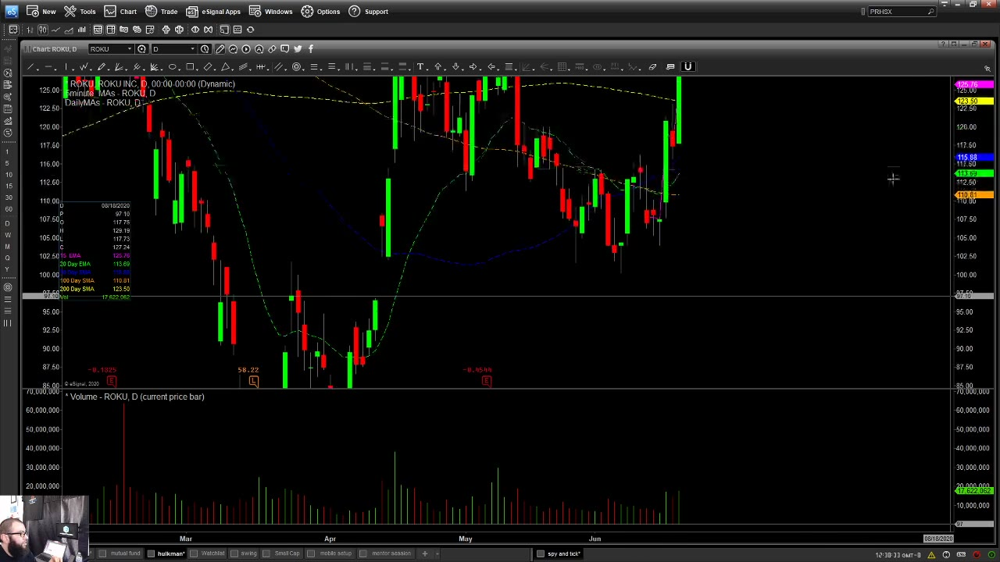

**图怎么看：**

- 这张图片展示了一个每日交易图表，显示了Roku（ROKU）股票的价格走势。
- 图表中可以看到一个明显的“鱼钩”形态，即在价格下跌后出现的缺口。
- 这个形态通常被视为市场情绪的变化，可能预示着未来的趋势变化。
- 通过分析这个形态，投资者可以更好地判断市场的心理状态和潜在的交易机会。

### 关键内容

- 鱼钩形态是基于情绪波动和市场趋势的交易机会识别方法。
- 形态的关键特征包括：上涨趋势后的回调，随后再次突破。
- 交易者应关注关键价格水平和成交量的变化。
- 交易者需等待回调后再进入，以减少风险。
- 交易者应设定明确的止损点，以控制潜在损失。
- 交易者需关注市场情绪变化，避免过度交易。
- 交易者应记录并分析交易结果，以优化策略。
- 交易者需了解市场波动性，避免在极端市场条件下操作。
- 交易者应定期回顾和更新交易策略，以适应市场变化。
- 交易者应保持耐心，等待最佳交易机会，避免频繁交易。

### 分析与执行顺序

1. 讲师首先介绍了鱼钩形态的基本原理，强调情绪波动的重要性。
2. 然后，讲师展示了如何识别鱼钩形态的关键特征，包括上涨趋势后的回调。
3. 接着，讲师讲解了如何设置止损点，以控制潜在损失。
4. 最后，讲师强调了交易者需要耐心等待最佳交易机会的重要性。
5. 讲师还提醒交易者要关注市场情绪变化，避免过度交易。
6. 讲师建议交易者记录并分析交易结果，以优化策略。
7. 讲师强调了定期回顾和更新交易策略的重要性，以适应市场变化。

### 案例与细节

- description：鱼钩形态实例：Roku；details：Roku在去年某个时候表现非常强劲，形成了明显的鱼钩形态。交易者可以在回调后进入，并设定止损点。
- description：鱼钩形态实例：Tesla；details：Tesla在某个交易日也形成了鱼钩形态，交易者可以在回调后进入，并设定止损点。
- description：鱼钩形态实例：SpaceX；details：SpaceX在某个交易日也形成了鱼钩形态，交易者可以在回调后进入，并设定止损点。

### 风险与边界

- 交易者需注意市场波动性，避免在极端市场条件下操作。
- 交易者需设定明确的止损点，以控制潜在损失。
- 交易者需定期回顾和更新交易策略，以适应市场变化。
- 交易者需保持耐心，避免频繁交易，以免增加不必要的风险。

### 复盘问题

- 鱼钩形态的关键特征是什么？
- 如何设置止损点以控制潜在损失？
- 交易者应如何记录并分析交易结果？

---

## v0807：高级交易问答

> 日期：2020　·　时长：01:03:39

**本场重点：** 交易者在高压力日如何保持冷静，以及如何利用技术指标进行交易。

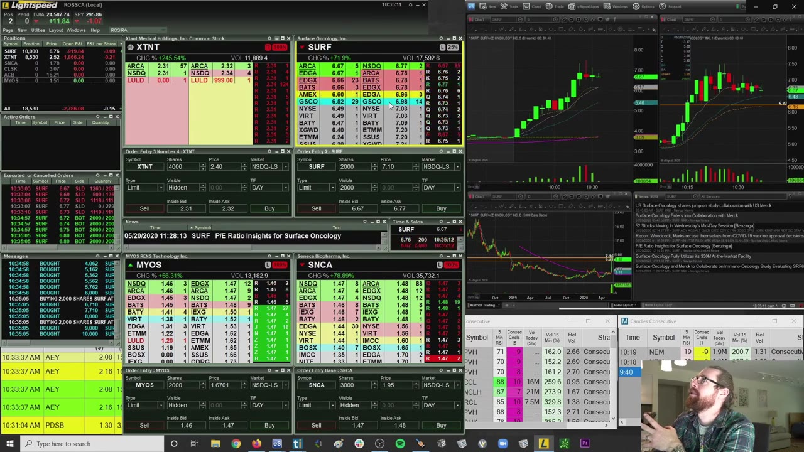

**图怎么看：**

- 画面中，可以看到多个股票的实时数据，包括价格、成交量和市场表现。这些数据可以帮助交易者分析市场趋势和做出决策。
- 画面中的图表显示了不同股票的价格走势，包括K线图和均线，帮助交易者识别趋势和支撑阻力位。
- 画面中的订单窗口显示了当前的买卖订单，有助于交易者了解市场的活跃度和潜在的买卖机会。
- 画面中的聊天室对话框显示了交易者之间的互动和讨论，提供了关于交易策略和技术指标应用的见解。

### 关键内容

- 交易者使用第一根蜡烛突破新高的策略来决定入场点。
- 交易者强调了TC-2000和E-Signal之间的区别，以及选择E-Signal的原因。
- 交易者提到使用止损单和跟踪止损单的重要性，以管理风险。
- 交易者解释了如何利用时间与销售图表来做出决策。
- 交易者讨论了如何识别市场情绪变化，以及如何调整交易策略。
- 交易者提到了使用Level 2图表的重要性，以及如何识别市场参与者。
- 交易者分享了如何通过观察蜡烛形态来预测市场走势的方法。
- 交易者讨论了如何利用技术指标进行交易，以及如何识别潜在的交易机会。
- 交易者提到了使用滑动止损单的注意事项，以及如何避免过度交易。
- 交易者分享了如何通过观察市场动态来调整交易策略的方法。
- 交易者强调了交易过程中保持专注的重要性，以及如何避免分心。

### 分析与执行顺序

1. 交易者回顾了当天的交易情况，包括哪些股票表现良好，哪些表现不佳。
2. 交易者解释了如何使用TC-2000和E-Signal进行交易，并提到了两者之间的费用差异。
3. 交易者讨论了如何识别第一根蜡烛突破新高的策略，并解释了不同情况下的交易方法。
4. 交易者分享了如何利用时间与销售图表来做出决策，并提到了如何识别市场情绪变化。
5. 交易者讨论了如何使用Level 2图表来识别市场参与者，并提到了如何识别潜在的交易机会。
6. 交易者分享了如何通过观察蜡烛形态来预测市场走势的方法，并提到了如何识别潜在的交易机会。
7. 交易者强调了交易过程中保持冷静的重要性，以及如何避免冲动交易。
8. 交易者提到了如何通过观察市场波动来识别潜在的交易机会，以及如何利用这些机会进行交易。

### 案例与细节

- XTNT股票在接近交易日结束时大幅波动，交易者使用滑动止损单来管理风险。
- 交易者提到了如何识别第一根蜡烛突破新高的策略，例如在R&BL股票上，当蜡烛突破11时进行买入。
- 交易者分享了如何使用Level 2图表来识别市场参与者，例如在XTNT股票上，观察到大量卖单。
- 交易者提到了如何通过观察蜡烛形态来预测市场走势，例如在SNCA股票上，观察到蜡烛形成双底形态。
- 交易者分享了如何通过观察市场波动来识别潜在的交易机会，例如在SURF股票上，观察到蜡烛突破关键支撑位。

### 风险与边界

- 交易者提到使用滑动止损单的注意事项，例如可能会导致过早卖出。
- 交易者提到了使用Level 2图表的重要性，但需要注意的是，这可能需要额外的学习和实践。
- 交易者强调了交易过程中保持冷静的重要性，但需要注意的是，这可能需要时间来培养。
- 交易者提到了如何通过观察蜡烛形态来预测市场走势，但需要注意的是，这可能需要大量的实践和经验。
- 交易者分享了如何通过观察市场波动来识别潜在的交易机会，但需要注意的是，这可能需要对市场有深入的理解。

### 复盘问题

- 交易者如何使用TC-2000和E-Signal进行交易？
- 交易者如何识别第一根蜡烛突破新高的策略？
- 交易者如何利用时间与销售图表来做出决策？
- 交易者如何使用Level 2图表来识别市场参与者？
- 交易者如何通过观察蜡烛形态来预测市场走势？

---

## v0808：高级交易策略与实战

> 日期：2020　·　时长：01:39:22

**本场重点：** 讲师分享了如何通过Doji信号和蜡烛图进行交易，强调了细节的重要性。

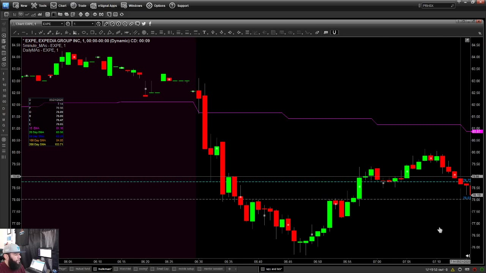

**图怎么看：**

- 这张图表显示了EXPE股票的价格走势，包括5分钟和日线级别的移动平均线。
- 可以看到在价格下跌过程中，5分钟EMA和日线EMA都出现了明显的下降。
- 成交量柱的高度反映对应周期内的总成交量；红绿着色通常跟随价格柱的涨跌规则，不能直接拆成两种方向的主动成交。
- 成交量适合与前序时段或历史基准比较参与程度，但仅凭柱体颜色无法判断哪一方主动，也不能由此推断下一步方向。

### 关键内容

- 讲师使用范围烛形和Doji信号作为主要交易工具，关注连续回调。
- 当范围烛形突破后，等待回调确认趋势，然后进入交易。
- Doji信号表示市场不确定性，出现时应立即进入交易。
- Shooting Star形态表示流动性抓取，通常继续上涨。
- 交易过程中，注意市场深度显示的流动性变化。
- 交易成功的关键在于连续的回调和突破后的确认。
- 讲师使用TAS盒子来帮助管理交易，但正在尝试减少这些依赖。
- 讲师建议使用样本集来建立内部记忆，以提高交易成功率。
- 讲师强调了小细节的重要性，以及如何通过这些细节来提高交易成功率。
- 讲师强调Doji信号的重要性，因为它表明市场不确定性，出现时应立即进入交易，否则可能错失良机。
- 使用蜡烛图进行交易时，需密切关注Level 2显示的买卖盘口，以判断市场流动性，从而做出更准确的交易决策。
- 交易过程中，连续的回调是关键信号，表明市场可能正在形成新的趋势，此时应等待确认后再行动。
- 当范围烛形突破后，必须等待回调确认趋势，否则可能会陷入假突破陷阱，导致交易失败。
- 使用Doji信号作为交易依据时，需结合蜡烛图形态，如Shooting Star，以提高交易成功的概率。

### 分析与执行顺序

1. 讲师关注Netflix股票的交易，寻找突破20日均线的时机。
2. 当范围烛形突破后，等待连续的回调，最终在432美元附近进入交易。
3. 使用TAS盒子来帮助管理交易，但正在尝试减少这些依赖。
4. 逐步移除平均值和VWAP，专注于纯蜡烛图交易。

### 案例与细节

- 使用范围烛形突破后等待回调，在432美元附近进入交易。
- 使用Doji信号作为关键交易信号，立即进入交易。
- 使用蜡烛图进行交易，认为这已经足够简单。
- 使用缺口扫描器选择股票，并根据权重选择重仓股。
- 使用Doji信号作为关键交易信号，例如在Netflix股票上，当Doji出现在突破20日均线后，立即在432美元附近进入交易。
- 使用蜡烛图进行交易时，观察到ES股票上的Doji信号，立即在10分钟时间框架内进入交易，随后确认趋势并获利。
- 使用缺口扫描器选择股票，如发现某股票在关键支撑位或阻力位出现缺口，立即在缺口附近进入交易，成功捕捉趋势反转。

### 风险与边界

- 如果突破后未能持续回调，交易可能失败。
- 过早进入交易可能导致亏损。
- 市场设计目的是让交易者不断学习，强调控制情绪和建立信心的重要性。
- 讲师强调了过程比利润更重要。
- 如果突破后未能持续回调，交易可能失败，因为这表明市场并未真正形成新的趋势，而是假突破。
- 过早进入交易可能导致亏损，因为这可能是在假突破或市场波动较大时进行交易，缺乏足够的确认。
- 市场设计目的是让交易者不断学习，但过度依赖TAS盒子等工具可能导致交易者忽视基本的市场信号，从而增加风险。
- 讲师强调过程比利润更重要，但如果忽视过程中的细节，可能会导致频繁的交易失误，影响长期收益。

### 复盘问题

- 如何识别Doji信号及其重要性？
- 在交易过程中，如何利用市场深度显示的流动性变化？
- 如何通过Doji信号和蜡烛图进行交易？
- 交易过程中需要注意哪些关键细节？

---

## v0809：ABIO股票的突破与回调交易策略

> 日期：2020　·　时长：01:59:33

**本场重点：** 突破交易和回调交易中，如何设置止损和心理支撑位的重要性。

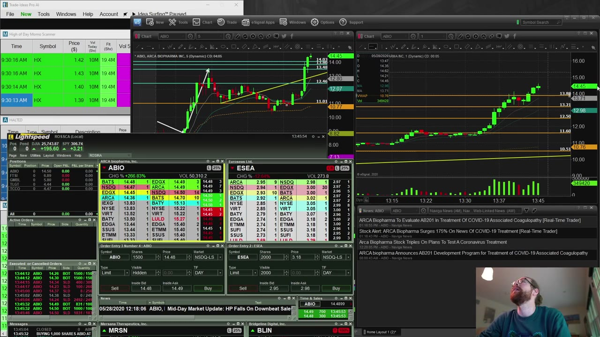

**图怎么看：**

- 画面中，可以看到ABIO股票的价格在突破重要水平后出现回调。
- 图表显示了ABIO股票的K线图，其中包含了重要的水平线和趋势线。
- 通过观察图表中的K线形态和成交量变化，可以判断出市场情绪的变化。
- 在突破回调过程中，设置合理的止损点非常重要，以防止进一步的损失。

### 关键内容

- 讲师在ABIO股票上进行了多次突破交易，例如在12.50美元附近设置止损，等待第一分钟蜡烛突破新高。
- 一次突破交易发生在14.20美元附近，但股票未能保持半美元支撑，导致损失。
- 讲师利用回调机会进行交易，例如在15.50美元附近设置买入订单，等待突破16美元。
- 一次回调交易发生在14.21美元附近，但股票未能突破16美元，导致损失。
- 讲师强调了风险控制的重要性，例如在突破交易中设置半美元止损，在回调交易中设置硬止损。
- 一次交易中，股票从15.90美元跌至14.10美元，导致较大损失。
- 当股票出现假停盘时，会立即进行回调交易，例如在1550美元附近出现假停盘，导致快速反弹。
- 设置订单时使用快捷键（Shift 1）以快速下单，监控股票价格，寻找突破和回调的机会。
- 假停盘后的快速反弹和从15.90美元跌至14.10美元的剧烈下跌，体现了交易中的心理因素和操作步骤。
- 讲师通过实时交易展示了多种交易策略，包括突破和回调交易，强调了风险控制的重要性，例如在突破交易中设置半美元止损，在回调交易中设置硬止损。
- 当股票出现假停盘时，会立即进行回调交易，这要求交易者具备敏锐的市场感知力和快速决策能力，以抓住稍纵即逝的交易机会。
- 在突破交易中，观察价格是否突破关键阻力位，如16美元，等待完美入场时机，这需要交易者具备耐心和对市场趋势的深刻理解。
- 在回调交易中，设置订单时使用快捷键（Shift 1）以快速下单，监控股票价格，寻找突破和回调的机会，这提高了交易效率，但也增加了操作失误的风险。
- 设置止损点时，需考虑心理支撑位的选择，过高或过低的选择都可能影响交易结果，这要求交易者具备良好的心理素质和市场分析能力

### 分析与执行顺序

1. 设置订单时使用快捷键（Shift 1）以快速下单。
2. 监控股票价格，寻找突破和回调的机会。
3. 在突破交易中设置半美元止损，在回调交易中设置硬止损。
4. 当股票出现假停盘时，立即进行回调交易。
5. 观察价格是否突破关键阻力位，如16美元，等待完美入场时机。
6. 在突破交易后，观察价格是否回撤到心理支撑位，如16.75美元，决定是否加仓。

### 案例与细节

- 在14.20美元附近设置止损，等待第一分钟蜡烛突破新高。
- 在15.50美元附近设置买入订单，等待突破16美元。
- 从15.90美元跌至14.10美元，导致较大损失。
- 假停盘发生在1550美元附近，导致快速反弹。
- 在一次突破交易中，股票从15.90美元跌至14.10美元，导致较大损失，这说明即使设置了止损，市场波动也可能导致亏损。
- 假停盘发生在1550美元附近，导致快速反弹，这表明市场情绪和心理因素对交易结果的影响巨大，交易者需要对此有所准备。
- 在一次回档交易中，止损设在50，价格弹回到12，等待完美入场时机有时会错失交易机会，这说明耐心等待最佳入场时机的重要性。
- 价格突破16后，再次回档，这次止损设在16.41，价格回档到16，然后再次弹升，最终价格突破16，获得48,000美元收益，这展示了如何利用止损来控制风险并抓住盈利机会。
- 价格回撤到16.50，再次尝试突破17，观察价格是否突破17，如果突破，可以加仓至17.60，这说明在突破后继续观察价格走势的重要性

### 风险与边界

- 股票未能突破关键阻力位，如16美元，可能导致损失。
- 假停盘后未能反弹，可能导致错过交易机会。
- 心理支撑位的选择需要谨慎，过高或过低的选择都可能影响交易结果。
- 录制年代限制，平台、监管、税务和经纪商条件只能表述为历史录制内容。
- 假停盘后未能反弹，可能导致错过交易机会，这要求交易者具备敏锐的市场感知力和快速决策能力。
- 心理支撑位的选择过高或过低，可能导致交易失误，这要求交易者具备良好的心理素质和市场分析能力。
- 录制年代限制，平台、监管、税务和经纪商条件只能表述为历史录制内容，这可能影响当前交易策略的有效性。
- 市场情绪和心理因素对交易结果的影响巨大，这要求交易者具备良好的心理素质和市场分析能力，否则容易受到情绪波动的影响

### 复盘问题

- 在突破交易中，如何设置止损以控制风险？
- 当股票出现假停盘时，如何迅速做出反应？
- 如何在回调交易中选择合适的止损点？
- 在突破交易后，如何判断是否加仓？

---
