# Advanced Mentor Sessions：2021

> 12 场，合计 10.7 小时。返回 [Advanced Mentor Sessions 目录](../README.md)。

## v0810：Hakenashi 棄噪蜡烛的应用

> 日期：2021-03-18　·　时长：00:35:52

**本场重点：** Hakenashi 棄噪蜡烛通过平滑价格波动来减少市场噪音，适用于趋势交易。

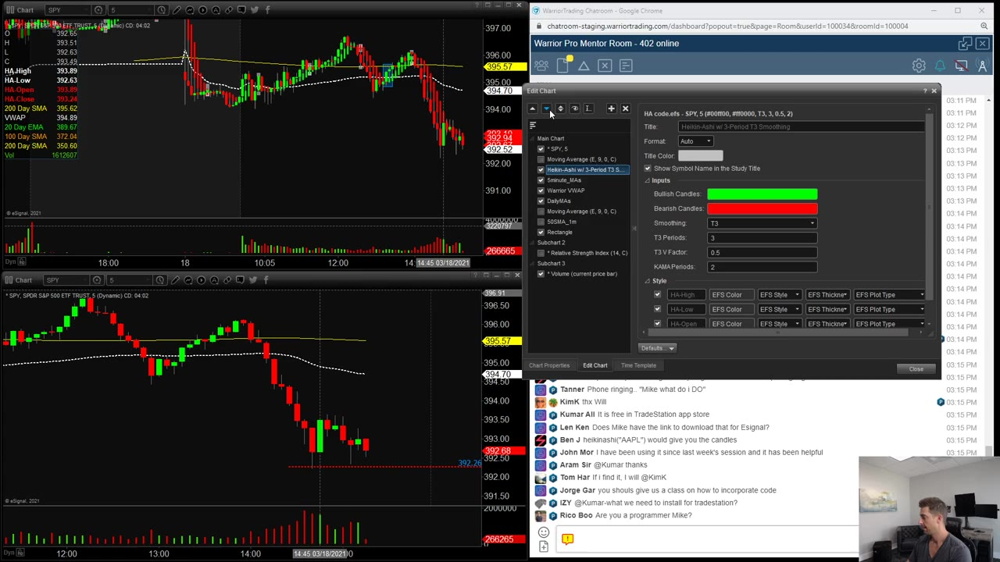

**图怎么看：**

- 在图中，我们可以看到REI股票的价格走势，使用了Heikin Ashi蜡烛图。
- 图中显示了200日简单移动平均线（SMA）和200日指数移动平均线（EMA），帮助识别趋势。
- 成交量柱的高度反映对应周期内的总成交量；红绿着色通常跟随价格柱的涨跌规则，不能直接拆成两种方向的主动成交。
- Heikin Ashi蜡烛图通过平滑价格波动来减少市场噪音，适用于趋势交易。

### 关键内容

- Hakenashi 蜡烛通过计算平均交易价格来减少市场噪音。
- 它平滑了价格波动，使得趋势更明显。
- Hakenashi 蜡烛在五分钟图表上显示出比普通蜡烛更准确的趋势。
- 蜡烛的wick（影线）变化可以指示趋势反转。
- 使用 Hakenashi 蜡烛可以帮助识别趋势的开始和结束。
- 它可以作为趋势交易的辅助工具，而不是主要依据。
- Hakenashi 蜡烛在快速移动股票上表现更好。
- 它可以帮助减少恐慌性交易，提供更清晰的买卖信号。
- Hakenashi 蜡烛适用于多种股票和时间框架，但需要一定的经验。
- 它可以帮助新手投资者更好地跟随趋势

### 分析与执行顺序

1. 首先，了解 Hakenashi 蜡烛的基本原理，即通过计算平均交易价格来减少噪音。
2. 然后，观察蜡烛形态的变化，特别是 wick 的长度和方向。
3. 接着，利用 Hakenashi 蜡烛识别趋势的开始和结束。
4. 最后，结合其他技术指标进行综合判断，以提高准确性。
5. 在实际操作中，需要根据不同的股票和时间框架调整策略。
6. 对于快速移动的股票，Hakenashi 蜡烛的表现更为明显。
7. 新手投资者可以通过 Hakenashi 蜡烛更好地跟随趋势

### 案例与细节

- UPST 在开盘后保持绿色，直到 WIC（影线）翻转到红色，表明趋势可能反转。
- CPNG 在一天内表现出非常清晰的红绿灯信号，帮助确定买入和卖出时机。
- TKAT 在开盘后出现假突破，随后回落，但 Hakenashi 蜡烛显示了明确的买入信号。
- PDD 在开盘后出现大下影线，表明可能进入空头趋势。
- TRVG 在日线图上表现出良好的趋势，帮助识别买入和卖出点

### 风险与边界

- Hakenashi 蜡烛可能无法捕捉到快速变动的市场中的即时趋势。
- 它更适合用于较长时间框架的趋势交易，而非日内交易。
- 新手投资者可能需要更多时间来熟悉 Hakenashi 蜡烛的使用方法。
- Hakenashi 蜡烛的平滑效果可能导致错过某些关键的买卖点。
- 录制年代限制为 2021 年，可能不适用于当前市场的快速变化

### 复盘问题

- Hakenashi 蜡烛在哪些情况下表现最佳？
- 如何结合其他技术指标来提高 Hakenashi 蜡烛的准确性？
- 对于快速变动的股票，Hakenashi 蜡烛是否仍然有效？

---

## v0811：如何正确地买回撤

> 日期：2021　·　时长：00:48:08

**本场重点：** 识别强势股票在活跃趋势中的回撤买入时机，注意市场整体趋势的变化。

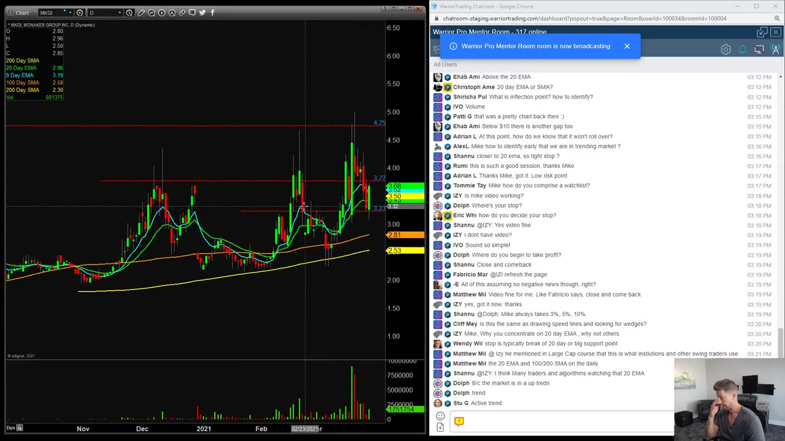

**图怎么看：**

- 图中显示了MKGI股票的价格走势，包括200日均线、9日EMA、100日均线等技术指标。
- 可以看到股价在上升过程中出现了一些回调，但整体趋势仍然向上。
- 成交量柱的高度反映对应周期内的总成交量；红绿着色通常跟随价格柱的涨跌规则，不能直接拆成两种方向的主动成交。
- 成交量适合与前序时段或历史基准比较参与程度，但仅凭柱体颜色无法判断哪一方主动，也不能由此推断下一步方向。

### 关键内容

- 识别强势股票在活跃趋势中的回撤买入时机是关键。
- 市场处于弱势时，不应盲目买入回撤。
- 使用20日均线作为参考点，但有时不会完全回撤到20日均线。
- 在市场活跃趋势中，可以买入强势股票的回撤。
- 市场突破20日均线后，应谨慎考虑是否继续买入。
- 在弱市中，应等待市场稳定后再考虑买入。
- 使用9日和20日移动平均线来管理买入时机。
- 市场整体趋势变化时，应调整买入策略。
- 在特定情况下，可以买入价值股以应对市场波动
- 在市场活跃趋势中，识别强势股票的回撤买入时机至关重要，因为这些股票通常会在市场回调时率先反弹。
- 使用9日和20日移动平均线来管理买入时机，可以降低风险并提高交易成功率，尤其是在市场波动较大时。
- 在市场整体趋势发生变化时，需要重新评估买入策略，避免盲目跟随市场波动而做出错误决策。
- 当市场出现极端波动时，应更加谨慎地选择买入时机，避免因市场快速反转而遭受损失。
- 在弱市中，应等待市场稳定后再考虑买入，避免因市场持续下跌而遭受更大损失

### 分析与执行顺序

1. 首先，识别市场是否处于活跃趋势。
2. 其次，确定股票是否属于强势股票。
3. 然后，在股票回撤时，考虑是否买入。
4. 接着，使用20日均线作为参考点，判断是否买入。
5. 最后，确认市场整体趋势是否支持买入行动

### 案例与细节

- ticker：F-SEL；price：11；volume：650；action：当股票回撤到11美元时，买入20%或更多。；date：2021年2月
- ticker：NIO；price：10；volume：0；action：当股票回撤到10美元时，买入20%。；date：2021年2月
- ticker：LGHL；price：20；volume：100；action：当股票回撤到20美元时，买入20%。；date：2021年2月
- ticker：FISV；price：4；volume：0；action：当股票回撤到4美元时，买入20%。；date：2021年2月
- ticker：MKGI；price：320；volume：0；action：当股票回撤到320美元时，买入20%。；date：2021年2月
- ticker：F-SEL；price：11；volume：650；action：当股票回撤到11美元时，买入20%或更多。这表明在活跃趋势中，可以利用强势股票的回撤进行低风险买入。；date：2021年2月
- ticker：NIO；price：10；volume：0；action：当股票回撤到10美元时，买入20%。这说明在市场活跃趋势中，可以利用强势股票的回撤进行低风险买入。；date：221年2月
- ticker：LGHL；price：20；volume：100；action：当股票回撤到20美元时，买入20%。这表明在市场活跃趋势中，可以利用强势股票的回撤进行低风险买入。；date：2021年2月

### 风险与边界

- 市场整体趋势变化时，买入策略可能失效。
- 在弱市中，买入回撤可能面临更大风险。
- 使用9日和20日移动平均线买入时，需注意市场波动。
- 录制年代限制，信息适用于2021年市场情况
- 如果市场整体趋势发生变化，使用9日和20日移动平均线买入可能会失效，因为此时市场可能已经进入新的趋势阶段。
- 在弱市中，买入回撤可能会面临更大风险，因为市场可能持续下跌，导致买入的股票无法反弹。
- 使用9日和20日移动平均线买入时，需要密切关注市场波动，避免因市场快速反转而遭受损失。
- 录制年代限制，信息适用于2021年市场情况，因此在当前市场环境下，需要根据实际情况调整买入策略

### 复盘问题

- 如何识别市场是否处于活跃趋势？
- 在什么情况下可以买入回撤？
- 如何使用20日均线来管理买入时机？
- 在弱市中，应该如何调整买入策略？
- 如何判断股票是否属于强势股票？

---

## v0812：通过痛苦回调成功持有

> 日期：2021　·　时长：01:09:46

**本场重点：** 通过痛苦回调成功持有的策略，适用于有一定经验的投资者，不适合新手。

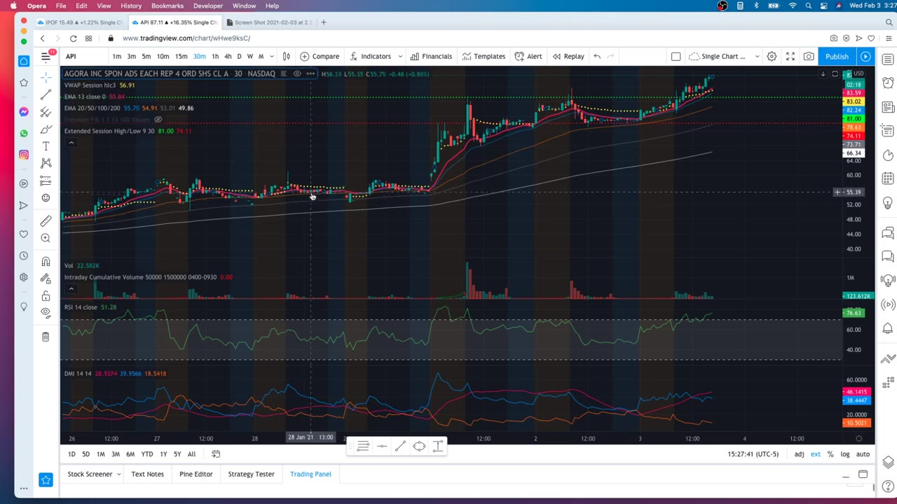

**图怎么看：**

- 画面中，我们可以看到Workhorse Group Inc.的股价在2021年1月期间经历了一次明显的上涨，随后出现了一个回调。
- 成交量柱的高度反映对应周期内的总成交量；红绿着色通常跟随价格柱的涨跌规则，不能直接拆成两种方向的主动成交。
- 水平线E标记的位置显示了股价在回调过程中的重要支撑位。
- 通过观察这些图表，可以理解到在股价回调时，投资者需要关注支撑位以做出决策。

### 关键内容

- 通过观察股票的历史表现和技术指标，可以判断是否应该继续持有。
- 在回调期间，需要耐心等待股票达到反应低点，然后设置止损。
- 使用ADX指标可以帮助判断趋势强度，从而决定是否继续持有。
- 在回调期间，需要关注成交量的变化，以判断是否继续持有。
- 通过观察股票的每日和周线图，可以更好地判断是否继续持有。
- 在回调期间，需要保持冷静，避免因情绪波动而做出错误决策。
- 在回调期间，需要关注市场整体趋势，以判断是否继续持有

### 分析与执行顺序

1. 首先，观察股票的每日和周线图，确定是否符合交易条件。
2. 其次，使用ADX指标判断趋势强度，确定是否继续持有。
3. 再次，观察股票的成交量变化，判断是否继续持有。
4. 然后，设定止损点，等待股票达到反应低点。
5. 最后，根据市场整体趋势和股票表现，决定是否继续持有。
6. 在整个过程中，需要保持冷静，避免因情绪波动而做出错误决策。
7. 在回调期间，需要密切关注市场变化，及时调整交易策略

### 案例与细节

- API股票在突破后出现回调，但成交量较低，表明市场可能还在支撑位附近。
- 使用ADX指标显示，API股票的趋势正在减弱，表明可能需要减仓。
- 在回调期间，API股票测试了60美元的关键支撑位，但未能突破，表明可能需要减仓。
- 观察到API股票在回调期间成交量减少，表明市场可能正在寻找新的平衡点。

### 风险与边界

- 在PDT规则下，投资者每天只能进行三次日内交易，这增加了交易难度。
- 在回调期间，如果市场突然出现大幅波动，可能会导致亏损。
- 在PDT规则下，投资者需要控制交易规模，以避免频繁触发止损。
- 在回调期间，如果市场整体趋势发生变化，可能会导致亏损。
- 在PDT规则下，投资者需要制定详细的交易计划，以避免亏损

### 复盘问题

- 在回调期间，如何判断是否继续持有？
- 在PDT规则下，如何制定详细的交易计划？
- 在回调期间，如何避免因情绪波动而做出错误决策？

---

## v0813：围绕核心持仓交易

> 日期：2021　·　时长：00:43:32

**本场重点：** 围绕核心持仓交易是一种高级策略，通过在核心持仓周围买卖股票来最大化利润或产生现金流。该策略适用于多种市场环境。

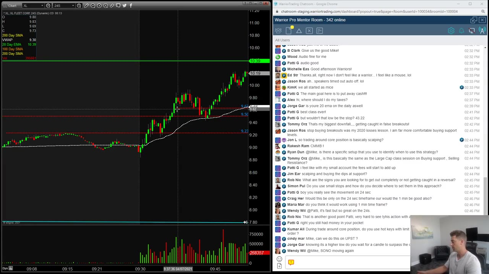

**图怎么看：**

- 图表显示了XL, XL Fleet Corp. 24s的K线图，其中包含了20日简单移动平均线（SMA）、20日指数移动平均线（EMA）和100日SMA。
- 价格在9.50到10.50之间波动，显示出明显的上升趋势。
- 成交量柱的高度反映对应周期内的总成交量；红绿着色通常跟随价格柱的涨跌规则，不能直接拆成两种方向的主动成交。
- 图表右侧的聊天室显示了参与者之间的讨论，包括对策略的讨论和对价格走势的分析。

### 关键内容

- 围绕核心持仓交易意味着在持有核心仓位的同时，不断买入和卖出新股份，直到交易完全结束。
- 该策略适用于横向或波动市场，以及试图突破但尚未完全突破的情况。
- 通过围绕核心持仓交易，可以避免虚假突破，从而减少被套牢的风险。
- 每次股价回调时，买入支撑位，然后在高点卖出，以此积累利润。
- 如果股价未能突破，也可以通过这种方式获利，而不是等待突破后再卖出。
- 该策略需要对股票的走势有深入理解，并能够准确预测价格走势。
- 围绕核心持仓交易可以应用于日间交易和摆动交易。
- 该策略需要频繁练习，以适应不同的市场情况。
- 该策略可以增加交易者的收益，尤其是在市场波动较大时。
- 该策略需要使用技术分析工具，如支撑位、阻力位和移动平均线等。

### 分析与执行顺序

1. 首先，观察股票的价格走势，寻找微小的回调机会。
2. 当股票出现微小回调时，买入支撑位，然后在高点卖出。
3. 如果股票继续回调，再次买入支撑位，然后在高点卖出。
4. 重复上述过程，直到股票突破关键水平。
5. 当股票突破关键水平时，根据突破方向调整仓位。
6. 如果股票未能突破，继续围绕核心持仓进行交易，直到市场重新调整。
7. 在整个过程中，始终关注支撑位和阻力位的变化。

### 案例与细节

- ticker：VIAC；price_action：股票在突破前测试支撑位，然后反弹。；strategy：围绕核心持仓交易，买入支撑位，然后在高点卖出。；profit：在突破前累计了约75美分到1美元的利润。；time_frame：日间交易
- ticker：TRVG；price_action：股票在突破前测试支撑位，然后反弹。；strategy：围绕核心持仓交易，买入支撑位，然后在高点卖出。；profit：在突破前累计了约75美分到1美元的利润。；time_frame：摆动交易
- ticker：POWW；price_action：股票在突破前测试支撑位，然后反弹。；strategy：围绕核心持仓交易，买入支撑位，然后在高点卖出。；profit：在突破前累计了约75美分到1美元的利润。；time_frame：日间交易

### 风险与边界

- 该策略依赖于对股票走势的准确预测，因此存在预测错误的风险。
- 该策略需要频繁交易，可能会增加交易成本。
- 该策略适用于横向或波动市场，不适合单边趋势明显的市场。
- 该策略需要对技术分析工具熟练掌握，否则可能无法有效应用。
- 该策略需要大量实践，才能熟练掌握和应用。

### 复盘问题

- 围绕核心持仓交易的具体步骤是什么？
- 如何确定支撑位和阻力位？
- 该策略适用于哪些类型的市场？
- 如何评估是否应该退出核心持仓？
- 该策略有哪些潜在的风险？

---

## v0814：周度摆动交易更新

> 日期：2021　·　时长：00:55:10

**本场重点：** 市场波动性增加，需要灵活调整策略以应对不同情况。

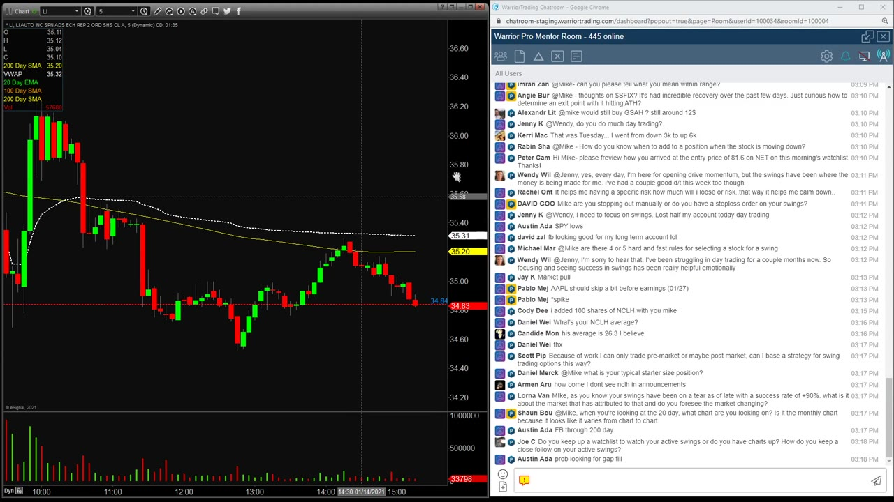

**图怎么看：**

- 画面中，我们可以看到市场波动性增加，价格在短时间内经历了大幅波动。
- 均线（如20日均线）显示出市场的趋势方向，帮助投资者判断当前的趋势。
- 成交量柱的高度反映对应周期内的总成交量；红绿着色通常跟随价格柱的涨跌规则，不能直接拆成两种方向的主动成交。
- 通过观察这些图表，投资者可以更好地制定和调整他们的交易策略。

### 关键内容

- 市场最近有些波动，主要是由于上周的上涨后出现的消化期。
- 摆动交易策略强调在价格确认前耐心等待，避免过早退出。
- 技术面强劲的股票更容易形成有效的摆动交易模式。
- 摆动交易者需要关注支撑位和阻力位，以决定何时买入和卖出。
- 市场环境变化时，摆动交易者应调整策略以适应新的市场趋势。
- 摆动交易者通常会在价格达到高点时减少仓位，以控制风险。
- 摆动交易者需要密切关注市场新闻和事件，以识别潜在的交易机会。
- 摆动交易者应根据市场表现调整持仓大小，以适应不同的市场环境。
- 摆动交易者需要定期进行市场更新，以保持策略的有效性。

### 分析与执行顺序

1. 讲师首先回顾了上周的市场表现，指出市场消化期的特点。
2. 然后，讲师介绍了摆动交易的基本原则，强调耐心等待价格确认的重要性。
3. 接着，讲师分析了当前市场状况，指出市场可能进入消化期。
4. 讲师还提到了一些具体的股票，如NCLH和GE，展示了如何应用摆动交易策略。
5. 最后，讲师总结了本周的市场更新，并强调了定期进行市场更新的重要性。

### 案例与细节

- NCLH：在2632买入，计划进一步加仓。
- GE：在12美元买入，随后在10美元附近卖出。
- F-cell：在2040买入，设置止损在2040。
- TIGR：考虑在10美元买入，但最终未执行。
- NET：图表加载失败，但显示技术面强劲。

### 风险与边界

- 市场环境变化可能导致摆动交易策略失效，需要及时调整。
- 过度依赖技术指标可能导致错过重要的市场信号。
- 市场波动性增加时，摆动交易者需要更加谨慎地管理风险。
- 录制于2021年，部分市场条件和策略可能已发生变化。

### 复盘问题

- 本周市场的主要特点是什么？
- 摆动交易者如何应对市场的消化期？
- 讲师提到了哪些具体的股票操作？
- 摆动交易者在市场波动性增加时应采取哪些措施？

---

## v0815：日内摆动交易管理

> 日期：2021　·　时长：00:59:59

**本场重点：** 识别潜在交易机会，设定止损策略，控制仓位大小。

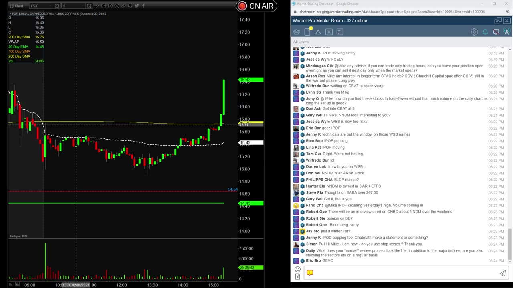

**图怎么看：**

- 在1259秒时，Walt Disney公司的股价在盘中波动剧烈。
- 可以看到成交量柱显示了市场的买卖活动。
- 水平线表示了支撑和阻力位，帮助识别潜在的交易机会。
- 图表上的K线形态有助于分析价格趋势和确认交易信号。

### 关键内容

- 讲师提到CBAT股票表现良好，突破支撑位，考虑买入。
- 讲师强调在摆动交易中，当股价突破支撑位时，应考虑卖出。
- 讲师表示不会使用跟踪止损，而是通过技术分析来管理风险。
- 讲师提到GE股票表现良好，但市场已连续上涨四天，决定减少仓位。
- 讲师分享了如何根据20日均线和支撑位来管理风险。
- 讲师指出WIMMY股票是低质量股票，波动较大，需快速止损。
- 讲师提到如何利用VWAP（成交量加权平均价格）来设定买入点。
- 讲师强调摆动交易需要快速决策，不适合长时间持有。
- 讲师表示会根据市场情况调整仓位大小，以适应不同市场环境。
- 讲师提到摆动交易有助于培养机械化的交易习惯，提高交易效率。

### 分析与执行顺序

1. 讲师首先回顾了CBAT股票的表现，确认突破支撑位后考虑买入。
2. 然后，讲师讨论了如何在摆动交易中设定止损策略，特别是当股价突破支撑位时。
3. 接着，讲师分享了如何根据20日均线和支撑位来管理风险，确保不会过度亏损。
4. 随后，讲师提到了GE股票的表现，并决定减少仓位，因为市场已连续上涨四天。
5. 最后，讲师强调了如何利用VWAP来设定买入点，并分享了如何根据市场情况调整仓位大小。

### 案例与细节

- CBAT：突破支撑位，考虑买入。
- GE：市场连续上涨四天，决定减少仓位。
- WIMMY：低质量股票，波动大，需快速止损。
- VFF：接近目标价，考虑卖出。
- NCLH：疫苗接种进展良好，继续持有。
- WIME：突破支撑位，考虑买入，但需注意风险控制。

### 风险与边界

- 摆动交易依赖于市场波动，如果市场突然变得平静，可能会导致亏损。
- 讲师提到的止损策略可能在极端市场条件下失效，需要灵活调整。
- 录制于2021年，当前市场环境可能与当时有所不同，需谨慎应用。
- 讲师提到的仓位管理方法适用于特定市场环境，不同市场可能需要不同的策略。
- 摆动交易需要快速决策，如果决策过程过慢，可能会错失最佳交易时机。

### 复盘问题

- CBAT股票突破支撑位时，您是如何判断是否应该买入的？
- 在摆动交易中，您是如何设定止损点的？
- 您是如何根据市场情况调整仓位大小的？
- 您提到的VWAP（成交量加权平均价格）是如何帮助您确定买入点的？
- 摆动交易需要快速决策，您是如何确保自己能够迅速做出正确决策的？

---

## v0816：应对市场下跌策略

> 日期：2021　·　时长：00:53:51

**本场重点：** 了解如何在市场下跌时管理仓位，抓住机会而非恐慌卖出。

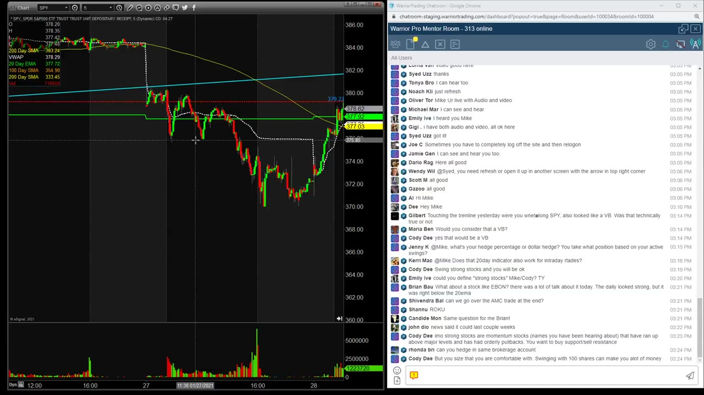

**图怎么看：**

- GE's stock price is showing a significant upward trend with the 20-day EMA and 100-day SMA crossing above each other.
- The 20-day EMA is at 8.96, the 100-day SMA is at 7.03, and the 200-day SMA is at 7.36.
- The stock price has reached a new high of 14.00 on the chart.
- The volume bar shows a peak in trading activity around the 14.00 level.

### 关键内容

- 市场下跌时，应关注支撑位和趋势线，避免恐慌性卖出。
- 使用20日移动平均线作为关键支撑位，判断是否继续持有。
- 强股在市场下跌时表现更好，应重点关注。
- 当市场突破20日均线时，应考虑减仓或卖出。
- 保持冷静，根据市场反应调整策略。
- 利用SPY进行对冲，减少市场波动带来的影响。
- 在市场下跌时，应关注具体股票的表现，而不是整体市场。
- 市场下跌后，应等待反弹机会，而不是立即卖出。
- 保持纪律，遵循既定交易计划，避免情绪化决策
- 观察市场在20日均线以下的硬性下跌，通常意味着需要减仓或卖出，因为这表明市场趋势可能已经改变。
- 当市场出现快速下跌时，应迅速评估支撑位和趋势线，以决定是否继续持有仓位，避免因恐慌而做出错误的卖出决定。
- 在市场下跌过程中，密切关注特定股票的表现，尤其是那些具有强劲技术指标和高成交量的股票，这些股票往往能在市场下跌时表现得更好。
- 当市场突破20日均线时，应考虑减仓或卖出，因为这通常标志着市场趋势的逆转，需要重新评估仓位。
- 保持冷静，根据市场反应调整策略，而不是被情绪驱动，这有助于在市场下跌时做出更明智的决策。

### 分析与执行顺序

1. 观察市场开盘情况，判断是否出现硬性下跌。
2. 确认支撑位和趋势线，决定是否继续持有。
3. 使用SPY进行对冲，减少市场波动带来的影响。
4. 关注具体股票的表现，而不是整体市场。
5. 在市场下跌时，保持冷静，根据市场反应调整策略。
6. 等待市场反弹机会，而不是立即卖出

### 案例与细节

- F-cell：强股在市场下跌时表现更好，应重点关注。
- JPM：当股票跌破20日均线时，应考虑减仓或卖出。
- GE：强股在市场下跌时表现更好，应重点关注。
- EBON：利用短期挤压机会，尝试在20日均线附近买入。
- NCLH：在市场下跌时，应关注具体股票的表现，而不是整体市场。
- F-cell：强股在市场下跌时表现更好，应重点关注。例如，F-cell在市场下跌时仍能维持强劲的上涨势头，显示出其强大的市场吸引力和资金流入，因此在市场下跌时应继续持有。
- JPM：当股票跌破20日均线时，应考虑减仓或卖出。如JPM在某次市场下跌中跌破了20日均线，随后出现了大幅回调，此时应考虑减仓或卖出，以避免进一步的损失。
- GE：强股在市场下跌时表现更好，应重点关注。GE在市场下跌时仍能保持较高的成交量和活跃度，显示出其作为强股的韧性，因此在市场下跌时应继续持有。
- EBON：利用短期挤压机会，尝试在20日均线附近买入。EBON在市场下跌时出现短期挤压，价格在20日均线附近波动，此时可尝试买入，以捕捉反弹机会。
- NCLH：在市场下跌时，应关注具体股票的表现，而不是整体市场。如NCLH在市场下跌时表现不佳，但在某次市场反弹中表现出色，此时应关注其具体表现，而不是整体市场的走势。

### 风险与边界

- 市场持续下跌，突破20日均线，可能需要减仓或卖出。
- 市场反弹力度不足，可能需要及时止损。
- 市场波动较大，对冲策略可能无法完全抵消损失。
- 录制于2021年，部分市场规则和条件已发生变化。
- 市场下跌时，情绪化决策可能导致错误的买卖时机
- 市场持续下跌，突破20日均线，可能需要减仓或卖出。如果市场连续多日下跌并突破20日均线，表明市场趋势已经发生根本变化，此时应果断减仓或卖出，以避免进一步的损失。
- 市场反弹力度不足，可能需要及时止损。如果市场在下跌后出现短暂反弹，但力度不足，未能恢复到之前的水平，此时应及时止损，避免被市场再次拖累。
- 市场波动较大，对冲策略可能无法完全抵消损失。虽然使用SPY进行对冲可以减少市场波动带来的影响，但在市场波动较大的情况下，对冲策略可能无法完全抵消损失，投资者仍需谨慎对待。
- 录制于2021年，部分市场规则和条件已发生变化。虽然课程中的策略和方法仍然适用，但投资者需要注意市场规则和条件的变化，以确保策略的有效性。

### 复盘问题

- 在市场下跌时，如何判断是否继续持有股票？
- 如何利用SPY进行对冲，减少市场波动带来的影响？
- 在市场下跌时，哪些股票表现较好，可以重点关注？

---

## v0817：预市支持与阻力

> 日期：2021　·　时长：00:40:53

**本场重点：** 通过预市价格行动确定支撑与阻力水平，帮助判断股票走势。

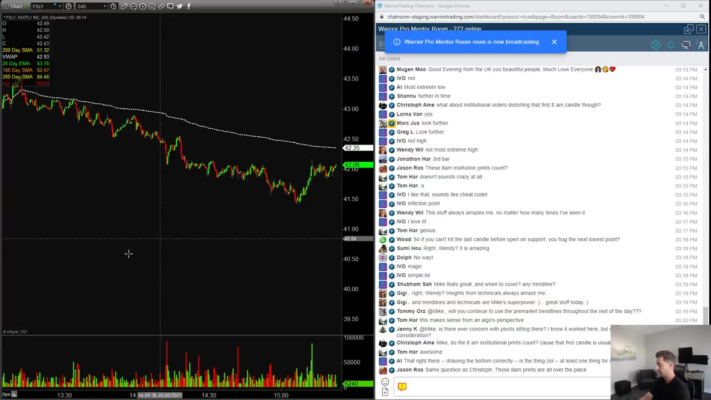

**图怎么看：**

- 在 Fastly, Inc. (FSLY) 的日线图中，可以看到支撑和阻力水平。
- 支撑水平位于42.50附近，阻力水平位于43.00附近。
- 市场在支撑和阻力水平之间波动，显示出价格的稳定性。
- 这些水平对于预测未来的市场趋势具有重要意义。

### 关键内容

- 使用8点开盘前的最高和最低价格作为支撑与阻力线的起点。
- 结合开盘前的最后一根K线，确保支撑与阻力线的准确性。
- 支撑与阻力线在开盘后验证其有效性。
- 利用这些线预测股票的走势，提高交易决策的准确性。
- 在开盘后使用支撑与阻力线进行交易，而不是等待突破。
- 对于小盘股，支撑与阻力线尤为重要。
- 开盘前的价格波动对支撑与阻力线的形成至关重要。
- 支撑与阻力线需要结合其他技术指标进行综合判断

### 分析与执行顺序

1. 首先，关注8点开盘前的价格波动，确定最高和最低价格。
2. 然后，结合开盘前的最后一根K线，绘制支撑与阻力线。
3. 开盘后，观察股票价格是否突破支撑与阻力线。
4. 根据支撑与阻力线的突破情况，决定是否进行交易。
5. 对于小盘股，支撑与阻力线的使用更为关键。
6. 开盘前的价格波动是绘制支撑与阻力线的基础

### 案例与细节

- ticker：RKT；price_action：开盘前最高价为1970，最低价为1880；analysis：开盘后价格突破支撑线，确认短空策略；result：成功执行短空策略
- ticker：VERU；price_action：开盘前最高价为1100，最低价为1080；analysis：开盘后价格未能突破阻力线，确认短空策略；result：成功执行短空策略
- ticker：FSLY；price_action：开盘前最高价为48，最低价为47；analysis：开盘后价格突破支撑线，确认买入策略；result：成功执行买入策略
- ticker：PRPO；price_action：开盘前最高价为330，最低价为328；analysis：开盘后价格突破支撑线，确认短空策略；result：成功执行短空策略

### 风险与边界

- 开盘前的价格波动可能受到市场情绪影响，导致支撑与阻力线失效。
- 支撑与阻力线仅适用于开盘后的交易决策，不适合长期持有。
- 支撑与阻力线的有效性依赖于市场环境的变化，需持续监控。
- 录制于2021年，当前市场环境可能已发生变化，需谨慎应用

### 复盘问题

- 如何确定支撑与阻力线的准确起点？
- 开盘后价格突破支撑与阻力线时，应如何操作？
- 支撑与阻力线在哪些情况下可能失效？

---

## v0818：摆平仓位大小的艺术

> 日期：2021　·　时长：01:09:06

**本场重点：** 摆平仓位大小是摆平仓位大小的艺术，不是科学公式。仓位大小取决于股票特性。

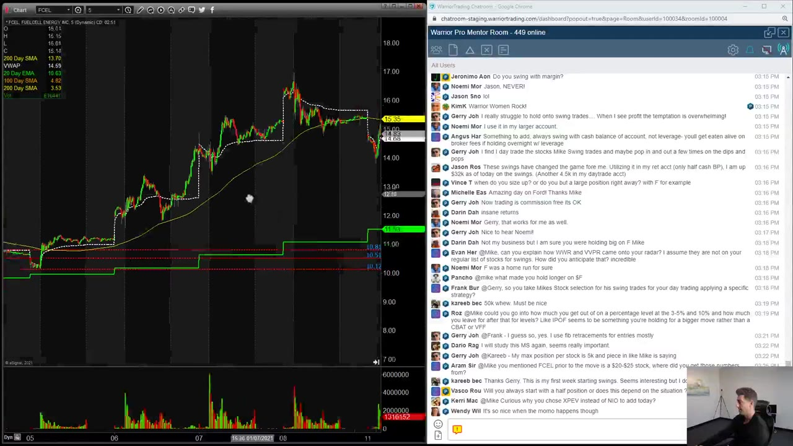

**图怎么看：**

- 在1451秒时，图表显示了股票价格的波动情况，包括均线（20日、50日、100日）、成交量柱状图以及实时交易数据。
- 可以看到股价在不同时间段内出现上升和下降的趋势，成交量柱状图反映了市场的买卖活动。
- 图表下方的时间轴显示了日期和时间，帮助投资者了解市场动态。
- 右侧聊天框中有多个用户正在讨论关于股票交易策略的问题，提供了互动学习的机会。

### 关键内容

- 仓位大小不是固定的，而是根据股票特性灵活调整。
- 仓位大小取决于股票的流动性、价格波动性和交易量。
- 仓位大小应基于风险控制，而不是机械地设定固定比例。
- 仓位大小应根据股票的支撑位和阻力位来决定。
- 仓位大小应考虑市场环境和股票的强弱。
- 仓位大小应根据股票的流动性来调整。
- 仓位大小应根据股票的价格波动性来调整。
- 仓位大小应根据股票的交易量来调整。
- 仓位大小应根据股票的支撑位和阻力位来调整。
- 仓位大小应根据股票的市场表现来调整

### 分析与执行顺序

1. 讲师首先介绍了仓位大小的概念，强调这不是固定的科学公式。
2. 然后通过具体例子解释了如何根据股票特性来调整仓位大小。
3. 接着讲解了如何根据支撑位和阻力位来决定仓位大小。
4. 最后强调了仓位大小应根据市场环境和股票表现来调整。
5. 讲师还提到了如何根据股票的流动性来调整仓位大小。
6. 讲师还提到了如何根据股票的价格波动性来调整仓位大小。
7. 讲师还提到了如何根据股票的交易量来调整仓位大小

### 案例与细节

- ticker：WWR；price：615；volume：23 million shares；position_size：25,000 shares；action：快速上涨后卖出部分利润
- ticker：F-cell；price：20；position_size：2,000 shares；action：买入后快速上涨，卖出部分利润
- ticker：IPOF；price：1480；position_size：2,000 shares；action：买入后支撑位反弹，继续持有
- ticker：XPEV；price：51；position_size：2,000 shares；action：买入后支撑位反弹，继续持有
- ticker：GSAH；price：12；position_size：2,000 shares；action：买入后支撑位反弹，继续持有

### 风险与边界

- 仓位大小应根据市场环境和股票表现来调整，这可能导致错过某些机会。
- 仓位大小应根据股票的流动性来调整，这可能影响交易策略的灵活性。
- 仓位大小应根据股票的价格波动性来调整，这可能影响盈利稳定性。
- 录制年代限制为2018-2021年，因此市场环境和股票特性可能有所不同。
- 仓位大小应根据股票的交易量来调整，这可能影响交易成本和流动性

### 复盘问题

- 如何根据股票的流动性来调整仓位大小？
- 如何根据股票的价格波动性来调整仓位大小？
- 如何根据股票的支撑位和阻力位来决定仓位大小？
- 如何根据市场环境和股票表现来调整仓位大小？
- 如何根据股票的交易量来调整仓位大小？

---

## v0819：如何交易突发新闻

> 日期：2021　·　时长：00:52:03

**本场重点：** 了解突发新闻交易的关键要素，识别有效交易机会，降低风险。

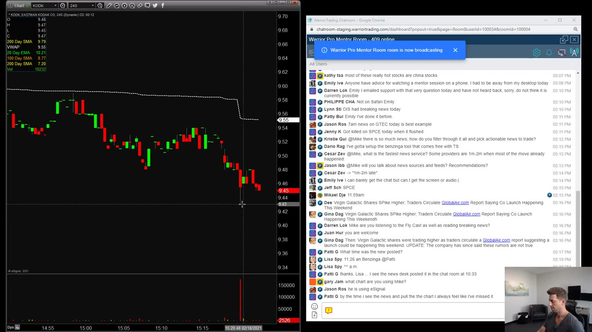

**图怎么看：**

- 在1093秒时，显示了股票CVN的图表，包括K线图、均线（200日SMA）、成交量柱状图等。
- 图表上可以看到股票价格的波动情况，以及成交量的变化。
- 通过分析这些图表，可以识别出有效的交易机会并降低风险。
- 此截图符合本场标题和重点，提供了关于如何交易突发新闻的关键信息。

### 关键内容

- 突发新闻交易通常涉及快速进出，不需要长时间持有。
- 关键在于识别新闻头条，寻找价格和成交量的异常变化。
- 需要关注成交量的突然增加和随后的价格回调。
- 价格回调是进入交易的好时机，但不应在回调后立即买入。
- 新闻头条必须真实且具有持续性，才能形成有效的交易机会。
- 使用更快的时间框架（如24秒）可以更早地识别交易机会。
- 新闻头条的真实性和持续性是判断交易是否值得进行的关键。
- 交易过程中需要监控价格和成交量的变化，以确认交易的有效性。
- 使用更快的时间框架可以更早地识别交易机会，提高交易成功率

### 分析与执行顺序

1. 首先，观察新闻头条发布后的成交量变化。
2. 其次，寻找价格的微小回调，这是进入交易的好时机。
3. 然后，确认价格和成交量的变化是否可持续。
4. 接着，使用更快的时间框架（如24秒）来识别交易机会。
5. 最后，监控价格和成交量的变化，确保交易的有效性。

### 案例与细节

- ticker：SPCE；price_action：新闻发布后成交量激增，随后价格回调，再次上涨。；volume_change：新闻发布时成交量激增，随后回调，再次上升。；entry_point：价格回调至1930附近时买入。；exit_strategy：价格继续上涨时卖出。
- ticker：CLSK；price_action：价格迅速上涨，随后回调，再次上涨。；volume_change：成交量在价格回调时减少，随后再次增加。；entry_point：价格回调至1950附近时买入。；exit_strategy：价格继续上涨时卖出。
- ticker：CCIV；price_action：价格迅速上涨，随后回调，再次上涨。；volume_change：成交量在价格回调时减少，随后再次增加。；entry_point：价格回调至1970附近时买入。；exit_strategy：价格继续上涨时卖出。

### 风险与边界

- 新闻头条的真实性是关键，虚假或无效的新闻可能导致亏损。
- 成交量的持续性不足可能影响交易的有效性。
- 使用较慢的时间框架可能错过最佳交易机会。
- 录制年代限制为2021年，市场环境和规则可能已发生变化。

### 复盘问题

- 如何识别新闻头条的真实性？
- 在什么情况下，新闻头条可能不具备持续性？
- 使用更快的时间框架有哪些优势？

---

## v0820：触发陷阱

> 日期：2021　·　时长：00:56:16

**本场重点：** 触发陷阱是技术图表上的关键阻力点，需要特别注意。它们通常出现在突破点附近，导致价格反转。了解如何识别和应对触发陷阱至关重要。

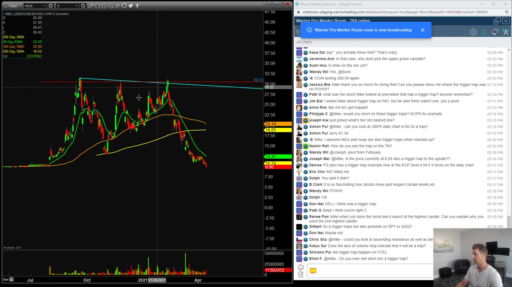

**图怎么看：**

- 在 Lordstown Motors Corp. (RIDE) 的日线图中，可以看到一个明显的触发陷阱。当价格接近红色趋势线时，出现了一个绿色蜡烛，这表明市场可能正在形成一个顶部。
- 观察到的趋势线和支撑位对于理解价格行为非常重要。在这个例子中，红色趋势线似乎是一个重要的阻力位。
- 触发陷阱通常发生在价格突破重要水平后，随后价格会回撤并测试这些水平。在这种情况下，投资者应该密切关注价格是否再次突破这些水平。
- 通过分析这些图表，投资者可以更好地理解市场动态，并做出更明智的投资决策。

### 关键内容

- 触发陷阱是趋势线和支撑点在接近位置交汇形成的阻力点。
- 触发陷阱通常出现在突破点附近，导致价格反转。
- 识别触发陷阱的关键在于趋势线和支撑点的交汇。
- 触发陷阱的存在会影响后续的价格走势，需要谨慎对待。
- 触发陷阱通常出现在日线图上，且水平距离较近。
- 触发陷阱可以出现在任何股票上，包括大型股和小型股。
- 触发陷阱的确认需要成交量的支持。
- 触发陷阱的突破通常伴随着较大的价格波动。
- 识别触发陷阱需要结合趋势线和支撑点的位置。
- 触发陷阱的存在会影响后续的交易策略，需要谨慎操作

### 分析与执行顺序

1. 讲师首先定义了触发陷阱的概念，指出它是由趋势线和支撑点在接近位置交汇形成的阻力点。
2. 然后通过KOPN股票的具体例子，展示了触发陷阱的实际应用。
3. 接着，讲师解释了如何识别触发陷阱，强调了趋势线和支撑点的交汇。
4. 最后，讲师强调了触发陷阱对后续价格走势的影响，以及如何应对触发陷阱的方法。
5. 在整个过程中，讲师多次强调了识别触发陷阱的重要性，以及它对交易策略的影响。

### 案例与细节

- ticker：KOPN；price：1150；volume：低；behavior：突破后反转；description：KOPN股票在突破1150后出现反转，表明存在触发陷阱。
- ticker：INO；price：未出现触发陷阱；volume：无；behavior：无明显突破；description：INO股票未出现触发陷阱，说明识别触发陷阱的重要性。
- ticker：RIDE；price：突破后反转；volume：低；behavior：突破后反转；description：RIDE股票在突破后出现反转，表明存在触发陷阱。
- ticker：POWW；price：未出现触发陷阱；volume：无；behavior：无明显突破；description：POWW股票未出现触发陷阱，说明识别触发陷阱的重要性。
- ticker：CRWD；price：未出现触发陷阱；volume：无；behavior：无明显突破；description：CRWD股票未出现触发陷阱，说明识别触发陷阱的重要性。

### 风险与边界

- 触发陷阱的存在并不保证价格一定会反转，需要结合其他因素进行判断。
- 触发陷阱通常出现在日线图上，但有时也会出现在其他时间框架上。
- 触发陷阱的确认需要成交量的支持，否则可能无法有效识别。
- 触发陷阱的突破通常伴随着较大的价格波动，但这种波动并不总是有利的。
- 触发陷阱的识别依赖于趋势线和支撑点的位置，需要准确绘制。
- 触发陷阱的识别和应对方法适用于所有股票，但具体操作需根据实际情况调整。

### 复盘问题

- 如何识别触发陷阱？
- 触发陷阱的存在对后续价格走势有何影响？
- 如何在实际交易中应对触发陷阱？
- 触发陷阱的确认需要哪些条件？
- 触发陷阱的突破通常会带来怎样的价格波动？

---

## v0821：成交量确认

> 日期：2021　·　时长：00:58:15

**本场重点：** 理解成交量如何预示价格走势，识别假突破和真突破，重视成交量而非单纯的价格波动。

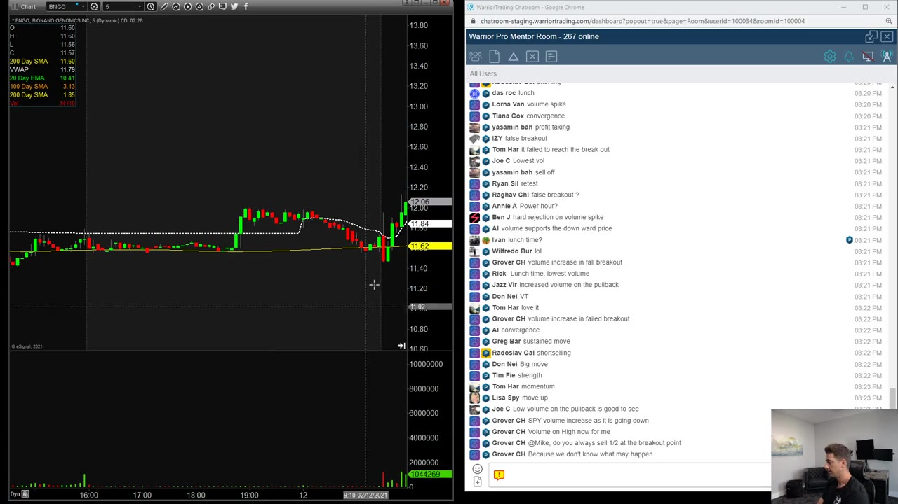

**图怎么看：**

- 画面中，我们可以看到SPY（标普500指数）的日线图，显示了价格走势和成交量。
- 成交量柱的高度反映对应周期内的总成交量；红绿着色通常跟随价格柱的涨跌规则，不能直接拆成两种方向的主动成交。
- 图中的水平线标记了支撑位和阻力位，帮助投资者判断价格可能的运动方向。
- 成交量的变化可以作为价格趋势变化的信号，特别是在价格突破重要水平时，成交量的增加通常表明市场情绪积极，可能预示着进一步上涨。

### 关键内容

- 成交量下降通常预示价格突破失败。
- 成交量增加支持价格突破。
- 成交量是判断价格走势的关键。
- 假突破通常伴随成交量下降。
- 真突破伴随成交量上升。
- 成交量确认需要结合价格走势。
- 成交量是决定是否入场的重要因素。
- 成交量确认适用于多种交易类型，如日内交易和摆动交易。
- 成交量确认需要关注成交量的变化趋势。
- 成交量确认需要结合市场整体情况

### 分析与执行顺序

1. 首先，观察成交量是否随价格上升而下降。
2. 然后，确认成交量是否在突破点附近增加。
3. 接着，结合价格走势判断突破的有效性。
4. 最后，根据成交量确认是否进行交易。
5. 在交易过程中，持续监控成交量的变化。
6. 在突破后，观察成交量是否持续增加以确认突破有效性。
7. 在交易前，确保了解市场整体情况

### 案例与细节

- ticker：SPY；price：逐渐上升；volume：逐渐下降；action：假突破；reason：成交量下降，突破失败
- ticker：BNGO；price：逐渐上升；volume：逐渐增加；action：真突破；reason：成交量增加，突破有效
- ticker：GME；price：逐渐上升；volume：先下降后上升；action：假突破；reason：成交量下降，突破失败
- ticker：RKT；price：逐渐上升；volume：逐渐增加；action：真突破；reason：成交量增加，突破有效
- ticker：REI；price：逐渐上升；volume：逐渐增加；action：真突破；reason：成交量增加，突破有效

### 风险与边界

- 成交量确认方法依赖于市场整体情况，市场变化可能导致失效。
- 成交量确认需要结合其他技术指标，单一使用可能不够准确。
- 成交量确认适用于历史数据，当前市场环境可能有所不同。
- 成交量确认需要实时监控，市场快速变化可能导致判断失误。
- 成交量确认需要结合市场情绪和新闻事件，这些因素难以量化

### 复盘问题

- 在假突破情况下，成交量下降的具体数值是多少？
- 在真突破情况下，成交量增加的具体数值是多少？
- 在交易过程中，如何区分假突破和真突破？
- 在成交量确认过程中，如何结合其他技术指标进行判断？
- 在市场快速变化的情况下，如何及时调整成交量确认策略？

---
