# Beginner Mentor Sessions：2018

> 34 场，合计 29.8 小时。返回 [Beginner Mentor Sessions 目录](../README.md)。

## v0363：初级交易者市场概览与常见问题解答

> 日期：2018-04-17　·　时长：01:07:59

**本场重点：** 解决初级交易者对市场趋势、技术分析和交易策略的疑问，核心结论是使用止损和止盈策略的重要性，适用边界为2018年4月的市场环境。

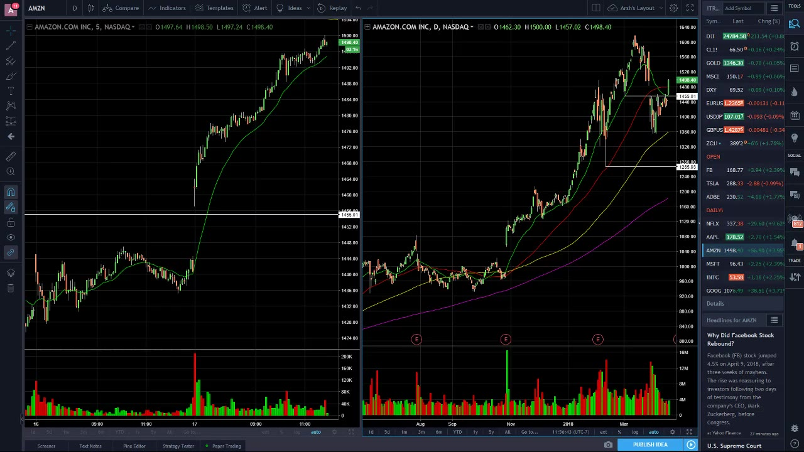

**图怎么看：**

- 在2018年4月的亚马逊股票日线图中，可以看到股价从低点逐步上升。
- 图中显示了多个重要的水平支撑位和阻力位，如E标记的位置。
- 成交量柱的高度反映对应周期内的总成交量；红绿着色通常跟随价格柱的涨跌规则，不能直接拆成两种方向的主动成交。
- 通过观察这些图表，可以理解市场情绪和投资者行为的变化。

### 关键内容

- 讲师介绍了市场整体表现，指出纳斯达克指数和标普500指数显著上涨，强调了市场趋势的重要性。市场趋势决定了交易决策的方向。
- 讲师解释了如何识别技术突破点，如Facebook和Netflix的股价上涨，以及如何利用这些信息进行交易。技术突破点是判断市场情绪的关键。
- 讲师强调了使用止损和止盈策略的重要性，特别是对于新手交易者，以控制风险并锁定利润。止损和止盈策略是风险管理的核心。
- 讲师提到了如何识别趋势线，例如使用20日移动平均线（EMA）来确定趋势方向。移动平均线帮助识别长期趋势。
- 讲师解释了如何使用止损单和止盈单，特别是在市场波动较大的情况下，确保交易安全。止损单和止盈单是保护资金的重要手段。
- 讲师讨论了如何设置止损和止盈水平，推荐使用2:1的利润目标比率，以平衡风险和收益。2:1的利润目标比率是常见的风险管理策略。
- 讲师强调了使用模拟器进行交易的重要性，以减少实际交易中的学习曲线。模拟器帮助新手熟悉交易平台的操作。
- 讲师提到了如何识别熊市蜡烛，通过分析股票价格走势来判断市场情绪。熊市蜡烛表明市场可能进入下跌趋势。
- 讲师解释了如何使用图表工具，如趋势线和支撑线，来预测股票价格的走势。趋势线和支撑线是技术分析的基础。
- 讲师讨论了如何使用技术指标，如移动平均线，来识别趋势和潜在的交易机会。移动平均线帮助识别短期和长期趋势。

### 分析与执行顺序

1. 讲师首先回顾了当天市场的整体表现，指出纳斯达克指数和标普500指数显著上涨。这表明市场处于上升趋势。
2. 接着，讲师详细解释了如何识别技术突破点，如Facebook和Netflix的股价上涨，以及如何利用这些信息进行交易。技术突破点是判断市场情绪的关键。
3. 然后，讲师介绍了如何使用止损和止盈策略，特别是对于新手交易者，以控制风险并锁定利润。止损和止盈策略是风险管理的核心。
4. 最后，讲师讨论了如何设置止损和止盈水平，推荐使用2:1的利润目标比率，以平衡风险和收益。2:1的利润目标比率是常见的风险管理策略。

### 案例与细节

- 讲师举例说明了如何识别熊市蜡烛，通过分析股票价格走势来判断市场情绪。例如，JPM股票在一天内形成了一个明显的熊市蜡烛。熊市蜡烛表明市场可能进入下跌趋势。
- 讲师举例说明了如何使用止损和止盈策略，如在Facebook和Netflix的交易中，使用止损单和止盈单来控制风险和锁定利润。止损单和止盈单是保护资金的重要手段。
- 讲师举例说明了如何使用图表工具，如趋势线和支撑线，来预测股票价格的走势。例如，在纳斯达克期货的图表中，使用绿色的20日移动平均线来确定趋势方向。趋势线和支撑线是技术分析的基础。
- 讲师举例说明了如何使用技术指标，如移动平均线，来识别趋势和潜在的交易机会。例如，在HMY股票的图表中，使用移动平均线来识别趋势和潜在的交易机会。移动平均线帮助识别短期和长期趋势。

### 风险与边界

- 讲师提醒新手交易者，使用止损和止盈策略可以减少风险，但需要根据市场情况进行调整。市场变化会影响止损和止盈策略的有效性。
- 讲师指出，使用技术指标和图表工具可以帮助识别趋势，但也需要注意市场变化和算法交易的影响。算法交易可能会影响技术指标的准确性。
- 讲师强调，使用模拟器进行交易可以减少实际交易中的学习曲线，但需要定期更新知识以适应市场变化。模拟器不能完全替代真实交易经验。
- 讲师提醒，使用止损和止盈策略可以控制风险，但在市场波动较大时，需要谨慎操作。市场波动较大时，止损和止盈策略可能无法有效控制风险。

### 复盘问题

- 如何识别技术突破点？
- 如何使用止损和止盈策略来控制风险和锁定利润？
- 如何设置止损和止盈水平？
- 如何使用图表工具来预测股票价格的走势？
- 如何使用技术指标来识别趋势和潜在的交易机会？

---

## v0364：完美交易入场点

> 日期：2018-04-24　·　时长：00:38:11

**本场重点：** 通过快速时间框架识别价格行动转折点，提高交易精准度。入场点需基于技术支撑阻力位，确保风险控制。

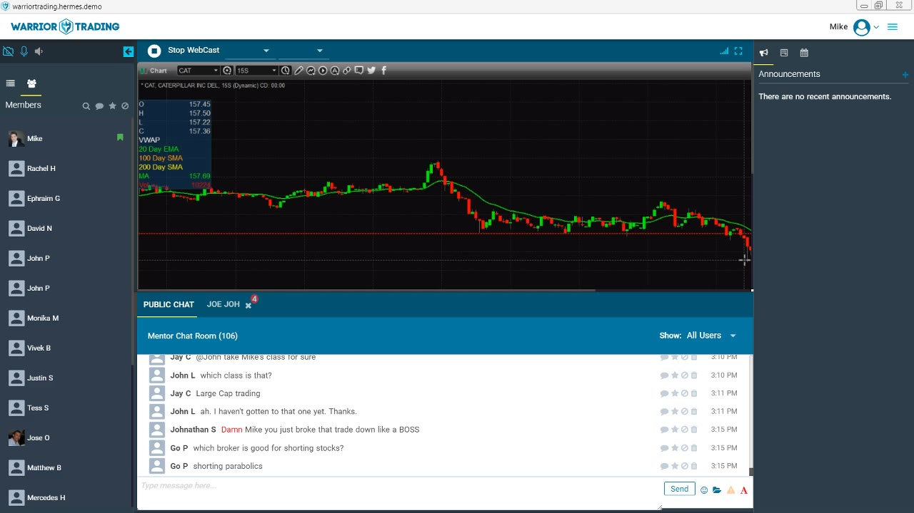

**图怎么看：**

- 图表显示了CAT股票在15分钟周期下的价格走势。
- 可以看到价格在不同时间点的开盘价（O）、最高价（H）、最低价（L）和收盘价（C）。
- 成交量（VOL）也在图表下方显示，反映了市场活动水平。
- 均线（MA）包括20日均线和200日均线，帮助识别趋势方向。

### 关键内容

- 快速时间框架（如15秒）能更清晰地显示价格行动转折点。
- 识别价格行动转折点是确定精准入场点的关键。
- 支撑阻力位是判断是否入场的重要依据。
- 快速时间框架有助于确认价格行动的反转。
- 使用支撑阻力位进行交易可以减少风险。
- 快速时间框架显示了价格行动的细节，帮助识别趋势变化。
- 快速时间框架中的低点是潜在的入场点。
- 快速时间框架中的高点是潜在的出场点。
- 快速时间框架中的成交量增加表明趋势加强。
- 快速时间框架中的成交量减少表明趋势减弱

### 分析与执行顺序

1. 讲师首先介绍了快速时间框架的重要性，强调了快速时间框架在识别价格行动转折点方面的优势。
2. 然后，讲师通过CAT股票的具体例子，展示了如何在快速时间框架中识别价格行动转折点。
3. 接着，讲师解释了如何根据支撑阻力位来判断是否入场。
4. 最后，讲师强调了使用快速时间框架进行交易的好处，包括减少风险和提高精准度。
5. 在整个过程中，讲师反复强调了快速时间框架在识别价格行动转折点方面的作用，以及如何利用这些信息进行交易决策。
6. 讲师还提到了使用TC-2000平台的局限性，并建议考虑切换到其他平台以获得更好的交易体验。
7. 讲师还强调了使用Premis平台的优势，包括访问扫描软件和设置等

### 案例与细节

- CAT股票在15秒时间框架中显示出明显的价格行动转折点，特别是当价格突破支撑阻力位时。
- 3M股票在15秒时间框架中显示出价格行动转折点，特别是在价格测试支撑阻力位后再次反弹。
- CAT股票在15秒时间框架中显示出价格行动转折点，特别是在价格测试支撑阻力位后再次反弹。

### 风险与边界

- 快速时间框架可能因市场波动而产生误导性信号，需要谨慎分析。
- 支撑阻力位的判断依赖于历史数据，未来市场情况可能有所不同。
- TC-2000平台的局限性可能导致交易决策失误，建议考虑切换到其他平台。
- 使用快速时间框架进行交易需要具备一定的市场敏感性和分析能力。
- 快速时间框架中的价格行动转折点可能因市场情绪波动而发生变化

### 复盘问题

- 快速时间框架中的价格行动转折点是如何识别的？
- 支撑阻力位是如何确定的？
- 快速时间框架中的成交量变化对交易决策有何影响？
- 如何在实际交易中应用快速时间框架进行交易决策？
- 快速时间框架中的价格行动转折点与其他技术指标有何关联？

---

## v0365：技术分析与交易策略

> 日期：2018-05-01　·　时长：01:06:41

**本场重点：** Ross 和 Mike 的交易策略和技术分析方法，强调风险管理和耐心的重要性。

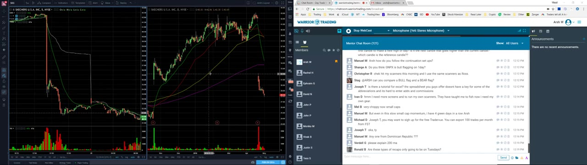

**图怎么看：**

- 在图表中，可以看到SKECHERS U.S.A., INC.（SKX）股票的价格走势，显示了其股价的波动情况。
- 水平的紫色线代表了移动平均线，帮助投资者识别趋势。
- 红色和绿色的柱状图表示成交量，反映了市场对股票的需求。
- 图表下方的时间和成交量信息提供了实时的市场数据，帮助投资者做出决策。

### 关键内容

- Ross 发现 HTBX 股票在预市场阶段大幅上涨，决定尝试买入。
- HTBX 股票在高点附近波动，Ross 决定在高点前买入，以获得更好的价格。
- Mike 使用 200MA 来判断股票是否突破重要支撑位，从而进行反向交易。
- Ross 和 Mike 的交易策略依赖于技术分析，包括趋势线和形态识别。
- 交易者需要设置止损，以控制潜在损失，并保持交易纪律。
- 交易者应关注市场动态，如新闻和公司公告，以增加交易成功的可能性。
- 交易者应使用图表软件来监控股票走势，如 TradingView.com。
- 交易者应了解不同股票的浮筹和短期借款情况，以做出更明智的投资决策。
- 交易者应根据自己的交易风格选择合适的策略，无论是快速还是慢速。

### 分析与执行顺序

1. 讲师介绍了 Ross 和 Mike 的交易策略，包括技术分析和风险管理。
2. 讲师展示了 HTBX 股票的预市场和开盘后的走势，解释了 Ross 的交易过程。
3. 讲师讨论了 Mike 使用 200MA 进行反向交易的方法，以及如何识别趋势。
4. 讲师强调了设置止损的重要性，以控制潜在损失并保持交易纪律。
5. 讲师提醒交易者要关注市场动态，如新闻和公司公告，以增加交易成功的可能性。
6. 讲师展示了 TradingView.com 的使用方法，帮助交易者监控股票走势。
7. 讲师讨论了如何通过图表软件识别股票的浮筹和短期借款情况。

### 案例与细节

- HTBX：股票在预市场阶段大幅上涨，Ross 决定在高点前买入，最终亏损 20 美分。
- CHEK：股票在低点反弹，Ross 观察到旗形形态，决定在高点前买入，最终获得小利润。
- GNPX：股票出现大幅上涨，形成旗形形态，Ross 决定在高点前买入，最终亏损 40 美分。
- INTC：股票在 200MA 处失败，Mike 决定卖出，最终获得利润。
- SKX：股票因坏消息大幅下跌，Mike 决定卖出，最终获得利润。

### 风险与边界

- 交易者应意识到市场波动性，及时调整交易策略。
- 交易者应了解不同股票的浮筹和短期借款情况，以避免过度杠杆化。
- 交易者应定期回顾和调整自己的交易策略，以适应市场的变化。
- 交易者应谨慎使用图表软件，确保正确解读图表数据。

### 复盘问题

- HTBX 的交易过程中，Ross 如何识别旗形形态？
- Mike 使用 200MA 进行反向交易的具体步骤是什么？
- 交易者在设置止损时应该考虑哪些因素？
- 交易者如何利用 TradingView.com 监控股票走势？

---

## v0366：小盘股交易案例分析

> 日期：2018-05-08　·　时长：01:04:47

**本场重点：** 本周Ross抓住了IMTE和BOXL的交易机会，展示了如何识别和利用市场波动。

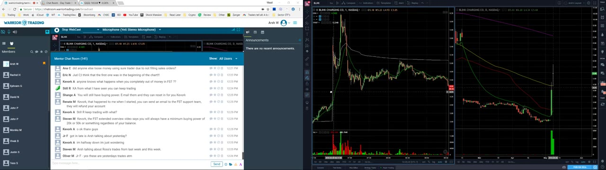

**图怎么看：**

- 图A显示了IMTE股票的交易情况，可以看到股价在不同时间段内的波动情况。
- 画面中的水平线表示均线，可以用来判断当前股价是否处于上涨或下跌趋势。
- 成交量柱的高度反映对应周期内的总成交量；红绿着色通常跟随价格柱的涨跌规则，不能直接拆成两种方向的主动成交。
- 画面中的时间轴显示了股票价格的变化，有助于理解市场的整体趋势。

### 关键内容

- Ross通过BOXL捕捉到了类似的市场波动，实现了25K的收益。
- Ross利用旗形突破模式进行交易，成功抓住了BOXL的机会。
- Ross在交易中使用了严格的止损策略，以控制风险。
- 市场波动后出现的高成交量是判断后续走势的重要信号。
- 当BOXL出现旗形突破时，Ross迅速识别并买入，显示了对技术形态的敏锐洞察。
- 市场波动后出现的高成交量和缺口是判断后续走势的重要信号，Ross利用这些信号进行交易。
- 市场波动后的“同情者”交易机会通常出现在重大市场事件后，Ross通过这些机会捕捉到市场情绪的变化。
- Ross在交易中严格使用止损策略，确保即使在不利情况下也能控制风险，避免重大亏损。
- 市场波动后的高成交量和缺口表明市场情绪强烈，Ross据此调整交易策略，提高成功率

### 分析与执行顺序

1. 记录IMTE的交易情况，显示市场波动的不确定性。
2. 分析BOXL的交易过程，展示如何利用市场波动。
3. 解释旗形突破模式的应用，强调识别关键信号的重要性。
4. 讨论市场波动后的高成交量和缺口，作为判断后续走势的依据。
5. 总结市场波动后的“同情者”交易机会，作为识别潜在交易的好方法。

### 案例与细节

- IMTE在一天内从$2飙升至$40，显示出强烈的市场波动。
- 当BOXL出现旗形突破时，Ross迅速买入，最终实现25K的收益。
- 市场波动后出现的缺口和高成交量是判断后续走势的重要信号。
- 市场波动后出现的“同情者”交易机会是识别潜在交易的好方法。
- 当BOXL在一天内从$4涨至$5时，Ross识别出旗形突破模式，并迅速买入，最终实现25K的收益，显示了对技术形态的敏锐洞察。
- 市场波动后，BOXL出现一个巨大的缺口和高成交量，Ross据此判断后续可能继续上涨，最终成功卖出获利17K。
- IMTE在一天内从$2飙升至$40，显示出强烈的市场波动，随后出现大量“同情者”交易机会，Ross通过这些机会捕捉到市场情绪的变化，成功实现29K的收益。
- 市场波动后的高成交量和缺口表明市场情绪强烈，Ross据此调整交易策略，例如在BOXL上，他利用这些信号迅速买入并卖出，最终实现25K的收益

### 风险与边界

- 市场波动具有不可预测性，可能导致交易失败。
- 市场波动后出现的高成交量和缺口可能误导判断。
- 市场波动后的“同情者”交易机会可能并不总是有效。
- 录制年代限制，信息可能不再适用于当前市场环境。
- 市场波动具有不可预测性，可能导致交易失败，尤其是当市场突然反转时，Ross的策略可能无法应对。
- 市场波动后的高成交量和缺口可能误导判断，因为它们也可能出现在假突破或假反转的情况下，导致错误的交易决策

### 复盘问题

- IMTE的交易过程中，Ross为何未能成功买入？
- BOXL的交易过程中，Ross是如何识别旗形突破模式的？
- 市场波动后的高成交量和缺口如何影响后续交易决策？
- 市场波动后的“同情者”交易机会为何是识别潜在交易的好方法？

---

## v0367：如何确定交易中的最大亏损

> 日期：2018-05-15　·　时长：00:33:08

**本场重点：** 如何确定最大亏损，确保交易可持续性；2%至3%的账户风险；避免频繁小额亏损。

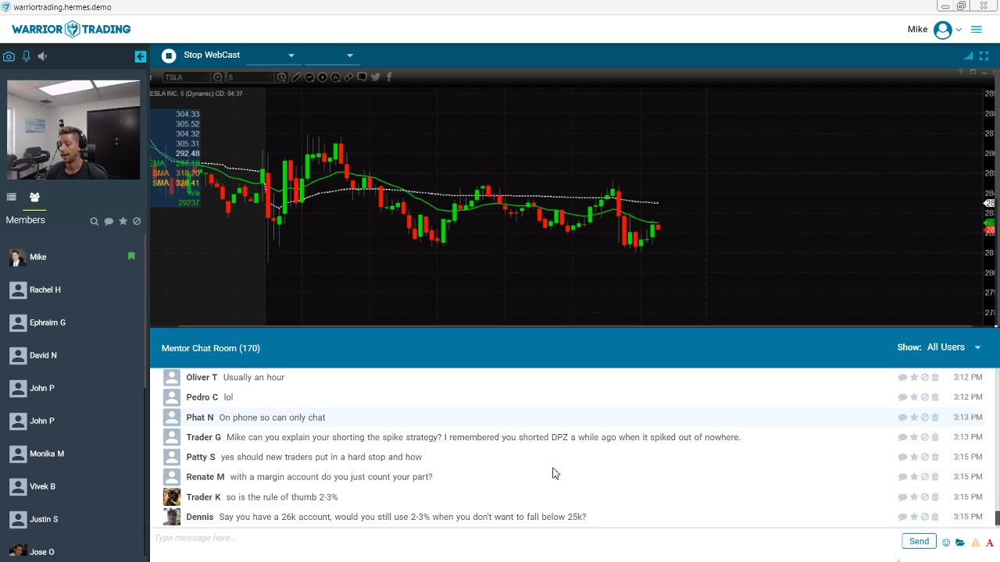

**图怎么看：**

- 在图中，可以看到一个股票的K线图，显示了价格波动情况。
- 图中还显示了移动平均线（EMA和SMA），帮助识别趋势。
- 交易者通过观察这些图表来决定最大亏损点，并采取措施避免频繁小额亏损。
- 图中的对话框显示了交易者之间的讨论，强调了风险管理的重要性。

### 关键内容

- 讲师强调了确定最大亏损的重要性，以确保交易可持续性。
- 建议基于每次交易的盈利来确定最大亏损，例如100美元。
- 使用账户大小的百分比来确定最大亏损，例如2%至3%。
- 避免频繁的小额亏损，因为这可能导致累积损失。
- 讲师通过特斯拉的例子展示了如何确定最大亏损。
- 建议使用保守的止损点，例如在整数价格上加减5至10美分。
- 建议新手交易者设置硬止损，以培养纪律。
- 讲师指出，交易者应根据自己的盈利目标来确定风险。
- 建议使用快速时间框架来确定更保守的止损点。
- 讲师强调了理解自己的风险水平的重要性，以避免频繁亏损。

### 分析与执行顺序

1. 讲师首先介绍了确定最大亏损的基本原则。
2. 然后，讲师通过实际例子解释了如何确定最大亏损。
3. 接着，讲师讨论了使用账户大小的百分比来确定最大亏损的方法。
4. 最后，讲师强调了使用保守的止损点的重要性。
5. 讲师还建议新手交易者设置硬止损，以培养纪律。
6. 在整个过程中，讲师反复强调了理解自己的风险水平的重要性。
7. 讲师还提到了使用快速时间框架来确定更保守的止损点的方法。

### 案例与细节

- 讲师提到，如果账户大小是26,000美元，可以考虑使用2%至3%的风险。
- 讲师通过特斯拉的例子，展示了如何确定最大亏损，包括使用整数价格上的止损点。
- 讲师建议，如果交易者感到舒适地可以在一次交易中赚取100美元，那么最大亏损不应超过100美元。
- 讲师提到，如果账户大小是5,000美元，通常建议不要风险超过2%。
- 讲师通过模拟交易中的实际操作，展示了如何设置止损点，例如在整数价格上加减5至10美分。

### 风险与边界

- 录制年代限制，此内容适用于2018年至2021年的交易环境。
- 建议使用保守的止损点，但市场环境可能变化，需要灵活调整。
- 使用账户大小的百分比来确定最大亏损，但不同交易者的盈利目标可能不同。
- 新手交易者应设置硬止损，但过度依赖硬止损可能导致错过潜在盈利机会。

### 复盘问题

- 如何根据每次交易的盈利来确定最大亏损？
- 使用账户大小的百分比来确定最大亏损时，具体百分比是多少？
- 如何在交易中应用保守的止损点？
- 对于新手交易者，如何设置硬止损来培养纪律？

---

## v0368：如何正确计算仓位大小

> 日期：2018-05-22　·　时长：01:03:26

**本场重点：** 正确计算仓位大小是风险管理的关键，需要考虑最大亏损额和每股价止损点。

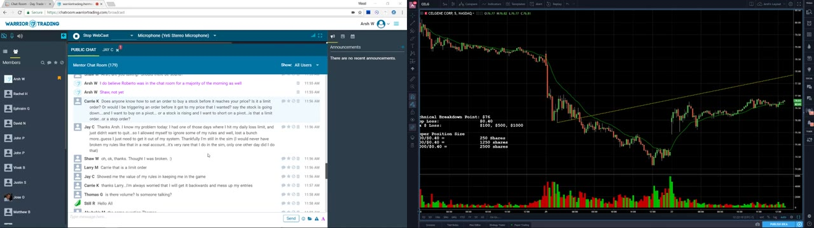

**图怎么看：**

- 画面中，可以看到一个股票的K线图，显示了价格波动情况。
- 图中还显示了止损点和最大亏损额的信息，帮助投资者理解风险控制。
- 通过分析K线图和止损点，投资者可以更好地制定仓位策略。
- 画面中的对话框提供了关于仓位大小计算的具体指导和建议。

### 关键内容

- 仓位大小计算公式：最大亏损额除以每股价止损点。
- 新手应将最大亏损控制在账户的1%，例如$10,000账户最多亏损$100。
- 不同股票的波动性不同，需调整止损点大小。
- 使用限价订单而非市场订单可以避免被市场操纵。
- 在小账户挑战中，需要承担更多风险以快速成长。
- 大型股通常移动缓慢，可以适当放宽止损点。
- 使用OCO订单可以同时设置止损和盈利目标。
- 使用Level 2图表可以帮助识别高成交量股票。
- 使用限价订单可以避免被市场操纵，但可能无法立即成交。
- 使用限价订单时，需确保止损价格在预期范围内

### 分析与执行顺序

1. 讲师首先介绍了仓位大小计算的基本概念。
2. 然后通过具体例子演示了如何计算仓位大小。
3. 接着解释了如何根据最大亏损额和每股价止损点来确定仓位大小。
4. 最后回答了学员关于仓位大小设定的问题。
5. 讲师强调了使用限价订单的重要性，以避免市场操纵。
6. 讲师还提到了使用OCO订单的方法，以同时设置止损和盈利目标。
7. 讲师通过具体案例展示了如何使用限价订单进行交易

### 案例与细节

- ticker：GMP；price：$6.60；stop_loss：$0.20；max_loss：$100；shares：500
- ticker：CLWT；price：$575；stop_loss：$0.20；max_loss：$25；shares：125
- ticker：Baidu；price：$257；stop_loss：$1；max_loss：$300；shares：300
- ticker：CDTI；price：$1.30；stop_loss：$0.10；max_loss：$100；shares：1000
- ticker：Seljean；price：$76；stop_loss：$0.40；max_loss：$100；shares：250

### 风险与边界

- 录制于2018年，部分规则和操作可能已发生变化。
- 限价订单可能无法立即成交，需考虑市场流动性。
- 使用限价订单时，需确保止损价格在预期范围内，否则可能无法止损。
- 使用OCO订单时，需确认平台支持此功能，否则可能无法实现双重目标

### 复盘问题

- 如何根据最大亏损额和每股价止损点来计算仓位大小？
- 在小账户挑战中，如何合理分配风险以快速成长？
- 如何在大型股交易中适当放宽止损点？
- 使用限价订单时，需要注意哪些潜在风险？
- 如何通过具体案例更好地理解仓位大小的计算方法？

---

## v0369：股票开盘预测交易策略

> 日期：2018-05-29　·　时长：00:29:59

**本场重点：** 本节主要讲解开盘时的几种常见股票交易模式，包括缺口涨跌、基底突破等，以提高交易的可预测性。

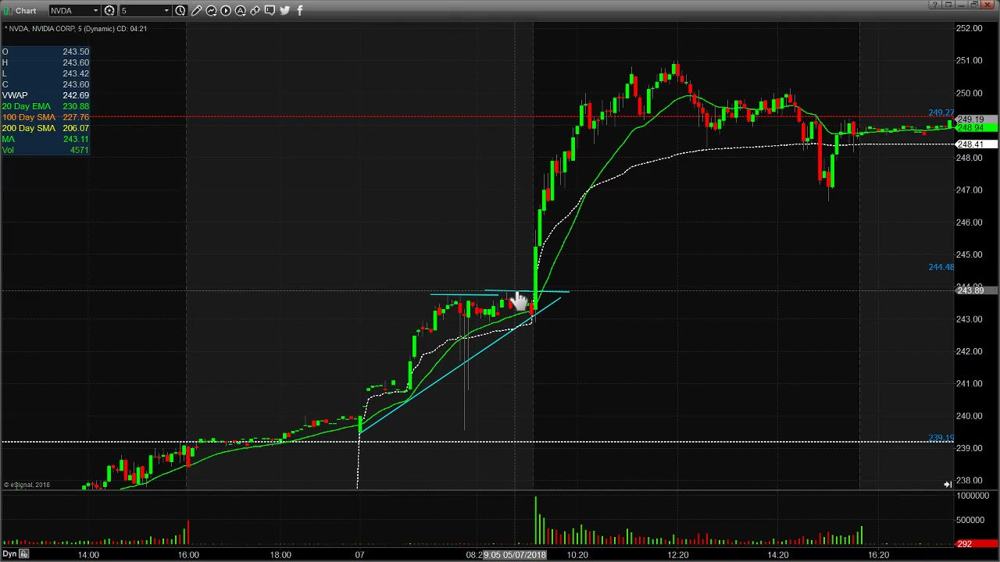

**图怎么看：**

- 图中显示了NVIDIA公司的股价走势，从243.50元开始，经过一段时间的下跌后，在240元左右企稳。
- 在240元附近，股价出现了明显的反弹，随后继续上涨，最终达到252元。
- 成交量在股价上涨期间明显增加，显示出市场对该股的兴趣。
- 此图展示了典型的上升趋势，投资者可以关注该股的进一步上涨机会。

### 关键内容

- 缺口涨跌模式是交易者常用的策略之一，通过开盘后的表现来判断是否进行交易。
- 缺口涨跌模式要求股票在开盘后出现更低的高点和低点，然后跌破成交量加权平均价（VWAP）和20。
- 缺口涨跌模式需要有足够的成交量支持，且股票需要有足够的空间运行。
- 缺口上涨模式要求股票在开盘后保持更高的高点和低点，并突破预市场高点。
- 基底突破模式要求股票在预市场形成支撑位，然后突破支撑位并保持在下方。
- 交易者需要根据不同的市场情况选择合适的交易模式，以提高交易的可预测性。
- 交易者需要关注成交量和价格走势，以判断是否进行交易。
- 交易者需要了解不同模式的具体操作步骤，以提高交易的成功率。
- 交易者需要关注市场情绪和新闻事件对股票价格的影响。

### 分析与执行顺序

1. 首先，识别股票的开盘缺口方向，是向上还是向下。
2. 然后，观察股票在开盘后的表现，是否出现更低的高点和低点。
3. 接着，确认股票是否跌破VWAP和20，这是判断是否进行交易的关键。
4. 最后，确认股票是否有足够的成交量支持，以及是否有足够的空间运行。
5. 如果满足上述条件，则可以进行相应的交易。
6. 交易过程中需要密切关注市场动态，及时调整交易策略。

### 案例与细节

- ticker：NVDA；price_action：开盘时出现明显的缺口涨跌模式，股票从249美元下跌到245美元。；volume：成交量充足，显示市场情绪强烈。；technical_indicators：股票突破了预市场高点，显示出强烈的买盘压力。；behavior：交易者在开盘后立即卖出，止损设在相对高点，成功捕捉到开盘后的下跌趋势。
- ticker：NVDA；price_action：开盘时出现明显的缺口上涨模式，股票从239美元上涨到244美元。；volume：成交量充足，显示市场情绪强烈。；technical_indicators：股票突破了预市场高点，显示出强烈的买盘压力。；behavior：交易者在开盘后立即买入，止损设在相对低点，成功捕捉到开盘后的上涨趋势。
- ticker：NVDA；price_action：开盘时出现明显的基底突破模式，股票从240美元下跌到239美元。；volume：成交量充足，显示市场情绪强烈。；technical_indicators：股票突破了预市场高点，显示出强烈的买盘压力。；behavior：交易者在开盘后立即卖出，止损设在相对高点，成功捕捉到开盘后的下跌趋势。

### 风险与边界

- 缺口涨跌模式可能在市场情绪突然变化时失效，导致交易者无法及时调整策略。
- 缺口上涨模式可能在市场情绪突然变化时失效，导致交易者无法及时调整策略。
- 基底突破模式可能在市场情绪突然变化时失效，导致交易者无法及时调整策略。
- 交易者需要关注市场情绪和新闻事件对股票价格的影响，以避免因突发因素导致的交易失败。
- 交易者需要根据市场情况进行实时调整，以适应市场的变化。

### 复盘问题

- 在开盘时，如何识别缺口涨跌模式？
- 在开盘时，如何识别缺口上涨模式？
- 在开盘时，如何识别基底突破模式？
- 交易者在开盘时应关注哪些关键指标？
- 交易者在开盘时应如何调整交易策略？

---

## v0370：交易回顾的重要性

> 日期：2018-05-30　·　时长：00:53:05

**本场重点：** 交易回顾是提高交易技能的关键，通过反思每个交易来改进策略。

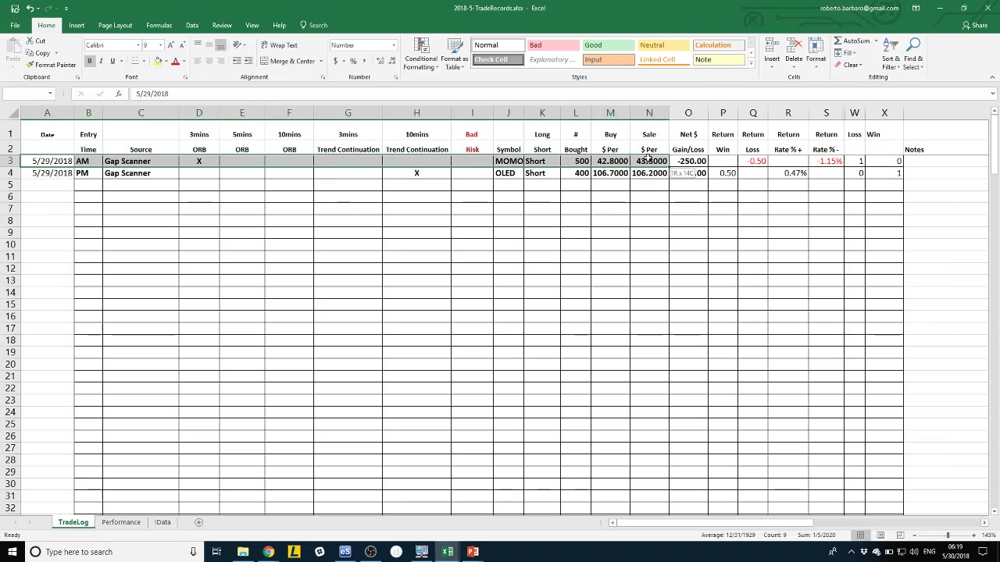

**图怎么看：**

- 这张图片显示了交易记录表，其中包含了交易日期、策略、入场价、止损价、目标价等详细信息。
- 右侧的图表显示了OLED股票的价格走势，包括开盘价、收盘价、最高价和最低价。
- 图表下方的成交量柱显示了不同时间段的成交量情况。
- 表格中的数据反映了每次交易的具体情况，如入场价、止损价、目标价等，以及交易结果和策略执行情况。

### 关键内容

- 交易回顾不仅记录交易结果，还强调计划和管理过程。
- 通过交易回顾，可以识别并改正错误，提高交易成功率。
- 交易回顾有助于形成自己的交易策略，并不断优化。
- 交易回顾应包括计划、目标、止损和收益目标等关键要素。
- 交易回顾需要记录实际交易情况，以便进行对比分析。
- 交易回顾有助于发现交易中的错误，并提出改进建议。
- 交易回顾应关注交易管理，而不仅仅是盈利或亏损。
- 交易回顾需要记录交易过程中的所有细节，以供后续参考。
- 交易回顾有助于识别交易中的模式和趋势，从而改进策略。
- 交易回顾需要定期进行，以确保持续改进和优化。
- 通过交易回顾，可以识别并改正错误，提高交易成功率。例如，在Momo交易中，如果提前设置好止损点，可以避免不必要的亏损。
- 交易回顾有助于形成自己的交易策略，并不断优化。例如，通过回顾OLED交易，可以发现哪些止损点设置得当，哪些需要调整。
- 交易回顾需要记录实际交易情况，以便进行对比分析。例如，记录每次交易的盈亏比例和交易量，可以帮助识别盈利和亏损的原因。
- 交易回顾有助于发现交易中的模式和趋势，从而改进策略。例如，通过多次交易回顾，可以发现某些股票在特定时间点的表现规律。
- 交易回顾应关注交易管理，而不仅仅是盈利或亏损。例如，在OLED交易中，即使最终盈利，也需要反思是否在交易过程中严格遵守了计划

### 分析与执行顺序

1. 首先，记录交易的基本信息，如股票代码、日期和交易类型。
2. 其次，记录交易的计划，包括目标价格、止损点和预期收益。
3. 然后，记录实际交易的结果，包括成交价格、盈亏比例和交易量。
4. 接着，评估是否遵循了交易计划，是否有改进的空间。
5. 最后，总结交易经验，提出改进建议，以优化未来的交易策略。

### 案例与细节

- ticker：Momo；entry_price：4280；exit_price：4330；stop_loss：4328；target_price：4208；size：500 shares；result：亏损
- ticker：OLED；entry_price：10670；exit_price：10620；stop_loss：10720；target_price：10595；size：400 shares；result：盈利
- ticker：OLED；entry_price：10650；exit_price：106；stop_loss：未设定；target_price：未设定；size：400 shares；result：亏损
- ticker：Momo；entry_price：4280；exit_price：4330；stop_loss：4328；target_price：4208；size：500 shares；result：亏损。在Momo交易中，如果提前设置好止损点4328，可以避免不必要的亏损，这说明交易回顾有助于识别并改正错误。
- ticker：OLED；entry_price：10670；exit_price：10620；stop_loss：10720；target_price：10595；size：400 shares；result：盈利。在OLED交易中，如果严格按照计划执行，可以实现盈利，这说明交易回顾有助于形成自己的交易策略。
- ticker：OLED；entry_price：10650；exit_price：106；stop_loss：未设定；target_price：未设定；size：400 shares；result：亏损。在OLED交易中，由于未设定止损点，导致亏损，这说明交易回顾需要记录实际交易情况，以便进行对比分析。
- ticker：Momo；entry_price：4280；exit_price：4330；stop_loss：4328；target_price：4208；size：500 shares；result：亏损。在Momo交易中，如果提前设置好止损点4328，可以避免不必要的亏损，这说明交易回顾有助于发现交易中的模式和趋势。
- ticker：OLED；entry_price：10670；exit_price：10620；stop_loss：10720；target_price：10595；size：400 shares；result：盈利。在OLED交易中，如果严格按照计划执行，可以实现盈利，这说明交易回顾有助于发现交易中的模式和趋势

### 风险与边界

- 交易回顾需要定期进行，否则无法持续改进。
- 交易回顾依赖于准确的数据记录，否则无法发现问题。
- 交易回顾需要结合市场变化和个人经验，否则可能无效。
- 交易回顾需要持续更新表格设计，以适应新的交易策略。
- 交易回顾需要定期进行，否则无法持续改进。例如，如果长时间不进行交易回顾，可能会忘记之前的教训，导致重复犯错。
- 交易回顾依赖于准确的数据记录，否则无法发现问题。例如，如果记录的数据不准确，可能会误导自己，导致错误的决策。
- 交易回顾需要结合市场变化和个人经验，否则可能无效。例如，如果忽视市场变化和个人经验，可能会制定出不符合当前市场的交易策略。
- 交易回顾需要持续更新表格设计，以适应新的交易策略。例如，如果表格设计固定不变，可能会限制新的交易策略的实施，导致交易效果不佳

### 复盘问题

- 在交易过程中，是否严格执行了交易计划？
- 在交易过程中，是否及时调整了止损点和目标价？
- 在交易过程中，是否充分考虑了市场变化和个人经验？

---

## v0371：小盘股交易策略分析

> 日期：2018-06-05　·　时长：01:02:47

**本场重点：** 分析小盘股交易中的风险管理与情绪控制，强调止损的重要性。

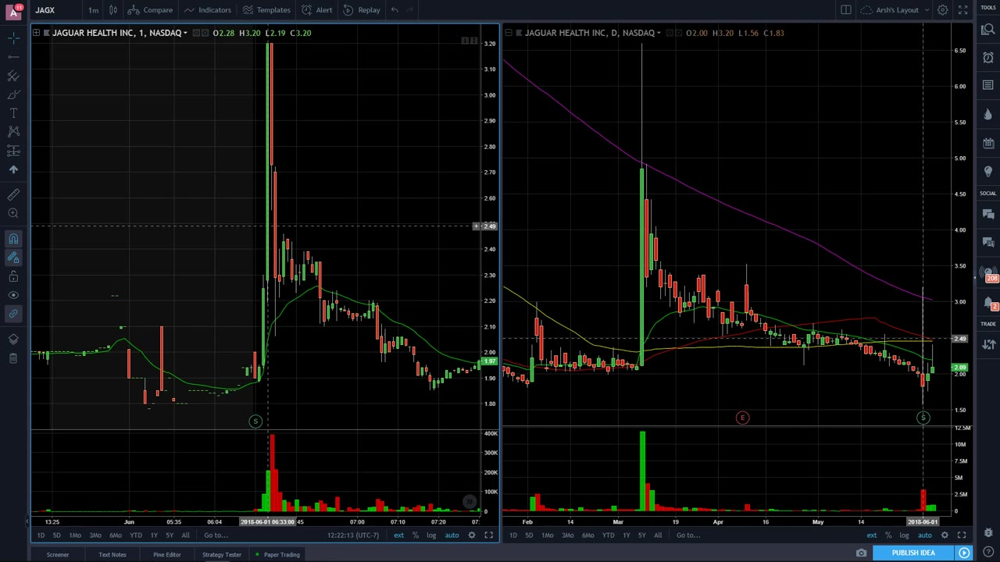

**图怎么看：**

- 在图表中，可以看到JAGUX HEALTH INC的股价在2018年6月期间经历了明显的波动。
- 成交量柱的高度反映对应周期内的总成交量；红绿着色通常跟随价格柱的涨跌规则，不能直接拆成两种方向的主动成交。
- 水平线表示支撑位和阻力位，帮助识别趋势方向。
- 图表右侧的成交量柱显示了不同时间段内的交易活动，有助于理解市场的活跃程度。

### 关键内容

- Ross在SLS和JAGX交易中分别亏损了$2,800和$10,000，展示了止损的重要性。
- JAGX交易中，Ross未能及时止损，导致更大损失，说明情绪控制的重要性。
- SLS交易中，Ross正确止损，避免了更大的损失，强调了风险管理。
- JAGX交易中，Ross未能识别市场反转，说明技术分析的局限性。
- Ross在CODX交易中情绪驱动，未能及时止损，导致更大亏损。
- 交易者应始终关注市场动态，及时调整交易策略。
- 止损设置有助于限制潜在损失，保护资金安全。
- 交易者应保持冷静，避免因情绪波动而做出错误决策

### 分析与执行顺序

1. 分析SLS交易，Ross在预开市价高点买入，但价格未能继续上涨，及时止损。
2. 分析JAGX交易，Ross在开盘价飙升后买入，未能及时止损，导致更大损失。
3. 分析CODX交易，Ross情绪驱动，未能及时止损，导致更大亏损。
4. 总结交易策略，强调风险管理的重要性，包括及时止损。
5. 讨论情绪控制，指出情绪波动可能导致错误决策。
6. 强调市场动态的重要性，提醒交易者要灵活调整策略

### 案例与细节

- SLS交易中，Ross在685和695买入，但价格未能继续上涨，及时止损于651。
- JAGX交易中，Ross在开盘价飙升后买入，未能及时止损，最终损失$10,000。
- CODX交易中，Ross情绪驱动，未能及时止损，最终损失$4,500
- JAGX交易中，Ross未能识别市场反转，价格从320开始下跌，最终跌至160。
- SLS交易中，Ross在预开市价高点买入，但价格未能继续上涨，及时止损

### 风险与边界

- 录制于2018年，市场环境和交易规则可能已发生变化。
- 止损设置不能保证完全避免损失，但可以限制潜在损失。
- 情绪波动可能导致交易者做出错误决策，影响交易结果。
- 交易者应根据市场情况灵活调整交易策略，避免过度自信

### 复盘问题

- 在JAGX交易中，Ross未能及时止损，导致更大损失，这说明了什么？
- 在CODX交易中，Ross情绪驱动，未能及时止损，导致更大亏损，这说明了什么？
- 在SLS交易中，Ross正确止损，避免了更大的损失，这说明了什么？

---

## v0372：市场周期与夏季交易策略

> 日期：2018-06-12　·　时长：00:46:52

**本场重点：** 了解市场周期，调整交易策略以应对夏季低成交量。

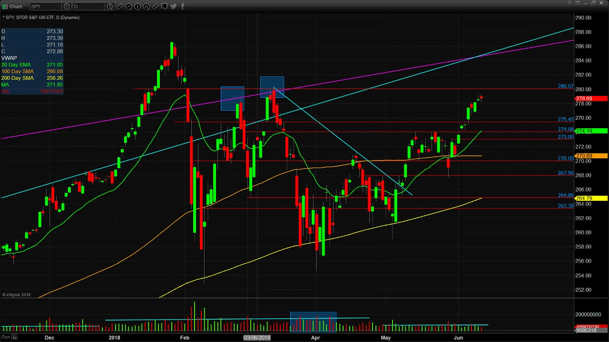

**图怎么看：**

- 这张图表显示了SPY指数在2018年1月至6月期间的价格走势。
- 图表上标有20日EMA、100日SMA和200日SMA等技术指标。
- 可以看到价格在2018年3月和4月之间出现了一次明显的回调。
- 成交量柱显示了市场的买卖活动情况。

### 关键内容

- 年初市场成交量高，投资者活跃度增加。
- 夏季市场成交量下降，投资者减少，导致市场波动性降低。
- 交易者需要调整策略，减少交易规模，等待合适的机会。
- 市场周期对交易者的影响显著，需提前准备。
- 夏季市场成交量通常较低，影响交易机会。
- 交易者应耐心等待，避免过度交易。
- 市场周期变化会影响交易策略的有效性。
- 了解市场周期有助于制定更有效的交易计划。
- 夏季市场成交量下降，交易者应减少交易频率

### 分析与执行顺序

1. 讲师首先介绍市场周期的概念，强调年初市场成交量高。
2. 讲师通过图表展示年初市场成交量，说明市场活跃度。
3. 讲师解释夏季市场成交量下降的原因，包括投资者休假。
4. 讲师建议交易者在夏季减少交易规模，等待合适的机会。
5. 讲师通过实例展示如何在夏季市场进行交易，强调耐心的重要性。
6. 讲师总结市场周期对交易策略的影响，强调提前准备的重要性

### 案例与细节

- RH股票在年初出现高成交量，表明市场活跃度增加。
- RH股票在夏季出现低成交量，表明市场活跃度下降。
- RH股票在夏季出现低成交量，表明市场波动性降低。
- RH股票在夏季出现低成交量，表明市场流动性降低。
- RH股票在夏季出现低成交量，表明市场交易机会减少

### 风险与边界

- 夏季市场成交量下降可能导致交易机会减少。
- 夏季市场成交量下降可能导致交易者情绪波动。
- 夏季市场成交量下降可能导致交易者过度交易。
- 市场周期变化可能影响交易策略的有效性。
- 市场周期变化可能影响交易者的盈利情况

### 复盘问题

- 年初市场成交量高，如何识别并利用这一特点？
- 夏季市场成交量下降，如何调整交易策略？
- 如何在夏季市场找到合适的交易机会？

---

## v0373：Trading View 平台使用详解

> 日期：2018-06-19　·　时长：00:58:46

**本场重点：** Trading View 是一个经济实惠且功能强大的图表软件，适合初学者和经验丰富的交易者。

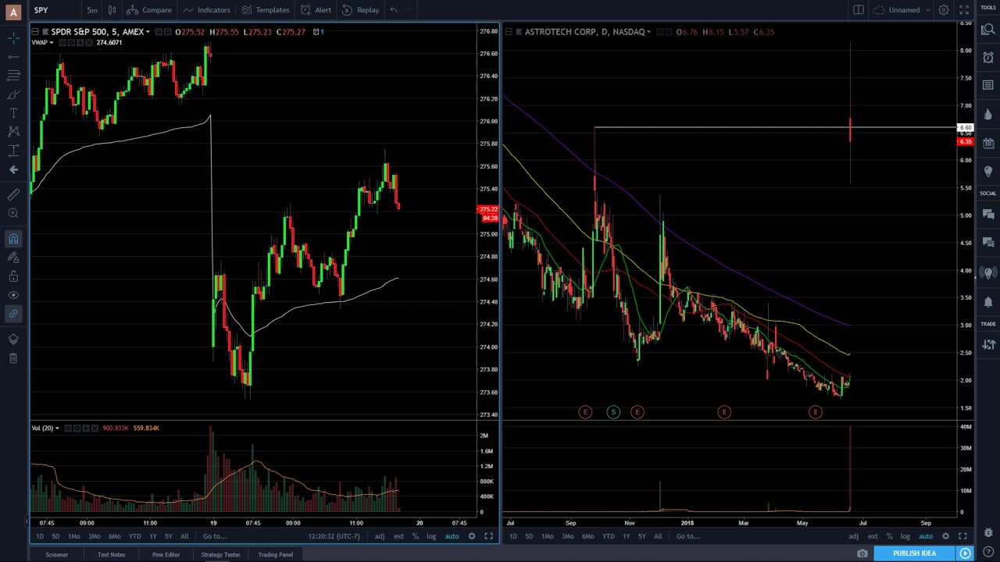

**图怎么看：**

- 在Astrotech Corp的图表中，可以看到股价从275.22美元开始下跌，随后在274.60美元附近形成支撑。
- 成交量柱的高度反映对应周期内的总成交量；红绿着色通常跟随价格柱的涨跌规则，不能直接拆成两种方向的主动成交。
- 图表下方的时间与成交量显示了市场动态，帮助分析当前趋势。
- 通过观察这些图表，可以判断市场情绪和潜在的交易机会。

### 关键内容

- Trading View 提供了多种自定义选项，如背景颜色、网格线透明度等。
- 使用 Trading View 的优势在于其成本效益高，每月只需约 35 美元。
- 通过设置布局和添加常用工具，可以提高交易效率。
- 支持实时数据，但不包括 Level 2 数据。
- 可以设置多个图表窗口，最多八个，适合多任务交易。
- 提供了多种技术分析工具，如趋势线、支撑阻力线等。
- 支持设置警报和通知，帮助监控市场动态。
- 支持扫描股票，寻找交易机会。
- 提供了多种图表类型，包括一分钟和一小时图表。
- 支持使用热键快速下单，适合短期交易

### 分析与执行顺序

1. 登录 Trading View 平台，选择免费试用。
2. 根据个人偏好调整界面布局，如背景颜色和网格线透明度。
3. 添加常用技术分析工具，如移动平均线和趋势线。
4. 设置实时数据和警报，以监控市场动态。
5. 利用热键快速下单，提高交易效率。
6. 保存自定义布局，以便下次使用时直接加载

### 案例与细节

- 讲师展示了如何将背景色改为黑色，并调整网格线透明度，以提高图表的可读性。
- 通过设置不同时间框架的图表，如 5 分钟和日线图，来监控市场动态。
- 使用 Trading View 的趋势线工具，识别潜在的突破点，如 QRVO 的旗形突破。
- 设置警报，当股票价格达到特定水平时，收到通知，如当 INTC 股票价格达到某个水平时。
- 使用热键快速下单，如在 SPY 上进行买入操作，以节省时间并提高交易效率

### 风险与边界

- Trading View 不提供 Level 2 数据，可能影响高级交易者的决策。
- 虽然支持实时数据，但数据源可能有限，不如某些专业平台全面。
- 使用热键下单时，需要确保市场状况符合预期，否则可能导致亏损。
- 录制于 2018-2021 年，部分信息可能已发生变化，需自行验证最新情况

### 复盘问题

- 如何根据个人需求调整 Trading View 的界面布局？
- 如何利用 Trading View 的技术分析工具识别潜在的交易机会？
- 如何设置警报和通知，以更好地监控市场动态？

---

## v0374：日交易者如何建立有效交易流程

> 日期：2018-06-26　·　时长：00:37:41

**本场重点：** 建立有效交易流程的重要性在于减少情绪干扰，提高交易成功率。但实际操作中，需要控制在1小时内完成。

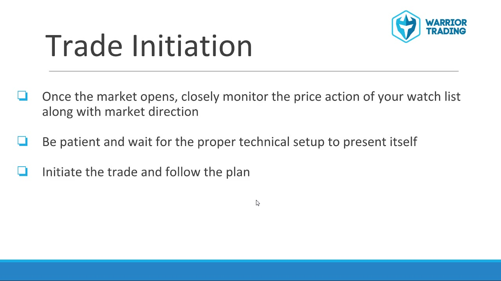

**图怎么看：**

- 每日交易计划包括市场监控、耐心等待技术设置、执行交易并遵循计划。
- 计划中提到在关键阻力位（前支撑位）下方进行空头交易，目标为关键支撑位183.5。
- 每一点利润都记录下来，直到最终目标。
- 此计划强调了在1小时内完成交易过程的重要性，以减少情绪干扰，提高交易成功率。

### 关键内容

- 建立交易流程可以减少情绪干扰，提高交易成功率。
- 每日交易流程应在1小时内完成，包括技术分析和计划制定。
- 简单技术分析是基础，包括查看股票的每日图表。
- 制定交易计划是关键，确保计划清晰且易于执行。
- 交易过程中应保持机器人化，避免情绪影响。
- 设置和忘记是减少错误的关键步骤，有助于提高交易结果。
- 交易过程中应关注市场动态，以做出更好的决策。
- 使用技术指标如VWAP和支撑阻力线来制定交易策略。
- 交易过程中应设定止损和止盈点，避免随意操作。
- 交易过程中应保持耐心，等待合适的入场时机

### 分析与执行顺序

1. 每天早上8点左右开始，进行技术分析。
2. 分析股票的每日图表，确定支撑和阻力水平。
3. 根据分析结果制定交易计划，包括买入和卖出点。
4. 在市场开盘后，监控价格走势，等待合适的交易机会。
5. 严格执行交易计划，避免情绪干扰。
6. 交易过程中，设定止损和止盈点，确保交易有序进行。
7. 交易结束后，总结经验教训，改进交易策略

### 案例与细节

- 苹果股票在6月19日出现大幅下跌，关键支撑位在186附近。
- 交易计划是：在186以下做空，目标价为183.50。
- 交易过程中，当价格跌破186时，立即执行交易计划。
- 随着价格继续下跌，逐步减仓，最终在183.50平仓。
- 交易过程中，保持耐心，等待价格再次突破186的机会

### 风险与边界

- 交易过程中可能会遇到市场波动，导致计划无法完全执行。
- 情绪波动可能导致交易决策失误，影响交易结果。
- 交易过程中需要不断调整计划，以适应市场变化。
- 录制年代限制为2018年至2021年，期间市场环境可能发生变化

### 复盘问题

- 每天的技术分析和计划制定是否足够详细？
- 交易过程中如何处理突发市场变化？
- 如何确保交易计划的执行一致性？

---

## v0375：小盘股交易策略分享

> 日期：2018-07-03　·　时长：00:57:16

**本场重点：** 分享了识别小盘股交易机会的方法，强调了技术分析的重要性及风险管理。

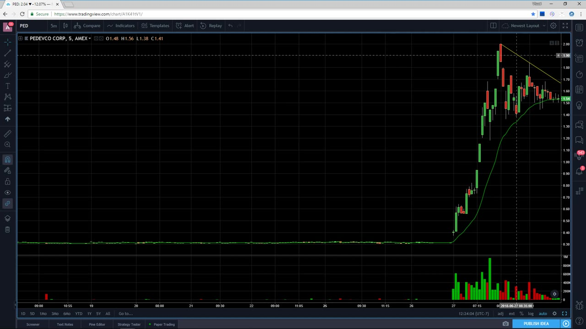

**图怎么看：**

- 图表显示了PEDEVCO CORP股票的价格从0.48美元上涨到1.41美元。
- 绿色柱状图表示股票价格上涨，红色柱状图表示下跌。
- 图表下方的时间轴显示了不同时间段的价格变化。
- 这表明PEDEVCO CORP股票在一段时间内经历了显著的增长。

### 关键内容

- 使用技术分析来识别交易机会，如突破区间的形成和成交量的变化。
- 设置止损和目标价以控制风险，确保盈利比率为2:1。
- 使用不同时间框架进行分析，如一分钟和五分钟图表。
- 识别市场趋势和关键支撑阻力位是成功的关键。
- 保持耐心，让盈利交易运行，同时快速退出亏损交易。
- 使用Thinkerswim模拟器进行非市场时段的交易练习。

### 分析与执行顺序

1. 首先介绍了DFBG股票的突破情况，分析了突破后的成交量变化。
2. 接着讨论了GBR股票的反转情况，解释了如何识别反转信号。
3. 然后分析了PED股票的旗形突破，强调了技术分析的重要性。
4. 最后讲解了ABIL股票的旗形突破，展示了持续的上升动力。
5. 分享了如何使用Thinkerswim模拟器进行非市场时段的交易练习。
6. 强调了设置止损和目标价的重要性，以控制风险并实现盈利比率为2:1。
7. 提醒学员要识别市场趋势和关键支撑阻力位，以做出正确的交易决策。

### 案例与细节

- DFBG股票在开盘后大幅上涨，但未能填补缺口，显示出强劲的买盘压力。
- GBR股票在开盘后大幅上涨，随后出现反转，表明市场情绪的变化。
- PED股票形成了旗形突破，显示了强烈的上升趋势。
- ABIL股票通过旗形突破，展示了持续的上升动力。
- 使用Thinkerswim模拟器进行非市场时段的交易练习，如在模拟器中回放过去的市场行情。

### 风险与边界

- 交易策略的有效性依赖于市场环境的变化，可能不再适用于当前市场。
- 止损和目标价的设置需要根据市场情况进行调整，不能一成不变。
- 使用模拟器进行练习时，需要注意实际交易与模拟环境之间的差异。
- 技术分析方法的有效性取决于数据的质量和分析者的经验水平。

### 复盘问题

- DFBG股票的突破区间的形成过程是什么？
- GBR股票的反转信号是如何识别的？
- 如何使用Thinkerswim模拟器进行非市场时段的交易练习？
- 在设置止损和目标价时，应该考虑哪些因素？

---

## v0376：初学者入门：成交量分析

> 日期：2018-07-10　·　时长：00:39:47

**本场重点：** 成交量是预测股价走势的关键因素，但需要正确解读才能发挥作用。成交量分析适用于所有股票，尤其是小盘股。

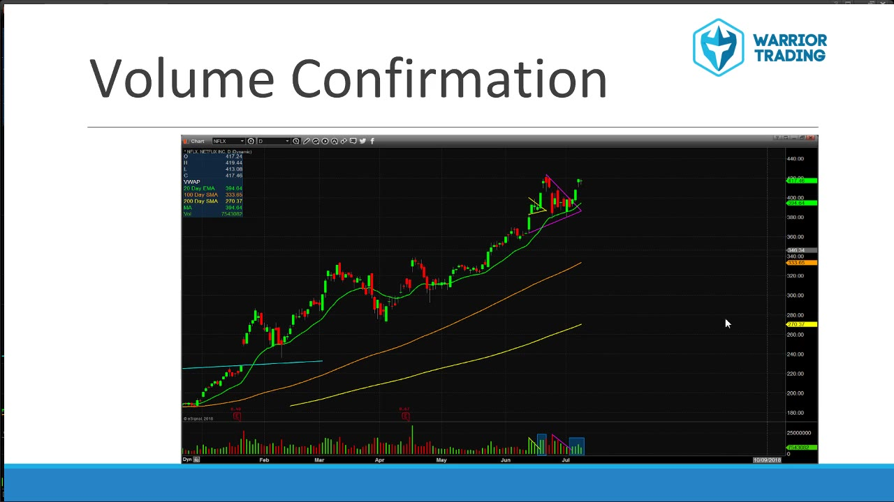

**图怎么看：**

- 这张图表显示了NFLX股票的成交量确认，表明在特定价格水平上存在大量交易。
- 成交量确认通常用于确认趋势反转或支撑/阻力位的有效性。
- 通过观察成交量的变化，投资者可以更好地理解市场情绪和潜在的趋势变化。
- 在图表中，成交量柱状图显示出明显的上升趋势，表明市场活跃度增加。

### 关键内容

- 成交量是预测股价走势的关键因素，但需要正确解读才能发挥作用。
- 成交量分析适用于所有股票，尤其是小盘股。
- 成交量确认模式可以在任何时间框架上使用，但最准确的设置应在五分钟图表上。
- 成交量底和顶通常出现在高价位附近，尤其是在开盘后的前五分钟。
- 识别成交量模式比关注颜色更重要，因为颜色只是价格移动的关联。
- 成交量分析可以帮助预测股价走势，但需要结合其他技术指标一起使用。
- 成交量确认模式在突破或跌破时出现，表明趋势可能反转。
- 识别成交量模式需要结合价格形态，如大阳线或大阴线。
- 成交量分析适用于所有股票，无论价格高低。
- 成交量分析需要结合实际交易经验，通过反复练习来提高技能

### 分析与执行顺序

1. 讲师首先介绍了成交量分析的重要性，指出它对于预测股价走势至关重要。
2. 然后讲师讲解了三种主要的成交量分析模式：成交量顶、成交量底和成交量确认。
3. 接着讲师通过具体案例展示了如何识别这些模式，并解释了它们的意义。
4. 讲师强调了识别成交量模式的重要性，并指出它可以帮助预测股价走势。
5. 最后，讲师回答了观众的问题，进一步澄清了成交量分析的应用范围和方法

### 案例与细节

- BIIB股票在开盘后的前五分钟内出现了巨大的成交量，随后价格大幅下跌。
- 特斯拉股票在高价位附近出现了成交量底，随后价格开始回升。
- Netflix股票在形成旗形模式时，成交量确认了突破方向。
- BIIB股票在突破后出现了高成交量，随后价格大幅回落。
- 特斯拉股票在高价位附近形成了成交量底，随后价格开始回升。

### 风险与边界

- 成交量分析依赖于市场数据，因此需要实时更新的数据支持。
- 成交量分析的有效性取决于正确解读模式，错误解读可能导致错误的交易决策。
- 成交量分析适用于所有股票，但不同股票的成交量模式可能有所不同。
- 成交量分析需要结合其他技术指标一起使用，否则可能无法准确预测股价走势。
- 成交量分析依赖于历史数据，因此需要结合当前市场情况进行分析。

### 复盘问题

- 成交量分析的关键是什么？
- 如何识别成交量顶和底？
- 成交量确认模式在什么情况下出现？
- 成交量分析与其他技术指标结合使用时需要注意什么？

---

## v0377：新手交易答疑

> 日期：2018-07-17　·　时长：00:42:26

**本场重点：** 提问者询问关于股票交易的问题，讲师通过实例和经验分享解答。

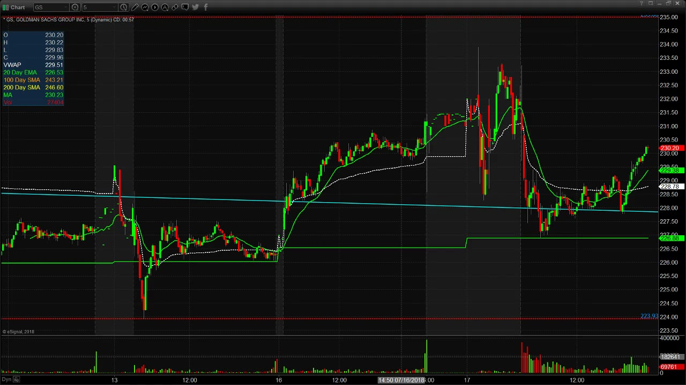

**图怎么看：**

- 这张图表显示了Goldman Sachs Group Inc.的股价走势，包括开盘价、最高价、最低价和收盘价。
- 成交量柱的高度反映对应周期内的总成交量；红绿着色通常跟随价格柱的涨跌规则，不能直接拆成两种方向的主动成交。
- 均线（MA）显示了短期和长期的趋势，帮助判断市场趋势。
- 支撑和阻力水平在图表上用水平线标出，帮助识别潜在的买卖点

### 关键内容

- 讲师提到使用RSI作为辅助工具，但不应完全依赖它。
- 讲师强调了监控买卖盘的重要性，特别是小盘股。
- 讲师解释了如何利用成交量确认突破。
- 讲师指出使用E-Signal进行图表绘制的原因。
- 讲师分享了如何选择合适的交易平台，如TradeView。
- 讲师解释了如何构建股票筛选标准，包括价格和成交量。
- 讲师讨论了如何应对市场缺乏动力的情况。
- 讲师分享了如何利用技术指标进行交易决策。

### 分析与执行顺序

1. 讲师首先回答了关于股票缺口突破的问题。
2. 然后解释了如何使用RSI作为辅助工具来确认突破。
3. 接着讲解了如何监控买卖盘，特别是在小盘股交易中。
4. 进一步解释了如何利用成交量确认突破。
5. 最后分享了如何选择合适的交易平台，如TradeView。
6. 讲师还提供了如何构建股票筛选标准的示例。
7. 讲师讨论了如何应对市场缺乏动力的情况，包括使用技术指标进行交易决策。

### 案例与细节

- 讲师举例说明了如何识别股票缺口突破后的技术形态，如Netflix的牛旗形态。
- 讲师展示了如何使用RSI确认突破，例如在Netflix的图表上。
- 讲师解释了如何监控买卖盘，特别是在小盘股交易中，如365的价格走势。
- 讲师分享了如何利用成交量确认突破，如在365的价格走势中。
- 讲师举例说明了如何选择合适的交易平台，如TradeView，以获取准确的数据。

### 风险与边界

- 讲师提到使用RSI作为辅助工具，但不应完全依赖它，因为RSI可能会出现滞后。
- 讲师强调了监控买卖盘的重要性，特别是在市场缺乏动力时，这可能会影响交易决策。
- 讲师提到使用E-Signal进行图表绘制，但没有提及其他平台的功能和局限性。
- 讲师提供的信息基于历史录制内容，当前市场情况可能有所不同。

### 复盘问题

- 如何识别股票缺口突破后的技术形态？
- 如何使用RSI确认突破？
- 如何监控买卖盘，特别是在小盘股交易中？
- 如何利用成交量确认突破？
- 如何选择合适的交易平台进行图表绘制？

---

## v0378：新手交易者必备：风险管理和止损

> 日期：2018-07-24　·　时长：00:37:15

**本场重点：** 新手交易者需要严格遵守风险管理和止损规则，以避免重大损失。

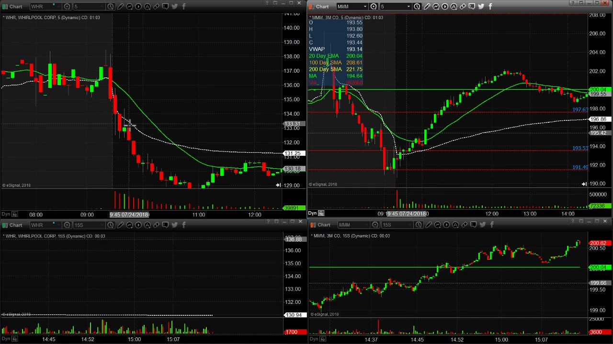

**图怎么看：**

- 画面以四张图并排比较：上方与左下主要是 Whirlpool 的不同时间尺度，右下另放 Amazon 图表，用来对照个股结构而非只看一个孤立时点。
- 左上可见价格经历明显下跌后形成较圆缓的恢复路径；右上显示反弹后的回撤，左下则把近期波动与成交量放大，帮助定位止损距离。
- 多周期观察的价值在于先确认大级别趋势和关键位置，再检查短周期入场是否与背景一致；若短周期看似反弹但大周期仍弱，仓位和风险应更保守。
- 红绿柱只反映画面采用的涨跌着色规则，不能单独证明主动买卖方向；这张静态图也不能保证底部成立或预测价格会继续上涨。

### 关键内容

- 讲师提到自己在交易中连续两天违反了重要的规则，导致了较大的亏损。
- 交易市场当前较为困难，需要严格遵守规则来保护资金。
- 交易者需要设定明确的规则，如成交量和VWAP位置，以提高交易的成功率。
- 交易者应设定每日最大亏损额度，确保能够迅速弥补损失。
- 交易者需要耐心和选择性地进行交易，尤其是在夏季。
- 交易者应避免在股票高于VWAP时进行短卖，除非股票被过度延伸。
- 交易者需要在交易前检查支持水平和成交量，以确定是否进行交易。
- 交易者应记录自己的交易规则，并将其放在显眼的位置以便随时查看。
- 交易者需要认识到交易是一种业务，需要制定计划和策略。
- 交易者需要学会在市场不利时暂时离开交易环境，以避免进一步的损失。

### 分析与执行顺序

1. 讲师回顾了自己在交易中的失误，包括违反了重要的规则。
2. 讲师解释了交易市场的当前状况，指出交易较为困难。
3. 讲师分享了自己设定的交易规则，包括成交量和VWAP位置。
4. 讲师强调了设定每日最大亏损额度的重要性，以控制风险。
5. 讲师建议交易者在交易前检查支持水平和成交量，以确定是否进行交易。
6. 讲师提醒交易者需要记录自己的交易规则，并将其放在显眼的位置。
7. 讲师建议交易者在市场不利时暂时离开交易环境，以避免进一步的损失。

### 案例与细节

- 3M：交易者在3M上进行了短卖，但违反了规则，导致了较大的亏损。
- SKX：交易者在SKX上进行了短卖，但同样违反了规则，导致了较大的亏损。
- PZZA：交易者在PZZA上进行了短卖，但没有找到足够的支持水平，导致了亏损。
- VZ：交易者没有将VZ加入观察列表，因为股票位于20移动平均线下方。
- WHR：交易者没有在WHR上进行交易，因为当时正在关注3M上的交易机会。

### 风险与边界

- 交易者需要认识到，即使制定了严格的规则，有时交易仍然会失败。
- 交易者需要意识到，市场状况可能会变化，规则需要适时调整。
- 交易者需要了解，交易市场在不同时间段的表现可能会有所不同。
- 交易者需要认识到，交易规则的有效性取决于交易者的执行力。

### 复盘问题

- 你在交易中是否严格执行了设定的规则？
- 你如何确定每日的最大亏损额度？
- 你在交易前是否仔细检查了支持水平和成交量？
- 你在交易中遇到困难时是如何处理的？

---

## v0379：小盘股交易分析

> 日期：2018-07-31　·　时长：00:54:59

**本场重点：** 识别并利用小盘股的短期波动机会，强调耐心和纪律的重要性。

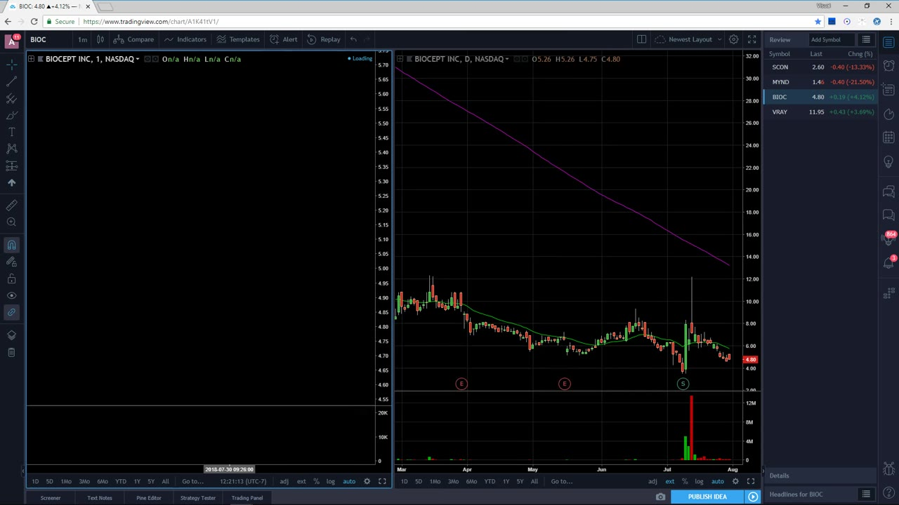

**图怎么看：**

- 在BIOCEPT INC的D周期图表中，可以看到股价从底部逐渐上升，形成一个明显的上升趋势。
- 图表中的E标记处显示了股价的低点，可能是一个潜在的买入信号。
- S标记处显示了股价的高点，可能是一个潜在的卖出信号。
- 成交量柱显示了不同时间段内的买卖活动，有助于理解市场情绪和趋势强度。

### 关键内容

- SCO-N股票在7月24日进行了反向拆分，导致价格从0.9美元涨至9美元。
- 反向拆分通常带来心理影响，吸引新买家进入市场。
- 交易者应关注突破开盘价，以捕捉潜在的上涨机会。
- 当股票被暂停交易时，成交量激增表明其他交易者也在买入。
- 交易者应设定止损，以控制风险并实现合理的利润目标。
- 交易者应保持耐心，尤其是在盈利交易中，以最大化收益。
- 反向拆分和缺口突破是识别短期交易机会的有效方法。
- 交易者应根据市场情况调整止损，以确保继续盈利。
- 交易者应避免过度交易，以免损失资金

### 分析与执行顺序

1. 分析SCO-N股票的反向拆分事件，识别突破开盘价的机会。
2. 观察股票在暂停交易后的快速上涨和回调，确认交易信号。
3. 设定止损点，如930美元，以控制风险。
4. 在股票突破开盘价后，迅速下单买入。
5. 监控股票的后续走势，确保继续盈利并及时止盈。
6. 总结交易经验，强调耐心和纪律的重要性。
7. 分享其他交易机会，如MIND、BIOC和VRAY等股票的交易策略

### 案例与细节

- SCO-N在反向拆分后，从开盘价950美元迅速上涨至990美元，随后被暂停交易。
- MIND股票在前一天收盘价140美元后，次日开盘价大幅上涨至180美元。
- BIOC股票形成牛旗突破形态，从1050美元突破至1150美元。
- VRAY股票在一天内从开盘价1064美元上涨至1140美元，随后继续上涨。
- 交易者应设定止损，如950美元买入后，止损设为930美元，以控制风险

### 风险与边界

- 反向拆分和缺口突破策略可能在市场波动较大时失效。
- 过度交易可能导致资金损失，特别是在市场不利时。
- 交易者应根据市场情况灵活调整止损，但不应频繁变动。
- 交易者应避免在没有充分准备的情况下进行交易，以免造成损失

### 复盘问题

- 在反向拆分后，如何识别并利用股票的上涨机会？
- 交易者应如何设定止损以控制风险？
- 在哪些情况下，交易者应考虑调整止损点？
- 如何在交易过程中保持耐心，以最大化收益？

---

## v0380：如何正确进行仓位管理

> 日期：2018-08-01　·　时长：00:58:24

**本场重点：** 仓位管理是交易中最重要的一环，需要谨慎对待。新手应从小额开始，逐步提升，避免情绪化决策。

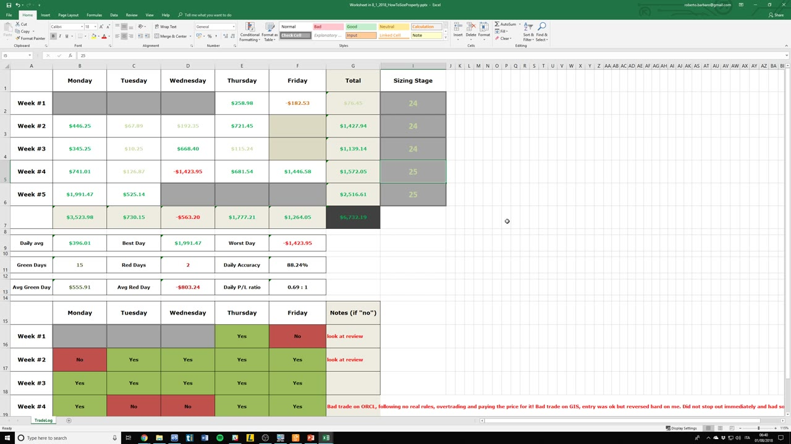

**图怎么看：**

- 这张图片展示了一个Excel表格，用于记录和分析交易日的收益情况。
- 表格分为多个列，包括日期（周一至周五）、收益、总收益以及仓位管理的阶段。
- 通过对比不同周的收益数据，可以评估交易策略的有效性。
- 表格还显示了每日平均收益、最佳和最差交易日，以及绿色和红色交易日的数量和占比。

### 关键内容

- 讲师强调了仓位管理的重要性，指出新手不应急于使用大仓位。
- 讲师提出，每次交易前都应明确自己愿意承担的风险金额。
- 讲师分享了自己设计的仓位管理方法，根据股票价格范围和预期波动来调整仓位大小。
- 讲师建议新手从小额开始，逐步增加仓位，以提高风险承受能力。
- 讲师指出，交易管理需要投入更多努力，才能获得更好的结果。
- 讲师强调了风险意识，提醒交易者要时刻关注自己的风险敞口。
- 讲师提到，交易者应设定止损点，避免因情绪化决策而扩大损失。
- 讲师分享了自己在早期交易中的经历，从每天最多50美元风险到现在的250美元。
- 讲师建议使用技术止损，但强调止损距离不应超过最大损失金额。
- 讲师强调了逐步增加仓位的重要性，而不是急于求成。
- 讲师提到，交易者应关注自己的风险承受能力，而不是追求快速盈利

### 分析与执行顺序

1. 讲师首先介绍了仓位管理的重要性，指出新手不应急于使用大仓位。
2. 然后，讲师提出了每次交易前明确风险金额的概念。
3. 接着，讲师分享了自己的仓位管理方法，根据股票价格范围和预期波动来调整仓位大小。
4. 随后，讲师建议新手从小额开始，逐步增加仓位，以提高风险承受能力。
5. 最后，讲师强调了交易管理需要投入更多努力，才能获得更好的结果。
6. 在整个过程中，讲师反复强调了风险意识和逐步增加仓位的重要性。

### 案例与细节

- 例如，在交易一只15美元的股票时，如果想要设置500美元的止损，那么止损距离应该是50美分。而在交易一只400美元的股票时，同样的1000股仓位，止损距离可能需要调整到3美元或4美元。
- 假设某人在第一两个月的交易中，每天最多只愿意承担50美元的风险，那么随着经验的积累和结果的改善，他可能会逐渐增加风险额度。
- 讲师分享了一个自己的交易记录表，用于跟踪每日盈亏和统计相关数据。
- 假设某人在一天内交易一只股票后，亏损500美元，这不仅反映了风险管理不当，还可能导致后续更多的交易，试图弥补之前的损失。

### 风险与边界

- 由于录制于2018年，部分市场规则和条件可能已发生变化。
- 交易者应根据当前市场情况调整自己的仓位管理策略。
- 交易者应关注自己的风险承受能力，避免过度交易。
- 交易者应确保自己的交易计划和策略符合当前市场的实际情况。

### 复盘问题

- 您是如何确定每次交易的风险金额的？
- 您是如何根据股票价格范围和预期波动来调整仓位大小的？
- 您是如何逐步增加仓位的？
- 您是如何处理交易中的情绪化决策的？
- 您是如何跟踪和评估自己的交易表现的？

---

## v0381：宏观与微观市场分析

> 日期：2018-08-07　·　时长：00:48:45

**本场重点：** 理解宏观与微观市场的区别，学会利用长期数据进行交易决策。

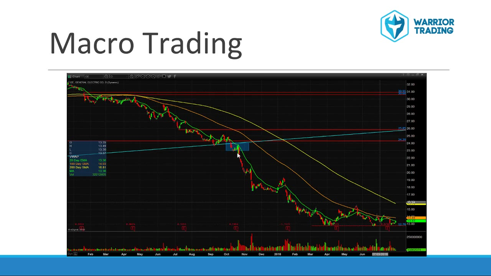

**图怎么看：**

- 整体界面显示了GE股票的长期趋势分析图。
- 实际可见的ticker为GE，周期为日线。
- 画面信息展示了GE股票的价格走势、均线（200日SMA）、成交量等关键指标。
- 这张截图不能单独证明什么，但可以用来说明如何通过长期数据进行交易决策。

### 关键内容

- 宏观市场涉及长期趋势分析，通常需要六个月以上的数据。
- 微观市场关注短期价格波动，通常少于六个月的数据。
- 长期数据能提供更可靠的交易信号，但机会较少。
- 短期数据提供频繁的交易机会，但可靠性较低。
- 长期趋势线在突破后通常会持续一段时间，提供稳定的交易机会。
- 短期价格动作如旗形突破，可以快速获利。
- 长期趋势线的突破需要确认，短期价格动作则需即时反应。
- 长期数据有助于识别关键支撑和阻力位，提高交易成功率。
- 短期数据适合日内交易，提供即时利润。
- 长期数据适用于构建交易策略，短期数据则用于执行交易

### 分析与执行顺序

1. 讲师首先介绍宏观与微观市场的定义。
2. 然后通过案例讲解如何识别长期趋势线。
3. 接着展示如何利用短期价格动作进行日内交易。
4. 最后强调长期数据的重要性，并给出实际操作建议。
5. 通过案例演示如何识别关键支撑和阻力位，以及如何利用这些信息进行交易

### 案例与细节

- ticker：GE；price_action：长期趋势线突破后，股价持续下跌，提供多日交易机会。；volume：突破时成交量显著增加，确认趋势线的有效性。；strategy：利用长期趋势线进行多头或空头交易，等待确认后再执行。；outcome：交易成功，收益超过700%，验证长期趋势线的有效性
- ticker：CSX；price_action：长期通道突破后，股价持续上涨，提供多月交易机会。；volume：突破时成交量显著增加，确认趋势线的有效性。；strategy：利用长期通道突破进行多头交易，等待确认后再执行。；outcome：交易成功，收益接近70%，验证长期通道的有效性
- ticker：LLY；price_action：长期下降趋势线突破后，股价持续上涨，提供多月交易机会。；volume：突破时成交量显著增加，确认趋势线的有效性。；strategy：利用长期下降趋势线突破进行多头交易，等待确认后再执行。；outcome：交易成功，收益接近80%，验证长期下降趋势线的有效性

### 风险与边界

- 长期数据依赖于较长时间的历史记录，可能无法反映当前市场状况。
- 短期数据虽然频繁，但可靠性较低，容易受到市场噪音影响。
- 交易策略需要根据市场变化不断调整，不能一成不变。
- 长期数据的有效性依赖于市场环境的变化，可能不再适用。
- 短期数据的频繁性可能导致过度交易，增加风险

### 复盘问题

- 如何区分宏观与微观市场的交易策略？
- 长期数据如何帮助识别关键支撑和阻力位？
- 短期价格动作如何快速获利？
- 如何平衡长期数据与短期数据的使用？
- 长期趋势线突破后的交易信号如何确认？

---

## v0382：技术分析与交易策略

> 日期：2018-08-14　·　时长：00:58:51

**本场重点：** 识别技术图表中的交易机会，如缺口突破和旗形突破，以提高交易成功率。

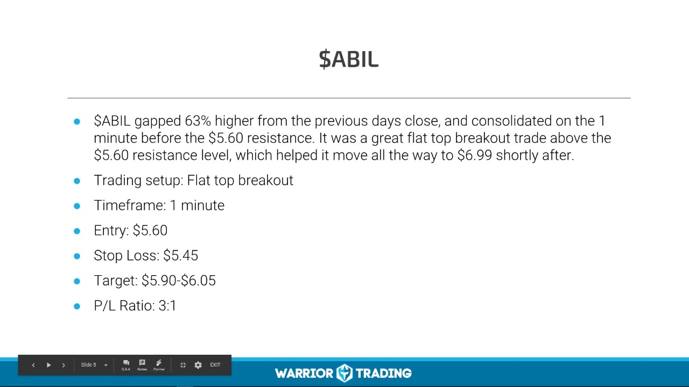

**图怎么看：**

- 显示了 $ABIL 在 1 分钟时间内的交易情况，价格从 $5.60 开始上涨。
- 在 $5.60 抵抗位附近形成了一次旗形突破，随后价格迅速上涨到 $6.99。
- 交易策略为旗形突破，入场点为 $5.60，止损点为 $5.45。
- 目标价格区间为 $5.90-$6.05，盈亏比为 3:1。

### 关键内容

- AWX股票在前一天收盘价基础上大幅高开，形成明显的缺口突破机会。
- IFMK股票出现旗形突破，表明市场存在向上突破的动能。
- ABIL股票在关键阻力位附近形成平顶突破，显示市场可能继续上涨。
- 缺口突破和旗形突破策略需要结合成交量和趋势线来确认。
- 交易者应关注突破后的成交量，以确认突破的有效性。
- 缺口突破策略要求交易者在开盘价附近进入，以保持较小的止损。
- 旗形突破策略要求交易者等待价格突破趋势线，然后迅速入场。
- 交易者应设定合理的盈利目标，以实现2-1或3-1的盈利止损比。

### 分析与执行顺序

1. 首先，识别AWX股票的显著缺口突破，确认其作为缺口突破策略的候选。
2. 接着，分析IFMK股票的旗形突破，寻找突破后的成交量确认。
3. 然后，评估ABIL股票的平顶突破，确定突破的关键阻力位。
4. 使用TradingView平台查看股票的实时图表，确认突破的有效性。
5. 设置止损和止盈点，确保交易符合2-1或3-1的盈利止损比。
6. 监控交易过程中的成交量变化，以确认突破的有效性。

### 案例与细节

- AWX股票在前一天收盘价基础上大幅高开，形成53%的缺口，随后成交量激增，确认了缺口突破。
- IFMK股票在突破旗形后，成交量显著增加，表明市场存在强烈的买盘压力。
- ABIL股票在关键阻力位560附近形成平顶突破，随后成交量激增，确认了突破的有效性。

### 风险与边界

- 缺口突破和旗形突破策略依赖于成交量，如果成交量不足，突破可能无效。
- 交易者应谨慎管理风险，避免过度追涨杀跌。
- 录制年代限制为2018年，交易环境和规则可能已发生变化。

### 复盘问题

- 如何识别缺口突破和旗形突破的交易机会？
- 缺口突破策略中，交易者应如何设置止损和止盈点？
- 如何通过成交量确认缺口突破和旗形突破的有效性？

---

## v0383：小盘股市场中的牛旗突破模式

> 日期：2018-08-28　·　时长：01:07:37

**本场重点：** 识别牛旗突破模式可以帮助新手找到盈利机会，但需要耐心等待突破发生。

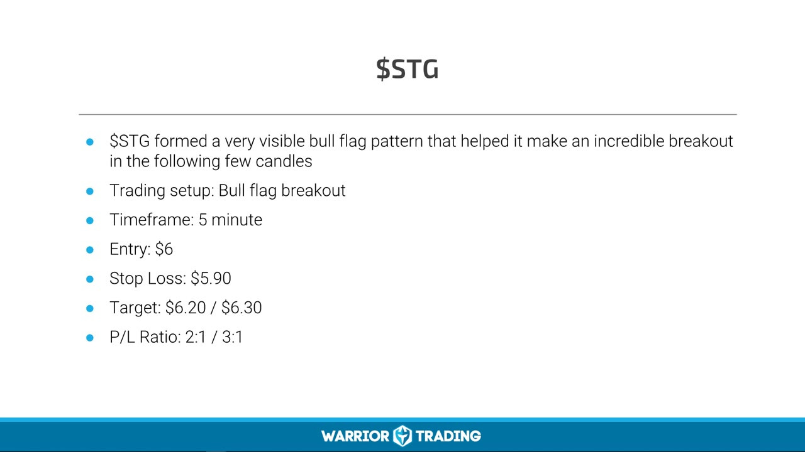

**图怎么看：**

- 在1419秒时，展示了一个交易策略，包括入场价为$6，止损价为$5.90，目标价为$6.20或$6.30，盈亏比为2:1或3:1。
- 该策略基于STG股票形成了一个非常明显的牛旗突破模式，帮助其实现了一次惊人的突破。
- 交易类型为牛旗突破，时间框架为5分钟。
- 通过分析图表上的K线和成交量柱，可以理解到这是一个成功的交易案例。

### 关键内容

- 讲师通过PTIE、SSC和STG三个股票实例，展示了牛旗突破模式的识别方法。
- 牛旗突破模式通常出现在大成交量之后，表明价格可能继续上涨。
- 使用趋势线可以帮助识别突破点，但有时突破可能不会按照预期发生。
- 新手应该设定2:1的盈亏比，以提高交易成功率。
- 识别牛旗突破模式的关键是找到高点，这些高点可以作为潜在的阻力位。
- 在突破发生时，成交量通常会显著增加，这是确认突破的重要信号。
- 新手应该关注成交量的变化，以判断突破是否有效。
- 识别牛旗突破模式有助于新手在小盘股市场中找到盈利机会。
- 识别牛旗突破模式后，新手应耐心等待突破发生，而不是立即进入交易。
- 识别牛旗突破模式的关键在于找到高点，这些高点可以作为潜在的阻力位。

### 分析与执行顺序

1. 讲师首先介绍了牛旗突破模式的重要性，然后通过PTIE、SSC和STG三个股票实例进行讲解。
2. 讲师解释了如何识别牛旗突破模式，包括高点和趋势线的应用。
3. 讲师强调了识别牛旗突破模式的关键是找到高点，这些高点可以作为潜在的阻力位。
4. 讲师通过PTIE、SSC和STG的图表，展示了如何识别牛旗突破模式的具体步骤。
5. 讲师解释了如何计算价格目标，以实现2:1的盈亏比。
6. 讲师强调了识别牛旗突破模式后，应耐心等待突破发生，而不是立即进入交易。
7. 讲师通过PTIE、SSC和STG的实例，展示了如何识别牛旗突破模式的具体步骤。

### 案例与细节

- PTIE股票在五分钟图上形成了明显的牛旗突破模式，突破发生在开盘后的高量之后。
- SSC股票在五分钟图上形成了两个不同的牛旗突破模式，突破发生在高量之后。
- STG股票在五分钟图上形成了一个清晰的牛旗突破模式，突破发生在低量之后。
- PTIE股票的突破发生在163美元附近，突破点的成交量显著增加。
- SSC股票的突破发生在455美元附近，突破点的成交量显著增加。
- STG股票的突破发生在6美元附近，突破点的成交量显著增加。

### 风险与边界

- 识别牛旗突破模式后，突破可能不会按照预期发生，因此需要耐心等待。
- 识别牛旗突破模式的关键在于找到高点，但有时高点可能不会成为真正的阻力位。
- 识别牛旗突破模式后，新手应设定2:1的盈亏比，但实际交易中可能无法完全实现。

### 复盘问题

- 识别牛旗突破模式的关键是什么？
- 如何计算价格目标以实现2:1的盈亏比？
- 识别牛旗突破模式后，应如何操作？

---

## v0384：从SIM到Live交易的过渡策略

> 日期：2018-09-04　·　时长：00:58:32

**本场重点：** 从SIM到Live交易的过渡策略，通过小规模开始，关注利润而非佣金。

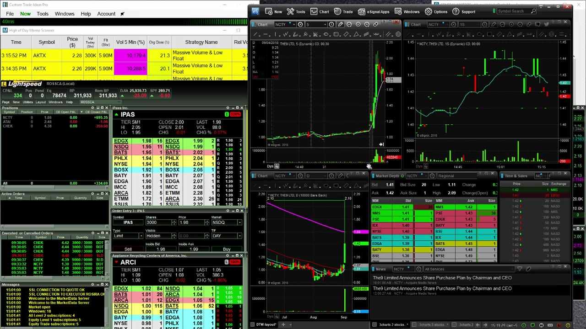

**图怎么看：**

- 在实时交易界面中，可以看到多个股票的市场深度，包括NCTY、XBIO等。
- 界面右侧显示了NCTY的图表，包括K线图和成交量柱状图。
- 左侧的表格显示了不同股票的实时数据，如价格、成交量和订单状态。
- 界面底部显示了当前的交易订单，包括买进和卖出的订单详情。

### 关键内容

- 从SIM到Live交易的最佳方式是从真实资金开始，使用小规模交易。
- 关注利润而非佣金，初期交易量较小，佣金占比较大。
- 逐步增加交易规模，当证明盈利后，佣金变得不那么重要。
- 使用Level 2监控市场深度，关注买卖订单。
- 在模拟交易中积累经验，再转向真实交易。
- 保持情绪稳定，面对市场波动。
- 保持交易纪律，避免冲动交易。
- 了解税务规定，正确申报收入
- 通过观察NCTY股票的200移动平均线，可以确认买入时机，但需要关注市场波动带来的不确定性。
- 使用Level 2监控市场深度时，注意观察买卖订单的变化，这有助于识别潜在的市场操纵行为。
- 在交易过程中，保持情绪稳定至关重要，特别是在市场波动较大时，情绪波动可能导致决策失误。
- 通过模拟交易积累经验，逐步增加交易规模，直到证明盈利后，再转向真实交易，这有助于降低风险。
- 关注市场热点，利用扫描器发现潜在机会，但需谨慎，因为热点可能很快消失，需持续监控市场变化

### 分析与执行顺序

1. 记录交易前的准备，包括设置Level 2监控。
2. 通过模拟交易积累经验，逐步增加交易规模。
3. 关注市场热点，利用扫描器发现潜在机会。
4. 保持情绪稳定，面对市场波动。
5. 在模拟交易中测试策略，确保盈利后再转向真实交易。
6. 保持交易纪律，避免冲动交易。

### 案例与细节

- NCTY股票，开盘价1.34美元，预估高点，交易者关注。
- C-H-E-K股票，开盘价42美元，交易者迅速入场。
- MOTS股票，大成交量后出现大价差，交易者关注。
- NCTY股票，交易者关注200移动平均线，确认买入时机。
- TRPX股票，交易者关注快速移动的Level 2，寻找买入机会。
- NCTY股票，交易者关注200移动平均线，确认买入时机，但需注意市场波动带来的不确定性。
- C-H-E-K股票，开盘价42美元，交易者迅速入场，但需注意市场波动可能导致亏损。
- MOTS股票，大成交量后出现大价差，交易者关注，但需注意市场操纵行为的可能性

### 风险与边界

- 交易策略可能因市场变化而失效，需持续监控。
- 税务规定可能变化，需定期更新税务知识。
- 市场波动可能导致亏损，需严格控制风险。
- 交易软件可能更新，需适应新功能。
- 录制年代限制，部分信息可能不再适用。
- 市场波动可能导致亏损，需严格控制风险，避免过度交易。
- 交易策略可能因市场变化而失效，需持续监控市场趋势。
- 税务规定可能变化，需定期更新税务知识，以确保合规。
- 录制年代限制，部分信息可能不再适用，需关注最新市场动态

### 复盘问题

- 如何从SIM交易平滑过渡到Live交易？
- 在交易过程中如何保持情绪稳定？
- 如何利用Level 2监控市场深度？

---

## v0385：技术图表中的突破模式

> 日期：2018-09-18　·　时长：00:59:30

**本场重点：** 识别并利用技术图表中的突破模式进行交易，适用于小盘股和大盘股市场。

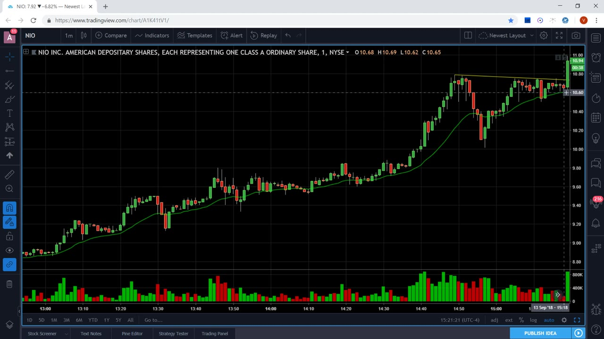

**图怎么看：**

- 在NIO Inc.的图表中，可以看到股价从底部开始逐渐上升，并在顶部形成一个明显的高点。
- 成交量柱的高度反映对应周期内的总成交量；红绿着色通常跟随价格柱的涨跌规则，不能直接拆成两种方向的主动成交。
- 图表上的水平线可能表示支撑位或阻力位，帮助投资者判断当前市场的趋势。
- 通过观察这些图表，投资者可以更好地理解股票的价格波动和潜在的交易机会。

### 关键内容

- N-I-O形成了多个一分钟时间框架内的技术交易机会，包括平顶突破和牛旗突破。
- 平顶突破通常在高点附近形成，表明价格试图突破阻力位。
- 牛旗突破发生在价格突破趋势线后，表明市场情绪转向积极。
- 止损通常设置在前一个低点，目标则基于2:1的风险回报比。
- 耐心持有盈利交易可以实现更大的利润，但需警惕市场反转。
- 使用技术图表识别突破模式是提高交易胜率的关键。
- 牛旗突破和平顶突破模式在小盘股和大盘股市场都普遍存在。
- 交易者应根据市场情况调整止损和目标价。
- 技术图表中的突破模式需要结合市场趋势和成交量来判断。
- 交易者应保持耐心，避免过早获利了结导致错过更大利润的机会

### 分析与执行顺序

1. 首先，识别平顶突破和牛旗突破的图形特征。
2. 然后，确定止损和目标价，通常止损设在前一个低点，目标价基于2:1的风险回报比。
3. 接着，监控市场动态，确保交易符合预期。
4. 最后，根据市场反应调整交易策略，保持耐心等待突破确认。
5. 在交易过程中，持续监控市场变化，及时调整止损和目标价。
6. 利用技术图表识别突破模式，结合市场趋势和成交量进行决策。
7. 在交易前，确保了解相关股票的历史表现和市场环境

### 案例与细节

- N-I-O在一分钟时间框架内形成了多个平顶突破和牛旗突破，包括810、850和1075等价位。
- ATIA在五分钟时间框架内形成了一个牛旗突破，初始入场点约为175，止损设在165。
- AMD在五分钟时间框架内形成了一个牛旗突破，初始入场点约为345，止损设在3025。
- N-I-O的平顶突破发生在高点8.10附近，随后出现三次反弹，最终突破阻力位。
- ATIA的牛旗突破发生在高点175附近，随后出现一次反弹，最终突破阻力位。
- AMD的牛旗突破发生在高点345附近，随后出现一次反弹，最终突破阻力位

### 风险与边界

- 市场可能突然反转，导致止损被触发，因此需要设定合理的止损水平。
- 过度依赖技术图表可能导致忽视基本面因素，从而影响交易决策。
- 技术图表中的突破模式并非总是有效，需要结合其他指标进行综合判断。
- 交易者应关注市场情绪的变化，避免在市场情绪恶化时进行交易。
- 录制于2018年，部分市场规则和监管环境可能已发生变化，需谨慎应用

### 复盘问题

- 如何识别平顶突破和牛旗突破的图形特征？
- 在交易过程中，如何根据市场变化调整止损和目标价？
- 如何结合市场趋势和成交量来判断突破模式的有效性？

---

## v0386：市场缺乏动力，需等待确认信号

> 日期：2018-09-25　·　时长：00:37:10

**本场重点：** 当前市场缺乏动力，需等待确认信号进行交易；耐心和保守是关键。

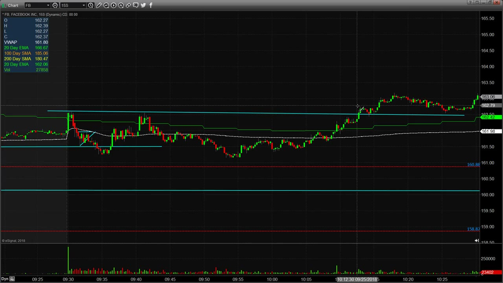

**图怎么看：**

- 图中显示了Facebook Inc.的股价走势，价格在红色水平线附近波动。
- 20日EMA、100日SMA和200日SMA均位于红色水平线上方，表明市场处于上升趋势。
- 成交量柱的高度反映对应周期内的总成交量；红绿着色通常跟随价格柱的涨跌规则，不能直接拆成两种方向的主动成交。
- 当前市场缺乏动力，需要等待确认信号进行交易，耐心和保守是关键。

### 关键内容

- 市场缺乏动力，连续几天出现反扑动作，表明市场缺乏持续性。
- 需要等待确认信号，如突破支撑位或阻力位，才能进行交易。
- 使用快速时间框架来确定精确的入场点，有助于提高交易成功率。
- 等待市场确认信号，避免在缺乏动力的市场中进行交易。
- 利用快速时间框架来捕捉市场变化，提高交易时机的选择性。

### 分析与执行顺序

1. 回顾过去几天的交易情况，发现市场缺乏动力，连续出现反扑动作。
2. 使用快速时间框架来确定精确的入场点，提高交易成功率。
3. 分析NTNX股票的图表，发现缺乏动力的情况，确认市场尚未恢复到可以预期大波动的水平。
4. 使用技术指标（如VWAP）来确认市场趋势，提高交易决策的准确性。
5. 耐心等待市场恢复动力，避免在缺乏动力的市场中频繁交易。
6. 总结经验教训，调整交易策略以适应当前市场环境。

### 案例与细节

- SQ股票在开盘后表现出强劲的上行趋势，但随后出现反扑，表明市场缺乏持续性。
- MU股票在开盘后表现出强劲的上行趋势，但随后出现反扑，表明市场缺乏持续性。
- NTNX股票在开盘后表现出强劲的上行趋势，但随后出现反扑，表明市场缺乏持续性。
- CRSP股票在开盘后表现出强劲的上行趋势，但随后出现反扑，表明市场缺乏持续性。
- Facebook股票在开盘后表现出强劲的上行趋势，但随后出现反扑，表明市场缺乏持续性。

### 风险与边界

- 市场尚未恢复到可以预期大波动的水平，因此需要更多确认。
- 使用快速时间框架来确定精确的入场点，可能会增加交易成本。
- 耐心等待市场恢复动力，可能导致错过交易机会。
- 依赖技术指标（如VWAP）来确认市场趋势，可能会受到市场波动的影响。

### 复盘问题

- 在当前市场环境下，哪些因素导致了交易失败？
- 如何通过技术指标（如VWAP）来确认市场趋势？
- 在缺乏动力的市场中，如何制定有效的交易策略？

---

## v0387：交易策略与风险管理

> 日期：2018-10-02　·　时长：01:01:06

**本场重点：** 1. 如何在多任务情况下保持专注；2. 交易过程中如何管理风险；3. 长期交易策略的有效性。

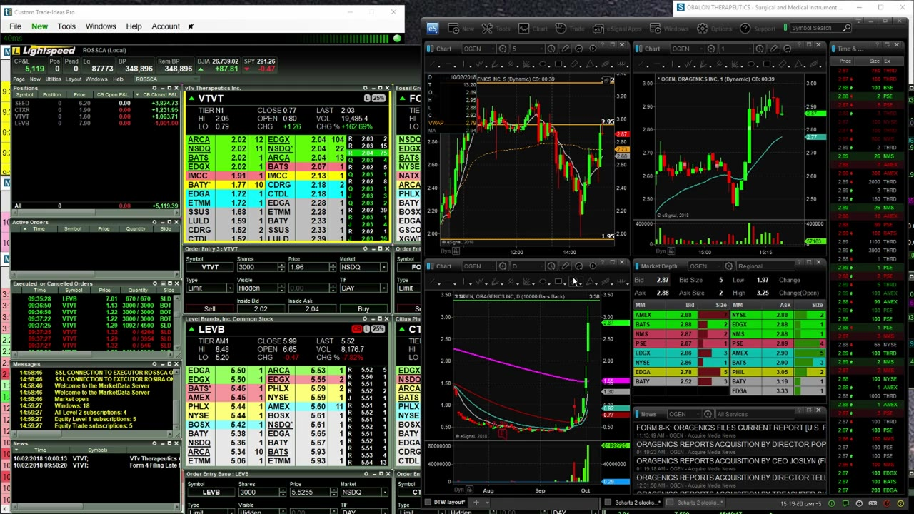

**图怎么看：**

- 画面中，可以看到多个股票的实时数据，包括价格、成交量和市场深度等信息。
- 画面中的Level 2显示了股票的买卖盘情况，帮助投资者了解当前市场的供需状况。
- Time & Sales窗口提供了即时的交易活动，显示了买卖订单的执行情况。
- 表格部分展示了不同股票的详细信息，如名称、代码、价格、成交量等，便于投资者进行分析和决策。

### 关键内容

- 讲师提到在多任务情况下如何保持专注，使用了四个主要股票窗口进行监控。
- 交易过程中，使用热键快速下单，但需要谨慎处理止损单。
- 长期来看，交易策略的成功取决于减少亏损天数和控制最大亏损。
- 使用止损单时，建议使用固定价格而非百分比，以适应低价股。
- 交易时，尽量保持冷静，避免因情绪波动导致过度交易。
- 使用技术指标如移动平均线来识别突破机会。
- 交易时，尽量减少执行风险，避免在市场波动时下单。
- 交易过程中，使用热键可以提高效率，但需要小心处理订单执行。
- 交易时，保持对市场动态的关注，及时调整策略。
- 交易时，使用止损单可以有效控制风险，但需要谨慎设置

### 分析与执行顺序

1. 讲师首先介绍了如何在多任务情况下保持专注，使用四个主要股票窗口进行监控。
2. 然后，讲师详细解释了如何使用热键快速下单，但强调需要谨慎处理止损单。
3. 接着，讲师分享了如何通过减少亏损天数和控制最大亏损来提高交易策略的成功率。
4. 讲师还提到了使用固定价格止损单的重要性，以适应低价股。
5. 最后，讲师强调了保持冷静和避免情绪波动的重要性，以及如何使用技术指标来识别突破机会。
6. 在整个过程中，讲师多次强调了执行风险的控制，包括避免在市场波动时下单。
7. 讲师还提醒学员，使用热键可以提高效率，但需要小心处理订单执行，以避免执行风险。
8. 在整个交易过程中，保持对市场动态的关注至关重要，及时调整策略可以提高成功率

### 案例与细节

- VTVT 股票，交易者在一天内进行了多次买卖操作，展示了如何利用热键快速下单。
- LEVB 股票，交易者在一天内进行了多次买卖操作，展示了如何使用止损单控制风险。
- CTXR 股票，交易者在一天内进行了多次买卖操作，展示了如何根据技术指标判断突破机会。
- O-Gen 股票，交易者在一天内进行了多次买卖操作，展示了如何根据移动平均线判断突破机会。
- VTVT 股票，交易者在一天内进行了多次买卖操作，展示了如何在市场波动时谨慎下单

### 风险与边界

- 交易过程中，如果市场突然出现大幅波动，可能会导致执行风险增加。
- 使用热键快速下单时，如果没有仔细检查订单细节，可能会导致错误下单。
- 长期交易策略的有效性依赖于市场环境的变化，可能需要适时调整策略。
- 交易过程中，如果过度依赖技术指标而忽视市场动态，可能会导致决策失误。
- 交易过程中，如果频繁进行交易而忽视风险管理，可能会导致资金损失

### 复盘问题

- 在多任务情况下，如何确保能够专注于最重要的交易机会？
- 使用热键快速下单时，有哪些注意事项可以避免执行风险？
- 如何通过减少亏损天数和控制最大亏损来提高交易策略的成功率？
- 在交易过程中，如何平衡情绪波动和理性决策之间的关系？
- 如何根据市场动态调整交易策略，以适应不断变化的市场环境？

---

## v0388：E-Signal 使用技巧

> 日期：2018-10-09　·　时长：00:38:36

**本场重点：** E-Signal 提供的数据和工具对于技术交易至关重要，但需要合理配置和使用。

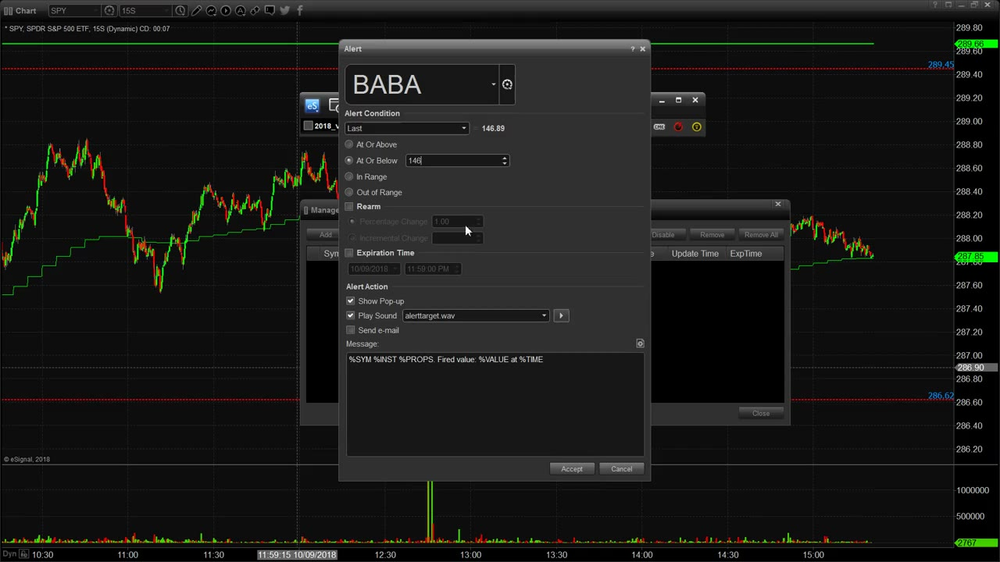

**图怎么看：**

- 这张截图展示了BABA股票的图表，其中包含了警报条件的设置。
- 用户可以自定义警报条件，例如当股价达到或低于某一水平时触发警报。
- 此外，还可以选择是否显示弹出窗口、播放声音或发送电子邮件作为警报动作。
- 这些设置对于投资者来说非常有用，可以帮助他们及时了解市场动态并做出决策。

### 关键内容

- E-Signal 提供的数据覆盖股票的整个历史，这对于技术分析非常重要。
- 使用快捷键可以快速切换图表时间框架，提高交易效率。
- 通过自定义快捷键，可以快速绘制趋势线和水平线等常用工具。
- 设置自定义的市场深度和新闻窗口，可以更好地监控市场动态。
- 使用纸交易功能可以在不实际交易的情况下测试策略。
- 通过保存样式模板，可以方便地在不同图表间复制线条。
- 使用E-Signal的实时数据进行技术分析，可以更准确地判断市场走势

### 分析与执行顺序

1. 打开E-Signal，选择主界面和工具栏。
2. 通过右键点击主界面，将图表从主界面分离出来。
3. 设置时间模板为8am到8pm，确保交易时间段一致。
4. 使用快捷键切换图表时间框架，如F1、F2、F3等。
5. 通过自定义快捷键，快速绘制趋势线和水平线等常用工具。
6. 确保所有交易都在8am到8pm之间进行，以避免影响成交量和价格走势。
7. 使用E-Signal的基本平台，避免过多复杂工具导致的混乱。
8. 通过锚定价格点来绘制趋势线，提高准确性。

### 案例与细节

- 使用E-Signal的点增益功能，查看涨幅最大的前10只股票。
- 设置F1、F2、F3分别为日线、5分钟、15秒时间框架的快捷键。
- 使用自定义快捷键Alt-T绘制趋势线，Alt-H绘制水平线。
- 设置自定义的市场深度和新闻窗口，监控市场动态。
- 使用E-Signal的纸交易功能进行模拟交易测试。
- 保存样式模板，方便在不同图表间复制线条。

### 风险与边界

- 使用E-Signal的基本平台可能会错过一些高级功能，但避免了混乱。
- 设置时间模板为8am到8pm可能会错过某些市场动态，但保证了数据的准确性。
- 使用E-Signal的点增益功能可能无法满足所有人的需求，但提供了基本的数据。
- 使用E-Signal的基本平台可能会限制策略的多样性，但保证了操作的简单性。

### 复盘问题

- 如何设置E-Signal的快捷键来提高交易效率？
- 如何使用E-Signal的纸交易功能进行模拟交易测试？
- 如何通过锚定价格点来绘制趋势线，提高准确性？
- 如何确保所有交易都在8am到8pm之间进行，以避免影响成交量和价格走势？

---

## v0389：技术分析与交易策略

> 日期：2018-10-16　·　时长：00:59:19

**本场重点：** 技术分析是交易决策的基础，但需要谨慎对待市场波动和风险。

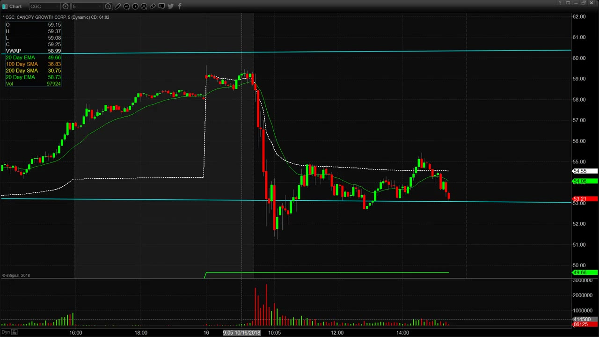

**图怎么看：**

- 这张图表显示了Canopy Growth Corp.的股价在一段时间内的波动情况。
- 可以看到股价从高位下跌后反弹，形成了一个明显的底部。
- 成交量柱的高度反映对应周期内的总成交量；红绿着色通常跟随价格柱的涨跌规则，不能直接拆成两种方向的主动成交。
- 均线（EMA）显示出股价的趋势方向，当前股价在均线之上，表明短期内可能继续上涨。

### 关键内容

- 技术分析显示TiVA近期突破了短期上升趋势，但尚未形成明确的买入信号。
- 在进行技术分析时，需要关注成交量的变化，低成交量可能预示着缺乏持续动力。
- 使用限价单下单可以提高成交概率，尤其是在高波动市场中。
- 在交易前应充分了解股票的基本面和技术面情况，避免盲目跟风。
- 技术分析需要结合市场情绪和新闻事件，单一指标不能完全决定交易决策。
- 在进行短卖操作时，需注意市场流动性，确保能够顺利平仓。
- 在交易过程中，应保持冷静，避免因市场波动而频繁调整交易计划。
- 技术分析只是辅助工具，不应完全依赖，需结合其他分析方法综合判断

### 分析与执行顺序

1. 讲师首先回顾了TiVA的走势，指出它近期突破了短期上升趋势。
2. 然后讨论了如何识别潜在的交易机会，强调了成交量的重要性。
3. 接着讲解了使用限价单下单的方法，以提高成交概率。
4. 最后提醒学员在交易前要充分了解股票的基本面和技术面情况。
5. 在整个过程中，讲师反复强调了技术分析的局限性，以及结合市场情绪和新闻事件的重要性。
6. 通过实例演示了如何识别市场信号，并结合限价单下单来提高交易成功率。
7. 最后总结了交易策略应根据个人情况和市场变化进行调整，不可一成不变

### 案例与细节

- TiVA近期突破了短期上升趋势，但成交量较低，显示出缺乏持续动力。
- 讲师建议使用限价单下单，以提高成交概率，特别是在高波动市场中。
- 在交易前，讲师强调了需要充分了解股票的基本面和技术面情况，避免盲目跟风。
- 通过实例演示了如何识别市场信号，如价格突破关键水平和成交量变化。
- 讲师指出，在进行短卖操作时，需注意市场流动性，确保能够顺利平仓。
- 在交易过程中，讲师反复强调了保持冷静的重要性，避免因市场波动而频繁调整交易计划

### 风险与边界

- 在交易过程中，如果市场出现大幅波动，可能会导致交易计划失效。
- 低成交量可能预示着缺乏持续动力，可能导致交易失败。
- 过度依赖技术分析可能导致忽视基本面因素，从而影响决策准确性。
- 交易策略应根据个人风险承受能力和市场情况进行调整，不可一成不变。
- 录制年代限制：本内容基于2018年的市场环境和交易规则，可能不适用于当前市场环境

### 复盘问题

- 在进行技术分析时，如何确定一个可靠的买入信号？
- 在交易前，如何评估一只股票的基本面和技术面情况？
- 在交易过程中，如何应对市场的大幅波动？
- 如何结合市场情绪和新闻事件来优化交易策略？
- 在进行短卖操作时，需要注意哪些风险点？

---

## v0390：GE股票交易案例分析

> 日期：2018-10-30　·　时长：00:32:26

**本场重点：** 通过GE股票交易案例，强调识别关键支撑位和阻力位的重要性，并在适当时机重新进入市场。

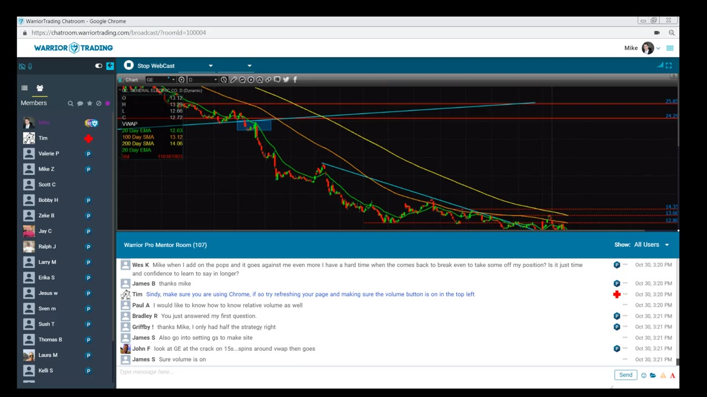

**图怎么看：**

- 通过GE股票交易案例，强调识别关键支撑位和阻力位的重要性，并在适当时机重新进入市场。
- 图中显示了GE股票的价格走势图，包括5分钟周期的K线图，以及移动平均线（EMA）和成交量柱状图。
- 可以看到股价在不同价位出现支撑和阻力，投资者可以根据这些信号做出买卖决策。
- 此外，图中还显示了成交量的变化，帮助判断市场的活跃程度和趋势变化。

### 关键内容

- GE股票在早盘出现预市场波动，显示出支撑位的重要性。
- 识别支撑位和阻力位是制定交易策略的关键。
- 在关键水平触发后，应等待确认信号再进行交易。
- 当GE股票突破支撑位时，应考虑重新进入市场。
- 交易过程中需关注市场情绪，避免因情绪影响决策。
- 交易者应保持耐心，等待关键水平再次触发。
- GE股票在1020美元附近形成新的支撑位，提供重新进入市场的机会

### 分析与执行顺序

1. 首先，观察GE股票的早盘表现，确认支撑位的重要性。
2. 识别GE股票的关键支撑位和阻力位，如1050美元和11美元。
3. 等待支撑位被突破的确认信号，如五分钟图的收盘价。
4. 在支撑位被突破后，重新进入市场，但需确认信号。
5. 保持耐心，等待关键水平再次触发，如1020美元支撑位。
6. 监控市场情绪，避免因情绪影响决策。
7. 记录交易过程中的关键数据，如支撑位、阻力位和交易量

### 案例与细节

- GE股票在1050美元附近形成重要的支撑位，但未突破。
- 当GE股票突破1050美元支撑位时，交易者应考虑重新进入市场。
- GE股票在1093美元附近形成重要阻力位，但未突破。
- 当GE股票突破1020美元支撑位时，交易者应重新进入市场。
- GE股票在11美元附近形成重要阻力位，但未突破

### 风险与边界

- 在支撑位被突破后，市场可能继续下跌，导致进一步损失。
- 交易者需要密切关注市场情绪，避免因情绪影响决策。
- 录制年代限制为2018年，当前市场环境可能有所不同。
- 支撑位和阻力位的识别依赖于技术分析，可能存在误判的风险

### 复盘问题

- 在支撑位被突破后，如何确认信号并重新进入市场？
- 交易过程中如何管理市场情绪，避免因情绪影响决策？
- 如何在关键水平触发后，制定有效的交易策略？

---

## v0391：股票交易策略与市场分析

> 日期：2018-11-06　·　时长：01:00:37

**本场重点：** 1. 讲师强调在强市中抓住股票的快速上涨机会；2. 使用Level 2图表监控买卖价格；3. 市场波动大时谨慎操作。

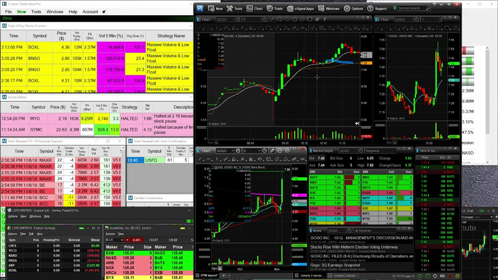

**图怎么看：**

- 在B选项中，可以看到Level 2图表，显示了买卖价格和成交量。
- 通过Level 2图表，可以实时监控市场的买卖动态，帮助投资者做出更明智的投资决策。
- 成交量柱的高度反映对应周期内的总成交量；红绿着色通常跟随价格柱的涨跌规则，不能直接拆成两种方向的主动成交。
- 成交量适合与前序时段或历史基准比较参与程度，但仅凭柱体颜色无法判断哪一方主动，也不能由此推断下一步方向。

### 关键内容

- 讲师提到在强市中股票会快速上涨，不需要等待回调。
- 使用Level 2图表监控买卖价格，特别是关注时间销售窗口。
- 在市场波动大时，要谨慎操作，避免被大单影响。
- 讲师建议在强市中抓住股票的快速上涨机会，而不是等待回调。
- Level 2图表显示红色代表买单，绿色代表卖单，白色代表在买卖价差之间。
- 讲师提到在市场波动大时，要关注一分钟和五分钟蜡烛图的变化。
- 使用Level 2图表可以更好地理解市场动态，尤其是买卖力量。
- 在市场波动大时，要特别注意大单的影响，避免被大单影响决策。

### 分析与执行顺序

1. 讲师首先介绍了市场情况，指出最近几个月市场的特点。
2. 然后解释了Level 2图表的作用，特别是时间销售窗口。
3. 接着讨论了在强市中抓住股票快速上涨的机会，不需要等待回调。
4. 讲师还提到了在市场波动大时，要特别注意一分钟和五分钟蜡烛图的变化。
5. 最后，讲师强调了使用Level 2图表的重要性，以更好地理解市场动态。

### 案例与细节

- BOLX在一天内从450涨到581，没有回调，说明在强市中股票会快速上涨。
- 讲师提到在市场波动大时，要特别注意一分钟和五分钟蜡烛图的变化。
- 讲师举例说明在市场波动大时，要特别注意大单的影响，避免被大单影响决策。

### 风险与边界

- 讲师提到在市场波动大时，要特别注意大单的影响，避免被大单影响决策。
- 在市场波动大时，要特别注意大单的影响，避免被大单影响决策。特别是在强市中，股票可能会迅速上涨，此时大单可能会导致价格大幅波动，增加交易风险。
- 在使用Level 2图表进行交易时，要警惕市场情绪变化带来的影响。例如，在市场情绪高涨时，即使Level 2图表显示买盘强劲，实际交易中也可能出现大量抛售，导致价格突然下跌。

### 复盘问题

- 在强市中抓住股票快速上涨的机会时，如何确定最佳入场点？
- 如何利用Level 2图表更好地理解市场动态？
- 在市场波动大时，有哪些具体的操作策略可以减少风险？

---

## v0392：小盘股市场技术分析

> 日期：2018-11-13　·　时长：01:05:30

**本场重点：** 本课程主要讲解了识别小盘股市场中的技术模式，如牛旗突破等，并提供了具体案例进行分析。

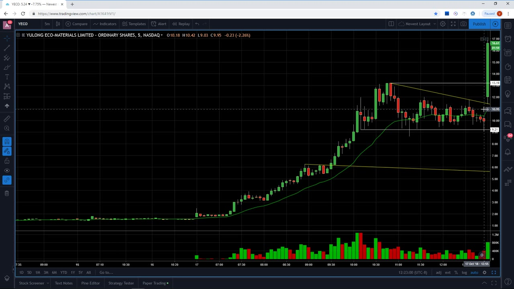

**图怎么看：**

- 整体界面显示了TradingView平台上的股票交易图表。
- 实际可见的ticker为YULONG ECO-MATERIALS LIMITED, 5, NASDAQ。
- 画面信息展示了该股票在不同时间段的价格走势，包括K线图、均线和成交量柱。
- 这张截图不能单独证明某次具体的交易策略，但可以用于说明如何通过技术分析来识别趋势和买卖信号。

### 关键内容

- 讲师指出牛旗突破模式在小盘股市场中同样有效，且能帮助识别高概率交易机会。
- 通过案例分析，展示了如何利用趋势线和支撑位来识别交易入场点。
- 强调了设置止损和目标价的重要性，以实现3:1的风险回报比。
- 讲师提到技术分析并非科学，有时模式不会如预期般运作，需要经验判断。
- 分享了如何使用热键快速进入交易，以抓住快速移动的机会。
- 通过案例分析，展示了如何识别并利用小盘股市场的技术模式，如牛旗突破。
- 强调了在交易前设置止损的重要性，以避免大额亏损。
- 讲师指出，虽然模式适用于小盘股市场，但实际操作中仍需谨慎。
- 讲师提醒，虽然模式有效，但市场波动可能导致交易失败。
- 讲师强调，虽然模式适用于小盘股市场，但实际操作中仍需谨慎

### 分析与执行顺序

1. 讲师首先介绍了牛旗突破模式在小盘股市场中的应用，通过案例分析进行讲解。
2. 然后，讲师详细解释了如何识别牛旗突破模式中的趋势线和支撑位。
3. 接着，讲师展示了如何设置止损和目标价，以实现3:1的风险回报比。
4. 讲师还强调了使用热键快速进入交易的重要性，以抓住快速移动的机会。
5. 最后，讲师通过多个案例分析，展示了如何识别并利用小盘股市场的技术模式。
6. 在整个过程中，讲师反复强调了设置止损的重要性，以避免大额亏损。
7. 讲师还提醒，虽然模式适用于小盘股市场，但实际操作中仍需谨慎

### 案例与细节

- ticker：NVLN；price_moves：股价从约70美分飙升至197美分；technical_pattern：形成了牛旗突破模式；entry_point：突破点位于192美分；target_price：目标价为2.35美分
- ticker：YECO；price_moves：股价从约1.5美元飙升至13美元；technical_pattern：形成了牛旗突破模式；entry_point：突破点位于12美分；target_price：目标价为15美分
- ticker：AEZS；price_moves：股价从130美分飙升至2.10美元；technical_pattern：形成了牛旗突破模式；entry_point：突破点位于205美分；target_price：目标价为220美分

### 风险与边界

- 虽然牛旗突破模式适用于小盘股市场，但市场波动可能导致交易失败。
- 技术分析并非科学，有时模式不会如预期般运作，需要经验判断。
- 虽然模式有效，但实际操作中仍需谨慎，避免大额亏损。
- 录制年代限制，部分市场规则和税务条件可能已发生变化。
- 虽然模式适用于小盘股市场，但实际操作中仍需谨慎，避免大额亏损

### 复盘问题

- 牛旗突破模式在小盘股市场中的应用有哪些关键点？
- 如何通过趋势线和支撑位识别交易入场点？
- 设置止损和目标价的具体方法是什么？
- 如何使用热键快速进入交易？
- 通过哪些案例分析可以更好地理解牛旗突破模式的应用？

---

## v0393：新年交易决心

> 日期：2018-12-05　·　时长：01:03:58

**本场重点：** 交易决心的重要性在于个人成长和持续改进，而非模仿他人。

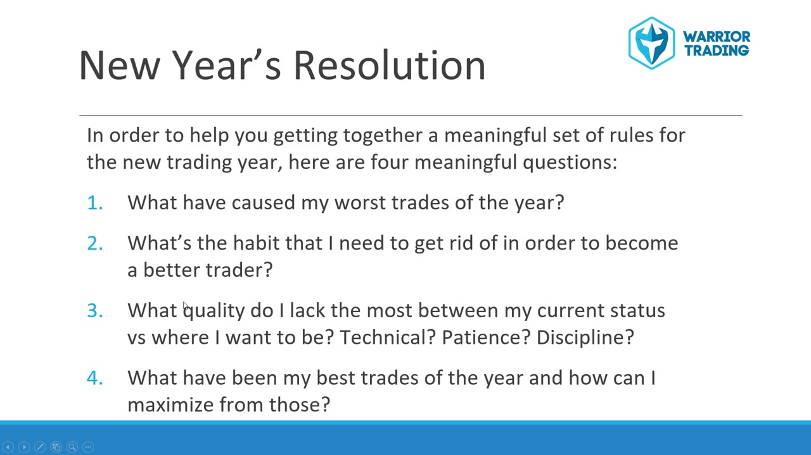

**图怎么看：**

- 这张图片展示了一份关于2017年新年的交易决心声明。
- 声明中提到了在$15 - $400价格范围内进行所有股票交易，并且在达到止损距离时总是停止。
- 此外，声明还强调了在9:33AM之前不进行任何交易，以及在亏损位置上绝不添加资金。
- 最后，声明指出只能在有意义的技术点（如3分钟的牛旗/熊旗）上增加资金，以确保收益最大化。

### 关键内容

- 新年决心是个人成长的重要工具，帮助识别弱点并设定目标。
- 成功交易者需要个人化的方法，而不是复制他人的成功。
- 通过分析过去一年的数据，可以确定当前的状态和未来的目标。
- 制定简单规则并承诺遵守，有助于实现长期进步。
- 使用TradingView的脚本可以自动绘制技术指标，提高交易效率。
- 成功的关键在于不断改进，而不是停滞不前。
- 个人化的交易策略比通用方法更有效。
- 使用TradingView可以节省成本并提高交易体验。
- 成功交易需要纪律和耐心，避免冲动交易。
- 制定新年决心时，应考虑自己的交易风格和个性

### 分析与执行顺序

1. 讲师首先引用了几个名言来强调决心和纪律的重要性。
2. 然后介绍了如何通过分析过去一年的数据来制定新年决心。
3. 接着分享了自己在2017年的新年决心，并展示了具体的规则。
4. 最后解释了如何使用TradingView的脚本来自动绘制技术指标。
5. 讲师还回答了观众的问题，包括E-Signal和TradingView的比较，以及如何设置止损限价订单等。
6. 总结了成功交易的关键要素，包括纪律、耐心和个人化策略。
7. 鼓励观众制定自己的新年交易决心，并在新的一年中坚持下去。

### 案例与细节

- 讲师提到自己在2017年的交易中，制定了一个只在15到400价格范围内交易的规则。
- 另一个例子是，讲师决定只在9:33之后进行交易，因为之前发现这个时间段过于波动。
- 讲师还提到了自己使用TradingView的脚本来自动绘制移动平均线，以提高交易效率。
- 讲师分享了自己在2017年的新年决心，包括不追加亏损仓位和只在有意义的技术点上加仓。
- 讲师还提到了自己使用TradingView的好处，包括成本效益和易于使用的特性。

### 风险与边界

- 录制于2018年，部分信息可能不再适用，如特定软件功能的变化。
- 成功交易的关键在于个人成长和持续改进，而非依赖于特定的交易策略。
- 使用TradingView可以节省成本，但需要适应其界面和功能。
- 制定新年决心时，需要根据个人情况调整，避免盲目模仿他人。

### 复盘问题

- 如何通过分析过去一年的数据来制定新年交易决心？
- 制定新年交易决心时，应该关注哪些方面？
- 使用TradingView的脚本有哪些优势？

---

## v0394：新手交易者的心路历程

> 日期：2018-12-11　·　时长：00:41:43

**本场重点：** 新手交易者如何克服心理障碍，实现自我提升。

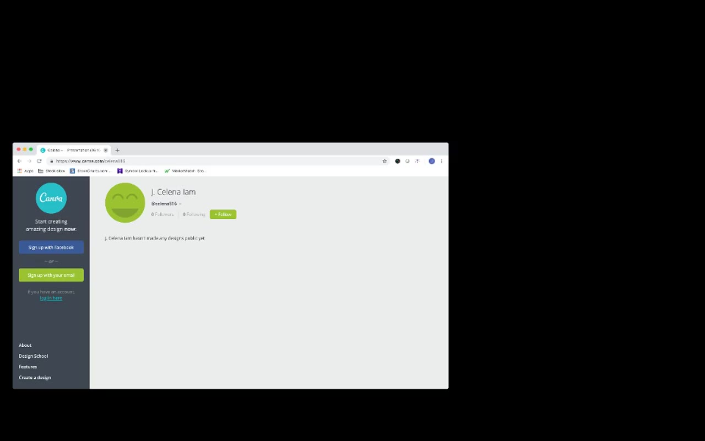

**图怎么看：**

- 在B选项中，可以看到一个网页界面，显示了一个名为J.Celena Lam的用户页面，这可能是一个在线交易平台或学习资源。
- 该页面提供了关于如何开始创建设计的信息，包括使用Facebook和电子邮件注册的选项。
- 此外，页面上还提到了一些设计学校和功能，这可能与新手交易者的心理障碍和自我提升有关。
- 这些元素表明，这个平台旨在帮助新手交易者克服心理障碍并提高他们的交易技能。

### 关键内容

- 交易者分享了自己从单亲妈妈到交易者的经历，强调了自我提升的重要性。
- 她提到交易需要自律，而自律不仅在交易桌上，还需要在生活中其他方面体现。
- 交易者分享了自己从失败到成功的经历，强调了持续学习和自我反思的重要性。
- 她指出交易者需要管理好自己的情绪，避免因情绪波动影响交易决策。
- 交易者分享了自己如何通过自律和自我发展来提高交易技能。
- 她强调了交易者需要不断学习和实践，以提高交易水平。
- 交易者提到交易者需要关注市场动态，制定合理的交易计划。

### 分析与执行顺序

1. 交易者首先介绍了自己作为单亲妈妈的经历，强调了培养女儿自立能力的重要性。
2. 她分享了自己如何通过交易来实现财务自由，并强调了自律的重要性。
3. 交易者讲述了自己从交易新手到成功交易者的经历，强调了持续学习和自我反思的重要性。
4. 她分享了自己如何通过自律和自我发展来提高交易技能，包括锻炼身体、冥想等。
5. 交易者强调了交易者需要管理好自己的时间和风险，以避免不必要的损失。
6. 她分享了自己如何通过自律和自我发展来提高交易技能，包括阅读书籍、参加课程等。
7. 交易者最后总结了交易者需要关注市场动态，制定合理的交易计划，以提高交易水平。

### 案例与细节

- 交易者提到自己曾经因为过度研究而每天花费12小时以上的时间在交易上，这导致了她的情绪波动。
- 交易者分享了自己如何通过自律和自我发展来提高交易技能，包括锻炼身体、冥想等。
- 交易者提到自己曾经因为过度交易而损失了32,293美元，这让她几乎放弃了交易。
- 交易者分享了自己如何通过自律和自我发展来提高交易技能，包括阅读书籍、参加课程等。
- 交易者提到自己如何通过自律和自我发展来提高交易技能，包括锻炼身体、冥想等。

### 风险与边界

- 交易者提到交易需要自律，但自律不仅限于交易桌上，还需要在生活中其他方面体现。
- 交易者提到交易需要管理好自己的时间和风险，以避免不必要的损失。
- 交易者提到交易需要持续学习和自我反思，以提高交易水平。
- 交易者提到交易需要关注市场动态，制定合理的交易计划，以提高交易水平。

### 复盘问题

- 交易者如何通过自律和自我发展来提高交易技能？
- 交易者分享了哪些具体的自律措施？
- 交易者如何管理自己的时间和风险？
- 交易者如何通过持续学习和自我反思来提高交易水平？
- 交易者如何通过关注市场动态来制定合理的交易计划？

---

## v0395：技术指标的简化应用

> 日期：2018-12-19　·　时长：01:01:24

**本场重点：** 1. 通过减少技术指标来提高交易效率。2. 简化交易布局以减少决策负担。3. 不要盲目添加技术指标，要根据个人情况调整。

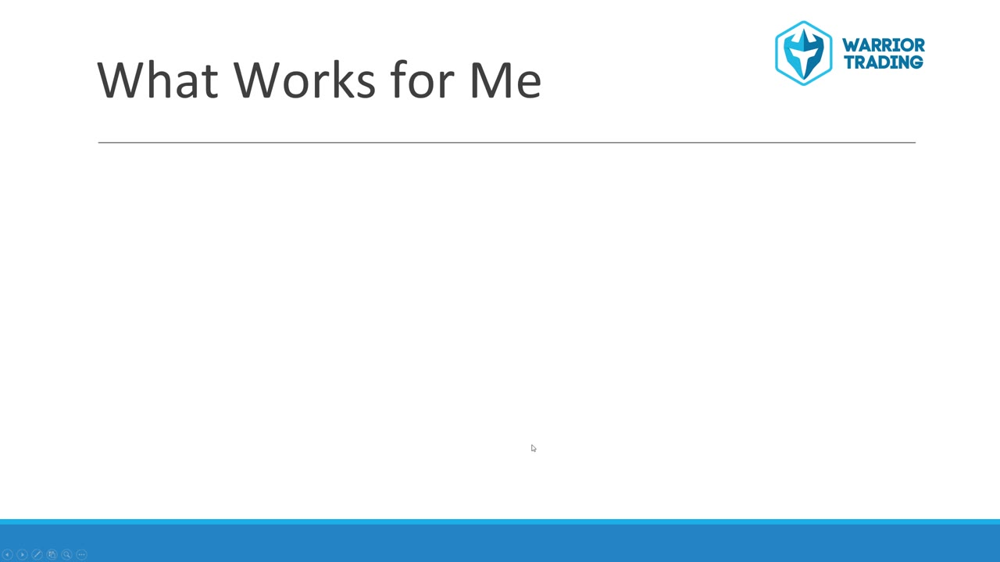

**图怎么看：**

- 这张图片显示了Twitter（TWTR）股票的日线图，展示了其价格走势和成交量。
- 图中可以看到价格在不同时间段内的波动情况，以及成交量的变化。
- 通过观察这些图表，可以分析出市场趋势和投资者情绪。
- 这有助于理解如何根据市场数据做出交易决策。

### 关键内容

- 罗伯托引用了关于噪音与沉默的名言，强调了简化交易的重要性。
- 他指出，使用过多的技术指标会分散注意力，影响交易决策。
- 罗伯托分享了自己在交易初期尝试多种技术指标的经历，最终发现简化交易布局更为有效。
- 他强调，每个交易者需要找到最适合自己的技术指标组合。
- 罗伯托展示了自己交易布局的简化版本，仅使用两个时间框架和两个技术指标。
- 罗伯托指出，没有一种技术指标组合适用于所有人，每个人需要找到最适合自己的方法。
- 他分享了自己在Twitter和Oracle股票上的交易案例，展示了简化交易布局的效果。
- 罗伯托强调，交易者需要花费时间和精力来简化自己的交易布局。
- 罗伯托提醒交易者，不要盲目添加技术指标，而要根据个人情况调整。

### 分析与执行顺序

1. 罗伯托首先引用了关于噪音与沉默的名言，强调了简化交易的重要性。
2. 接着，他分享了自己在交易初期尝试多种技术指标的经历，最终发现简化交易布局更为有效。
3. 然后，他展示了自己交易布局的简化版本，仅使用两个时间框架和两个技术指标。
4. 他解释了如何通过回测和实盘测试来确定最适合自己的技术指标组合。
5. 最后，他分享了自己在Twitter和Oracle股票上的交易案例，展示了简化交易布局的效果。

### 案例与细节

- 罗伯托在Twitter股票上使用了三个分钟和十分钟的时间框架，以及13 EMA指标，成功地抓住了关键的交易机会。
- 在Oracle股票上，罗伯托使用了200日均线和20日均线，以及三个分钟的时间框架，成功地抓住了关键的交易机会。
- 罗伯托分享了自己在Twitter和Oracle股票上的交易案例，展示了简化交易布局的效果，包括如何识别关键支撑和阻力水平。

### 风险与边界

- 录制年代限制，这些建议可能不适用于当前市场环境。
- 过度简化交易布局可能导致错过某些重要的交易机会。
- 交易者需要根据自己的资金管理和风险承受能力来调整交易策略。
- 技术指标的选择和使用需要结合市场情况进行灵活调整。

### 复盘问题

- 你如何理解罗伯托提到的‘噪音与沉默’的概念？
- 你认为哪些技术指标最适合你的交易风格？
- 你如何通过回测和实盘测试来确定最适合自己的技术指标组合？

---

## v0396：如何获得财务自由

> 日期：2018　·　时长：01:00:12

**本场重点：** 通过避免大额亏损来接近财务自由，理解市场波动和风险控制的重要性。

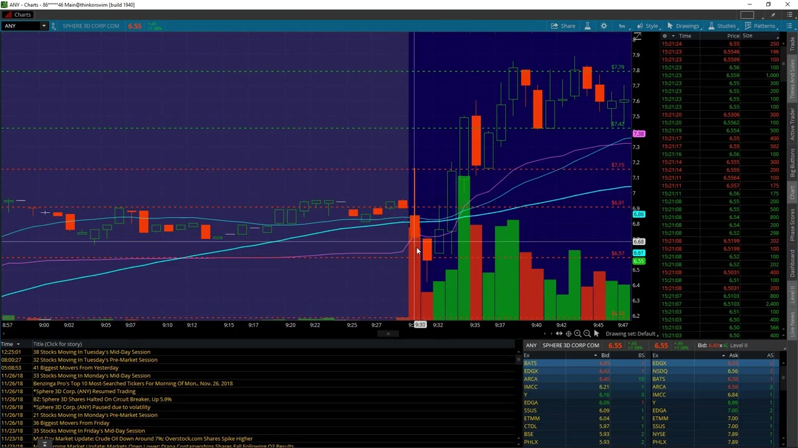

**图怎么看：**

- 图表显示了Sphere 3D Corp. (ANY) 股票的价格走势，包括开盘价、收盘价、最高价和最低价。
- 可以看到股价在9:30左右出现了一次明显的上涨，随后在9:40左右再次上涨。
- 成交量柱的高度反映对应周期内的总成交量；红绿着色通常跟随价格柱的涨跌规则，不能直接拆成两种方向的主动成交。
- 图表下方的时间轴显示了股票价格变化的时间点，帮助投资者了解市场的即时动态。

### 关键内容

- John 在 2011 年意识到工资顶峰后无法再增加，这让他思考如何获得财务自由。
- 避免大额亏损是获得财务自由的关键，因为这能保护你的资本不受损失。
- John 的故事展示了从工作到股市投资的转变过程。
- 市场上的大多数职位在 100-150K 左右达到顶峰，因为这些员工已经满足了基本需求。
- John 开始在股市投资是因为他的妻子开了一个经纪账户。
- 避免大额亏损是保护资本的关键，这有助于实现财务自由。
- John 讲述了如何通过技术分析和风险控制来保护资本。
- 市场波动和风险控制是获得财务自由的重要因素。
- John 强调了保护资本的重要性，而不是追求短期利润。
- John 的故事展示了如何通过避免大额亏损来接近财务自由

### 分析与执行顺序

1. John 回忆了他在 2011 年的工作经历，意识到工资顶峰后无法再增加。
2. 他开始思考如何获得财务自由，并决定在股市投资。
3. 他分享了如何通过技术分析和风险控制来保护资本，避免大额亏损。
4. 他强调了保护资本的重要性，而不是追求短期利润。
5. 他讲述了如何通过避免大额亏损来接近财务自由的过程。
6. 他提醒听众，市场波动和风险控制是获得财务自由的重要因素。
7. 他鼓励听众在交易前思考最终目标，保护资本，避免大额亏损

### 案例与细节

- 如果股票下跌 50%，需要赚回 100% 才能回到原点。
- 如果盈利 50%，然后亏损 50%，总体亏损 25%。
- 如果亏损 50%，需要赚回 300% 才能回到原点。
- GoPro 股价从 90 美元跌到 4 美元，显示了市场波动的风险。
- John 使用 Thinkorswim 平台进行交易，关注市场波动和技术分析

### 风险与边界

- 录制于 2018-2021 年，当时的市场情况可能与现在不同。
- John 的经验可能不适用于所有投资者，每个人的情况都不同。
- 市场波动和风险控制是获得财务自由的重要因素，但并非唯一因素。
- 保护资本是关键，但还需要考虑其他因素如市场趋势和个人能力

### 复盘问题

- 你如何理解财务自由的概念？
- 你认为保护资本的关键是什么？
- 你如何避免大额亏损？

---
