# Beginner Mentor Sessions：2019

> 33 场，合计 32.2 小时。返回 [Beginner Mentor Sessions 目录](../README.md)。

## v0397：思考像专业交易员一样：预市况分析

> 日期：2019-01-22　·　时长：00:59:24

**本场重点：** 思考如何像专业交易员一样，理解市场情绪和预市况分析的重要性。

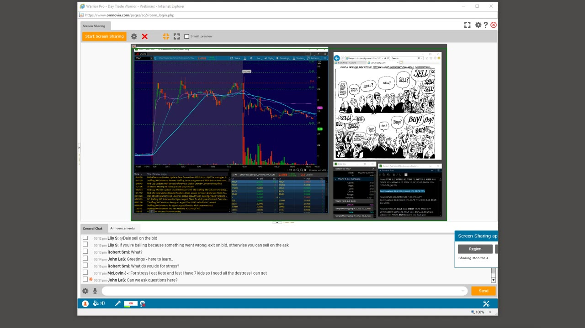

**图怎么看：**

- 画面是共享屏幕式交易工作区：左侧为主价格图，右侧放着辅助图像和小窗口，底部同时排列行情数据、订单或逐笔区域，最下方保留课程问答栏。
- 主图可见一段快速上冲后回落的价格结构，图中叠加多条水平参考线和曲线；这些线用于标记盘前需要观察的区间，而不是单独给出买卖结论。
- 把图表、市场数据窗口与提问区放在同一画面，正好对应本场“像专业交易员一样思考”：先组织证据和关键价位，再讨论市场情绪与计划。
- 截图只能说明讲师当时查看了哪些信息，无法证明某条水平线随后一定有效；读图时还要结合时间、成交环境和正文中的条件。

### 关键内容

- 交易市场的情绪波动如同过山车，新手往往无法控制情绪。
- 交易者需要理解市场规则，而不是盲目跟随市场。
- 交易者应关注资本保护和风险管理，而非追求短期收益。
- 新手常犯的错误是忽视规则，盲目跟风。
- 交易者应通过教育和经验来提升自己，而不是依赖运气。
- 交易者应避免过度自信，保持谨慎。
- 交易者应关注市场流动性，以避免大额亏损。
- 交易者应制定交易计划，并严格执行。
- 交易者应区分公司和股票，避免将公司的表现等同于股票的表现。
- 交易者应关注市场新闻和动量，以做出明智的交易决策。

### 分析与执行顺序

1. 讲师首先展示了一张讽刺漫画，以引起听众的兴趣。
2. 讲师解释了漫画中的情绪波动，指出新手往往无法控制情绪。
3. 讲师强调了交易者需要理解市场规则的重要性。
4. 讲师讨论了交易者应关注资本保护和风险管理的方法。
5. 讲师分享了自己在交易过程中的经验，包括如何制定交易计划。
6. 讲师强调了区分公司和股票的重要性，以及如何利用市场新闻和动量进行交易。

### 案例与细节

- 讲师提到GoPro的例子，说明虽然公司表现良好，但股票可能并不值得投资。
- 讲师展示了如何使用Thinkorswim软件进行预市况分析，包括查看市场动态和设置交易计划。
- 讲师分享了如何根据市场流动性决定是否进行交易，例如在流动性差的情况下减少交易规模。
- 讲师提到了如何通过观察市场新闻和动量来选择合适的交易时机，例如使用多用途高日扫描器。
- 讲师分享了如何通过观察市场水平线来判断支撑和阻力位，从而做出更明智的交易决策。

### 风险与边界

- 交易者应意识到市场规则的变化可能导致策略失效。
- 交易者应关注市场流动性变化，避免在流动性差的情况下进行大额交易。
- 交易者应认识到市场情绪波动可能导致过度交易或保守交易。
- 交易者应了解市场规则和税务规定的变化，以避免违规操作。

### 复盘问题

- 交易者如何通过教育和经验提高自己的交易技能？
- 交易者在制定交易计划时应注意哪些关键因素？
- 交易者如何区分公司和股票，避免将公司的表现等同于股票的表现？
- 交易者在预市况分析时应关注哪些指标和信号？
- 交易者如何通过观察市场流动性来调整自己的交易策略？

---

## v0398：小账户交易策略

> 日期：2019-02-05　·　时长：01:05:36

**本场重点：** 小账户交易者如何管理风险，使用90%的买入力进行交易，以及如何应对市场波动。

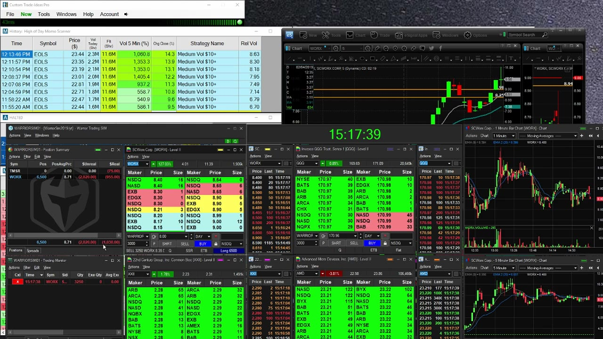

**图怎么看：**

- Level 2显示了多个股票的买卖价差和成交量。
- 可以看到不同股票的买卖价差和成交量，有助于分析市场流动性。
- Level 2提供了实时的市场深度信息，对交易决策非常有帮助。
- 通过观察Level 2，可以了解市场的买卖力量和趋势。

### 关键内容

- 讲师使用90%的买入力进行交易，以最大化每次交易的股份数量。
- 在初期阶段，交易者应使用较小的股份规模，以控制风险。
- 使用止损单时，应基于报价而非要价，以避免过高的滑点。
- 交易者应根据自己的风险承受能力来确定安全的股份规模。
- 在市场波动较大时，应更加谨慎地管理交易。
- 使用较小的股份规模可以降低交易成本，但可能限制盈利潜力。
- 交易者应定期评估自己的交易表现，并调整策略。
- 使用CMEG作为交易平台，可以享受直接访问路由和经纪人回扣计划。
- 交易者应关注市场波动较大的股票，这些股票可能会出现大幅波动。
- 交易者应设定每日最大亏损限额，以控制风险

### 分析与执行顺序

1. 讲师首先回答了Chad的问题，解释了如何使用90%的买入力进行交易。
2. 然后，讲师分享了自己在小账户挑战中的经验，包括如何管理风险。
3. 接着，讲师讨论了如何根据自己的风险承受能力来确定安全的股份规模。
4. 最后，讲师强调了定期评估交易表现的重要性，并提供了使用CMEG作为交易平台的建议。
5. 在整个过程中，讲师还提到了如何应对市场波动，以及如何设置止损单以控制风险。
6. 讲师还分享了如何使用较小的股份规模来降低交易成本，但同时也要注意可能限制盈利潜力。
7. 讲师还强调了交易者应设定每日最大亏损限额，以控制风险

### 案例与细节

- 讲师提到，在初期阶段，他使用了$583的账户，通过CMEG获得了$3,000的买入力。
- 在交易初期，他只交易了价格在$3到$4之间的股票，每次交易后立即卖出。
- 在一次交易中，他使用了NVTR股票，以648的价格买入了约2,500股，最终以668的价格卖出，获利500美元。
- 在一次交易中，他使用了BVXV股票，以59的价格买入了200股，最终以96的价格卖出，获利60美元。
- 在一次交易中，他使用了APOP股票，以689的价格买入了1,000股，最终以710的价格卖出，获利21美元。
- 在一次交易中，他使用了LEDS股票，以69的价格买入了200股，最终以71的价格卖出，获利2美元

### 风险与边界

- 讲师提到，使用90%的买入力进行交易可能会导致资金不足的风险。
- 在市场波动较大时，交易者需要更加谨慎地管理风险。
- 使用较小的股份规模可以降低交易成本，但也可能限制盈利潜力。
- 交易者需要定期评估自己的交易表现，并调整策略。
- 使用CMEG作为交易平台，虽然可以享受直接访问路由和经纪人回扣计划，但交易速度较慢。
- 交易者需要设定每日最大亏损限额，以控制风险

### 复盘问题

- 交易者如何根据自己的风险承受能力来确定安全的股份规模？
- 在市场波动较大时，交易者应该采取哪些措施来控制风险？
- 交易者如何使用止损单来保护自己的资金？
- 交易者在使用较小的股份规模时需要注意哪些问题？
- 交易者如何评估自己的交易表现，并据此调整策略？

---

## v0399：构建小型资本股票监控列表

> 日期：2019-02-19　·　时长：00:52:52

**本场重点：** 构建监控列表的原因是避免错过机会和节省时间和金钱。使用特定标准可以提高交易准确性。

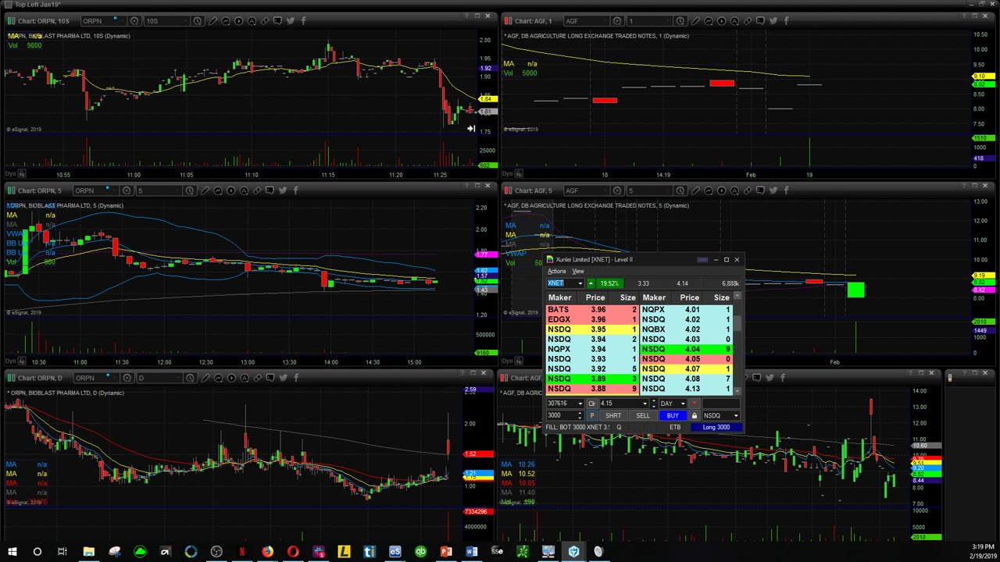

**图怎么看：**

- 在 Level 2 窗口中，可以看到当前市场上不同价格水平的买卖订单数量。
- 通过观察 Level 2 数据，投资者可以了解市场的供需状况。
- Level 2 数据可以帮助投资者做出更明智的交易决策。
- 例如，在当前图表中，我们可以看到多个买卖订单的价格和数量。

### 关键内容

- 讲师使用了$2到$10之间的股票，因为这些股票在突破一美元后通常会变得拥挤。
- 浮动作家低于$1000万的股票被选中，因为这是他最大的交易来源。
- 通过30天的数据标记，发现聚焦于特定标准可以提高交易准确性。
- 使用垫纸和笔记录过去两周的股票，保持相关性。
- 使用Ben Zinga Pro可以建立一个大名单，但需要定期编辑。

### 分析与执行顺序

1. 讲师首先介绍了构建监控列表的原因，包括避免错过机会和节省时间和金钱。
2. 然后，讲师分享了个人偏好的筛选标准，包括股票价格和浮动作家大小。
3. 接着，讲师展示了如何使用Trader View进行研究和标记。
4. 最后，讲师回答了观众的问题，包括如何使用Trader View和其他工具进行交易。
5. 在整个过程中，讲师强调了使用垫纸和笔记录过去两周的股票的重要性。
6. 讲师还解释了如何使用Ben Zinga Pro和Trader View进行研究和标记。
7. 最后，讲师回答了关于如何使用Trader View进行扫描和新闻服务的问题。

### 案例与细节

- 使用$2到$10之间的股票，因为这些股票在突破一美元后通常会变得拥挤。
- 使用浮动作家低于$1000万的股票，因为这是他最大的交易来源。
- 使用Trader View进行研究和标记，但需要手动操作。

### 风险与边界

- 使用Ben Zinga Pro需要定期编辑，否则会变得不相关。
- 使用Trader View进行研究和标记需要手动操作，可能不够高效。
- 使用Trader View进行扫描和新闻服务，但无法搜索国外市场。
- 录制于2019年，部分工具和平台可能已发生变化。

### 复盘问题

- 如何使用垫纸和笔记录过去两周的股票？
- 使用Trader View进行研究和标记的具体步骤是什么？
- 如何使用Ben Zinga Pro建立一个大名单？
- 使用Trader View进行扫描和新闻服务时需要注意哪些问题？

---

## v0400：大型股市场分析与交易策略

> 日期：2019-02-26　·　时长：01:05:45

**本场重点：** 分析SPY走势，识别关键阻力位，选择合适交易策略。

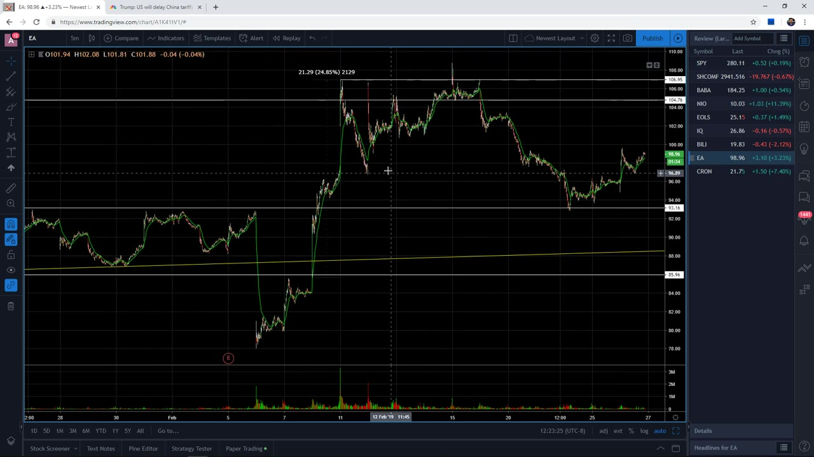

**图怎么看：**

- 整体界面显示了多个股票和指数的图表，包括SPY、SHCOMP、NIO等。
- 实际可见的ticker包括SPY、SHCOMP、NIO、BABA、EOLS、IQ、BILI、EA、CRON等。
- 画面信息对应本场主题，展示了不同股票和指数的价格走势，帮助识别关键阻力位并选择交易策略。
- 这张截图不能单独证明什么，需要结合其他信息进行综合分析。

### 关键内容

- 讲师分析了SPY的日线图，指出自去年12月以来持续上涨。
- 强调了281-22这一关键阻力位的重要性，因为它形成了11月的高点。
- 提到200移动平均线是最重要的阻力位之一，但市场可能需要先回调。
- 分析显示市场可能在高位形成顶点，但具体走势取决于经济数据和贸易谈判。
- 指出当前市场环境较为平稳，但未来可能再次变得波动。
- 提到特朗普延长贸易协议期限的消息，增加了市场对贸易协议达成的预期。
- 分析了阿里巴巴等中国股票的表现，指出它们可能正在恢复。
- 强调了技术分析的重要性，特别是识别支撑和阻力位。
- 讨论了如何利用技术分析来制定交易策略，特别是在模拟器中练习。
- 提醒学员注意止损设置，以控制风险

### 分析与执行顺序

1. 首先，讲师展示了SPY的日线图，回顾了自去年12月以来的走势。
2. 接着，讲师指出了281-22这一关键阻力位的重要性，并解释了其形成背景。
3. 然后，讲师分析了200移动平均线作为重要阻力位的作用，指出市场可能需要回调。
4. 进一步讨论了市场可能在高位形成顶点，但具体走势取决于未来的经济数据和贸易谈判。
5. 讲师分享了如何利用技术分析来制定交易策略，特别是在模拟器中练习。
6. 最后，讲师提醒学员注意止损设置，以控制风险。
7. 讲师还讨论了如何利用技术分析来识别支撑和阻力位，以制定交易策略

### 案例与细节

- SPY自去年12月以来持续上涨，形成了一个明显的上升趋势。
- 讲师指出，如果市场突破281-22这一关键阻力位，可能会继续上涨。
- 提到阿里巴巴的股价表现，从2018年下半年的熊市中恢复。
- 讲师分析了NIO的股价走势，指出它可能正在形成一个类似EOLS的交易机会。
- 提到CRON的股价走势，指出它可能已经形成了一个顶部，需要关注1948这一关键支撑位

### 风险与边界

- 讲师指出，市场可能在未来再次变得波动，因此需要保持警惕。
- 强调了技术分析的重要性，但同时也提醒学员，市场走势难以预测。
- 提醒学员注意止损设置，以控制风险，但具体数值需要根据个人情况确定。
- 录制于2019年2月，当时的市场环境和监管规则可能已发生变化

### 复盘问题

- 讲师是如何分析SPY的关键阻力位的？
- 如何利用技术分析来识别支撑和阻力位？
- 讲师提到了哪些具体的股票表现，这些表现如何影响交易策略？
- 如何在模拟器中练习交易策略？
- 讲师是如何建议新手交易者控制风险的？

---

## v0401：模拟交易入门常见问题解答

> 日期：2019-03-05　·　时长：01:03:18

**本场重点：** 1. 订单执行问题：新手常遇到订单执行慢的问题；2. 短期交易策略：如何设置止损和止盈；3. 资金管理：如何控制亏损并逐步增加仓位。

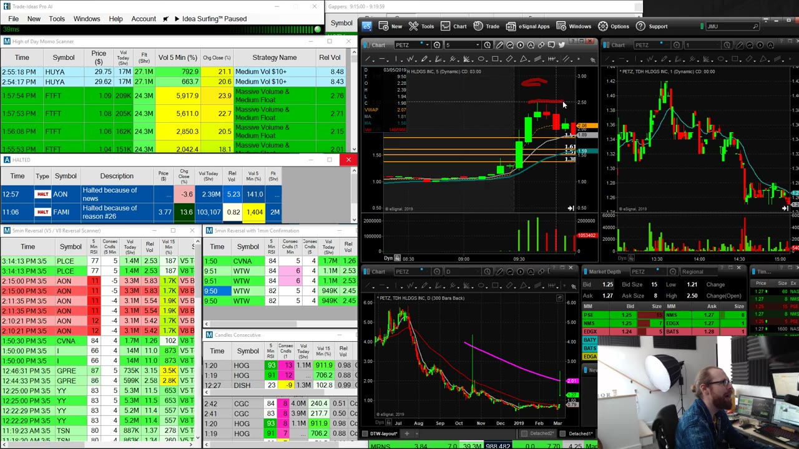

**图怎么看：**

- 在B选项中，可以看到多个股票交易窗口，包括Level II报价、时间与销售、订单执行等。
- Level II报价显示了买卖双方的价格和数量，有助于投资者了解市场动态。
- 时间与销售窗口展示了实时的交易数据，帮助投资者及时做出决策。
- 订单执行窗口显示了当前的订单状态，如已成交、未成交等，有助于投资者监控资金流动情况。

### 关键内容

- 讲师指出新手在模拟交易中遇到的问题是正常的，需要适应系统。
- 使用快捷键下单有助于快速执行订单，但市场快速变动时可能会导致延迟执行。
- 设置订单时，可以预先设定价格，以避免市场快速变动时出现不利的执行价格。
- 转换传统IRA到Roth IRA需要支付转换金额的所得税，但Roth IRA的收益免税。
- 在模拟交易中，可以使用隐藏订单来减少市场信息泄露，但在真实交易中需要设置显示数量为零。
- 使用隐藏订单可以减少市场信息泄露，但需要耐心等待订单执行。
- 设置止损和止盈时，可以使用市场价下单或限价下单，以控制风险。
- 交易时需要关注市场波动，合理设置止损和止盈以控制风险。

### 分析与执行顺序

1. 讲师首先回答了James关于订单执行的问题，指出新手在模拟交易中遇到的问题是正常的。
2. 然后讲师展示了如何使用快捷键下单，并解释了市场快速变动时可能导致订单执行延迟的原因。
3. 接着讲师介绍了如何设置订单以避免市场快速变动时出现不利的执行价格。
4. 讲师还提到了如何通过隐藏订单来减少市场信息泄露，但强调在真实交易中需要设置显示数量为零。
5. 最后，讲师强调了在模拟交易中可以使用隐藏订单，但在真实交易中需要设置显示数量为零的重要性。

### 案例与细节

- 特斯拉股价快速变动，使用Alt 1下单后，价格突然上升，导致订单执行价格高于预期。
- 如果将订单设置为在特斯拉股价低于80时执行，可以避免市场快速变动时出现不利的执行价格。
- 将订单设置为在特斯拉股价高于93时执行，可以避免市场快速变动时出现不利的执行价格。
- 使用隐藏订单可以在市场快速变动时减少信息泄露，但需要耐心等待订单执行。
- 在模拟交易中，可以使用隐藏订单，但在真实交易中需要设置显示数量为零。

### 风险与边界

- 在模拟交易中使用隐藏订单可以帮助减少信息泄露，但在真实交易中需要谨慎设置。
- 市场快速变动时，使用隐藏订单可能无法立即执行，需要耐心等待。
- 在真实交易中，需要确保设置显示数量为零，以避免信息泄露。
- 录制于2019年，部分交易规则和平台状态可能已发生变化。

### 复盘问题

- 在模拟交易中使用隐藏订单时，需要注意哪些事项？
- 如何在真实交易中设置隐藏订单？
- 在市场快速变动时，如何设置订单以避免不利的执行价格？

---

## v0402：新闻对股票交易的影响

> 日期：2019-03-19　·　时长：01:13:14

**本场重点：** 新闻对交易的影响是复杂且多变的，需要谨慎对待。理解新闻背后的逻辑和市场反应至关重要。

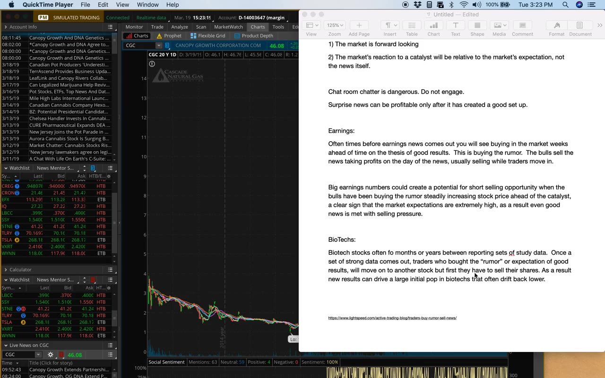

**图怎么看：**

- 显示了 Wynn Resorts Ltd. (NASDAQ: WYNN) 在过去 20 年中的股价表现。
- 图表上可以看到不同颜色的 K 线，代表不同的交易日。
- 成交量柱显示了每个交易日的成交量情况。
- 均线（如 EMA）用于分析股票的趋势和支撑阻力位。

### 关键内容

- 市场是前瞻性的，股价反映的是未来而非过去的表现。
- 买谣言卖新闻是一种常见现象，但需要谨慎使用。
- 投资者和交易者的区别在于，前者更注重长期投资，后者更关注短期波动。
- 新闻可能吸引大量关注，但不一定能准确预测股票走势。
- 心理因素在交易中起重要作用，需要保持冷静。
- 了解行业动态和世界新闻对做出正确决策至关重要。
- 使用技术工具如Benzinga可以获取实时新闻更新。
- 避免依赖聊天室消息进行交易，因为这可能导致情绪化决策。
- 注意新闻来源的可靠性，避免被虚假信息误导

### 分析与执行顺序

1. 讲师首先介绍了市场是前瞻性的特点，强调股价反映的是未来而非过去的业绩。
2. 接着讲解了买谣言卖新闻的现象，并指出这需要谨慎使用。
3. 然后讨论了投资者和交易者的区别，强调长期投资的重要性。
4. 讲师分享了一个关于Wynn Resorts的案例，说明了新闻对股票价格的影响。
5. 最后，讲师提醒学员注意新闻来源的可靠性，避免被虚假信息误导。

### 案例与细节

- 2017年初，Wynn Resorts因Steve Wynn的不当行为而股价大幅下跌，说明新闻对股票价格的影响。
- Long Blockchain Corporation更名为Long Blockchain Corporation后股价飙升，说明市场情绪的影响。
- 特斯拉CEO违反协议，股价反而上涨，说明市场反应可能与预期相反。
- Canopy Growth Corporation在加拿大大麻合法化后股价下跌，说明市场情绪变化的复杂性。
- 中国股市近期波动，说明国际事件对市场的影响

### 风险与边界

- 新闻可能带来情绪化的交易决策，需要保持冷静。
- 依赖单一新闻来源可能导致错误判断。
- 市场是复杂的，新闻可能只是众多因素之一。
- 录制于2019年，部分市场规则和操作方式可能已发生变化

### 复盘问题

- 如何区分新闻中的有效信息和无效信息？
- 在交易过程中，如何保持冷静并避免情绪化决策？
- 如何利用技术工具如Benzinga获取实时新闻更新？

---

## v0403：如何从大亏损中恢复

> 日期：2019-04-02　·　时长：01:00:44

**本场重点：** 从大亏损中恢复的关键是保持冷静，避免过度自信，及时止损。

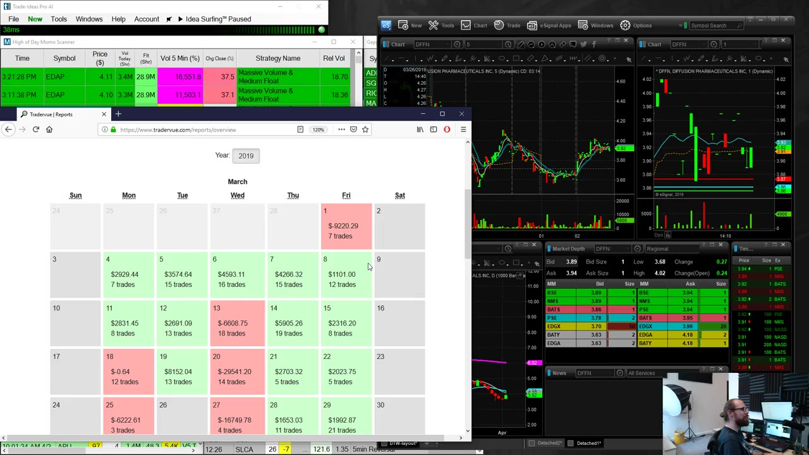

**图怎么看：**

- 画面中，可以看到一个详细的交易日历，显示了不同日期的交易活动。
- 实时交易数据包括股票代码、价格、成交量等关键信息。
- 这些数据对于理解市场动态和制定交易策略至关重要。
- 通过分析这些数据，投资者可以更好地把握市场趋势和机会。

### 关键内容

- 亏损最大的一天发生在3月20日，损失29,000美元。
- 作者在交易中过于激进，导致了大亏损。
- 作者意识到需要调整目标，不再过分关注单日利润。
- 作者通过减少交易次数和控制情绪来逐步恢复。
- 作者在交易中使用了止损策略，但并未严格执行。
- 作者通过调整交易策略来逐步恢复。
- 作者在交易中使用了多种止损方法，包括控制S键。
- 作者通过设定最大亏损来限制自己的风险

### 分析与执行顺序

1. 记录亏损最大的一天，分析原因。
2. 反思交易过程，识别情绪波动的影响。
3. 调整交易策略，减少激进行为。
4. 设定每日盈利目标，监控表现。
5. 使用模拟器积累经验，逐步提高。
6. 通过记录每日利润来监控自己的表现。
7. 使用多种止损方法，包括控制S键

### 案例与细节

- 3月20日，作者买入股票后迅速亏损29,000美元。
- 作者在交易中过于激进，导致了大亏损。
- 作者通过设定每日盈利目标来监控自己的表现。
- 作者在交易中使用了模拟器，以积累经验。
- 作者通过记录每日利润来监控自己的表现。
- 作者使用了多种止损方法，包括控制S键

### 风险与边界

- 录制于2018-2021年，当时的市场环境和规则可能已发生变化。
- 作者在交易中使用了多种止损方法，但并未严格执行，存在失效风险。
- 作者通过设定最大亏损来限制自己的风险，但这种方法可能不适合所有投资者。
- 作者在交易中使用了模拟器，以积累经验，但模拟器与真实交易环境可能存在差异

### 复盘问题

- 作者在交易中使用了哪些止损方法？
- 作者如何通过设定每日盈利目标来监控自己的表现？
- 作者在交易中使用了哪些工具来帮助自己恢复？
- 作者在交易过程中遇到了哪些挑战？
- 作者如何通过调整交易策略来逐步恢复？

---

## v0404：选择适合的交易电脑和设备

> 日期：2019-04-09　·　时长：00:58:35

**本场重点：** 选择合适的电脑和设备可以提高交易效率，减少错误。

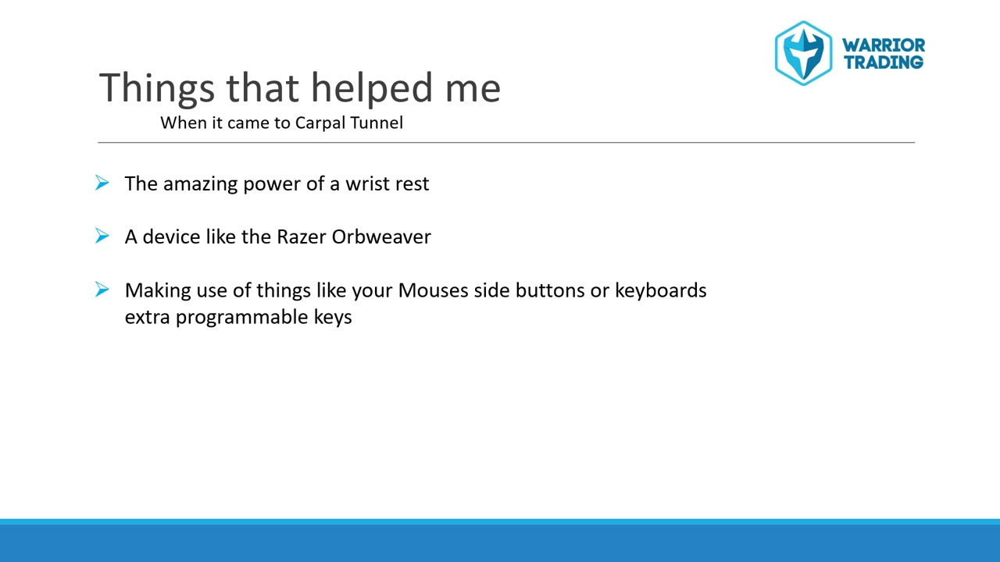

**图怎么看：**

- 这个截图展示了一个屏幕共享窗口，其中包含聊天记录。
- 聊天内容涉及对不同电脑配置的讨论，如Razer Orbweaver键盘和Alienware笔记本电脑。
- 这些讨论可能与如何选择适合交易的电脑和设备有关。
- 通过查看聊天记录，可以了解参与者对不同设备的看法和建议。

### 关键内容

- 讲师推荐使用Intel处理器，因为大多数交易平台都参考Intel处理器。
- 内存方面，8GB足够，32GB则有些过量。
- 固态硬盘比传统硬盘快很多，尤其是在启动速度上。
- 集成显卡在桌面电脑上能提供四个输出端口，方便连接多个显示器。
- 笔记本电脑推荐使用Core I7处理器，因为移动处理器通常不如台式机处理器快。
- 显示器刷新率至少60Hz，响应时间尽量低，最好不超过5毫秒。
- 鼠标侧键和键盘背光是提高交易效率的关键。
- 使用Synergy软件可以实现多台电脑之间的键盘和鼠标共享。
- 备份布局和设置非常重要，可以避免因意外导致的交易中断。
- 使用UPS电源可以确保交易站的稳定运行

### 分析与执行顺序

1. 讲师首先介绍了选择电脑的基本规格，包括处理器、内存和硬盘。
2. 然后讲解了显示器的选择标准，包括刷新率和响应时间。
3. 接着介绍了鼠标和键盘的选择要点，特别是侧键和背光。
4. 最后强调了备份布局和使用UPS电源的重要性。
5. 通过实际案例展示了如何选择和配置交易设备，以提高交易效率。

### 案例与细节

- 讲师提到，他使用的是E-Signal和Sterling平台，这些平台对电脑的要求较高。
- 他使用了8GB内存的电脑，但32GB内存的电脑也运行良好。
- 他使用了AOC品牌的显示器，刷新率为60Hz，响应时间为5毫秒。
- 他使用了Razer品牌的鼠标，具有侧键功能。
- 他使用了背光键盘，方便夜间操作。

### 风险与边界

- 由于录制于2019年，部分硬件和软件的功能可能已发生变化。
- 某些交易平台的具体要求可能会有所调整，需要查阅最新文档。
- 使用UPS电源虽然可以保证交易站的稳定性，但成本较高。
- 备份布局和设置虽然重要，但需要定期更新以适应新的交易需求。

### 复盘问题

- 选择电脑时，哪些因素最重要？
- 如何确保交易设备的稳定运行？
- 备份布局和设置的具体方法是什么？

---

## v0405：交易中的挑战与应对策略

> 日期：2019-05-14　·　时长：00:59:46

**本场重点：** 交易者面临市场变化、个人问题和财务压力等挑战，需要不断学习和调整策略。

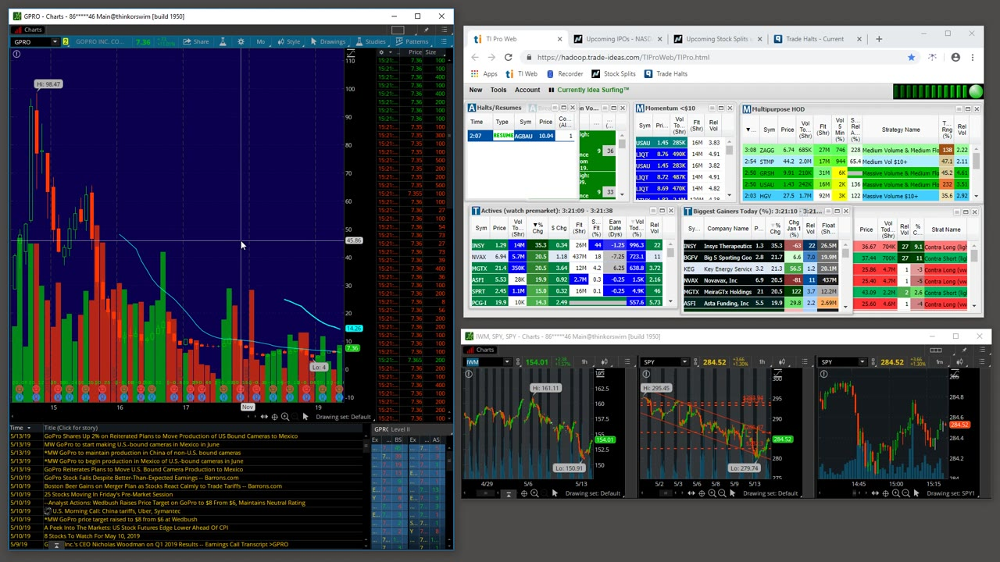

**图怎么看：**

- 整体界面显示了多个交易窗口，包括股票图表、Level 2、Time & Sales、表格和平台设置。
- 实际可见的ticker如NVAX、SPY等，以及相关的交易数据如价格、成交量、波动率等。
- 画面信息对应本场主题，展示了交易者在面对市场变化、个人问题和财务压力等挑战时的应对策略。
- 这张截图不能单独证明什么，阅读时应避免对具体数字进行猜测或解读。

### 关键内容

- 讲师提到市场变化、个人问题和财务压力是导致交易者艰难年份的主要原因。
- 市场变化和个人问题对交易者的影响是长期且复杂的。
- 个人问题包括工作干扰、家庭变动等，这些都会影响交易心理。
- 财务压力主要体现在资金管理和税务负担上，对交易决策有重要影响。
- 交易者需要学会接受小额亏损，并制定合理的交易计划。
- 使用TOS平台进行预市分析，可以提高交易成功率。
- 交易者应关注市场变化，及时调整交易策略。
- 交易者需要建立自己的交易系统，并不断优化以适应市场变化

### 分析与执行顺序

1. 讲师首先介绍了交易中的常见挑战，包括市场变化、个人问题和财务压力。
2. 然后详细解释了五分钱股票规则的变化如何影响交易策略。
3. 接着讨论了个人问题如何影响交易心理，如家庭变动和工作干扰。
4. 进一步探讨了财务压力如何影响交易决策，特别是税务负担。
5. 最后，讲师强调了继续教育的重要性，并分享了自己如何调整交易策略的经验

### 案例与细节

- 五分钱股票规则的变化导致许多股票无法交易，影响了交易策略。
- 讲师提到自己在学习交易期间经历了个人问题，如家庭变动和工作干扰。
- 讲师分享了自己如何通过调整交易策略来应对市场变化，如关注小盘股。
- 讲师提到自己使用TOS平台进行预市分析，提高了交易成功率。
- 讲师提到自己在交易过程中遇到过小额亏损，但学会了接受并继续交易
- 讲师提到自己在交易过程中遇到过市场变化，如市场趋势的变化，及时调整了交易策略

### 风险与边界

- 市场变化和个人问题的影响是长期且复杂的，可能超出预期。
- 财务压力可能导致交易者做出冒险的决策，增加风险。
- 继续教育不足可能导致交易者技能停滞，影响长期表现。
- 录制年代限制可能会影响某些特定规则和软件功能的适用性。
- 个人问题的具体情况因人而异，可能难以普遍适用

### 复盘问题

- 交易者如何应对市场变化，保持交易策略的有效性？
- 个人问题如何影响交易心理，交易者应如何调整心态？
- 财务压力如何影响交易决策，交易者应如何管理资金？
- 继续教育对于交易者的重要性体现在哪些方面？
- 交易者如何通过调整交易策略来应对市场变化？

---

## v0406：小型股交易策略

> 日期：2019-06-18　·　时长：01:01:24

**本场重点：** 交易小型股需要耐心和明确的风险管理策略，长时间持有大型股可能更适合。

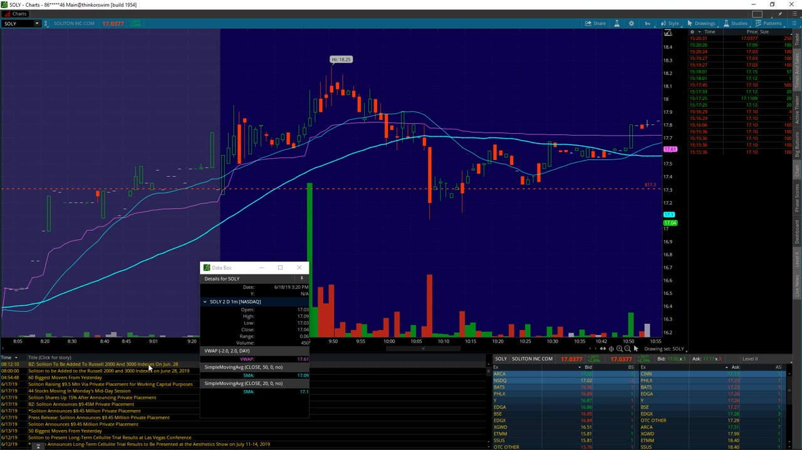

**图怎么看：**

- 画面中，可以看到一个股票的K线图，显示了价格波动情况。
- 水平绿线和红色虚线表示支撑和阻力位，帮助识别潜在的买卖点。
- 成交量柱显示了不同时间段内的交易活动，有助于理解市场情绪。
- 实时数据窗口提供了当前的价格、成交量等详细信息，便于分析

### 关键内容

- 交易小型股需要关注短期波动，而大型股则更注重长期趋势。
- 使用移动平均线来判断股票是否处于有利位置。
- 大型股交易中，应关注SPY的表现。
- 交易小型股时，应保持较小的交易规模。
- 在市场波动较大时，应减少交易次数。
- 交易小型股时，应关注重要支撑位和阻力位。
- 交易小型股时，应避免过度自信。
- 交易小型股时，应保持耐心，不要急于求成。

### 分析与执行顺序

1. 观察市场开盘后的表现，特别是早市的波动。
2. 识别关键支撑位和阻力位，如4.2美元。
3. 设定止损点，以防止重大亏损。
4. 关注移动平均线，判断股票是否处于有利位置。
5. 在市场疲软时，减少交易规模以控制风险。
6. 在市场波动较大时，减少交易次数。
7. 保持较小的交易规模，以避免重大损失。

### 案例与细节

- 市场开盘后，某股票价格下跌，跌破了50日移动平均线，表明市场情绪悲观。
- 某股票在一天内波动较大，从低点到高点达到了40美分，显示出市场波动性。
- 某股票在开盘后形成了一个下跌的蜡烛，表明市场情绪消极。
- 某股票在开盘后未能突破4.2美元的关键水平，表明市场情绪悲观。

### 风险与边界

- 交易小型股时，市场波动性较大，可能导致重大亏损。
- 在市场疲软时，应减少交易规模以控制风险。
- 交易小型股时，应设定止损点以避免重大损失。
- 录制于2019年，当时的市场环境和规则可能已发生变化。

### 复盘问题

- 在交易小型股时，如何识别关键支撑位和阻力位？
- 在市场疲软时，应采取哪些措施来控制风险？
- 如何在市场波动较大时调整交易策略？

---

## v0407：RSI在日内交易中的应用

> 日期：2019-07-02　·　时长：00:50:09

**本场重点：** 使用RSI指标来识别价格动量和交易机会，适用于短期交易。

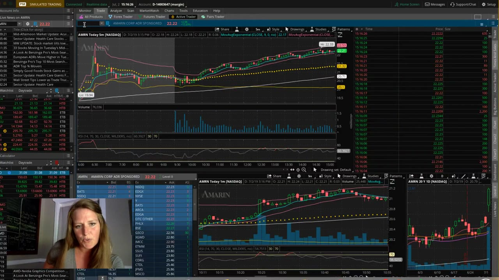

**图怎么看：**

- 实时交易数据显示Amarin Corp ADR的价格为22.22美元。
- 图表上可以看到成交量柱状图，表示买卖活动。
- 水平轴显示了时间戳，垂直轴显示了价格。
- 图表下方的Level 2显示了股票的深度信息，包括买盘和卖盘数量。

### 关键内容

- RSI指标用于识别价格动量，特别是在日内交易中。
- RSI测试60和70水平时，需要关注价格是否突破这些水平。
- RSI在价格测试60和70时提供即时反馈，帮助识别交易机会。
- RSI指标结合其他技术指标，可以提高交易决策的准确性。
- RSI测试60和70时，需要确认价格是否持续突破这些水平。
- RSI指标在价格测试60和70时，可以识别潜在的买入或卖出信号。
- RSI指标在价格测试60和70时，需要确认成交量是否配合。
- RSI指标在价格测试60和70时，需要确认价格是否形成有效突破。
- RSI指标在价格测试60和70时，需要确认价格是否形成有效支撑或阻力

### 分析与执行顺序

1. 首先，使用RSI指标识别价格动量，特别是在价格测试60和70水平时。
2. 其次，确认价格是否突破60和70水平，以识别潜在的买入或卖出信号。
3. 再次，确认成交量是否配合价格突破，以验证信号的有效性。
4. 然后，确认价格是否形成有效突破，以确认交易信号的有效性。
5. 最后，确认价格是否形成有效支撑或阻力，以确认交易策略的成功率

### 案例与细节

- Roku股票在测试60和70水平时，价格突破了60水平，但未能突破70水平。
- Roku股票在测试60和70水平时，价格突破了70水平，但随后回落，未能形成有效支撑。
- Roku股票在测试60和70水平时，价格突破了60水平，并形成了有效支撑，随后价格继续上涨。
- Roku股票在测试60和70水平时，价格突破了70水平，并形成了有效阻力，随后价格回落。
- Roku股票在测试60和70水平时，价格突破了60水平，但随后回落，未能形成有效支撑

### 风险与边界

- RSI指标在价格测试60和70水平时，需要确认价格是否持续突破这些水平，否则可能会出现假信号。
- RSI指标在价格测试60和70水平时，需要确认成交量是否配合价格突破，否则可能会出现假信号。
- RSI指标在价格测试60和70水平时，需要确认价格是否形成有效突破，否则可能会出现假信号。
- RSI指标在价格测试60和70水平时，需要确认价格是否形成有效支撑或阻力，否则可能会出现假信号。

### 复盘问题

- 在使用RSI指标识别价格动量时，如何确认价格是否突破60和70水平？
- 在使用RSI指标识别价格动量时，如何确认成交量是否配合价格突破？
- 在使用RSI指标识别价格动量时，如何确认价格是否形成有效突破？
- 在使用RSI指标识别价格动量时，如何确认价格是否形成有效支撑或阻力？

---

## v0408：RSI交易策略详解

> 日期：2019-07-09　·　时长：00:46:06

**本场重点：** 讲解如何使用RSI进行股票交易，特别是如何识别入场时机和风险控制。

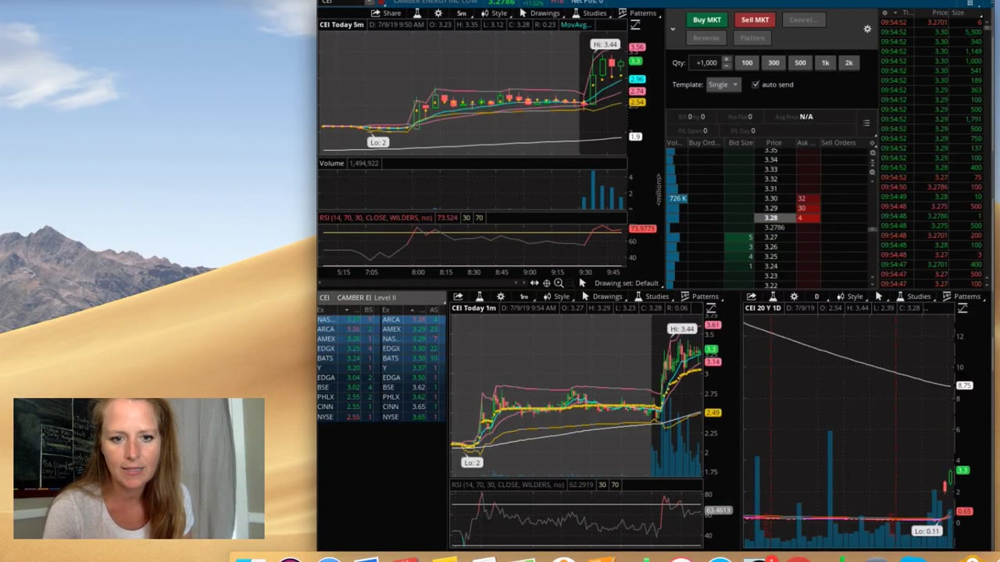

**图怎么看：**

- 画面中，可以看到多个股票的实时交易数据，包括价格、成交量和RSI指标。
- RSI指标显示了市场情绪的变化，红色和绿色柱状图代表不同方向的成交量。
- 水平线表示支撑和阻力位，帮助投资者判断买卖时机。
- 图表下方的表格显示了不同股票的详细信息，如代码、名称和当前价格。

### 关键内容

- RSI指标用于识别股票的强弱，特别是测试60和70线时。
- RSI指标显示股票可能有新的买入机会，但需确认是否突破70线。
- RSI指标可用于确认趋势和支撑位，但不应作为唯一决策依据。
- RSI指标可以帮助识别股票的相对强弱，但需要结合其他技术指标使用

### 分析与执行顺序

1. 首先，查看CEI的五分钟图表，寻找接近60线的股票。
2. 然后，关注一分钟图表，寻找测试60线的机会。
3. 接着，确认RSI指标是否突破60线，以确定进入机会。
4. 最后，确认价格行动是否支持RSI指标的突破，以降低风险。
5. 在整个过程中，持续监控RSI指标的变化，以适应市场变化。
6. 使用RSI指标时，还需结合其他技术指标，如趋势线和支撑位。
7. 在RSI突破60线时，应保持谨慎，确认价格行动是否支持

### 案例与细节

- CEI在开盘前表现出强劲的上升趋势，但当价格突破60线后，不再可靠。
- RSI指标显示CEI在开盘前的五分钟图表中接近60线，但当价格突破60线后，不再可靠。
- 在RSI突破60线时，应寻找进入机会，但需确认价格行动是否支持。
- 使用RSI时，需要关注一分钟和五分钟的时间框架。

### 风险与边界

- RSI指标并非绝对可靠的入场信号，需结合其他技术指标使用。
- RSI指标的有效性依赖于市场环境，不同股票可能有不同的表现。
- RSI指标仅能提供股票强弱的信息，无法预测未来走势。
- RSI指标的有效性受市场波动的影响，需密切关注市场变化。
- 录制于2019年，部分市场规则和条件可能已发生变化。

### 复盘问题

- 在RSI突破60线时，如何确认价格行动是否支持？
- 使用RSI指标时，还需要结合哪些其他技术指标？
- 在实际操作中，如何平衡RSI指标与其他技术指标的使用？

---

## v0409：Thinkorswim交易平台使用指南

> 日期：2019-07-16　·　时长：01:02:31

**本场重点：** Thinkorswim平台存在一些技术问题，但适合新手投资者进行长期投资。

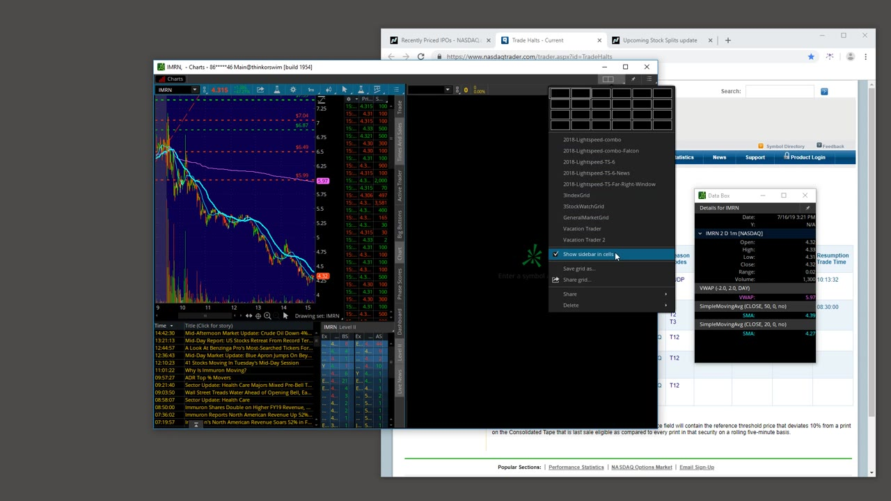

**图怎么看：**

- 在图中，我们可以看到 Goldman Sachs Group Inc. (GS) 的股价趋势。
- 图表上显示了开盘价、最高价、最低价和收盘价等关键数据。
- 水平轴表示时间，垂直轴表示价格。
- 右侧的 Level 2 显示了买卖盘的数量和价格。

### 关键内容

- 讲师提到Thinkorswim平台在市场开盘初期有时会出现技术问题，影响交易执行。
- 虽然存在这些问题，但平台支持多样，适合新手投资者进行长期投资。
- Thinkorswim平台的图表功能强大，但设置复杂，新手可能难以适应。
- 平台提供了多种技术支持方式，包括电话和技术聊天，有助于解决交易问题。
- Thinkorswim平台的费用结构简单，没有隐藏费用，适合希望节省成本的投资者。
- 平台的订单执行速度较快，适合快速交易，但新手可能需要更多时间熟悉。
- 使用Thinkorswim平台时，需要谨慎设置订单类型，避免市场波动带来的损失。
- 平台的图表功能丰富，但新手可能需要更多时间来熟悉各种图表设置。
- 虽然存在技术问题，但Thinkorswim平台仍然适合新手投资者进行长期投资。

### 分析与执行顺序

1. 讲师首先介绍了自己使用Thinkorswim平台的经历，包括账户开设和资金管理。
2. 接着，讲师详细讲解了Thinkorswim平台存在的技术问题，特别是在市场开盘初期。
3. 然后，讲师分享了如何使用Thinkorswim平台的图表功能，包括设置和使用方法。
4. 接着，讲师强调了使用Thinkorswim平台时需要注意的电脑硬件要求。
5. 最后，讲师总结了Thinkorswim平台的优点和缺点，并给出了使用建议。

### 案例与细节

- 讲师提到使用Thinkorswim平台进行交易时，有时会遇到市场开盘初期的技术问题，导致交易失败。
- 讲师表示，使用Thinkorswim平台时，需要关注电脑硬件性能，以避免技术故障。
- 讲师举例说明，使用Thinkorswim平台进行交易时，可以设置不同的图表和数据框，以更好地分析市场情况。
- 讲师提到，使用Thinkorswim平台时，可以设置不同类型的订单，如市场订单和限价订单，以适应不同的交易需求。
- 讲师表示，使用Thinkorswim平台时，需要关注平台的费用结构，确保交易成本合理。

### 风险与边界

- 使用Thinkorswim平台时，可能会遇到市场开盘初期的技术问题，影响交易执行。
- 虽然平台支持多样，但新手投资者可能需要更多时间来熟悉各种功能和设置。
- 使用Thinkorswim平台时，需要关注电脑硬件性能，以避免技术故障。
- 虽然平台的费用结构简单，但新手投资者可能需要更多时间来熟悉各种图表设置。
- 录制年代限制为2019年，部分信息可能已发生变化。

### 复盘问题

- 使用Thinkorswim平台时，遇到过哪些具体的技术问题？
- 如何设置Thinkorswim平台的图表功能，以更好地分析市场情况？
- 使用Thinkorswim平台时，需要注意哪些电脑硬件要求？
- 如何利用Thinkorswim平台的订单执行功能，进行快速交易？
- 使用Thinkorswim平台时，需要注意哪些费用结构和设置？

---

## v0410：日交易后的处理与记录

> 日期：2019-07-24　·　时长：00:49:31

**本场重点：** 重点在于通过日交易后的处理与记录来缩短学习曲线，提高交易技能。

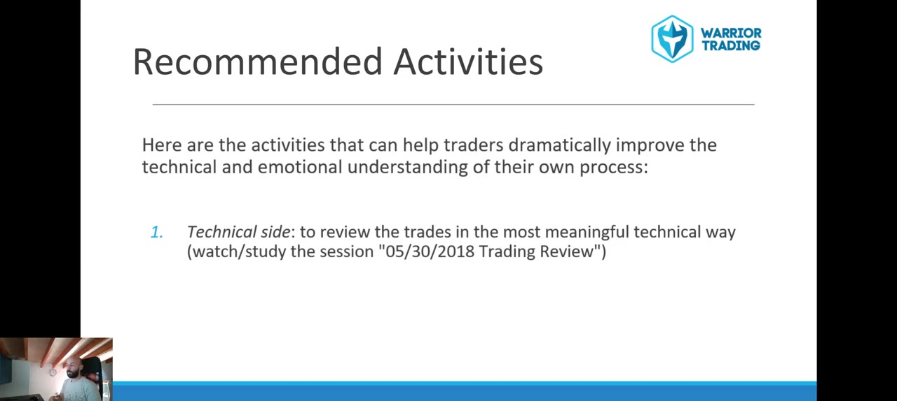

**图怎么看：**

- 通过日交易后的处理与记录来缩短学习曲线，提高交易技能。
- 重点在于通过日交易后的处理与记录来缩短学习曲线，提高交易技能。
- 查看每日交易后的处理与记录，以便更好地理解自己的交易过程并进行改进。
- 通过分析每日交易后的数据，可以识别出哪些策略有效，哪些需要调整。

### 关键内容

- 讲师指出，新手应该完全沉浸在日交易后的处理和回顾中。
- 交易学习曲线对于新手来说是至关重要的，需要投入大量时间和精力。
- 交易过程中，技术理解和情绪理解同样重要，各占50%。
- 通过记录和回顾自己的交易过程，可以更好地理解自己的交易策略。
- 交易规则和目标设定对于新手尤为重要，不应设定具体的盈利目标。
- 通过记录和回顾，可以发现自己的交易习惯，并进行改进。
- 交易规则和目标设定应包括风险管理、资金保护等内容。
- 通过记录和回顾，可以更好地理解市场趋势和股票动向。
- 交易记录和回顾有助于提高交易技能，缩短学习曲线

### 分析与执行顺序

1. 讲师首先介绍了交易学习曲线的概念，强调了新手需要投入大量时间和精力。
2. 然后讲解了如何通过回顾交易来提高技术理解和情绪理解。
3. 接着分享了一个交易者的日交易记录模板，包括健康习惯、情绪状态和交易目标。
4. 进一步解释了交易规则和目标设定的重要性，包括风险管理等。
5. 最后，讲师强调了通过记录和回顾来提高交易技能的方法，以及如何使用交易平台进行记录和回顾。

### 案例与细节

- 交易者记录了每天的健康习惯，如是否锻炼、吃早餐等，以此来监控自己的状态。
- 交易者设置了每日目标，如改善交易准备、建立股票观察列表等。
- 交易者记录了交易规则，如交易时间、止损点等。
- 交易者分析了市场趋势和股票动向，如SPY的表现和MTP的预市表现。
- 交易者详细记录了交易过程，包括进入、退出和结果，以及反思和改进措施。

### 风险与边界

- 由于录制于2019年，部分交易规则和市场环境可能已发生变化。
- 交易者需要根据当前市场情况调整交易策略和规则。
- 交易记录和回顾需要定期更新，以适应市场变化。
- 交易者应谨慎对待过去的交易记录，避免盲目复制。

### 复盘问题

- 你如何记录和回顾自己的交易过程？
- 你在交易过程中遇到了哪些挑战？
- 你如何根据交易记录调整自己的交易策略？

---

## v0411：期货摆动交易入门

> 日期：2019-08-20　·　时长：00:38:22

**本场重点：** 了解摆动交易的基本原则，掌握风险管理工具，并学会使用市场轮廓扫描器。

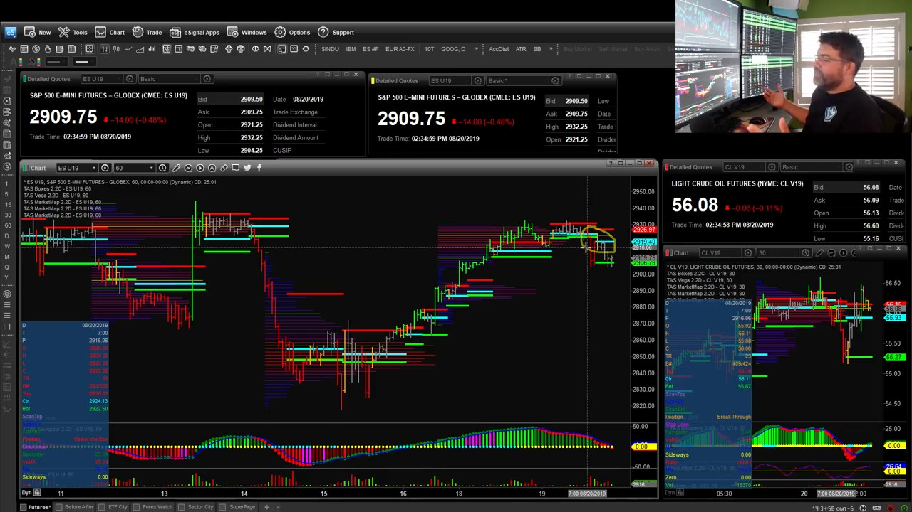

**图怎么看：**

- 1. 时间框架选择 - 60分钟和240分钟的图表效果好。
- 2. 工作停止 GTC - 确保有良好的止盈止损订单。
- 3. 风险与回报更大 - 每笔交易的风险和回报预期较大。
- 4. 持仓时间 - 预计持有时间为1到5天。

### 关键内容

- 摆动交易适合有一定资本基础的投资者，尤其是那些需要在夜间持有头寸的人。
- 摆动交易的时间框架通常为60分钟到四小时，适合一到五天的持仓。
- 使用GTC订单可以确保在离开屏幕时仍然有效，避免因市场大幅波动而损失。
- 摆动交易的风险更大，但潜在回报也更高，需要平衡风险和收益。
- 使用市场轮廓扫描器可以帮助识别摆动交易的机会，尤其适用于股票和期货。
- 摆动交易需要调整止损和目标，尤其是在市场变动时。
- 摆动交易者需要关注周末市场的潜在风险，如周六的市场波动。
- 使用OSO和OCO订单可以在离开屏幕时自动管理交易，减少手动操作的需要。
- 摆动交易者需要保持对市场的持续监控，即使不在电脑前也要进行调整

### 分析与执行顺序

1. 首先介绍摆动交易的概念及其适用条件。
2. 然后讲解摆动交易的时间框架选择，包括60分钟和四小时图表。
3. 接着讨论摆动交易的风险管理，特别是使用GTC订单的重要性。
4. 进一步解释摆动交易的订单类型，如OSO和OCO订单的作用。
5. 最后展示如何使用市场轮廓扫描器来识别摆动交易机会，包括具体示例。
6. 强调摆动交易者需要关注周末市场的潜在风险，如周六的市场波动。
7. 提醒摆动交易者需要保持对市场的持续监控，即使不在电脑前也要进行调整

### 案例与细节

- 在60分钟图表上，市场突破需求水平，显示了摆动交易的机会。
- 使用市场轮廓扫描器识别了ES&P的短期卖空机会，显示了具体的价格水平。
- 通过OSO订单，当市场突破时，自动发送另一个订单进行卖出。
- 使用OCO订单，当市场突破时，自动取消目标订单，减少手动操作的需要。
- 在四小时图表上，市场突破供应区域，显示了摆动交易的机会。
- 使用市场轮廓扫描器识别了EA Sports的摆动交易机会，显示了具体的价格水平

### 风险与边界

- 摆动交易的风险较高，需要谨慎管理，尤其是对于新手投资者。
- 摆动交易需要较大的资本基础，不适合资金有限的投资者。
- 摆动交易需要关注周末市场的潜在风险，如周六的市场波动。
- 摆动交易需要持续监控市场，即使不在电脑前也要进行调整。
- 摆动交易的订单类型需要熟悉，否则可能导致错误的操作。
- 市场轮廓扫描器虽然有用，但需要正确设置和使用，否则可能无效

### 复盘问题

- 摆动交易的时间框架选择是什么？为什么选择这个时间框架？
- 摆动交易的风险管理措施有哪些？如何确保在离开屏幕时仍然有效？
- 市场轮廓扫描器如何帮助识别摆动交易的机会？请举例说明。
- 摆动交易者需要关注哪些周末市场的潜在风险？如何应对这些风险？
- 摆动交易者如何保持对市场的持续监控？请描述具体的步骤

---

## v0412：使用RSI进行短期交易

> 日期：2019-10-08　·　时长：00:46:39

**本场重点：** 本节讲解如何利用RSI指标进行短期交易，识别入场时机和风险控制。

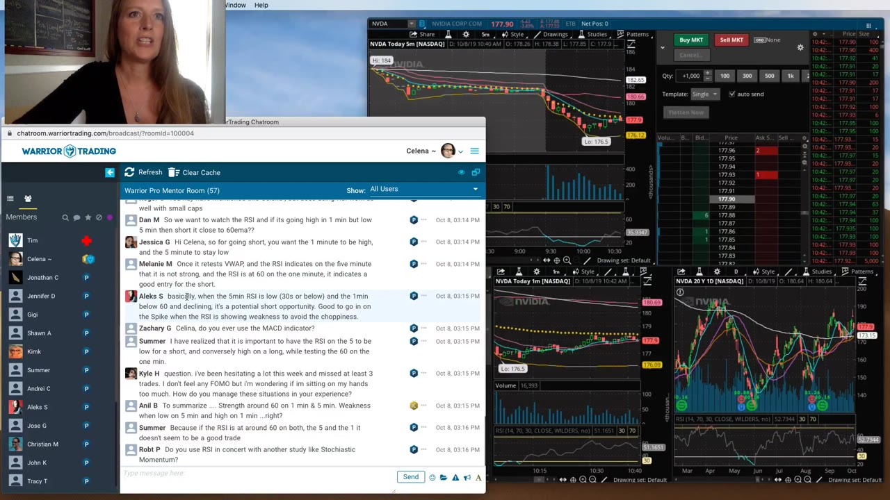

**图怎么看：**

- 画面是 NVIDIA（NVDA）的实时交易界面，同时展示五分钟与一分钟价格图和 RSI，便于比较不同周期的动量是否一致。
- RSI 的数值和斜率反映所选回看窗口内相对涨跌动量；60 不是通用“超卖”线，低于 30 也不能被机械地当成买点。
- 聊天室讨论把 RSI 与 MACD 等信息组合使用，但指标都由价格派生；真正的入场仍要有价格触发、失效位置和可接受的止损距离。
- 强趋势中 RSI 可以长时间停留在较高或较低区域，单凭阈值逆势交易风险很大；应先看趋势和关键价位，再把 RSI 当作辅助背景。

### 关键内容

- RSI在短期交易中的应用，特别是确认价格突破和趋势反转。
- RSI在5分钟和1分钟图表上的表现，用于判断是否进入短期交易。
- RSI在60附近的表现作为阻力位，用于判断是否卖出。
- 结合VWAP（成交量加权平均价格）和其他技术指标进行交易决策。
- 短期交易中RSI指标的使用，特别是在价格突破后的确认。
- RSI指标在不同时间框架下的表现，用于判断交易时机。
- RSI指标在短期交易中的风险控制，包括设置止损和目标价。
- 结合其他技术指标（如MACD）进行综合分析，提高交易准确性。
- 观察NVIDIA股价在5分钟RSI低于60，而1分钟RSI高于60时，形成短期交易机会，表明RSI在不同时间框架下的表现可用于判断交易时机。
- 结合VWAP阻力位，确认价格突破后的交易时机，有助于提高交易决策的准确性，尤其是在市场波动较大时。
- RSI在60附近的表现作为阻力位，用于判断是否卖出，但需结合其他技术指标，如MACD，以提高判断的可靠性。
- 短期交易中RSI指标的使用，特别是在价格突破后的确认，需要结合其他技术指标，如MACD，以提高交易决策的准确性。
- RSI指标在不同时间框架下的表现，用于判断交易时机，需注意市场情绪变化，避免因情绪波动导致的误判

### 分析与执行顺序

1. 首先，观察NVIDIA股价在5分钟和1分钟图表上的表现。
2. 当5分钟RSI低于60，而1分钟RSI高于60时，形成短期交易机会。
3. 结合VWAP阻力位，确认价格突破后的交易时机。
4. 使用RSI指标确认价格突破后的趋势反转。
5. 设置止损和目标价，控制风险并锁定利润。

### 案例与细节

- ticker：NVDA；price：178.36；timeframe：1分钟；rsi：60；vwap：略低；description：NVIDIA股价在1分钟RSI高于60，而5分钟RSI低于60时，形成短期交易机会。
- ticker：NVDA；price：177.39；timeframe：1分钟；rsi：60；vwap：略低；description：NVIDIA股价在1分钟RSI高于60，而5分钟RSI低于60时，形成短期交易机会。
- ticker：NVDA；price：178.36；timeframe：1分钟；rsi：60；vwap：略低；description：NVIDIA股价在1分钟RSI高于60，而5分钟RSI低于60时，形成短期交易机会，随后股价回落，验证了RSI指标的有效性。
- ticker：NVDA；price：177.39；timeframe：1分钟；rsi：60；vwap：略低；description：NVIDIA股价在1分钟RSI高于60，而5分钟RSI低于60时，形成短期交易机会，随后股价反弹，再次验证了RSI指标的有效性。
- ticker：NVDA；price：178.36；timeframe：1分钟；rsi：60；vwap：略低；description：NVIDIA股价在1分钟RSI高于60，而5分钟RSI低于60时，形成短期交易机会，随后股价下跌，进一步验证了RSI指标的有效性

### 风险与边界

- RSI指标在不同市场环境下可能失效，需结合其他技术指标进行综合分析。
- 短期交易中RSI指标的表现可能受到市场情绪的影响，需谨慎操作。
- 录制年代限制，此策略适用于2019年左右的市场环境。
- RSI指标在不同市场环境下可能失效，需结合其他技术指标进行综合分析，避免单一依赖RSI导致误判。
- 短期交易中RSI指标的表现可能受到市场情绪的影响，需谨慎操作，避免因情绪波动导致的误判。
- 录制年代限制，此策略适用于2019年左右的市场环境，需注意市场环境的变化，避免因时代差异导致的策略失效

### 复盘问题

- 如何利用RSI指标识别短期交易机会？
- 结合哪些技术指标可以提高交易决策的准确性？
- 如何设置止损和目标价以控制风险？

---

## v0413：微迷你期货交易入门

> 日期：2019-10-22　·　时长：00:26:03

**本场重点：** 微迷你期货交易降低了门槛，提供了多种优势，但交易者仍需注意风险管理。

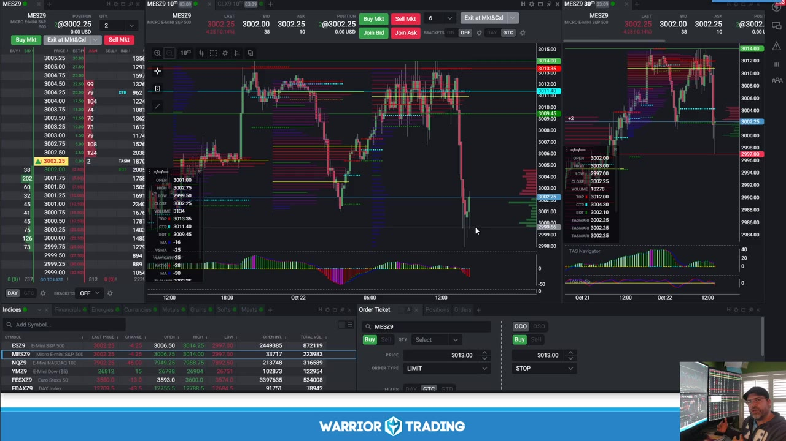

**图怎么看：**

- 表格详细列出了Micro E-mini S&P 500合约的合同大小、交易时间和地点、最低波动率、美元价值、产品代码、交割月份、交付方式以及终止交易的时间。
- 表格显示了Micro E-mini S&P 500合约的最小波动率为0.25个指数点，交易时间为CME Globex的周日到周五上午5点到下午4点，周一到周五的交易暂停时间为3:15到3:30。
- 表格还列出了Micro E-mini S&P 500合约的美元价值为每个波动单位1.25美元，产品代码为MES，交割月份为每年三月季度的五个月份（M, H, U, Z, H）。
- 表格中还提到了Micro E-mini S&P 500合约的结算方式为现金结算至最终结算价格，终止交易时间为在到期前三个工作日的上午8:30至到期日的上午8:30。

### 关键内容

- 微迷你期货合同是芝加哥商品交易所为了吸引更多投资者而推出的新产品。
- 微迷你期货合同的最低保证金要求低至$250，远低于传统期货账户的$5,000起。
- 微迷你期货合同的交易规模仅为标准合约的十分之一，降低了风险。
- 微迷你期货合同的交易费用也有所降低，进一步降低了交易成本。
- 微迷你期货合同的交易时段与其他四个合约相同，便于交易者熟悉市场。
- 微迷你期货合同的交易结算方式为现金结算，避免实物交割带来的风险。
- 微迷你期货合同的交易周期为四个月，便于交易者规划交易策略。
- 微迷你期货合同的交易数据和图表功能与标准合约相似，便于交易者进行分析。
- 微迷你期货合同的交易风险相对较小，适合新手交易者进行实践和学习。

### 分析与执行顺序

1. 讲师首先介绍了微迷你期货合同的基本信息，包括推出背景和交易特点。
2. 然后展示了微迷你S&P合约的交易量和价格走势，帮助理解交易环境。
3. 接着讲解了微迷你期货合同的交易规格和交易费用，强调了其优势。
4. 随后通过实际操作演示了如何下单和设置止损，展示了交易流程。
5. 最后总结了微迷你期货合同的优势，并鼓励交易者尝试使用。

### 案例与细节

- 微迷你S&P期货合约的交易规模为标准合约的十分之一，最低保证金要求为$250。
- 交易者可以使用微迷你合约进行测试新策略，而不必承担全部风险。
- 微迷你合约的交易数据和图表功能与标准合约相似，便于交易者进行分析。
- 交易者可以在微迷你合约上进行止损设置，以控制风险。
- 微迷你合约的交易结算方式为现金结算，避免实物交割带来的风险。

### 风险与边界

- 微迷你期货合同的交易规模较小，可能导致资金利用率较低。
- 交易者需要关注市场波动，避免因市场剧烈波动导致的亏损。
- 微迷你期货合同的交易费用虽然降低，但仍需考虑交易频率对总成本的影响。
- 交易者在使用微迷你合约进行交易时，需要确保交易平台支持相关功能。

### 复盘问题

- 微迷你期货合同的主要优势是什么？
- 交易者在使用微迷你合约进行交易时需要注意哪些风险？
- 微迷你期货合同的交易规格与标准合约有何不同？

---

## v0414：2019年11月5日交易课程摘要

> 日期：2019-11-05　·　时长：01:12:30

**本场重点：** 识别关键支撑和阻力水平，使用趋势线进行交易决策，考虑市场环境和财报的影响。

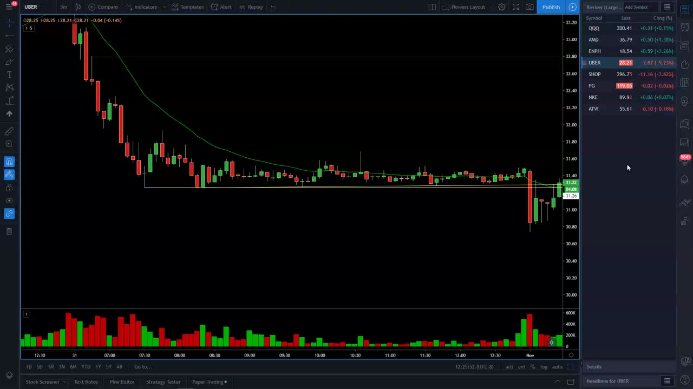

**图怎么看：**

- UBER 的每日蜡烛图显示了价格在支撑和阻力水平之间的波动。
- 图表上可以看到支撑和阻力水平，帮助识别潜在的交易机会。
- 价格在支撑和阻力水平之间波动，表明市场存在一定的压力。
- 通过分析这些水平，可以制定更有效的交易策略。

### 关键内容

- 讲师倾向于跟随价格趋势进行交易，而不是逆势而行。例如，在AMD突破3414点位后，他原本计划买入回调至3414点位的机会。
- 识别关键支撑和阻力水平至关重要，如AMD的3414和ENPH的1859。这些水平有助于制定交易策略。
- 使用趋势线和支撑/阻力水平进行交易决策。例如，PG的支撑趋势线显示了强劲的上升趋势。
- 考虑市场环境和财报的影响，如W-Day的财报导致股票向上跳空，错过交易机会。
- 注意交易风险，如过度延伸的股票和合成区间可能导致的不确定性。例如，Nike的旗形形态显示了强烈的下跌趋势。
- 识别短期和长期交易的时间框架选择，强调五分钟图表比一分钟图表更稳定，更适合进行交易。
- 分析股票走势，如MU股票的技术反弹可能性，但整体趋势仍向上，适合进行长期交易。
- 解释期权的Delta值较低时，价格变动较慢，以及如何计算期权价格变动的预期值。
- 建议选择流动性好且价差较小的期权进行交易，以减少滑点风险。
- 回顾星巴克的交易机会，包括熊旗形态的突破和三重底部的突破，强调了这些技术形态的重要性。
- 讲师指出，识别关键支撑和阻力水平对于制定交易策略至关重要，如AMD的3414和ENPH的1859，这些水平有助于判断股票的下一步走势。
- 使用趋势线进行交易决策可以提高准确性，例如PG的支撑趋势线显示了强劲的上升趋势，但若价格跌破趋势线，则需重新评估交易策略。
- 市场环境和财报的影响可能导致错过交易机会，如W-Day的财报导致股票向上跳空，错过交易机会，因此需密切关注市场动态。
- 注意交易风险，如过度延伸的股票和合成区间可能导致的不确定性，例如Nike的旗形形态显示了强烈的下跌趋势，但合成区间可能导致价格向上或向下突破。
- 识别短期和长期交易的时间框架选择，强调五分钟图表比一分钟图表更稳定，更适合进行交易，因为五分钟图表更能反映市场趋势，减少噪音干扰。

### 分析与执行顺序

1. 讲师首先介绍了跟随价格趋势进行交易的心理倾向，然后分析了AMD的走势。
2. 接着，讲师讨论了如何识别关键支撑和阻力水平，并使用趋势线进行交易决策。
3. 讲师还分析了市场环境和财报的影响，如W-Day的财报导致股票向上跳空，错过交易机会。
4. 讲师解释了如何识别短期和长期交易的时间框架选择，强调五分钟图表比一分钟图表更稳定。
5. 最后，讲师回顾了星巴克的交易机会，包括熊旗形态的突破和三重底部的突破。

### 案例与细节

- AMD在3414水平形成了一个重要的阻力位，经过五次测试后，第六次突破被预期。
- ENPH形成了一个双底破位的旗形形态，但只测试了两次，显示出谨慎的迹象。
- SHOP形成了一个清晰的旗形形态，显示了强烈的下跌趋势。
- PG形成了一个支撑趋势线，显示了强劲的上升趋势。
- Nike形成了一个旗形形态，显示了强烈的下跌趋势。
- ATVI形成了一个缺口，显示了强烈的上涨趋势。
- ENPH形成了一个双底破位的旗形形态，但只测试了两次，显示出谨慎的迹象，表明短期内可能缺乏足够的动能推动股价突破。
- SHOP形成了一个清晰的旗形形态，显示了强烈的下跌趋势，但在趋势线上的第三次反弹确认了进一步下跌的趋势，说明市场情绪依然悲观。
- ATVI形成了一个缺口，显示了强烈的上涨趋势，但若缺口未能被填上，可能会导致股票价格进一步上涨，错过交易机会。
- PG形成了一个支撑趋势线，显示了强劲的上升趋势，但若价格恢复到趋势线，表明交易想法错误，需重新评估市场情况。
- Nike形成了一个旗形形态，显示了强烈的下跌趋势，但合成区间可能导致价格向上或向下突破，不确定性较大，需谨慎对待。

### 风险与边界

- 过度延伸的股票可能导致交易风险，如AMD的第六次突破。
- 合成区间可能导致价格向上或向下突破，不确定性较大，如Nike的旗形形态。
- 市场环境和财报的影响可能导致错过交易机会，如W-Day的财报导致股票向上跳空。
- 讲师的分析基于2018-2021年的平台、监管、税务和经纪商条件，这些条件已发生变化。
- 过度延伸的股票可能导致交易风险，如AMD的第六次突破，若后续无法维持上涨趋势，可能会出现回调，需警惕过度延伸的风险。
- 合成区间可能导致价格向上或向下突破，不确定性较大，如Nike的旗形形态，若合成区间未能有效突破，可能会导致价格波动加剧，增加交易难度。
- 市场环境和财报的影响可能导致错过交易机会，如W-Day的财报导致股票向上跳空，错过交易机会，需密切关注市场动态，避免因信息不对称而错失良机。
- 讲师的分析基于2018-2021年的平台、监管、税务和经纪商条件，这些条件已发生变化，需注意当前市场环境的变化，避免因条件变化而导致的交易风险。

### 复盘问题

- 如何识别关键支撑和阻力水平？
- 为什么跟随价格趋势进行交易很重要？
- 如何使用趋势线进行交易决策？
- 市场环境和财报如何影响交易机会？
- 如何识别短期和长期交易的时间框架选择？

---

## v0415：Thinkerswim 平台设置与使用

> 日期：2019-11-12　·　时长：01:03:08

**本场重点：** 设置 Thinkerswim 平台以提高交易效率，了解如何使用水平二和时间销售功能进行交易。

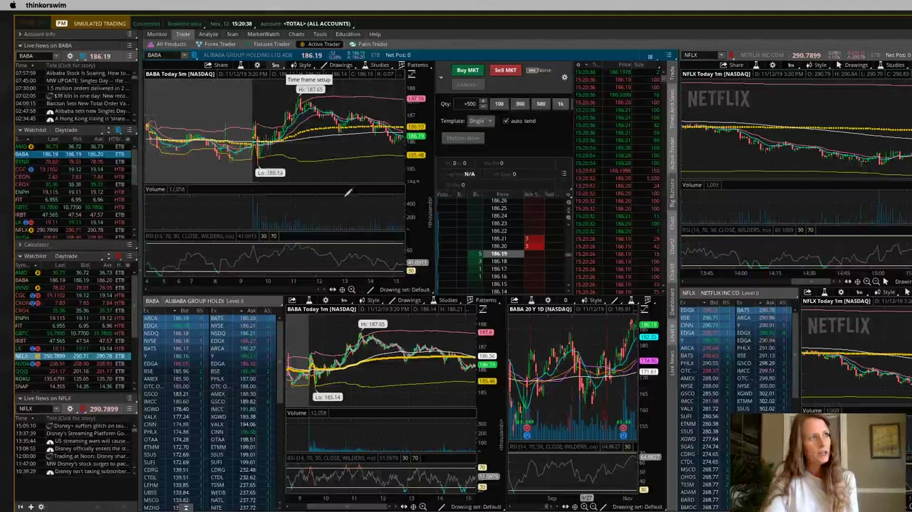

**图怎么看：**

- 画面中，可以看到多个股票的实时交易数据，包括股价、成交量和时间序列图。
- 水平二（Level 2）显示了买卖盘的数量和价格，帮助投资者了解当前市场的买卖压力。
- 时间序列图展示了股票价格的历史波动情况，有助于分析趋势和模式。
- 成交量柱的高度反映对应周期内的总成交量；红绿着色通常跟随价格柱的涨跌规则，不能直接拆成两种方向的主动成交。

### 关键内容

- 讲师介绍了如何通过调整内存使用来提高 Thinkerswim 平台的速度效率。
- 使用 Thinkerswim 的基本帮助途径包括支持聊天和学习中心。
- 讲师展示了如何设置平台进行动量交易策略。
- 使用水平二和时间销售功能进行交易的具体步骤。
- 讲师强调了使用 Thinkerswim 进行交易的基本设置。
- 使用 Thinkerswim 的基本功能，如新闻、监控列表、图表和指标。
- 讲师提到了如何使用水平二和时间销售功能进行交易。
- 使用 Thinkerswim 进行动量交易策略的具体设置。
- 使用 Thinkerswim 进行交易的具体步骤和注意事项

### 分析与执行顺序

1. 讲师首先介绍了如何通过调整内存使用来提高 Thinkerswim 平台的速度效率。
2. 然后，讲师展示了如何使用支持聊天和学习中心获取基本帮助。
3. 接着，讲师详细讲解了如何设置平台进行动量交易策略。
4. 最后，讲师演示了如何使用水平二和时间销售功能进行交易。
5. 在整个过程中，讲师强调了使用 Thinkerswim 进行交易的基本设置和注意事项

### 案例与细节

- 讲师展示了如何在 Thinkerswim 中设置内存使用，以提高平台速度。
- 讲师演示了如何使用水平二功能来监控订单流动情况。
- 讲师展示了如何使用时间销售功能来查看订单处理情况。
- 讲师演示了如何使用新闻功能来获取实时市场信息。
- 讲师展示了如何使用监控列表功能来跟踪感兴趣的股票

### 风险与边界

- 由于录制于 2019 年，部分功能和设置可能已发生变化。
- 讲师提到的某些功能可能需要特定版本的 Thinkerswim 平台。
- 部分操作步骤可能依赖于特定的市场环境和交易策略

### 复盘问题

- 如何通过调整内存使用来提高 Thinkerswim 平台的速度效率？
- 使用 Thinkerswim 的基本帮助途径有哪些？
- 如何设置平台进行动量交易策略？
- 使用水平二和时间销售功能进行交易的具体步骤是什么？

---

## v0416：价格图表类型详解

> 日期：2019-11-26　·　时长：00:24:06

**本场重点：** 价格图表类型对于技术分析至关重要，但不同类型的图表各有优缺点。

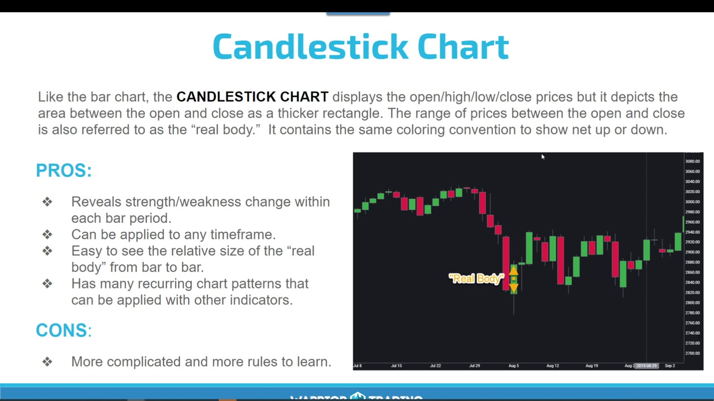

**图怎么看：**

- Candlestick chart displays open/high/low/close prices with a thicker rectangle between the open and close.
- It shows strength/weakness change within each bar period.
- Easy to see the relative size of the 'real body' from bar to bar.
- Has many recurring chart patterns that can be applied with other indicators.

### 关键内容

- 简单线图适用于长期趋势分析，但缺乏深度分析，如无法显示开盘价和最低价。
- bar chart通过显示开盘价、最高价、最低价和收盘价，提供了更丰富的信息，但可能难以看清细节。
- 蜡烛图因其颜色和形态易于识别涨跌趋势，且有多种有效模式，但需要学习更多规则。
- tick chart根据交易量而非时间来划分新周期，适合日内交易者，但时间不可预测。
- 范围图基于价格变动而非交易量，适合横向市场，但可能导致信息缺失。
- RANCO图基于价格变动而非时间，提供独特的砖块结构，但可能无法显示横向市场的新信息。
- 各种图表类型各有优势和局限，需根据具体需求选择合适的图表类型。
- 技术分析中，不同图表类型的选择和使用对交易决策至关重要。
- 了解不同图表类型有助于更好地理解市场动态和趋势

### 分析与执行顺序

1. 首先介绍简单线图，它适用于长期趋势分析，但缺乏深度分析。
2. 接着讲解bar chart，它显示开盘价、最高价、最低价和收盘价，但可能难以看清细节。
3. 然后介绍蜡烛图，它显示涨跌趋势，且有多种有效模式，但需要学习更多规则。
4. 再讲解tick chart，它根据交易量而非时间来划分新周期，适合日内交易者，但时间不可预测。
5. 最后介绍范围图和RANCO图，它们基于价格变动而非交易量，适合横向市场，但可能无法显示横向市场的新信息。
6. 强调不同平台和数据提供商可能有不同的设置和规则，需了解具体平台的特性。
7. 总结各种图表类型各有优势和局限，需根据具体需求选择合适的图表类型

### 案例与细节

- 简单线图：显示了某股票在一段时间内的收盘价走势。
- bar chart：显示了某股票在一天内的开盘价、最高价、最低价和收盘价。
- 蜡烛图：显示了某股票在一天内的开盘价、最高价、最低价和收盘价，且颜色表示涨跌。
- tick chart：显示了某股票在一天内的交易量，且交易量迅速增加时，图表上的新条目也快速增加。
- 范围图：显示了某股票在一天内的价格变动范围，且高度一致。
- RANCO图：显示了某股票在一天内的价格变动，且砖块结构清晰，但无法显示横向市场的新信息

### 风险与边界

- 简单线图无法显示开盘价和最低价，可能影响交易决策。
- bar chart和蜡烛图可能因细节难以看清而影响判断。
- tick chart的时间不可预测，可能影响交易策略的制定。
- 范围图和RANCO图可能无法显示横向市场的新信息，导致信息缺失。
- 不同平台和数据提供商可能有不同的设置和规则，需了解具体平台的特性。
- 录制年代限制，某些平台和数据提供商可能已发生变化

### 复盘问题

- 简单线图适用于哪些情况？它的主要优点是什么？
- bar chart和蜡烛图的主要区别是什么？它们各自的优势是什么？
- tick chart如何帮助日内交易者？它的主要优势是什么？
- 范围图和RANCO图分别适用于哪些市场？它们的主要优势是什么？
- 不同平台和数据提供商可能有哪些不同的设置和规则？如何确保正确使用这些图表？

---

## v0417：小账户交易策略与实践

> 日期：2019　·　时长：00:55:04

**本场重点：** 1. 小账户首次交易盈利158美元；2. 使用限价单而非止损单；3. 调整仓位大小以适应市场波动。

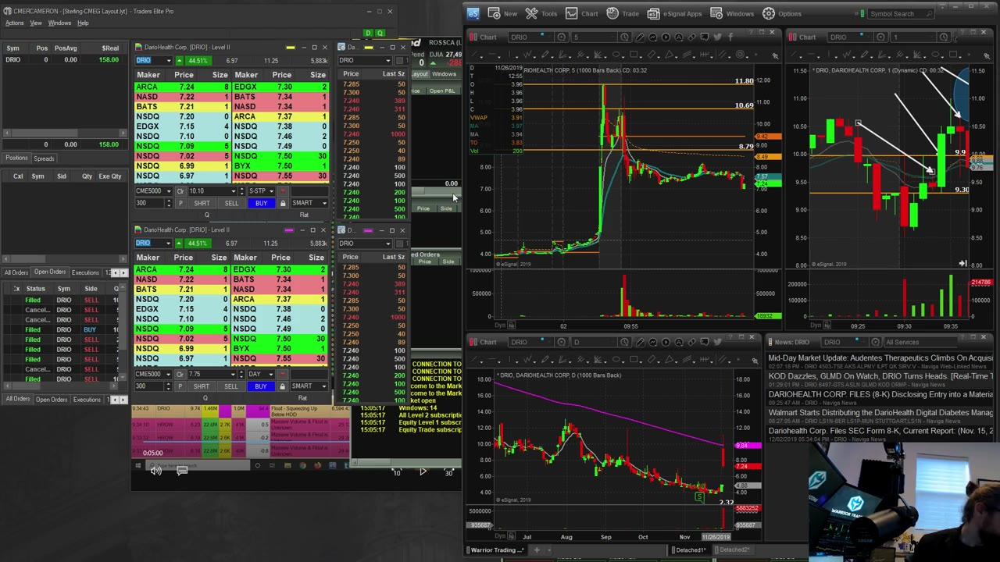

**图怎么看：**

- 实时交易界面展示了多个股票的报价和成交量，包括ARCA、EDGX、NASDAQ等。
- 成交量柱的高度反映对应周期内的总成交量；红绿着色通常跟随价格柱的涨跌规则，不能直接拆成两种方向的主动成交。
- 界面右侧显示了多个图表，包括K线图和成交量柱状图。
- 界面上方显示了当前市场的整体情况，如DROI的最新价格和成交量。

### 关键内容

- 讲师使用限价单而非止损单进行交易，因为止损单可能错过行情。
- 在小账户首次交易中，盈利158美元，展示了交易策略的有效性。
- 使用E-Signal作为图表软件，但考虑切换到TC 2000以节省成本。
- 通过调整仓位大小来应对市场波动，如在小账户挑战中将仓位减小以控制风险。
- 使用Control Z快捷键以最优价格卖出，但需注意市场波动带来的风险。
- 通过监控成交量和价格走势来识别潜在的突破机会。
- 使用NASDAQ市场以较低成本执行订单，但需注意市场波动带来的不确定性。
- 在小账户挑战中，采用红转绿的交易策略，以适应市场快速变化。
- 通过调整仓位大小和使用限价单来控制风险，以适应市场波动。
- 使用模拟交易平台进行实时数据交易，以提高交易技能和风险管理能力

### 分析与执行顺序

1. 讲师首先解释了如何使用限价单进行交易，而不是使用止损单，因为止损单可能会错过行情。
2. 然后，讲师展示了如何在模拟交易平台上设置限价单，并进行了实际操作演示。
3. 接着，讲师讨论了如何根据市场波动调整仓位大小，以控制风险。
4. 最后，讲师强调了使用模拟交易平台进行实时数据交易的重要性，以提高交易技能和风险管理能力。
5. 在整个过程中，讲师还分享了如何使用特定的图表软件（如E-Signal）进行交易，并考虑切换到TC 2000以节省成本。
6. 此外，讲师还提到了如何使用特定的快捷键（如Control Z）以最优价格卖出，但需注意市场波动带来的风险。
7. 最后，讲师总结了如何通过监控成交量和价格走势来识别潜在的突破机会，以及如何使用特定的市场（如NASDAQ）以较低成本执行订单。

### 案例与细节

- 在一次交易中，讲师使用限价单以$10.10的价格买入股票，成功抓住了行情。
- 在另一个交易中，讲师使用Control Z快捷键以最优价格卖出股票，获得了额外的17美分。
- 在一次模拟交易中，讲师使用红转绿的交易策略，成功抓住了市场快速变化的机会。
- 在一次交易中，讲师使用限价单以$9.60的价格卖出股票，成功控制了风险。
- 在一次交易中，讲师使用限价单以$89的价格买入股票，成功抓住了市场快速变化的机会。

### 风险与边界

- 使用限价单可能会错过行情，尤其是在市场波动较大时。
- 使用特定的图表软件（如E-Signal）可能会增加成本，但也有更好的替代方案（如TC 2000）。
- 使用特定的市场（如NASDAQ）可能会降低执行成本，但也需要考虑市场波动带来的不确定性。
- 在小账户挑战中，使用较小的仓位大小可以控制风险，但也可能限制盈利潜力。
- 使用模拟交易平台进行实时数据交易可以帮助提高交易技能，但也需要考虑市场变化带来的不确定性。

### 复盘问题

- 如何使用限价单进行交易，而不是使用止损单？
- 在小账户首次交易中，盈利158美元的具体交易策略是什么？
- 如何根据市场波动调整仓位大小以控制风险？
- 使用特定的图表软件（如E-Signal）进行交易有哪些优缺点？
- 如何使用特定的市场（如NASDAQ）以较低成本执行订单？

---

## v0418：E-Signal 工作坊

> 日期：2019　·　时长：00:55:23

**本场重点：** 解决常见问题，如安装自定义脚本、使用 Zanger 成交量比率等。

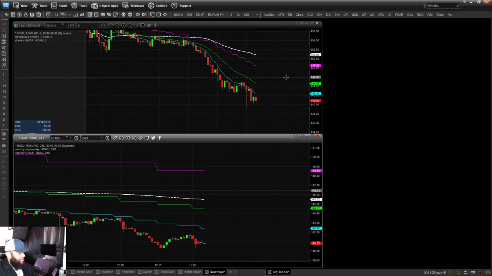

**图怎么看：**

- 在图中可以看到ROKU股票的价格走势，显示了不同周期的均线。
- 图中还显示了成交量柱状图，用于分析市场活跃度。
- 通过观察均线和成交量柱状图，可以判断股票的趋势和潜在的买卖机会。
- 此图有助于理解如何使用技术指标进行股票分析。

### 关键内容

- E-Signal 是一个交易平台，提供图表分析等功能。
- 用户可以安装自定义脚本，但需要手动分配页面。
- Zanger 成交量比率需要特定设置才能正确显示。
- 用户可以通过复制窗口来保持图表布局一致。
- 使用 15 分钟 EMA 可以帮助识别流动性缺口。
- 自定义脚本可能无法覆盖所有历史数据。
- 使用不同交易平台（如 TradingView）进行比较。
- E-Signal 的图表功能需要定期备份和更新。
- 用户可以使用鼠标快捷键进行快速交易操作。
- Zanger 成交量比率可能与其他交易平台存在差异

### 分析与执行顺序

1. 讲师首先介绍了 E-Signal 平台的基本功能。
2. 然后讲解了如何安装自定义脚本，并展示了脚本编辑器。
3. 接着演示了如何调整图表设置以适应不同交易时间框架。
4. 讲师还解释了如何使用 Zanger 成交量比率进行交易。
5. 最后，讲师回答了观众的问题，包括如何备份图表设置和使用鼠标快捷键进行交易。

### 案例与细节

- 使用 15 分钟 EMA 脚本识别流动性缺口，如 Netflix 的大缺口。
- 通过复制窗口来保持图表布局一致，如切换到 5 分钟时间框架。
- 使用 TradingView 进行比较，发现其图表功能不如 E-Signal 精确。
- 使用自定义脚本进行交易，如 13 EMA 和 3 分钟时间框架。
- 使用 Zanger 成交量比率进行交易，如在流动性缺口处进行短空操作

### 风险与边界

- 自定义脚本可能无法覆盖所有历史数据，导致交易失误。
- 不同交易平台之间的图表功能可能存在差异，需谨慎使用。
- 使用 E-Signal 的图表功能需要定期备份和更新，否则可能导致数据丢失。
- 使用 Zanger 成交量比率时，需要确保设置正确，否则可能影响交易决策。
- 录制于 2018-2021 年，部分功能和设置可能已发生变化

### 复盘问题

- 如何安装和使用自定义脚本？
- Zanger 成交量比率的具体设置是什么？
- 如何备份和更新 E-Signal 的图表设置？
- 使用 TradingView 与 E-Signal 有何不同？
- 如何使用鼠标快捷键进行快速交易操作？

---

## v0419：退出策略详解

> 日期：2019　·　时长：01:04:25

**本场重点：** 1. 退出策略是交易中最重要的一环；2. 初期目标是生存而非盈利；3. 学会有效止损是关键。

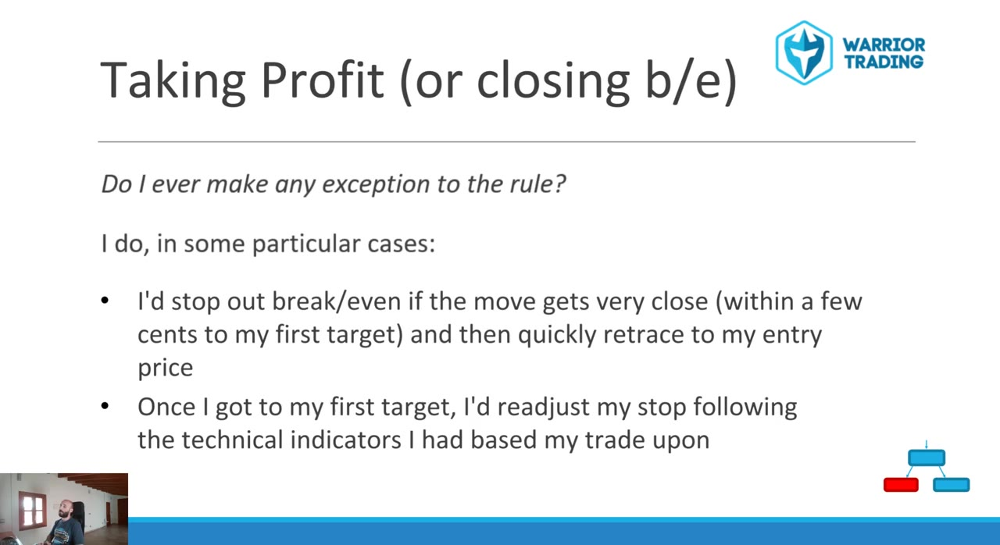

**图怎么看：**

- 在某些特定情况下，我会打破规则。
- 即使移动非常接近我的第一个目标（不超过几美分），我也会快速回撤到我的入场价格。
- 一旦达到我的第一个目标，我会根据我基于的交易技术指标调整止损点。
- 一个良好的交易计划必须包括一个止损价/区

### 关键内容

- 交易初期的主要目标是生存，而不是盈利。
- 一个好的交易计划必须包括一个停止价格或区域。
- 在达到第一个利润目标后，考虑调整止损以实现盈亏平衡。
- 学会如何有效止损是避免爆仓的关键。
- 初学者应采取保守的止损策略，随着经验增加可以逐渐变得更为激进。
- 在确定股票可能的波动范围时，基于当天的实际波动而非平均波动。
- 使用技术指标和移动平均线来设定预期目标。
- 在交易过程中，始终关注止损和目标价之间的合理距离。
- 了解不同类型的止损策略，并选择最适合自己的策略

### 分析与执行顺序

1. 首先，明确交易初期的主要目标是生存，而不是盈利。
2. 然后，制定一个包含停止价格或区域的交易计划。
3. 接着，在达到第一个利润目标后，考虑调整止损以实现盈亏平衡。
4. 在市场开盘后的前30分钟内，适当放宽止损可以减少被止损的次数。
5. 最后，根据实际交易情况不断调整和优化止损策略。
6. 在整个交易过程中，始终关注止损和目标价之间的合理距离。
7. 通过实际交易案例，验证和调整止损策略的有效性

### 案例与细节

- 在Facebook的交易中，通过观察开盘后的第一根蜡烛，确定了止损和目标价。
- 在Facebook的交易中，利用当天的波动范围，确定了合理的止损和目标价。
- 讲师比较Facebook两个交易日的日内区间：一个交易日约从177到178.40，全天约1.40点；另一个交易日约从187.28到194.50，接近7点，并结合当天前三分钟接近2美元的范围来判断止损与目标，而不是机械套用平均日波幅。

### 风险与边界

- 交易初期的目标是生存，而不是盈利，这可能导致长期亏损。
- 在市场开盘后的前30分钟内放宽止损可能会导致更大的损失。
- 使用过于激进的止损策略可能会导致账户爆仓。
- 交易策略的有效性依赖于市场环境的变化，因此需要不断调整。
- 交易策略的成功依赖于个人的心理素质和市场经验。

### 复盘问题

- 在交易初期，您是如何确定止损和目标价的？
- 您是如何根据市场波动调整止损策略的？
- 您在交易过程中遇到的最大挑战是什么？
- 您是如何确保止损策略不会影响您的交易心态的？

---

## v0420：Ace Long 策略入门

> 日期：2019　·　时长：00:42:45

**本场重点：** 识别 Ace Long 设置，跟随市场参与而不错过机会；注意初始 VWAP 衰减后的趋势延续。

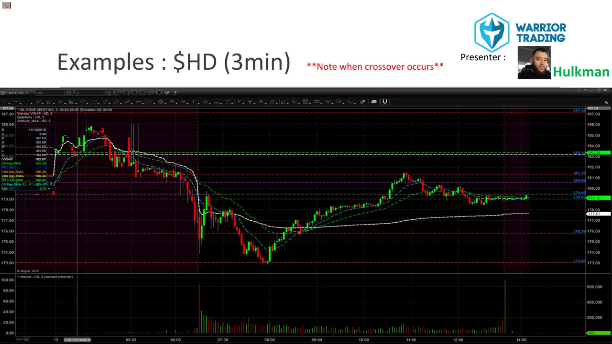

**图怎么看：**

- 幻灯片明确标注“Examples: $HD (3min)”，主体是一张三分钟K线图，下面有成交量区域，图中同时画出多条水平价位和斜向参考线。
- 价格先出现急跌，随后形成低点并逐步修复，右侧反弹后又有回落；均线和水平线帮助区分趋势延续、回踩与前方阻力。
- 这张图适合配合Ace Long阅读，因为它展示了不能只追第一下反弹，而要观察VWAP附近的衰减、恢复以及后续是否仍有参与者承接。
- 单张历史图不能证明Ace Long在相似外观下必然成功；还需核对入场位置、成交量、市场环境和预先定义的止损。

### 关键内容

- 识别 Ace Long 设置的关键在于找到低风险进入点，特别是在市场开盘后。
- 使用 VWAP 衰减和趋势延续来识别潜在的短空挤压。
- 跟随市场参与者的行为，如 Mike 和 Roberto 的策略。
- 在 VWAP 衰减后寻找突破 13 日均线的机会。
- 等待 13 日均线交叉 20 日均线，确认趋势延续。
- 注意初始 VWAP 衰减后的反弹和测试。
- 保持耐心，避免过早进入市场，等待确认信号。
- 使用图表中的双底形态作为参考，但不是必须的。
- 注意成交量与价格走势的一致性。
- 保持低风险操作，止损设在 VWAP 下方。
- 识别 Ace Long 设置需要结合多个技术指标和市场行为

### 分析与执行顺序

1. 首先介绍 Ace Long 设置的基本概念，强调低风险进入点的重要性。
2. 通过 Mike 的 VWAP 衰减和 Roberto 的趋势延续来识别潜在的短空挤压。
3. 展示图表，指出 VWAP 衰减后的突破点和 13 日均线的交叉点。
4. 强调等待确认信号的重要性，避免过早进入市场。
5. 通过实际交易案例展示识别和执行 Ace Long 设置的过程。
6. 总结 Ace Long 设置的关键要素，包括技术指标和市场行为的结合。
7. 回答观众的问题，强调低风险操作和耐心的重要性

### 案例与细节

- 特斯拉 (TSLA) 的交易案例，展示从早晨的短空到趋势延续的过程。
- 亚马逊 (AMZN) 的交易案例，展示从下降趋势到更高的低点和趋势延续的过程。
- 使用图表中的双底形态，但强调这不是必须的，只是参考。
- 展示图表中的成交量分布，强调与价格走势的一致性。
- 通过实际交易案例展示识别和执行 Ace Long 设置的过程，包括从早晨的短空到趋势延续的过程

### 风险与边界

- Ace Long 设置的有效性依赖于市场的波动性和成交量的一致性。
- 初始 VWAP 衰减后的反弹可能是一个假突破，需要耐心等待确认信号。
- 依赖特定技术指标（如 13 日均线）可能会导致过度交易的风险。
- Ace Long 设置主要适用于大型股票，对于小型股票的效果尚不确定。
- 录制年代限制为 2019 年，市场环境和交易规则可能已发生变化

### 复盘问题

- 如何识别 Ace Long 设置中的低风险进入点？
- 在识别 Ace Long 设置时，哪些技术指标最为关键？
- 如何避免过早进入市场并确保信号的确认？

---

## v0421：交易中的情绪管理

> 日期：2019　·　时长：01:02:57

**本场重点：** 情绪管理是交易成功的关键，但需要理解并接受情绪的影响，而不是试图完全消除它们。

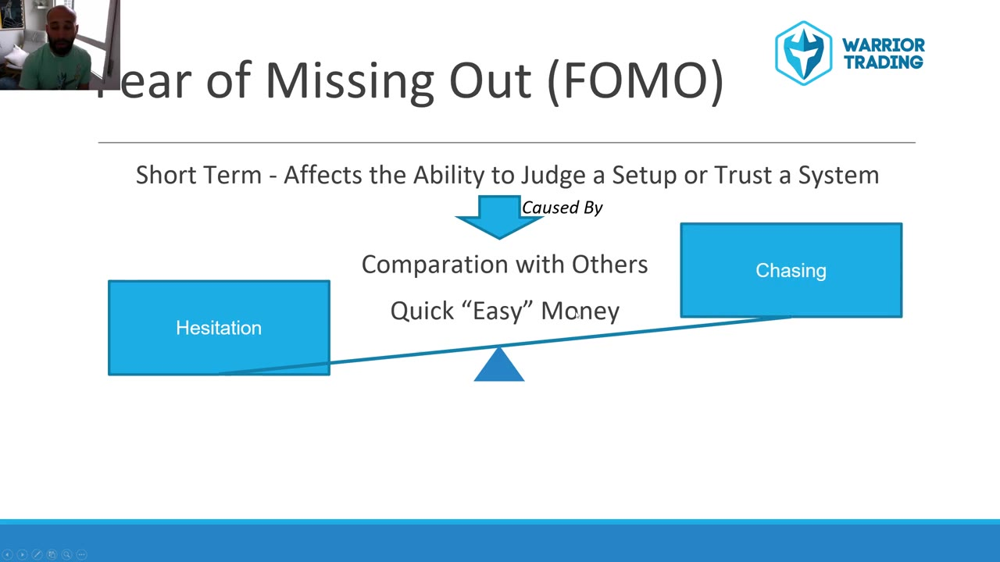

**图怎么看：**

- 这张幻灯片详细描述了交易过程中常见的恐惧和焦虑，如“失败的恐惧”和“错过机会的恐惧”，这些情绪对交易者的表现有直接影响。
- 通过分析这些恐惧的原因，如“小结果”和“短期损失”，以及如何通过健康习惯和制定自己的交易规则来找到平衡，帮助交易者更好地应对这些情绪。
- 幻灯片还强调了理解和接受情绪的重要性，而不是试图完全消除它们，这是交易成功的关键。
- 通过遵循这些建议，交易者可以更好地管理情绪，提高交易表现。

### 关键内容

- 交易中的情绪如恐惧和贪婪是普遍存在的，新手交易者尤其容易受到这些情绪的影响。
- 恐惧和贪婪不仅会影响短期交易决策，还可能影响长期交易策略。
- 理解并接受情绪是关键，而不是试图完全消除它们。
- 建立健康的交易习惯，包括良好的饮食、睡眠和锻炼，有助于提高交易表现。
- 制定自己的交易规则是提高交易信心的重要步骤。
- 衡量自己是否遵守规则比关注盈利结果更重要。
- 原谅自己犯错是重要的，因为每个人都会犯错误。
- 长期目标比短期目标更重要，交易是一个马拉松而非短跑。
- 交易结果不应定义个人身份，而应专注于成为更好的人。
- 使用技术工具（如斐波那契回撤）可以更高效地进行风险管理

### 分析与执行顺序

1. 讲师首先介绍了交易中的情绪管理的重要性，指出恐惧和贪婪是普遍存在的。
2. 接着，讲师详细解释了三种主要的情绪：恐惧、贪婪和失败恐惧，并讨论了它们对交易决策的影响。
3. 然后，讲师提供了应对这些情绪的具体方法，包括建立健康的交易习惯和制定自己的交易规则。
4. 最后，讲师强调了长期目标的重要性，并提醒交易者不要让短期交易结果定义自己。
5. 在整个过程中，讲师通过具体的例子和比喻来说明观点，使听众更容易理解和应用。
6. 讲师还提到了使用技术工具（如斐波那契回撤）来提高交易效率的方法。
7. 讲师最后强调了交易结果不应定义个人身份，而是应该专注于成为更好的人。

### 案例与细节

- 恐惧可能导致交易者过度谨慎，导致不采取任何行动，或者过度交易以弥补损失。
- 贪婪可能导致交易者追逐利润，忽视风险，从而导致过度交易。
- 失败恐惧可能导致交易者过于保守，担心失败，从而影响长期交易策略。
- 一个具体的例子是，交易者看到市场走势突然上涨，可能会感到恐惧，从而选择不采取任何行动。
- 另一个例子是，交易者看到市场走势突然下跌，可能会感到贪婪，从而选择立即采取行动。
- 最后，一个例子是，交易者在制定交易计划时，使用斐波那契回撤工具来确定止损点和目标价格。

### 风险与边界

- 录制于2019年，当时的市场环境和交易规则可能已发生变化。
- 交易者的心理状态和市场情绪变化可能导致不同的情绪反应。
- 交易者需要根据当前市场情况调整自己的交易策略。
- 使用技术工具（如斐波那契回撤）需要结合当前市场情况进行灵活应用。

### 复盘问题

- 恐惧和贪婪分别如何影响交易决策？
- 如何建立健康的交易习惯？
- 制定自己的交易规则有哪些好处？
- 如何衡量自己是否遵守交易规则？
- 长期目标和短期目标之间有什么区别？

---

## v0422：情绪管理在交易中的重要性

> 日期：2019　·　时长：00:59:23

**本场重点：** 情绪管理是交易成功的关键，新手往往忽视心理因素，而专业交易者则注重技术与情感的双重理解。

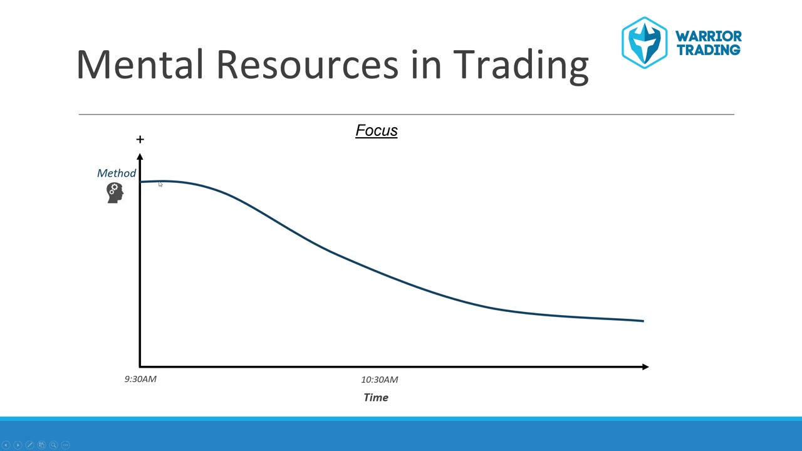

**图怎么看：**

- Miguel Indurain's Case
- 1985 - Quits at the 4th Stage
- 1986 - Quits at the 12th Stage
- 1987 - Finishes in 97th Place

### 关键内容

- 情绪影响交易决策，新手往往过度关注技术理解而忽视情感因素。
- 专业交易者认为技术理解和情感理解同样重要，两者缺一不可。
- 情绪波动会导致交易者偏离既定计划，影响交易结果。
- 交易者的情绪资源会随时间逐渐消耗，影响交易表现。
- 新手在交易初期容易受到情绪影响，导致决策失误。
- 长期来看，情绪管理对于保持交易纪律至关重要。
- 交易者应根据自身情绪状态决定是否进行交易，避免情绪波动影响决策。
- 交易者应建立自己的交易规则，并严格遵守，以减少情绪干扰。
- 交易活动本身不应解决生活中的其他问题，专注于交易本身更为重要

### 分析与执行顺序

1. 讲师首先定义了成功的标准，即持续稳定的盈利。
2. 接着解释了情绪如何影响交易决策，特别是新手更容易受到情绪影响。
3. 通过图表展示了交易者情绪资源随时间逐渐消耗的过程。
4. 进一步讨论了情绪如何影响交易者的决策，特别是在交易过程中。
5. 最后提出了几个关键的交易规则，帮助交易者更好地管理情绪。
6. 通过实例说明了情绪如何影响交易者的行为，例如追涨杀跌。
7. 强调了交易者应建立自己的交易规则，并严格遵守，以减少情绪干扰。
8. 提醒交易者不要将交易活动视为解决生活问题的手段，专注于交易本身

### 案例与细节

- 一位新手交易者在市场开盘后不久就感到情绪紧张，开始频繁操作，最终导致亏损。
- 一位专业交易者在市场开盘后冷静分析，严格按照自己的交易规则操作，最终获得稳定收益。
- 一位交易者在连续几次交易失败后，情绪低落，导致在后续交易中更加谨慎，反而获得了更好的结果。
- 一位交易者在交易过程中不断查看P&L，导致决策犹豫不决，最终错失良机。
- 一位交易者在交易前设定好风险限额，严格执行，避免了因情绪波动而做出错误决策的情况

### 风险与边界

- 录制年代限制，此内容适用于2019年的市场环境。
- 交易者的情绪波动可能因市场变化而有所不同，需灵活调整策略。
- 交易规则的建立需要时间和经验积累，初学者可能难以立即见效。
- 交易者的情绪管理需要长期坚持，短期内难以显著改善交易表现

### 复盘问题

- 交易者在交易过程中遇到情绪波动时，应该如何应对？
- 如何建立一套有效的交易规则，以减少情绪对交易决策的影响？
- 交易者在交易前应如何评估自己的情绪状态，以决定是否进行交易？

---

## v0423：如何找到你的内心交易者

> 日期：2019　·　时长：01:04:10

**本场重点：** 1. 交易者的核心在于找到自己的最佳表达形式；2. 成功的关键在于自我信念和自我接纳；3. 内心交易者的发现是一个个人旅程。

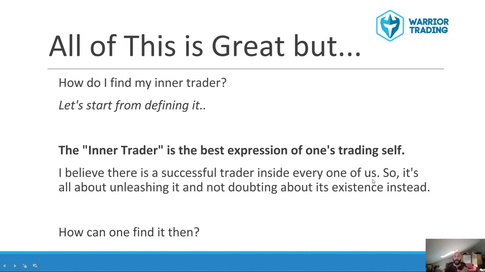

**图怎么看：**

- 画面是一页文字幻灯片，标题为“All of This is Great but...”，紧接着提出“How do I find my inner trader?”，并要求先从定义开始。
- 正文把Inner Trader描述为个人交易自我的最佳表达，重点不是照抄外部策略，而是理解自身在交易中的能力、偏好和真实反应。
- 它直接对应本场主题：寻找内心交易者是自我观察、自我接纳和建立信念的个人过程，不是找到一个所有人通用的固定模板。
- 这页文字是课程框架而非绩效证据；“做自己”也不等于忽略仓位、止损和验证，仍需用记录和样本检验自己的方法。

### 关键内容

- 成功交易的关键在于自我信念和自我接纳，而不是策略本身。
- 内心交易者的发现是一个个人旅程，不应依赖他人。
- 通过设定目标、相信自己是成功的交易者、拥抱结果和享受过程来找到内心交易者。
- 正念冥想和积极肯定等软技能对提高交易表现至关重要。
- 成功交易需要耐心和纪律，这些不是天生具备的，而是需要时间和承诺来培养。
- 内心交易者的发现是一个逐步的过程，不应急于求成。
- 交易者应定期进行自我反思，以提高自我接纳和自我欣赏。
- 成功交易的关键在于找到适合自己的交易策略，而不仅仅是跟随他人的建议。
- 内心交易者的发现需要时间和努力，不应期望立即看到结果

### 分析与执行顺序

1. 讲师首先定义了‘内心交易者’的概念，指出它是交易者最佳表现的体现。
2. 接着，讲师强调了自我信念和自我接纳的重要性，指出成功的关键在于这两点。
3. 然后，讲师列举了一些有助于发现内心交易者的实践方法，如正念冥想和积极肯定。
4. 讲师进一步指出，成功交易需要耐心和纪律，这些不是天生具备的，而是需要时间和承诺来培养。
5. 最后，讲师总结了内心交易者的发现是一个个人旅程，不应依赖他人，而应依靠自己的努力和反思。

### 案例与细节

- 讲师提到，正念冥想可以帮助交易者保持当下的专注，减少焦虑。
- 积极肯定的例子包括每天对自己说一些正面的话语，如“我是成功的交易者”，以增强自信。
- 讲师分享了一个具体的案例，即通过回顾股票的历史表现来判断其是否适合交易。
- 讲师建议初学者设置1%的仓位作为风险控制，但强调每个人的风险偏好不同。
- 讲师提到，成功交易的关键在于找到适合自己的交易策略，而不仅仅是跟随他人的建议。
- 讲师强调，内心交易者的发现需要时间和努力，不应期望立即看到结果。

### 风险与边界

- 录制于2019年，部分市场规则和操作环境可能已发生变化。
- 讲师提到的某些工具和平台可能不再适用，需根据当前情况进行调整。
- 成功交易的关键在于自我信念和自我接纳，这需要长期的努力和实践。
- 内心交易者的发现是一个个人旅程，不应期望立即看到结果，需要时间和耐心。

### 复盘问题

- 你如何定义自己的内心交易者？
- 在发现内心交易者的过程中，哪些实践对你最有帮助？
- 如何将正念冥想和积极肯定融入日常交易中？
- 成功交易的关键是什么？
- 你如何平衡自我接纳和自我批评？

---

## v0424：日内交易策略与风险管理

> 日期：2019　·　时长：02:07:21

**本场重点：** 今天主要关注TMSR股票的交易机会，但市场表现不佳，最终未能实现预期收益。

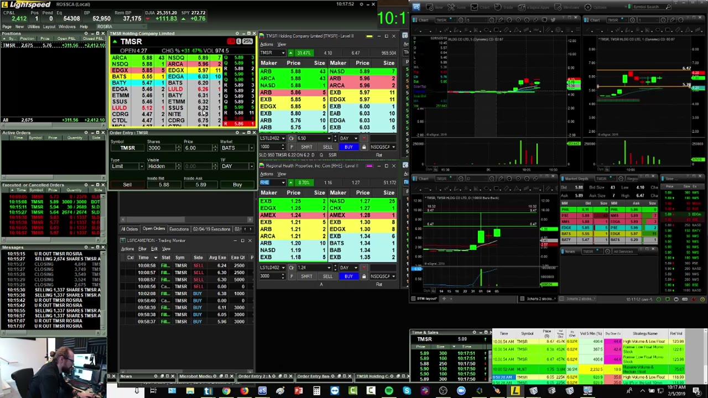

**图怎么看：**

- 在 WORX 的交易界面中，可以看到实时的股票价格、成交量和订单情况。
- 界面左侧显示了当前的订单状态和历史交易记录。
- 右侧的图表显示了股票的价格走势和成交量变化。
- 用户可以查看不同时间段的K线图，分析股票的趋势和波动性。

### 关键内容

- TMSR股票在暂停交易后表现不佳，未能突破关键阻力位。
- 市场暂停交易时，可以设置订单以捕捉市场反弹机会。
- 市场暂停交易期间，需要密切关注市场反应和价格走势。
- TMSR股票的五分钟图表显示了ABC模式，但未能有效突破。
- 市场暂停交易时，可以利用时间差进行交易，但需注意风险。
- TMSR股票在暂停交易前表现出较大波动，从5.26美元涨至6.47美元，显示出市场情绪不稳定。
- TMSR股票的高点为6.47美元，低点为5.26美元，显示出较大的波动性，表明市场参与者对这只股票兴趣浓厚。
- TMSR股票的五分钟图表显示了ABC模式，但未能有效突破，说明市场缺乏持续上涨的动力。
- TMSR股票在暂停交易期间未能突破关键阻力位，显示出市场信心不足，投资者对这只股票的前景持谨慎态度。
- TMSR股票的高点为6.47美元，低点为5.26美元，显示出较大的波动性，表明市场参与者对该股的买卖意愿强烈

### 分析与执行顺序

1. 查看TMSR股票的实时交易情况，发现其价格在暂停交易前有所波动。
2. 设置订单以捕捉市场暂停后的反弹机会，但实际效果不佳。
3. 观察TMSR股票的五分钟图表，发现其形成了ABC模式，但未能有效突破。
4. 在市场暂停交易期间，密切关注TMSR股票的价格走势和市场反应。
5. 最终，TMSR股票未能突破关键阻力位，导致交易策略未能实现预期收益。

### 案例与细节

- TMSR股票在暂停交易后，价格从5.26美元上涨到6.47美元，但未能有效突破。
- 在市场暂停交易期间，TMSR股票的五分钟图表显示了ABC模式，但未能有效突破。
- TMSR股票的高点为6.47美元，低点为5.26美元，显示出较大的波动性。
- 在市场暂停交易期间，TMSR股票的价格波动较大，最高达到6.47美元，最低跌至5.26美元。
- TMSR股票的五分钟图表显示了ABC模式，但未能有效突破，显示出市场缺乏持续上涨的动力。
- TMSR股票在暂停交易前，价格从5.26美元上涨到6.47美元，显示出市场情绪波动大，投资者对该股兴趣浓厚。
- 在市场暂停交易期间，TMSR股票的五分钟图表显示了ABC模式，但未能有效突破，显示出市场缺乏持续上涨的动力。
- TMSR股票的高点为6.47美元，低点为5.26美元，显示出较大的波动性，表明市场参与者对该股的买卖意愿强烈，但最终未能实现预期收益
- TMSR股票在暂停交易前，价格从5.26美元上涨到6.47美元，显示出市场情绪波动大，投资者对该股兴趣浓厚，但最终未能突破关键阻力位
- 在市场暂停交易期间，TMSR股票的五分钟图表显示了ABC模式，但未能有效突破，显示出市场缺乏持续上涨的动力，投资者对该股前景持谨慎态度

### 风险与边界

- 市场暂停交易期间，无法实时监控所有股票的表现，存在信息不对称的风险。
- TMSR股票的高点为6.47美元，低点为5.26美元，显示出较大的波动性，增加了交易风险。
- 市场暂停交易期间，需要密切关注市场反应和价格走势，否则可能错失最佳交易机会。
- TMSR股票在暂停交易期间未能突破关键阻力位，显示出市场信心不足，投资者对该股的前景持谨慎态度，增加了交易风险。
- TMSR股票的高点为6.47美元，低点为5.26美元，显示出较大的波动性，增加了交易风险，可能导致投资者亏损。
- TMSR股票在暂停交易期间未能突破关键阻力位，显示出市场信心不足，投资者对该股的前景持谨慎态度，增加了交易风险，可能导致投资者亏损
- TMSR股票的高点为6.47美元，低点为5.26美元，显示出较大的波动性，增加了交易风险，可能导致投资者因市场情绪波动而亏损

### 复盘问题

- 在市场暂停交易期间，如何更好地利用时间差进行交易？
- TMSR股票的五分钟图表显示了ABC模式，但未能有效突破，这反映了哪些市场因素？
- 在市场暂停交易期间，如何评估和管理交易风险？

---

## v0425：使用交易模拟器进行实战练习

> 日期：2019　·　时长：00:58:03

**本场重点：** 通过交易模拟器练习交易技能，了解市场运作机制，提高交易效率。

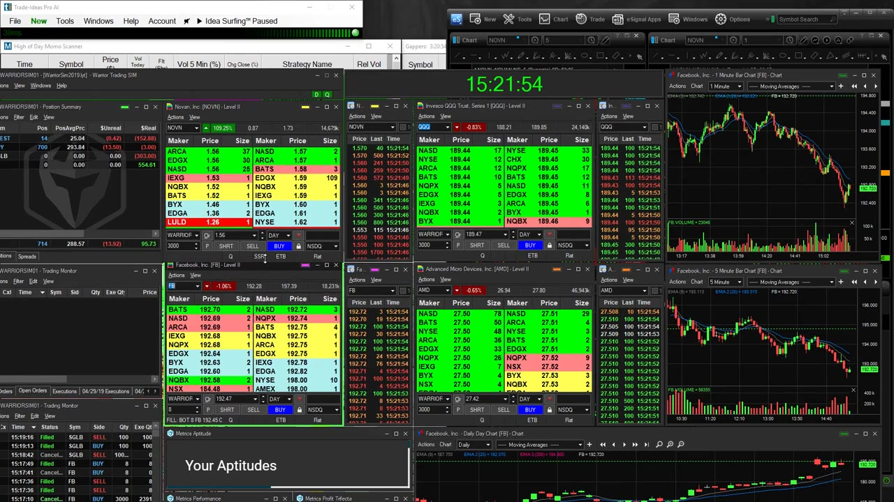

**图怎么看：**

- 在 Level 2 监控窗口中，可以看到多个股票的实时报价和成交量。
- 每个股票都有一个 Maker（买方）和一个 Maker（卖方）的价格和数量。
- 实时交易数据包括当前价格、最新价格、成交量等。
- 这些数据对于分析市场动态和制定交易策略至关重要。

### 关键内容

- 交易模拟器用于练习交易技能，帮助新手快速积累经验。
- 设置界面时，应将常用窗口放在显眼位置，如订单窗口和水平二窗口。
- 使用快捷键进行买卖操作，提高交易速度。
- 交易模拟器中的费用计算方式与真实交易相似，有助于训练成本意识。
- 通过交易模拟器练习，可以更好地理解市场波动和交易策略。
- 交易模拟器中的图表和数据与真实交易环境相似，但存在一些差异。
- 使用交易模拟器时，需要关注市场动态和交易时机。
- 交易模拟器中的订单和执行记录可以帮助用户回顾和分析交易过程。
- 交易模拟器中的时间线和价格走势可以帮助用户更好地理解市场趋势。
- 交易模拟器中的交易记录可以作为用户学习和改进交易策略的参考

### 分析与执行顺序

1. 首先，打开交易模拟器并设置界面布局，包括订单窗口和水平二窗口。
2. 然后，设置常用的快捷键，如购买和出售的操作。
3. 接着，通过模拟交易练习，积累实际交易的经验。
4. 最后，利用交易模拟器中的记录和分析工具，优化交易策略。
5. 在交易模拟器中，设置不同的交易情景，以适应不同市场环境。
6. 通过交易模拟器，可以测试不同的交易策略，评估其效果。
7. 在交易模拟器中，可以模拟真实的交易环境，提高交易技能

### 案例与细节

- 讲师展示了如何设置交易模拟器的界面布局，包括订单窗口和水平二窗口。
- 讲师演示了如何使用快捷键进行买卖操作，如使用Shift+1进行买入，Ctrl+Z进行卖出。
- 讲师通过模拟交易，展示了如何在交易模拟器中进行买卖操作，并记录交易过程。
- 讲师展示了如何查看交易模拟器中的订单和执行记录，以便分析交易过程。
- 讲师通过交易模拟器中的图表和数据，展示了如何理解市场波动和交易策略

### 风险与边界

- 交易模拟器中的市场数据与真实市场可能存在差异，需注意区分。
- 交易模拟器中的交易费用计算方式可能与真实交易有所不同，需注意。
- 交易模拟器中的交易记录可能无法完全反映真实交易中的所有细节。
- 交易模拟器中的交易环境与真实交易环境可能存在差异，需注意适应。
- 交易模拟器中的交易策略测试结果可能受到模拟环境的影响，需谨慎解读

### 复盘问题

- 交易模拟器中的界面布局是如何设置的？
- 交易模拟器中的快捷键是如何配置的？
- 交易模拟器中的交易记录如何帮助用户分析交易过程？
- 交易模拟器中的市场数据与真实市场有何不同？
- 交易模拟器中的交易费用计算方式与真实交易有何差异？

---

## v0426：交易回顾的重要性

> 日期：2019　·　时长：00:58:19

**本场重点：** 交易回顾是提高交易技能的关键，通过回顾可以发现自己的不足并改进。

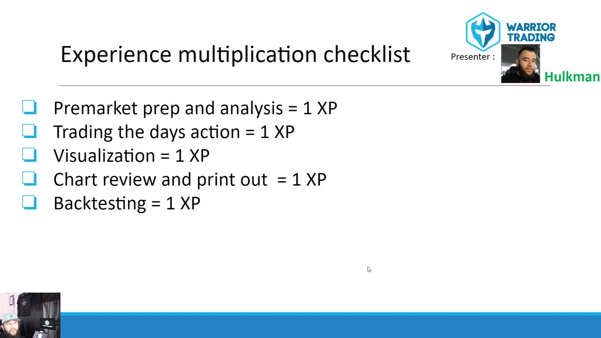

**图怎么看：**

- 这张幻灯片列出了交易经验倍增的检查清单，包括预市场准备和分析、交易当天的动作、可视化、图表审查和打印以及回测。
- 每个步骤都对应1个经验点（XP），表明这些活动对提升交易技能至关重要。
- 通过这个清单，交易者可以系统地评估和优化他们的交易流程。
- 这有助于交易者在多个方面进行自我反思和改进，从而提高整体交易表现。

### 关键内容

- 交易回顾可以帮助交易者从外部视角审视自己的交易行为。
- 通过回顾可以发现自己的情绪波动和决策失误，从而改进。
- 交易者需要每天进行交易回顾，以保持交易技能的提升。
- 交易回顾包括自我对话、可视化、图表审查等步骤。
- 交易者可以通过记录交易视频来更好地进行交易回顾。
- 交易回顾有助于减少交易中的情绪波动，提高交易效率。
- 交易者需要关注相对成交量和市场情绪的变化。
- 交易回顾需要结合实际交易经验，不断调整和完善。
- 交易者应该将交易回顾作为日常流程的一部分，而不是偶尔进行。
- 交易回顾能够帮助交易者识别交易中的模式和趋势

### 分析与执行顺序

1. 交易者每天进行自我对话，包括自我激励和设定目标。
2. 交易者在交易前进行可视化练习，想象自己成功完成交易。
3. 交易者记录交易视频，并在交易后进行回顾。
4. 交易者通过回顾交易视频，发现自己的错误和改进点。
5. 交易者在交易回顾中关注市场情绪和相对成交量的变化。
6. 交易者通过交易回顾，调整自己的交易策略和方法。
7. 交易者将交易回顾作为日常流程的一部分，持续改进自己的交易技能

### 案例与细节

- 在特斯拉交易中，交易者通过记录交易视频，发现自己的情绪波动和决策失误。
- 交易者通过回顾交易视频，发现自己的交易策略存在缺陷，需要调整。
- 交易者在交易回顾中，发现自己的交易决策过于依赖市场情绪，需要改进。
- 交易者通过记录交易视频，发现自己的交易策略在不同市场环境下表现不同。
- 交易者在交易回顾中，发现自己的交易决策过于依赖图表形态，需要更加客观

### 风险与边界

- 交易回顾需要结合实际交易经验，否则可能无法发现真正的改进点。
- 交易者需要每天进行交易回顾，否则可能无法持续改进自己的交易技能。
- 交易回顾需要结合市场变化和自身情绪，否则可能无法发现真正的问题。
- 交易者需要使用合适的工具进行交易回顾，否则可能无法准确发现自己的错误。

### 复盘问题

- 你在交易回顾中发现了哪些错误？
- 你如何通过交易回顾改进你的交易策略？
- 你在交易回顾中发现哪些情绪波动？

---

## v0427：五月交易总结与策略回顾

> 日期：2019　·　时长：00:53:12

**本场重点：** 总结五月交易表现，识别成功与失败的关键因素，并提出改进策略。

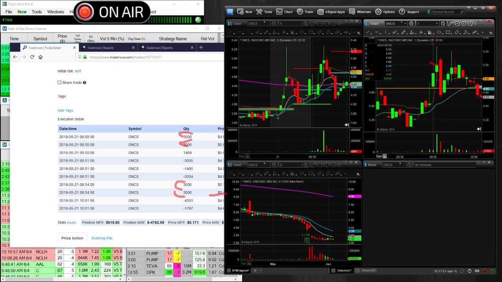

**图怎么看：**

- 整体界面显示了交易报告和图表分析。
- 实际可见的ticker为ONCS，周期为D（动态）。
- 画面信息对应本场主题，展示了交易表现、成功与失败的关键因素及改进策略。
- 这张截图不能单独证明什么，阅读时应避免对具体数字进行猜测。

### 关键内容

- 五月总体表现较好，但与前三个月相比，盈利减少。
- 大额交易导致佣金较高，影响盈利能力。
- 五月亏损主要集中在特定股票，如NVAX。
- 交易策略包括追涨和快速获利，但需注意风险。
- 使用Level 2和时间销售功能提高交易效率。
- 五月交易数据表明，盈利主要来自5到10美元区间的股票。
- 交易量大可能导致滑点增加，影响盈利。
- 需要关注股票的反向拆分和异常交易量。
- 保持交易一致性，避免过度自信导致的错误。
- 记录交易笔记有助于改进未来策略

### 分析与执行顺序

1. 回顾五月交易数据，识别盈利和亏损的股票。
2. 分析大额交易对盈利的影响，以及佣金成本。
3. 讨论五月亏损的主要原因，特别是NVAX的交易。
4. 总结交易策略，包括追涨和快速获利的方法。
5. 强调使用Level 2和时间销售功能的重要性。
6. 记录交易笔记，以便后续分析和改进

### 案例与细节

- NVAX在五月14日出现亏损，因为当天进行了反向拆分，导致股票浮动物资延迟更新。
- BLIN在五月表现出色，贡献了约20,000美元的利润，成为最大的赢家。
- 五月交易数据显示，大部分利润来自5到10美元区间的股票。
- 交易策略包括在股票突破后立即买入，然后在价格上升时卖出。
- 五月交易中，交易量大导致滑点增加，影响了盈利

### 风险与边界

- 大额交易虽然能带来高收益，但也可能增加滑点和风险。
- 反向拆分和异常交易量可能导致交易信号失真，需谨慎处理。
- 交易策略的成功依赖于市场环境的变化，需持续监控。
- 交易记录显示，2018年和2019年的市场环境有所不同，需适应当前市场变化

### 复盘问题

- 五月交易中哪些股票表现最好？
- 如何通过交易笔记改进未来的交易策略？
- 大额交易对盈利有何影响？
- 如何利用Level 2和时间销售功能提高交易效率？
- 五月交易中有哪些关键失误需要避免？

---

## v0428：止损与小盘股交易

> 日期：2019　·　时长：00:52:21

**本场重点：** 止损设置对于小盘股交易至关重要，合理设置可以提高胜率，但需注意市场波动性。

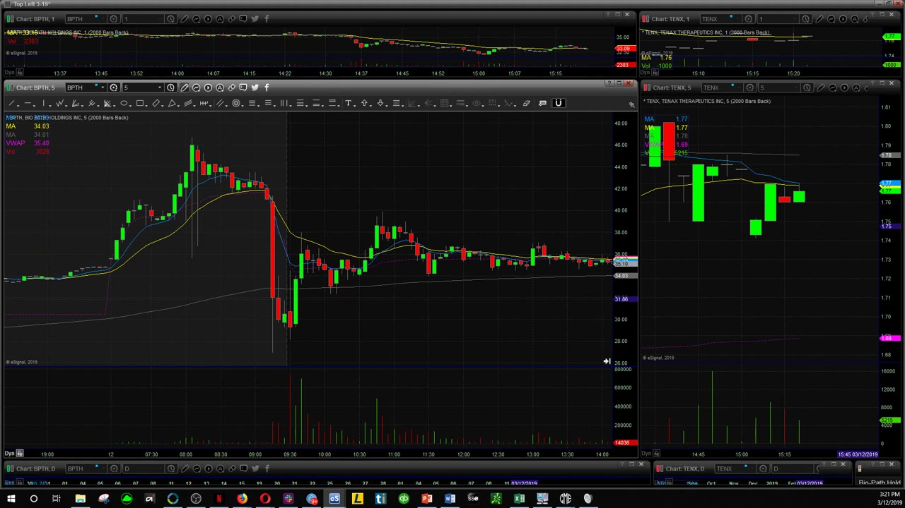

**图怎么看：**

- 在BPTN的5分钟周期图表中，可以看到价格在上升趋势中，成交量也有所增加。
- 图表上显示了多个均线，其中黄色的均线显示出当前的趋势。
- 成交量柱的高度反映对应周期内的总成交量；红绿着色通常跟随价格柱的涨跌规则，不能直接拆成两种方向的主动成交。
- 通过观察这些图表，投资者可以更好地理解市场的动态，并做出相应的交易决策。

### 关键内容

- ALQA股票在日线图上突破后，出现了一个小平顶，表明可能有进一步的上涨。
- 止损设置为前一根蜡烛的低点，确保在突破后有合理的盈利目标。
- 在突破后的第一个目标是加仓到盈亏比为2:1。
- 在NDRA股票中，一分钟后出现了一些混乱，导致需要切换到五分钟图进行更详细的分析。
- 在BPTH股票中，由于价格波动较大，需要设置较宽的止损，以应对市场的快速变化。
- 在交易中，需要关注市场波动性，合理设置止损，以减少亏损的风险

### 分析与执行顺序

1. 首先，识别日线图上的突破点，并确定初始的止损位置。
2. 然后，在突破后的第一个目标是加仓到盈亏比为2:1。
3. 当价格达到目标时，将止损调整为盈亏平衡点，以锁定部分利润。
4. 在交易过程中，使用心理止损可以帮助快速调整策略，避免过度交易。
5. 在使用SureTrader时，需要关注订单执行情况，及时调整策略以应对市场变化。

### 案例与细节

- ticker：ALQA；price：282；stop_loss：274；target：16-20 cents；process：突破282后，止损设为274，目标为16-20 cents。
- ticker：MCRB；price：642；stop_loss：642；target：750；process：五分钟后突破642，止损设为642，目标为750。
- ticker：BPTH；price：3730；stop_loss：3730；target：42；process：突破3730后，止损设为3730，目标为42。

### 风险与边界

- 在市场波动较大的情况下，止损设置可能会失效，导致亏损增加。
- 在使用SureTrader时，由于智能路由的问题，可能导致订单执行失败，影响交易结果。
- 在交易中，需要根据市场情况灵活调整止损，以适应不同的市场环境。
- 在交易过程中，需要关注市场波动性，合理设置止损，以减少亏损的风险。

### 复盘问题

- 在交易过程中，如何确定止损的位置？
- 在使用SureTrader时，遇到订单执行失败的情况应该如何处理？
- 在交易中，如何根据市场情况灵活调整止损？

---

## v0429：TradingView简介及自定义指标

> 日期：2019　·　时长：01:17:09

**本场重点：** 介绍TradingView平台及其自定义指标，强调简化和个性化的重要性。

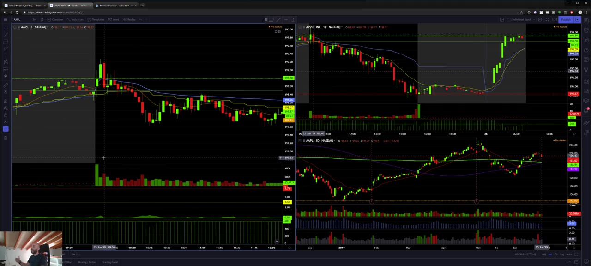

**图怎么看：**

- 这张图片显示了AAPL在纳斯达克市场的每日移动平均线（MA）和日线图。
- 可以看到股价在不同时间段内的波动情况，以及移动平均线对价格趋势的指示。
- 日线图上还显示了成交量柱状图，帮助分析市场活跃度。
- 通过观察这些图表，投资者可以更好地理解股票的价格动态和潜在的趋势。

### 关键内容

- 讲师使用TradingView替代了之前使用的e-signal平台，认为它更便宜且更适合自己的交易风格。
- 自定义指标包括每日移动平均线、扩展会话高点和低点、短卖限制价格等，帮助简化决策过程。
- 使用Pinescript编写自定义指标，以适应个人交易策略。
- 通过风险回报工具（如斐波那契回撤）来设定交易目标，确保交易计划的合理性。
- 使用EMA（指数移动平均线）和VWAP（成交量加权平均价）等技术指标，帮助识别市场趋势。
- 通过调整图表设置（如字体大小和颜色），使交易界面更加直观。
- 使用自定义指标和工具来简化交易流程，提高交易效率。
- 强调个性化设置的重要性，以适应个人交易风格和需求。
- 通过实际案例展示如何使用这些自定义指标进行交易决策。
- 提醒用户，这些指标和工具适用于历史录制内容，可能需要根据当前市场情况进行调整。

### 分析与执行顺序

1. 讲师首先介绍了自己从e-signal切换到TradingView的原因，包括成本效益和更适合自己的交易风格。
2. 接着，讲师展示了如何使用TradingView的自定义指标和工具来简化交易流程，包括设置移动平均线、扩展会话高点和低点等。
3. 然后，讲师详细讲解了如何使用Pinescript编写自定义指标，以适应个人交易策略。
4. 最后，讲师分享了如何使用风险回报工具（如斐波那契回撤）来设定交易目标，并通过实际案例展示了如何应用这些指标进行交易决策。
5. 在整个过程中，讲师强调了个性化设置的重要性，以适应个人交易风格和需求。

### 案例与细节

- 讲师使用了3分钟和10分钟的时间框架，结合13EMA（13周期指数移动平均线）和100SMA（100周期简单移动平均线）来简化交易图表。
- 通过设置风险回报比（如1.5:1和2.5:1），讲师演示了如何在交易中应用这些指标来设定合理的止损和目标位。
- 讲师展示了如何使用扩展会话高点和低点指标来识别市场的重要支撑和阻力水平，从而更好地规划交易策略。
- 通过调整图表设置（如字体大小和颜色），讲师展示了如何使交易界面更加直观，便于快速做出决策。
- 讲师使用了短卖限制价格指标来识别特定股票的短卖限制价格，从而避免在市场异常波动时进行不必要的交易。

### 风险与边界

- 录制于2018-2021年，市场情况可能已发生变化，用户需根据当前市场情况进行适当调整。
- 使用自定义指标和工具时，需注意市场波动和突发事件可能导致指标失效。
- 风险回报工具（如斐波那契回撤）仅作为参考，实际交易中需结合其他因素进行综合判断。
- 使用扩展会话高点和低点指标时，需关注市场流动性，避免在流动性不足的情况下进行交易。

### 复盘问题

- 如何使用Pinescript编写自定义指标？
- 如何通过风险回报工具设定合理的交易目标？
- 如何根据个人交易风格调整TradingView的图表设置？

---
